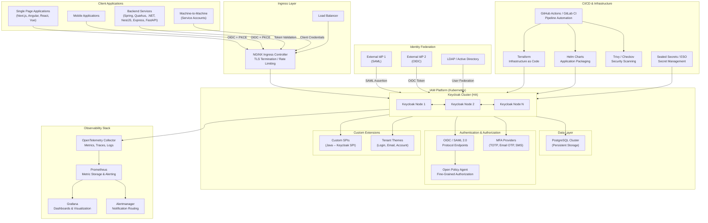

# Enterprise IAM Infrastructure with Keycloak

A comprehensive, production-ready reference architecture for building enterprise-grade Identity and Access Management (IAM) infrastructure using Keycloak and modern DevOps tooling.

---

## Table of Contents

- [Why This Project Exists](#why-this-project-exists)
  - [The Temptation to Build from Scratch](#the-temptation-to-build-from-scratch)
  - [Why Keycloak](#why-keycloak)
  - [Compliance and Certification Alignment](#compliance-and-certification-alignment)
- [Architecture Overview](#architecture-overview)
- [What This Repository Provides](#what-this-repository-provides)
- [Working Examples](#working-examples)
- [Technology Stack](#technology-stack)
- [Getting Started](#getting-started)
- [Project Structure](#project-structure)
- [License](#license)
- [Contributing](#contributing)
- [Disclaimer](#disclaimer)

### Documentation

| # | Document | Description |
|---|----------|-------------|
| 00 | [Overview](doc/00-overview.md) | Project index, technology stack, three-phase delivery model |
| 01 | [Target Architecture](doc/01-target-architecture.md) | High-level architecture, design principles, HA, DR |
| 02 | [Analysis and Design](doc/02-analysis-and-design.md) | Requirements, data models, authentication flows, threat model |
| 03 | [Transformation and Execution](doc/03-transformation-execution.md) | Implementation roadmap, sprint plan, testing, go-live |
| 04 | [Keycloak Configuration](doc/04-keycloak-configuration.md) | Realms, clients, IdPs, authentication flows, tokens |
| 05 | [Infrastructure as Code](doc/05-infrastructure-as-code.md) | Terraform modules, Kubernetes resources, Docker, Helm |
| 06 | [CI/CD Pipelines](doc/06-cicd-pipelines.md) | GitHub Actions, GitLab CI, branching, rollback |
| 07 | [Security by Design](doc/07-security-by-design.md) | OWASP, pod security, OPA, secrets, TLS, audit |
| 08 | [Authentication and Authorization](doc/08-authentication-authorization.md) | OIDC, SAML, JWT, MFA, RBAC, OPA |
| 09 | [User Lifecycle](doc/09-user-lifecycle.md) | Provisioning, credentials, sessions, deprovisioning, GDPR |
| 10 | [Observability](doc/10-observability.md) | OpenTelemetry, Prometheus, Grafana, alerting, SLI/SLO |
| 11 | [Keycloak Customization](doc/11-keycloak-customization.md) | Themes, SPIs, email templates, REST endpoints |
| 12 | [Environment Management](doc/12-environment-management.md) | Dev, QA, Prod environments, promotion, cost optimization |
| 13 | [Automation and Scripts](doc/13-automation-scripts.md) | Runbooks, kcadm, REST API, CronJobs |
| 14 | [Client Applications Hub](doc/14-client-applications.md) | Integration hub linking to per-framework guides |
| 14-01 | [Spring Boot 3.4](doc/14-01-spring-boot.md) | Java 17 resource server, method security, token relay |
| 14-02 | [ASP.NET Core](doc/14-02-dotnet.md) | .NET 9 JWT Bearer, policy-based authorization |
| 14-03 | [NestJS 10](doc/14-03-nestjs.md) | Passport JWT, guards, decorators, Swagger |
| 14-04 | [Express](doc/14-04-express.md) | Node.js 22 middleware, jose token validation |
| 14-05 | [FastAPI](doc/14-05-python-fastapi.md) | Python 3.12, OpenAPI integration, python-keycloak |
| 14-06 | [Next.js 15](doc/14-06-nextjs.md) | NextAuth v5, App Router, server/client components |
| 14-07 | [Angular 19](doc/14-07-angular.md) | angular-auth-oidc-client, guards, interceptors |
| 14-08 | [React 19](doc/14-08-react.md) | oidc-client-ts, react-oidc-context, protected routes |
| 14-09 | [Vue 3.5](doc/14-09-vue.md) | Pinia auth store, router guards, Axios interceptor |
| 14-10 | [Quarkus 3.17](doc/14-10-quarkus.md) | Java 17 resource server, native compilation, Dev Services |

### Project Planning

| Document | Description |
|----------|-------------|
| [Planning Overview](planning/README.md) | How to use the planning documents, current status, key decisions |
| [Project Context](planning/project-context.md) | Full project background, stakeholders, technical details |
| [Phase 1 - Target Architecture](planning/phase-1-target-architecture.md) | Task breakdown and checklist for architecture definition |
| [Phase 2 - Analysis and Design](planning/phase-2-analysis-design.md) | Task breakdown for AS-IS analysis and design activities |
| [Phase 3 - Execution](planning/phase-3-execution.md) | Task breakdown for migration, implementation, go-live |
| [Progress Tracker](planning/progress-tracker.md) | Milestones, decision log, risk register, session log |

---

## Why This Project Exists

In virtually every enterprise software architecture, there comes a point where a centralized Identity and Access Management (IAM) system becomes a necessity. Whether the organization operates a single monolithic application or a distributed ecosystem of microservices, APIs, and third-party integrations, the need for a robust, standards-compliant identity layer is universal.

### The Temptation to Build from Scratch

It is remarkably common for engineering teams to consider building their own authentication and authorization system. On the surface, it seems straightforward: a user table, password hashing, a few JSON Web Tokens (JWT), and some role checks in the middleware. However, this approach consistently leads to the same set of problems:

- **Underestimating the scope.** A production-grade IAM system must handle session management, token lifecycle, credential rotation, multi-factor authentication (MFA), federation protocols, brute force protection, account lockout policies, audit logging, consent management, and dozens of other concerns that only become apparent once the system is in production.

- **Security vulnerabilities.** Identity is the most attacked surface in any application. Custom implementations inevitably miss edge cases that established projects have already discovered and patched across thousands of deployments.

- **Ongoing maintenance burden.** Security standards evolve. Protocols are updated. New attack vectors emerge. A custom IAM system becomes a permanent maintenance obligation that competes with product development for engineering resources.

- **Compliance and certification gaps.** Enterprise clients, auditors, and regulatory bodies expect identity systems to conform to recognized standards and frameworks. A custom implementation lacks the third-party validation, documentation, and track record that established platforms provide.

### Why Keycloak

Keycloak is an open-source Identity and Access Management solution maintained by Red Hat and backed by a large, active community. It has been deployed in production across thousands of organizations, from startups to Fortune 500 enterprises. Choosing Keycloak over a custom implementation provides several critical advantages:

**Standards compliance and protocol support**

- OpenID Connect (OIDC) 1.0 certified implementation
- Security Assertion Markup Language (SAML) 2.0 support
- OAuth 2.0 with all major grant types, including Device Authorization and Token Exchange
- Standard token formats (JWT) with configurable claims
- LDAP and Active Directory federation
- Social identity provider integration

**Security by design**

- Brute force detection and account lockout
- Configurable password policies with history enforcement
- Multi-factor authentication (TOTP, WebAuthn, email OTP, SMS OTP)
- Session management with idle and absolute timeouts
- Token revocation and backchannel logout
- Content Security Policy (CSP) headers and CORS configuration
- Regular security audits by Red Hat and the community

**Enterprise readiness**

- High availability with active-active clustering
- Multi-tenancy through isolated Realms
- Extensible architecture via Service Provider Interfaces (SPI)
- Full admin REST API for automation
- Theme customization for per-tenant branding
- Event system for audit trails and integrations
- Database support for PostgreSQL, MySQL, MariaDB, Oracle, and Microsoft SQL Server

**Operational maturity**

- Container-native (Quarkus-based since version 17)
- Helm charts for Kubernetes deployment
- Terraform provider for configuration as code
- OpenTelemetry instrumentation for observability
- Built-in health checks and readiness probes
- Export/import for environment promotion

### Compliance and Certification Alignment

One of the most overlooked advantages of adopting an established IAM platform like Keycloak is the alignment it provides with industry compliance frameworks and security assessments. Organizations that build custom identity systems often discover during audit preparation that they lack the documentation, controls, and evidence that assessors expect.

Keycloak, particularly the Red Hat Build of Keycloak, provides a foundation that maps directly to the requirements of the following compliance frameworks and security assessments:

| Framework / Assessment | Relevance to IAM |
|------------------------|------------------|
| **SOC 2 Type II** | Access controls, authentication policies, session management, audit logging |
| **ISO/IEC 27001:2022** | Information security management, access control (Annex A.9), cryptography, operations security |
| **ISO/IEC 27017:2015** | Cloud-specific security controls for identity and access management |
| **GDPR (EU)** | Consent management, right to be forgotten, data minimization, lawful processing |
| **NIST SP 800-63** | Digital identity guidelines: identity proofing, authentication assurance levels, federation |
| **NIST Cybersecurity Framework (CSF)** | Identify, Protect, Detect functions; access control category |
| **PCI DSS v4.0** | Strong access control measures, MFA requirements, credential management |
| **HIPAA** | Access controls, audit controls, authentication mechanisms for electronic health information |
| **FedRAMP** | Federal identity and access management requirements; MFA, federation, continuous monitoring |
| **CIS Controls v8** | Control 5 (Account Management), Control 6 (Access Control Management) |
| **OWASP ASVS v4.0** | Application Security Verification Standard: authentication, session management, access control |
| **eIDAS (EU)** | Electronic identification and trust services; authentication assurance levels |

Using Keycloak provides auditable, documented, and standards-based implementations for each of these areas, significantly reducing the effort required to pass assessments and obtain certifications.

---

## Architecture Overview

The following diagram illustrates the target architecture that this project implements. Every component is documented in detail across the project documentation, with working configuration examples and deployment manifests.



### Component Overview

**Keycloak Cluster.** The core identity provider, deployed in high-availability mode across multiple nodes with active-active clustering via Infinispan. Handles all authentication, authorization, session management, and token issuance. Each tenant operates within an isolated Realm with independent configuration, users, roles, and themes.

**PostgreSQL.** The persistent backend for Keycloak, storing all realm configurations, user data, credentials, sessions, and audit events. Deployed as a high-availability cluster with automated backups and point-in-time recovery.

**NGINX Ingress Controller.** Manages external traffic routing, TLS termination with certificates issued by cert-manager, rate limiting, and request filtering. Serves as the single entry point for all client applications.

**Open Policy Agent (OPA).** Provides fine-grained, policy-as-code authorization that goes beyond Keycloak's built-in role-based access control. Policies are written in Rego and distributed as bundles, enabling decisions based on user attributes, resource ownership, time-of-day restrictions, and tenant-specific rules.

**MFA Providers.** Multi-factor authentication support including Time-based One-Time Password (TOTP) compatible with Microsoft Authenticator and Google Authenticator, email-based OTP, and SMS-based OTP via Twilio integration through a custom Keycloak SPI.

**Custom SPIs.** Service Provider Interface extensions (Java 17, required by Keycloak's plugin architecture) that allow Keycloak's behavior to be customized without modifying its source code. This project includes examples for custom authenticators, event listeners, protocol mappers, and REST endpoint extensions.

**Tenant Themes.** Per-realm customization of login pages, email templates, and the account management console. Themes are packaged into the Keycloak Docker image at build time and assigned to specific realms, enabling white-label deployments for B2B scenarios.

**Identity Federation.** Support for federating identities from external Identity Providers (IdPs) using SAML 2.0 and OpenID Connect, as well as direct user federation with LDAP and Active Directory. Includes Just-In-Time (JIT) provisioning for automatic user creation on first login.

**OpenTelemetry Collector.** Receives metrics, traces, and logs from Keycloak and all surrounding services. Exports telemetry data to Prometheus for metrics, optionally to Jaeger for distributed tracing, and to Loki for centralized log aggregation.

**Prometheus and Grafana.** Prometheus scrapes metrics from the OpenTelemetry Collector and Keycloak's built-in metrics endpoint, evaluates alerting rules, and stores time-series data. Grafana provides pre-built dashboards for authentication performance, security events, infrastructure health, and SLI/SLO tracking.

**Terraform.** Manages the entire infrastructure declaratively, including the Kubernetes cluster, namespaces, network policies, database provisioning, and Keycloak realm configuration via the Terraform Keycloak provider. Separate state files and variable sets are maintained for each environment (dev, QA, prod).

**Helm Charts.** Package the Keycloak deployment, PostgreSQL cluster, and observability stack into versioned, parameterized charts with per-environment values files. Helm manages the full application lifecycle including upgrades and rollbacks.

**CI/CD Pipelines.** GitHub Actions and GitLab CI pipeline definitions automate infrastructure provisioning, Docker image building, security scanning (Trivy for container images, Checkov for IaC), Keycloak realm configuration deployment, and environment promotion from dev through QA to production.

**Secret Management.** Kubernetes Secrets encrypted at rest, with Sealed Secrets (Bitnami) for GitOps-compatible secret storage in version control, or External Secrets Operator (ESO) for integration with cloud-native secret stores such as AWS Secrets Manager, Google Secret Manager, or Azure Key Vault.

---

## What This Repository Provides

After using Keycloak successfully across multiple projects throughout my professional career, I created this repository to consolidate the knowledge, patterns, and best practices that consistently prove valuable in enterprise IAM deployments. The goal is to provide a comprehensive reference that anyone can use as a starting point, avoiding the need to reinvent the wheel on every new project.

This repository contains:

### Architecture and Design Documentation

A set of 15 interlinked documents covering every aspect of an enterprise IAM deployment, from high-level architecture through to operational runbooks:

| Document | Description |
|----------|-------------|
| [00 - Overview](doc/00-overview.md) | Project index, technology stack, three-phase delivery model |
| [01 - Target Architecture](doc/01-target-architecture.md) | High-level architecture, design principles, high availability, disaster recovery |
| [02 - Analysis and Design](doc/02-analysis-and-design.md) | Requirements, data models, authentication flows, threat model |
| [03 - Transformation and Execution](doc/03-transformation-execution.md) | Implementation roadmap, sprint plan, testing strategy, go-live checklist |
| [04 - Keycloak Configuration](doc/04-keycloak-configuration.md) | Realms, clients, identity providers, authentication flows, token configuration |
| [05 - Infrastructure as Code](doc/05-infrastructure-as-code.md) | Terraform modules, Kubernetes resources, Docker, Helm charts |
| [06 - CI/CD Pipelines](doc/06-cicd-pipelines.md) | GitHub Actions, GitLab CI, branching strategy, rollback automation |
| [07 - Security by Design](doc/07-security-by-design.md) | OWASP mapping, pod security, OPA policies, secrets management, TLS, audit |
| [08 - Authentication and Authorization](doc/08-authentication-authorization.md) | OIDC, SAML, JWT, MFA (TOTP, email OTP, SMS via Twilio), RBAC, OPA |
| [09 - User Lifecycle](doc/09-user-lifecycle.md) | Provisioning, credential management, session management, deprovisioning, GDPR |
| [10 - Observability](doc/10-observability.md) | OpenTelemetry, Prometheus, Grafana, alerting rules, SLI/SLO definitions |
| [11 - Keycloak Customization](doc/11-keycloak-customization.md) | Themes, SPIs, email templates, custom REST endpoints |
| [12 - Environment Management](doc/12-environment-management.md) | Dev, QA, Prod environments, promotion workflow, cost optimization |
| [13 - Automation and Scripts](doc/13-automation-scripts.md) | Operational runbooks, kcadm reference, REST API examples, CronJobs |
| [14 - Client Applications](doc/14-client-applications.md) | Integration hub for all supported frameworks (10 per-framework guides) |

### Key Characteristics

- **Security by design.** Every component is configured following the principle of least privilege, with network policies, pod security standards, secret encryption, and TLS everywhere.

- **Infrastructure as Code.** The entire platform is defined declaratively using Terraform and Helm, enabling reproducible deployments across environments.

- **Multi-tenant architecture.** Realm-per-tenant isolation with per-tenant theming, configuration, and administrative delegation.

- **Multi-environment support.** Complete configurations for development, QA, and production environments with automated promotion workflows.

- **Comprehensive observability.** OpenTelemetry instrumentation, Prometheus metrics, Grafana dashboards, structured logging, and alerting rules with SLI/SLO definitions.

- **CI/CD automation.** Full pipeline definitions for infrastructure provisioning, application deployment, security scanning, and environment promotion.

- **Operational readiness.** Six detailed runbooks covering environment setup, tenant onboarding, disaster recovery, certificate rotation, Keycloak upgrades, and security incident response.

- **Client application examples.** Integration guides with working code for ten frameworks: Java 17/Spring Boot, Quarkus, .NET 9, NestJS, Express/Node.js, Python/FastAPI, Next.js 15, Angular 19, React 19, and Vue 3.5.

---

## Working Examples

Beyond documentation, this project includes practical, runnable examples that demonstrate how to integrate with the IAM infrastructure from real applications. These examples cover the full spectrum of identity concerns that a typical enterprise application must handle: authentication, authorization guards, role and permission enforcement, token management, and observability instrumentation.

### Service Layer Examples

Each backend framework includes a complete service layer example showing how to validate tokens, extract claims, enforce role-based access, and propagate identity context through the application:

| Framework | Language | What Is Covered |
|-----------|----------|-----------------|
| **Spring Boot 3.4** | Java 17 | OAuth2 Resource Server, `SecurityFilterChain`, `@PreAuthorize` method security, custom JWT decoder, token relay for service-to-service calls |
| **Quarkus 3.17** | Java 17 | OIDC extension, `@RolesAllowed` annotations, `SecurityIdentity` injection, Dev Services for Keycloak, native compilation support |
| **ASP.NET Core** | C# / .NET 9 | `JwtBearer` authentication, policy-based authorization, custom claim transformations, middleware pipeline |
| **NestJS 10** | TypeScript | Passport JWT strategy, custom `AuthGuard`, role-based decorators, module-scoped providers, Swagger/OpenAPI integration |
| **Express** | Node.js 22 | `jose` token validation middleware, route-level protection, JWKS key resolution |
| **FastAPI** | Python 3.12 | OpenAPI auto-generated docs with OAuth2 security scheme, `python-jose` JWT validation, dependency injection for auth, `python-keycloak` admin operations |

### Authorization Guard Examples

Each example includes guard implementations that demonstrate how to enforce access control at different levels of granularity:

- **Route-level guards** that verify the presence and validity of an access token before allowing entry to a controller or endpoint.
- **Role-based guards** that check whether the authenticated user holds a specific realm role or client role before granting access to a resource.
- **Permission-based guards** that integrate with Open Policy Agent (OPA) to evaluate fine-grained policies based on user attributes, resource ownership, and contextual data.
- **Multi-tenant guards** that ensure a user can only access resources belonging to their own tenant (realm), preventing cross-tenant data leakage.

### Client Application Examples

Frontend and full-stack applications demonstrate the complete authentication lifecycle from the user's perspective:

| Framework | What Is Covered |
|-----------|-----------------|
| **Next.js 15** | NextAuth v5 with Keycloak provider, App Router middleware for route protection, server-side and client-side session handling, API route protection, silent token refresh |
| **Angular 19** | `angular-auth-oidc-client` integration, route guards, HTTP interceptor for automatic token attachment, role-based structural directives, silent renew |
| **React 19** | `oidc-client-ts` with `react-oidc-context`, protected routes with React Router, role-based rendering hooks, silent token renewal |
| **Vue 3.5** | `oidc-client-ts` with Pinia auth store, Vue Router navigation guards, custom `v-has-role` directive, Axios interceptor |

### OpenTelemetry Instrumentation Examples

Every backend example includes OpenTelemetry instrumentation that captures identity-aware telemetry data:

- **Trace propagation** with user identity context (user ID, realm, client ID) attached to every span, enabling end-to-end tracing of authenticated requests across services.
- **Custom metrics** for authentication events: login success/failure rates, token validation latency, guard rejection counts, and MFA challenge rates.
- **Structured logging** with correlation IDs that link application logs to distributed traces and to Keycloak audit events, enabling full request lifecycle analysis.
- **Dashboard integration** with pre-built Grafana panels that visualize authentication performance, security anomalies, and per-tenant usage patterns.

### Identity Lifecycle Examples

Automation scripts and API examples demonstrate how to manage the full user lifecycle programmatically:

- User provisioning and deprovisioning via the Keycloak Admin REST API.
- Bulk user import and export operations.
- Role and group assignment automation.
- Credential management (password reset, MFA enrollment).
- Realm and client configuration via the Terraform Keycloak provider.

All examples are designed to be self-contained and runnable against a local Keycloak instance. Each includes a README with setup instructions, environment configuration, and step-by-step guides to verify correct integration.

---

## Technology Stack

| Component | Technology | Version |
|-----------|-----------|---------|
| Identity Provider | Keycloak | 26.x |
| Container Orchestration | Kubernetes | 1.31.x |
| Infrastructure as Code | Terraform | 1.10.x |
| Containers | Docker | 27.x |
| Policy Engine | Open Policy Agent | 1.x |
| Telemetry | OpenTelemetry Collector | 0.115.x |
| Metrics | Prometheus | 2.55.x |
| Dashboards | Grafana | 11.x |
| Package Manager | Helm | 3.16.x |
| CI/CD | GitHub Actions / GitLab CI | -- |
| Database | PostgreSQL | 16.x |
| Keycloak SPI Language | Java | 17 |
| Backend Examples | Spring Boot, Quarkus, ASP.NET Core, NestJS, Express, FastAPI | See [doc/14](doc/14-client-applications.md) |
| Frontend Examples | Next.js, Angular, React, Vue | See [doc/14](doc/14-client-applications.md) |

---

## Getting Started

1. Start with [00 - Overview](doc/00-overview.md) for the full project index and technology stack.
2. Review [01 - Target Architecture](doc/01-target-architecture.md) for the high-level design.
3. Follow [05 - Infrastructure as Code](doc/05-infrastructure-as-code.md) and [06 - CI/CD Pipelines](doc/06-cicd-pipelines.md) for deployment.
4. See [14 - Client Applications](doc/14-client-applications.md) for integration examples.

The examples are generic and designed to serve as templates. Adapt the configurations, environment variables, domain names, and infrastructure targets to match your specific requirements.

---

## Project Structure

```
.
├── README.md                          # This file
├── LICENSE                            # MIT License
│
├── doc/                               # Architecture and design documentation
│   ├── 00-overview.md                 # Project index and technology stack
│   ├── 01 ... 13                      # Core documentation (see table above)
│   ├── 14-client-applications.md      # Integration hub
│   └── 14-01 ... 14-10                # Per-framework integration guides
│
├── planning/                          # Project planning and tracking
│   ├── README.md
│   ├── project-context.md
│   ├── phase-1-target-architecture.md
│   ├── phase-2-analysis-design.md
│   ├── phase-3-execution.md
│   └── progress-tracker.md
│
├── devops/                            # Deployment automation
│   ├── quick-start.sh                 # Interactive launcher (deploy any project)
│   ├── docker-compose.base.yml        # Shared services (Keycloak, PostgreSQL, observability)
│   └── .env.{dev,qa,prod}             # Per-environment variables
│
├── infra/                             # Infrastructure as Code
│   ├── terraform/
│   │   ├── modules/                   # Reusable modules (cluster, keycloak, db, network, observability)
│   │   └── environments/              # Per-environment tfvars (dev, qa, prod)
│   ├── kubernetes/
│   │   ├── base/                      # Base manifests (Kustomize)
│   │   └── overlays/                  # Environment-specific patches (dev, qa, prod)
│   ├── helm/
│   │   └── values/                    # Per-environment Helm values
│   ├── docker/                        # Shared Dockerfiles and Compose files
│   └── scripts/                       # Infrastructure automation scripts
│
├── keycloak/                          # Keycloak configuration and extensions
│   ├── realms/                        # Realm export/import JSON files
│   ├── themes/                        # Custom UI themes (login, account, email)
│   │   └── custom-theme/
│   ├── providers/                     # Custom SPI extensions (Java, Keycloak platform requirement)
│   │   └── src/
│   ├── config/                        # keycloak-config-cli YAML/JSON
│   └── docker/                        # Custom Keycloak Dockerfile
│
└── examples/                          # Client application examples
    ├── java/
    │   ├── spring-boot/               # Java 17 / Spring Boot 3.4
    │   └── quarkus/                   # Java 17 / Quarkus 3.17 (native support)
    ├── dotnet/                        # C# / .NET 9 / ASP.NET Core
    ├── node/
    │   ├── nestjs/                    # NestJS 10
    │   └── express/                   # Node.js 22 / Express
    ├── python/
    │   └── fastapi/                   # Python 3.12 / FastAPI + OpenAPI
    └── frontend/
        ├── nextjs/                    # Next.js 15 (TypeScript, i18n, dark/light theme)
        ├── angular/                   # Angular 19 (TypeScript, i18n, dark/light theme)
        ├── react/                     # React 19 (TypeScript, i18n, dark/light theme)
        └── vue/                       # Vue 3.5 (TypeScript, i18n, dark/light theme)
```

---

## License

This project is licensed under the MIT License. See [LICENSE](LICENSE) for details.

You are free to use, modify, and distribute this code and documentation for any purpose, including commercial projects. Attribution is appreciated but not required.

---

## Contributing

Contributions are welcome. If you find errors, have suggestions, or want to add examples for additional frameworks or cloud providers, please open an issue or submit a pull request.

---

## Disclaimer

This repository provides reference architecture documentation and example configurations. It is not a finished product. All examples must be reviewed, tested, and adapted before use in production environments. Security configurations should be validated by qualified professionals before deployment.
