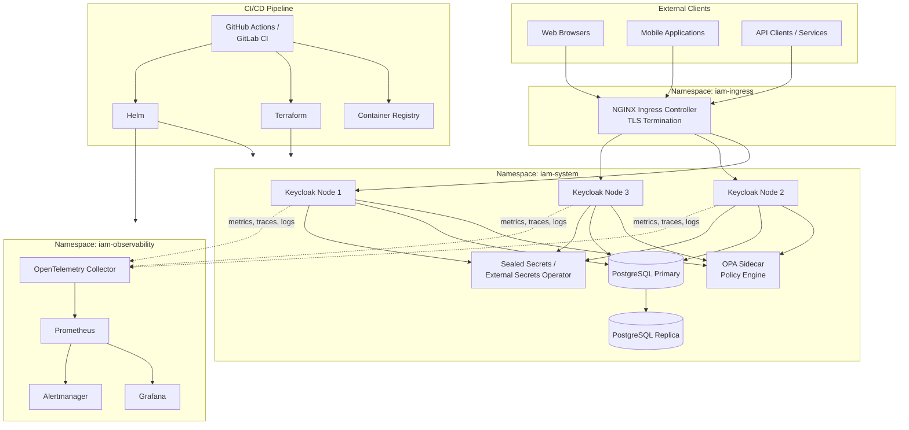
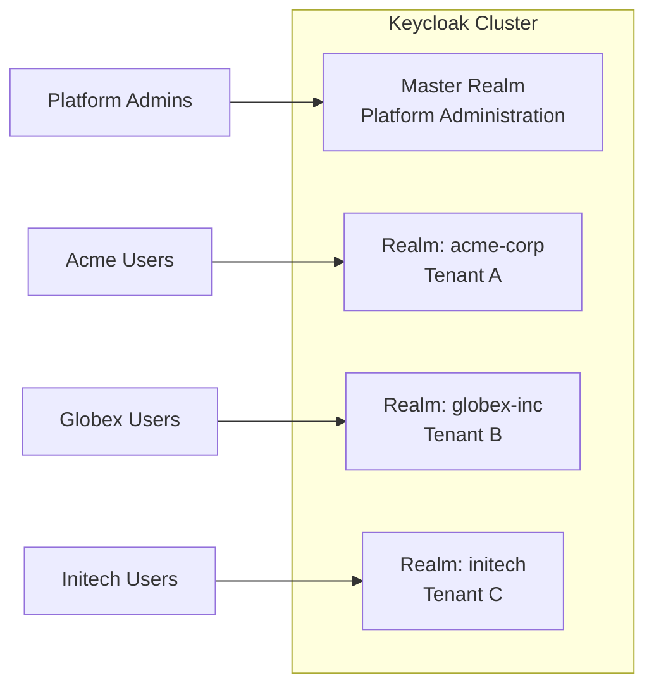
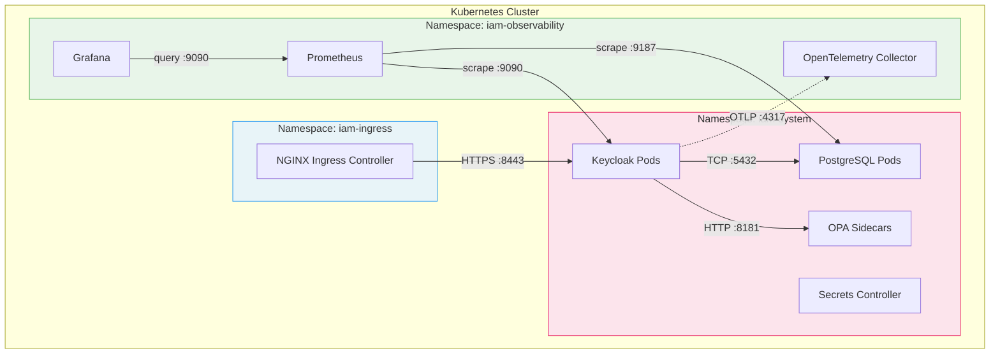

# Phase 1: Target Architecture

> **Document:** 01-target-architecture.md
> **Phase:** Phase 1 - Target Architecture
> **Related:** [00 - Overview](./00-overview.md) | [02 - Analysis and Design](./02-analysis-and-design.md) | [04 - Keycloak Configuration](./04-keycloak-configuration.md) | [15 - Multi-Tenancy Design](./15-multi-tenancy-design.md)

---

## 1. Introduction

This document defines the target architecture for the Enterprise IAM Platform. It establishes the high-level system topology, design principles, network architecture, high availability strategy, and scalability considerations that govern all subsequent design and implementation work.

The architecture is designed for a multi-tenant IAM deployment serving multiple independent organizations (tenants) through a single, shared Keycloak cluster, with strict isolation enforced at the Realm level.

---

## 2. High-Level Architecture

The following diagram illustrates the end-state architecture, showing the flow from external clients through the ingress layer, into the Keycloak cluster, and across supporting infrastructure components.

### Component Summary

| Component | Role | Deployment Model |
|-----------|------|-----------------|
| NGINX Ingress Controller | TLS termination, routing, rate limiting | DaemonSet or Deployment in `iam-ingress` |
| Keycloak 26.x | Identity provider, authentication, authorization | StatefulSet (3 replicas) in `iam-system` |
| PostgreSQL 16.x | Persistent storage for Keycloak | StatefulSet with streaming replication in `iam-system` |
| Open Policy Agent 1.x | Fine-grained authorization decisions | Sidecar container alongside Keycloak pods |
| OpenTelemetry Collector | Telemetry pipeline (metrics, traces, logs) | Deployment in `iam-observability` |
| Prometheus 2.55.x | Metrics scraping and storage | StatefulSet in `iam-observability` |
| Grafana 11.x | Dashboards and visualization | Deployment in `iam-observability` |
| Sealed Secrets / ESO | Secrets encryption and synchronization | Controller in `iam-system` |
| GitHub Actions / GitLab CI | Build, test, deploy automation | External SaaS / self-hosted runner |

---

## 3. Multi-Tenancy Strategy

The platform employs a **Realm-per-Tenant** isolation model. Each tenant organization receives a dedicated Keycloak Realm with its own:

- User store and credential storage
- Client registrations (OIDC / SAML)
- Authentication flows and policies
- Role definitions and permission mappings
- Identity provider federations
- Theme and branding configuration

**Isolation guarantees:**
- No data leakage between Realms at the application layer.
- Database-level row isolation via Realm ID foreign keys.
- Independent authentication flows and security policies per tenant.
- Per-tenant rate limiting at the ingress layer.

For full details, see [04 - Keycloak Configuration](./04-keycloak-configuration.md).

---

## 4. Design Principles

The following principles guide all architecture and implementation decisions:

### 4.1 Security by Design

Security is not an afterthought but an integral part of every component and decision. All communication channels use TLS 1.3. Secrets are never stored in plaintext. All access follows the principle of least privilege. Security controls are automated and tested in CI/CD.

### 4.2 Infrastructure as Code

All infrastructure is defined declaratively using Terraform (cloud resources) and Helm (Kubernetes workloads). No manual changes are made to production environments. All changes are version-controlled, peer-reviewed, and deployed through automated pipelines.

### 4.3 Immutable Infrastructure

Container images and infrastructure artifacts are built once and promoted through environments (dev, staging, production) without modification. Configuration is injected via environment variables, ConfigMaps, and Secrets. Rolling updates replace pods rather than patching them in place.

### 4.4 Least Privilege

Every service account, pod, and user is granted the minimum set of permissions required to perform its function. Kubernetes RBAC restricts API access. Network policies restrict pod-to-pod communication. OPA policies enforce fine-grained authorization.

### 4.5 Zero Trust

No implicit trust is granted based on network location. All service-to-service communication is authenticated and authorized. mTLS is enforced between components. Token validation occurs at every service boundary. Network policies default to deny-all with explicit allow rules.

---

## 5. Network Architecture

The platform is deployed across three Kubernetes namespaces with strict network policy enforcement.

### Network Policies

| Source Namespace | Destination Namespace | Allowed Traffic | Port(s) |
|------------------|-----------------------|-----------------|---------|
| `iam-ingress` | `iam-system` | HTTPS to Keycloak | 8443 |
| `iam-system` | `iam-system` | Keycloak to PostgreSQL | 5432 |
| `iam-system` | `iam-system` | Keycloak to OPA | 8181 |
| `iam-system` | `iam-observability` | OTLP telemetry export | 4317, 4318 |
| `iam-observability` | `iam-system` | Prometheus scraping | 9090, 9187 |
| `iam-observability` | `iam-observability` | Grafana to Prometheus | 9090 |
| All | All | Default deny ingress and egress | -- |

### DNS and Ingress Routing

- External DNS: `iam.<domain>.com` (platform administration)
- Tenant-specific: `<tenant-slug>.iam.<domain>.com` (per-realm endpoints)
- Internal services: Kubernetes DNS (`<service>.<namespace>.svc.cluster.local`)

---

## 6. High Availability Design

The platform is designed for continuous availability with no single point of failure.

### Keycloak HA

- **Replicas:** Minimum 3 Keycloak pods distributed across availability zones.
- **Session replication:** Infinispan distributed cache for session data and realm cache.
- **Pod disruption budget:** At least 2 pods must remain available during voluntary disruptions.
- **Health checks:** Liveness and readiness probes on `/health/live` and `/health/ready`.
- **Anti-affinity:** Pod anti-affinity rules ensure pods are scheduled on different nodes.

### PostgreSQL HA

- **Replication:** Synchronous streaming replication from primary to replica.
- **Failover:** Automated failover using a PostgreSQL operator (e.g., CloudNativePG or Patroni).
- **Connection pooling:** PgBouncer for connection management and failover transparency.
- **Backup:** Continuous WAL archiving to object storage with daily base backups.

### Ingress HA

- **Replicas:** Multiple NGINX Ingress Controller pods across nodes.
- **External load balancer:** Cloud provider load balancer or MetalLB for bare-metal deployments.

---

## 7. Disaster Recovery Strategy

| Aspect | RPO (Recovery Point Objective) | RTO (Recovery Time Objective) | Mechanism |
|--------|-------------------------------|-------------------------------|-----------|
| Keycloak configuration | Near-zero (IaC) | < 30 minutes | Rebuild from Terraform + Helm + Realm exports |
| User data (PostgreSQL) | < 5 minutes | < 15 minutes | WAL archiving + point-in-time recovery |
| Secrets | Near-zero | < 10 minutes | Sealed Secrets in Git / External Secrets from vault |
| Observability data | < 1 hour | < 30 minutes | Prometheus snapshots + Grafana dashboard-as-code |

### DR Procedures

1. **Infrastructure rebuild:** Terraform provisions the Kubernetes cluster and supporting resources from code.
2. **Application restore:** Helm deploys Keycloak, PostgreSQL, and observability stack.
3. **Data recovery:** PostgreSQL is restored from the latest WAL-archived backup.
4. **Configuration replay:** Realm exports and Keycloak configuration are re-applied via CI/CD.
5. **Validation:** Automated smoke tests verify authentication flows and tenant access.

For detailed procedures, see [13 - Automation and Scripts](./13-automation-scripts.md).

---

## 8. Scalability Considerations

### Horizontal Scaling

| Component | Scaling Method | Trigger | Limits |
|-----------|---------------|---------|--------|
| Keycloak | HPA (CPU/memory) or manual replica count | CPU > 70%, request latency > 200ms | Up to 10 replicas per cluster |
| PostgreSQL | Read replicas for query offloading | Read IOPS threshold | 1 primary + N replicas |
| NGINX Ingress | HPA based on connection count | Active connections > threshold | Cloud LB handles L4 scaling |
| Prometheus | Federation or Thanos for multi-cluster | Metrics cardinality | Shard by namespace |

### Vertical Scaling

Resource requests and limits are defined per pod:

| Component | CPU Request | CPU Limit | Memory Request | Memory Limit |
|-----------|------------|-----------|---------------|-------------|
| Keycloak | 500m | 2000m | 1Gi | 2Gi |
| PostgreSQL | 500m | 2000m | 1Gi | 4Gi |
| OPA Sidecar | 100m | 500m | 128Mi | 256Mi |
| OpenTelemetry Collector | 200m | 500m | 256Mi | 512Mi |
| Prometheus | 500m | 2000m | 2Gi | 4Gi |
| Grafana | 200m | 500m | 256Mi | 512Mi |

### Capacity Planning

- **Users per Realm:** Tested up to 100,000 users per Realm.
- **Concurrent sessions:** Target 10,000 concurrent sessions per Keycloak node.
- **Authentication throughput:** Target 500 authentications per second per node.
- **Token issuance:** Target 1,000 tokens per second per node.

---

## 9. Cross-References

| Topic | Document |
|-------|----------|
| Project overview and technology stack | [00 - Overview](./00-overview.md) |
| Detailed analysis, data models, and auth flows | [02 - Analysis and Design](./02-analysis-and-design.md) |
| Multi-tenancy deep dive | [15 - Multi-Tenancy Design](./15-multi-tenancy-design.md) |
| Infrastructure as Code modules | [05 - Infrastructure as Code](./05-infrastructure-as-code.md) |
| Observability stack design | [10 - Observability](./10-observability.md) |
| Security hardening details | [07 - Security by Design](./07-security-by-design.md) |
| OPA authorization policies | [08 - Authentication and Authorization](./08-authentication-authorization.md) |
| Operations and incident response | [16 - Operations Runbook](./16-operations-runbook.md) |
| Disaster recovery and backup | [17 - Disaster Recovery](./17-disaster-recovery.md) |

---

*This document is part of the Enterprise IAM Platform documentation set. Return to [00 - Overview](./00-overview.md) for the full table of contents.*
