# Phase 2: Analysis and Design

> **Document:** 02-analysis-and-design.md
> **Phase:** Phase 2 - Analysis and Design
> **Related:** [00 - Overview](./00-overview.md) | [01 - Target Architecture](./01-target-architecture.md) | [04 - Keycloak Configuration](./04-keycloak-configuration.md)

---

## 1. Introduction

This document captures the detailed analysis and design work for the Enterprise IAM Platform. It covers functional and non-functional requirements, data models, authentication and authorization flow designs, integration patterns, API specifications, security threat modeling, and performance requirements.

All designs in this document are derived from the target architecture defined in [01 - Target Architecture](./01-target-architecture.md) and inform the implementation work in Phase 3.

---

## 2. Requirements Analysis

### 2.1 Functional Requirements

| ID | Requirement | Priority | Category |
|----|-------------|----------|----------|
| FR-01 | Multi-tenant identity management with Realm-per-Tenant isolation | Must | Multi-Tenancy |
| FR-02 | OIDC Authorization Code flow with PKCE for web and mobile clients | Must | Authentication |
| FR-03 | SAML 2.0 SSO for enterprise federation partners | Must | Authentication |
| FR-04 | Multi-factor authentication (TOTP, email OTP, SMS OTP) | Must | Authentication |
| FR-05 | Role-based access control with Realm and Client roles | Must | Authorization |
| FR-06 | Fine-grained authorization via OPA policy evaluation | Should | Authorization |
| FR-07 | Custom JWT token enrichment with user attributes and group memberships | Must | Token Management |
| FR-08 | Token exchange for service-to-service delegation | Should | Integration |
| FR-09 | Token introspection endpoint for resource servers | Must | Integration |
| FR-10 | Backchannel logout for coordinated session termination | Must | Session Management |
| FR-11 | User self-service (password reset, profile update, MFA enrollment) | Must | User Management |
| FR-12 | Identity brokering with external IdPs (Google, Azure AD, LDAP) | Should | Federation |
| FR-13 | Tenant-specific branding and login themes | Should | Customization |
| FR-14 | Admin API for automated tenant provisioning | Must | Operations |
| FR-15 | Audit logging of all authentication and authorization events | Must | Compliance |

### 2.2 Non-Functional Requirements

| ID | Requirement | Target | Measurement |
|----|-------------|--------|-------------|
| NFR-01 | Availability | 99.9% uptime (8.76 hours downtime/year) | Uptime monitoring |
| NFR-02 | Authentication latency (p95) | < 200ms | Prometheus histogram |
| NFR-03 | Token issuance throughput | >= 1,000 tokens/second | Load test |
| NFR-04 | Concurrent active sessions | >= 50,000 | Session count metric |
| NFR-05 | Recovery time objective (RTO) | < 15 minutes | DR drill |
| NFR-06 | Recovery point objective (RPO) | < 5 minutes | WAL archiving lag |
| NFR-07 | Horizontal scalability | Linear up to 10 Keycloak nodes | Load test |
| NFR-08 | Security compliance | OWASP Top 10 mitigated | Security audit |
| NFR-09 | Secret rotation | Zero-downtime rotation | Operational test |
| NFR-10 | Deployment frequency | On-demand, multiple times per day | CI/CD metrics |

---

## 3. Data Model Design

### 3.1 Core Entity Relationship Diagram

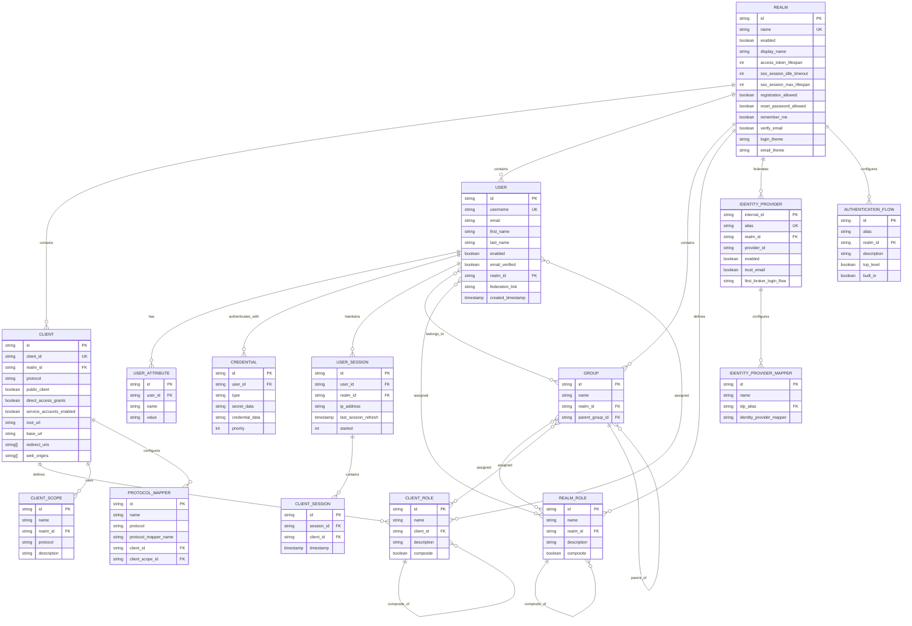

### 3.2 Custom User Attributes

The following custom user attributes extend the standard Keycloak user model to support tenant-specific requirements:

| Attribute Name | Type | Description | Example |
|---------------|------|-------------|---------|
| `tenant_id` | String | Tenant identifier for cross-referencing | `acme-corp` |
| `department` | String | Organizational department | `Engineering` |
| `cost_center` | String | Financial cost center code | `CC-4200` |
| `employee_id` | String | HR system employee identifier | `EMP-00123` |
| `external_id` | String | Federated identity external reference | `azure-ad:abc123` |
| `mfa_enforced` | Boolean | Whether MFA is mandatory for this user | `true` |
| `data_classification` | String | Highest data classification level allowed | `confidential` |

### 3.3 Federation Providers

| Provider Type | Protocol | Use Case | Configuration |
|---------------|----------|----------|---------------|
| Azure AD | OIDC | Enterprise SSO for Microsoft tenants | Client ID, Client Secret, Azure tenant ID |
| Google Workspace | OIDC | Enterprise SSO for Google tenants | Client ID, Client Secret, hosted domain |
| Active Directory | LDAP | On-premises user directory synchronization | Bind DN, connection URL, user DN, sync period |
| External SAML IdP | SAML 2.0 | B2B partner federation | Metadata URL, entity ID, signing certificate |

---

## 4. Authentication Flow Design

### 4.1 OIDC Authorization Code Flow with PKCE

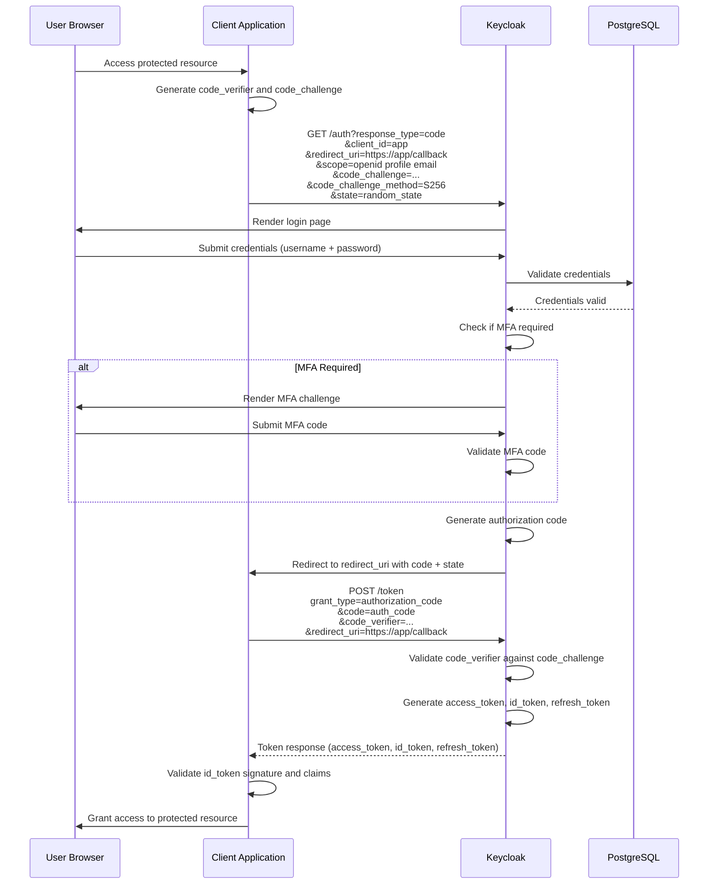

### 4.2 SAML 2.0 SSO Flow

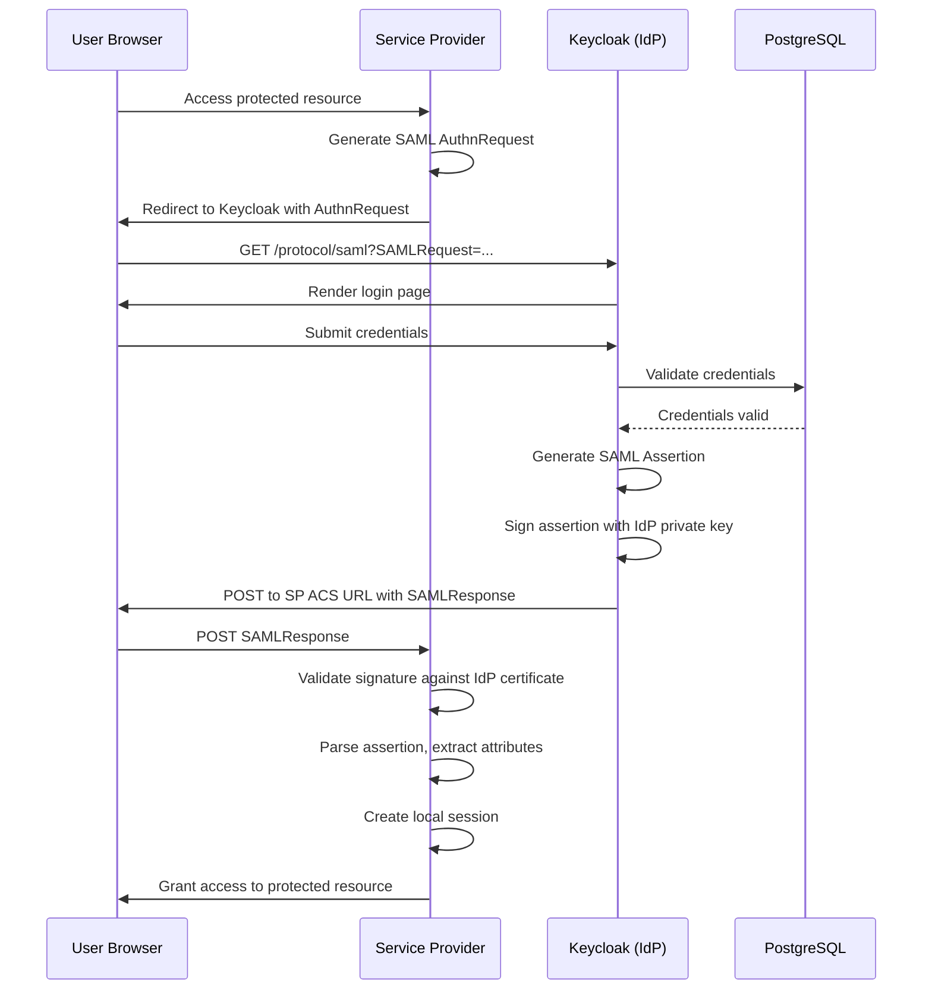

### 4.3 Custom JWT Enrichment Flow

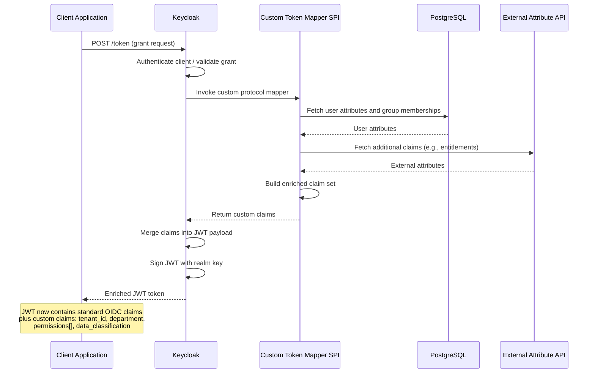

### 4.4 MFA Flow

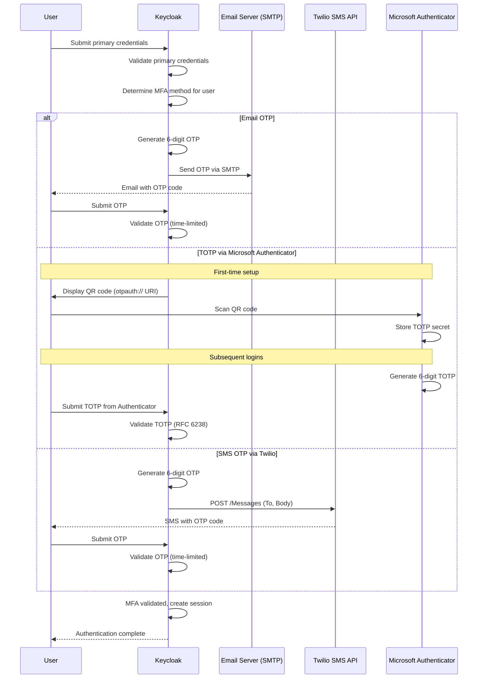

---

## 5. Authorization Model

### 5.1 Role Architecture

The platform uses a two-tier role model combining Realm Roles (global within a tenant) and Client Roles (scoped to a specific application).

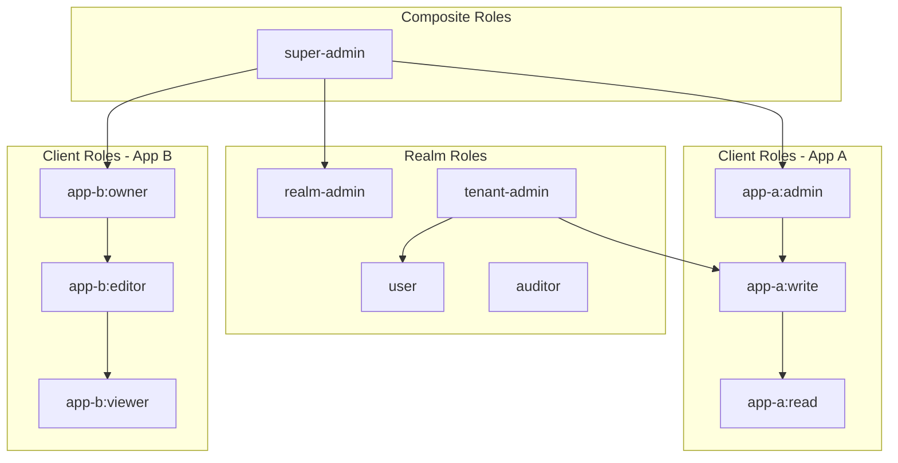

### 5.2 RBAC Matrix

| Role | User Management | Client Configuration | Realm Settings | View Audit Logs | Manage Own Profile | Access App A | Access App B |
|------|:-:|:-:|:-:|:-:|:-:|:-:|:-:|
| super-admin | Full | Full | Full | Full | Yes | Full | Full |
| tenant-admin | Create, Read, Update | Read | Read | Full | Yes | Read, Write | Read |
| auditor | Read | Read | Read | Full | Yes | Read | Read |
| user | None | None | None | None | Yes | Per client role | Per client role |
| service-account | None | None | None | None | N/A | Per client role | Per client role |

### 5.3 Fine-Grained Authorization with OPA

Open Policy Agent provides attribute-based access control (ABAC) beyond what Keycloak's built-in RBAC supports. OPA evaluates policies written in Rego against the user's JWT claims, request context, and external data.

**Policy evaluation flow:**

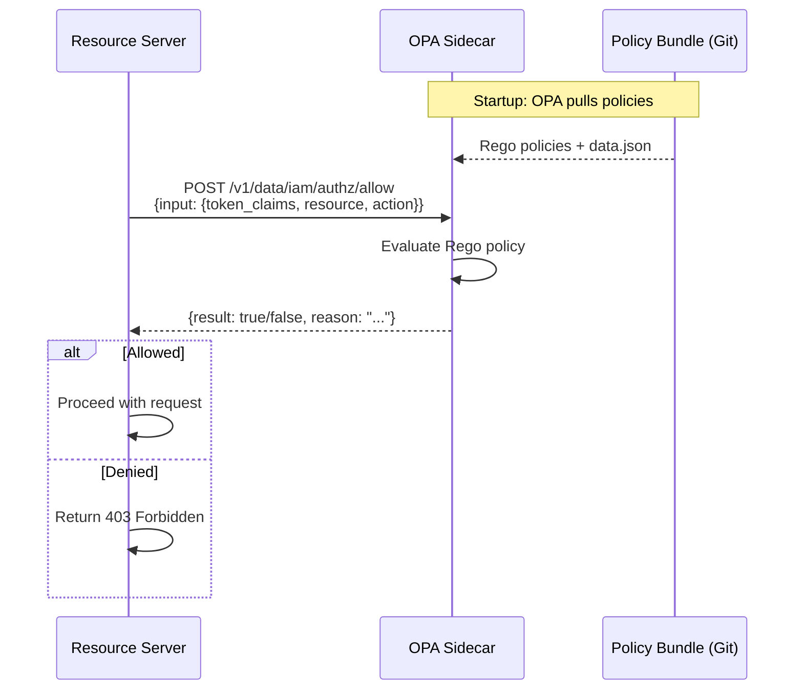

**Example policy dimensions:**

| Dimension | Source | Example |
|-----------|--------|---------|
| User identity | JWT `sub` claim | `user-id-123` |
| Roles | JWT `realm_access.roles` | `["tenant-admin", "user"]` |
| Tenant | JWT `tenant_id` custom claim | `acme-corp` |
| Resource type | Request path / metadata | `document`, `api-key` |
| Action | HTTP method / operation | `read`, `write`, `delete` |
| Time of day | System clock | Business hours only |
| IP address | Request metadata | Internal network CIDR |
| Data classification | Resource metadata | `public`, `confidential`, `restricted` |

For detailed OPA policy design, see [08 - Authentication and Authorization](./08-authentication-authorization.md).

---

## 6. Integration Patterns

### 6.1 Service-to-Service Authentication

Services authenticate to Keycloak using the **Client Credentials** grant to obtain access tokens for inter-service communication.

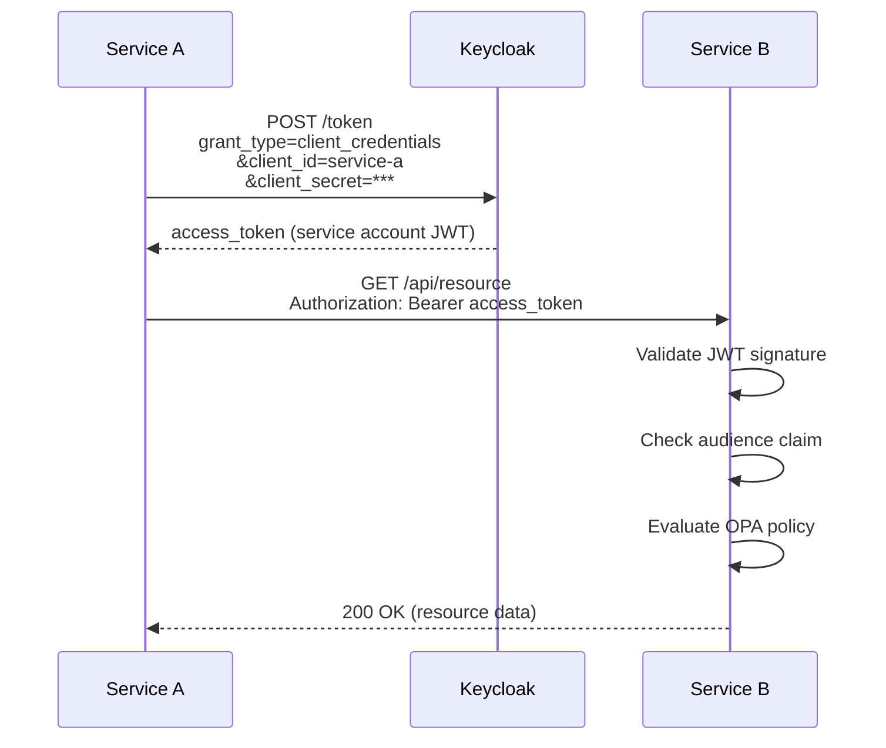

### 6.2 Token Exchange

Token exchange (RFC 8693) enables a service to exchange its own token for a token with different scopes or audiences, supporting delegation scenarios.

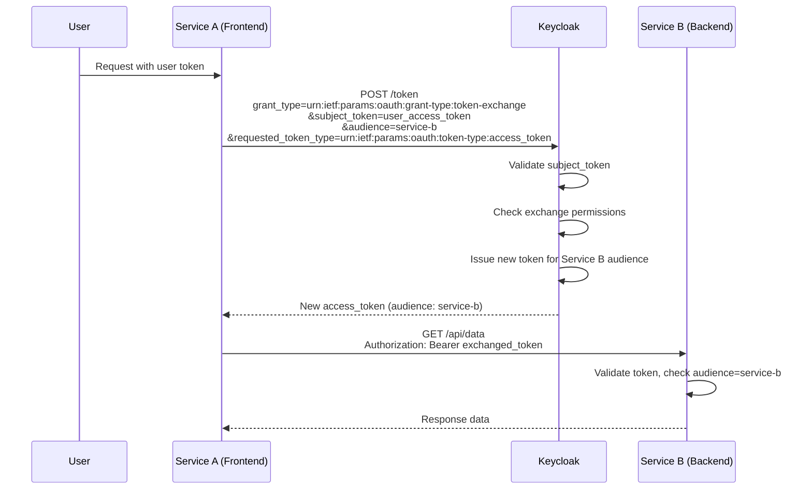

### 6.3 Token Introspection

Resource servers that cannot validate JWTs locally (e.g., opaque tokens or revocation checking) use the introspection endpoint.

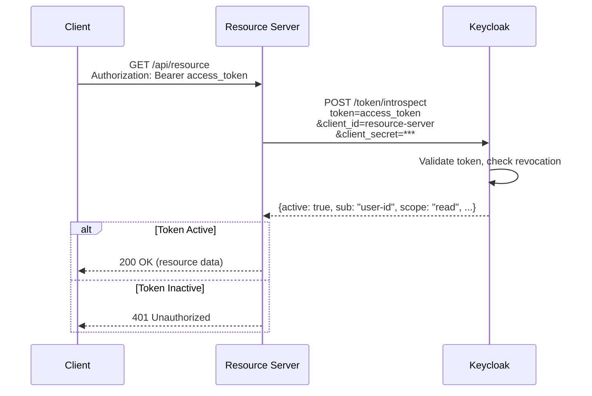

### 6.4 Backchannel Logout

When a user logs out, Keycloak sends logout requests to all clients with active sessions, ensuring coordinated session termination.

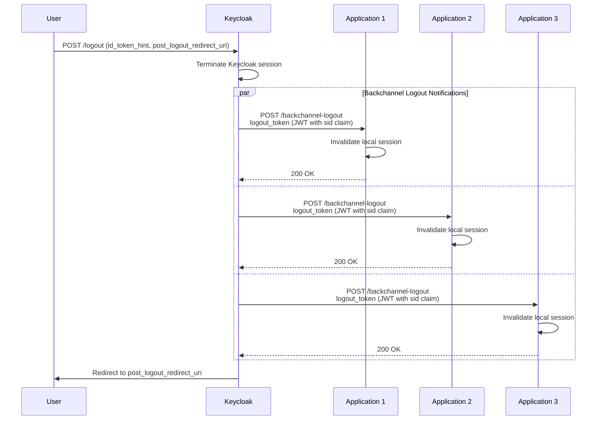

---

## 7. API Design for Custom Endpoints

Custom REST endpoints are implemented as Keycloak SPI extensions (see [11 - Keycloak Customization](./11-keycloak-customization.md)).

### 7.1 Custom API Endpoints

| Method | Path | Description | Auth |
|--------|------|-------------|------|
| POST | `/realms/{realm}/tenant-provision` | Provision a new tenant (create realm, default clients, roles) | Bearer token (super-admin) |
| GET | `/realms/{realm}/user-entitlements/{userId}` | Retrieve computed entitlements for a user | Bearer token (tenant-admin) |
| POST | `/realms/{realm}/bulk-import` | Bulk import users from CSV/JSON | Bearer token (tenant-admin) |
| GET | `/realms/{realm}/audit-events` | Query audit events with filtering | Bearer token (auditor) |
| POST | `/realms/{realm}/rotate-client-secret/{clientId}` | Rotate a client's secret with zero downtime | Bearer token (tenant-admin) |

### 7.2 Response Format

All custom endpoints follow a consistent response envelope:

```json
{
  "status": "success",
  "data": { },
  "metadata": {
    "timestamp": "2026-03-07T12:00:00Z",
    "request_id": "req-abc-123",
    "realm": "acme-corp"
  },
  "errors": []
}
```

---

## 8. Security Threat Model (STRIDE Analysis)

| Threat Category | Threat | Asset | Likelihood | Impact | Mitigation | Status |
|----------------|--------|-------|------------|--------|------------|--------|
| **S**poofing | Attacker impersonates a legitimate user | User sessions | Medium | High | MFA enforcement, brute-force protection, account lockout | Mitigated |
| **S**poofing | Forged JWT tokens accepted by resource server | Access tokens | Low | Critical | RS256/ES256 signature validation, JWKS rotation, short token lifetime | Mitigated |
| **T**ampering | Modification of tokens in transit | Access tokens, ID tokens | Low | High | TLS 1.3 for all transport, signed JWTs | Mitigated |
| **T**ampering | Database record manipulation | PostgreSQL user data | Low | Critical | Database encryption at rest, network policies, least-privilege DB accounts | Mitigated |
| **R**epudiation | User denies performing an action | Audit logs | Medium | Medium | Comprehensive audit logging, tamper-evident log storage, log forwarding | Mitigated |
| **I**nformation Disclosure | Token leakage via URL parameters | Authorization codes | Medium | High | Use POST for token exchange, short-lived auth codes, PKCE enforcement | Mitigated |
| **I**nformation Disclosure | Secrets exposed in logs or environment | Client secrets, DB passwords | Medium | Critical | Sealed Secrets, secret masking in logs, no secrets in env vars | Mitigated |
| **D**enial of Service | Authentication endpoint flooding | Keycloak login endpoints | High | High | Rate limiting at ingress, brute-force detection, CAPTCHA, HPA | Mitigated |
| **D**enial of Service | Session table exhaustion | PostgreSQL, Infinispan cache | Medium | High | Session limits per user, idle session timeout, session cleanup job | Mitigated |
| **E**levation of Privilege | Horizontal privilege escalation between tenants | Realm isolation | Low | Critical | Realm-level isolation, token audience validation, OPA tenant checks | Mitigated |
| **E**levation of Privilege | Vertical privilege escalation via role manipulation | Role assignments | Low | Critical | Admin API access restricted, role assignment audit logging, OPA policy checks | Mitigated |

For detailed security controls, see [07 - Security by Design](./07-security-by-design.md).

---

## 9. Performance Requirements and SLAs

### 9.1 Service Level Agreements

| SLA Metric | Target | Measurement Method | Breach Response |
|------------|--------|-------------------|-----------------|
| Availability | 99.9% monthly | Synthetic health checks every 30s | P1 incident, 15-min response |
| Authentication latency (p50) | < 100ms | Prometheus `keycloak_request_duration` histogram | Performance tuning |
| Authentication latency (p95) | < 200ms | Prometheus `keycloak_request_duration` histogram | P2 investigation |
| Authentication latency (p99) | < 500ms | Prometheus `keycloak_request_duration` histogram | P1 incident |
| Token issuance throughput | >= 1,000 req/s | Load test (k6 / Gatling) | Horizontal scaling |
| Error rate | < 0.1% (5xx responses) | NGINX Ingress metrics | P1 incident |
| Mean Time to Recovery (MTTR) | < 15 minutes | Incident tracking | Post-mortem review |

### 9.2 Performance Test Scenarios

| Scenario | Description | Target | Tool |
|----------|-------------|--------|------|
| Steady-state login | Constant 100 logins/second for 1 hour | p95 < 200ms, 0% errors | k6 |
| Peak login burst | Ramp from 0 to 500 logins/second over 5 minutes | p95 < 500ms, < 0.1% errors | k6 |
| Token refresh storm | 1,000 concurrent refresh token requests | p95 < 100ms | k6 |
| SAML SSO flow | 50 concurrent SAML authentications | p95 < 300ms | Gatling |
| Admin API bulk operation | Import 10,000 users | Complete in < 5 minutes | Custom script |
| Session cleanup | 100,000 expired sessions | Complete in < 2 minutes | Scheduled job |
| Multi-tenant isolation | 10 tenants, 50 logins/second each | No cross-tenant latency impact | k6 |

### 9.3 Capacity Baselines

| Resource | Per Keycloak Node | 3-Node Cluster | 6-Node Cluster |
|----------|-------------------|----------------|----------------|
| Authentications/second | 500 | 1,500 | 3,000 |
| Active sessions | 10,000 | 30,000 | 60,000 |
| Registered users per Realm | 100,000 | 100,000 | 100,000 |
| Total Realms | 50 | 50 | 100 |
| Token validations/second | 2,000 | 6,000 | 12,000 |

---

## 10. Cross-References

| Topic | Document |
|-------|----------|
| Project overview and technology stack | [00 - Overview](./00-overview.md) |
| High-level architecture and infrastructure | [01 - Target Architecture](./01-target-architecture.md) |
| Keycloak Realm and client configuration | [04 - Keycloak Configuration](./04-keycloak-configuration.md) |
| Security hardening and controls | [07 - Security by Design](./07-security-by-design.md) |
| OPA authorization policy design | [08 - Authentication and Authorization](./08-authentication-authorization.md) |
| Custom SPI development | [11 - Keycloak Customization](./11-keycloak-customization.md) |
| Testing strategy and performance tests | [18 - Testing Strategy](./18-testing-strategy.md) |
| Compliance and governance | [20 - Compliance and Governance](./20-compliance-governance.md) |

---

*This document is part of the Enterprise IAM Platform documentation set. Return to [00 - Overview](./00-overview.md) for the full table of contents.*
