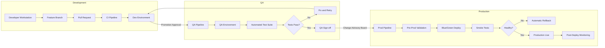
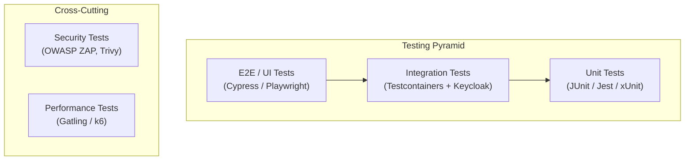
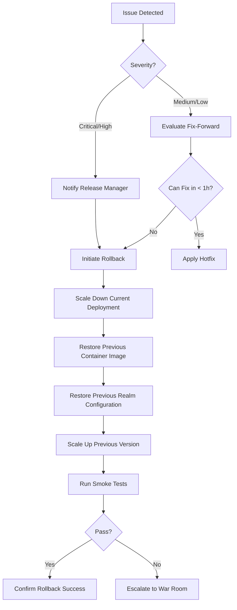

# Phase 3: Transformation / Execution Plan

## Table of Contents

- [1. Implementation Roadmap](#1-implementation-roadmap)
- [2. Sprint-Based Delivery Plan](#2-sprint-based-delivery-plan)
- [3. Work Breakdown Structure](#3-work-breakdown-structure)
- [4. Environment Promotion Strategy](#4-environment-promotion-strategy)
- [5. Testing Strategy](#5-testing-strategy)
- [6. Go-Live Checklist](#6-go-live-checklist)
- [7. Rollback Procedures](#7-rollback-procedures)
- [8. Post-Deployment Support Plan](#8-post-deployment-support-plan)

---

## 1. Implementation Roadmap

The transformation is structured into four major phases spanning 16 sprints (32 weeks). Each phase builds upon the previous one, ensuring incremental delivery and continuous validation.

| Phase | Name | Sprints | Duration | Key Outcome |
|-------|------|---------|----------|-------------|
| Phase A | Foundation | Sprint 1--4 | Weeks 1--8 | Infrastructure provisioned, Keycloak deployed in HA mode |
| Phase B | Core Identity | Sprint 5--8 | Weeks 9--16 | Authentication and authorization fully operational |
| Phase C | Operations | Sprint 9--12 | Weeks 17--24 | Observability, CI/CD, and automation in place |
| Phase D | Hardening and Launch | Sprint 13--16 | Weeks 25--32 | Security hardened, clients integrated, production go-live |

### Milestones

| Milestone | Target Date (Relative) | Acceptance Criteria |
|-----------|----------------------|---------------------|
| M1 -- Infrastructure Ready | End of Sprint 2 | Kubernetes cluster operational, namespaces created, network policies enforced |
| M2 -- Keycloak Operational | End of Sprint 4 | Keycloak HA cluster running, PostgreSQL HA configured, custom theme deployed |
| M3 -- Authentication Complete | End of Sprint 6 | OIDC/SAML flows working, MFA configured and tested |
| M4 -- Authorization Complete | End of Sprint 8 | OPA integrated, RBAC policies enforced, fine-grained authorization validated |
| M5 -- Observability Live | End of Sprint 10 | Dashboards operational, alerting configured, SLO tracking active |
| M6 -- CI/CD Operational | End of Sprint 12 | Automated pipelines for all environments, environment promotion tested |
| M7 -- Security Cleared | End of Sprint 14 | Penetration test passed, security audit complete, documentation finalized |
| M8 -- Production Go-Live | End of Sprint 16 | UAT signed off, go-live executed, hypercare support active |

---

## 2. Sprint-Based Delivery Plan

All sprints follow a 2-week cadence. Each sprint includes planning, daily standups, a review/demo, and a retrospective.

| Sprint | Weeks | Focus Area | Deliverables |
|--------|-------|------------|--------------|
| Sprint 1 | 1--2 | Infrastructure Foundation (Part 1) | Terraform modules for cloud provider, VPC/VNet, subnets, firewall rules |
| Sprint 2 | 3--4 | Infrastructure Foundation (Part 2) | K8s cluster provisioning, namespaces, RBAC, network policies, ingress controller |
| Sprint 3 | 5--6 | Keycloak Deployment (Part 1) | Keycloak Helm chart, PostgreSQL HA (CrunchyData/Zalando operator), TLS certificates |
| Sprint 4 | 7--8 | Keycloak Base Configuration | Realm configuration, custom themes, SMTP integration, brute force detection |
| Sprint 5 | 9--10 | Authentication Flows (Part 1) | OIDC client configuration, SAML IdP federation, browser flow customization |
| Sprint 6 | 11--12 | Authentication Flows (Part 2) | MFA setup (TOTP, Email OTP, SMS OTP), custom SPIs, registration flows |
| Sprint 7 | 13--14 | Authorization (Part 1) | OPA deployment, Rego policy authoring, RBAC model design |
| Sprint 8 | 15--16 | Authorization (Part 2) | Fine-grained policies, token enrichment, policy enforcement points |
| Sprint 9 | 17--18 | Observability (Part 1) | OpenTelemetry collector, Keycloak metrics exporter, Prometheus configuration |
| Sprint 10 | 19--20 | Observability (Part 2) | Grafana dashboards, alerting rules, log aggregation, SLO definition |
| Sprint 11 | 21--22 | CI/CD Pipelines (Part 1) | Pipeline architecture, build/test stages, container image scanning |
| Sprint 12 | 23--24 | CI/CD Pipelines (Part 2) | Environment promotion automation, rollback scripts, configuration drift detection |
| Sprint 13 | 25--26 | Security Hardening | TLS hardening, header policies, secret rotation, vulnerability remediation |
| Sprint 14 | 27--28 | Penetration Testing and Documentation | External pen test, remediation, operational runbooks, architecture documentation |
| Sprint 15 | 29--30 | Client Integration and UAT | Sample application integrations, UAT execution, defect triage |
| Sprint 16 | 31--32 | Go-Live Preparation | Production cutover rehearsal, go-live execution, hypercare setup |

---

## 3. Work Breakdown Structure

### Sprint 1--2: Infrastructure Foundation

**Objective:** Provision cloud infrastructure and Kubernetes cluster with enterprise-grade networking and security boundaries.

**Deliverables:**

| ID | Task | Owner | Effort (SP) | Dependencies |
|----|------|-------|-------------|--------------|
| INF-001 | Define Terraform project structure and remote state backend | DevOps | 3 | None |
| INF-002 | Create VPC/VNet with public and private subnets | DevOps | 5 | INF-001 |
| INF-003 | Configure NAT gateways and internet gateways | DevOps | 3 | INF-002 |
| INF-004 | Provision managed Kubernetes cluster (EKS/AKS/GKE) | DevOps | 8 | INF-002 |
| INF-005 | Create namespaces: `keycloak`, `monitoring`, `opa`, `ingress` | DevOps | 2 | INF-004 |
| INF-006 | Define and apply NetworkPolicies (deny-all default, allow-list) | DevOps | 5 | INF-005 |
| INF-007 | Deploy ingress controller (NGINX/Traefik) with TLS termination | DevOps | 5 | INF-004 |
| INF-008 | Configure DNS records and certificate manager (cert-manager) | DevOps | 3 | INF-007 |
| INF-009 | Set up secrets management (Vault / cloud KMS integration) | DevOps | 5 | INF-004 |
| INF-010 | Infrastructure smoke tests and documentation | DevOps/QA | 3 | All above |

For full infrastructure details, see [Infrastructure as Code](05-infrastructure-as-code.md).

### Sprint 3--4: Keycloak Deployment and Base Configuration

**Objective:** Deploy Keycloak in high-availability mode with a production-ready PostgreSQL backend and baseline realm configuration.

| ID | Task | Owner | Effort (SP) | Dependencies |
|----|------|-------|-------------|--------------|
| KC-001 | Author Keycloak Helm chart with HA configuration | DevOps | 8 | INF-004 |
| KC-002 | Deploy PostgreSQL HA cluster (operator-based) | DevOps/DBA | 8 | INF-004 |
| KC-003 | Configure Keycloak database connection pooling | DevOps | 3 | KC-001, KC-002 |
| KC-004 | Deploy custom login theme and email templates | Frontend/IAM | 5 | KC-001 |
| KC-005 | Configure master realm lockdown (admin-only, restricted IPs) | IAM | 3 | KC-001 |
| KC-006 | Create tenant realm template with baseline settings | IAM | 5 | KC-001 |
| KC-007 | Configure SMTP for email verification and OTP delivery | IAM | 3 | KC-006 |
| KC-008 | Enable brute force detection and account lockout policies | IAM | 3 | KC-006 |
| KC-009 | Set up Keycloak admin CLI and automation scripts | DevOps | 3 | KC-001 |
| KC-010 | HA failover testing and performance baseline | QA | 5 | All above |

For detailed Keycloak configuration, see [Keycloak Configuration Guide](04-keycloak-configuration.md).

### Sprint 5--6: Authentication Flows

**Objective:** Implement all authentication flows including OIDC, SAML, MFA, and custom SPIs.

| ID | Task | Owner | Effort (SP) | Dependencies |
|----|------|-------|-------------|--------------|
| AUTH-001 | Configure OIDC confidential and public clients | IAM | 5 | KC-006 |
| AUTH-002 | Set up SAML 2.0 identity provider federation | IAM | 8 | KC-006 |
| AUTH-003 | Customize browser authentication flow | IAM | 5 | KC-006 |
| AUTH-004 | Implement direct grant flow for service accounts | IAM | 3 | KC-006 |
| AUTH-005 | Configure registration flow with required actions | IAM | 3 | KC-006 |
| AUTH-006 | Implement TOTP MFA (Microsoft Authenticator compatible) | IAM | 5 | AUTH-003 |
| AUTH-007 | Implement Email OTP authenticator SPI | IAM/Dev | 8 | AUTH-003 |
| AUTH-008 | Integrate SMS OTP via Twilio custom SPI | IAM/Dev | 8 | AUTH-003 |
| AUTH-009 | Develop custom User Storage SPI for legacy system | Dev | 8 | KC-006 |
| AUTH-010 | Authentication flow integration tests | QA | 5 | All above |

### Sprint 7--8: Authorization

**Objective:** Implement fine-grained authorization using OPA integration, RBAC, and policy-based access control.

| ID | Task | Owner | Effort (SP) | Dependencies |
|----|------|-------|-------------|--------------|
| AUTHZ-001 | Deploy OPA as sidecar/service in Kubernetes | DevOps | 5 | INF-005 |
| AUTHZ-002 | Design RBAC model (roles, groups, scopes) | IAM/Arch | 5 | KC-006 |
| AUTHZ-003 | Author Rego policies for resource-level authorization | IAM/Dev | 8 | AUTHZ-001 |
| AUTHZ-004 | Implement policy enforcement point (PEP) middleware | Dev | 8 | AUTHZ-003 |
| AUTHZ-005 | Configure Keycloak authorization services (resources, scopes, policies) | IAM | 5 | KC-006 |
| AUTHZ-006 | Implement token enrichment with custom claims | IAM | 5 | AUTH-001 |
| AUTHZ-007 | Fine-grained policy testing with edge cases | QA | 5 | AUTHZ-003 |
| AUTHZ-008 | Performance testing under policy evaluation load | QA | 3 | AUTHZ-004 |
| AUTHZ-009 | Authorization decision logging and audit trail | Dev | 3 | AUTHZ-004 |
| AUTHZ-010 | Documentation: authorization model and policy catalog | Tech Writer | 3 | All above |

### Sprint 9--10: Observability and Monitoring

**Objective:** Establish full observability stack with metrics, logs, traces, dashboards, and alerting.

| ID | Task | Owner | Effort (SP) | Dependencies |
|----|------|-------|-------------|--------------|
| OBS-001 | Deploy OpenTelemetry Collector in Kubernetes | DevOps | 5 | INF-005 |
| OBS-002 | Instrument Keycloak with OpenTelemetry (OTLP exporter) | DevOps | 5 | OBS-001, KC-001 |
| OBS-003 | Deploy Prometheus and configure scrape targets | DevOps | 5 | INF-005 |
| OBS-004 | Create Keycloak-specific Prometheus recording rules | DevOps | 3 | OBS-003 |
| OBS-005 | Deploy Grafana and import/create dashboards | DevOps | 5 | OBS-003 |
| OBS-006 | Build Keycloak operational dashboard (logins, errors, latency) | DevOps | 5 | OBS-005 |
| OBS-007 | Build security dashboard (failed logins, brute force, suspicious activity) | DevOps/Sec | 5 | OBS-005 |
| OBS-008 | Configure alerting rules (PagerDuty/Slack/Email) | DevOps | 3 | OBS-003 |
| OBS-009 | Set up log aggregation (Loki/ELK) for Keycloak event logs | DevOps | 5 | INF-005 |
| OBS-010 | Define SLOs and error budgets for IAM services | SRE/Arch | 3 | OBS-006 |

### Sprint 11--12: CI/CD Pipelines and Automation

**Objective:** Automate build, test, deployment, and environment promotion for all IAM components.

| ID | Task | Owner | Effort (SP) | Dependencies |
|----|------|-------|-------------|--------------|
| CICD-001 | Design pipeline architecture (GitHub Actions / GitLab CI / Azure DevOps) | DevOps | 3 | None |
| CICD-002 | Create build pipeline for custom Keycloak SPIs | DevOps | 5 | AUTH-007 |
| CICD-003 | Create build pipeline for custom themes | DevOps | 3 | KC-004 |
| CICD-004 | Implement container image build and vulnerability scanning | DevOps | 5 | CICD-002 |
| CICD-005 | Create Terraform plan/apply pipeline with approval gates | DevOps | 5 | INF-001 |
| CICD-006 | Implement Keycloak configuration promotion pipeline | DevOps | 8 | KC-009 |
| CICD-007 | Create automated smoke test suite for post-deployment validation | QA | 5 | OBS-006 |
| CICD-008 | Implement environment promotion scripts (dev -> qa -> prod) | DevOps | 5 | CICD-006 |
| CICD-009 | Set up configuration drift detection and reconciliation | DevOps | 5 | CICD-006 |
| CICD-010 | Pipeline documentation and runbooks | Tech Writer | 3 | All above |

### Sprint 13--14: Security Hardening, Penetration Testing, and Documentation

**Objective:** Harden the entire IAM platform against known threats, validate through penetration testing, and finalize documentation.

| ID | Task | Owner | Effort (SP) | Dependencies |
|----|------|-------|-------------|--------------|
| SEC-001 | TLS configuration hardening (cipher suites, HSTS, certificate pinning) | Security | 5 | KC-001 |
| SEC-002 | HTTP security headers (CSP, X-Frame-Options, Referrer-Policy) | Security | 3 | KC-001 |
| SEC-003 | Secret rotation automation (DB credentials, client secrets, signing keys) | DevOps/Sec | 5 | INF-009 |
| SEC-004 | Keycloak admin console access restriction (IP allowlist, MFA) | Security | 3 | KC-005 |
| SEC-005 | OWASP-based security review of custom SPIs | Security | 5 | AUTH-007, AUTH-008 |
| SEC-006 | Commission external penetration test | Security | 8 | All platform tasks |
| SEC-007 | Remediate penetration test findings (critical/high) | Dev/DevOps | 8 | SEC-006 |
| SEC-008 | Complete operational runbooks | Tech Writer | 5 | OBS-010 |
| SEC-009 | Complete architecture decision records (ADRs) | Architect | 3 | None |
| SEC-010 | Compliance documentation (SOC2, GDPR mapping) | Security | 5 | None |

### Sprint 15--16: Client Integration, UAT, and Go-Live

**Objective:** Integrate client applications, execute user acceptance testing, and perform production go-live.

| ID | Task | Owner | Effort (SP) | Dependencies |
|----|------|-------|-------------|--------------|
| GL-001 | Backend service integration example (Spring Boot / .NET) | Dev | 5 | AUTH-001 |
| GL-002 | SPA integration example (React / Angular) | Dev | 5 | AUTH-001 |
| GL-003 | Mobile application integration example (PKCE flow) | Dev | 5 | AUTH-001 |
| GL-004 | Service-to-service integration example (client credentials) | Dev | 3 | AUTH-004 |
| GL-005 | UAT environment provisioning and data seeding | DevOps/QA | 3 | CICD-008 |
| GL-006 | UAT execution with business stakeholders | QA/Business | 8 | GL-005 |
| GL-007 | Defect triage and remediation | Dev/QA | 5 | GL-006 |
| GL-008 | Production cutover rehearsal (dry run) | DevOps/All | 5 | All above |
| GL-009 | Production go-live execution | DevOps | 3 | GL-008 |
| GL-010 | Hypercare support setup (war room, escalation paths) | All | 3 | GL-009 |

---

## 4. Environment Promotion Strategy

All changes flow through a strict environment promotion pipeline. No change reaches production without passing through all preceding environments.

### Environment Configuration Matrix

| Attribute | Dev | QA | Production |
|-----------|-----|-----|------------|
| Kubernetes Nodes | 3 | 3 | 5+ |
| Keycloak Replicas | 1 | 2 | 3+ |
| PostgreSQL | Single instance | HA (2 replicas) | HA (3 replicas, synchronous) |
| TLS | Self-signed | Let's Encrypt (staging) | Commercial CA / Let's Encrypt (prod) |
| Ingress | Internal only | Internal + VPN | Public with WAF |
| Monitoring | Basic | Full stack | Full stack + PagerDuty |
| Backup Frequency | None | Daily | Hourly + continuous WAL archiving |
| Data | Synthetic | Anonymized production | Real |
| Access | All developers | Dev + QA team | Operations only (break-glass) |

### Promotion Rules

1. **Dev to QA**: Automated upon successful CI pipeline and code review approval.
2. **QA to Production**: Requires QA sign-off, security scan pass, and Change Advisory Board (CAB) approval.
3. **Keycloak Configuration**: Realm exports are versioned in Git and applied via `keycloak-config-cli` or Terraform Keycloak provider. See [Keycloak Configuration](04-keycloak-configuration.md) for details.
4. **Infrastructure Changes**: Terraform plans are reviewed and approved before apply. See [Infrastructure as Code](05-infrastructure-as-code.md).

---

## 5. Testing Strategy

### Testing Pyramid

### Test Categories

| Category | Scope | Tools | Frequency | Responsible |
|----------|-------|-------|-----------|-------------|
| Unit Tests | Individual SPI classes, utility functions, policy logic | JUnit 5, Mockito, Jest | Every commit | Developers |
| Integration Tests | Keycloak flows, database interactions, API contracts | Testcontainers, REST Assured, Keycloak Admin Client | Every PR | Developers |
| End-to-End Tests | Full authentication/authorization flows through browser | Cypress, Playwright | Nightly + pre-promotion | QA |
| Security Tests (SAST) | Source code vulnerability scanning | SonarQube, Semgrep | Every commit | DevOps/Security |
| Security Tests (DAST) | Runtime vulnerability scanning against deployed instances | OWASP ZAP, Burp Suite | Weekly + pre-release | Security |
| Security Tests (SCA) | Dependency vulnerability scanning | Trivy, Snyk, OWASP Dependency-Check | Every build | DevOps |
| Performance Tests | Load testing, stress testing, soak testing | Gatling, k6 | Pre-release, monthly | QA/SRE |
| Chaos Engineering | Resilience testing (pod failure, network partition) | Chaos Mesh, Litmus | Monthly | SRE |
| Penetration Testing | Full-scope security assessment | External vendor | Pre-go-live, annually | Security |

### Performance Test Targets

| Metric | Target | Measurement Method |
|--------|--------|-------------------|
| Login latency (p95) | < 500ms | k6 / Gatling |
| Token issuance throughput | > 1000 tokens/sec | k6 |
| Token introspection latency (p95) | < 100ms | k6 |
| Admin API response time (p95) | < 1s | k6 |
| Concurrent sessions | > 50,000 | Soak test |
| Failover recovery time | < 30s | Chaos Mesh |

---

## 6. Go-Live Checklist

### Pre-Go-Live (T-5 business days)

- [ ] All critical and high severity defects resolved
- [ ] UAT sign-off received from business stakeholders
- [ ] Penetration test findings (critical/high) remediated
- [ ] Production infrastructure provisioned and validated
- [ ] Production Keycloak configuration applied and verified
- [ ] DNS records prepared (TTL lowered for cutover)
- [ ] TLS certificates installed and validated
- [ ] Backup and restore procedures tested
- [ ] Rollback procedure documented and rehearsed
- [ ] Monitoring dashboards and alerts configured
- [ ] On-call rotation scheduled for hypercare period
- [ ] Communication plan distributed to stakeholders
- [ ] Runbooks reviewed and accessible to operations team

### Go-Live Day (T-0)

- [ ] Change Advisory Board approval confirmed
- [ ] Pre-deployment backup completed
- [ ] Production deployment executed
- [ ] Smoke tests passed
- [ ] DNS cutover executed (if applicable)
- [ ] Health checks verified (all Keycloak pods healthy)
- [ ] Sample login flow tested by operations team
- [ ] Monitoring dashboards reviewed (no anomalies)
- [ ] Go/No-Go decision confirmed by release manager
- [ ] Stakeholder notification sent

### Post-Go-Live (T+1 to T+5)

- [ ] Enhanced monitoring for 5 business days
- [ ] Daily stand-up with operations and development team
- [ ] Incident response team on standby
- [ ] Performance metrics within target thresholds
- [ ] No critical issues reported by end users
- [ ] Hypercare period closure report

---

## 7. Rollback Procedures

### Rollback Decision Matrix

| Severity | Impact | Decision | Authority |
|----------|--------|----------|-----------|
| Critical | Authentication completely unavailable | Immediate rollback | On-call engineer |
| High | Significant degradation (> 10% error rate) | Rollback within 30 minutes | Release manager |
| Medium | Minor feature regression | Evaluate fix-forward vs. rollback | Team lead |
| Low | Cosmetic / non-functional | Fix-forward in next release | Developer |

### Rollback Procedures by Component

#### Keycloak Application Rollback

1. **Container image rollback**: Revert the Keycloak Deployment to the previous image tag via Helm rollback or kubectl set image.
2. **Configuration rollback**: Re-apply the previous realm export from Git history using `keycloak-config-cli`.
3. **Database rollback**: Restore PostgreSQL from the pre-deployment snapshot (last resort -- may cause data loss for sessions created post-deployment).

#### Infrastructure Rollback

1. **Terraform state rollback**: Re-apply the previous Terraform state from the versioned state backend.
2. **Kubernetes resource rollback**: Use `helm rollback` for Helm-managed resources or `kubectl rollout undo` for Deployments.

#### Data Rollback

1. **PostgreSQL point-in-time recovery**: Use WAL archiving to restore to the pre-deployment timestamp.
2. **Realm configuration**: Re-import the previous realm JSON from version control.

### Rollback Testing

Rollback procedures must be tested during the production cutover rehearsal (Sprint 16, task GL-008). Each rollback scenario is executed in the QA environment at least once before go-live.

---

## 8. Post-Deployment Support Plan

### Hypercare Period (Weeks 1--4 after go-live)

| Week | Coverage | Focus |
|------|----------|-------|
| Week 1 | 24/7 on-call | Active monitoring, immediate incident response |
| Week 2 | 24/7 on-call | Stabilization, performance tuning |
| Week 3 | Extended business hours (7:00--22:00) | Knowledge transfer to operations |
| Week 4 | Standard business hours | Transition to BAU support |

### Support Tiers

| Tier | Responsibility | Response SLA | Resolution SLA |
|------|---------------|-------------|----------------|
| L1 -- Operations | Alert triage, runbook execution, basic troubleshooting | 15 minutes | 1 hour |
| L2 -- Platform Engineering | Keycloak configuration, infrastructure issues, advanced troubleshooting | 30 minutes | 4 hours |
| L3 -- Development | Custom SPI bugs, complex authentication flow issues, code fixes | 1 hour | 8 hours (next business day for non-critical) |
| L4 -- Vendor (Red Hat / Keycloak Community) | Core product defects, patch requests | Per vendor SLA | Per vendor SLA |

### Knowledge Transfer Plan

| Topic | Audience | Format | Timing |
|-------|----------|--------|--------|
| Architecture overview | All support tiers | Workshop (2h) | Week 1 post-go-live |
| Operational runbooks walkthrough | L1/L2 | Hands-on lab (4h) | Week 2 post-go-live |
| Keycloak administration | L2 | Hands-on lab (4h) | Week 2 post-go-live |
| Custom SPI deep dive | L3 | Code walkthrough (2h) | Week 3 post-go-live |
| Troubleshooting scenarios | L1/L2 | Tabletop exercise (2h) | Week 3 post-go-live |
| Incident response drill | All | Simulated incident (2h) | Week 4 post-go-live |

### Ongoing Maintenance

- **Keycloak upgrades**: Follow quarterly upgrade cadence, test in QA before promoting to production. Refer to [Keycloak Configuration](04-keycloak-configuration.md) for version-specific considerations.
- **Certificate rotation**: Automated via cert-manager. Manual rotation procedure documented in runbooks.
- **Secret rotation**: Automated via Vault or cloud KMS with a 90-day rotation policy.
- **Capacity reviews**: Monthly review of resource utilization and scaling thresholds.
- **Security patching**: Critical CVEs addressed within 48 hours; high within 1 week.

---

## Related Documents

- [Keycloak Configuration Guide](04-keycloak-configuration.md)
- [Infrastructure as Code](05-infrastructure-as-code.md)
