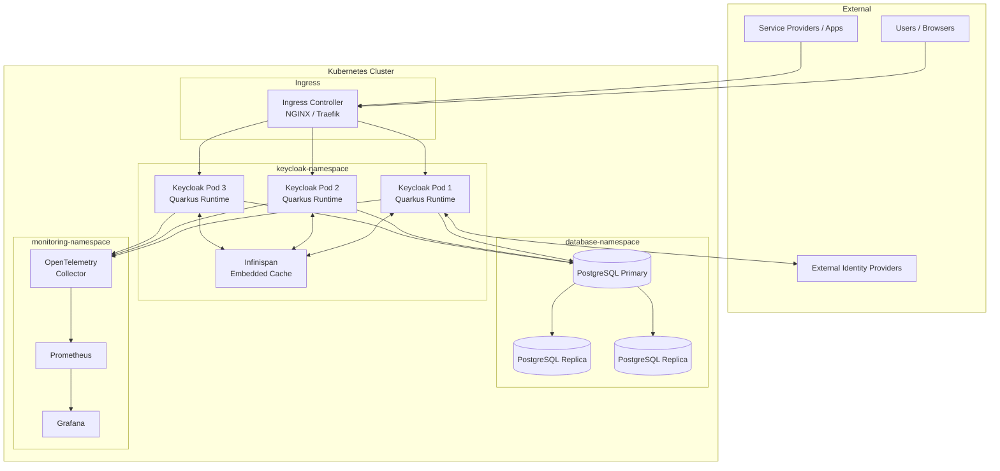
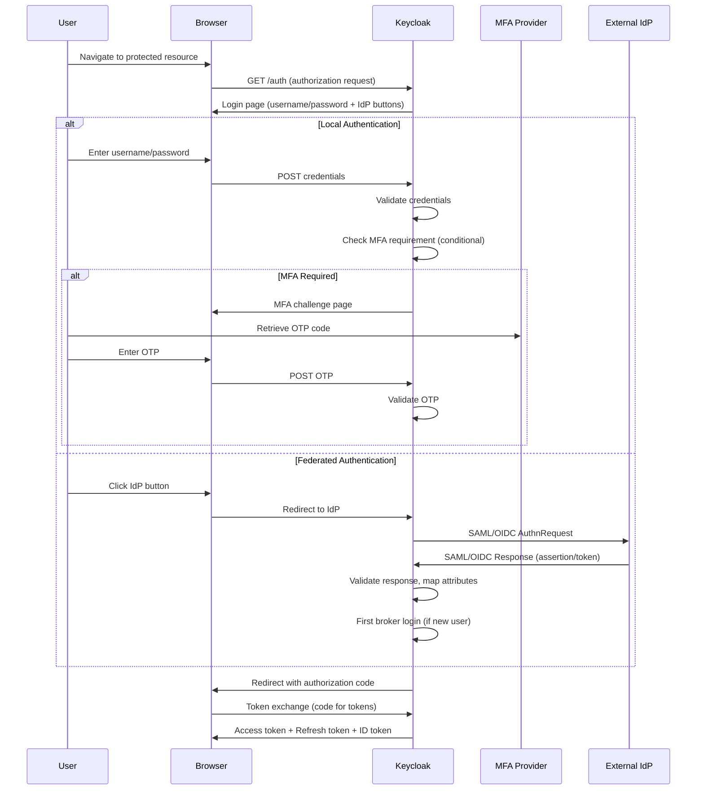
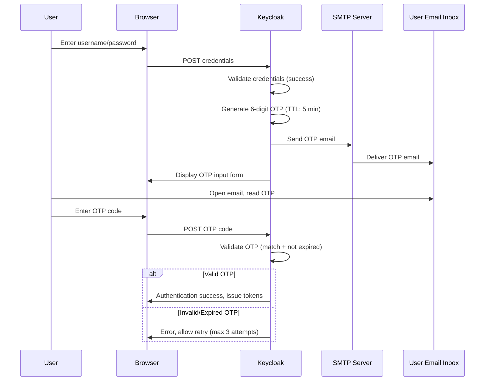
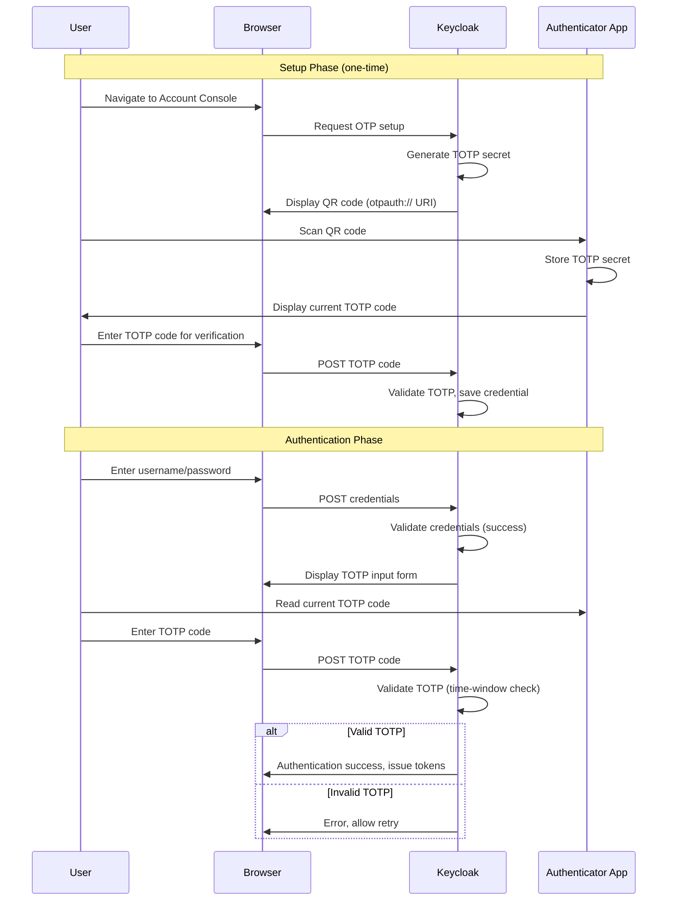
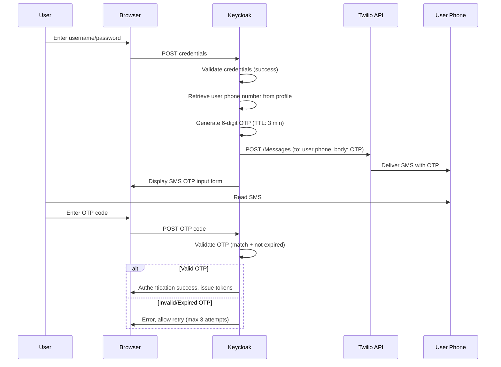
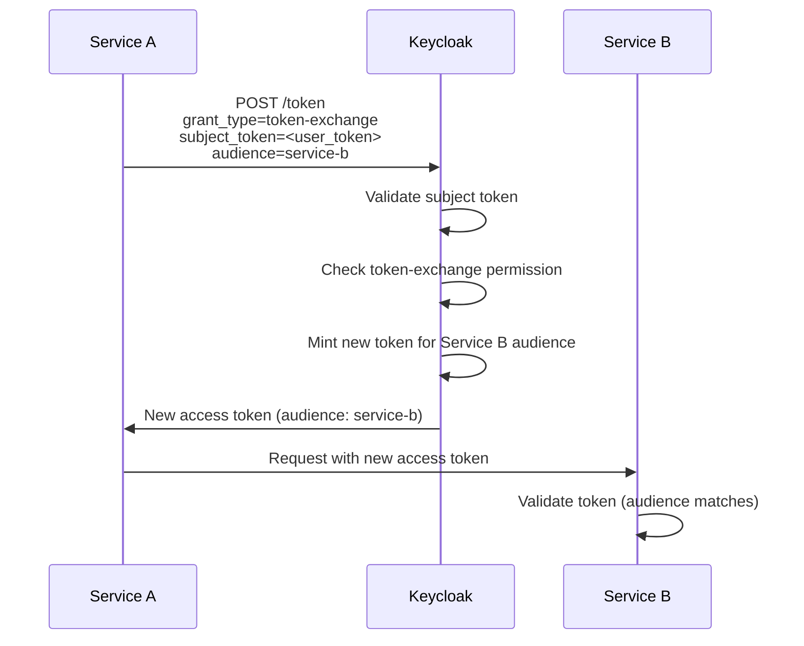

# Keycloak Configuration Guide

## Table of Contents

- [1. Keycloak 26.x Architecture Overview](#1-keycloak-26x-architecture-overview)
- [2. Realm Configuration](#2-realm-configuration)
- [3. Client Configuration](#3-client-configuration)
- [4. Identity Providers](#4-identity-providers)
- [5. User Federation](#5-user-federation)
- [6. Authentication Flows](#6-authentication-flows)
- [7. Realm Export/Import Strategy](#7-realm-exportimport-strategy)
- [8. Configuration as Code](#8-configuration-as-code)
- [9. Token Configuration](#9-token-configuration)

---

## 1. Keycloak 26.x Architecture Overview

Keycloak 26.x is built on the Quarkus runtime, replacing the legacy WildFly/JBoss distribution. This provides a smaller footprint, faster startup, and a build-time optimization model.

### Architecture Diagram



### Key Quarkus-Based Configuration Properties

| Property | Description | Default | Recommended |
|----------|-------------|---------|-------------|
| `KC_DB` | Database vendor | `dev-file` | `postgres` |
| `KC_DB_URL` | JDBC connection URL | -- | `jdbc:postgresql://pg-primary:5432/keycloak` |
| `KC_DB_POOL_MIN_SIZE` | Minimum connection pool size | `0` | `10` |
| `KC_DB_POOL_MAX_SIZE` | Maximum connection pool size | `100` | `50` |
| `KC_CACHE` | Cache type | `ispn` | `ispn` |
| `KC_CACHE_STACK` | Infinispan transport stack | `udp` | `kubernetes` |
| `KC_HOSTNAME` | Public hostname | -- | `auth.example.com` |
| `KC_HOSTNAME_STRICT` | Strict hostname matching | `true` | `true` |
| `KC_PROXY_HEADERS` | Proxy header handling | -- | `xforwarded` |
| `KC_HTTP_ENABLED` | Enable HTTP (non-TLS) | `false` | `false` (TLS at ingress) |
| `KC_HEALTH_ENABLED` | Health endpoints | `false` | `true` |
| `KC_METRICS_ENABLED` | Metrics endpoint | `false` | `true` |
| `KC_LOG_LEVEL` | Logging level | `info` | `info` (production), `debug` (dev) |
| `KC_FEATURES` | Enabled feature flags | -- | `token-exchange,admin-fine-grained-authz` |

For infrastructure provisioning details, see [Infrastructure as Code](05-infrastructure-as-code.md).

---

## 2. Realm Configuration

### 2.1 Master Realm (Admin Only -- Locked Down)

The master realm is reserved exclusively for Keycloak platform administration. No application clients or end users are configured in the master realm.

**Lockdown Measures:**

| Setting | Value | Rationale |
|---------|-------|-----------|
| Admin console access | IP-restricted via ingress rules | Prevent unauthorized admin access |
| Admin user MFA | TOTP enforced as required action | Protect admin credentials |
| Admin user count | Minimum (2--3 break-glass accounts) | Reduce attack surface |
| Session timeout | 15 minutes idle, 60 minutes max | Limit exposure window |
| Client registration | Disabled | Prevent unauthorized client creation |
| User registration | Disabled | No self-registration in master realm |
| Brute force detection | Enabled (strict) | Protect admin accounts |
| Audit logging | All admin events logged | Full audit trail |

### 2.2 Tenant Realm Template

Each tenant (business unit, application domain, or customer) receives a dedicated realm based on the following template.

#### Login Settings

| Setting | Value | Notes |
|---------|-------|-------|
| User registration | Configurable per tenant | Default: disabled |
| Email as username | `true` | Simplifies user management |
| Edit username | `false` | Prevent identity confusion |
| Forgot password | `true` | Self-service password reset |
| Remember me | `true` | Configurable session extension |
| Email verification | `true` | Required before first login |
| Login with email | `true` | Primary login identifier |
| Duplicate emails | `false` | Enforce email uniqueness |

#### Token Lifetimes and Session Timeouts

| Parameter | Value | Description |
|-----------|-------|-------------|
| Access Token Lifespan | 5 minutes | Short-lived for security |
| Access Token Lifespan (Implicit Flow) | 5 minutes | For legacy implicit flow clients |
| Client Login Timeout | 5 minutes | Time to complete login |
| SSO Session Idle | 30 minutes | Idle timeout before re-authentication |
| SSO Session Max | 8 hours | Maximum session duration (workday) |
| SSO Session Idle (Remember Me) | 7 days | Extended idle for remembered sessions |
| SSO Session Max (Remember Me) | 30 days | Extended maximum for remembered sessions |
| Offline Session Idle | 30 days | Offline token idle timeout |
| Offline Session Max | 60 days | Offline token maximum lifetime |
| Refresh Token Lifespan | 30 minutes | Must be > Access Token Lifespan |
| Refresh Token Max Reuse | 0 | Single-use refresh tokens (rotation enabled) |
| Action Token Lifespan | 5 minutes | Email verification, password reset links |

#### Email Configuration (SMTP)

| Parameter | Value | Notes |
|-----------|-------|-------|
| Host | `smtp.example.com` | SMTP server hostname |
| Port | `587` | STARTTLS port |
| Encryption | `STARTTLS` | TLS encryption |
| Authentication | `true` | SMTP authentication required |
| Username | `keycloak@example.com` | Service account |
| Password | `(from Vault/KMS)` | Never stored in realm export |
| From Address | `noreply@example.com` | Sender address |
| From Display Name | `Identity Platform` | Displayed in email clients |
| Reply-To Address | `support@example.com` | Support contact |
| Envelope From | `bounces@example.com` | Bounce handling |

#### Brute Force Detection Settings

| Parameter | Value | Description |
|-----------|-------|-------------|
| Enabled | `true` | Activate brute force protection |
| Permanent Lockout | `false` | Temporary lockout only |
| Max Login Failures | 5 | Failures before lockout |
| Wait Increment | 60 seconds | Initial lockout duration |
| Max Wait | 900 seconds (15 min) | Maximum lockout duration |
| Failure Reset Time | 600 seconds (10 min) | Time to reset failure counter |
| Quick Login Check (ms) | 1000 | Minimum time between login attempts |
| Minimum Quick Login Wait | 60 seconds | Wait after quick login detected |

---

## 3. Client Configuration

### 3.1 Client Types Overview

| Client Type | Access Type | Use Case | Authentication | Token Type |
|-------------|------------|----------|----------------|------------|
| Confidential | `confidential` | Backend services, server-side web apps | Client secret or signed JWT | Authorization Code |
| Public | `public` | Single-page applications (SPAs), mobile apps | PKCE (no client secret) | Authorization Code + PKCE |
| Bearer-Only | `bearer-only` | APIs that only validate tokens | None (validates incoming tokens) | N/A (consumer only) |
| Service Account | `confidential` | Machine-to-machine communication | Client credentials grant | Client Credentials |

### 3.2 Confidential Client (Backend Services)

Used for server-side applications that can securely store a client secret.

| Field | Value | Description |
|-------|-------|-------------|
| Client ID | `backend-service-01` | Unique identifier |
| Client Protocol | `openid-connect` | Protocol |
| Access Type | `confidential` | Requires client secret |
| Standard Flow Enabled | `true` | Authorization Code flow |
| Implicit Flow Enabled | `false` | Disabled for security |
| Direct Access Grants | `false` | Disabled unless required |
| Service Accounts Enabled | `false` | Enable only if M2M needed |
| Authorization Enabled | `false` | Enable for fine-grained authz |
| Valid Redirect URIs | `https://app.example.com/callback` | Strict URI matching |
| Web Origins | `https://app.example.com` | CORS configuration |
| Client Authenticator | `client-secret` | Or `client-jwt` for enhanced security |
| Consent Required | `false` | Internal apps typically skip consent |
| Full Scope Allowed | `false` | Restrict to assigned scopes only |

### 3.3 Public Client (SPAs)

Used for browser-based applications that cannot securely store secrets.

| Field | Value | Description |
|-------|-------|-------------|
| Client ID | `spa-frontend-01` | Unique identifier |
| Client Protocol | `openid-connect` | Protocol |
| Access Type | `public` | No client secret |
| Standard Flow Enabled | `true` | Authorization Code + PKCE |
| Implicit Flow Enabled | `false` | Deprecated, use PKCE instead |
| Direct Access Grants | `false` | Never for public clients |
| Valid Redirect URIs | `https://spa.example.com/*` | Must be specific |
| Post Logout Redirect URIs | `https://spa.example.com/` | Logout destination |
| Web Origins | `https://spa.example.com` | CORS |
| PKCE Code Challenge Method | `S256` | Required for public clients |

### 3.4 Bearer-Only Client (APIs)

Used for resource servers (APIs) that only validate incoming access tokens.

| Field | Value | Description |
|-------|-------|-------------|
| Client ID | `api-gateway` | Unique identifier |
| Client Protocol | `openid-connect` | Protocol |
| Access Type | `bearer-only` | Token validation only |
| Standard Flow Enabled | `false` | No login flow |
| Direct Access Grants | `false` | No login flow |

> **Note:** In Keycloak 26.x, the `bearer-only` access type is deprecated in the admin console. Instead, configure the client as `confidential` with all flows disabled, or handle token validation entirely on the resource server side using the JWKS endpoint.

### 3.5 Service Account Client (Machine-to-Machine)

Used for automated services that authenticate without user interaction.

| Field | Value | Description |
|-------|-------|-------------|
| Client ID | `batch-processor` | Unique identifier |
| Client Protocol | `openid-connect` | Protocol |
| Access Type | `confidential` | Requires client secret |
| Standard Flow Enabled | `false` | No browser flow |
| Implicit Flow Enabled | `false` | Disabled |
| Direct Access Grants | `false` | Not needed |
| Service Accounts Enabled | `true` | Enables client_credentials grant |
| Client Authenticator | `client-secret-jwt` | Recommended over plain secret |
| Service Account Roles | Assigned per least privilege | Only required roles |

### 3.6 Example Client Configuration Summary

| Client ID | Type | Flows | PKCE | Service Account | Scopes |
|-----------|------|-------|------|-----------------|--------|
| `backend-service-01` | Confidential | Authorization Code | No | No | `openid profile email` |
| `spa-frontend-01` | Public | Authorization Code + PKCE | S256 | No | `openid profile email` |
| `api-gateway` | Bearer-Only | None | No | No | N/A |
| `batch-processor` | Confidential | Client Credentials | No | Yes | `custom:batch-read custom:batch-write` |
| `mobile-app-01` | Public | Authorization Code + PKCE | S256 | No | `openid profile email offline_access` |
| `partner-api` | Confidential | Authorization Code | No | Yes | `openid partner:read partner:write` |

---

## 4. Identity Providers

### 4.1 SAML 2.0 IdP Configuration

Used for federating with enterprise identity providers (e.g., ADFS, Shibboleth, PingFederate).

| Parameter | Value | Description |
|-----------|-------|-------------|
| Alias | `corporate-adfs` | Unique IdP identifier |
| Display Name | `Corporate SSO` | Shown on login page |
| Enabled | `true` | Active federation |
| Trust Email | `true` | Trust email from IdP |
| First Login Flow | `first broker login` | Handles first-time federation |
| Sync Mode | `IMPORT` | Import user on first login |
| Single Sign-On Service URL | `https://adfs.corp.com/adfs/ls/` | IdP SSO endpoint |
| Single Logout Service URL | `https://adfs.corp.com/adfs/ls/?wa=wsignout1.0` | IdP SLO endpoint |
| NameID Policy Format | `urn:oasis:names:tc:SAML:1.1:nameid-format:emailAddress` | Email-based NameID |
| Principal Type | `ATTRIBUTE` | Map principal from attribute |
| Principal Attribute | `http://schemas.xmlsoap.org/ws/2005/05/identity/claims/emailaddress` | Email claim |
| Want AuthnRequests Signed | `true` | Sign outgoing requests |
| Want Assertions Signed | `true` | Require signed assertions |
| Want Assertions Encrypted | `true` | Require encrypted assertions |
| Signature Algorithm | `RSA_SHA256` | Signing algorithm |
| SAML Signature Key Name | `KEY_ID` | Key name in signature |
| Validate Signature | `true` | Validate IdP signatures |
| Validating X509 Certificates | `(IdP signing certificate PEM)` | IdP public certificate |

**Attribute Mappers:**

| SAML Attribute | Keycloak Attribute | Mapper Type |
|----------------|-------------------|-------------|
| `emailaddress` | `email` | Attribute Importer |
| `givenname` | `firstName` | Attribute Importer |
| `surname` | `lastName` | Attribute Importer |
| `groups` | `groups` | Attribute Importer |
| `department` | `department` | Attribute Importer |

### 4.2 OIDC IdP Federation

Used for federating with other OIDC-compliant providers (e.g., Azure AD, Okta, Google Workspace).

| Parameter | Value | Description |
|-----------|-------|-------------|
| Alias | `azure-ad` | Unique IdP identifier |
| Display Name | `Azure Active Directory` | Shown on login page |
| Discovery URL | `https://login.microsoftonline.com/{tenant}/.well-known/openid-configuration` | OIDC discovery endpoint |
| Client ID | `(Azure AD App Registration Client ID)` | From Azure AD |
| Client Secret | `(from Vault)` | Securely managed |
| Client Authentication | `Client secret sent as post` | Authentication method |
| Default Scopes | `openid profile email` | Requested scopes |
| Prompt | `login` | Force login at IdP |
| Trust Email | `true` | Trust email from Azure AD |
| Sync Mode | `IMPORT` | Import user data |
| First Login Flow | `first broker login` | Handle new users |

### 4.3 Social Providers (Optional)

Social identity providers can be configured for consumer-facing applications.

| Provider | Configuration Required | Use Case |
|----------|----------------------|----------|
| Google | OAuth 2.0 Client ID/Secret from Google Cloud Console | Consumer login |
| Microsoft | Azure AD App Registration | Employee self-service |
| GitHub | OAuth App in GitHub settings | Developer portals |
| Apple | Apple Developer account, Service ID | iOS applications |

> **Note:** Social providers should be configured in tenant realms only, never in the master realm.

---

## 5. User Federation

### 5.1 LDAP/AD Integration

Keycloak can synchronize users from LDAP or Active Directory.

| Parameter | Value | Description |
|-----------|-------|-------------|
| Console Display Name | `Corporate Active Directory` | Display name in admin console |
| Vendor | `Active Directory` | LDAP vendor |
| Connection URL | `ldaps://dc01.corp.example.com:636` | LDAPS endpoint |
| Users DN | `OU=Users,DC=corp,DC=example,DC=com` | User search base |
| Bind DN | `CN=keycloak-svc,OU=ServiceAccounts,DC=corp,DC=example,DC=com` | Service account |
| Bind Credential | `(from Vault)` | Service account password |
| Edit Mode | `READ_ONLY` | Keycloak cannot modify LDAP |
| Sync Registrations | `false` | No new users created in LDAP |
| Search Scope | `2` (subtree) | Search entire subtree |
| Pagination | `true` | Enable for large directories |
| Batch Size | `1000` | LDAP page size |
| Full Sync Period | `86400` (daily) | Full synchronization interval |
| Changed Users Sync Period | `3600` (hourly) | Incremental sync interval |
| Import Users | `true` | Import users to local database |
| Use Truststore SPI | `Always` | Validate LDAP server certificate |
| Connection Pooling | `true` | Pool LDAP connections |

**LDAP Mappers:**

| Mapper Name | Type | LDAP Attribute | Keycloak Attribute |
|-------------|------|---------------|-------------------|
| Username | `user-attribute-ldap-mapper` | `sAMAccountName` | `username` |
| Email | `user-attribute-ldap-mapper` | `mail` | `email` |
| First Name | `user-attribute-ldap-mapper` | `givenName` | `firstName` |
| Last Name | `user-attribute-ldap-mapper` | `sn` | `lastName` |
| Groups | `group-ldap-mapper` | LDAP groups OU | Keycloak groups |
| Roles | `role-ldap-mapper` | LDAP roles OU | Keycloak realm roles |

### 5.2 Custom User Storage SPI

For legacy systems that do not expose LDAP/AD, a custom User Storage SPI can bridge the gap.

**SPI Implementation Requirements:**

| Component | Description |
|-----------|-------------|
| `UserStorageProviderFactory` | Factory class, registered via `META-INF/services` |
| `UserStorageProvider` | Core provider implementing lookup, authentication, and credential validation |
| `UserLookupProvider` | Find users by ID, username, or email |
| `CredentialInputValidator` | Validate passwords against the legacy system |
| `UserQueryProvider` | Support user listing and search in admin console |
| Deployment | Package as JAR, deploy to `providers/` directory in Keycloak |

**Key Design Considerations:**

- Implement caching to reduce calls to the legacy system.
- Handle connection failures gracefully (circuit breaker pattern).
- Log all authentication attempts for audit purposes.
- Plan migration path: gradually move users from legacy SPI to Keycloak local storage.

---

## 6. Authentication Flows

### 6.1 Browser Flow Customization

The default browser flow is customized to support conditional MFA and federated login.



**Custom Browser Flow Structure:**

| Step | Execution | Requirement | Description |
|------|-----------|-------------|-------------|
| Cookie | Authenticator | ALTERNATIVE | Check existing SSO session |
| Identity Provider Redirector | Authenticator | ALTERNATIVE | Redirect to default IdP (if configured) |
| Forms | Sub-flow | ALTERNATIVE | Username/password + conditional MFA |
| -- Username Password Form | Authenticator | REQUIRED | Collect credentials |
| -- Conditional OTP | Sub-flow | CONDITIONAL | MFA based on conditions |
| ---- Condition: User Role | Condition | REQUIRED | Check if user has MFA-required role |
| ---- OTP Form | Authenticator | REQUIRED | TOTP/Email OTP challenge |

### 6.2 Direct Grant Flow

Used for service accounts and legacy applications that exchange credentials directly for tokens (Resource Owner Password Credentials -- ROPC). This flow should be avoided for user-facing applications.

| Step | Execution | Requirement |
|------|-----------|-------------|
| Validate Username | Authenticator | REQUIRED |
| Validate Password | Authenticator | REQUIRED |
| Conditional OTP | Sub-flow | CONDITIONAL |

> **Security Warning:** The Direct Grant (ROPC) flow is considered insecure for end-user authentication. It should only be used for migration scenarios or machine-to-machine communication where the Authorization Code flow is not feasible.

### 6.3 Registration Flow

| Step | Execution | Requirement | Description |
|------|-----------|-------------|-------------|
| Registration User Creation | Form Action | REQUIRED | Collects username, email, name |
| Password Validation | Form Action | REQUIRED | Enforces password policy |
| Recaptcha | Form Action | REQUIRED | Bot protection |
| Profile Validation | Form Action | REQUIRED | Custom attribute validation |

**Required Actions after Registration:**

| Required Action | Description | Timing |
|----------------|-------------|--------|
| Verify Email | Email verification link sent | Immediately after registration |
| Configure OTP | MFA setup prompt | After email verification |
| Update Password | Force password change | Conditional (admin-triggered) |
| Terms and Conditions | Accept terms | First login |
| Update Profile | Complete profile fields | If mandatory fields are missing |

### 6.4 MFA Setup: Email OTP

A custom authenticator SPI that sends a one-time password via email.



**Email OTP Configuration:**

| Parameter | Value | Description |
|-----------|-------|-------------|
| OTP Length | 6 digits | Code length |
| OTP TTL | 300 seconds (5 min) | Time-to-live |
| Max Attempts | 3 | Before lockout |
| Rate Limit | 1 per 60 seconds | Prevent abuse |
| Email Template | `email-otp.ftl` | Custom FreeMarker template |

### 6.5 MFA Setup: TOTP (Microsoft Authenticator)

Standard TOTP using RFC 6238, compatible with Microsoft Authenticator, Google Authenticator, and other TOTP apps.



**TOTP Configuration:**

| Parameter | Value | Description |
|-----------|-------|-------------|
| OTP Type | `totp` | Time-based OTP |
| Algorithm | `HmacSHA1` | Compatible with most authenticator apps |
| Number of Digits | 6 | Standard TOTP length |
| Look Ahead Window | 1 | Allow 1 period clock skew |
| Period | 30 seconds | TOTP refresh interval |
| Supported Applications | Microsoft Authenticator, Google Authenticator, Authy | TOTP-compatible apps |

### 6.6 MFA Setup: SMS OTP (Twilio)

A custom authenticator SPI that sends OTP codes via SMS using the Twilio API.



**SMS OTP Configuration (Twilio SPI):**

| Parameter | Value | Description |
|-----------|-------|-------------|
| Twilio Account SID | `(from Vault)` | Twilio account identifier |
| Twilio Auth Token | `(from Vault)` | Twilio authentication token |
| Twilio Phone Number | `+1XXXXXXXXXX` | Sender phone number |
| OTP Length | 6 digits | Code length |
| OTP TTL | 180 seconds (3 min) | Shorter TTL for SMS |
| Max Attempts | 3 | Before lockout |
| Rate Limit | 1 per 60 seconds | Prevent SMS flooding |
| Phone Attribute | `phoneNumber` | User attribute for phone |
| Fallback | Email OTP | If SMS delivery fails |

---

## 7. Realm Export/Import Strategy

### Export Strategy

Realm configurations are exported as JSON and version-controlled in Git for environment promotion.

| Export Method | Use Case | Command |
|---------------|----------|---------|
| Admin Console | Manual export for development | Admin Console > Realm Settings > Partial Export |
| CLI (`kc.sh export`) | Full realm export including secrets | `kc.sh export --dir /tmp/export --realm tenant-01` |
| Admin REST API | Automated export in CI/CD | `GET /admin/realms/{realm}` |
| `keycloak-config-cli` | Declarative export/comparison | YAML/JSON configuration files |

### Import Strategy

| Environment | Method | Trigger |
|-------------|--------|---------|
| Dev | `keycloak-config-cli` | On every commit to `main` |
| QA | `keycloak-config-cli` | On promotion approval |
| Production | `keycloak-config-cli` with `--import-managed=no-delete` | On CAB-approved change |

**Key Rules:**

1. Never export secrets (client secrets, SMTP passwords). Inject them from Vault/KMS at deployment time.
2. Use `keycloak-config-cli` managed entities to avoid accidental deletion of production resources.
3. Version realm configuration files alongside infrastructure code.
4. Review realm configuration diffs in pull requests before merging.

For the full environment promotion workflow, see [Transformation / Execution Plan](03-transformation-execution.md).

---

## 8. Configuration as Code

### 8.1 keycloak-config-cli

The recommended approach for managing Keycloak configuration declaratively.

**Directory Structure:**

```
keycloak-config/
  realms/
    master/
      realm.yaml
    tenant-01/
      realm.yaml
      clients/
        backend-service-01.yaml
        spa-frontend-01.yaml
      identity-providers/
        corporate-adfs.yaml
        azure-ad.yaml
      authentication-flows/
        browser-flow.yaml
        registration-flow.yaml
      roles/
        realm-roles.yaml
        client-roles.yaml
      groups/
        groups.yaml
  environments/
    dev.env
    qa.env
    prod.env
```

**Execution:**

```bash
# Apply configuration to a specific environment
docker run --rm \
  -e KEYCLOAK_URL=https://auth.dev.example.com \
  -e KEYCLOAK_AVAILABILITYCHECK_ENABLED=true \
  -e KEYCLOAK_USER=admin \
  -e KEYCLOAK_PASSWORD=${ADMIN_PASSWORD} \
  -v $(pwd)/realms:/config \
  adorsys/keycloak-config-cli:latest
```

### 8.2 Terraform Keycloak Provider

An alternative approach using the `mrparkers/keycloak` Terraform provider for teams already using Terraform.

| Resource | Terraform Type | Description |
|----------|---------------|-------------|
| Realm | `keycloak_realm` | Realm settings, login, token, security |
| Client | `keycloak_openid_client` | OIDC client configuration |
| Client Scope | `keycloak_openid_client_scope` | Scopes and protocol mappers |
| Identity Provider | `keycloak_saml_identity_provider` | SAML IdP configuration |
| User Federation | `keycloak_ldap_user_federation` | LDAP/AD integration |
| Authentication Flow | `keycloak_authentication_flow` | Custom authentication flows |
| Roles | `keycloak_role` | Realm and client roles |
| Groups | `keycloak_group` | Group hierarchy |
| Protocol Mapper | `keycloak_openid_user_attribute_protocol_mapper` | Custom claims |

For Terraform infrastructure modules, see [Infrastructure as Code](05-infrastructure-as-code.md).

---

## 9. Token Configuration

### 9.1 Access Token Customization

Access tokens are customized through protocol mappers to include application-specific claims.

**Default Access Token Claims:**

| Claim | Source | Description |
|-------|--------|-------------|
| `sub` | User ID | Subject identifier |
| `iss` | Realm URL | Issuer |
| `aud` | Client ID | Audience |
| `exp` | Token lifespan | Expiration timestamp |
| `iat` | Current time | Issued-at timestamp |
| `scope` | Client scopes | Granted scopes |
| `realm_access.roles` | Realm roles | User realm roles |
| `resource_access.{client}.roles` | Client roles | User client roles |

### 9.2 Custom JWT Claims via Protocol Mappers

| Mapper Name | Mapper Type | Claim Name | Source | Example Value |
|-------------|------------|------------|--------|---------------|
| Department | User Attribute | `department` | User attribute `department` | `Engineering` |
| Employee ID | User Attribute | `employee_id` | User attribute `employeeId` | `EMP-12345` |
| Organization | User Attribute | `org` | User attribute `organization` | `Ximplicity` |
| Groups | Group Membership | `groups` | Group membership | `["/admins", "/developers"]` |
| Audience Resolve | Audience Resolve | `aud` | Client audiences | `["api-gateway", "backend-service"]` |
| Tenant ID | Hardcoded Claim | `tenant_id` | Hardcoded | `tenant-01` |
| Full Name | Full Name | `name` | First + Last name | `John Doe` |

**Protocol Mapper Configuration Example:**

| Field | Value |
|-------|-------|
| Name | `department-mapper` |
| Mapper Type | `oidc-usermodel-attribute-mapper` |
| User Attribute | `department` |
| Token Claim Name | `department` |
| Claim JSON Type | `String` |
| Add to ID Token | `true` |
| Add to Access Token | `true` |
| Add to UserInfo | `true` |
| Multivalued | `false` |

### 9.3 Token Exchange Configuration

Token exchange enables a service to exchange one token for another, typically for impersonation or cross-realm scenarios.

| Parameter | Value | Description |
|-----------|-------|-------------|
| Feature Flag | `token-exchange` | Must be enabled in `KC_FEATURES` |
| Grant Type | `urn:ietf:params:oauth:grant-type:token-exchange` | Standard grant type |
| Subject Token Type | `urn:ietf:params:oauth:token-type:access_token` | Input token type |
| Requested Token Type | `urn:ietf:params:oauth:token-type:access_token` | Output token type |
| Audience | Target client ID | The client the new token is intended for |
| Permission | `token-exchange` on target client | Fine-grained permission required |

**Token Exchange Flow:**



### 9.4 Refresh Token Rotation

Refresh token rotation provides enhanced security by issuing a new refresh token with each use and invalidating the previous one.

| Parameter | Value | Description |
|-----------|-------|-------------|
| Revoke Refresh Token | `true` | Enable rotation |
| Refresh Token Max Reuse | `0` | Single-use (most secure) |
| Refresh Token Lifespan | 1800 seconds (30 min) | Absolute lifetime |
| Detect Refresh Token Reuse | `true` | Revoke all tokens on reuse detection |

**Behavior on Reuse Detection:**

When a previously used refresh token is presented (potential token theft), Keycloak revokes the entire token family (all refresh tokens issued in the chain), forcing the user to re-authenticate. This is a critical security measure against token theft attacks.

---

## Related Documents

- [Transformation / Execution Plan](03-transformation-execution.md)
- [Infrastructure as Code](05-infrastructure-as-code.md)
