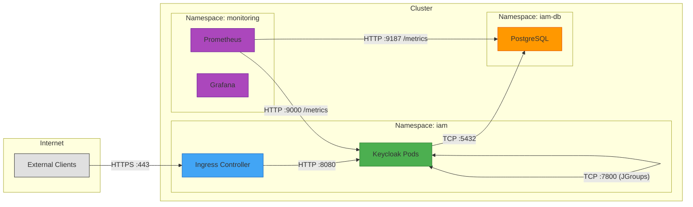
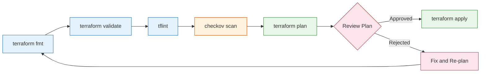

# Infrastructure as Code with Terraform and Kubernetes

This document describes the Infrastructure as Code (IaC) strategy for the enterprise IAM platform built on Keycloak. It covers Terraform project structure, Kubernetes resource definitions, Helm chart usage, Docker image management, and state management best practices.

For CI/CD pipeline integration with these IaC components, see [06-cicd-pipelines.md](./06-cicd-pipelines.md).

---

## Table of Contents

1. [Terraform Project Structure](#terraform-project-structure)
2. [Terraform Module Design](#terraform-module-design)
3. [Kubernetes Resource Definitions](#kubernetes-resource-definitions)
4. [Helm Chart Usage](#helm-chart-usage)
5. [Docker](#docker)
6. [State Management](#state-management)
7. [Terraform Best Practices](#terraform-best-practices)

---

## Terraform Project Structure

The Terraform codebase follows a modular, environment-separated directory layout. Each module encapsulates a single infrastructure concern, and each environment directory composes modules with environment-specific variable values.

```
terraform/
  modules/
    kubernetes-cluster/
      main.tf
      variables.tf
      outputs.tf
      README.md
    keycloak/
      main.tf
      variables.tf
      outputs.tf
      README.md
    postgresql/
      main.tf
      variables.tf
      outputs.tf
      README.md
    networking/
      main.tf
      variables.tf
      outputs.tf
      README.md
    observability/
      main.tf
      variables.tf
      outputs.tf
      README.md
  environments/
    dev/
      main.tf
      variables.tf
      terraform.tfvars
    qa/
      main.tf
      variables.tf
      terraform.tfvars
    prod/
      main.tf
      variables.tf
      terraform.tfvars
  backend.tf
  versions.tf
```

### Directory Responsibilities

| Directory | Purpose |
|---|---|
| `modules/kubernetes-cluster/` | Provisions the managed Kubernetes cluster (EKS, AKS, or GKE) with node pools, RBAC, and add-ons |
| `modules/keycloak/` | Deploys Keycloak via Helm, manages Ingress, TLS certificates, and HPA configuration |
| `modules/postgresql/` | Provisions PostgreSQL -- either managed (RDS, Cloud SQL) or in-cluster StatefulSet with PVCs |
| `modules/networking/` | VPC/VNet, subnets, DNS zones, load balancers, firewall rules, and NetworkPolicies |
| `modules/observability/` | Prometheus, Grafana, Loki, and alerting stack deployment |
| `environments/dev/` | Development environment composition with relaxed resource limits |
| `environments/qa/` | QA environment composition mirroring production topology at reduced scale |
| `environments/prod/` | Production environment composition with full HA, strict policies, and hardened settings |

---

## Terraform Module Design

### kubernetes-cluster Module

Provisions a managed Kubernetes cluster with the following resources:

- Managed cluster resource (e.g., `aws_eks_cluster`, `azurerm_kubernetes_cluster`, `google_container_cluster`)
- System and application node pools with autoscaling
- Cluster RBAC configuration and OIDC provider integration
- Add-ons: CoreDNS, kube-proxy, CNI plugin, cert-manager, external-dns

```hcl
module "kubernetes_cluster" {
  source = "../../modules/kubernetes-cluster"

  cluster_name       = var.cluster_name
  kubernetes_version = "1.29"
  region             = var.region

  node_pools = {
    system = {
      instance_type = "t3.medium"
      min_size      = 2
      max_size      = 4
      labels        = { "node-role" = "system" }
    }
    keycloak = {
      instance_type = "t3.xlarge"
      min_size      = 2
      max_size      = 6
      labels        = { "node-role" = "keycloak" }
      taints        = [{ key = "dedicated", value = "keycloak", effect = "NoSchedule" }]
    }
  }

  tags = var.common_tags
}
```

### keycloak Module

Deploys Keycloak into the Kubernetes cluster:

- Helm release resource referencing Bitnami Keycloak chart
- Ingress resource with TLS termination
- HorizontalPodAutoscaler
- PodDisruptionBudget
- ConfigMaps for realm configuration
- Secrets for admin credentials and database connection

```hcl
module "keycloak" {
  source = "../../modules/keycloak"

  namespace          = "iam"
  replica_count      = var.keycloak_replicas
  image_repository   = var.keycloak_image
  image_tag          = var.keycloak_image_tag
  db_host            = module.postgresql.endpoint
  db_name            = "keycloak"
  db_credentials_secret = module.postgresql.credentials_secret_name
  ingress_hostname   = var.keycloak_hostname
  tls_secret_name    = var.tls_secret_name
  resource_limits    = var.keycloak_resource_limits

  depends_on = [module.kubernetes_cluster, module.postgresql]
}
```

### postgresql Module

Provisions the PostgreSQL database backend:

- Managed database instance (recommended for production) or in-cluster StatefulSet
- Automated backups and point-in-time recovery configuration
- Network access restrictions
- Credentials stored in Kubernetes Secrets

```hcl
module "postgresql" {
  source = "../../modules/postgresql"

  deployment_mode    = var.environment == "prod" ? "managed" : "in-cluster"
  instance_class     = var.db_instance_class
  storage_size_gb    = var.db_storage_size
  backup_retention   = var.environment == "prod" ? 30 : 7
  multi_az           = var.environment == "prod" ? true : false
  namespace          = "iam"

  tags = var.common_tags
}
```

### networking Module

Manages all network infrastructure:

- VPC/VNet with public and private subnets
- NAT gateways for outbound traffic from private subnets
- DNS hosted zones and records
- Load balancer configuration
- Security groups and firewall rules

### observability Module

Deploys the monitoring and logging stack:

- Prometheus with ServiceMonitor CRDs for Keycloak metrics
- Grafana with pre-built Keycloak dashboards
- Loki for centralized log aggregation
- Alertmanager with notification channels
- PagerDuty / Opsgenie integration for production alerts

---

## Kubernetes Resource Definitions

### Namespace Definitions

All IAM components are deployed into dedicated namespaces to enforce resource isolation and RBAC boundaries.

```yaml
apiVersion: v1
kind: Namespace
metadata:
  name: iam
  labels:
    app.kubernetes.io/part-of: iam-platform
    pod-security.kubernetes.io/enforce: restricted
    pod-security.kubernetes.io/audit: restricted
    pod-security.kubernetes.io/warn: restricted
---
apiVersion: v1
kind: Namespace
metadata:
  name: iam-db
  labels:
    app.kubernetes.io/part-of: iam-platform
    pod-security.kubernetes.io/enforce: baseline
```

### Keycloak Deployment with Anti-Affinity Rules

Keycloak is deployed as a Deployment (or StatefulSet when sticky sessions are required) with pod anti-affinity to ensure replicas are spread across failure domains.

```yaml
apiVersion: apps/v1
kind: Deployment
metadata:
  name: keycloak
  namespace: iam
  labels:
    app.kubernetes.io/name: keycloak
    app.kubernetes.io/component: identity-provider
spec:
  replicas: 3
  selector:
    matchLabels:
      app.kubernetes.io/name: keycloak
  template:
    metadata:
      labels:
        app.kubernetes.io/name: keycloak
    spec:
      affinity:
        podAntiAffinity:
          requiredDuringSchedulingIgnoredDuringExecution:
            - labelSelector:
                matchExpressions:
                  - key: app.kubernetes.io/name
                    operator: In
                    values:
                      - keycloak
              topologyKey: kubernetes.io/hostname
          preferredDuringSchedulingIgnoredDuringExecution:
            - weight: 100
              podAffinityTerm:
                labelSelector:
                  matchExpressions:
                    - key: app.kubernetes.io/name
                      operator: In
                      values:
                        - keycloak
                topologyKey: topology.kubernetes.io/zone
      nodeSelector:
        node-role: keycloak
      tolerations:
        - key: dedicated
          value: keycloak
          effect: NoSchedule
      securityContext:
        runAsNonRoot: true
        runAsUser: 1000
        fsGroup: 1000
        seccompProfile:
          type: RuntimeDefault
      containers:
        - name: keycloak
          image: registry.example.com/iam/keycloak:24.0.0-custom
          ports:
            - name: http
              containerPort: 8080
            - name: management
              containerPort: 9000
          env:
            - name: KC_DB
              value: postgres
            - name: KC_DB_URL
              valueFrom:
                secretKeyRef:
                  name: keycloak-db-credentials
                  key: jdbc-url
            - name: KC_DB_USERNAME
              valueFrom:
                secretKeyRef:
                  name: keycloak-db-credentials
                  key: username
            - name: KC_DB_PASSWORD
              valueFrom:
                secretKeyRef:
                  name: keycloak-db-credentials
                  key: password
            - name: KC_HOSTNAME
              value: auth.example.com
            - name: KC_PROXY_HEADERS
              value: xforwarded
            - name: KC_CACHE
              value: ispn
            - name: KC_CACHE_STACK
              value: kubernetes
            - name: KC_HEALTH_ENABLED
              value: "true"
            - name: KC_METRICS_ENABLED
              value: "true"
          resources:
            requests:
              cpu: "500m"
              memory: "1Gi"
            limits:
              cpu: "2"
              memory: "2Gi"
          readinessProbe:
            httpGet:
              path: /health/ready
              port: management
            initialDelaySeconds: 30
            periodSeconds: 10
          livenessProbe:
            httpGet:
              path: /health/live
              port: management
            initialDelaySeconds: 60
            periodSeconds: 15
          startupProbe:
            httpGet:
              path: /health/started
              port: management
            initialDelaySeconds: 15
            periodSeconds: 5
            failureThreshold: 30
          securityContext:
            allowPrivilegeEscalation: false
            readOnlyRootFilesystem: true
            capabilities:
              drop:
                - ALL
          volumeMounts:
            - name: tmp
              mountPath: /tmp
            - name: keycloak-config
              mountPath: /opt/keycloak/conf
              readOnly: true
      volumes:
        - name: tmp
          emptyDir: {}
        - name: keycloak-config
          configMap:
            name: keycloak-config
```

### PostgreSQL StatefulSet with PVCs

```yaml
apiVersion: apps/v1
kind: StatefulSet
metadata:
  name: postgresql
  namespace: iam-db
  labels:
    app.kubernetes.io/name: postgresql
spec:
  serviceName: postgresql
  replicas: 1
  selector:
    matchLabels:
      app.kubernetes.io/name: postgresql
  template:
    metadata:
      labels:
        app.kubernetes.io/name: postgresql
    spec:
      securityContext:
        runAsNonRoot: true
        runAsUser: 999
        fsGroup: 999
      containers:
        - name: postgresql
          image: postgres:16-alpine
          ports:
            - containerPort: 5432
          env:
            - name: POSTGRES_DB
              value: keycloak
            - name: POSTGRES_USER
              valueFrom:
                secretKeyRef:
                  name: postgresql-credentials
                  key: username
            - name: POSTGRES_PASSWORD
              valueFrom:
                secretKeyRef:
                  name: postgresql-credentials
                  key: password
            - name: PGDATA
              value: /var/lib/postgresql/data/pgdata
          resources:
            requests:
              cpu: "250m"
              memory: "512Mi"
            limits:
              cpu: "1"
              memory: "1Gi"
          volumeMounts:
            - name: data
              mountPath: /var/lib/postgresql/data
            - name: init-scripts
              mountPath: /docker-entrypoint-initdb.d
              readOnly: true
          livenessProbe:
            exec:
              command:
                - pg_isready
                - -U
                - $(POSTGRES_USER)
                - -d
                - $(POSTGRES_DB)
            initialDelaySeconds: 30
            periodSeconds: 10
          readinessProbe:
            exec:
              command:
                - pg_isready
                - -U
                - $(POSTGRES_USER)
                - -d
                - $(POSTGRES_DB)
            initialDelaySeconds: 5
            periodSeconds: 5
      volumes:
        - name: init-scripts
          configMap:
            name: postgresql-init-scripts
  volumeClaimTemplates:
    - metadata:
        name: data
      spec:
        accessModes: ["ReadWriteOnce"]
        storageClassName: gp3-encrypted
        resources:
          requests:
            storage: 50Gi
```

### ConfigMaps and Secrets

```yaml
apiVersion: v1
kind: ConfigMap
metadata:
  name: keycloak-config
  namespace: iam
data:
  keycloak.conf: |
    # Database
    db=postgres
    db-pool-initial-size=5
    db-pool-min-size=5
    db-pool-max-size=20

    # HTTP
    http-enabled=true
    http-port=8080
    http-management-port=9000

    # Hostname
    hostname-strict=true

    # Cache
    cache=ispn
    cache-stack=kubernetes

    # Logging
    log-level=INFO
    log-format=json

    # Metrics and Health
    health-enabled=true
    metrics-enabled=true
---
apiVersion: v1
kind: Secret
metadata:
  name: keycloak-db-credentials
  namespace: iam
type: Opaque
stringData:
  jdbc-url: "jdbc:postgresql://postgresql.iam-db.svc.cluster.local:5432/keycloak"
  username: "keycloak"
  password: "<REPLACE_WITH_ACTUAL_PASSWORD>"
---
apiVersion: v1
kind: Secret
metadata:
  name: keycloak-admin-credentials
  namespace: iam
type: Opaque
stringData:
  username: "admin"
  password: "<REPLACE_WITH_ACTUAL_PASSWORD>"
```

> **Note:** In production, use External Secrets Operator or Sealed Secrets instead of plain Kubernetes Secrets. See [06-cicd-pipelines.md](./06-cicd-pipelines.md) for pipeline secret management.

### NetworkPolicies

NetworkPolicies enforce strict traffic control between components. The following diagram illustrates the allowed traffic flows.



```yaml
# Deny all ingress by default in iam namespace
apiVersion: networking.k8s.io/v1
kind: NetworkPolicy
metadata:
  name: default-deny-ingress
  namespace: iam
spec:
  podSelector: {}
  policyTypes:
    - Ingress
---
# Allow ingress controller to reach Keycloak
apiVersion: networking.k8s.io/v1
kind: NetworkPolicy
metadata:
  name: allow-ingress-to-keycloak
  namespace: iam
spec:
  podSelector:
    matchLabels:
      app.kubernetes.io/name: keycloak
  policyTypes:
    - Ingress
  ingress:
    - from:
        - namespaceSelector:
            matchLabels:
              kubernetes.io/metadata.name: ingress-nginx
      ports:
        - protocol: TCP
          port: 8080
---
# Allow Keycloak-to-Keycloak JGroups clustering traffic
apiVersion: networking.k8s.io/v1
kind: NetworkPolicy
metadata:
  name: allow-keycloak-jgroups
  namespace: iam
spec:
  podSelector:
    matchLabels:
      app.kubernetes.io/name: keycloak
  policyTypes:
    - Ingress
  ingress:
    - from:
        - podSelector:
            matchLabels:
              app.kubernetes.io/name: keycloak
      ports:
        - protocol: TCP
          port: 7800
---
# Allow Prometheus to scrape Keycloak metrics
apiVersion: networking.k8s.io/v1
kind: NetworkPolicy
metadata:
  name: allow-prometheus-scrape
  namespace: iam
spec:
  podSelector:
    matchLabels:
      app.kubernetes.io/name: keycloak
  policyTypes:
    - Ingress
  ingress:
    - from:
        - namespaceSelector:
            matchLabels:
              kubernetes.io/metadata.name: monitoring
      ports:
        - protocol: TCP
          port: 9000
---
# Deny all ingress by default in iam-db namespace
apiVersion: networking.k8s.io/v1
kind: NetworkPolicy
metadata:
  name: default-deny-ingress
  namespace: iam-db
spec:
  podSelector: {}
  policyTypes:
    - Ingress
---
# Allow only Keycloak pods to connect to PostgreSQL
apiVersion: networking.k8s.io/v1
kind: NetworkPolicy
metadata:
  name: allow-keycloak-to-postgresql
  namespace: iam-db
spec:
  podSelector:
    matchLabels:
      app.kubernetes.io/name: postgresql
  policyTypes:
    - Ingress
  ingress:
    - from:
        - namespaceSelector:
            matchLabels:
              kubernetes.io/metadata.name: iam
          podSelector:
            matchLabels:
              app.kubernetes.io/name: keycloak
      ports:
        - protocol: TCP
          port: 5432
```

### Ingress Resources with TLS

```yaml
apiVersion: networking.k8s.io/v1
kind: Ingress
metadata:
  name: keycloak-ingress
  namespace: iam
  annotations:
    cert-manager.io/cluster-issuer: letsencrypt-prod
    nginx.ingress.kubernetes.io/ssl-redirect: "true"
    nginx.ingress.kubernetes.io/proxy-buffer-size: "128k"
    nginx.ingress.kubernetes.io/proxy-buffers-number: "4"
    nginx.ingress.kubernetes.io/affinity: "cookie"
    nginx.ingress.kubernetes.io/session-cookie-name: "KC_ROUTE"
    nginx.ingress.kubernetes.io/session-cookie-max-age: "172800"
    nginx.ingress.kubernetes.io/rate-limit: "100"
    nginx.ingress.kubernetes.io/rate-limit-window: "1m"
spec:
  ingressClassName: nginx
  tls:
    - hosts:
        - auth.example.com
      secretName: keycloak-tls
  rules:
    - host: auth.example.com
      http:
        paths:
          - path: /
            pathType: Prefix
            backend:
              service:
                name: keycloak
                port:
                  number: 8080
```

### HorizontalPodAutoscaler

```yaml
apiVersion: autoscaling/v2
kind: HorizontalPodAutoscaler
metadata:
  name: keycloak-hpa
  namespace: iam
spec:
  scaleTargetRef:
    apiVersion: apps/v1
    kind: Deployment
    name: keycloak
  minReplicas: 3
  maxReplicas: 10
  metrics:
    - type: Resource
      resource:
        name: cpu
        target:
          type: Utilization
          averageUtilization: 70
    - type: Resource
      resource:
        name: memory
        target:
          type: Utilization
          averageUtilization: 80
    - type: Pods
      pods:
        metric:
          name: http_server_requests_seconds_count
        target:
          type: AverageValue
          averageValue: "1000"
  behavior:
    scaleUp:
      stabilizationWindowSeconds: 60
      policies:
        - type: Pods
          value: 2
          periodSeconds: 60
    scaleDown:
      stabilizationWindowSeconds: 300
      policies:
        - type: Pods
          value: 1
          periodSeconds: 120
```

### PodDisruptionBudget

```yaml
apiVersion: policy/v1
kind: PodDisruptionBudget
metadata:
  name: keycloak-pdb
  namespace: iam
spec:
  minAvailable: 2
  selector:
    matchLabels:
      app.kubernetes.io/name: keycloak
---
apiVersion: policy/v1
kind: PodDisruptionBudget
metadata:
  name: postgresql-pdb
  namespace: iam-db
spec:
  minAvailable: 1
  selector:
    matchLabels:
      app.kubernetes.io/name: postgresql
```

### ResourceQuotas and LimitRanges

```yaml
apiVersion: v1
kind: ResourceQuota
metadata:
  name: iam-resource-quota
  namespace: iam
spec:
  hard:
    requests.cpu: "8"
    requests.memory: "16Gi"
    limits.cpu: "16"
    limits.memory: "32Gi"
    pods: "20"
    persistentvolumeclaims: "5"
    services.loadbalancers: "1"
---
apiVersion: v1
kind: LimitRange
metadata:
  name: iam-limit-range
  namespace: iam
spec:
  limits:
    - type: Pod
      max:
        cpu: "4"
        memory: "4Gi"
      min:
        cpu: "50m"
        memory: "64Mi"
    - type: Container
      default:
        cpu: "500m"
        memory: "512Mi"
      defaultRequest:
        cpu: "100m"
        memory: "128Mi"
      max:
        cpu: "4"
        memory: "4Gi"
      min:
        cpu: "50m"
        memory: "64Mi"
    - type: PersistentVolumeClaim
      max:
        storage: "100Gi"
      min:
        storage: "1Gi"
```

---

## Helm Chart Usage

### Bitnami Keycloak Chart Customization

The project uses the Bitnami Keycloak Helm chart as a base, with environment-specific values overrides. This provides a well-maintained, production-ready deployment foundation while allowing full customization.

```
helm/
  keycloak/
    Chart.yaml
    values.yaml                  # Base values (shared across all environments)
    values-dev.yaml              # Development overrides
    values-qa.yaml               # QA overrides
    values-prod.yaml             # Production overrides
    templates/
      network-policy.yaml        # Additional custom templates
      pod-disruption-budget.yaml
```

### Base Values (values.yaml)

```yaml
# values.yaml -- Base configuration for all environments
image:
  registry: registry.example.com
  repository: iam/keycloak
  tag: "24.0.0-custom"
  pullPolicy: IfNotPresent

auth:
  adminUser: admin
  existingSecret: keycloak-admin-credentials

replicaCount: 2

extraEnvVars:
  - name: KC_CACHE
    value: ispn
  - name: KC_CACHE_STACK
    value: kubernetes
  - name: KC_LOG_LEVEL
    value: INFO
  - name: KC_LOG_FORMAT
    value: json
  - name: KC_METRICS_ENABLED
    value: "true"
  - name: KC_HEALTH_ENABLED
    value: "true"

postgresql:
  enabled: false

externalDatabase:
  host: postgresql.iam-db.svc.cluster.local
  port: 5432
  database: keycloak
  existingSecret: keycloak-db-credentials

ingress:
  enabled: true
  ingressClassName: nginx
  annotations:
    cert-manager.io/cluster-issuer: letsencrypt-prod
  tls: true

metrics:
  enabled: true
  serviceMonitor:
    enabled: true
    namespace: monitoring

podSecurityContext:
  runAsNonRoot: true
  runAsUser: 1000
  fsGroup: 1000
  seccompProfile:
    type: RuntimeDefault

containerSecurityContext:
  allowPrivilegeEscalation: false
  readOnlyRootFilesystem: true
  capabilities:
    drop:
      - ALL
```

### Environment-Specific Values

```yaml
# values-dev.yaml
replicaCount: 1

resources:
  requests:
    cpu: 250m
    memory: 512Mi
  limits:
    cpu: "1"
    memory: 1Gi

ingress:
  hostname: auth.dev.example.com

extraEnvVars:
  - name: KC_LOG_LEVEL
    value: DEBUG
```

```yaml
# values-prod.yaml
replicaCount: 3

resources:
  requests:
    cpu: "1"
    memory: 2Gi
  limits:
    cpu: "2"
    memory: 4Gi

ingress:
  hostname: auth.example.com

autoscaling:
  enabled: true
  minReplicas: 3
  maxReplicas: 10
  targetCPU: 70
  targetMemory: 80

pdb:
  create: true
  minAvailable: 2
```

### Helm Deployment Commands

```bash
# Development
helm upgrade --install keycloak bitnami/keycloak \
  -n iam --create-namespace \
  -f values.yaml \
  -f values-dev.yaml

# Production
helm upgrade --install keycloak bitnami/keycloak \
  -n iam --create-namespace \
  -f values.yaml \
  -f values-prod.yaml \
  --wait --timeout 10m
```

---

## Docker

### Custom Keycloak Dockerfile

The custom Dockerfile extends the official Keycloak image with organization-specific themes, SPI implementations, and provider extensions.

```dockerfile
# =============================================================================
# Stage 1: Build custom providers and themes
# =============================================================================
FROM maven:3.9-eclipse-temurin-21 AS builder

WORKDIR /build

# Copy provider source code
COPY providers/ ./providers/
COPY themes/ ./themes/
COPY pom.xml .

# Build all custom providers
RUN mvn clean package -DskipTests -pl providers -am

# =============================================================================
# Stage 2: Production Keycloak image
# =============================================================================
FROM quay.io/keycloak/keycloak:24.0.0 AS production

# Set build-time arguments
ARG KC_DB=postgres
ARG KC_FEATURES=token-exchange,admin-fine-grained-authz

ENV KC_DB=${KC_DB}
ENV KC_FEATURES=${KC_FEATURES}

# Copy custom providers from builder stage
COPY --from=builder /build/providers/target/*.jar /opt/keycloak/providers/

# Copy custom themes
COPY --from=builder /build/themes/ /opt/keycloak/themes/

# Copy realm configuration for import
COPY realms/ /opt/keycloak/data/import/

# Build the optimized Keycloak distribution
RUN /opt/keycloak/bin/kc.sh build

# =============================================================================
# Stage 3: Final hardened image
# =============================================================================
FROM quay.io/keycloak/keycloak:24.0.0

# Copy the optimized build from the previous stage
COPY --from=production /opt/keycloak/ /opt/keycloak/

# Run as non-root user (keycloak user UID 1000 is built into the base image)
USER 1000

ENTRYPOINT ["/opt/keycloak/bin/kc.sh"]
CMD ["start", "--optimized"]

# Expose ports
EXPOSE 8080
EXPOSE 9000

# Labels for traceability
LABEL maintainer="iam-team@example.com"
LABEL org.opencontainers.image.source="https://github.com/example/iam-keycloak"
LABEL org.opencontainers.image.description="Custom Keycloak image with enterprise IAM extensions"
```

### Image Scanning with Trivy

Trivy is integrated into the CI/CD pipeline (see [06-cicd-pipelines.md](./06-cicd-pipelines.md)) and can also be run locally.

```bash
# Scan the built image for vulnerabilities
trivy image --severity HIGH,CRITICAL \
  --exit-code 1 \
  --ignore-unfixed \
  --format table \
  registry.example.com/iam/keycloak:24.0.0-custom

# Generate SBOM (Software Bill of Materials)
trivy image --format spdx-json \
  --output keycloak-sbom.spdx.json \
  registry.example.com/iam/keycloak:24.0.0-custom

# Scan Dockerfile for misconfigurations
trivy config --severity HIGH,CRITICAL \
  --exit-code 1 \
  ./Dockerfile
```

### Container Hardening Checklist

| Hardening Measure | Implementation |
|---|---|
| Non-root user | `USER 1000` in Dockerfile; `runAsNonRoot: true` in pod spec |
| Read-only filesystem | `readOnlyRootFilesystem: true` in security context; writable `/tmp` via emptyDir |
| Drop all capabilities | `capabilities: { drop: [ALL] }` |
| No privilege escalation | `allowPrivilegeEscalation: false` |
| Seccomp profile | `seccompProfile: { type: RuntimeDefault }` |
| Minimal base image | Official Keycloak image based on UBI minimal |
| No package manager | Package managers removed in base image |
| Image signing | Cosign for image provenance and verification |
| Vulnerability scanning | Trivy integrated in CI pipeline, blocking on HIGH/CRITICAL |
| SBOM generation | SPDX SBOM generated and stored alongside image |

---

## State Management

### Remote State Backend

Terraform state must never be stored locally or committed to version control. A remote backend provides shared access, encryption at rest, and state locking.

```hcl
# backend.tf -- Example for AWS S3 backend
terraform {
  backend "s3" {
    bucket         = "example-iam-terraform-state"
    key            = "iam-keycloak/terraform.tfstate"
    region         = "eu-west-1"
    encrypt        = true
    dynamodb_table = "terraform-state-lock"
    kms_key_id     = "alias/terraform-state"
  }
}
```

```hcl
# backend.tf -- Example for Azure Blob Storage backend
terraform {
  backend "azurerm" {
    resource_group_name  = "rg-terraform-state"
    storage_account_name = "stterraformstate"
    container_name       = "tfstate"
    key                  = "iam-keycloak/terraform.tfstate"
    use_oidc             = true
  }
}
```

```hcl
# backend.tf -- Example for Google Cloud Storage backend
terraform {
  backend "gcs" {
    bucket = "example-iam-terraform-state"
    prefix = "iam-keycloak"
  }
}
```

### State Locking

State locking prevents concurrent modifications that could corrupt state. Each backend implements locking differently:

| Backend | Locking Mechanism | Configuration |
|---|---|---|
| AWS S3 | DynamoDB table | `dynamodb_table = "terraform-state-lock"` |
| Azure Blob | Native blob leasing | Automatic -- no extra configuration |
| GCS | Native object locking | Automatic -- no extra configuration |

### Workspace Strategy vs Directory Strategy

This project uses the **directory strategy** (recommended) rather than Terraform workspaces.

| Aspect | Workspace Strategy | Directory Strategy (Recommended) |
|---|---|---|
| State isolation | Same backend, different state files | Completely separate backend keys |
| Variable management | Conditional logic or `.tfvars` per workspace | Dedicated `terraform.tfvars` per directory |
| Code divergence | Single codebase; environment differences via conditionals | Per-environment `main.tf` composes shared modules |
| Risk of misconfiguration | Higher -- wrong workspace can target wrong environment | Lower -- each directory is self-contained |
| CI/CD integration | Requires workspace selection step | Natural directory-based pipeline triggers |
| Blast radius | Shared state backend increases risk | Fully isolated per environment |

**Rationale:** The directory strategy provides stronger isolation between environments, reduces the risk of accidental changes to the wrong environment, and aligns naturally with CI/CD pipeline structures that trigger on path changes.

---

## Terraform Best Practices

### Version Pinning

All provider and module versions must be pinned to prevent unexpected changes.

```hcl
# versions.tf
terraform {
  required_version = ">= 1.7.0, < 2.0.0"

  required_providers {
    kubernetes = {
      source  = "hashicorp/kubernetes"
      version = "~> 2.29.0"
    }
    helm = {
      source  = "hashicorp/helm"
      version = "~> 2.13.0"
    }
    aws = {
      source  = "hashicorp/aws"
      version = "~> 5.40.0"
    }
  }
}
```

### Module Versioning

Internal modules are versioned using Git tags and referenced with explicit version constraints.

```hcl
module "keycloak" {
  source  = "git::https://github.com/example/terraform-modules.git//keycloak?ref=v2.1.0"
}
```

For modules in a private registry:

```hcl
module "keycloak" {
  source  = "app.terraform.io/example-org/keycloak/kubernetes"
  version = "~> 2.1.0"
}
```

### Plan and Apply Workflow



1. **Format**: `terraform fmt -recursive` ensures consistent code style.
2. **Validate**: `terraform validate` checks syntax and internal consistency.
3. **Lint**: `tflint` catches provider-specific issues and enforces naming conventions.
4. **Security Scan**: `checkov` or `tfsec` identifies security misconfigurations.
5. **Plan**: `terraform plan -out=tfplan` generates an execution plan saved to a file.
6. **Review**: The plan is reviewed as part of a pull request. For production, a manual approval gate is required.
7. **Apply**: `terraform apply tfplan` executes only the reviewed plan.

### Drift Detection

Scheduled drift detection ensures that the actual infrastructure matches the declared state.

```bash
# Run drift detection (scheduled via CI/CD -- see 06-cicd-pipelines.md)
terraform plan -detailed-exitcode -out=drift-check.tfplan

# Exit codes:
#   0 = No changes (in sync)
#   1 = Error
#   2 = Changes detected (drift)
```

Drift detection should run on a daily schedule for production environments. When drift is detected, the pipeline should:

1. Generate a detailed plan output
2. Send a notification to the infrastructure team (Slack, email, or PagerDuty)
3. Create a Jira ticket for investigation
4. **Never auto-apply** -- drift may be intentional (e.g., emergency manual change)

---

## Summary

| Component | Tool | Key Configuration |
|---|---|---|
| Cluster provisioning | Terraform | Managed Kubernetes with dedicated node pools |
| Keycloak deployment | Helm + Terraform | Bitnami chart with custom values per environment |
| Database | Terraform | Managed service (prod) or StatefulSet (dev/qa) |
| Networking | Terraform + K8s NetworkPolicy | Strict ingress/egress rules between namespaces |
| Docker images | Multi-stage Dockerfile | Custom providers, themes, hardened runtime |
| State management | Remote backend (S3/GCS/Azure) | Directory strategy with state locking |
| Security scanning | Trivy, Checkov | Integrated in CI/CD, blocking on HIGH/CRITICAL |

For pipeline automation of all infrastructure operations described in this document, refer to [06-cicd-pipelines.md](./06-cicd-pipelines.md).
