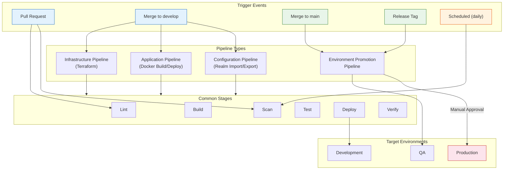
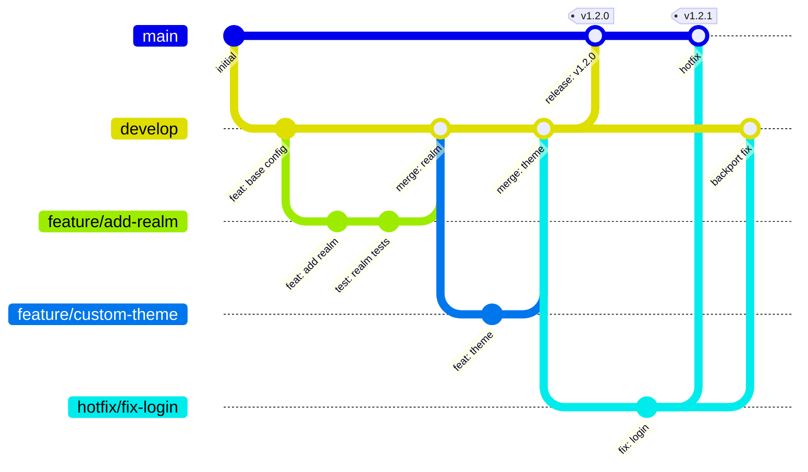
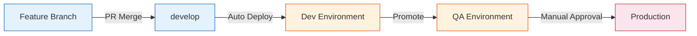

# CI/CD Pipeline Design

This document describes the CI/CD pipeline architecture for the enterprise IAM platform built on Keycloak. It covers GitHub Actions and GitLab CI configurations, branching strategies, secret management, rollback automation, and environment promotion workflows.

For the underlying infrastructure definitions that these pipelines deploy, see [05-infrastructure-as-code.md](./05-infrastructure-as-code.md).

---

## Table of Contents

1. [Pipeline Architecture Overview](#pipeline-architecture-overview)
2. [Pipeline Stages](#pipeline-stages)
3. [GitHub Actions Workflows](#github-actions-workflows)
4. [GitLab CI Equivalent](#gitlab-ci-equivalent)
5. [Branching Strategy](#branching-strategy)
6. [Secret Management in Pipelines](#secret-management-in-pipelines)
7. [Rollback Automation](#rollback-automation)
8. [Notifications](#notifications)
9. [Artifact Management](#artifact-management)
10. [Environment-Specific Deployment Configurations](#environment-specific-deployment-configurations)
11. [Branch Protection Rules](#branch-protection-rules)

---

## Pipeline Architecture Overview

The CI/CD system is composed of four primary pipelines, each responsible for a distinct concern. Pipelines are triggered by changes to specific paths in the repository and follow a promotion model from development through to production.



---

## Pipeline Stages

| Stage | Description | Tools | Trigger | Blocking |
|---|---|---|---|---|
| **Lint** | Code formatting, Terraform fmt/validate, YAML lint, Dockerfile lint | tflint, checkov, yamllint, hadolint | Every PR and push | Yes |
| **Build** | Docker image build with multi-stage Dockerfile | Docker, Buildx, BuildKit | Push to develop/main | Yes |
| **Scan** | Security scanning of images, IaC, and dependencies | Trivy, Checkov, OWASP ZAP, Grype | Every PR, push, daily schedule | Yes (HIGH/CRITICAL) |
| **Test** | Unit tests, integration tests, API contract tests | JUnit, Jest, Testcontainers, Postman/Newman | Every PR and push | Yes |
| **Deploy** | Helm upgrade for application, Terraform apply for infrastructure | Helm, Terraform, kubectl | Merge to develop (auto), main (manual) | Yes |
| **Verify** | Smoke tests, health checks, synthetic login flow | curl, k6, Playwright | After every deployment | Yes |

---

## GitHub Actions Workflows

### Infrastructure Pipeline (Terraform Plan/Apply)

```yaml
# .github/workflows/infrastructure.yml
name: Infrastructure Pipeline

on:
  pull_request:
    paths:
      - "terraform/**"
      - ".github/workflows/infrastructure.yml"
  push:
    branches:
      - develop
      - main
    paths:
      - "terraform/**"
  schedule:
    # Daily drift detection at 06:00 UTC
    - cron: "0 6 * * *"

permissions:
  id-token: write
  contents: read
  pull-requests: write

env:
  TF_VERSION: "1.7.5"
  TFLINT_VERSION: "0.50.3"

jobs:
  detect-environment:
    runs-on: ubuntu-latest
    outputs:
      environment: ${{ steps.detect.outputs.environment }}
      working_directory: ${{ steps.detect.outputs.working_directory }}
    steps:
      - name: Detect target environment
        id: detect
        run: |
          if [[ "${{ github.ref }}" == "refs/heads/main" ]]; then
            echo "environment=prod" >> "$GITHUB_OUTPUT"
            echo "working_directory=terraform/environments/prod" >> "$GITHUB_OUTPUT"
          elif [[ "${{ github.event_name }}" == "schedule" ]]; then
            echo "environment=prod" >> "$GITHUB_OUTPUT"
            echo "working_directory=terraform/environments/prod" >> "$GITHUB_OUTPUT"
          else
            echo "environment=dev" >> "$GITHUB_OUTPUT"
            echo "working_directory=terraform/environments/dev" >> "$GITHUB_OUTPUT"
          fi

  lint:
    runs-on: ubuntu-latest
    steps:
      - name: Checkout
        uses: actions/checkout@v4

      - name: Setup Terraform
        uses: hashicorp/setup-terraform@v3
        with:
          terraform_version: ${{ env.TF_VERSION }}

      - name: Terraform Format Check
        run: terraform fmt -check -recursive -diff
        working-directory: terraform/

      - name: Terraform Validate
        run: |
          for env_dir in terraform/environments/*/; do
            echo "Validating ${env_dir}..."
            cd "$env_dir"
            terraform init -backend=false
            terraform validate
            cd -
          done

      - name: Setup TFLint
        uses: terraform-linters/setup-tflint@v4
        with:
          tflint_version: ${{ env.TFLINT_VERSION }}

      - name: Run TFLint
        run: |
          tflint --init
          tflint --recursive --format compact
        working-directory: terraform/

  security-scan:
    runs-on: ubuntu-latest
    steps:
      - name: Checkout
        uses: actions/checkout@v4

      - name: Run Checkov
        uses: bridgecrewio/checkov-action@v12
        with:
          directory: terraform/
          framework: terraform
          output_format: sarif
          soft_fail: false
          skip_check: CKV_TF_1  # Example: skip specific check if justified

      - name: Upload SARIF results
        if: always()
        uses: github/codeql-action/upload-sarif@v3
        with:
          sarif_file: results.sarif

  plan:
    needs: [detect-environment, lint, security-scan]
    runs-on: ubuntu-latest
    environment: ${{ needs.detect-environment.outputs.environment }}
    env:
      WORKING_DIR: ${{ needs.detect-environment.outputs.working_directory }}
    steps:
      - name: Checkout
        uses: actions/checkout@v4

      - name: Configure cloud credentials
        uses: aws-actions/configure-aws-credentials@v4
        with:
          role-to-assume: ${{ secrets.AWS_ROLE_ARN }}
          aws-region: ${{ vars.AWS_REGION }}

      - name: Setup Terraform
        uses: hashicorp/setup-terraform@v3
        with:
          terraform_version: ${{ env.TF_VERSION }}

      - name: Terraform Init
        run: terraform init
        working-directory: ${{ env.WORKING_DIR }}

      - name: Terraform Plan
        id: plan
        run: |
          terraform plan \
            -detailed-exitcode \
            -out=tfplan \
            -input=false \
            2>&1 | tee plan-output.txt
        working-directory: ${{ env.WORKING_DIR }}
        continue-on-error: true

      - name: Comment plan on PR
        if: github.event_name == 'pull_request'
        uses: actions/github-script@v7
        with:
          script: |
            const fs = require('fs');
            const plan = fs.readFileSync(
              '${{ env.WORKING_DIR }}/plan-output.txt', 'utf8'
            );
            const body = `### Terraform Plan -- \`${{ needs.detect-environment.outputs.environment }}\`
            \`\`\`
            ${plan.substring(0, 65000)}
            \`\`\``;
            github.rest.issues.createComment({
              issue_number: context.issue.number,
              owner: context.repo.owner,
              repo: context.repo.repo,
              body: body
            });

      - name: Upload plan artifact
        uses: actions/upload-artifact@v4
        with:
          name: tfplan-${{ needs.detect-environment.outputs.environment }}
          path: ${{ env.WORKING_DIR }}/tfplan
          retention-days: 5

      - name: Drift detection notification
        if: github.event_name == 'schedule' && steps.plan.outputs.exitcode == '2'
        run: |
          echo "::warning::Infrastructure drift detected in production!"
          # Trigger Slack notification (see Notifications section)

  apply:
    needs: [detect-environment, plan]
    if: github.event_name == 'push' && (github.ref == 'refs/heads/develop' || github.ref == 'refs/heads/main')
    runs-on: ubuntu-latest
    environment:
      name: ${{ needs.detect-environment.outputs.environment }}
      url: https://auth.${{ needs.detect-environment.outputs.environment }}.example.com
    env:
      WORKING_DIR: ${{ needs.detect-environment.outputs.working_directory }}
    steps:
      - name: Checkout
        uses: actions/checkout@v4

      - name: Configure cloud credentials
        uses: aws-actions/configure-aws-credentials@v4
        with:
          role-to-assume: ${{ secrets.AWS_ROLE_ARN }}
          aws-region: ${{ vars.AWS_REGION }}

      - name: Setup Terraform
        uses: hashicorp/setup-terraform@v3
        with:
          terraform_version: ${{ env.TF_VERSION }}

      - name: Download plan artifact
        uses: actions/download-artifact@v4
        with:
          name: tfplan-${{ needs.detect-environment.outputs.environment }}
          path: ${{ env.WORKING_DIR }}

      - name: Terraform Init
        run: terraform init
        working-directory: ${{ env.WORKING_DIR }}

      - name: Terraform Apply
        run: terraform apply -auto-approve -input=false tfplan
        working-directory: ${{ env.WORKING_DIR }}

  verify:
    needs: [detect-environment, apply]
    runs-on: ubuntu-latest
    steps:
      - name: Health check
        run: |
          for i in $(seq 1 30); do
            status=$(curl -s -o /dev/null -w "%{http_code}" \
              "https://auth.${{ needs.detect-environment.outputs.environment }}.example.com/health/ready")
            if [ "$status" = "200" ]; then
              echo "Health check passed"
              exit 0
            fi
            echo "Attempt $i: status=$status, retrying in 10s..."
            sleep 10
          done
          echo "Health check failed after 30 attempts"
          exit 1
```

### Application Pipeline (Docker Build, Scan, Push, Deploy)

```yaml
# .github/workflows/application.yml
name: Application Pipeline

on:
  pull_request:
    paths:
      - "docker/**"
      - "providers/**"
      - "themes/**"
      - ".github/workflows/application.yml"
  push:
    branches:
      - develop
      - main
    paths:
      - "docker/**"
      - "providers/**"
      - "themes/**"

permissions:
  id-token: write
  contents: read
  packages: write
  security-events: write

env:
  REGISTRY: registry.example.com
  IMAGE_NAME: iam/keycloak

jobs:
  lint:
    runs-on: ubuntu-latest
    steps:
      - name: Checkout
        uses: actions/checkout@v4

      - name: Lint Dockerfile
        uses: hadolint/hadolint-action@v3
        with:
          dockerfile: docker/Dockerfile
          failure-threshold: warning

  build:
    needs: lint
    runs-on: ubuntu-latest
    outputs:
      image_tag: ${{ steps.meta.outputs.version }}
      image_digest: ${{ steps.build.outputs.digest }}
    steps:
      - name: Checkout
        uses: actions/checkout@v4

      - name: Set up Docker Buildx
        uses: docker/setup-buildx-action@v3

      - name: Login to container registry
        uses: docker/login-action@v3
        with:
          registry: ${{ env.REGISTRY }}
          username: ${{ secrets.REGISTRY_USERNAME }}
          password: ${{ secrets.REGISTRY_PASSWORD }}

      - name: Extract metadata
        id: meta
        uses: docker/metadata-action@v5
        with:
          images: ${{ env.REGISTRY }}/${{ env.IMAGE_NAME }}
          tags: |
            type=sha,prefix=
            type=ref,event=branch
            type=semver,pattern={{version}}
            type=raw,value=latest,enable={{is_default_branch}}

      - name: Build and push
        id: build
        uses: docker/build-push-action@v5
        with:
          context: .
          file: docker/Dockerfile
          push: true
          tags: ${{ steps.meta.outputs.tags }}
          labels: ${{ steps.meta.outputs.labels }}
          cache-from: type=gha
          cache-to: type=gha,mode=max
          platforms: linux/amd64,linux/arm64

  scan:
    needs: build
    runs-on: ubuntu-latest
    steps:
      - name: Run Trivy vulnerability scanner
        uses: aquasecurity/trivy-action@master
        with:
          image-ref: "${{ env.REGISTRY }}/${{ env.IMAGE_NAME }}:${{ needs.build.outputs.image_tag }}"
          format: "sarif"
          output: "trivy-results.sarif"
          severity: "HIGH,CRITICAL"
          exit-code: "1"
          ignore-unfixed: true

      - name: Upload Trivy SARIF results
        if: always()
        uses: github/codeql-action/upload-sarif@v3
        with:
          sarif_file: trivy-results.sarif

      - name: Generate SBOM
        uses: aquasecurity/trivy-action@master
        with:
          image-ref: "${{ env.REGISTRY }}/${{ env.IMAGE_NAME }}:${{ needs.build.outputs.image_tag }}"
          format: "spdx-json"
          output: "sbom.spdx.json"

      - name: Upload SBOM
        uses: actions/upload-artifact@v4
        with:
          name: sbom
          path: sbom.spdx.json
          retention-days: 90

  test:
    needs: build
    runs-on: ubuntu-latest
    services:
      postgres:
        image: postgres:16-alpine
        env:
          POSTGRES_DB: keycloak_test
          POSTGRES_USER: keycloak
          POSTGRES_PASSWORD: test_password
        ports:
          - 5432:5432
        options: >-
          --health-cmd pg_isready
          --health-interval 10s
          --health-timeout 5s
          --health-retries 5
    steps:
      - name: Checkout
        uses: actions/checkout@v4

      - name: Run integration tests
        run: |
          docker run --rm --network host \
            -e KC_DB=postgres \
            -e KC_DB_URL=jdbc:postgresql://localhost:5432/keycloak_test \
            -e KC_DB_USERNAME=keycloak \
            -e KC_DB_PASSWORD=test_password \
            -e KC_HOSTNAME_STRICT=false \
            -e KC_HTTP_ENABLED=true \
            "${{ env.REGISTRY }}/${{ env.IMAGE_NAME }}:${{ needs.build.outputs.image_tag }}" \
            start-dev &

          # Wait for Keycloak to be ready
          for i in $(seq 1 60); do
            if curl -sf http://localhost:8080/health/ready > /dev/null 2>&1; then
              echo "Keycloak is ready"
              break
            fi
            sleep 5
          done

          # Run API tests
          npm ci --prefix tests/
          npm test --prefix tests/

  deploy:
    needs: [build, scan, test]
    if: github.event_name == 'push'
    runs-on: ubuntu-latest
    environment:
      name: ${{ github.ref == 'refs/heads/main' && 'prod' || 'dev' }}
      url: https://auth.${{ github.ref == 'refs/heads/main' && '' || 'dev.' }}example.com
    steps:
      - name: Checkout
        uses: actions/checkout@v4

      - name: Configure kubeconfig
        uses: azure/k8s-set-context@v4
        with:
          method: kubeconfig
          kubeconfig: ${{ secrets.KUBECONFIG }}

      - name: Deploy with Helm
        run: |
          ENV=${{ github.ref == 'refs/heads/main' && 'prod' || 'dev' }}

          helm upgrade --install keycloak bitnami/keycloak \
            --namespace iam \
            --create-namespace \
            -f helm/keycloak/values.yaml \
            -f helm/keycloak/values-${ENV}.yaml \
            --set image.tag=${{ needs.build.outputs.image_tag }} \
            --wait \
            --timeout 10m \
            --atomic

  verify:
    needs: deploy
    runs-on: ubuntu-latest
    steps:
      - name: Checkout
        uses: actions/checkout@v4

      - name: Smoke tests
        run: |
          ENV=${{ github.ref == 'refs/heads/main' && 'prod' || 'dev' }}
          BASE_URL="https://auth.${ENV}.example.com"

          # Health endpoint
          curl -sf "${BASE_URL}/health/ready" || exit 1

          # OpenID Configuration discovery
          curl -sf "${BASE_URL}/realms/master/.well-known/openid-configuration" | jq . || exit 1

          # Admin console accessible
          curl -sf -o /dev/null -w "%{http_code}" "${BASE_URL}/admin/" | grep -q "200" || exit 1

          echo "All smoke tests passed"

      - name: Load test (non-production only)
        if: github.ref != 'refs/heads/main'
        run: |
          # Install k6
          sudo gpg -k
          sudo gpg --no-default-keyring --keyring /usr/share/keyrings/k6-archive-keyring.gpg \
            --keyserver hkp://keyserver.ubuntu.com:80 --recv-keys C5AD17C747E3415A3642D57D77C6C491D6AC1D69
          echo "deb [signed-by=/usr/share/keyrings/k6-archive-keyring.gpg] https://dl.k6.io/deb stable main" | \
            sudo tee /etc/apt/sources.list.d/k6.list
          sudo apt-get update && sudo apt-get install -y k6

          k6 run tests/load/keycloak-load-test.js \
            --env BASE_URL=https://auth.dev.example.com
```

### Keycloak Configuration Pipeline (Realm Import/Export)

```yaml
# .github/workflows/realm-config.yml
name: Keycloak Configuration Pipeline

on:
  pull_request:
    paths:
      - "realms/**"
      - ".github/workflows/realm-config.yml"
  push:
    branches:
      - develop
      - main
    paths:
      - "realms/**"

permissions:
  contents: read

jobs:
  validate:
    runs-on: ubuntu-latest
    steps:
      - name: Checkout
        uses: actions/checkout@v4

      - name: Validate realm JSON files
        run: |
          for realm_file in realms/*.json; do
            echo "Validating ${realm_file}..."
            jq empty "${realm_file}" || { echo "Invalid JSON: ${realm_file}"; exit 1; }

            # Check required fields
            realm_name=$(jq -r '.realm' "${realm_file}")
            if [ "$realm_name" == "null" ] || [ -z "$realm_name" ]; then
              echo "Missing 'realm' field in ${realm_file}"
              exit 1
            fi
            echo "Valid: ${realm_file} (realm: ${realm_name})"
          done

      - name: Check for sensitive data
        run: |
          # Ensure no secrets are embedded in realm files
          for realm_file in realms/*.json; do
            if jq -e '.. | .secret? // empty' "${realm_file}" 2>/dev/null | grep -v '^\$\{' | grep -v '^null$' | head -1; then
              echo "WARNING: Possible hardcoded secret found in ${realm_file}"
              echo "Use environment variable placeholders instead: \${ENV_VAR_NAME}"
              exit 1
            fi
          done
          echo "No hardcoded secrets detected"

  deploy-config:
    needs: validate
    if: github.event_name == 'push'
    runs-on: ubuntu-latest
    environment:
      name: ${{ github.ref == 'refs/heads/main' && 'prod' || 'dev' }}
    steps:
      - name: Checkout
        uses: actions/checkout@v4

      - name: Configure kubeconfig
        uses: azure/k8s-set-context@v4
        with:
          method: kubeconfig
          kubeconfig: ${{ secrets.KUBECONFIG }}

      - name: Get Keycloak admin token
        id: token
        run: |
          KC_URL="https://auth.${{ github.ref == 'refs/heads/main' && '' || 'dev.' }}example.com"
          TOKEN=$(curl -sf -X POST "${KC_URL}/realms/master/protocol/openid-connect/token" \
            -H "Content-Type: application/x-www-form-urlencoded" \
            -d "username=${{ secrets.KC_ADMIN_USER }}" \
            -d "password=${{ secrets.KC_ADMIN_PASSWORD }}" \
            -d "grant_type=password" \
            -d "client_id=admin-cli" | jq -r '.access_token')

          if [ "$TOKEN" == "null" ] || [ -z "$TOKEN" ]; then
            echo "Failed to obtain admin token"
            exit 1
          fi

          echo "::add-mask::${TOKEN}"
          echo "token=${TOKEN}" >> "$GITHUB_OUTPUT"

      - name: Import realm configurations
        run: |
          KC_URL="https://auth.${{ github.ref == 'refs/heads/main' && '' || 'dev.' }}example.com"

          for realm_file in realms/*.json; do
            realm_name=$(jq -r '.realm' "${realm_file}")
            echo "Importing realm: ${realm_name} from ${realm_file}"

            # Check if realm exists
            status=$(curl -s -o /dev/null -w "%{http_code}" \
              -H "Authorization: Bearer ${{ steps.token.outputs.token }}" \
              "${KC_URL}/admin/realms/${realm_name}")

            if [ "$status" == "200" ]; then
              echo "Realm exists, performing partial import..."
              curl -sf -X POST \
                "${KC_URL}/admin/realms/${realm_name}/partialImport" \
                -H "Authorization: Bearer ${{ steps.token.outputs.token }}" \
                -H "Content-Type: application/json" \
                -d @"${realm_file}"
            else
              echo "Creating new realm..."
              curl -sf -X POST \
                "${KC_URL}/admin/realms" \
                -H "Authorization: Bearer ${{ steps.token.outputs.token }}" \
                -H "Content-Type: application/json" \
                -d @"${realm_file}"
            fi

            echo "Realm ${realm_name} imported successfully"
          done
```

### Environment Promotion Pipeline

```yaml
# .github/workflows/promote.yml
name: Environment Promotion

on:
  workflow_dispatch:
    inputs:
      source_environment:
        description: "Source environment"
        required: true
        type: choice
        options:
          - dev
          - qa
      target_environment:
        description: "Target environment"
        required: true
        type: choice
        options:
          - qa
          - prod
      image_tag:
        description: "Image tag to promote"
        required: true
        type: string

jobs:
  validate-promotion:
    runs-on: ubuntu-latest
    steps:
      - name: Validate promotion path
        run: |
          SOURCE="${{ inputs.source_environment }}"
          TARGET="${{ inputs.target_environment }}"

          # Enforce promotion order: dev -> qa -> prod
          if [ "$SOURCE" == "dev" ] && [ "$TARGET" == "prod" ]; then
            echo "ERROR: Cannot promote directly from dev to prod. Must go through qa."
            exit 1
          fi

          if [ "$SOURCE" == "$TARGET" ]; then
            echo "ERROR: Source and target environments must be different."
            exit 1
          fi

          echo "Promotion path validated: ${SOURCE} -> ${TARGET}"

      - name: Verify image exists
        run: |
          # Verify the image tag exists in the registry
          docker manifest inspect \
            "${{ env.REGISTRY }}/${{ env.IMAGE_NAME }}:${{ inputs.image_tag }}" > /dev/null 2>&1 || {
            echo "ERROR: Image tag ${{ inputs.image_tag }} not found in registry"
            exit 1
          }
    env:
      REGISTRY: registry.example.com
      IMAGE_NAME: iam/keycloak

  deploy-promoted:
    needs: validate-promotion
    runs-on: ubuntu-latest
    environment:
      name: ${{ inputs.target_environment }}
      url: https://auth.${{ inputs.target_environment == 'prod' && '' || format('{0}.', inputs.target_environment) }}example.com
    steps:
      - name: Checkout
        uses: actions/checkout@v4

      - name: Configure kubeconfig
        uses: azure/k8s-set-context@v4
        with:
          method: kubeconfig
          kubeconfig: ${{ secrets.KUBECONFIG }}

      - name: Deploy with Helm
        run: |
          helm upgrade --install keycloak bitnami/keycloak \
            --namespace iam \
            -f helm/keycloak/values.yaml \
            -f helm/keycloak/values-${{ inputs.target_environment }}.yaml \
            --set image.tag=${{ inputs.image_tag }} \
            --wait \
            --timeout 10m \
            --atomic

      - name: Verify deployment
        run: |
          TARGET_URL="https://auth.${{ inputs.target_environment == 'prod' && '' || format('{0}.', inputs.target_environment) }}example.com"
          curl -sf "${TARGET_URL}/health/ready" || exit 1
          echo "Deployment verified successfully"
```

---

## GitLab CI Equivalent

The following `.gitlab-ci.yml` structure mirrors the GitHub Actions workflows described above.

```yaml
# .gitlab-ci.yml
stages:
  - lint
  - build
  - scan
  - test
  - deploy
  - verify

variables:
  REGISTRY: registry.example.com
  IMAGE_NAME: iam/keycloak
  TF_VERSION: "1.7.5"

# ---------------------------------------------------------------------------
# Templates
# ---------------------------------------------------------------------------
.terraform_template: &terraform_template
  image: hashicorp/terraform:${TF_VERSION}
  before_script:
    - cd terraform/environments/${ENVIRONMENT}
    - terraform init

.docker_template: &docker_template
  image: docker:24
  services:
    - docker:24-dind
  before_script:
    - docker login -u "$REGISTRY_USER" -p "$REGISTRY_PASSWORD" "$REGISTRY"

# ---------------------------------------------------------------------------
# Lint Stage
# ---------------------------------------------------------------------------
terraform-lint:
  stage: lint
  image: hashicorp/terraform:${TF_VERSION}
  script:
    - terraform fmt -check -recursive -diff terraform/
    - |
      for env_dir in terraform/environments/*/; do
        cd "$env_dir"
        terraform init -backend=false
        terraform validate
        cd -
      done
  rules:
    - changes:
        - terraform/**/*

dockerfile-lint:
  stage: lint
  image: hadolint/hadolint:latest-debian
  script:
    - hadolint docker/Dockerfile
  rules:
    - changes:
        - docker/**/*

checkov-scan:
  stage: lint
  image:
    name: bridgecrew/checkov:latest
    entrypoint: [""]
  script:
    - checkov -d terraform/ --framework terraform --output junitxml > checkov-report.xml
  artifacts:
    reports:
      junit: checkov-report.xml
  rules:
    - changes:
        - terraform/**/*

# ---------------------------------------------------------------------------
# Build Stage
# ---------------------------------------------------------------------------
docker-build:
  stage: build
  <<: *docker_template
  script:
    - docker buildx create --use
    - docker buildx build
        --file docker/Dockerfile
        --tag "${REGISTRY}/${IMAGE_NAME}:${CI_COMMIT_SHORT_SHA}"
        --tag "${REGISTRY}/${IMAGE_NAME}:latest"
        --push
        --cache-from type=registry,ref="${REGISTRY}/${IMAGE_NAME}:cache"
        --cache-to type=registry,ref="${REGISTRY}/${IMAGE_NAME}:cache",mode=max
        .
  rules:
    - if: $CI_COMMIT_BRANCH == "develop" || $CI_COMMIT_BRANCH == "main"
      changes:
        - docker/**/*
        - providers/**/*
        - themes/**/*

# ---------------------------------------------------------------------------
# Scan Stage
# ---------------------------------------------------------------------------
trivy-scan:
  stage: scan
  image:
    name: aquasec/trivy:latest
    entrypoint: [""]
  script:
    - trivy image
        --severity HIGH,CRITICAL
        --exit-code 1
        --ignore-unfixed
        --format template
        --template "@/contrib/junit.tpl"
        --output trivy-report.xml
        "${REGISTRY}/${IMAGE_NAME}:${CI_COMMIT_SHORT_SHA}"
  artifacts:
    reports:
      junit: trivy-report.xml
  needs:
    - docker-build
  rules:
    - if: $CI_COMMIT_BRANCH == "develop" || $CI_COMMIT_BRANCH == "main"

# ---------------------------------------------------------------------------
# Deploy Stage
# ---------------------------------------------------------------------------
deploy-dev:
  stage: deploy
  image: alpine/helm:3.14
  variables:
    ENVIRONMENT: dev
  script:
    - helm upgrade --install keycloak bitnami/keycloak
        --namespace iam
        --create-namespace
        -f helm/keycloak/values.yaml
        -f helm/keycloak/values-dev.yaml
        --set image.tag=${CI_COMMIT_SHORT_SHA}
        --wait
        --timeout 10m
        --atomic
  environment:
    name: dev
    url: https://auth.dev.example.com
  rules:
    - if: $CI_COMMIT_BRANCH == "develop"

deploy-prod:
  stage: deploy
  image: alpine/helm:3.14
  variables:
    ENVIRONMENT: prod
  script:
    - helm upgrade --install keycloak bitnami/keycloak
        --namespace iam
        -f helm/keycloak/values.yaml
        -f helm/keycloak/values-prod.yaml
        --set image.tag=${CI_COMMIT_SHORT_SHA}
        --wait
        --timeout 10m
        --atomic
  environment:
    name: prod
    url: https://auth.example.com
  when: manual
  rules:
    - if: $CI_COMMIT_BRANCH == "main"

# ---------------------------------------------------------------------------
# Verify Stage
# ---------------------------------------------------------------------------
smoke-test-dev:
  stage: verify
  image: curlimages/curl:latest
  script:
    - curl -sf "https://auth.dev.example.com/health/ready"
    - curl -sf "https://auth.dev.example.com/realms/master/.well-known/openid-configuration"
  needs:
    - deploy-dev
  rules:
    - if: $CI_COMMIT_BRANCH == "develop"

smoke-test-prod:
  stage: verify
  image: curlimages/curl:latest
  script:
    - curl -sf "https://auth.example.com/health/ready"
    - curl -sf "https://auth.example.com/realms/master/.well-known/openid-configuration"
  needs:
    - deploy-prod
  rules:
    - if: $CI_COMMIT_BRANCH == "main"
```

---

## Branching Strategy

This project follows a **trunk-based development** model with short-lived feature branches and environment branches for deployment gating.



### Branch Naming Convention

| Branch Pattern | Purpose | Deploys To |
|---|---|---|
| `main` | Production-ready code | Production (after approval) |
| `develop` | Integration branch | Development, QA |
| `feature/*` | New features | PR preview (optional) |
| `hotfix/*` | Emergency production fixes | Production (expedited) |
| `release/*` | Release preparation | QA for final validation |

### Promotion Flow



---

## Secret Management in Pipelines

### Strategy Overview

| Secret Type | GitHub Actions | GitLab CI | External |
|---|---|---|---|
| Cloud credentials | OIDC federation (preferred) | CI/CD variables (masked/protected) | AWS IAM roles, Azure Managed Identity |
| Registry credentials | GitHub Secrets | CI/CD variables | Cloud-native registry auth |
| Keycloak admin password | GitHub Secrets | CI/CD variables | External Secrets Operator |
| Database credentials | GitHub Secrets | CI/CD variables | External Secrets Operator |
| TLS certificates | Managed by cert-manager | Managed by cert-manager | Let's Encrypt / corporate CA |
| Kubeconfig | GitHub Secrets (environment-scoped) | CI/CD variables (environment-scoped) | Cloud CLI auth |

### External Secrets Operator

For production, the External Secrets Operator synchronizes secrets from a vault into Kubernetes Secrets, keeping credentials out of CI/CD systems entirely.

```yaml
apiVersion: external-secrets.io/v1beta1
kind: ExternalSecret
metadata:
  name: keycloak-db-credentials
  namespace: iam
spec:
  refreshInterval: 1h
  secretStoreRef:
    name: aws-secrets-manager
    kind: ClusterSecretStore
  target:
    name: keycloak-db-credentials
    creationPolicy: Owner
  data:
    - secretKey: username
      remoteRef:
        key: /iam/keycloak/database
        property: username
    - secretKey: password
      remoteRef:
        key: /iam/keycloak/database
        property: password
    - secretKey: jdbc-url
      remoteRef:
        key: /iam/keycloak/database
        property: jdbc-url
```

### GitHub Actions OIDC Federation (Recommended)

Instead of storing long-lived cloud credentials, use OIDC identity federation.

```yaml
# In the workflow
permissions:
  id-token: write

steps:
  - name: Configure AWS Credentials
    uses: aws-actions/configure-aws-credentials@v4
    with:
      role-to-assume: arn:aws:iam::123456789012:role/github-actions-iam-deploy
      aws-region: eu-west-1
```

The corresponding AWS IAM trust policy:

```json
{
  "Version": "2012-10-17",
  "Statement": [
    {
      "Effect": "Allow",
      "Principal": {
        "Federated": "arn:aws:iam::123456789012:oidc-provider/token.actions.githubusercontent.com"
      },
      "Action": "sts:AssumeRoleWithWebIdentity",
      "Condition": {
        "StringEquals": {
          "token.actions.githubusercontent.com:aud": "sts.amazonaws.com"
        },
        "StringLike": {
          "token.actions.githubusercontent.com:sub": "repo:example/iam-keycloak:*"
        }
      }
    }
  ]
}
```

---

## Rollback Automation

### Helm Rollback

Helm maintains a release history, enabling instant rollback to the previous working version.

```yaml
# .github/workflows/rollback.yml
name: Rollback

on:
  workflow_dispatch:
    inputs:
      environment:
        description: "Environment to rollback"
        required: true
        type: choice
        options:
          - dev
          - qa
          - prod
      revision:
        description: "Helm revision number (leave empty for previous)"
        required: false
        type: string

jobs:
  rollback:
    runs-on: ubuntu-latest
    environment: ${{ inputs.environment }}
    steps:
      - name: Configure kubeconfig
        uses: azure/k8s-set-context@v4
        with:
          method: kubeconfig
          kubeconfig: ${{ secrets.KUBECONFIG }}

      - name: Show release history
        run: helm history keycloak -n iam --max 10

      - name: Rollback
        run: |
          if [ -n "${{ inputs.revision }}" ]; then
            helm rollback keycloak ${{ inputs.revision }} -n iam --wait --timeout 5m
          else
            helm rollback keycloak -n iam --wait --timeout 5m
          fi

      - name: Verify rollback
        run: |
          TARGET_URL="https://auth.${{ inputs.environment == 'prod' && '' || format('{0}.', inputs.environment) }}example.com"
          curl -sf "${TARGET_URL}/health/ready" || exit 1
          echo "Rollback verified successfully"
```

### Automatic Rollback via `--atomic`

The `--atomic` flag on `helm upgrade` automatically rolls back if the deployment fails health checks:

```bash
helm upgrade --install keycloak bitnami/keycloak \
  --namespace iam \
  -f values.yaml \
  --wait \
  --timeout 10m \
  --atomic  # Automatically rolls back on failure
```

### Terraform Rollback

Terraform does not have a built-in rollback mechanism. Instead, the rollback strategy is:

1. Revert the offending commit in Git.
2. Re-run the infrastructure pipeline, which applies the previous known-good configuration.
3. For emergency situations, use `terraform state` commands to recover manually.

---

## Notifications

### Notification Channels

| Event | Channel | Priority |
|---|---|---|
| Pipeline failure | Slack (#iam-alerts) + email | High |
| Production deployment | Slack (#iam-deployments) | Medium |
| Security scan findings | Slack (#iam-security) + Jira ticket | High |
| Drift detected | Slack (#iam-alerts) + PagerDuty | High |
| Successful deployment | Slack (#iam-deployments) | Low |
| Rollback executed | Slack (#iam-alerts) + email | High |

### Slack Notification Example

```yaml
  notify-on-failure:
    if: failure()
    needs: [deploy, verify]
    runs-on: ubuntu-latest
    steps:
      - name: Send Slack notification
        uses: slackapi/slack-github-action@v1
        with:
          payload: |
            {
              "channel": "#iam-alerts",
              "text": "Pipeline Failed",
              "blocks": [
                {
                  "type": "header",
                  "text": {
                    "type": "plain_text",
                    "text": "IAM Pipeline Failure"
                  }
                },
                {
                  "type": "section",
                  "fields": [
                    { "type": "mrkdwn", "text": "*Repository:*\n${{ github.repository }}" },
                    { "type": "mrkdwn", "text": "*Branch:*\n${{ github.ref_name }}" },
                    { "type": "mrkdwn", "text": "*Commit:*\n${{ github.sha }}" },
                    { "type": "mrkdwn", "text": "*Author:*\n${{ github.actor }}" }
                  ]
                },
                {
                  "type": "actions",
                  "elements": [
                    {
                      "type": "button",
                      "text": { "type": "plain_text", "text": "View Run" },
                      "url": "${{ github.server_url }}/${{ github.repository }}/actions/runs/${{ github.run_id }}"
                    }
                  ]
                }
              ]
            }
        env:
          SLACK_BOT_TOKEN: ${{ secrets.SLACK_BOT_TOKEN }}

  notify-on-success:
    if: success()
    needs: [deploy, verify]
    runs-on: ubuntu-latest
    steps:
      - name: Send deployment notification
        uses: slackapi/slack-github-action@v1
        with:
          payload: |
            {
              "channel": "#iam-deployments",
              "text": "Deployment Successful: ${{ github.ref_name }} -> ${{ github.event.inputs.target_environment || 'dev' }}"
            }
        env:
          SLACK_BOT_TOKEN: ${{ secrets.SLACK_BOT_TOKEN }}
```

---

## Artifact Management

### Container Registry

| Registry | Use Case | Retention Policy |
|---|---|---|
| GitHub Container Registry (ghcr.io) | Open-source or GitHub-native projects | 90 days for untagged; indefinite for tagged |
| AWS ECR | AWS-hosted infrastructure | Lifecycle policy: keep last 20 tagged images |
| Azure Container Registry | Azure-hosted infrastructure | Retention policy: 30 days for untagged manifests |
| Harbor (self-hosted) | Air-gapped or compliance-restricted | Custom retention per project |

### Image Tagging Strategy

```
registry.example.com/iam/keycloak:a1b2c3d         # Git SHA (immutable, used in deployments)
registry.example.com/iam/keycloak:v1.2.0           # Semantic version (release tags)
registry.example.com/iam/keycloak:develop           # Branch tag (mutable, latest develop build)
registry.example.com/iam/keycloak:latest            # Latest main build (mutable)
```

### Image Signing

All production images are signed using Cosign for supply chain security:

```bash
# Sign the image
cosign sign --key cosign.key "${REGISTRY}/${IMAGE_NAME}:${TAG}"

# Verify before deployment
cosign verify --key cosign.pub "${REGISTRY}/${IMAGE_NAME}:${TAG}"
```

---

## Environment-Specific Deployment Configurations

| Configuration | Development | QA | Production |
|---|---|---|---|
| Keycloak replicas | 1 | 2 | 3 (min) -- 10 (max via HPA) |
| CPU request/limit | 250m / 1 | 500m / 2 | 1 / 2 |
| Memory request/limit | 512Mi / 1Gi | 1Gi / 2Gi | 2Gi / 4Gi |
| Database | In-cluster PostgreSQL | In-cluster PostgreSQL | Managed service (RDS/Cloud SQL) |
| TLS | Self-signed / Let's Encrypt staging | Let's Encrypt staging | Let's Encrypt production / corporate CA |
| Log level | DEBUG | INFO | INFO |
| Ingress hostname | auth.dev.example.com | auth.qa.example.com | auth.example.com |
| PDB minAvailable | 0 | 1 | 2 |
| Auto-deploy on merge | Yes | Yes | No (manual approval required) |
| Load testing | Optional | Yes (after deploy) | No |
| Image scanning gate | Warn on HIGH | Block on HIGH | Block on HIGH and CRITICAL |

### GitHub Environments Configuration

Each environment is configured in GitHub Settings with:

- **Required reviewers** (production only): At least 2 approvals from the infrastructure team.
- **Wait timer** (production only): 15-minute delay before deployment starts.
- **Deployment branch restrictions**: Only `main` can deploy to production.
- **Environment secrets**: Scoped credentials for each target environment.

---

## Branch Protection Rules

### Main Branch

| Rule | Setting |
|---|---|
| Require pull request before merging | Enabled |
| Required approvals | 2 |
| Dismiss stale reviews on new push | Enabled |
| Require review from code owners | Enabled |
| Require status checks to pass | lint, security-scan, test |
| Require branches to be up to date | Enabled |
| Require signed commits | Enabled |
| Require linear history | Enabled |
| Include administrators | Enabled |
| Allow force pushes | Disabled |
| Allow deletions | Disabled |

### Develop Branch

| Rule | Setting |
|---|---|
| Require pull request before merging | Enabled |
| Required approvals | 1 |
| Require status checks to pass | lint, test |
| Allow force pushes | Disabled |
| Allow deletions | Disabled |

### CODEOWNERS File

```
# .github/CODEOWNERS
# Infrastructure changes require platform team review
terraform/                 @example-org/platform-team
helm/                      @example-org/platform-team

# Application changes require IAM team review
docker/                    @example-org/iam-team
providers/                 @example-org/iam-team
themes/                    @example-org/iam-team

# Realm configuration requires IAM architect review
realms/                    @example-org/iam-architects

# CI/CD pipeline changes require platform team review
.github/                   @example-org/platform-team
.gitlab-ci.yml             @example-org/platform-team
```

---

## Summary

| Pipeline | Trigger | Target | Key Tools |
|---|---|---|---|
| Infrastructure | Changes in `terraform/` | Cloud resources, Kubernetes cluster | Terraform, tflint, Checkov |
| Application | Changes in `docker/`, `providers/`, `themes/` | Keycloak container image and deployment | Docker, Trivy, Helm |
| Configuration | Changes in `realms/` | Keycloak realm settings | Keycloak Admin API, jq |
| Promotion | Manual dispatch | QA and Production environments | Helm, curl |
| Rollback | Manual dispatch | Any environment | Helm rollback |

For infrastructure resource definitions deployed by these pipelines, see [05-infrastructure-as-code.md](./05-infrastructure-as-code.md).
