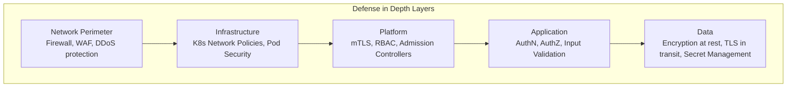
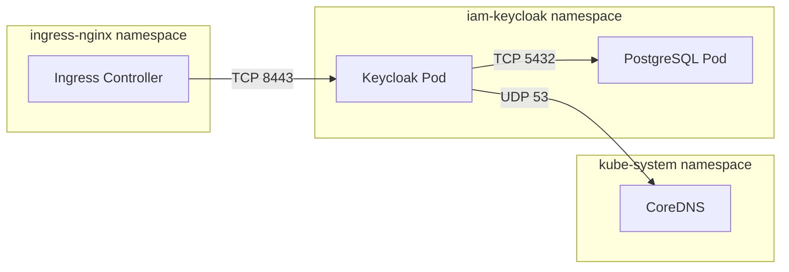
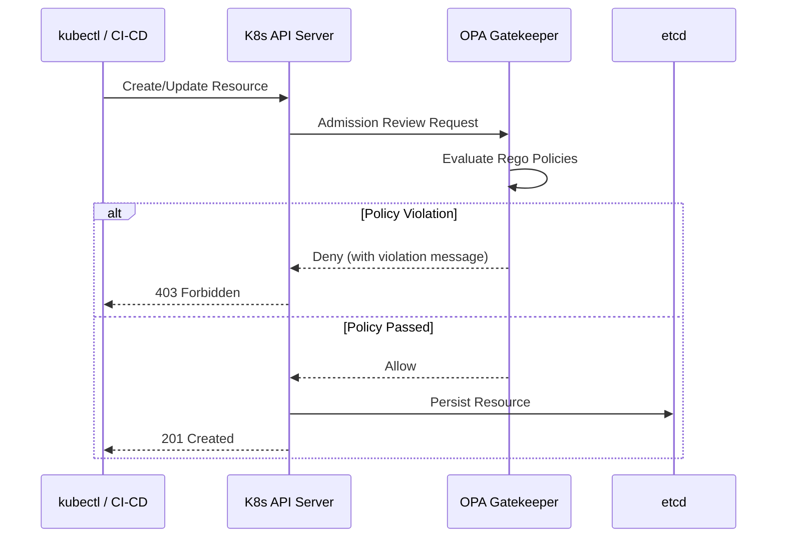
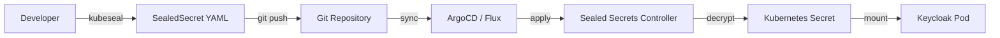
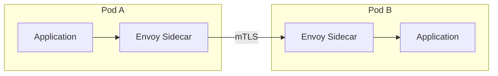
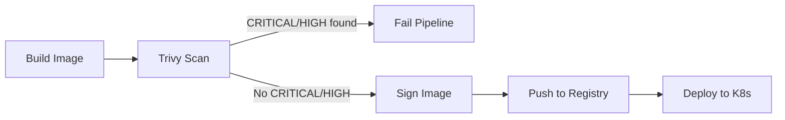
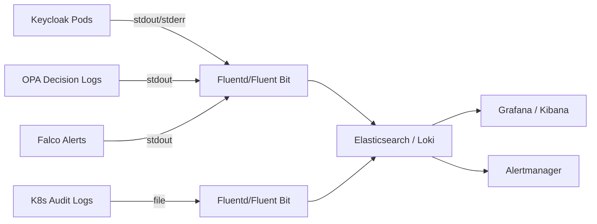
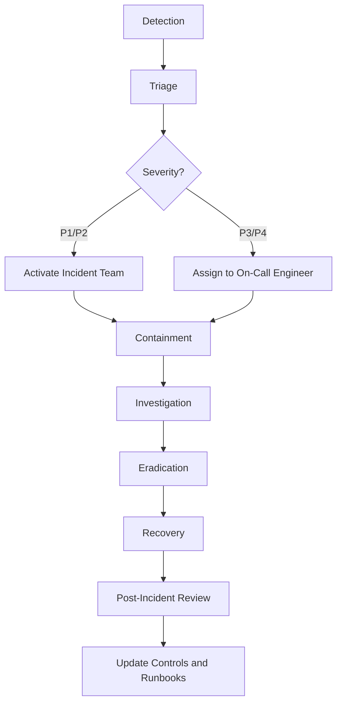

# 07 - Security by Design

This document defines the security architecture, controls, and practices for the enterprise IAM platform built on Keycloak. Every component -- from infrastructure to application layer -- is designed with security as a foundational requirement, not an afterthought.

**Related documents:**

- [Authentication and Authorization](./08-authentication-authorization.md)

---

## Table of Contents

1. [Security Principles](#1-security-principles)
2. [OWASP Top 10 Mitigation Mapping](#2-owasp-top-10-mitigation-mapping)
3. [Kubernetes Security](#3-kubernetes-security)
4. [Secret Management Strategy](#4-secret-management-strategy)
5. [TLS Everywhere](#5-tls-everywhere)
6. [Container Security](#6-container-security)
7. [OPA / Gatekeeper Policies](#7-opa--gatekeeper-policies)
8. [Application Security](#8-application-security)
9. [Audit and Compliance](#9-audit-and-compliance)
10. [Penetration Testing Checklist](#10-penetration-testing-checklist)
11. [Security Incident Response Plan](#11-security-incident-response-plan)

---

## 1. Security Principles

The platform is built on four foundational security principles that inform every architectural and operational decision.

### 1.1 Defense in Depth

Multiple layers of security controls are applied so that the failure of any single control does not compromise the system. Controls exist at the network, infrastructure, platform, application, and data layers.



### 1.2 Least Privilege

Every identity -- whether human, service account, or workload -- is granted only the minimum permissions required to perform its function. This applies to:

- Kubernetes RBAC roles and bindings
- Keycloak realm and client role assignments
- Database connection credentials
- Cloud IAM policies
- Container runtime capabilities

### 1.3 Zero Trust

No implicit trust is granted based on network location. Every request is authenticated, authorized, and encrypted regardless of origin.

- All service-to-service communication uses mTLS or bearer token authentication.
- Network segmentation does not replace authentication.
- Tokens are validated on every request; session state is not assumed.

### 1.4 Secure Defaults

All components ship with the most restrictive configuration and are explicitly opened only as needed.

- Kubernetes pods run as non-root with read-only root filesystems by default.
- Network policies default to deny-all.
- Keycloak realms are configured with secure token lifetimes and password policies out of the box.
- CORS is denied by default and explicitly allowed per client.

---

## 2. OWASP Top 10 Mitigation Mapping

The following table maps each OWASP Top 10 (2021) risk to specific controls implemented in this platform.

| # | OWASP Risk | Mitigation Strategy | Platform Control |
|---|-----------|---------------------|-----------------|
| A01 | Broken Access Control | RBAC + fine-grained OPA policies; token-based AuthZ on every request | Keycloak roles, OPA sidecar, API gateway enforcement |
| A02 | Cryptographic Failures | TLS 1.2+ everywhere; AES-256 encryption at rest; secure key management | cert-manager, Sealed Secrets, KMS integration |
| A03 | Injection | Parameterized queries; input validation; CSP headers | Application-layer validation, WAF rules |
| A04 | Insecure Design | Threat modeling during design; security reviews; this document | Architecture review process, security champions |
| A05 | Security Misconfiguration | Infrastructure as Code with policy enforcement; admission controllers | OPA Gatekeeper, Terraform/Helm linting, CIS benchmarks |
| A06 | Vulnerable and Outdated Components | Automated image scanning; dependency scanning in CI/CD | Trivy, Dependabot/Renovate, base image policy |
| A07 | Identification and Authentication Failures | MFA enforcement; secure password policies; token rotation | Keycloak MFA, password policy configuration, refresh token rotation |
| A08 | Software and Data Integrity Failures | Image signing; SBOM generation; supply chain verification | Cosign/Sigstore, Sealed Secrets for GitOps |
| A09 | Security Logging and Monitoring Failures | Centralized logging; audit events; alerting | Keycloak audit events, K8s audit logs, ELK/Loki stack |
| A10 | Server-Side Request Forgery (SSRF) | Network policies restricting egress; input validation on URLs | K8s NetworkPolicy egress rules, WAF SSRF rules |

---

## 3. Kubernetes Security

### 3.1 Pod Security Standards (Restricted)

All namespaces hosting IAM workloads enforce the **Restricted** Pod Security Standard (PSS), the most stringent level defined by Kubernetes.

```yaml
apiVersion: v1
kind: Namespace
metadata:
  name: iam-keycloak
  labels:
    pod-security.kubernetes.io/enforce: restricted
    pod-security.kubernetes.io/enforce-version: latest
    pod-security.kubernetes.io/audit: restricted
    pod-security.kubernetes.io/warn: restricted
```

The Restricted profile enforces:

- Running as non-root
- Disallowing privilege escalation
- Dropping all capabilities
- Requiring a read-only root filesystem (where feasible)
- Restricting volume types to safe defaults
- Disallowing host namespaces and host paths

### 3.2 SecurityContext Configuration

Every pod specification includes an explicit `securityContext` that enforces non-root execution, drops all Linux capabilities, and mounts the root filesystem as read-only.

```yaml
apiVersion: apps/v1
kind: Deployment
metadata:
  name: keycloak
  namespace: iam-keycloak
spec:
  template:
    spec:
      securityContext:
        runAsNonRoot: true
        runAsUser: 1000
        runAsGroup: 1000
        fsGroup: 1000
        seccompProfile:
          type: RuntimeDefault
      containers:
        - name: keycloak
          image: quay.io/keycloak/keycloak:24.0
          securityContext:
            allowPrivilegeEscalation: false
            readOnlyRootFilesystem: true
            capabilities:
              drop:
                - ALL
          volumeMounts:
            - name: tmp
              mountPath: /tmp
            - name: cache
              mountPath: /opt/keycloak/data
      volumes:
        - name: tmp
          emptyDir:
            sizeLimit: 100Mi
        - name: cache
          emptyDir:
            sizeLimit: 256Mi
```

| Setting | Value | Rationale |
|---------|-------|-----------|
| `runAsNonRoot` | `true` | Prevents container from running as UID 0 |
| `readOnlyRootFilesystem` | `true` | Prevents runtime modification of container filesystem |
| `allowPrivilegeEscalation` | `false` | Prevents `setuid` binaries from elevating privileges |
| `capabilities.drop` | `ALL` | Removes all Linux capabilities; add back only if required |
| `seccompProfile.type` | `RuntimeDefault` | Applies the container runtime default seccomp profile |

### 3.3 Network Policies

Network policies follow a **default-deny** model. All ingress and egress traffic is blocked unless explicitly allowed.

**Default deny all traffic:**

```yaml
apiVersion: networking.k8s.io/v1
kind: NetworkPolicy
metadata:
  name: default-deny-all
  namespace: iam-keycloak
spec:
  podSelector: {}
  policyTypes:
    - Ingress
    - Egress
```

**Allow Keycloak ingress from ingress controller only:**

```yaml
apiVersion: networking.k8s.io/v1
kind: NetworkPolicy
metadata:
  name: allow-keycloak-ingress
  namespace: iam-keycloak
spec:
  podSelector:
    matchLabels:
      app: keycloak
  policyTypes:
    - Ingress
  ingress:
    - from:
        - namespaceSelector:
            matchLabels:
              kubernetes.io/metadata.name: ingress-nginx
          podSelector:
            matchLabels:
              app.kubernetes.io/name: ingress-nginx
      ports:
        - protocol: TCP
          port: 8443
```

**Allow Keycloak egress to PostgreSQL and DNS only:**

```yaml
apiVersion: networking.k8s.io/v1
kind: NetworkPolicy
metadata:
  name: allow-keycloak-egress
  namespace: iam-keycloak
spec:
  podSelector:
    matchLabels:
      app: keycloak
  policyTypes:
    - Egress
  egress:
    - to:
        - podSelector:
            matchLabels:
              app: postgresql
      ports:
        - protocol: TCP
          port: 5432
    - to:
        - namespaceSelector: {}
          podSelector:
            matchLabels:
              k8s-app: kube-dns
      ports:
        - protocol: UDP
          port: 53
```



### 3.4 RBAC for Kubernetes API Access

Kubernetes RBAC follows least-privilege principles. Service accounts are scoped to the minimum permissions required.

```yaml
apiVersion: v1
kind: ServiceAccount
metadata:
  name: keycloak-sa
  namespace: iam-keycloak
  annotations:
    automountServiceAccountToken: "false"
---
apiVersion: rbac.authorization.k8s.io/v1
kind: Role
metadata:
  name: keycloak-role
  namespace: iam-keycloak
rules:
  - apiGroups: [""]
    resources: ["configmaps"]
    verbs: ["get", "list", "watch"]
  - apiGroups: [""]
    resources: ["secrets"]
    resourceNames: ["keycloak-db-credentials", "keycloak-tls"]
    verbs: ["get"]
---
apiVersion: rbac.authorization.k8s.io/v1
kind: RoleBinding
metadata:
  name: keycloak-rolebinding
  namespace: iam-keycloak
subjects:
  - kind: ServiceAccount
    name: keycloak-sa
    namespace: iam-keycloak
roleRef:
  kind: Role
  name: keycloak-role
  apiGroup: rbac.authorization.k8s.io
```

**RBAC guidelines:**

- Never use `cluster-admin` for workload service accounts.
- Avoid wildcards (`*`) in verbs or resources.
- Use `resourceNames` to scope access to specific secrets.
- Disable automatic service account token mounting (`automountServiceAccountToken: false`) and mount explicitly only when needed.

### 3.5 Admission Controllers (OPA Gatekeeper)

OPA Gatekeeper acts as a validating admission webhook, enforcing organizational policies before resources are persisted to etcd.



See [Section 7: OPA / Gatekeeper Policies](#7-opa--gatekeeper-policies) for detailed policy examples.

---

## 4. Secret Management Strategy

### 4.1 Overview

Secrets in this platform include database credentials, API keys, TLS certificates, OIDC client secrets, and encryption keys. A layered approach is used depending on the deployment environment and security requirements.

### 4.2 Kubernetes Secrets

Kubernetes Secrets store sensitive data as base64-encoded values. They are **not encrypted at rest by default** unless the cluster is configured with an `EncryptionConfiguration`.

```yaml
apiVersion: v1
kind: Secret
metadata:
  name: keycloak-db-credentials
  namespace: iam-keycloak
type: Opaque
data:
  username: a2V5Y2xvYWs=        # base64 of "keycloak"
  password: <base64-encoded>
```

**Important:** Enable encryption at rest for etcd:

```yaml
apiVersion: apiserver.config.k8s.io/v1
kind: EncryptionConfiguration
resources:
  - resources:
      - secrets
    providers:
      - aescbc:
          keys:
            - name: key1
              secret: <32-byte-base64-key>
      - identity: {}
```

### 4.3 Sealed Secrets (Bitnami) for GitOps

Sealed Secrets allow encrypted secrets to be stored in Git repositories safely. Only the Sealed Secrets controller running in the cluster can decrypt them.



```bash
# Seal a secret for the iam-keycloak namespace
kubeseal --format yaml \
  --controller-name sealed-secrets \
  --controller-namespace kube-system \
  < secret.yaml > sealed-secret.yaml
```

### 4.4 External Secrets Operator

For production environments using cloud provider secret stores, the External Secrets Operator (ESO) synchronizes secrets from external sources into Kubernetes Secrets.

```yaml
apiVersion: external-secrets.io/v1beta1
kind: ExternalSecret
metadata:
  name: keycloak-db-credentials
  namespace: iam-keycloak
spec:
  refreshInterval: 1h
  secretStoreRef:
    name: aws-secrets-manager
    kind: ClusterSecretStore
  target:
    name: keycloak-db-credentials
    creationPolicy: Owner
  data:
    - secretKey: username
      remoteRef:
        key: iam/keycloak/db
        property: username
    - secretKey: password
      remoteRef:
        key: iam/keycloak/db
        property: password
```

Supported backends include AWS Secrets Manager, Azure Key Vault, GCP Secret Manager, and HashiCorp Vault.

### 4.5 Secret Rotation Procedures

1. **Database credentials:** Rotate every 90 days. Update the external secret store; ESO propagates the new value automatically within the `refreshInterval`.
2. **TLS certificates:** Managed by cert-manager with automatic renewal 30 days before expiry.
3. **OIDC client secrets:** Rotate via Keycloak Admin API; update downstream consumers through ESO or Sealed Secrets.
4. **Encryption keys:** Follow the cloud provider key rotation schedule; re-encrypt secrets after rotation.

### 4.6 Comparison of Approaches

| Aspect | Kubernetes Secrets | Sealed Secrets | External Secrets Operator |
|--------|-------------------|----------------|--------------------------|
| **Encryption at rest** | Only if EncryptionConfiguration is set | Encrypted in Git (asymmetric crypto) | Encrypted in external store |
| **GitOps compatible** | No (plaintext base64 in repo) | Yes (safe to commit) | Yes (ExternalSecret manifest only) |
| **Rotation** | Manual `kubectl` update | Re-seal and commit | Automatic via `refreshInterval` |
| **Cloud integration** | None | None | AWS SM, Azure KV, GCP SM, Vault |
| **Complexity** | Low | Medium | Medium-High |
| **Best for** | Development / local | GitOps without cloud KMS | Production with cloud provider |

---

## 5. TLS Everywhere

### 5.1 cert-manager with Let's Encrypt

cert-manager automates TLS certificate issuance and renewal using Let's Encrypt (or any ACME-compatible CA).

```yaml
apiVersion: cert-manager.io/v1
kind: ClusterIssuer
metadata:
  name: letsencrypt-prod
spec:
  acme:
    server: https://acme-v02.api.letsencrypt.org/directory
    email: platform-team@example.com
    privateKeySecretRef:
      name: letsencrypt-prod-key
    solvers:
      - http01:
          ingress:
            class: nginx
---
apiVersion: cert-manager.io/v1
kind: Certificate
metadata:
  name: keycloak-tls
  namespace: iam-keycloak
spec:
  secretName: keycloak-tls
  issuerRef:
    name: letsencrypt-prod
    kind: ClusterIssuer
  dnsNames:
    - auth.example.com
  renewBefore: 720h  # 30 days
```

### 5.2 Internal mTLS with Service Mesh

For service-to-service communication within the cluster, mutual TLS (mTLS) ensures both parties are authenticated. This can be implemented with Istio or Linkerd.



**Istio PeerAuthentication (strict mTLS):**

```yaml
apiVersion: security.istio.io/v1beta1
kind: PeerAuthentication
metadata:
  name: default
  namespace: iam-keycloak
spec:
  mtls:
    mode: STRICT
```

### 5.3 Certificate Rotation

| Certificate Type | Managed By | Rotation Period | Automation |
|-----------------|------------|-----------------|------------|
| Public TLS (ingress) | cert-manager | 90 days (Let's Encrypt) | Automatic renewal 30 days before expiry |
| Internal mTLS | Service mesh (Istio/Linkerd) | 24 hours (default) | Automatic by mesh control plane |
| Keycloak SAML signing | Keycloak | 1-2 years | Manual rotation with metadata republish |
| Database TLS | cert-manager or manual | 1 year | Semi-automatic |

---

## 6. Container Security

### 6.1 Image Scanning Pipeline (Trivy)

Every container image is scanned for vulnerabilities before deployment. Trivy is integrated into the CI/CD pipeline as a mandatory gate.



```bash
# CI pipeline step
trivy image --severity CRITICAL,HIGH --exit-code 1 \
  --ignore-unfixed \
  registry.example.com/iam/keycloak:24.0
```

**Policy:** Images with unresolved CRITICAL or HIGH vulnerabilities are blocked from deployment.

### 6.2 Base Image Selection

| Criteria | Distroless | Alpine |
|----------|-----------|--------|
| **Attack surface** | Minimal (no shell, no package manager) | Small but includes shell and apk |
| **Image size** | Very small (~20-50 MB) | Small (~5-30 MB base) |
| **Debugging** | Difficult (no shell) | Easy (shell available) |
| **CVE surface** | Very low | Low |
| **Recommendation** | Production workloads | Development and debugging |

**Preferred base for Keycloak:** Use the official Keycloak image, which is based on UBI (Red Hat Universal Base Image). For custom microservices, prefer `gcr.io/distroless/java17-debian12`.

### 6.3 Image Signing (Cosign / Sigstore)

All production images are signed using Cosign. Kubernetes admission policies verify signatures before allowing deployment.

```bash
# Sign an image
cosign sign --key cosign.key registry.example.com/iam/keycloak:24.0

# Verify an image
cosign verify --key cosign.pub registry.example.com/iam/keycloak:24.0
```

**Gatekeeper policy to enforce image signatures** is defined in [Section 7](#7-opa--gatekeeper-policies).

### 6.4 Runtime Security (Falco)

Falco provides runtime threat detection by monitoring system calls and alerting on suspicious behavior.

Example rules relevant to IAM workloads:

```yaml
- rule: Unexpected shell in keycloak container
  desc: Detect shell execution inside Keycloak containers
  condition: >
    spawned_process and container and
    container.image.repository = "quay.io/keycloak/keycloak" and
    proc.name in (bash, sh, dash, csh)
  output: >
    Shell spawned in Keycloak container
    (user=%user.name command=%proc.cmdline container=%container.name)
  priority: WARNING
  tags: [iam, runtime]

- rule: Sensitive file access in keycloak
  desc: Detect reads of sensitive files
  condition: >
    open_read and container and
    container.image.repository = "quay.io/keycloak/keycloak" and
    fd.name startswith /etc/shadow
  output: >
    Sensitive file read in Keycloak container
    (file=%fd.name command=%proc.cmdline)
  priority: CRITICAL
  tags: [iam, runtime]
```

---

## 7. OPA / Gatekeeper Policies

### 7.1 Required Labels

All resources in IAM namespaces must include standard labels for ownership and lifecycle management.

```yaml
apiVersion: templates.gatekeeper.sh/v1
kind: ConstraintTemplate
metadata:
  name: k8srequiredlabels
spec:
  crd:
    spec:
      names:
        kind: K8sRequiredLabels
      validation:
        openAPIV3Schema:
          type: object
          properties:
            labels:
              type: array
              items:
                type: string
  targets:
    - target: admission.k8s.gatekeeper.sh
      rego: |
        package k8srequiredlabels

        violation[{"msg": msg}] {
          provided := {label | input.review.object.metadata.labels[label]}
          required := {label | label := input.parameters.labels[_]}
          missing := required - provided
          count(missing) > 0
          msg := sprintf("Missing required labels: %v", [missing])
        }
---
apiVersion: constraints.gatekeeper.sh/v1beta1
kind: K8sRequiredLabels
metadata:
  name: require-standard-labels
spec:
  match:
    kinds:
      - apiGroups: ["apps"]
        kinds: ["Deployment", "StatefulSet"]
    namespaces: ["iam-keycloak"]
  parameters:
    labels:
      - "app.kubernetes.io/name"
      - "app.kubernetes.io/version"
      - "app.kubernetes.io/managed-by"
      - "iam.example.com/owner"
```

### 7.2 Allowed Registries

Only images from approved registries are permitted.

```yaml
apiVersion: templates.gatekeeper.sh/v1
kind: ConstraintTemplate
metadata:
  name: k8sallowedregistries
spec:
  crd:
    spec:
      names:
        kind: K8sAllowedRegistries
      validation:
        openAPIV3Schema:
          type: object
          properties:
            registries:
              type: array
              items:
                type: string
  targets:
    - target: admission.k8s.gatekeeper.sh
      rego: |
        package k8sallowedregistries

        violation[{"msg": msg}] {
          container := input.review.object.spec.containers[_]
          not registry_allowed(container.image)
          msg := sprintf(
            "Container image '%v' is from a disallowed registry. Allowed: %v",
            [container.image, input.parameters.registries]
          )
        }

        violation[{"msg": msg}] {
          container := input.review.object.spec.initContainers[_]
          not registry_allowed(container.image)
          msg := sprintf(
            "Init container image '%v' is from a disallowed registry. Allowed: %v",
            [container.image, input.parameters.registries]
          )
        }

        registry_allowed(image) {
          registry := input.parameters.registries[_]
          startswith(image, registry)
        }
---
apiVersion: constraints.gatekeeper.sh/v1beta1
kind: K8sAllowedRegistries
metadata:
  name: allowed-registries
spec:
  match:
    kinds:
      - apiGroups: [""]
        kinds: ["Pod"]
    namespaces: ["iam-keycloak"]
  parameters:
    registries:
      - "registry.example.com/"
      - "quay.io/keycloak/"
      - "docker.io/bitnami/"
```

### 7.3 Resource Limits Enforcement

All containers must define CPU and memory resource requests and limits.

```yaml
apiVersion: templates.gatekeeper.sh/v1
kind: ConstraintTemplate
metadata:
  name: k8sresourcelimits
spec:
  crd:
    spec:
      names:
        kind: K8sResourceLimits
  targets:
    - target: admission.k8s.gatekeeper.sh
      rego: |
        package k8sresourcelimits

        violation[{"msg": msg}] {
          container := input.review.object.spec.containers[_]
          not container.resources.limits.memory
          msg := sprintf(
            "Container '%v' must set memory limits",
            [container.name]
          )
        }

        violation[{"msg": msg}] {
          container := input.review.object.spec.containers[_]
          not container.resources.limits.cpu
          msg := sprintf(
            "Container '%v' must set CPU limits",
            [container.name]
          )
        }

        violation[{"msg": msg}] {
          container := input.review.object.spec.containers[_]
          not container.resources.requests.memory
          msg := sprintf(
            "Container '%v' must set memory requests",
            [container.name]
          )
        }

        violation[{"msg": msg}] {
          container := input.review.object.spec.containers[_]
          not container.resources.requests.cpu
          msg := sprintf(
            "Container '%v' must set CPU requests",
            [container.name]
          )
        }
```

### 7.4 Example Rego Policy: Admission Control Composite

The following Rego policy demonstrates a composite admission check enforcing multiple security constraints for Kubernetes pods in the IAM namespace.

```rego
package iam.admission

import future.keywords.in

# Deny pods that run as root
deny[msg] {
    input.review.object.kind == "Pod"
    container := input.review.object.spec.containers[_]
    not container.securityContext.runAsNonRoot
    msg := sprintf(
        "Container '%s' must set securityContext.runAsNonRoot to true",
        [container.name]
    )
}

# Deny pods that allow privilege escalation
deny[msg] {
    input.review.object.kind == "Pod"
    container := input.review.object.spec.containers[_]
    container.securityContext.allowPrivilegeEscalation == true
    msg := sprintf(
        "Container '%s' must not allow privilege escalation",
        [container.name]
    )
}

# Deny pods without read-only root filesystem
deny[msg] {
    input.review.object.kind == "Pod"
    container := input.review.object.spec.containers[_]
    not container.securityContext.readOnlyRootFilesystem
    msg := sprintf(
        "Container '%s' must set readOnlyRootFilesystem to true",
        [container.name]
    )
}

# Deny pods that do not drop all capabilities
deny[msg] {
    input.review.object.kind == "Pod"
    container := input.review.object.spec.containers[_]
    not "ALL" in container.securityContext.capabilities.drop
    msg := sprintf(
        "Container '%s' must drop ALL capabilities",
        [container.name]
    )
}

# Deny pods with hostNetwork or hostPID
deny[msg] {
    input.review.object.kind == "Pod"
    input.review.object.spec.hostNetwork == true
    msg := "Pods must not use hostNetwork"
}

deny[msg] {
    input.review.object.kind == "Pod"
    input.review.object.spec.hostPID == true
    msg := "Pods must not use hostPID"
}
```

---

## 8. Application Security

### 8.1 Token Validation Best Practices

All services consuming tokens issued by Keycloak must follow these validation rules:

1. **Verify the signature** using the JWKS endpoint (`/realms/{realm}/protocol/openid-connect/certs`).
2. **Validate the issuer (`iss`)** matches the expected Keycloak realm URL.
3. **Validate the audience (`aud`)** contains the expected client ID.
4. **Check token expiry (`exp`)** and reject expired tokens.
5. **Validate `nbf` (not before)** if present.
6. **Check `azp` (authorized party)** for tokens issued to specific clients.
7. **Cache JWKS keys** with a TTL (e.g., 24 hours) and refresh on signature verification failure.
8. **Never accept tokens from query parameters** -- use the `Authorization` header exclusively.

See [Authentication and Authorization](./08-authentication-authorization.md) for protocol-specific details.

### 8.2 CORS Configuration

CORS is configured at the API gateway and Keycloak realm level. The default policy is to deny all cross-origin requests.

```yaml
# Ingress NGINX CORS annotation example
metadata:
  annotations:
    nginx.ingress.kubernetes.io/enable-cors: "true"
    nginx.ingress.kubernetes.io/cors-allow-origin: "https://app.example.com"
    nginx.ingress.kubernetes.io/cors-allow-methods: "GET, POST, PUT, DELETE, OPTIONS"
    nginx.ingress.kubernetes.io/cors-allow-headers: "Authorization, Content-Type"
    nginx.ingress.kubernetes.io/cors-allow-credentials: "true"
    nginx.ingress.kubernetes.io/cors-max-age: "3600"
```

**Rules:**

- Never use `*` as `cors-allow-origin` in production.
- List allowed origins explicitly.
- Credentials (`Access-Control-Allow-Credentials`) must only be enabled when required.

### 8.3 Content Security Policy (CSP) Headers

CSP headers mitigate XSS and data injection attacks. Applied at the ingress or reverse proxy level.

```
Content-Security-Policy:
  default-src 'self';
  script-src 'self';
  style-src 'self' 'unsafe-inline';
  img-src 'self' data:;
  font-src 'self';
  connect-src 'self' https://auth.example.com;
  frame-ancestors 'none';
  form-action 'self';
  base-uri 'self';
  object-src 'none';
```

Additional security headers to enforce:

| Header | Value | Purpose |
|--------|-------|---------|
| `X-Content-Type-Options` | `nosniff` | Prevent MIME type sniffing |
| `X-Frame-Options` | `DENY` | Prevent clickjacking |
| `Strict-Transport-Security` | `max-age=31536000; includeSubDomains` | Enforce HTTPS |
| `Referrer-Policy` | `strict-origin-when-cross-origin` | Control referrer information |
| `Permissions-Policy` | `camera=(), microphone=(), geolocation=()` | Restrict browser features |

### 8.4 Rate Limiting

Rate limiting protects Keycloak and downstream services from brute-force attacks and abuse.

**Ingress NGINX rate limiting:**

```yaml
metadata:
  annotations:
    nginx.ingress.kubernetes.io/limit-rps: "10"
    nginx.ingress.kubernetes.io/limit-burst-multiplier: "5"
    nginx.ingress.kubernetes.io/limit-connections: "5"
```

**Keycloak brute-force protection (realm configuration):**

| Setting | Value | Description |
|---------|-------|-------------|
| Max login failures | 5 | Lock account after 5 failed attempts |
| Wait increment | 60 seconds | Initial lockout duration |
| Max wait | 900 seconds | Maximum lockout duration (15 minutes) |
| Failure reset time | 600 seconds | Reset failure counter after 10 minutes |
| Quick login check (ms) | 1000 | Minimum time between login attempts |

### 8.5 Input Validation

- Validate all input on the server side; never trust client-side validation alone.
- Use allowlists over denylists for input validation.
- Sanitize and encode output to prevent injection attacks.
- Enforce maximum lengths for all string inputs.
- Validate `redirect_uri` parameters against a pre-registered allowlist in Keycloak client configuration.
- Reject unexpected content types at the API gateway.

---

## 9. Audit and Compliance

### 9.1 Keycloak Audit Events

Keycloak generates audit events for both user actions and admin operations. These must be persisted to an external system for retention and analysis.

**User events to capture:**

| Event Type | Description |
|-----------|-------------|
| `LOGIN` | Successful user login |
| `LOGIN_ERROR` | Failed login attempt |
| `LOGOUT` | User logout |
| `REGISTER` | New user registration |
| `UPDATE_PASSWORD` | Password change |
| `UPDATE_TOTP` | MFA TOTP configuration change |
| `GRANT_CONSENT` | OAuth consent granted |
| `REVOKE_GRANT` | OAuth consent revoked |
| `TOKEN_EXCHANGE` | Token exchange event |

**Admin events to capture:**

| Event Type | Description |
|-----------|-------------|
| `CREATE` | Resource creation (users, clients, roles) |
| `UPDATE` | Resource modification |
| `DELETE` | Resource deletion |
| `ACTION` | Administrative actions (reset password, revoke sessions) |

**Configuration:** Enable event listeners in realm settings and configure a custom SPI or the built-in `jboss-logging` listener to forward events to the log aggregation system.

### 9.2 Kubernetes Audit Logging

Enable Kubernetes API server audit logging to capture all interactions with the K8s API.

```yaml
apiVersion: audit.k8s.io/v1
kind: Policy
rules:
  # Log all requests to secrets at the Metadata level
  - level: Metadata
    resources:
      - group: ""
        resources: ["secrets"]
  # Log pod creation/deletion at RequestResponse level
  - level: RequestResponse
    resources:
      - group: ""
        resources: ["pods"]
    verbs: ["create", "delete"]
  # Log RBAC changes at RequestResponse level
  - level: RequestResponse
    resources:
      - group: "rbac.authorization.k8s.io"
        resources: ["roles", "rolebindings", "clusterroles", "clusterrolebindings"]
  # Default: log at Metadata level
  - level: Metadata
```

### 9.3 Log Aggregation Strategy



**Retention policy:**

| Log Type | Retention Period | Storage Tier |
|---------|-----------------|--------------|
| Keycloak audit events | 2 years | Warm (30 days) then Cold |
| Kubernetes audit logs | 1 year | Warm (14 days) then Cold |
| Application logs | 90 days | Hot (7 days) then Warm |
| Security alerts (Falco) | 2 years | Warm |

### 9.4 Compliance Mapping

The following table maps platform controls to SOC 2 Trust Services Criteria and ISO 27001 Annex A controls.

| Control Area | Platform Implementation | SOC 2 Criteria | ISO 27001 Control |
|-------------|------------------------|-----------------|-------------------|
| Access Control | Keycloak RBAC, MFA, OPA policies | CC6.1, CC6.2, CC6.3 | A.9.1, A.9.2, A.9.4 |
| Encryption | TLS everywhere, encryption at rest | CC6.1, CC6.7 | A.10.1, A.14.1 |
| Logging and Monitoring | Centralized audit logging, alerting | CC7.1, CC7.2, CC7.3 | A.12.4, A.16.1 |
| Change Management | GitOps, admission controllers | CC8.1 | A.12.1, A.14.2 |
| Incident Response | Incident response plan, Falco alerts | CC7.3, CC7.4, CC7.5 | A.16.1 |
| Vulnerability Management | Trivy scanning, Dependabot | CC7.1 | A.12.6 |
| Secret Management | ESO, Sealed Secrets, rotation | CC6.1, CC6.7 | A.10.1, A.9.4 |
| Network Security | Network policies, mTLS | CC6.1, CC6.6 | A.13.1 |
| Physical Security | Cloud provider responsibility | CC6.4, CC6.5 | A.11.1, A.11.2 |

---

## 10. Penetration Testing Checklist

The following checklist should be executed quarterly or after major changes to the IAM platform.

### 10.1 Authentication Testing

- [ ] Attempt brute-force login and verify lockout triggers.
- [ ] Test credential stuffing with common password lists.
- [ ] Verify MFA bypass is not possible by replaying OTP codes.
- [ ] Test session fixation by reusing session IDs before and after login.
- [ ] Attempt authentication with expired, revoked, and tampered tokens.
- [ ] Test password reset flow for account enumeration.
- [ ] Verify logout invalidates all tokens and sessions.

### 10.2 Authorization Testing

- [ ] Attempt horizontal privilege escalation (access another user's resources).
- [ ] Attempt vertical privilege escalation (access admin endpoints as a regular user).
- [ ] Test IDOR (Insecure Direct Object Reference) on all API endpoints.
- [ ] Verify OPA policies enforce tenant isolation.
- [ ] Test role-based access with minimal, elevated, and admin roles.
- [ ] Attempt to modify JWT claims and bypass signature verification.

### 10.3 Token and Session Testing

- [ ] Verify access tokens have appropriate short TTLs.
- [ ] Test refresh token rotation (old refresh tokens must be invalidated).
- [ ] Verify `redirect_uri` validation rejects open redirects.
- [ ] Test token leakage via referrer headers or browser history.
- [ ] Verify backchannel logout propagates to all relying parties.

### 10.4 Infrastructure Testing

- [ ] Scan for exposed Kubernetes API server endpoints.
- [ ] Verify network policies block unauthorized pod-to-pod traffic.
- [ ] Test for container escape vulnerabilities.
- [ ] Scan for exposed management interfaces (Keycloak admin console, database ports).
- [ ] Verify secrets are not exposed in environment variables visible via `/proc`.
- [ ] Test for SSRF from application endpoints.

### 10.5 Application Testing

- [ ] Test for XSS in Keycloak themes and custom pages.
- [ ] Test for CSRF on state-changing operations.
- [ ] Verify CSP headers are present and effective.
- [ ] Test for SQL injection in custom SPIs or backend services.
- [ ] Verify rate limiting is enforced on login and token endpoints.
- [ ] Test CORS misconfigurations.

---

## 11. Security Incident Response Plan

### 11.1 Overview

This plan outlines the process for detecting, responding to, and recovering from security incidents affecting the IAM platform.

### 11.2 Severity Classification

| Severity | Description | Example | Response Time |
|----------|-------------|---------|---------------|
| **P1 - Critical** | Active breach; data exfiltration; complete service compromise | Keycloak admin credentials leaked; database breach | Immediate (15 min) |
| **P2 - High** | Attempted breach; vulnerability actively exploited | Brute-force attack succeeding; critical CVE in production image | 1 hour |
| **P3 - Medium** | Suspicious activity; policy violation | Unusual login patterns; failed admission controller bypass | 4 hours |
| **P4 - Low** | Informational; minor policy deviation | Missing labels on non-production resource | Next business day |

### 11.3 Response Process



### 11.4 Response Phases

**Phase 1 -- Detection:**
- Automated alerts from Falco, Alertmanager, or SIEM.
- Manual reports from users or security team.
- Threat intelligence feeds.

**Phase 2 -- Triage:**
- Classify severity using the table above.
- Assign incident commander.
- Open incident channel (e.g., dedicated Slack/Teams channel).

**Phase 3 -- Containment:**
- Isolate affected pods using network policies.
- Revoke compromised credentials and tokens.
- Scale down affected deployments if necessary.
- Preserve evidence (pod logs, audit trails, memory dumps).

**Phase 4 -- Investigation:**
- Analyze audit logs (Keycloak events, K8s audit, Falco alerts).
- Determine root cause and blast radius.
- Identify affected users and data.

**Phase 5 -- Eradication:**
- Patch vulnerabilities.
- Rotate all potentially compromised secrets.
- Rebuild affected containers from clean images.
- Update OPA policies to prevent recurrence.

**Phase 6 -- Recovery:**
- Restore services in a controlled manner.
- Monitor closely for signs of persistence.
- Validate security controls are functioning.

**Phase 7 -- Post-Incident Review:**
- Conduct blameless post-mortem within 72 hours.
- Document timeline, root cause, and remediation.
- Update runbooks, policies, and this document as needed.
- Track follow-up action items to completion.

### 11.5 Communication

| Audience | When | Channel | Owner |
|----------|------|---------|-------|
| Incident team | Immediately on P1/P2 | Incident channel + pager | Incident commander |
| Engineering leadership | Within 1 hour for P1 | Direct message | Incident commander |
| Affected customers | Within 24 hours if data breach | Email / status page | Communications lead |
| Regulators | As required by jurisdiction | Formal notification | Legal / Compliance |

---

*This document is a living artifact and must be reviewed at least quarterly. All changes must be approved through the standard change management process.*
