# 08 - Authentication and Authorization

This document provides a comprehensive guide to the authentication and authorization architecture of the enterprise IAM platform built on Keycloak. It covers protocol selection, authentication flows, multi-factor authentication (MFA), role-based access control (RBAC), fine-grained authorization with OPA, and token lifecycle management.

**Related documents:**

- [Security by Design](./07-security-by-design.md)

---

## Table of Contents

1. [Protocol Overview](#1-protocol-overview)
2. [OIDC Flows](#2-oidc-flows)
3. [SAML 2.0](#3-saml-20)
4. [Custom JWT Configuration](#4-custom-jwt-configuration)
5. [Multi-Factor Authentication (MFA)](#5-multi-factor-authentication-mfa)
6. [RBAC Design](#6-rbac-design)
7. [Fine-Grained Authorization with OPA](#7-fine-grained-authorization-with-opa)
8. [Token Lifecycle](#8-token-lifecycle)

---

## 1. Protocol Overview

The following table compares the three primary authentication and authorization protocols supported by the platform.

| Aspect | OpenID Connect (OIDC) | SAML 2.0 | OAuth 2.0 |
|--------|----------------------|----------|-----------|
| **Primary purpose** | Authentication + Authorization | Authentication (SSO) | Authorization (delegated access) |
| **Token format** | JWT (JSON Web Token) | XML Assertion | Opaque or JWT access token |
| **Transport** | HTTP REST / JSON | HTTP POST / Redirect with XML | HTTP REST / JSON |
| **Token size** | Small-medium (1-3 KB typical) | Large (5-20 KB typical) | Varies |
| **Mobile/SPA friendly** | Yes | No (XML parsing overhead) | Yes |
| **Federation** | Yes (via issuer discovery) | Yes (via metadata exchange) | No (not designed for federation) |
| **Logout** | Front-channel, back-channel, RP-initiated | SLO (Single Logout) | Token revocation |
| **Best for** | Modern web apps, SPAs, mobile, APIs | Enterprise SSO, legacy systems | API authorization, M2M |
| **Keycloak support** | Native | Native | Native (via OIDC) |

**Recommendation:** Use OIDC as the default protocol for all new integrations. Use SAML 2.0 only for legacy or enterprise systems that require it. OAuth 2.0 is used implicitly as the authorization layer within OIDC.

---

## 2. OIDC Flows

### 2.1 Authorization Code + PKCE (Recommended for SPAs and Web Applications)

This is the recommended flow for browser-based applications. PKCE (Proof Key for Code Exchange) eliminates the need for a client secret in public clients, mitigating authorization code interception attacks.

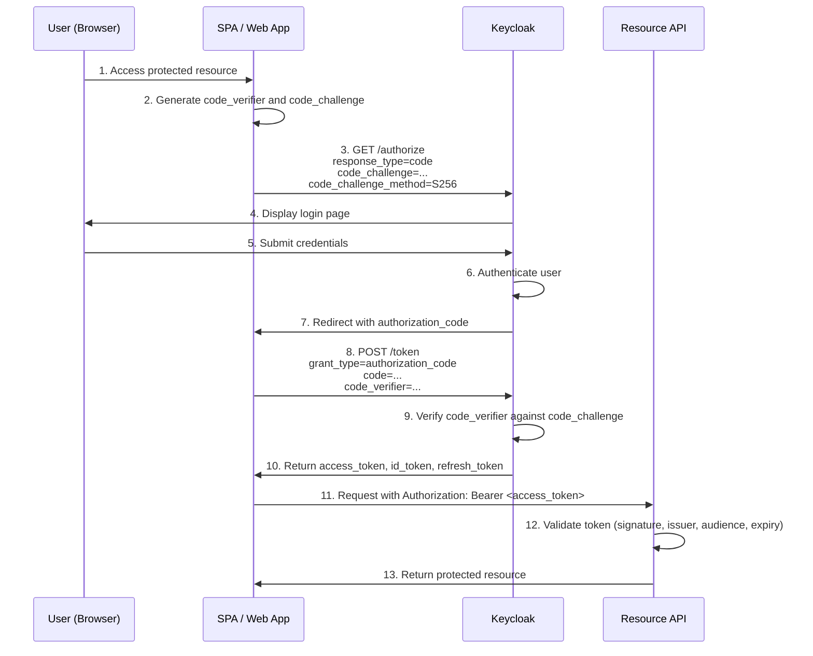

**Keycloak client configuration for PKCE:**

| Setting | Value |
|---------|-------|
| Client Protocol | openid-connect |
| Access Type | public |
| Standard Flow Enabled | ON |
| Valid Redirect URIs | `https://app.example.com/callback` |
| Web Origins | `https://app.example.com` |
| PKCE Code Challenge Method | S256 |
| Proof Key for Code Exchange Code Challenge Method | S256 (enforced) |

### 2.2 Client Credentials (Machine-to-Machine)

Used for service-to-service communication where no user context is required. The client authenticates directly with its own credentials.

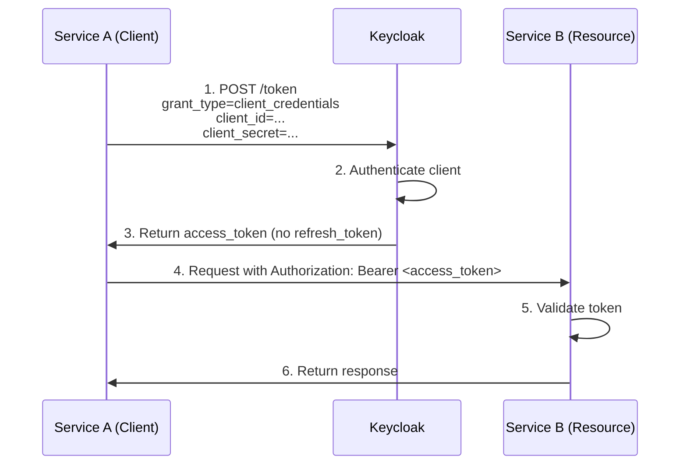

**Keycloak client configuration for Client Credentials:**

| Setting | Value |
|---------|-------|
| Client Protocol | openid-connect |
| Access Type | confidential |
| Service Accounts Enabled | ON |
| Standard Flow Enabled | OFF |
| Direct Access Grants Enabled | OFF |
| Client Authenticator | Client Id and Secret |

**Security note:** Store the client secret securely using the secret management strategy described in [Security by Design - Secret Management](./07-security-by-design.md#4-secret-management-strategy).

### 2.3 Device Authorization (IoT / Input-Constrained Devices)

Used for devices with limited input capabilities (smart TVs, CLI tools, IoT devices). The user authorizes the device on a separate device with a full browser.

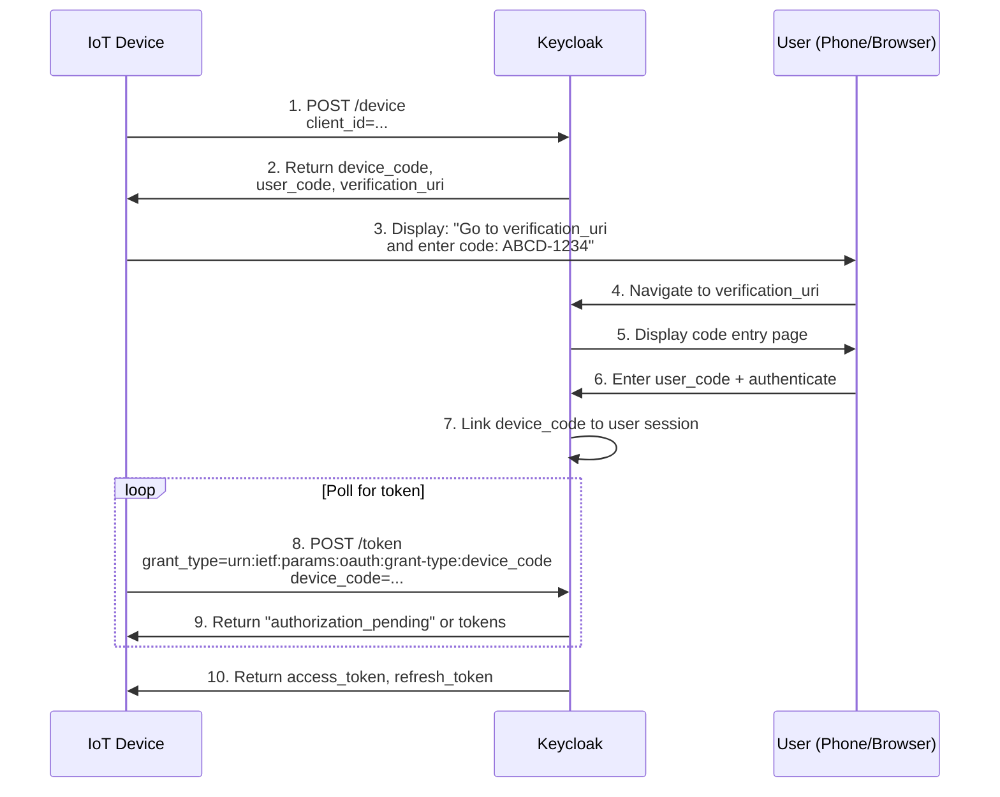

**Keycloak client configuration for Device Authorization:**

| Setting | Value |
|---------|-------|
| Client Protocol | openid-connect |
| Access Type | public |
| OAuth 2.0 Device Authorization Grant Enabled | ON |
| Device Code Lifespan | 600 seconds |
| Polling Interval | 5 seconds |

---

## 3. SAML 2.0

### 3.1 SP-Initiated SSO Flow

In SP-initiated SSO, the user first accesses the Service Provider (SP), which redirects to the Identity Provider (IdP) for authentication.

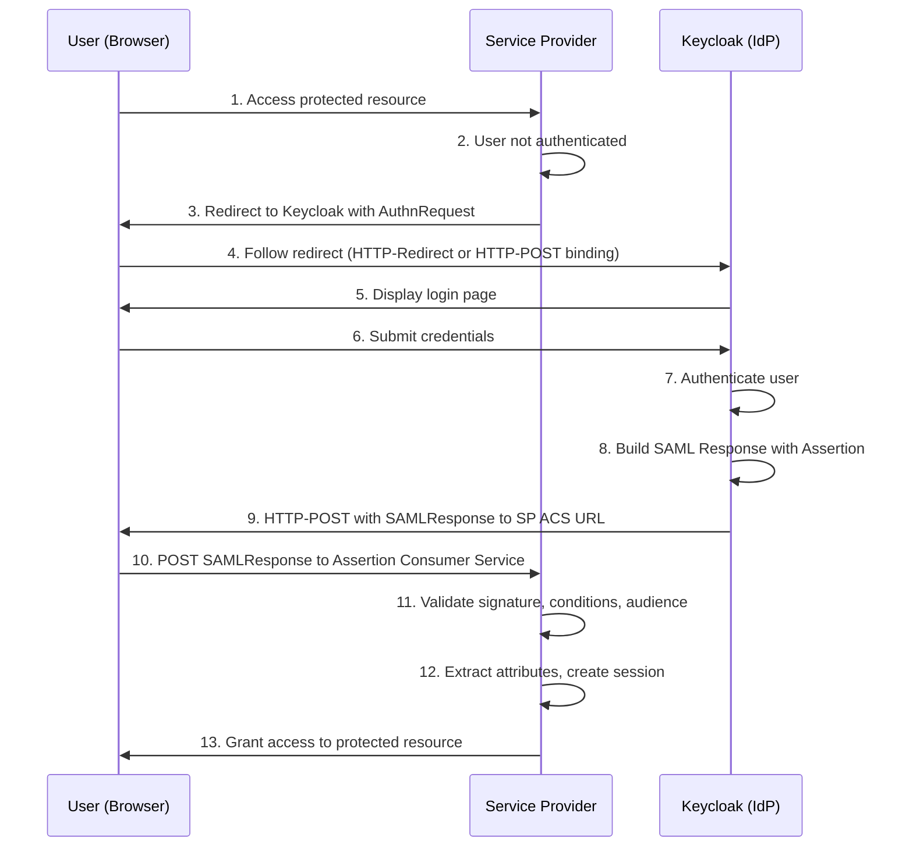

### 3.2 IdP-Initiated SSO Flow

In IdP-initiated SSO, the user starts at Keycloak and selects the target application. This flow is less secure (no `InResponseTo` validation) but is required by some enterprise applications.

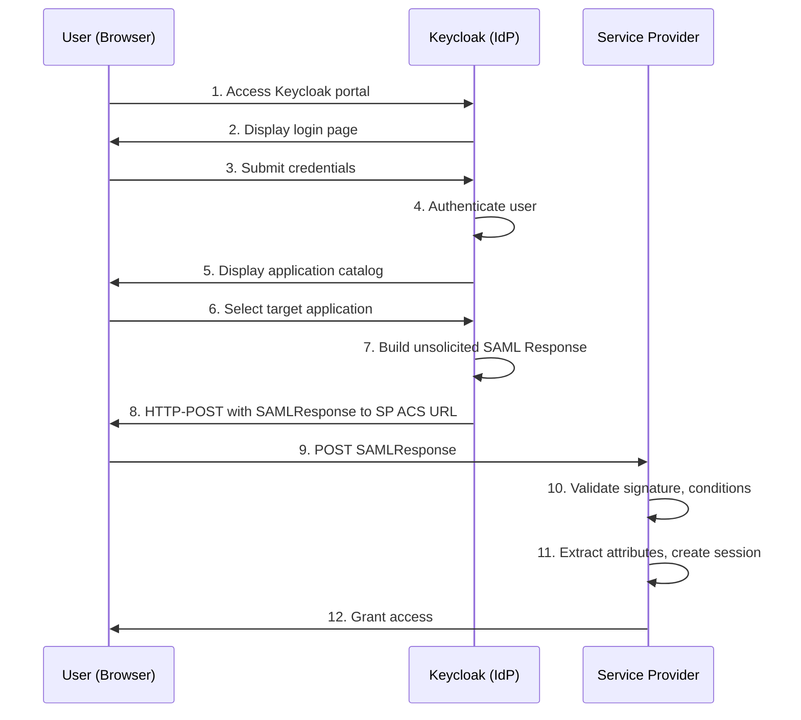

**Security note:** IdP-initiated SSO is inherently more vulnerable to replay attacks. Enable `NotOnOrAfter` conditions and keep assertion validity windows short (5 minutes or less).

### 3.3 Assertion Mapping

Keycloak maps user attributes to SAML assertion attributes via protocol mappers. The following table shows common mappings.

| User Attribute | SAML Attribute Name | SAML Attribute NameFormat | Example Value |
|---------------|-------------------|--------------------------|---------------|
| `username` | `urn:oid:0.9.2342.19200300.100.1.1` | URI | `jdoe` |
| `email` | `urn:oid:0.9.2342.19200300.100.1.3` | URI | `jdoe@example.com` |
| `firstName` | `urn:oid:2.5.4.42` | URI | `John` |
| `lastName` | `urn:oid:2.5.4.4` | URI | `Doe` |
| Realm roles | `Role` | Basic | `admin,user` |
| Group membership | `memberOf` | Basic | `/department/engineering` |

### 3.4 SAML Metadata Exchange

SAML trust is established by exchanging metadata documents between IdP and SP.

**Keycloak IdP metadata URL:**

```
https://auth.example.com/realms/{realm}/protocol/saml/descriptor
```

**SP metadata import in Keycloak:**

1. Navigate to **Clients** in the Keycloak admin console.
2. Click **Import Client**.
3. Upload the SP metadata XML file or provide the metadata URL.
4. Keycloak automatically configures the client from the metadata (ACS URL, signing certificates, NameID format).

**Key metadata elements:**

| Element | IdP Metadata | SP Metadata |
|---------|-------------|-------------|
| Entity ID | `https://auth.example.com/realms/{realm}` | `https://sp.example.com/saml/metadata` |
| SSO Endpoint | `SingleSignOnService` (POST, Redirect) | Not applicable |
| ACS Endpoint | Not applicable | `AssertionConsumerService` (POST) |
| SLO Endpoint | `SingleLogoutService` | `SingleLogoutService` |
| Signing Certificate | X.509 certificate for response signing | X.509 certificate for request signing |
| NameID Format | `urn:oasis:names:tc:SAML:1.1:nameid-format:emailAddress` | Requested NameID format |

---

## 4. Custom JWT Configuration

### 4.1 Protocol Mapper Configuration

Keycloak allows extensive customization of JWT tokens through protocol mappers. Mappers add, transform, or remove claims in access tokens, ID tokens, and userinfo responses.

**Common protocol mapper types:**

| Mapper Type | Purpose | Example |
|------------|---------|---------|
| User Attribute | Map a user attribute to a token claim | `department` attribute to `department` claim |
| User Realm Role | Include realm roles in the token | Roles under `realm_access.roles` |
| User Client Role | Include client-specific roles | Roles under `resource_access.{client}.roles` |
| Group Membership | Include user group paths | Groups under `groups` claim |
| Audience | Add audience (`aud`) values | Add API resource server as audience |
| Hardcoded Claim | Add a static value | `token_type: "access"` |
| Script Mapper | Custom JavaScript logic | Computed claims based on multiple attributes |

### 4.2 Custom Claims Structure

The following example shows a JWT access token with custom claims configured for a multi-tenant IAM platform.

```json
{
  "exp": 1709827200,
  "iat": 1709826600,
  "jti": "f47ac10b-58cc-4372-a567-0e02b2c3d479",
  "iss": "https://auth.example.com/realms/enterprise",
  "aud": ["account", "api-gateway", "billing-service"],
  "sub": "a1b2c3d4-e5f6-7890-abcd-ef1234567890",
  "typ": "Bearer",
  "azp": "web-portal",
  "scope": "openid profile email",
  "sid": "b2c3d4e5-f6a7-8901-bcde-f12345678901",
  "email_verified": true,
  "name": "John Doe",
  "preferred_username": "jdoe",
  "email": "jdoe@example.com",
  "realm_access": {
    "roles": ["user", "billing-viewer"]
  },
  "resource_access": {
    "api-gateway": {
      "roles": ["api-consumer"]
    },
    "billing-service": {
      "roles": ["invoice-reader"]
    }
  },
  "tenant_id": "tenant-acme-corp",
  "department": "engineering",
  "cost_center": "CC-1234",
  "data_classification": "internal",
  "groups": ["/acme-corp/engineering/platform"]
}
```

### 4.3 Token Size Considerations

JWT tokens are included in every HTTP request as a Bearer token. Large tokens increase bandwidth usage and can exceed HTTP header size limits.

| Factor | Impact | Mitigation |
|--------|--------|------------|
| Number of roles | Each role adds ~20-50 bytes | Use composite roles; limit roles per client |
| Group paths | Deep hierarchies increase size | Map only leaf groups; use group IDs instead of paths |
| Custom claims | Each claim adds variable bytes | Include only claims needed by resource servers |
| Audience values | Each audience adds ~20-50 bytes | Limit `aud` to services that validate the token |
| Nested structures | JSON nesting increases overhead | Flatten claims where possible |

**Guidelines:**

- Keep access tokens under 4 KB to avoid issues with HTTP header limits (most servers default to 8 KB total header size).
- Use the userinfo endpoint for infrequently needed claims instead of embedding them in the token.
- Use client-scoped protocol mappers to include claims only when specific scopes are requested.

### 4.4 Audience Restrictions

Configure the `aud` claim to restrict which resource servers accept a given token.

**Audience mapper configuration:**

1. Add a **Protocol Mapper** of type **Audience** to the client.
2. Set **Included Client Audience** to the target resource server client ID.
3. Enable **Add to access token**.

Resource servers must validate that their own client ID appears in the `aud` claim. Tokens without the expected audience must be rejected.

```yaml
# Example validation pseudocode
expected_audience: "billing-service"
if expected_audience not in token.aud:
    reject_with_403("Token audience does not include this service")
```

---

## 5. Multi-Factor Authentication (MFA)

### 5.1 Email OTP Flow

Email OTP sends a one-time password to the user's verified email address as a second authentication factor.

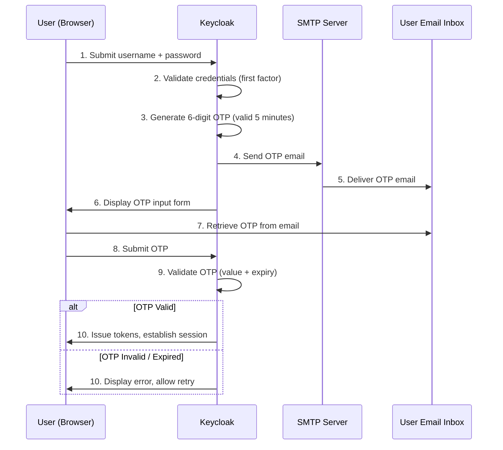

**Keycloak configuration:**

- Enable the **Email OTP** authenticator in the authentication flow.
- Configure SMTP settings in **Realm Settings > Email**.
- Set OTP length (6 digits recommended) and validity period (300 seconds).

### 5.2 TOTP (Time-Based One-Time Password)

TOTP works with authenticator applications such as Microsoft Authenticator, Google Authenticator, or any TOTP-compatible app.

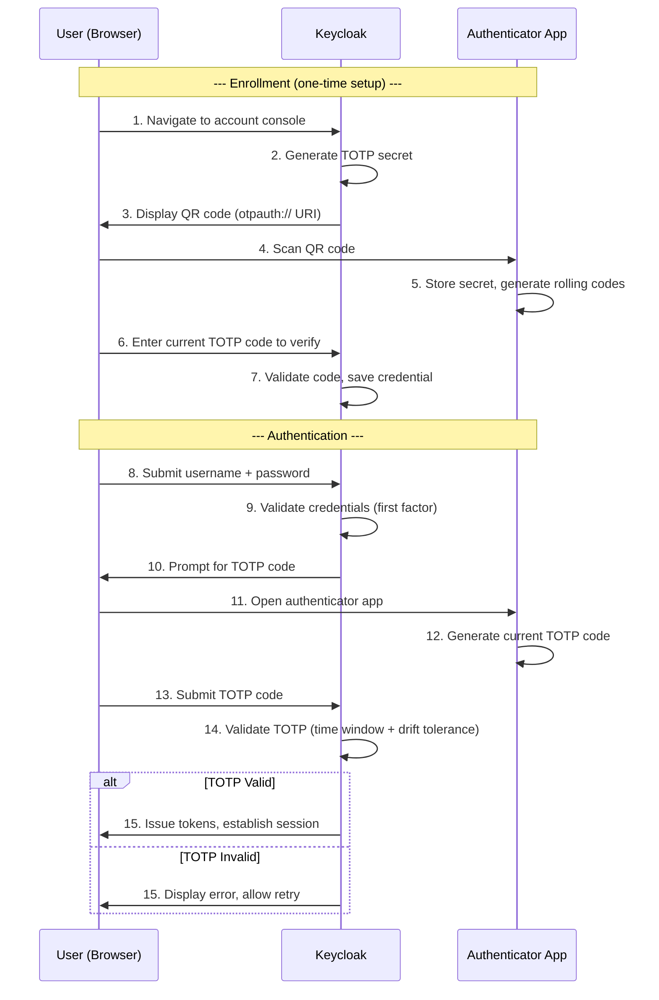

**Keycloak TOTP configuration:**

| Setting | Value | Description |
|---------|-------|-------------|
| OTP Type | totp | Time-based OTP |
| Algorithm | HmacSHA1 | Compatible with most authenticator apps |
| Number of Digits | 6 | Standard OTP length |
| Look Ahead Window | 1 | Allow 1 period of clock drift |
| Period | 30 seconds | Code rotation interval |

### 5.3 SMS OTP via Twilio

Keycloak does not include a built-in SMS OTP provider. A custom SPI (Service Provider Interface) is required to integrate with Twilio for SMS delivery.

#### 5.3.1 Twilio Account Setup

1. Create a Twilio account at [twilio.com](https://www.twilio.com).
2. Obtain the **Account SID**, **Auth Token**, and a **Twilio phone number** with SMS capability.
3. Store these credentials securely using the [Secret Management Strategy](./07-security-by-design.md#4-secret-management-strategy).
4. Configure a Messaging Service for production use (better deliverability, sender ID management).

#### 5.3.2 Custom Keycloak SPI for Twilio Integration

The SPI implements Keycloak's `Authenticator` interface to inject SMS OTP into the authentication flow.

**SPI code structure (Java 17 -- required by Keycloak's SPI mechanism):**

```
keycloak-sms-otp-twilio/
  pom.xml
  src/
    main/
      java/
        com/example/iam/spi/sms/
          TwilioSmsAuthenticator.java           # Core authenticator logic
          TwilioSmsAuthenticatorFactory.java     # Factory for creating instances
          TwilioSmsService.java                  # Twilio API integration
          SmsOtpCredentialProvider.java          # OTP generation and validation
          SmsOtpCredentialProviderFactory.java   # Factory for credential provider
      resources/
        META-INF/
          services/
            org.keycloak.authentication.AuthenticatorFactory
            org.keycloak.credential.CredentialProviderFactory
        theme-resources/
          templates/
            sms-otp-form.ftl                     # FreeMarker template for OTP input
          messages/
            messages_en.properties               # i18n messages
```

**Key class responsibilities:**

| Class | Responsibility |
|-------|---------------|
| `TwilioSmsAuthenticator` | Implements `Authenticator` interface; orchestrates OTP generation, SMS sending, and verification |
| `TwilioSmsAuthenticatorFactory` | Implements `AuthenticatorFactory`; provides configuration properties and creates authenticator instances |
| `TwilioSmsService` | Encapsulates Twilio REST API calls for sending SMS messages |
| `SmsOtpCredentialProvider` | Generates OTP codes, stores them temporarily, and validates submitted codes |

**Core authenticator logic (simplified):**

```java
public class TwilioSmsAuthenticator implements Authenticator {

    private final TwilioSmsService smsService;

    @Override
    public void authenticate(AuthenticationFlowContext context) {
        UserModel user = context.getUser();
        String phoneNumber = user.getFirstAttribute("phoneNumber");

        if (phoneNumber == null || phoneNumber.isBlank()) {
            context.failureChallenge(
                AuthenticationFlowError.INVALID_USER,
                context.form().setError("smsOtpNoPhone").createForm("sms-otp-form.ftl")
            );
            return;
        }

        String otp = generateSecureOtp(6);
        context.getAuthenticationSession().setAuthNote("sms-otp-code", otp);
        context.getAuthenticationSession().setAuthNote("sms-otp-expiry",
            String.valueOf(System.currentTimeMillis() + 300_000)); // 5 minutes

        smsService.sendSms(phoneNumber, "Your verification code is: " + otp);

        context.challenge(
            context.form().createForm("sms-otp-form.ftl")
        );
    }

    @Override
    public void action(AuthenticationFlowContext context) {
        String enteredOtp = context.getHttpRequest()
            .getDecodedFormParameters().getFirst("otp");
        String expectedOtp = context.getAuthenticationSession()
            .getAuthNote("sms-otp-code");
        String expiryStr = context.getAuthenticationSession()
            .getAuthNote("sms-otp-expiry");

        if (System.currentTimeMillis() > Long.parseLong(expiryStr)) {
            context.failureChallenge(
                AuthenticationFlowError.EXPIRED_CODE,
                context.form().setError("smsOtpExpired").createForm("sms-otp-form.ftl")
            );
            return;
        }

        if (expectedOtp != null && expectedOtp.equals(enteredOtp)) {
            context.success();
        } else {
            context.failureChallenge(
                AuthenticationFlowError.INVALID_CREDENTIALS,
                context.form().setError("smsOtpInvalid").createForm("sms-otp-form.ftl")
            );
        }
    }

    private String generateSecureOtp(int length) {
        SecureRandom random = new SecureRandom();
        int bound = (int) Math.pow(10, length);
        return String.format("%0" + length + "d", random.nextInt(bound));
    }
}
```

#### 5.3.3 SMS OTP Sequence Diagram

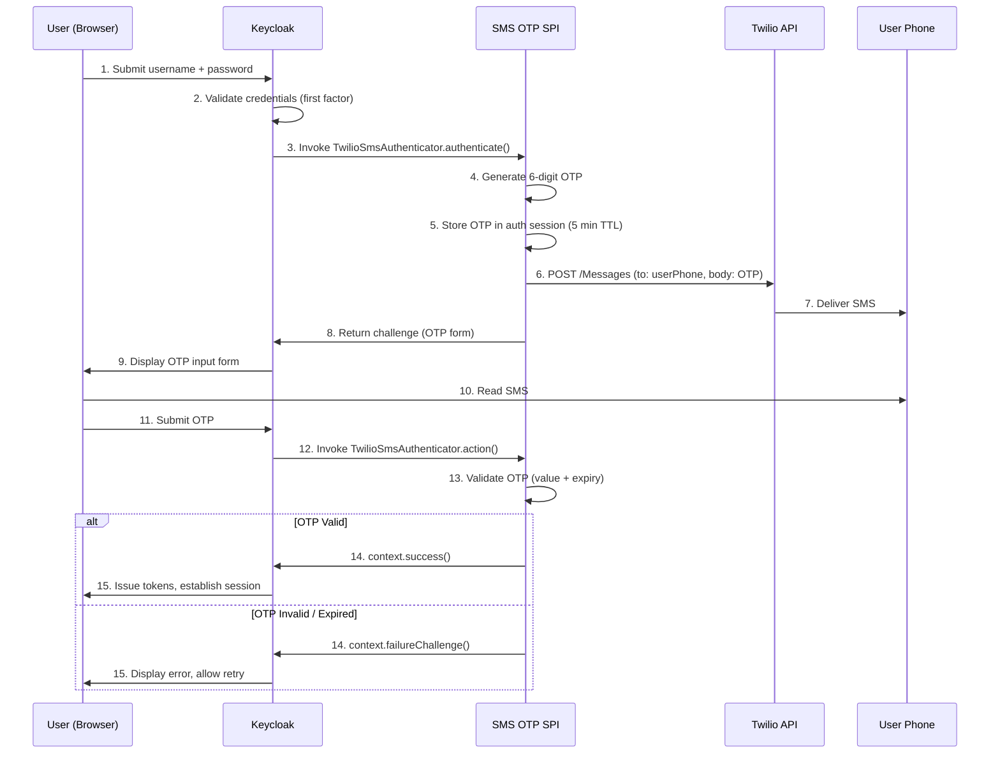

### 5.4 Conditional MFA Policies

Keycloak supports conditional MFA through authentication flow conditions. Policies can require MFA based on user roles, client applications, IP addresses, or other criteria.

**Example conditional policies:**

| Condition | MFA Required | Implementation |
|-----------|-------------|----------------|
| User has `admin` realm role | Always | Conditional OTP flow with role condition |
| Login from untrusted IP range | Always | Conditional OTP with IP-based condition |
| Login from trusted corporate network | Skip MFA | IP allowlist condition |
| Client is `admin-console` | Always | Client-specific authentication flow |
| User has not logged in for 30+ days | Always | Custom authenticator checking last login |
| First login after password reset | Always | Custom authenticator checking credential metadata |

**Keycloak authentication flow configuration:**

```
Browser Flow
  |-- Username Password Form        [REQUIRED]
  |-- Conditional OTP Sub-Flow      [CONDITIONAL]
        |-- Condition: User Role     [CONDITION] (role = "admin")
        |-- OTP Form                 [REQUIRED]
```

### 5.5 Recovery Codes

Recovery codes provide a fallback when the primary MFA device is unavailable.

**Implementation guidelines:**

- Generate 10 single-use recovery codes during MFA enrollment.
- Each code is a cryptographically random 8-character alphanumeric string.
- Store codes as bcrypt hashes in Keycloak user credentials.
- Display codes once during enrollment; instruct the user to store them securely.
- Each code can only be used once; mark as consumed after use.
- Allow regeneration of new codes (invalidates all previous codes).
- Alert administrators when a user falls below 3 remaining codes.

### 5.6 MFA Enrollment Flow

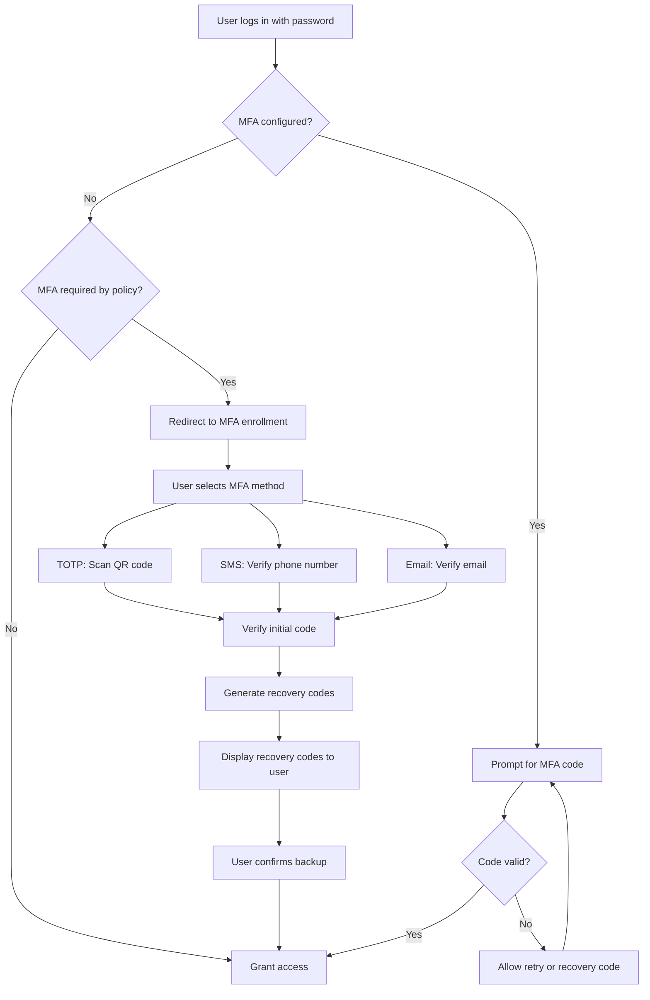

---

## 6. RBAC Design

### 6.1 Realm Roles vs Client Roles

| Aspect | Realm Roles | Client Roles |
|--------|------------|--------------|
| **Scope** | Global across the realm | Scoped to a specific client (application) |
| **Visibility** | Available to all clients in the realm | Available only to the owning client and its consumers |
| **Use case** | Cross-cutting roles (admin, user, auditor) | Application-specific roles (invoice-reader, report-generator) |
| **Token location** | `realm_access.roles` | `resource_access.{client_id}.roles` |
| **Management** | Realm administrator | Client administrator or realm administrator |
| **Example** | `realm-admin`, `user`, `support-agent` | `billing-service:invoice-reader`, `cms:content-editor` |

### 6.2 Composite Roles Design

Composite roles aggregate multiple individual roles into a single assignable role, simplifying role management.

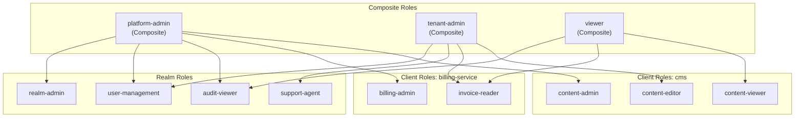

**Design guidelines:**

- Keep individual roles granular and specific to a single permission or capability.
- Use composite roles to represent job functions or personas.
- Avoid deeply nesting composite roles (maximum 2 levels).
- Document the purpose and included roles for every composite role.

### 6.3 Role Mapping Strategies

| Strategy | Description | Pros | Cons |
|----------|-------------|------|------|
| **Direct assignment** | Roles assigned directly to user | Simple, explicit | Does not scale; hard to audit |
| **Group-based** | Roles assigned to groups; users inherit via membership | Scales well; aligns with org structure | Requires group lifecycle management |
| **Identity provider mapping** | Roles mapped from external IdP claims | Centralized role source; consistent across systems | Depends on IdP claim accuracy |
| **Client scope default** | Roles automatically included for all users of a client | Convenient for baseline roles | May over-provision |
| **Conditional (OPA)** | Roles evaluated dynamically at authorization time | Context-aware; fine-grained | Higher complexity; latency |

**Recommendation:** Use group-based role assignment as the primary strategy. Supplement with identity provider mapping for federated users and OPA for context-dependent authorization.

### 6.4 Group-Based Role Assignment

Groups in Keycloak mirror organizational structures and serve as the primary vehicle for role assignment.

```
/                               (root)
  /acme-corp                    (tenant)
    /engineering                (department)
      /platform                 (team) -> roles: [user, platform-admin]
      /backend                  (team) -> roles: [user, developer]
    /finance                    (department)
      /accounting               (team) -> roles: [user, billing-admin]
  /globex-inc                   (tenant)
    /engineering                (department)
      /devops                   (team) -> roles: [user, tenant-admin]
```

**Group role inheritance:** When a role is assigned to a group, all members of that group (and its subgroups) inherit the role. This enables hierarchical permission models.

### 6.5 Example Role Hierarchy

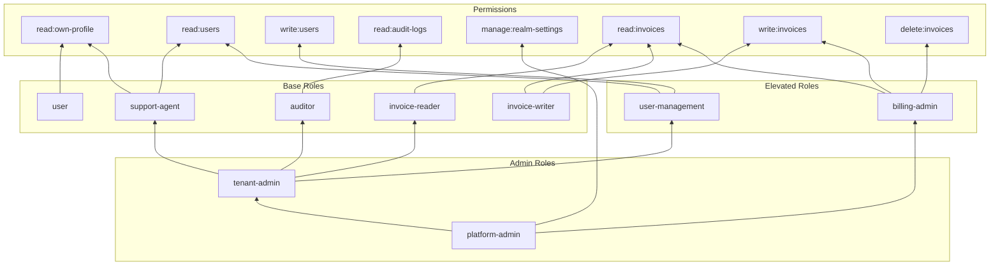

---

## 7. Fine-Grained Authorization with OPA

### 7.1 OPA as Sidecar Architecture

Open Policy Agent (OPA) runs as a sidecar container alongside each service, providing low-latency policy evaluation without network hops to a centralized policy server.

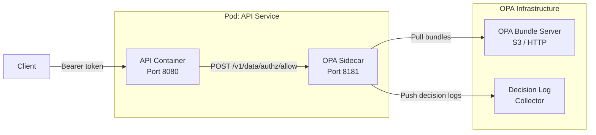

**OPA sidecar container configuration:**

```yaml
- name: opa
  image: openpolicyagent/opa:0.62.0
  args:
    - "run"
    - "--server"
    - "--addr=localhost:8181"
    - "--set=bundles.authz.service=bundle-server"
    - "--set=bundles.authz.resource=bundles/iam-authz.tar.gz"
    - "--set=services.bundle-server.url=https://opa-bundles.example.com"
    - "--set=decision_logs.console=true"
  resources:
    requests:
      cpu: 50m
      memory: 64Mi
    limits:
      cpu: 200m
      memory: 128Mi
  securityContext:
    runAsNonRoot: true
    readOnlyRootFilesystem: true
    allowPrivilegeEscalation: false
    capabilities:
      drop: ["ALL"]
```

### 7.2 Rego Policy Examples

#### 7.2.1 Endpoint Access Based on Roles

```rego
package authz

import future.keywords.in

default allow := false

# Define role-to-endpoint mappings
role_permissions := {
    "admin": [
        {"method": "GET",    "path_prefix": "/api/"},
        {"method": "POST",   "path_prefix": "/api/"},
        {"method": "PUT",    "path_prefix": "/api/"},
        {"method": "DELETE", "path_prefix": "/api/"},
    ],
    "user": [
        {"method": "GET",    "path_prefix": "/api/users/me"},
        {"method": "PUT",    "path_prefix": "/api/users/me"},
        {"method": "GET",    "path_prefix": "/api/invoices"},
    ],
    "auditor": [
        {"method": "GET",    "path_prefix": "/api/audit"},
        {"method": "GET",    "path_prefix": "/api/reports"},
    ],
}

# Allow if the user has a role that grants access to the requested endpoint
allow {
    some role in input.token.realm_access.roles
    some perm in role_permissions[role]
    input.method == perm.method
    startswith(input.path, perm.path_prefix)
}
```

#### 7.2.2 Data Filtering Based on Tenant

```rego
package authz.data_filter

import future.keywords.in

# Determine the tenant filter to apply to database queries
tenant_filter := filter {
    # Platform admins can see all tenants
    "platform-admin" in input.token.realm_access.roles
    filter := {"tenant_id": "*"}
}

tenant_filter := filter {
    # Regular users are restricted to their own tenant
    not "platform-admin" in input.token.realm_access.roles
    filter := {"tenant_id": input.token.tenant_id}
}

# Determine which fields the user can see
visible_fields := fields {
    "admin" in input.token.realm_access.roles
    fields := ["id", "name", "email", "phone", "ssn", "created_at"]
}

visible_fields := fields {
    not "admin" in input.token.realm_access.roles
    fields := ["id", "name", "email", "created_at"]
}
```

#### 7.2.3 Time-Based Access Restrictions

```rego
package authz.time_restrictions

import future.keywords.in

default allow := false

# Business hours: Monday-Friday, 08:00-18:00 UTC
is_business_hours {
    now := time.now_ns()
    day := time.weekday(now)
    day in ["Monday", "Tuesday", "Wednesday", "Thursday", "Friday"]

    clock := time.clock(now)
    hour := clock[0]
    hour >= 8
    hour < 18
}

# Maintenance operations only during business hours
allow {
    input.action == "maintenance"
    is_business_hours
    "platform-admin" in input.token.realm_access.roles
}

# Read operations always allowed for authorized users
allow {
    input.method == "GET"
    some role in input.token.realm_access.roles
    role in ["user", "admin", "auditor", "platform-admin"]
}

# Write operations restricted to business hours for non-admin users
allow {
    input.method in ["POST", "PUT", "DELETE"]
    not "admin" in input.token.realm_access.roles
    is_business_hours
}

# Admins can write at any time
allow {
    input.method in ["POST", "PUT", "DELETE"]
    "admin" in input.token.realm_access.roles
}
```

### 7.3 OPA Bundle Server Setup

OPA policies are distributed as bundles -- compressed archives containing Rego files and optional data files.

**Bundle structure:**

```
bundles/
  iam-authz/
    authz.rego
    data_filter.rego
    time_restrictions.rego
    data.json          # Static data (role mappings, IP allowlists)
    .manifest          # Bundle metadata
```

**Building and serving bundles:**

```bash
# Build bundle
cd bundles/iam-authz
opa build -b . -o ../iam-authz.tar.gz

# Serve via HTTP (development)
opa run --server --bundle ../iam-authz.tar.gz

# Production: upload to S3 or OCI registry
aws s3 cp ../iam-authz.tar.gz s3://opa-bundles/bundles/iam-authz.tar.gz
```

**OPA configuration for S3 bundle source:**

```yaml
services:
  s3:
    url: https://opa-bundles.s3.amazonaws.com
    credentials:
      s3_signing:
        environment_credentials: {}

bundles:
  authz:
    service: s3
    resource: bundles/iam-authz.tar.gz
    polling:
      min_delay_seconds: 30
      max_delay_seconds: 60
```

### 7.4 Decision Logging

OPA decision logs provide an audit trail of every authorization decision for compliance and debugging.

```yaml
decision_logs:
  service: log-collector
  reporting:
    min_delay_seconds: 5
    max_delay_seconds: 10

services:
  log-collector:
    url: https://opa-logs.example.com
    credentials:
      bearer:
        token: "${OPA_LOG_TOKEN}"
```

**Decision log entry example:**

```json
{
  "decision_id": "a1b2c3d4-e5f6-7890-abcd-ef1234567890",
  "timestamp": "2026-03-07T10:30:00.000Z",
  "path": "authz/allow",
  "input": {
    "method": "DELETE",
    "path": "/api/users/123",
    "token": {
      "sub": "user-456",
      "realm_access": {"roles": ["user"]},
      "tenant_id": "tenant-acme"
    }
  },
  "result": false,
  "metrics": {
    "timer_rego_query_eval_ns": 125000
  }
}
```

---

## 8. Token Lifecycle

### 8.1 Access Token TTL Recommendations

| Token Type | Recommended TTL | Rationale |
|-----------|----------------|-----------|
| Access Token (user-facing SPA) | 5 minutes | Short-lived; limits exposure window; refresh via silent renewal |
| Access Token (server-side web app) | 10 minutes | Slightly longer; secure backend storage |
| Access Token (M2M / Client Credentials) | 15 minutes | No refresh token; client re-authenticates |
| ID Token | 5 minutes | Used only for initial authentication; not for API calls |
| Refresh Token (SPA) | 30 minutes | Short; with rotation enabled |
| Refresh Token (server-side app) | 8 hours | Aligned with work session; stored securely server-side |
| Refresh Token (mobile app) | 30 days | Offline access; with rotation and idle timeout |
| Offline Token | 90 days | Long-lived; requires explicit consent and revocation capability |

### 8.2 Refresh Token Rotation

Refresh token rotation issues a new refresh token with every token refresh request, invalidating the previous one. This mitigates the impact of refresh token theft.

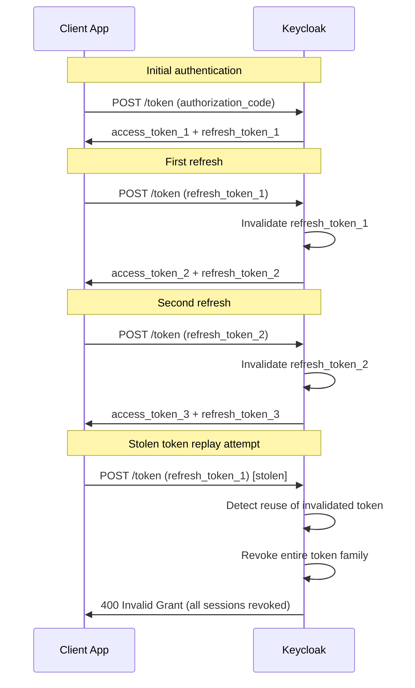

**Keycloak configuration:**

- Enable **Revoke Refresh Token** in realm settings.
- Set **Refresh Token Max Reuse** to `0` (single use).

### 8.3 Token Revocation

Tokens can be revoked through multiple mechanisms depending on the use case.

| Mechanism | Scope | Use Case |
|-----------|-------|----------|
| **Token Revocation Endpoint** | Single token | User-initiated logout; compromised token |
| **Admin Session Revocation** | All tokens for a session | Admin revoking a suspicious session |
| **User Session Logout** | All tokens for a user session | User clicking "sign out" |
| **Realm-wide Not-Before Policy** | All tokens issued before timestamp | Emergency: mass revocation after breach |
| **Client-level Not-Before** | All tokens for a specific client | Client secret compromised |

**Token Revocation Endpoint (RFC 7009):**

```http
POST /realms/{realm}/protocol/openid-connect/revoke HTTP/1.1
Host: auth.example.com
Content-Type: application/x-www-form-urlencoded

token={refresh_token}&
token_type_hint=refresh_token&
client_id={client_id}&
client_secret={client_secret}
```

### 8.4 Backchannel Logout

Backchannel logout (OIDC Back-Channel Logout 1.0) allows Keycloak to notify all relying parties when a user session ends, enabling coordinated logout across all applications.

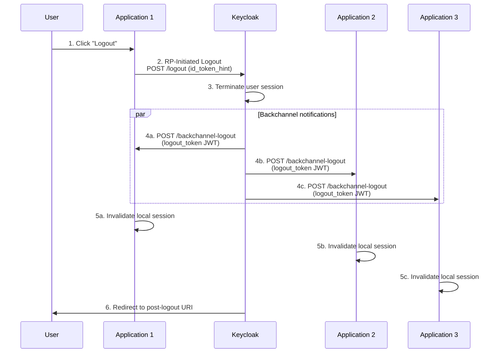

**Client configuration for backchannel logout:**

| Setting | Value |
|---------|-------|
| Backchannel Logout URL | `https://app.example.com/backchannel-logout` |
| Backchannel Logout Session Required | ON |
| Backchannel Logout Revoke Offline Sessions | ON |

**Logout token validation:** The receiving application must validate the `logout_token` JWT:

1. Verify the signature using Keycloak's JWKS.
2. Validate `iss`, `aud`, and `iat` claims.
3. Confirm the `events` claim contains `http://schemas.openid.net/event/backchannel-logout`.
4. Confirm the `sid` (session ID) or `sub` (subject) matches a known local session.
5. Invalidate the matching local session.

### 8.5 Session Management

| Setting | Recommended Value | Description |
|---------|------------------|-------------|
| SSO Session Idle | 30 minutes | Session expires after 30 minutes of inactivity |
| SSO Session Max | 10 hours | Maximum session duration regardless of activity |
| SSO Session Idle Remember Me | 30 days | Idle timeout when "Remember Me" is checked |
| SSO Session Max Remember Me | 365 days | Max duration for "Remember Me" sessions |
| Client Session Idle | 0 (use SSO setting) | Per-client idle override |
| Client Session Max | 0 (use SSO setting) | Per-client max override |
| Offline Session Idle | 30 days | Offline token idle timeout |
| Offline Session Max | 90 days | Offline token maximum lifetime |
| Offline Session Max Limited | ON | Enforce maximum lifetime for offline sessions |

**Session management best practices:**

- Enable session limits to restrict the number of concurrent sessions per user (e.g., maximum 5 active sessions).
- Log all session lifecycle events (creation, refresh, expiry, revocation) for audit purposes.
- Use the Keycloak Admin API to programmatically manage sessions during incident response.
- Monitor session counts per realm and per client to detect anomalies.

---

*This document is a living artifact and must be reviewed at least quarterly. All changes must be approved through the standard change management process. For security controls underpinning these protocols, see [Security by Design](./07-security-by-design.md).*
