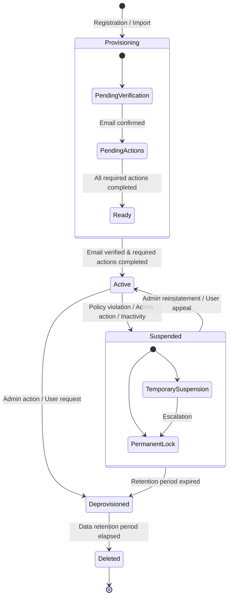
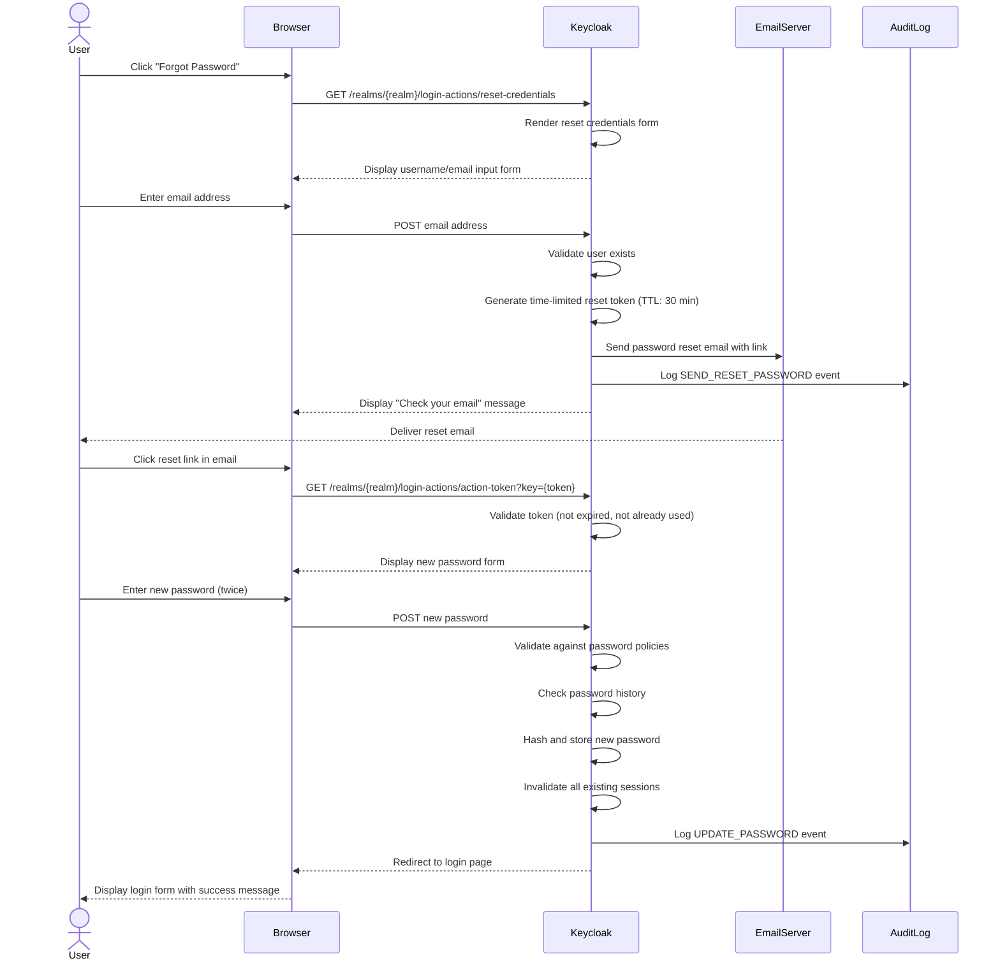
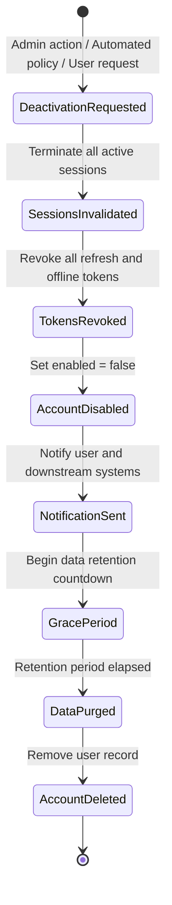
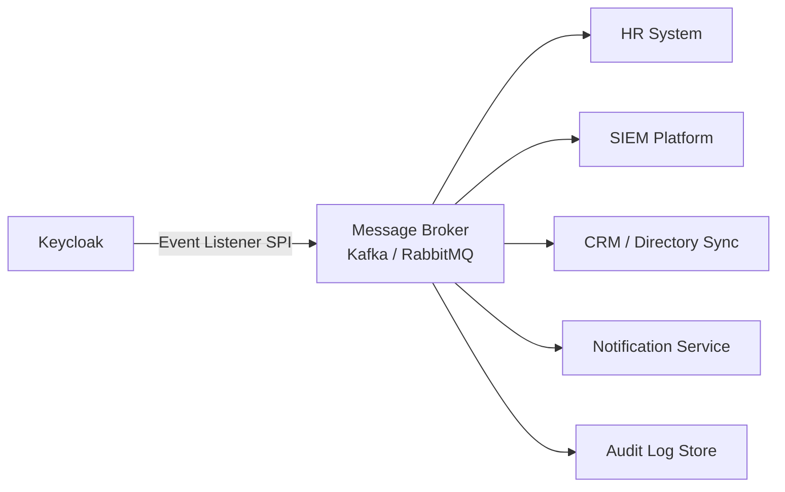

# 09 - User Lifecycle Management

> **Project:** Enterprise IAM Platform based on Keycloak
> **Related documents:** [Authentication & Authorization](./05-authentication-authorization.md) | [Observability](./10-observability.md) | [Security Hardening](./07-security-hardening.md) | [Multi-Tenancy](./06-multi-tenancy.md)

---

## Table of Contents

1. [User Lifecycle States](#1-user-lifecycle-states)
2. [User Provisioning](#2-user-provisioning)
3. [Required User Actions](#3-required-user-actions)
4. [Credential Lifecycle](#4-credential-lifecycle)
5. [Session Management](#5-session-management)
6. [Account Management](#6-account-management)
7. [User Deprovisioning](#7-user-deprovisioning)
8. [Tenant-Specific User Management](#8-tenant-specific-user-management)
9. [Automation](#9-automation)

---

## 1. User Lifecycle States

Every user account in the IAM platform progresses through a well-defined set of lifecycle states. Transitions between states are governed by administrative actions, automated policies, or user-initiated events.



| State | Description | User Can Authenticate | Data Retained |
|---|---|---|---|
| **Provisioning** | Account created but not yet fully activated. Pending email verification or required actions. | No | Yes |
| **Active** | Fully operational account. User can authenticate and access authorized resources. | Yes | Yes |
| **Suspended** | Account temporarily or permanently disabled. Authentication is blocked. | No | Yes |
| **Deprovisioned** | Account marked for removal. All active sessions invalidated, access revoked. | No | Yes (grace period) |
| **Deleted** | Account and associated data permanently removed from the system. | No | No |

---

## 2. User Provisioning

The platform supports multiple provisioning methods to accommodate different organizational requirements.

### 2.1 Self-Registration with Email Verification

Self-registration allows end users to create their own accounts through the Keycloak registration form. Email verification is enforced to confirm ownership of the provided email address.

**Configuration (Realm Settings):**

- Enable **User Registration** under the realm login settings.
- Enable **Verify Email** under the realm login settings.
- Configure the SMTP server for outbound email delivery.

**Flow:**

1. User navigates to the registration page.
2. User fills in the registration form (username, email, password, profile attributes).
3. Keycloak sends a verification email containing a unique, time-limited link.
4. User clicks the verification link within the allowed window (default: 12 hours).
5. Account transitions from **Provisioning** to **Active** (assuming no other required actions remain).

### 2.2 Admin-Initiated Registration

Administrators can create user accounts directly through the Keycloak Admin Console or the Admin REST API.

**Admin Console:**

1. Navigate to **Users > Add User**.
2. Fill in required fields (username, email, first name, last name).
3. Optionally set initial credentials (mark as temporary to force password change on first login).
4. Assign roles and groups as needed.

**Admin REST API:**

```
POST /admin/realms/{realm}/users
Content-Type: application/json

{
  "username": "jdoe",
  "email": "jdoe@example.com",
  "firstName": "John",
  "lastName": "Doe",
  "enabled": true,
  "emailVerified": true,
  "requiredActions": ["UPDATE_PASSWORD"],
  "credentials": [
    {
      "type": "password",
      "value": "temp-password",
      "temporary": true
    }
  ]
}
```

### 2.3 Bulk Import (CSV, SCIM)

#### CSV Import

For large-scale onboarding, the platform supports CSV-based bulk user import through a custom Keycloak extension or scripted API calls.

| CSV Column | Mapped Attribute | Required |
|---|---|---|
| `username` | `username` | Yes |
| `email` | `email` | Yes |
| `first_name` | `firstName` | Yes |
| `last_name` | `lastName` | Yes |
| `groups` | Group membership (comma-separated) | No |
| `roles` | Realm/client roles (comma-separated) | No |
| `enabled` | Account enabled flag | No (default: `true`) |

#### SCIM 2.0 Provisioning

SCIM (System for Cross-domain Identity Management) enables automated user provisioning from external identity governance platforms (e.g., Microsoft Entra ID, Okta, SailPoint).

- Deploy the [Keycloak SCIM extension](https://github.com/Captain-P-Goldfish/scim-for-keycloak) or a comparable plugin.
- Configure the SCIM endpoint under `/scim/v2/Users` and `/scim/v2/Groups`.
- Authenticate SCIM clients using OAuth 2.0 bearer tokens.
- Support for `CREATE`, `UPDATE`, `PATCH`, `DELETE`, and `LIST` operations.

### 2.4 Just-in-Time (JIT) Provisioning from Federated IdPs

When a user authenticates through a federated Identity Provider (e.g., SAML, OIDC, social login), Keycloak can automatically create a local user account on first login.

**Configuration:**

- Configure the Identity Provider under **Identity Providers** in the realm settings.
- Enable **Trust Email** if the IdP is trusted for email verification.
- Configure **First Login Flow** to control account creation behavior:
  - **Automatically create user** -- creates the account without user interaction.
  - **Review profile** -- prompts the user to review and complete their profile.
  - **Link existing account** -- attempts to match an existing account by email.

**Attribute Mapping:**

- Map IdP claims/assertions to Keycloak user attributes using Identity Provider Mappers.
- Map group or role claims to Keycloak groups and roles.

### 2.5 Invitation-Based Registration

Invitation-based registration restricts account creation to users who have received an explicit invitation, typically via email.

**Implementation approach:**

1. An administrator or authorized user generates an invitation through a custom API or admin extension.
2. The system sends an email containing a unique, single-use invitation link with a configurable expiration (e.g., 72 hours).
3. The recipient clicks the link, which pre-fills certain fields (email, tenant) and directs them to a customized registration form.
4. Upon completion, the account is created with pre-assigned roles and group memberships defined in the invitation.

| Parameter | Description | Default |
|---|---|---|
| `invitation_ttl` | Time-to-live for invitation links | 72 hours |
| `max_uses` | Maximum number of times a link can be used | 1 |
| `pre_assigned_roles` | Roles automatically assigned upon registration | (none) |
| `pre_assigned_groups` | Groups automatically assigned upon registration | (none) |

---

## 3. Required User Actions

Required actions are tasks that a user must complete before their account becomes fully active. Keycloak evaluates required actions at login time and presents the appropriate forms.

| Required Action | Description | Configurable |
|---|---|---|
| **Verify Email** | User must confirm email ownership by clicking a verification link. | Yes -- can be set per realm or per user. |
| **Update Password** | User must change their password (e.g., after admin-set temporary password). | Yes -- automatically triggered for temporary credentials. |
| **Configure MFA** | User must enroll a second-factor authenticator (TOTP, WebAuthn). | Yes -- can be enforced via authentication flow or conditional policy. |
| **Accept Terms of Service** | User must accept the current terms and conditions before proceeding. | Yes -- requires a custom required action provider or the built-in terms action. |
| **Update Profile** | User must fill in missing profile fields (e.g., phone number, department). | Yes -- uses the User Profile feature (declarative profile). |

**Configuration guidance:**

- Required actions can be set globally (all new users) via **Authentication > Required Actions** (toggle "Default Action").
- Required actions can be set per user via the Admin Console or Admin REST API.
- Custom required action providers can be implemented using the Keycloak SPI (Service Provider Interface).

---

## 4. Credential Lifecycle

### 4.1 Password Policies

Password policies are configured per realm and enforced during password creation and updates.

| Policy | Description | Recommended Value |
|---|---|---|
| **Minimum Length** | Minimum number of characters required. | 12 |
| **Minimum Uppercase Characters** | Minimum uppercase letters required. | 1 |
| **Minimum Lowercase Characters** | Minimum lowercase letters required. | 1 |
| **Minimum Digits** | Minimum numeric digits required. | 1 |
| **Minimum Special Characters** | Minimum special characters required. | 1 |
| **Password History** | Number of previous passwords that cannot be reused. | 10 |
| **Password Expiry (days)** | Maximum age of a password before it must be changed. | 90 (or disabled if using MFA) |
| **Not Username** | Password must not match the username. | Enabled |
| **Not Email** | Password must not match the email address. | Enabled |
| **Regular Expression** | Custom regex pattern for additional constraints. | (per organizational policy) |
| **Hashing Algorithm** | Algorithm used to hash stored passwords. | `argon2` (Keycloak 24+) or `pbkdf2-sha512` |
| **Hashing Iterations** | Number of hashing iterations. | 210,000 (PBKDF2-SHA512) or Argon2 defaults |
| **Max Authentication Age** | Maximum time before re-authentication is required for sensitive operations. | 300 seconds |

### 4.2 Password Reset Flow



### 4.3 Credential Rotation Policies

| Credential Type | Rotation Policy | Enforcement |
|---|---|---|
| **User passwords** | Rotate every 90 days (configurable). Exemptions possible when MFA is active. | Keycloak password policy ("password age"). |
| **Service account secrets** | Rotate every 30-60 days. Use automated rotation via CI/CD pipeline or vault integration. | External tooling (HashiCorp Vault, Kubernetes secrets rotation). |
| **Client secrets** | Rotate every 90 days. Prefer asymmetric keys (JWT client authentication) where possible. | Admin API or automation scripts. |
| **Signing keys (RSA/EC)** | Rotate annually or upon compromise. Use key rotation with grace period for validation of existing tokens. | Keycloak key provider configuration. |
| **TLS certificates** | Rotate before expiry. Automate with cert-manager (Let's Encrypt or internal CA). | cert-manager with automated renewal. |

### 4.4 Compromised Credential Detection

To protect against credential stuffing and use of known-breached passwords:

- **Integration with breach databases:** Implement a custom password policy provider that checks candidate passwords against known breach databases (e.g., Have I Been Pwned API, using k-anonymity for privacy).
- **Brute force detection:** Keycloak's built-in brute force detection locks accounts after a configurable number of failed login attempts.
- **Anomaly detection:** Integrate with the observability stack (see [Observability](./10-observability.md)) to detect unusual login patterns (geographic anomalies, impossible travel, credential stuffing patterns).
- **Forced password reset:** Administrators can force a password reset for compromised accounts by adding the `UPDATE_PASSWORD` required action via the Admin API.

| Setting | Description | Recommended Value |
|---|---|---|
| `failureFactor` | Number of failed attempts before temporary lockout. | 5 |
| `waitIncrementSeconds` | Lockout duration increment after each failure set. | 60 |
| `maxFailureWaitSeconds` | Maximum lockout duration. | 900 (15 minutes) |
| `maxDeltaTimeSeconds` | Time window for counting failures. | 3600 (1 hour) |
| `quickLoginCheckMilliSeconds` | Minimum time between login attempts to detect automation. | 1000 |

---

## 5. Session Management

### 5.1 Session Types

| Session Type | Description | Storage |
|---|---|---|
| **Browser Session (SSO Session)** | Created when a user logs in via a browser. Enables SSO across clients in the same realm. | Infinispan distributed cache (in-memory, replicated across cluster nodes). |
| **Offline Session** | Long-lived session created when a client requests an offline token. Survives server restarts. | Database-persisted (JDBC). |
| **Client Session** | Tracks the relationship between a user session and a specific client application. | Infinispan (nested within the user session). |
| **Transient Session** | Short-lived session for stateless token exchange or service account authentication. | Not persisted. |

### 5.2 Session Timeout Configuration

| Setting | Description | Recommended Value | Keycloak Path |
|---|---|---|---|
| **SSO Session Idle Timeout** | Maximum idle time before a browser session expires. | 30 minutes | Realm Settings > Sessions |
| **SSO Session Max Lifespan** | Maximum total lifespan of a browser session, regardless of activity. | 10 hours | Realm Settings > Sessions |
| **Client Session Idle Timeout** | Idle timeout for individual client sessions (overrides SSO if shorter). | 30 minutes | Realm Settings > Sessions |
| **Client Session Max Lifespan** | Maximum lifespan for individual client sessions. | 10 hours | Realm Settings > Sessions |
| **Offline Session Idle Timeout** | Idle timeout for offline sessions. | 30 days | Realm Settings > Sessions |
| **Offline Session Max Lifespan** | Maximum lifespan for offline sessions (enable "Offline Session Max Limited"). | 90 days | Realm Settings > Sessions |
| **Access Token Lifespan** | Lifespan of issued access tokens. | 5 minutes | Realm Settings > Tokens |
| **Refresh Token Lifespan** | Maximum lifespan of refresh tokens (if not bound to SSO session). | Same as SSO Session Max | Realm Settings > Tokens |
| **Login Timeout** | Time allowed for the user to complete the login flow. | 5 minutes | Realm Settings > Sessions |
| **Login Action Timeout** | Time allowed for individual login actions (e.g., email verification). | 12 hours | Realm Settings > Sessions |

### 5.3 Active Session Monitoring

- **Admin Console:** Navigate to **Users > {user} > Sessions** to view all active sessions for a specific user, including IP address, start time, last access time, and associated clients.
- **Admin REST API:** Use `GET /admin/realms/{realm}/users/{userId}/sessions` to programmatically retrieve session data.
- **Metrics:** Expose active session counts via Prometheus metrics for dashboard visualization (see [Observability](./10-observability.md)).

### 5.4 Force Logout Capabilities

| Action | Scope | Method |
|---|---|---|
| **Logout single session** | One session of one user. | Admin Console or `DELETE /admin/realms/{realm}/sessions/{sessionId}`. |
| **Logout all sessions for a user** | All sessions of a specific user. | Admin Console or `POST /admin/realms/{realm}/users/{userId}/logout`. |
| **Logout all sessions in a realm** | All users in the realm. | `POST /admin/realms/{realm}/logout-all`. |
| **Revoke specific client sessions** | All sessions for a specific client. | Admin Console (Clients > {client} > Sessions > Logout All). |
| **Back-channel logout** | Notify client applications to terminate local sessions. | Configured per client (Back-Channel Logout URL). |

### 5.5 Session Limits per User

To limit the number of concurrent sessions per user (e.g., prevent credential sharing):

- Deploy a custom Keycloak authenticator or event listener that checks active session count at login time.
- If the session limit is exceeded, either:
  - **Deny the new login** and inform the user.
  - **Terminate the oldest session** and allow the new login (FIFO eviction).

| Parameter | Description | Recommended Value |
|---|---|---|
| `max_concurrent_sessions` | Maximum number of simultaneous browser sessions per user. | 3-5 |
| `eviction_strategy` | Behavior when the limit is exceeded: `deny` or `oldest_first`. | `oldest_first` |

---

## 6. Account Management

### 6.1 Self-Service Account Management (Keycloak Account Console v3)

Keycloak provides a modern, React-based Account Console (v3) that allows users to manage their own accounts without administrator involvement.

**Available self-service capabilities:**

| Feature | Description |
|---|---|
| **Personal Info** | View and update profile attributes (name, email, phone, etc.). |
| **Account Security** | Change password, manage MFA devices (TOTP, WebAuthn), view sign-in history. |
| **Device Activity** | View and manage active sessions across devices. Terminate individual sessions. |
| **Linked Accounts** | View and manage links to federated Identity Providers (social, enterprise). |
| **Applications** | View authorized applications and revoke consent/permissions. |
| **Resources** | Manage UMA (User-Managed Access) resources and permissions (if enabled). |

**Access URL:** `https://{keycloak-host}/realms/{realm}/account/`

### 6.2 Admin-Managed Accounts

Administrators can manage user accounts through the Admin Console or Admin REST API:

- Enable or disable accounts.
- Set required actions (force password change, MFA enrollment).
- Assign or revoke roles and group memberships.
- Impersonate users for troubleshooting (with audit logging).
- View and terminate user sessions.
- Manage user attributes and credentials.

### 6.3 Account Linking (Multiple IdPs)

Users may have identities across multiple Identity Providers. Keycloak supports linking multiple IdP identities to a single local account.

**Linking methods:**

1. **Automatic linking at first login:** Configured in the First Broker Login flow. If an existing account with the same email is found, the IdP identity is linked automatically (after verification).
2. **User-initiated linking:** Through the Account Console, users can link additional IdP accounts under **Linked Accounts**.
3. **Admin-initiated linking:** Via the Admin Console or API, administrators can create federated identity links for a user.

**Security considerations:**

- Automatic linking should require email verification or user confirmation to prevent account takeover.
- Audit all linking events for security review.

---

## 7. User Deprovisioning

### 7.1 Graceful Deactivation Workflow



**Steps in the graceful deactivation process:**

1. **Initiate deactivation** -- triggered by admin, automated policy (e.g., HR feed), or user request.
2. **Invalidate all sessions** -- terminate all browser, offline, and client sessions.
3. **Revoke all tokens** -- ensure no outstanding tokens can be used for access.
4. **Disable the account** -- set the user to `enabled: false` in Keycloak.
5. **Send notifications** -- notify the user (if appropriate), downstream applications, and administrators.
6. **Enter grace period** -- retain account data for the configured retention period.
7. **Purge data** -- permanently delete user data after the retention period.

### 7.2 Data Retention Policies

| Data Category | Retention Period | Justification |
|---|---|---|
| **User profile data** | 30 days after deprovisioning | Allow for account recovery and dispute resolution. |
| **Authentication audit logs** | 1 year | Security analysis, compliance, and forensic investigation. |
| **Consent records** | Duration of data processing + 3 years | Legal obligation under GDPR Art. 7(1). |
| **Session metadata** | 90 days | Troubleshooting and security review. |
| **Offline tokens** | Immediately upon deprovisioning | Prevent unauthorized access. |

### 7.3 GDPR Compliance (Right to Be Forgotten)

When a user exercises the right to erasure under GDPR Article 17:

1. **Verify the request** -- confirm the identity of the requester.
2. **Assess legal basis** -- determine whether any legal obligation or legitimate interest overrides the erasure request (e.g., fraud prevention, legal hold).
3. **Delete personal data** -- remove or anonymize all personally identifiable information (PII) from Keycloak and connected systems.
4. **Retain audit logs in anonymized form** -- replace PII in audit events with anonymized identifiers to maintain audit trail integrity.
5. **Notify third parties** -- inform downstream systems and data processors of the erasure request (GDPR Art. 17(2)).
6. **Document the action** -- log the erasure request and actions taken for compliance records.

**Keycloak-specific actions:**

- Delete the user via Admin API: `DELETE /admin/realms/{realm}/users/{userId}`.
- Verify removal of user data from Infinispan caches (automatic upon user deletion).
- Verify removal of user data from the database (Keycloak handles this on user deletion).
- Remove user data from external systems via SCIM deprovisioning or webhook notifications.

### 7.4 Automated Cleanup Jobs

| Job | Schedule | Description |
|---|---|---|
| **Expired session cleanup** | Every 15 minutes | Remove expired browser and client sessions from the cache and database. |
| **Expired offline token cleanup** | Daily at 02:00 UTC | Remove offline tokens that have exceeded their maximum lifespan. |
| **Deprovisioned account purge** | Weekly (Sunday 03:00 UTC) | Permanently delete user accounts that have been deprovisioned for longer than the configured retention period. |
| **Expired invitation cleanup** | Daily at 01:00 UTC | Remove expired invitation records from the database. |
| **Orphaned consent cleanup** | Monthly | Remove consent records for deleted clients or users. |

---

## 8. Tenant-Specific User Management

### 8.1 User Isolation Between Realms

In a multi-tenant architecture using Keycloak realms (see [Multi-Tenancy](./06-multi-tenancy.md)), users are fully isolated at the realm level:

- Each realm maintains its own user store, credential policies, and session management.
- There is no cross-realm visibility of user data by default.
- Authentication flows, required actions, and password policies can be configured independently per realm.
- User IDs are unique within a realm but may collide across realms (by design -- they are UUIDs).

### 8.2 Cross-Realm User Migration

When a user needs to be migrated from one realm (tenant) to another:

1. **Export user data** from the source realm via the Admin API (`GET /admin/realms/{source-realm}/users/{userId}`).
2. **Transform attributes** as needed to match the target realm's profile schema.
3. **Create user** in the target realm via the Admin API.
4. **Migrate credentials** -- note that Keycloak does not expose raw password hashes via the API. Options include:
   - Force a password reset in the target realm.
   - Use the credential import API (if using compatible hashing algorithms).
   - Use federated user storage to transparently migrate credentials on next login.
5. **Migrate role and group assignments** to equivalent structures in the target realm.
6. **Deactivate** the account in the source realm.

### 8.3 Tenant Admin Delegation

Delegate user management to tenant-specific administrators without granting global admin access:

| Role | Scope | Capabilities |
|---|---|---|
| **Realm Admin** | Full realm management | All user, client, and realm operations within the tenant realm. |
| **User Manager** | User management only | Create, update, disable, delete users. Assign roles and groups. View sessions. |
| **Group Manager** | Group management only | Manage group memberships and group-level role mappings. |
| **View-Only Admin** | Read-only access | View users, sessions, and events. No modification capabilities. |

- Assign these roles through the `realm-management` client roles in each tenant realm.
- For fine-grained permissions, use Keycloak's Fine-Grained Admin Permissions feature (if available in the deployed version).

---

## 9. Automation

### 9.1 Scheduled Tasks for Credential Expiry Notifications

Implement proactive notifications to alert users before their credentials expire:

| Notification | Trigger | Channel | Action |
|---|---|---|---|
| **Password expiry warning (30 days)** | Password age > (max age - 30 days) | Email | Inform user; provide password change link. |
| **Password expiry warning (7 days)** | Password age > (max age - 7 days) | Email + in-app banner | Urgently prompt password change. |
| **Password expired** | Password age > max age | Email + forced action at login | Block access until password is changed. |
| **MFA device expiry** | Certificate-based MFA nearing expiry | Email | Prompt user to re-enroll MFA device. |

**Implementation:**

- Deploy a scheduled job (Kubernetes CronJob or external scheduler) that queries the Keycloak Admin API for users with aging credentials.
- Use the credential metadata API to determine password creation dates.
- Send notifications via the organization's email service or notification platform.

### 9.2 Automated Account Suspension After Inactivity

To reduce the attack surface from dormant accounts:

| Policy | Threshold | Action |
|---|---|---|
| **Inactivity warning** | 60 days without login | Send email notification to the user. |
| **Account suspension** | 90 days without login | Disable the account (`enabled: false`). Notify the user and their manager. |
| **Account deprovisioning** | 180 days without login (if still suspended) | Begin deprovisioning workflow (see [Section 7](#7-user-deprovisioning)). |

**Implementation:**

- Deploy a Kubernetes CronJob (daily at 04:00 UTC) that:
  1. Queries Keycloak for all users in the realm.
  2. Checks `lastLogin` timestamp from user attributes or Keycloak events.
  3. Applies the inactivity policies defined above.
  4. Updates user status and sends notifications as appropriate.
  5. Logs all actions to the audit log.

### 9.3 Webhook Notifications for User Events

Configure event-driven notifications to integrate user lifecycle events with external systems.

**Supported events for webhook dispatch:**

| Event Type | Trigger | Typical Consumer |
|---|---|---|
| `REGISTER` | New user registration | HR system, welcome email service |
| `LOGIN` | Successful authentication | Security analytics, session monitoring |
| `LOGIN_ERROR` | Failed authentication attempt | SIEM, brute force detection |
| `UPDATE_PROFILE` | User profile modification | Directory sync, CRM |
| `UPDATE_PASSWORD` | Password change or reset | Security audit, compliance |
| `CUSTOM_REQUIRED_ACTION` | Completion of a required action | Onboarding workflow |
| `REMOVE_TOTP` | MFA device removed | Security alert system |
| `SEND_RESET_PASSWORD` | Password reset email sent | Help desk ticketing |
| `GRANT_CONSENT` / `REVOKE_GRANT` | OAuth consent granted or revoked | Data privacy, compliance |
| `DELETE_ACCOUNT` | User account deleted | Downstream cleanup, GDPR compliance |

**Implementation:**

- Deploy a custom Keycloak Event Listener SPI that publishes events to a message broker (e.g., Apache Kafka, RabbitMQ, Amazon SNS).
- Alternatively, use Keycloak's built-in webhook event listener (available in Keycloak 24+) or a community extension.
- Consumer services subscribe to relevant event topics and execute downstream logic.



---

> **Next:** [Observability Stack](./10-observability.md) | **Previous:** [Disaster Recovery](./08-disaster-recovery.md)
