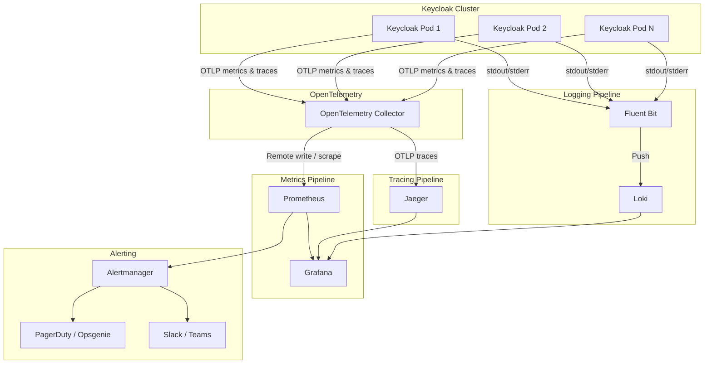

# 10 - Observability Stack: OpenTelemetry, Prometheus, Grafana

> **Project:** Enterprise IAM Platform based on Keycloak
> **Related documents:** [User Lifecycle Management](./09-user-lifecycle.md) | [Security Hardening](./07-security-hardening.md) | [Infrastructure & Deployment](./04-infrastructure-deployment.md) | [Disaster Recovery](./08-disaster-recovery.md)

---

## Table of Contents

1. [Observability Architecture](#1-observability-architecture)
2. [OpenTelemetry Setup](#2-opentelemetry-setup)
3. [Prometheus Configuration](#3-prometheus-configuration)
4. [Grafana Dashboards](#4-grafana-dashboards)
5. [Log Management](#5-log-management)
6. [SLI/SLO Definitions](#6-slislo-definitions)
7. [Incident Response Dashboards](#7-incident-response-dashboards)
8. [Capacity Planning Metrics](#8-capacity-planning-metrics)

---

## 1. Observability Architecture

The observability stack provides comprehensive visibility into the health, performance, and security posture of the Keycloak IAM platform across all three pillars: metrics, traces, and logs.



**Component responsibilities:**

| Component | Role | Deployment |
|---|---|---|
| **Keycloak** | Emits metrics (Micrometer/OTLP), traces (OTLP), and structured logs (JSON). | Kubernetes Deployment (HA). |
| **OpenTelemetry Collector** | Receives, processes, and exports telemetry data from Keycloak. | DaemonSet or Sidecar (see [Section 2.1](#21-collector-deployment-daemonset-vs-sidecar)). |
| **Prometheus** | Stores time-series metrics. Evaluates alerting and recording rules. | StatefulSet with persistent storage. |
| **Grafana** | Visualizes metrics, traces, and logs through dashboards. | Deployment with persistent dashboard storage. |
| **Jaeger** | Stores and visualizes distributed traces. | Deployment (or Jaeger Operator). |
| **Fluent Bit** | Collects, parses, and forwards container logs. | DaemonSet. |
| **Loki** | Stores and indexes logs for querying via Grafana. | StatefulSet (optional component). |
| **Alertmanager** | Routes, deduplicates, and dispatches alerts from Prometheus. | Deployment (HA pair). |

---

## 2. OpenTelemetry Setup

### 2.1 Collector Deployment (DaemonSet vs Sidecar)

| Deployment Model | Description | Pros | Cons | Recommended When |
|---|---|---|---|---|
| **DaemonSet** | One Collector instance per Kubernetes node. All pods on the node send telemetry to the local Collector. | Lower resource overhead. Simpler configuration. Shared across all pods on a node. | Noisy neighbor risk. Single point of failure per node. | General-purpose deployments. Clusters with many workloads. |
| **Sidecar** | One Collector instance per Keycloak pod, running as a sidecar container. | Full isolation. Per-pod configuration. Scales with the application. | Higher resource consumption. More containers to manage. | High-security environments. Fine-grained per-pod configuration required. |

**Recommendation:** Use the **DaemonSet** model for standard deployments. Use the **Sidecar** model when tenant isolation or per-pod telemetry filtering is required.

### 2.2 Collector Configuration

```yaml
# otel-collector-config.yaml
apiVersion: v1
kind: ConfigMap
metadata:
  name: otel-collector-config
  namespace: iam-observability
data:
  config.yaml: |
    receivers:
      otlp:
        protocols:
          grpc:
            endpoint: 0.0.0.0:4317
          http:
            endpoint: 0.0.0.0:4318

      prometheus:
        config:
          scrape_configs:
            - job_name: 'keycloak'
              scrape_interval: 15s
              metrics_path: '/metrics'
              kubernetes_sd_configs:
                - role: pod
                  namespaces:
                    names:
                      - iam-keycloak
              relabel_configs:
                - source_labels: [__meta_kubernetes_pod_label_app]
                  regex: keycloak
                  action: keep

    processors:
      batch:
        timeout: 10s
        send_batch_size: 1024
        send_batch_max_size: 2048

      memory_limiter:
        check_interval: 5s
        limit_mib: 512
        spike_limit_mib: 128

      attributes:
        actions:
          - key: environment
            value: production
            action: upsert
          - key: service.name
            value: keycloak
            action: upsert

      filter:
        metrics:
          exclude:
            match_type: regexp
            metric_names:
              - ".*_debug_.*"

    exporters:
      prometheus:
        endpoint: 0.0.0.0:8889
        namespace: keycloak
        send_timestamps: true
        metric_expiration: 5m

      otlp/jaeger:
        endpoint: jaeger-collector.iam-observability:4317
        tls:
          insecure: false
          ca_file: /etc/tls/ca.crt

      logging:
        loglevel: warn

    extensions:
      health_check:
        endpoint: 0.0.0.0:13133
      zpages:
        endpoint: 0.0.0.0:55679

    service:
      extensions: [health_check, zpages]
      pipelines:
        metrics:
          receivers: [otlp, prometheus]
          processors: [memory_limiter, batch, attributes]
          exporters: [prometheus]
        traces:
          receivers: [otlp]
          processors: [memory_limiter, batch, attributes, filter]
          exporters: [otlp/jaeger]
```

### 2.3 Instrumentation for Keycloak (Metrics and Traces)

Keycloak (Quarkus-based, version 22+) natively supports metrics and tracing through Micrometer and OpenTelemetry.

**Enable metrics and tracing in Keycloak:**

```bash
# Keycloak startup options (keycloak.conf or environment variables)
KC_METRICS_ENABLED=true
KC_HEALTH_ENABLED=true

# OpenTelemetry tracing
KC_TRACING_ENABLED=true
KC_TRACING_ENDPOINT=http://otel-collector:4317
KC_TRACING_PROTOCOL=grpc
KC_TRACING_SAMPLER_TYPE=parentbased_traceidratio
KC_TRACING_SAMPLER_RATIO=0.1       # Sample 10% of traces in production
KC_TRACING_RESOURCE_ATTRIBUTES=service.name=keycloak,deployment.environment=production
```

**Key metrics exposed by Keycloak:**

| Metric | Type | Description |
|---|---|---|
| `keycloak_logins` | Counter | Total number of successful login events, labeled by realm, client, and IdP. |
| `keycloak_login_errors` | Counter | Total number of failed login attempts, labeled by realm, client, and error type. |
| `keycloak_registrations` | Counter | Total number of user registrations. |
| `keycloak_refresh_tokens` | Counter | Total number of token refresh operations. |
| `keycloak_client_initiated_account_linking` | Counter | Number of account linking events. |
| `http_server_requests_seconds` | Histogram | HTTP request latency for all Keycloak endpoints. |
| `jvm_memory_used_bytes` | Gauge | JVM memory usage by memory pool. |
| `jvm_gc_pause_seconds` | Summary | JVM garbage collection pause durations. |
| `db_pool_active_connections` | Gauge | Number of active database connections in the pool. |
| `db_pool_idle_connections` | Gauge | Number of idle database connections. |
| `vendor_cache_*` | Various | Infinispan cache statistics (hits, misses, evictions, size). |

### 2.4 Custom Metrics for Authentication Events

Extend Keycloak's default metrics with custom counters and histograms for deeper authentication insights. Implement a custom Event Listener SPI that records:

| Custom Metric | Type | Labels | Description |
|---|---|---|---|
| `iam_auth_duration_seconds` | Histogram | `realm`, `client_id`, `auth_method`, `result` | End-to-end authentication flow duration. |
| `iam_mfa_enrollments_total` | Counter | `realm`, `mfa_type` | Number of MFA device enrollments. |
| `iam_mfa_challenges_total` | Counter | `realm`, `mfa_type`, `result` | Number of MFA challenge attempts (success/failure). |
| `iam_brute_force_events_total` | Counter | `realm`, `action` | Brute force detection events (lockout, unlock). |
| `iam_token_exchange_total` | Counter | `realm`, `grant_type`, `result` | Token exchange and issuance events by grant type. |
| `iam_federation_auth_total` | Counter | `realm`, `idp`, `result` | Federated authentication attempts by IdP. |
| `iam_consent_events_total` | Counter | `realm`, `client_id`, `action` | Consent grant and revocation events. |

---

## 3. Prometheus Configuration

### 3.1 ServiceMonitor CRDs

When using the Prometheus Operator, define `ServiceMonitor` resources to automatically discover and scrape Keycloak metrics endpoints.

```yaml
apiVersion: monitoring.coreos.com/v1
kind: ServiceMonitor
metadata:
  name: keycloak-metrics
  namespace: iam-observability
  labels:
    release: prometheus-stack
spec:
  namespaceSelector:
    matchNames:
      - iam-keycloak
  selector:
    matchLabels:
      app: keycloak
  endpoints:
    - port: http
      path: /metrics
      interval: 15s
      scrapeTimeout: 10s
      honorLabels: true
      metricRelabelings:
        - sourceLabels: [__name__]
          regex: "jvm_buffer_.*"
          action: drop
```

### 3.2 Scrape Configuration

If not using the Prometheus Operator, configure scrape targets directly in `prometheus.yml`:

```yaml
scrape_configs:
  - job_name: 'keycloak'
    scrape_interval: 15s
    scrape_timeout: 10s
    metrics_path: '/metrics'
    scheme: https
    tls_config:
      ca_file: /etc/prometheus/tls/ca.crt
      insecure_skip_verify: false
    kubernetes_sd_configs:
      - role: pod
        namespaces:
          names:
            - iam-keycloak
    relabel_configs:
      - source_labels: [__meta_kubernetes_pod_label_app]
        regex: keycloak
        action: keep
      - source_labels: [__meta_kubernetes_pod_name]
        target_label: pod
      - source_labels: [__meta_kubernetes_namespace]
        target_label: namespace
```

### 3.3 Recording Rules for Common Queries

Recording rules pre-compute frequently used or expensive queries to improve dashboard performance.

```yaml
apiVersion: monitoring.coreos.com/v1
kind: PrometheusRule
metadata:
  name: keycloak-recording-rules
  namespace: iam-observability
spec:
  groups:
    - name: keycloak.rules
      interval: 30s
      rules:
        # Login success rate over 5 minutes
        - record: keycloak:login_success_rate_5m
          expr: |
            sum(rate(keycloak_logins_total[5m])) by (realm)
            /
            (sum(rate(keycloak_logins_total[5m])) by (realm)
             + sum(rate(keycloak_login_errors_total[5m])) by (realm))

        # Login failure rate per minute
        - record: keycloak:login_failure_rate_1m
          expr: |
            sum(rate(keycloak_login_errors_total[1m])) by (realm)

        # Authentication latency p99
        - record: keycloak:auth_latency_p99_5m
          expr: |
            histogram_quantile(0.99,
              sum(rate(http_server_requests_seconds_bucket{uri=~"/realms/.*/protocol/openid-connect/token"}[5m])) by (le, realm)
            )

        # Authentication latency p50
        - record: keycloak:auth_latency_p50_5m
          expr: |
            histogram_quantile(0.50,
              sum(rate(http_server_requests_seconds_bucket{uri=~"/realms/.*/protocol/openid-connect/token"}[5m])) by (le, realm)
            )

        # Active database connections ratio
        - record: keycloak:db_pool_utilization
          expr: |
            db_pool_active_connections / (db_pool_active_connections + db_pool_idle_connections)

        # Token issuance rate
        - record: keycloak:token_issuance_rate_5m
          expr: |
            sum(rate(keycloak_refresh_tokens_total[5m])) by (realm)
            + sum(rate(keycloak_logins_total[5m])) by (realm)
```

### 3.4 Alerting Rules

```yaml
apiVersion: monitoring.coreos.com/v1
kind: PrometheusRule
metadata:
  name: keycloak-alerting-rules
  namespace: iam-observability
spec:
  groups:
    - name: keycloak.alerts
      rules:
        - alert: HighLoginFailureRate
          expr: sum(rate(keycloak_login_errors_total[1m])) by (realm) > 10
          for: 2m
          labels:
            severity: warning
            team: iam
          annotations:
            summary: "High login failure rate in realm {{ $labels.realm }}"
            description: "Login failure rate exceeds 10 failures/min for realm {{ $labels.realm }}. Current value: {{ $value | humanize }} failures/min."
            runbook_url: "https://wiki.internal/runbooks/iam/high-login-failure-rate"

        - alert: KeycloakDown
          expr: up{job="keycloak"} == 0
          for: 5m
          labels:
            severity: critical
            team: iam
          annotations:
            summary: "Keycloak instance {{ $labels.pod }} is down"
            description: "Keycloak pod {{ $labels.pod }} in namespace {{ $labels.namespace }} has been unreachable for more than 5 minutes."
            runbook_url: "https://wiki.internal/runbooks/iam/keycloak-down"

        - alert: HighTokenIssuanceLatency
          expr: keycloak:auth_latency_p99_5m > 2
          for: 5m
          labels:
            severity: warning
            team: iam
          annotations:
            summary: "High token issuance latency (p99) in realm {{ $labels.realm }}"
            description: "The p99 token issuance latency exceeds 2 seconds for realm {{ $labels.realm }}. Current value: {{ $value | humanize }}s."
            runbook_url: "https://wiki.internal/runbooks/iam/high-token-latency"

        - alert: DatabaseConnectionPoolExhausted
          expr: keycloak:db_pool_utilization > 0.9
          for: 5m
          labels:
            severity: critical
            team: iam
          annotations:
            summary: "Database connection pool near exhaustion"
            description: "Database connection pool utilization exceeds 90%. Current value: {{ $value | humanizePercentage }}."
            runbook_url: "https://wiki.internal/runbooks/iam/db-pool-exhaustion"

        - alert: CertificateExpiringSoon
          expr: (x509_cert_not_after - time()) / 86400 < 30
          for: 1h
          labels:
            severity: warning
            team: iam
          annotations:
            summary: "TLS certificate expiring soon for {{ $labels.subject }}"
            description: "Certificate for {{ $labels.subject }} expires in {{ $value | humanize }} days."
            runbook_url: "https://wiki.internal/runbooks/iam/certificate-renewal"

        - alert: HighMemoryUsage
          expr: jvm_memory_used_bytes{area="heap"} / jvm_memory_max_bytes{area="heap"} > 0.85
          for: 10m
          labels:
            severity: warning
            team: iam
          annotations:
            summary: "High JVM heap memory usage on {{ $labels.pod }}"
            description: "JVM heap usage exceeds 85% on pod {{ $labels.pod }}. Current value: {{ $value | humanizePercentage }}."

        - alert: InfinispanCacheEvictions
          expr: rate(vendor_cache_evictions_total[5m]) > 10
          for: 5m
          labels:
            severity: warning
            team: iam
          annotations:
            summary: "High Infinispan cache eviction rate"
            description: "Cache {{ $labels.cache }} is experiencing more than 10 evictions/sec. This may indicate insufficient cache sizing."

        - alert: BruteForceDetected
          expr: sum(rate(iam_brute_force_events_total{action="lockout"}[5m])) by (realm) > 5
          for: 2m
          labels:
            severity: warning
            team: security
          annotations:
            summary: "Brute force attack detected in realm {{ $labels.realm }}"
            description: "More than 5 account lockouts per 5 minutes detected in realm {{ $labels.realm }}."
```

**Alerting rules summary:**

| Alert | Condition | Severity | For Duration |
|---|---|---|---|
| **HighLoginFailureRate** | > 10 login failures/min per realm | Warning | 2m |
| **KeycloakDown** | `up == 0` for any Keycloak instance | Critical | 5m |
| **HighTokenIssuanceLatency** | p99 latency > 2s | Warning | 5m |
| **DatabaseConnectionPoolExhausted** | Pool utilization > 90% | Critical | 5m |
| **CertificateExpiringSoon** | Certificate expires in < 30 days | Warning | 1h |
| **HighMemoryUsage** | JVM heap usage > 85% | Warning | 10m |
| **InfinispanCacheEvictions** | Cache eviction rate > 10/sec | Warning | 5m |
| **BruteForceDetected** | > 5 account lockouts per 5 minutes | Warning | 2m |

---

## 4. Grafana Dashboards

### 4.1 Keycloak Overview Dashboard

**Purpose:** High-level operational view of the Keycloak cluster.

**Panels:**

| Panel | Visualization | Query / Data Source |
|---|---|---|
| **Login Rate (realms)** | Time series (stacked) | `sum(rate(keycloak_logins_total[5m])) by (realm)` |
| **Login Error Rate** | Time series | `sum(rate(keycloak_login_errors_total[5m])) by (realm, error)` |
| **Active Sessions** | Stat / Gauge | `sum(keycloak_active_sessions) by (realm)` |
| **Token Issuance Rate** | Time series | `keycloak:token_issuance_rate_5m` |
| **User Registrations** | Bar chart (daily) | `sum(increase(keycloak_registrations_total[24h])) by (realm)` |
| **Login Success Rate** | Gauge (percentage) | `keycloak:login_success_rate_5m` |
| **Cluster Health** | Status map | `up{job="keycloak"}` |
| **Realm Selector** | Variable (dropdown) | Label values for `realm` |

### 4.2 Authentication Performance Dashboard

**Purpose:** Detailed performance analysis of authentication flows and token operations.

**Panels:**

| Panel | Visualization | Query / Data Source |
|---|---|---|
| **Auth Latency (p50, p90, p99)** | Time series (multi-line) | `histogram_quantile(0.50/0.90/0.99, sum(rate(http_server_requests_seconds_bucket{uri=~".*token.*"}[5m])) by (le))` |
| **Token Issuance Latency Heatmap** | Heatmap | `sum(rate(http_server_requests_seconds_bucket{uri=~".*token.*"}[5m])) by (le)` |
| **Auth Flow Duration Distribution** | Histogram | `iam_auth_duration_seconds_bucket` |
| **MFA Challenge Success Rate** | Gauge | `sum(rate(iam_mfa_challenges_total{result="success"}[5m])) / sum(rate(iam_mfa_challenges_total[5m]))` |
| **Token Refresh Rate** | Time series | `sum(rate(keycloak_refresh_tokens_total[5m])) by (realm)` |
| **Slow Requests (> 1s)** | Table (top N) | Requests exceeding 1s latency, grouped by URI. |
| **Federated Auth Latency by IdP** | Bar chart | `histogram_quantile(0.99, sum(rate(iam_auth_duration_seconds_bucket{auth_method="federated"}[5m])) by (le, idp))` |

### 4.3 Infrastructure Health Dashboard

**Purpose:** Monitor the health and resource utilization of the Keycloak infrastructure.

**Panels:**

| Panel | Visualization | Query / Data Source |
|---|---|---|
| **Pod Status** | Status map | `kube_pod_status_phase{namespace="iam-keycloak"}` |
| **CPU Usage per Pod** | Time series | `rate(container_cpu_usage_seconds_total{namespace="iam-keycloak"}[5m])` |
| **Memory Usage per Pod** | Time series | `container_memory_working_set_bytes{namespace="iam-keycloak"}` |
| **JVM Heap Usage** | Time series (area) | `jvm_memory_used_bytes{area="heap"} / jvm_memory_max_bytes{area="heap"}` |
| **GC Pause Duration** | Time series | `rate(jvm_gc_pause_seconds_sum[5m])` |
| **DB Connection Pool** | Gauge + time series | `db_pool_active_connections`, `db_pool_idle_connections` |
| **Infinispan Cache Hit Rate** | Gauge | `vendor_cache_hits_total / (vendor_cache_hits_total + vendor_cache_misses_total)` |
| **Network I/O** | Time series | `rate(container_network_receive_bytes_total[5m])` |
| **Persistent Volume Usage** | Gauge | `kubelet_volume_stats_used_bytes / kubelet_volume_stats_capacity_bytes` |
| **Pod Restarts** | Stat | `kube_pod_container_status_restarts_total{namespace="iam-keycloak"}` |

### 4.4 Security Dashboard

**Purpose:** Monitor security-relevant events and detect suspicious activity.

**Panels:**

| Panel | Visualization | Query / Data Source |
|---|---|---|
| **Failed Logins by Source IP** | Table (top 20) | `topk(20, sum(increase(keycloak_login_errors_total[1h])) by (source_ip))` |
| **Brute Force Lockouts** | Time series | `sum(rate(iam_brute_force_events_total{action="lockout"}[5m])) by (realm)` |
| **Failed Logins Geo Map** | Geo map | Failed login events with GeoIP enrichment. |
| **Suspicious Activity Timeline** | Annotations + time series | Combined view of lockouts, unusual login patterns, and admin actions. |
| **Account Lockout Rate** | Stat | `sum(increase(iam_brute_force_events_total{action="lockout"}[24h]))` |
| **MFA Bypass Attempts** | Counter | Failed MFA challenges correlated with subsequent successful password-only logins. |
| **Admin API Usage** | Time series | `sum(rate(http_server_requests_seconds_count{uri=~"/admin/.*"}[5m])) by (method, uri)` |
| **Consent Revocation Spike** | Time series | `sum(rate(iam_consent_events_total{action="revoke"}[5m])) by (realm)` |
| **Certificate Expiry Countdown** | Table | Days remaining for all monitored certificates. |

### 4.5 Dashboard JSON Structure Overview

Grafana dashboards are stored as JSON models and managed through infrastructure-as-code.

```
grafana/
  dashboards/
    keycloak-overview.json
    keycloak-auth-performance.json
    keycloak-infrastructure.json
    keycloak-security.json
    keycloak-incident-response.json
  provisioning/
    dashboards.yaml          # Dashboard provisioning configuration
    datasources.yaml         # Data source provisioning (Prometheus, Jaeger, Loki)
```

**Dashboard provisioning configuration (`dashboards.yaml`):**

```yaml
apiVersion: 1
providers:
  - name: 'keycloak-dashboards'
    orgId: 1
    folder: 'IAM - Keycloak'
    type: file
    disableDeletion: true
    editable: false
    options:
      path: /var/lib/grafana/dashboards
      foldersFromFilesStructure: false
```

**Data source provisioning (`datasources.yaml`):**

```yaml
apiVersion: 1
datasources:
  - name: Prometheus
    type: prometheus
    access: proxy
    url: http://prometheus-server.iam-observability:9090
    isDefault: true
    jsonData:
      timeInterval: '15s'

  - name: Jaeger
    type: jaeger
    access: proxy
    url: http://jaeger-query.iam-observability:16686

  - name: Loki
    type: loki
    access: proxy
    url: http://loki.iam-observability:3100
```

---

## 5. Log Management

### 5.1 Structured Logging Configuration for Keycloak

Configure Keycloak to emit structured JSON logs for efficient parsing and indexing.

**Keycloak configuration (`keycloak.conf`):**

```properties
# Enable JSON-formatted logging
log=console
log-console-output=json
log-console-format=%d{yyyy-MM-dd HH:mm:ss.SSS} %-5p [%c] (%t) %s%e%n

# Log level configuration
log-level=INFO,org.keycloak:INFO,org.infinispan:WARN,org.hibernate:WARN
```

**Example structured log output:**

```json
{
  "timestamp": "2026-03-07T10:15:30.123Z",
  "level": "INFO",
  "loggerName": "org.keycloak.events",
  "message": "LOGIN",
  "traceId": "abc123def456",
  "spanId": "789ghi012",
  "contextMap": {
    "realm": "tenant-a",
    "clientId": "web-app",
    "userId": "user-uuid-123",
    "ipAddress": "192.168.1.100",
    "authMethod": "openid-connect",
    "sessionId": "session-uuid-456"
  }
}
```

### 5.2 Log Levels per Component

| Component | Log Level | Rationale |
|---|---|---|
| `org.keycloak` | `INFO` | General Keycloak operations. |
| `org.keycloak.events` | `INFO` | Authentication and admin events (audit trail). |
| `org.keycloak.services` | `INFO` | Service-layer operations. |
| `org.keycloak.authentication` | `INFO` | Authentication flow execution. Set to `DEBUG` during flow troubleshooting. |
| `org.keycloak.broker` | `INFO` | Identity Provider brokering. Set to `DEBUG` for federation issues. |
| `org.keycloak.storage` | `WARN` | User storage federation. |
| `org.infinispan` | `WARN` | Infinispan cache operations. Set to `INFO` during cluster issues. |
| `org.hibernate` | `WARN` | Database ORM layer. Set to `DEBUG` for query analysis (high volume). |
| `io.quarkus` | `INFO` | Quarkus framework operations. |
| `org.jgroups` | `WARN` | JGroups cluster communication. Set to `INFO` during network troubleshooting. |

**Dynamic log level adjustment:**

Log levels can be adjusted at runtime without restarting Keycloak by using the Quarkus management endpoint (if enabled) or by updating the ConfigMap and triggering a rolling restart.

### 5.3 Log Correlation with Trace IDs

Enable trace context propagation so that log entries can be correlated with distributed traces in Jaeger.

**How it works:**

1. Keycloak's OpenTelemetry integration injects `traceId` and `spanId` into the MDC (Mapped Diagnostic Context).
2. The structured JSON log format includes these fields automatically.
3. In Grafana, use the **Explore** view to jump from a Loki log entry directly to the corresponding Jaeger trace using the `traceId` field.

**Grafana data source correlation configuration:**

```yaml
# In the Loki data source configuration
jsonData:
  derivedFields:
    - datasourceUid: jaeger-datasource-uid
      matcherRegex: '"traceId":"([a-f0-9]+)"'
      name: TraceID
      url: '$${__value.raw}'
```

### 5.4 Audit Log Analysis

Keycloak generates two categories of audit events:

| Event Category | Description | Examples |
|---|---|---|
| **Login Events** | User-initiated authentication and account events. | `LOGIN`, `LOGIN_ERROR`, `LOGOUT`, `REGISTER`, `UPDATE_PASSWORD`, `SEND_RESET_PASSWORD` |
| **Admin Events** | Administrative operations performed via the Admin Console or Admin API. | `CREATE` (user/client/realm), `UPDATE`, `DELETE`, `ACTION` (impersonate, revoke) |

**Storage and retention:**

- Enable event storage in the realm settings: **Events > Login Events Settings > Save Events**.
- Configure the event expiration (e.g., 365 days for login events, unlimited for admin events).
- For long-term retention, forward events to Loki or an external SIEM via the Event Listener SPI (see [User Lifecycle Management](./09-user-lifecycle.md#93-webhook-notifications-for-user-events)).

**Useful audit queries (Loki/LogQL):**

```logql
# All failed login attempts in the last hour
{namespace="iam-keycloak"} |= "LOGIN_ERROR" | json | line_format "{{.contextMap_realm}} {{.contextMap_clientId}} {{.contextMap_ipAddress}}"

# Admin actions on users
{namespace="iam-keycloak"} |= "ADMIN_EVENT" | json | contextMap_resourceType="USER"

# Password reset events
{namespace="iam-keycloak"} |= "SEND_RESET_PASSWORD" | json
```

---

## 6. SLI/SLO Definitions

### Service Level Indicators and Objectives

| SLI | SLO | Measurement Method | Error Budget (30 days) |
|---|---|---|---|
| **Authentication availability** | 99.9% | `successful_auth / total_auth_attempts` (excluding client errors 4xx) | 43.2 minutes downtime |
| **Login latency (p99)** | < 2s | Prometheus histogram: `histogram_quantile(0.99, rate(http_server_requests_seconds_bucket{uri=~".*token.*"}[5m]))` | N/A (latency target) |
| **Token issuance latency (p99)** | < 500ms | Prometheus histogram: `histogram_quantile(0.99, rate(http_server_requests_seconds_bucket{uri=~".*token.*", method="POST"}[5m]))` | N/A (latency target) |
| **Admin API availability** | 99.5% | `successful_admin_requests / total_admin_requests` | 3.6 hours downtime |
| **User provisioning success rate** | 99.9% | `successful_provisioning / total_provisioning_attempts` | 43.2 minutes |
| **Session creation success rate** | 99.95% | `successful_session_creations / total_session_creation_attempts` | 21.6 minutes |

### SLO Burn Rate Alerts

Configure multi-window, multi-burn-rate alerts to detect SLO violations early:

| Window | Burn Rate | Alert Severity | Meaning |
|---|---|---|---|
| 1 hour | 14.4x | Critical | Exhausts 30-day error budget in < 2 days if sustained. |
| 6 hours | 6x | Critical | Exhausts 30-day error budget in < 5 days if sustained. |
| 1 day | 3x | Warning | Exhausts 30-day error budget in < 10 days if sustained. |
| 3 days | 1x | Warning | On track to exhaust 30-day error budget. |

---

## 7. Incident Response Dashboards

### 7.1 Incident Response Overview

A dedicated Grafana dashboard for use during active incidents, consolidating the most critical signals.

**Panels:**

| Panel | Description |
|---|---|
| **Service Status** | Current up/down status of all Keycloak pods, database, and cache layer. |
| **Error Rate Spike Detection** | Anomaly detection on login error rates with automatic annotations for deviations > 3 standard deviations. |
| **Recent Alerts Timeline** | Alertmanager alerts for the last 4 hours, displayed as annotations on a time series. |
| **Latency Breakdown** | p50/p90/p99 latency for token endpoint, admin API, and account console. |
| **Database Query Latency** | Histogram of database query durations to detect database-related issues. |
| **Infinispan Cluster Status** | Number of cluster members, rebalancing status, split-brain detection. |
| **Dependency Status** | Health of external dependencies (IdPs, SMTP, database, message broker). |
| **Recent Deployments** | Annotations from CI/CD pipeline showing recent deployments for correlation. |

### 7.2 Incident Severity Classification

| Severity | Definition | Response Time | Dashboard Action |
|---|---|---|---|
| **SEV1 - Critical** | Complete authentication outage. No users can log in. | 15 minutes | Full incident response team assembled. All dashboards active. |
| **SEV2 - Major** | Partial degradation. Some realms or clients affected. Elevated error rates. | 30 minutes | On-call engineer investigates. Focused dashboard view. |
| **SEV3 - Minor** | Performance degradation. Elevated latency. Non-critical features affected. | 2 hours | Ticket created. Investigated during business hours. |
| **SEV4 - Low** | Cosmetic issues or minor anomalies. No user impact. | Next business day | Logged for review. |

---

## 8. Capacity Planning Metrics

### 8.1 Key Capacity Indicators

| Metric | Description | Capacity Threshold | Action When Exceeded |
|---|---|---|---|
| **CPU utilization (avg)** | Average CPU usage across Keycloak pods. | > 70% sustained | Scale horizontally (add pods) or vertically (increase CPU limits). |
| **Memory utilization (avg)** | Average heap + non-heap memory usage. | > 80% sustained | Increase memory limits. Review cache sizing. |
| **DB connection pool utilization** | Active connections / total pool size. | > 75% sustained | Increase pool size or add read replicas. |
| **Infinispan cache size** | Number of entries in session and authentication caches. | > 80% of configured max entries | Increase cache limits. Review session timeout policies. |
| **Request rate (req/s)** | Total inbound request rate to Keycloak. | > 80% of tested capacity | Scale horizontally. Review rate limiting policies. |
| **Disk I/O (database)** | Database disk read/write throughput. | > 70% of provisioned IOPS | Upgrade storage class. Optimize queries. |
| **Network throughput** | Inbound/outbound network traffic. | > 70% of link capacity | Review payload sizes. Enable compression. |

### 8.2 Capacity Planning Formula

Estimate required Keycloak pod count based on expected load:

```
Required Pods = (Peak Auth Requests/sec * Average Latency per Request) / Target CPU Utilization per Pod

Example:
  Peak load: 500 auth/sec
  Avg latency: 100ms (0.1s)
  Target CPU: 70% (0.7)
  Threads per pod: 200

  Required Pods = ceil(500 * 0.1 / (200 * 0.7)) = ceil(0.36) = 1 pod minimum

  With HA requirement (N+1) and headroom: 3 pods recommended
```

### 8.3 Growth Forecasting

Track the following trends over time to forecast capacity needs:

| Metric | Trend Analysis | Forecast Horizon |
|---|---|---|
| **Total registered users** | Linear or exponential growth rate per realm. | 6-12 months |
| **Peak concurrent sessions** | Weekly/monthly peak analysis with seasonal adjustment. | 3-6 months |
| **Authentication request volume** | Daily/weekly growth rate. Correlate with user growth. | 3-6 months |
| **Database storage consumption** | Growth rate of database size (users, sessions, events). | 6-12 months |
| **Event log volume** | Daily log ingestion rate for storage planning (Loki, SIEM). | 3-6 months |

**Grafana prediction:**

Use Grafana's built-in `predict_linear()` function (via Prometheus) to project metric trends:

```promql
# Predict database storage usage 90 days from now
predict_linear(pg_database_size_bytes{datname="keycloak"}[30d], 90 * 24 * 3600)
```

---

> **Next:** [CI/CD Pipeline](./11-cicd-pipeline.md) | **Previous:** [User Lifecycle Management](./09-user-lifecycle.md)
