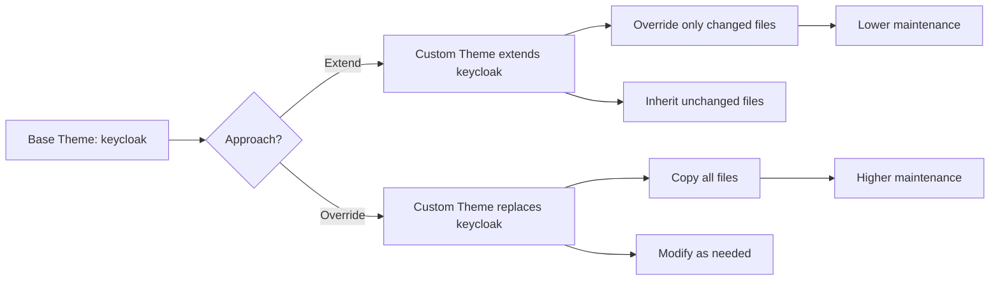
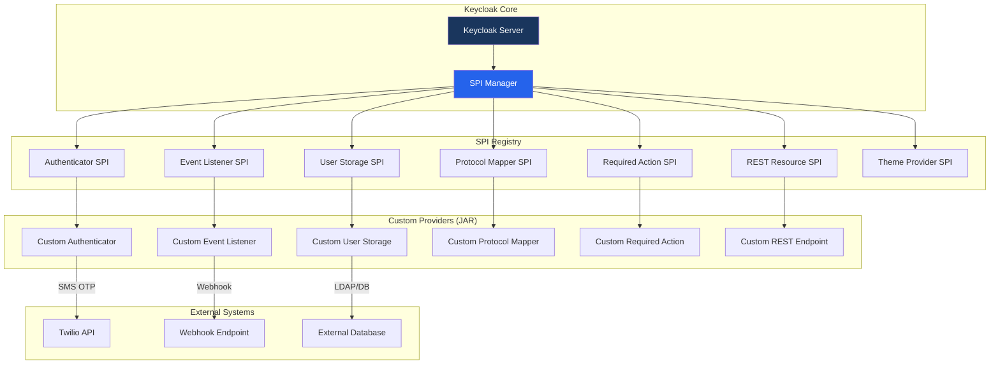

# Keycloak Customization Guide

This document provides a comprehensive guide to customizing Keycloak for enterprise IAM deployments. It covers theme customization, custom SPI development, email template customization, custom REST endpoints, and JavaScript policy providers.

For deployment details, see [Environment Management](./12-environment-management.md).

---

## Table of Contents

1. [Theme Customization](#theme-customization)
2. [Custom SPIs (Service Provider Interfaces)](#custom-spis-service-provider-interfaces)
3. [Email Template Customization](#email-template-customization)
4. [Custom REST Endpoints](#custom-rest-endpoints)
5. [Admin Console Extensions](#admin-console-extensions)
6. [JavaScript Policy Providers](#javascript-policy-providers)

---

## Theme Customization

Keycloak provides a robust theming system that allows complete customization of the user-facing interfaces. Each theme type controls a different area of the Keycloak UI.

### Theme Types

| Theme Type | Description | Typical Customization |
|------------|-------------|----------------------|
| `login` | Login, registration, OTP, and password reset pages | Corporate branding, custom fields, layout changes |
| `account` | User self-service account management console | Branding, custom profile fields, navigation |
| `admin` | Keycloak Admin Console | Typically left as default; minor branding only |
| `email` | Email templates (verification, password reset, etc.) | Corporate email templates, multi-language support |
| `welcome` | Keycloak server welcome page | Branding or redirect to a custom landing page |

### Theme Directory Structure

A custom theme follows a well-defined directory structure. Each theme type has its own subdirectory containing templates, resources, and configuration.

```
themes/
  custom-theme/
    login/
      resources/
        css/
          login.css
          styles.css
        img/
          logo.png
          favicon.ico
          bg.jpg
        js/
          custom.js
      theme.properties
      login.ftl
      template.ftl
      register.ftl
      info.ftl
    account/
      resources/
        css/
        img/
      theme.properties
    email/
      messages/
        messages_en.properties
        messages_es.properties
        messages_fr.properties
      html/
        email-verification.ftl
        password-reset.ftl
        executeActions.ftl
        event-login_error.ftl
      text/
        email-verification.ftl
        password-reset.ftl
      theme.properties
```

### Extending vs. Overriding Default Themes

Keycloak supports two approaches for customizing themes:

**Extending (Recommended)**

Extending a theme inherits all templates and resources from a parent theme. You only override the files you need to change. This is the recommended approach because it minimizes maintenance when upgrading Keycloak.

In `theme.properties`:

```properties
parent=keycloak
import=common/keycloak
```

**Overriding**

A full override copies all templates and resources from the base theme and modifies them. This provides maximum control but requires updating templates manually when upgrading Keycloak.



### CSS Customization Approach

The recommended approach for visual customization is CSS-only changes using theme extension.

**Step 1:** Create `theme.properties` that extends the base theme:

```properties
parent=keycloak
import=common/keycloak
styles=css/login.css css/custom-styles.css
```

**Step 2:** Add custom CSS in `resources/css/custom-styles.css`:

```css
/* Corporate branding overrides */
.login-pf body {
    background-color: #f0f2f5;
    background-image: url('../img/corporate-bg.jpg');
    background-size: cover;
}

#kc-header-wrapper {
    font-size: 32px;
    color: #1a365d;
    font-family: 'Inter', sans-serif;
}

#kc-login {
    border-radius: 8px;
    box-shadow: 0 4px 6px rgba(0, 0, 0, 0.1);
}

.btn-primary {
    background-color: #2563eb;
    border-color: #2563eb;
}

.btn-primary:hover {
    background-color: #1d4ed8;
    border-color: #1d4ed8;
}
```

**Step 3:** Override only the templates that require structural changes (e.g., adding a custom logo):

```html
<!-- login.ftl (only if structural changes are needed) -->
<#import "template.ftl" as layout>
<@layout.registrationLayout displayInfo=social.displayInfo; section>
    <#if section = "header">
        
        ${msg("loginTitle",(realm.displayName!''))}
    </#if>
    <!-- ... rest of template ... -->
</@layout.registrationLayout>
```

### Per-Tenant (Per-Realm) Theme Assignment

In a multi-tenant architecture, each realm can have its own theme. This allows different tenants (organizations) to have distinct branding.

**Admin Console Configuration:**

1. Navigate to **Realm Settings** > **Themes**.
2. Select the desired theme for each theme type (Login, Account, Email, Admin).
3. Save the configuration.

**Realm Export JSON:**

```json
{
  "realm": "tenant-acme",
  "loginTheme": "acme-theme",
  "accountTheme": "acme-theme",
  "emailTheme": "acme-email",
  "adminTheme": "keycloak.v2",
  "internationalizationEnabled": true,
  "supportedLocales": ["en", "es", "fr"],
  "defaultLocale": "en"
}
```

**Programmatic Assignment via Admin REST API:**

```bash
curl -X PUT \
  "https://keycloak.example.com/admin/realms/tenant-acme" \
  -H "Authorization: Bearer ${ACCESS_TOKEN}" \
  -H "Content-Type: application/json" \
  -d '{
    "loginTheme": "acme-theme",
    "accountTheme": "acme-theme",
    "emailTheme": "acme-email"
  }'
```

### Theme Deployment in Docker Image

For containerized deployments, themes are baked into the Keycloak Docker image at build time.

**Dockerfile:**

```dockerfile
FROM quay.io/keycloak/keycloak:24.0 as builder

# Copy custom themes
COPY themes/custom-theme /opt/keycloak/themes/custom-theme
COPY themes/acme-theme /opt/keycloak/themes/acme-theme

# Build optimized Keycloak
RUN /opt/keycloak/bin/kc.sh build

FROM quay.io/keycloak/keycloak:24.0

COPY --from=builder /opt/keycloak/ /opt/keycloak/

ENTRYPOINT ["/opt/keycloak/bin/kc.sh"]
```

**Kubernetes Volume Mount (Alternative):**

```yaml
apiVersion: apps/v1
kind: Deployment
metadata:
  name: keycloak
spec:
  template:
    spec:
      containers:
        - name: keycloak
          volumeMounts:
            - name: custom-themes
              mountPath: /opt/keycloak/themes/custom-theme
      volumes:
        - name: custom-themes
          configMap:
            name: keycloak-custom-theme
```

> **Note:** Baking themes into the Docker image is the preferred approach for production environments. Volume mounts can be useful during development for rapid iteration.

---

## Custom SPIs (Service Provider Interfaces)

Keycloak's architecture is built on a Service Provider Interface (SPI) system that allows developers to extend or replace virtually any functionality.

### SPI Architecture Overview



### Common SPIs

| SPI | Use Case | Interface | Config Location |
|-----|----------|-----------|-----------------|
| **Authenticator** | Custom authentication steps (OTP, MFA, conditional logic) | `AuthenticatorFactory` | Authentication Flows |
| **Event Listener** | Audit logging, notifications, webhooks | `EventListenerProviderFactory` | Realm Settings > Events |
| **User Storage** | External user stores (legacy DB, REST APIs) | `UserStorageProviderFactory` | User Federation |
| **Protocol Mapper** | Custom JWT/SAML claims from external sources | `ProtocolMapperFactory` | Client Scopes / Clients |
| **Required Action** | Post-login actions (terms acceptance, profile update) | `RequiredActionFactory` | Authentication > Required Actions |
| **REST Resource** | Custom REST API endpoints | `RealmResourceProviderFactory` | Automatic on deployment |
| **Theme Selector** | Dynamic theme selection logic | `ThemeSelectorProviderFactory` | Realm Settings |

### SPI Development (Java 17, Keycloak Platform Requirement)

#### Maven Project Setup

**`pom.xml`:**

```xml
<?xml version="1.0" encoding="UTF-8"?>
<project xmlns="http://maven.apache.org/POM/4.0.0"
         xmlns:xsi="http://www.w3.org/2001/XMLSchema-instance"
         xsi:schemaLocation="http://maven.apache.org/POM/4.0.0
         http://maven.apache.org/xsd/maven-4.0.0.xsd">
    <modelVersion>4.0.0</modelVersion>

    <groupId>com.ximplicity.iam</groupId>
    <artifactId>keycloak-custom-providers</artifactId>
    <version>1.0.0</version>
    <packaging>jar</packaging>

    <properties>
        <maven.compiler.source>17</maven.compiler.source>
        <maven.compiler.target>17</maven.compiler.target>
        <keycloak.version>24.0.0</keycloak.version>
        <project.build.sourceEncoding>UTF-8</project.build.sourceEncoding>
    </properties>

    <dependencies>
        <!-- Keycloak SPI dependencies (provided at runtime) -->
        <dependency>
            <groupId>org.keycloak</groupId>
            <artifactId>keycloak-core</artifactId>
            <version>${keycloak.version}</version>
            <scope>provided</scope>
        </dependency>
        <dependency>
            <groupId>org.keycloak</groupId>
            <artifactId>keycloak-server-spi</artifactId>
            <version>${keycloak.version}</version>
            <scope>provided</scope>
        </dependency>
        <dependency>
            <groupId>org.keycloak</groupId>
            <artifactId>keycloak-server-spi-private</artifactId>
            <version>${keycloak.version}</version>
            <scope>provided</scope>
        </dependency>
        <dependency>
            <groupId>org.keycloak</groupId>
            <artifactId>keycloak-services</artifactId>
            <version>${keycloak.version}</version>
            <scope>provided</scope>
        </dependency>

        <!-- External dependencies (bundled in JAR) -->
        <dependency>
            <groupId>com.twilio.sdk</groupId>
            <artifactId>twilio</artifactId>
            <version>9.14.0</version>
        </dependency>

        <!-- Testing -->
        <dependency>
            <groupId>org.junit.jupiter</groupId>
            <artifactId>junit-jupiter</artifactId>
            <version>5.10.2</version>
            <scope>test</scope>
        </dependency>
        <dependency>
            <groupId>com.github.dasniko</groupId>
            <artifactId>testcontainers-keycloak</artifactId>
            <version>3.3.0</version>
            <scope>test</scope>
        </dependency>
    </dependencies>

    <build>
        <plugins>
            <plugin>
                <groupId>org.apache.maven.plugins</groupId>
                <artifactId>maven-shade-plugin</artifactId>
                <version>3.5.2</version>
                <executions>
                    <execution>
                        <phase>package</phase>
                        <goals>
                            <goal>shade</goal>
                        </goals>
                        <configuration>
                            <artifactSet>
                                <includes>
                                    <include>com.twilio.sdk:twilio</include>
                                </includes>
                            </artifactSet>
                        </configuration>
                    </execution>
                </executions>
            </plugin>
        </plugins>
    </build>
</project>
```

#### Gradle Project Setup (Alternative)

**`build.gradle.kts`:**

```kotlin
plugins {
    java
    id("com.github.johnrengelman.shadow") version "8.1.1"
}

group = "com.ximplicity.iam"
version = "1.0.0"

java {
    sourceCompatibility = JavaVersion.VERSION_17
    targetCompatibility = JavaVersion.VERSION_17
}

val keycloakVersion = "24.0.0"

dependencies {
    compileOnly("org.keycloak:keycloak-core:$keycloakVersion")
    compileOnly("org.keycloak:keycloak-server-spi:$keycloakVersion")
    compileOnly("org.keycloak:keycloak-server-spi-private:$keycloakVersion")
    compileOnly("org.keycloak:keycloak-services:$keycloakVersion")

    implementation("com.twilio.sdk:twilio:9.14.0")

    testImplementation("org.junit.jupiter:junit-jupiter:5.10.2")
    testImplementation("com.github.dasniko:testcontainers-keycloak:3.3.0")
}
```

#### Example: Authenticator SPI (Twilio SMS OTP)

This example implements a custom authenticator that sends a one-time password via SMS using Twilio.

**`SmsOtpAuthenticator.java`:**

```java
package com.ximplicity.iam.authenticator;

import com.twilio.Twilio;
import com.twilio.rest.api.v2010.account.Message;
import com.twilio.type.PhoneNumber;
import org.keycloak.authentication.AuthenticationFlowContext;
import org.keycloak.authentication.AuthenticationFlowError;
import org.keycloak.authentication.Authenticator;
import org.keycloak.models.KeycloakSession;
import org.keycloak.models.RealmModel;
import org.keycloak.models.UserModel;

import jakarta.ws.rs.core.MultivaluedMap;
import jakarta.ws.rs.core.Response;
import java.security.SecureRandom;
import java.util.Map;

public class SmsOtpAuthenticator implements Authenticator {

    private static final String OTP_SESSION_KEY = "sms-otp-code";
    private static final int OTP_LENGTH = 6;
    private static final int OTP_TTL_SECONDS = 300;

    private final SecureRandom random = new SecureRandom();

    @Override
    public void authenticate(AuthenticationFlowContext context) {
        UserModel user = context.getUser();
        String phoneNumber = user.getFirstAttribute("phoneNumber");

        if (phoneNumber == null || phoneNumber.isBlank()) {
            context.failureChallenge(
                AuthenticationFlowError.INVALID_USER,
                context.form()
                    .setError("smsOtpNoPhone")
                    .createErrorPage(Response.Status.BAD_REQUEST)
            );
            return;
        }

        String otp = generateOtp();
        context.getAuthenticationSession().setAuthNote(OTP_SESSION_KEY, otp);
        context.getAuthenticationSession().setAuthNote(
            "sms-otp-expiry",
            String.valueOf(System.currentTimeMillis() + (OTP_TTL_SECONDS * 1000L))
        );

        sendSms(context, phoneNumber, otp);

        Response challenge = context.form()
            .setAttribute("phoneNumberHint", maskPhoneNumber(phoneNumber))
            .createForm("sms-otp-form.ftl");
        context.challenge(challenge);
    }

    @Override
    public void action(AuthenticationFlowContext context) {
        MultivaluedMap<String, String> formData =
            context.getHttpRequest().getDecodedFormParameters();
        String enteredOtp = formData.getFirst("otp");

        String expectedOtp = context.getAuthenticationSession()
            .getAuthNote(OTP_SESSION_KEY);
        String expiryStr = context.getAuthenticationSession()
            .getAuthNote("sms-otp-expiry");

        if (expectedOtp == null || expiryStr == null) {
            context.failureChallenge(
                AuthenticationFlowError.INTERNAL_ERROR,
                context.form().setError("smsOtpExpired")
                    .createErrorPage(Response.Status.BAD_REQUEST)
            );
            return;
        }

        long expiry = Long.parseLong(expiryStr);
        if (System.currentTimeMillis() > expiry) {
            context.failureChallenge(
                AuthenticationFlowError.EXPIRED_CODE,
                context.form().setError("smsOtpExpired")
                    .createForm("sms-otp-form.ftl")
            );
            return;
        }

        if (expectedOtp.equals(enteredOtp)) {
            context.getAuthenticationSession().removeAuthNote(OTP_SESSION_KEY);
            context.success();
        } else {
            context.failureChallenge(
                AuthenticationFlowError.INVALID_CREDENTIALS,
                context.form().setError("smsOtpInvalid")
                    .createForm("sms-otp-form.ftl")
            );
        }
    }

    private String generateOtp() {
        StringBuilder otp = new StringBuilder();
        for (int i = 0; i < OTP_LENGTH; i++) {
            otp.append(random.nextInt(10));
        }
        return otp.toString();
    }

    private void sendSms(AuthenticationFlowContext context, String to, String otp) {
        Map<String, String> config = context.getAuthenticatorConfig().getConfig();
        String accountSid = config.get("twilio.account.sid");
        String authToken = config.get("twilio.auth.token");
        String fromNumber = config.get("twilio.from.number");

        Twilio.init(accountSid, authToken);

        Message.creator(
            new PhoneNumber(to),
            new PhoneNumber(fromNumber),
            String.format("Your verification code is: %s", otp)
        ).create();
    }

    private String maskPhoneNumber(String phone) {
        if (phone.length() <= 4) return "****";
        return "****" + phone.substring(phone.length() - 4);
    }

    @Override
    public boolean requiresUser() { return true; }

    @Override
    public boolean configuredFor(KeycloakSession session,
                                  RealmModel realm, UserModel user) {
        return user.getFirstAttribute("phoneNumber") != null;
    }

    @Override
    public void setRequiredActions(KeycloakSession session,
                                    RealmModel realm, UserModel user) {
        // No required actions
    }

    @Override
    public void close() {
        // No resources to release
    }
}
```

**`SmsOtpAuthenticatorFactory.java`:**

```java
package com.ximplicity.iam.authenticator;

import org.keycloak.Config;
import org.keycloak.authentication.Authenticator;
import org.keycloak.authentication.AuthenticatorFactory;
import org.keycloak.models.AuthenticationExecutionModel;
import org.keycloak.models.KeycloakSession;
import org.keycloak.models.KeycloakSessionFactory;
import org.keycloak.provider.ProviderConfigProperty;

import java.util.List;

public class SmsOtpAuthenticatorFactory implements AuthenticatorFactory {

    public static final String PROVIDER_ID = "sms-otp-authenticator";

    private static final SmsOtpAuthenticator SINGLETON =
        new SmsOtpAuthenticator();

    @Override
    public String getId() {
        return PROVIDER_ID;
    }

    @Override
    public String getDisplayType() {
        return "SMS OTP Authentication (Twilio)";
    }

    @Override
    public String getReferenceCategory() {
        return "otp";
    }

    @Override
    public boolean isConfigurable() {
        return true;
    }

    @Override
    public AuthenticationExecutionModel.Requirement[] getRequirementChoices() {
        return new AuthenticationExecutionModel.Requirement[]{
            AuthenticationExecutionModel.Requirement.REQUIRED,
            AuthenticationExecutionModel.Requirement.ALTERNATIVE,
            AuthenticationExecutionModel.Requirement.DISABLED
        };
    }

    @Override
    public boolean isUserSetupAllowed() {
        return false;
    }

    @Override
    public String getHelpText() {
        return "Sends an OTP code via SMS using Twilio and validates it.";
    }

    @Override
    public List<ProviderConfigProperty> getConfigProperties() {
        return List.of(
            new ProviderConfigProperty(
                "twilio.account.sid", "Twilio Account SID",
                "Twilio Account SID", ProviderConfigProperty.STRING_TYPE, ""),
            new ProviderConfigProperty(
                "twilio.auth.token", "Twilio Auth Token",
                "Twilio Auth Token", ProviderConfigProperty.PASSWORD, ""),
            new ProviderConfigProperty(
                "twilio.from.number", "Twilio From Number",
                "Twilio sender phone number",
                ProviderConfigProperty.STRING_TYPE, "")
        );
    }

    @Override
    public Authenticator create(KeycloakSession session) {
        return SINGLETON;
    }

    @Override
    public void init(Config.Scope config) { }

    @Override
    public void postInit(KeycloakSessionFactory factory) { }

    @Override
    public void close() { }
}
```

#### Example: Event Listener SPI (Webhook Notifications)

This example implements an event listener that sends Keycloak events to an external webhook endpoint.

**`WebhookEventListenerProvider.java`:**

```java
package com.ximplicity.iam.events;

import org.keycloak.events.Event;
import org.keycloak.events.EventListenerProvider;
import org.keycloak.events.EventType;
import org.keycloak.events.admin.AdminEvent;

import java.net.URI;
import java.net.http.HttpClient;
import java.net.http.HttpRequest;
import java.net.http.HttpResponse;
import java.time.Duration;
import java.util.Map;
import java.util.Set;

import com.fasterxml.jackson.databind.ObjectMapper;
import org.jboss.logging.Logger;

public class WebhookEventListenerProvider implements EventListenerProvider {

    private static final Logger LOG =
        Logger.getLogger(WebhookEventListenerProvider.class);
    private static final ObjectMapper MAPPER = new ObjectMapper();

    private final HttpClient httpClient;
    private final String webhookUrl;
    private final String webhookSecret;
    private final Set<EventType> includedEvents;

    public WebhookEventListenerProvider(String webhookUrl,
                                         String webhookSecret,
                                         Set<EventType> includedEvents) {
        this.webhookUrl = webhookUrl;
        this.webhookSecret = webhookSecret;
        this.includedEvents = includedEvents;
        this.httpClient = HttpClient.newBuilder()
            .connectTimeout(Duration.ofSeconds(5))
            .build();
    }

    @Override
    public void onEvent(Event event) {
        if (!includedEvents.contains(event.getType())) {
            return;
        }

        Map<String, Object> payload = Map.of(
            "eventType", event.getType().name(),
            "realmId", event.getRealmId(),
            "userId", event.getUserId() != null ? event.getUserId() : "",
            "clientId", event.getClientId() != null ? event.getClientId() : "",
            "ipAddress", event.getIpAddress() != null ? event.getIpAddress() : "",
            "timestamp", event.getTime(),
            "details", event.getDetails() != null ? event.getDetails() : Map.of()
        );

        sendWebhook(payload);
    }

    @Override
    public void onEvent(AdminEvent event, boolean includeRepresentation) {
        Map<String, Object> payload = Map.of(
            "eventType", "ADMIN_" + event.getOperationType().name(),
            "realmId", event.getRealmId(),
            "resourceType", event.getResourceType().name(),
            "resourcePath", event.getResourcePath(),
            "timestamp", event.getTime()
        );

        sendWebhook(payload);
    }

    private void sendWebhook(Map<String, Object> payload) {
        try {
            String json = MAPPER.writeValueAsString(payload);

            HttpRequest request = HttpRequest.newBuilder()
                .uri(URI.create(webhookUrl))
                .header("Content-Type", "application/json")
                .header("X-Webhook-Secret", webhookSecret)
                .POST(HttpRequest.BodyPublishers.ofString(json))
                .timeout(Duration.ofSeconds(10))
                .build();

            httpClient.sendAsync(request, HttpResponse.BodyHandlers.ofString())
                .thenAccept(response -> {
                    if (response.statusCode() >= 400) {
                        LOG.warnf("Webhook returned status %d for %s",
                            response.statusCode(), payload.get("eventType"));
                    }
                })
                .exceptionally(ex -> {
                    LOG.errorf(ex, "Failed to send webhook for %s",
                        payload.get("eventType"));
                    return null;
                });
        } catch (Exception e) {
            LOG.errorf(e, "Error serializing webhook payload");
        }
    }

    @Override
    public void close() {
        // HttpClient does not require explicit close
    }
}
```

**`WebhookEventListenerProviderFactory.java`:**

```java
package com.ximplicity.iam.events;

import org.keycloak.Config;
import org.keycloak.events.EventListenerProvider;
import org.keycloak.events.EventListenerProviderFactory;
import org.keycloak.events.EventType;
import org.keycloak.models.KeycloakSession;
import org.keycloak.models.KeycloakSessionFactory;

import java.util.Set;

public class WebhookEventListenerProviderFactory
        implements EventListenerProviderFactory {

    public static final String PROVIDER_ID = "webhook-event-listener";

    private String webhookUrl;
    private String webhookSecret;
    private Set<EventType> includedEvents;

    @Override
    public String getId() {
        return PROVIDER_ID;
    }

    @Override
    public EventListenerProvider create(KeycloakSession session) {
        return new WebhookEventListenerProvider(
            webhookUrl, webhookSecret, includedEvents);
    }

    @Override
    public void init(Config.Scope config) {
        this.webhookUrl = config.get("webhookUrl",
            "http://localhost:8080/webhook");
        this.webhookSecret = config.get("webhookSecret", "");
        this.includedEvents = Set.of(
            EventType.LOGIN,
            EventType.LOGIN_ERROR,
            EventType.LOGOUT,
            EventType.REGISTER,
            EventType.UPDATE_PASSWORD
        );
    }

    @Override
    public void postInit(KeycloakSessionFactory factory) { }

    @Override
    public void close() { }
}
```

#### Example: Protocol Mapper SPI (Custom JWT Claims)

This example adds custom claims to JWT tokens by reading data from user attributes or an external source.

**`CustomClaimsProtocolMapper.java`:**

```java
package com.ximplicity.iam.mapper;

import org.keycloak.models.ClientSessionContext;
import org.keycloak.models.KeycloakSession;
import org.keycloak.models.ProtocolMapperModel;
import org.keycloak.models.UserModel;
import org.keycloak.models.UserSessionModel;
import org.keycloak.protocol.oidc.mappers.*;
import org.keycloak.provider.ProviderConfigProperty;
import org.keycloak.representations.IDToken;

import java.util.ArrayList;
import java.util.List;
import java.util.Map;

public class CustomClaimsProtocolMapper extends AbstractOIDCProtocolMapper
        implements OIDCAccessTokenMapper, OIDCIDTokenMapper, UserInfoTokenMapper {

    public static final String PROVIDER_ID = "custom-claims-mapper";

    private static final List<ProviderConfigProperty> CONFIG_PROPERTIES =
        new ArrayList<>();

    static {
        OIDCAttributeMapperHelper.addTokenClaimNameConfig(CONFIG_PROPERTIES);
        OIDCAttributeMapperHelper
            .addIncludeInTokensConfig(CONFIG_PROPERTIES, CustomClaimsProtocolMapper.class);

        ProviderConfigProperty tenantIdProperty = new ProviderConfigProperty();
        tenantIdProperty.setName("tenantId.attribute");
        tenantIdProperty.setLabel("Tenant ID Attribute");
        tenantIdProperty.setHelpText(
            "User attribute containing the tenant ID");
        tenantIdProperty.setType(ProviderConfigProperty.STRING_TYPE);
        tenantIdProperty.setDefaultValue("tenantId");
        CONFIG_PROPERTIES.add(tenantIdProperty);
    }

    @Override
    public String getId() {
        return PROVIDER_ID;
    }

    @Override
    public String getDisplayCategory() {
        return TOKEN_MAPPER_CATEGORY;
    }

    @Override
    public String getDisplayType() {
        return "Custom Tenant Claims Mapper";
    }

    @Override
    public String getHelpText() {
        return "Adds tenant-specific claims to the token including "
             + "tenant ID, roles, and permissions.";
    }

    @Override
    public List<ProviderConfigProperty> getConfigProperties() {
        return CONFIG_PROPERTIES;
    }

    @Override
    protected void setClaim(IDToken token,
                            ProtocolMapperModel mappingModel,
                            UserSessionModel userSession,
                            KeycloakSession keycloakSession,
                            ClientSessionContext clientSessionCtx) {

        UserModel user = userSession.getUser();
        String tenantAttr = mappingModel.getConfig()
            .getOrDefault("tenantId.attribute", "tenantId");
        String tenantId = user.getFirstAttribute(tenantAttr);

        if (tenantId != null) {
            Map<String, Object> tenantClaims = Map.of(
                "tenant_id", tenantId,
                "tenant_name", user.getFirstAttribute("tenantName") != null
                    ? user.getFirstAttribute("tenantName") : "",
                "subscription_tier",
                    user.getFirstAttribute("subscriptionTier") != null
                    ? user.getFirstAttribute("subscriptionTier") : "free"
            );

            OIDCAttributeMapperHelper.mapClaim(
                token, mappingModel, tenantClaims);
        }
    }
}
```

#### Packaging as JAR

All SPIs must be registered using Java's `ServiceLoader` mechanism. Create the following files in `src/main/resources/META-INF/services/`:

**`org.keycloak.authentication.AuthenticatorFactory`:**

```
com.ximplicity.iam.authenticator.SmsOtpAuthenticatorFactory
```

**`org.keycloak.events.EventListenerProviderFactory`:**

```
com.ximplicity.iam.events.WebhookEventListenerProviderFactory
```

**`org.keycloak.protocol.oidc.mappers.OIDCProtocolMapper`:**

```
com.ximplicity.iam.mapper.CustomClaimsProtocolMapper
```

Build the JAR:

```bash
# Maven
mvn clean package

# Gradle
gradle shadowJar
```

#### Deployment to Keycloak (Providers Directory)

Copy the built JAR to the Keycloak providers directory:

```bash
# Direct deployment
cp target/keycloak-custom-providers-1.0.0.jar \
  /opt/keycloak/providers/

# Rebuild Keycloak (required for build-time deployment)
/opt/keycloak/bin/kc.sh build
```

**Docker deployment:**

```dockerfile
FROM quay.io/keycloak/keycloak:24.0 as builder

# Copy custom provider JARs
COPY target/keycloak-custom-providers-1.0.0.jar /opt/keycloak/providers/

# Rebuild Keycloak with custom providers
RUN /opt/keycloak/bin/kc.sh build

FROM quay.io/keycloak/keycloak:24.0
COPY --from=builder /opt/keycloak/ /opt/keycloak/

ENTRYPOINT ["/opt/keycloak/bin/kc.sh"]
```

#### Hot-Deployment vs. Build-Time Deployment

| Aspect | Hot-Deployment | Build-Time Deployment |
|--------|---------------|----------------------|
| **Method** | Copy JAR to `providers/` and restart | Copy JAR and run `kc.sh build` |
| **Downtime** | Requires restart | Requires rebuild + restart |
| **Performance** | Slightly slower startup | Optimized startup |
| **Use Case** | Development, testing | Production |
| **Quarkus Optimization** | Not applied | Fully optimized |
| **Recommendation** | Dev/QA only | Production environments |

> **Important:** In Keycloak 17+ (Quarkus distribution), build-time deployment with `kc.sh build` is the recommended approach. Hot-deployment still works but misses Quarkus build-time optimizations.

### Testing SPIs (Keycloak Testcontainers)

Use the `testcontainers-keycloak` library to write integration tests for custom SPIs.

```java
package com.ximplicity.iam.authenticator;

import dasniko.testcontainers.keycloak.KeycloakContainer;
import org.junit.jupiter.api.BeforeAll;
import org.junit.jupiter.api.Test;
import org.keycloak.admin.client.Keycloak;
import org.keycloak.admin.client.KeycloakBuilder;
import org.keycloak.representations.idm.RealmRepresentation;
import org.testcontainers.junit.jupiter.Container;
import org.testcontainers.junit.jupiter.Testcontainers;

import static org.junit.jupiter.api.Assertions.*;

@Testcontainers
class SmsOtpAuthenticatorIntegrationTest {

    @Container
    private static final KeycloakContainer keycloak =
        new KeycloakContainer("quay.io/keycloak/keycloak:24.0")
            .withProviderClassesFrom("target/classes")
            .withRealmImportFile("test-realm.json");

    private static Keycloak adminClient;

    @BeforeAll
    static void setup() {
        adminClient = KeycloakBuilder.builder()
            .serverUrl(keycloak.getAuthServerUrl())
            .realm("master")
            .clientId("admin-cli")
            .username(keycloak.getAdminUsername())
            .password(keycloak.getAdminPassword())
            .build();
    }

    @Test
    void authenticatorFactoryShouldBeRegistered() {
        // Verify the custom authenticator is available
        var serverInfo = adminClient.serverInfo().getInfo();
        var providers = serverInfo.getProviders();

        assertTrue(
            providers.containsKey("authenticator"),
            "Authenticator SPI should be registered"
        );

        var authenticatorProviders = providers.get("authenticator")
            .getProviders();
        assertTrue(
            authenticatorProviders
                .containsKey(SmsOtpAuthenticatorFactory.PROVIDER_ID),
            "SMS OTP Authenticator should be registered"
        );
    }

    @Test
    void realmShouldBeImported() {
        RealmRepresentation realm = adminClient.realm("test-realm")
            .toRepresentation();
        assertNotNull(realm);
        assertEquals("test-realm", realm.getRealm());
    }
}
```

---

## Email Template Customization

Keycloak uses Apache FreeMarker as its template engine for email content. Custom email templates allow you to maintain corporate branding in all outbound communications.

### FreeMarker Template Syntax

FreeMarker templates use the `.ftl` extension and support variables, conditionals, loops, and macros.

**Key syntax elements:**

| Syntax | Description | Example |
|--------|-------------|---------|
| `${variable}` | Variable interpolation | `${user.firstName}` |
| `<#if condition>` | Conditional | `<#if user.email??>` |
| `<#list items as item>` | Loop | `<#list requiredActions as action>` |
| `<#assign var = value>` | Variable assignment | `<#assign company = "Ximplicity">` |
| `${msg("key")}` | Message bundle lookup | `${msg("emailVerificationSubject")}` |
| `${variable!"default"}` | Default value | `${user.firstName!"User"}` |

### Available Template Variables

The following variables are available in email templates:

| Variable | Type | Description |
|----------|------|-------------|
| `user` | `UserModel` | The user receiving the email |
| `user.firstName` | `String` | User's first name |
| `user.lastName` | `String` | User's last name |
| `user.email` | `String` | User's email address |
| `user.username` | `String` | User's username |
| `realmName` | `String` | Name of the realm |
| `link` | `String` | Action link (verification, password reset) |
| `linkExpiration` | `String` | Link expiration time (in minutes) |
| `requiredActions` | `List` | List of required actions |
| `code` | `String` | OTP code (if applicable) |

### Multi-Language Support

Email templates support multiple languages through message property files.

**`messages_en.properties`:**

```properties
emailVerificationSubject=Verify your email address
emailVerificationBody=Please verify your email by clicking the link below.
emailVerificationBodyHtml=<p>Please verify your email by clicking the link below.</p>
passwordResetSubject=Reset your password
passwordResetBody=Someone has requested to reset your password.
emailFooter=This is an automated message. Do not reply.
companyName=Ximplicity IAM
```

**`messages_es.properties`:**

```properties
emailVerificationSubject=Verifica tu correo electronico
emailVerificationBody=Por favor verifica tu correo haciendo clic en el enlace.
emailVerificationBodyHtml=<p>Por favor verifica tu correo haciendo clic en el enlace.</p>
passwordResetSubject=Restablecer contrasena
passwordResetBody=Alguien ha solicitado restablecer tu contrasena.
emailFooter=Este es un mensaje automatico. No responda.
companyName=Ximplicity IAM
```

### HTML Email Templates

**`html/email-verification.ftl`:**

```html
<html>
<head>
    <style>
        body { font-family: 'Helvetica Neue', Arial, sans-serif; margin: 0; padding: 0; background-color: #f4f4f7; }
        .container { max-width: 600px; margin: 0 auto; padding: 20px; }
        .header { background-color: #1a365d; padding: 30px; text-align: center; border-radius: 8px 8px 0 0; }
        .header img { max-height: 50px; }
        .header h1 { color: #ffffff; margin: 10px 0 0 0; font-size: 24px; }
        .content { background-color: #ffffff; padding: 40px 30px; }
        .button { display: inline-block; background-color: #2563eb; color: #ffffff; padding: 14px 30px;
                   text-decoration: none; border-radius: 6px; font-weight: bold; margin: 20px 0; }
        .footer { text-align: center; padding: 20px; color: #6b7280; font-size: 12px; }
    </style>
</head>
<body>
    <div class="container">
        <div class="header">
            <h1>${msg("companyName")}</h1>
        </div>
        <div class="content">
            <h2>Hello ${user.firstName!"User"},</h2>
            <p>${msg("emailVerificationBodyHtml")}</p>
            <p style="text-align: center;">
                <a href="${link}" class="button">Verify Email Address</a>
            </p>
            <p style="color: #6b7280; font-size: 14px;">
                This link will expire in ${linkExpiration} minutes.
            </p>
            <p style="color: #6b7280; font-size: 14px;">
                If you did not request this verification, please ignore this email.
            </p>
        </div>
        <div class="footer">
            <p>${msg("emailFooter")}</p>
        </div>
    </div>
</body>
</html>
```

**`html/password-reset.ftl`:**

```html
<html>
<head>
    <style>
        body { font-family: 'Helvetica Neue', Arial, sans-serif; margin: 0; padding: 0; background-color: #f4f4f7; }
        .container { max-width: 600px; margin: 0 auto; padding: 20px; }
        .header { background-color: #1a365d; padding: 30px; text-align: center; border-radius: 8px 8px 0 0; }
        .content { background-color: #ffffff; padding: 40px 30px; }
        .button { display: inline-block; background-color: #dc2626; color: #ffffff; padding: 14px 30px;
                   text-decoration: none; border-radius: 6px; font-weight: bold; margin: 20px 0; }
        .footer { text-align: center; padding: 20px; color: #6b7280; font-size: 12px; }
        .warning { background-color: #fef3c7; border-left: 4px solid #f59e0b; padding: 12px 16px; margin: 16px 0; }
    </style>
</head>
<body>
    <div class="container">
        <div class="header">
            <h1>${msg("companyName")}</h1>
        </div>
        <div class="content">
            <h2>Password Reset Request</h2>
            <p>Hello ${user.firstName!"User"},</p>
            <p>${msg("passwordResetBody")}</p>
            <p style="text-align: center;">
                <a href="${link}" class="button">Reset Password</a>
            </p>
            <div class="warning">
                <strong>Security Notice:</strong> This link expires in
                ${linkExpiration} minutes. If you did not request a password
                reset, please contact support immediately.
            </div>
        </div>
        <div class="footer">
            <p>${msg("emailFooter")}</p>
        </div>
    </div>
</body>
</html>
```

---

## Custom REST Endpoints

Keycloak allows extending its REST API by implementing the `RealmResourceProvider` SPI. This is useful for adding tenant provisioning, custom admin operations, or integration endpoints.

### Extending Keycloak REST API

Custom REST endpoints are registered under the realm path:

```
/realms/{realm}/custom-endpoint
```

### Example: Tenant Provisioning Endpoint

**`TenantProvisioningResource.java`:**

```java
package com.ximplicity.iam.rest;

import jakarta.ws.rs.*;
import jakarta.ws.rs.core.MediaType;
import jakarta.ws.rs.core.Response;
import org.keycloak.models.KeycloakSession;
import org.keycloak.models.RealmModel;
import org.keycloak.services.resource.RealmResourceProvider;

import java.util.Map;

public class TenantProvisioningResource implements RealmResourceProvider {

    private final KeycloakSession session;

    public TenantProvisioningResource(KeycloakSession session) {
        this.session = session;
    }

    @Override
    public Object getResource() {
        return this;
    }

    @POST
    @Path("provision")
    @Consumes(MediaType.APPLICATION_JSON)
    @Produces(MediaType.APPLICATION_JSON)
    public Response provisionTenant(TenantRequest request) {
        // Validate authorization
        var auth = session.getContext().getRealm();
        if (!isAuthorized()) {
            return Response.status(Response.Status.FORBIDDEN)
                .entity(Map.of("error", "Insufficient permissions"))
                .build();
        }

        try {
            // Create new realm for tenant
            RealmModel newRealm = session.realms()
                .createRealm(request.tenantId(), request.displayName());

            // Configure realm defaults
            newRealm.setEnabled(true);
            newRealm.setLoginTheme(request.theme() != null
                ? request.theme() : "custom-theme");
            newRealm.setRegistrationAllowed(false);
            newRealm.setSslRequired(
                org.keycloak.common.enums.SslRequired.EXTERNAL);
            newRealm.setVerifyEmail(true);

            // Create default client
            var client = newRealm.addClient(request.tenantId() + "-app");
            client.setEnabled(true);
            client.setPublicClient(false);
            client.setDirectAccessGrantsEnabled(false);
            client.setStandardFlowEnabled(true);

            // Create admin user for tenant
            var adminUser = session.users()
                .addUser(newRealm, request.adminEmail());
            adminUser.setEnabled(true);
            adminUser.setEmail(request.adminEmail());
            adminUser.setEmailVerified(false);

            return Response.status(Response.Status.CREATED)
                .entity(Map.of(
                    "tenantId", request.tenantId(),
                    "realmName", newRealm.getName(),
                    "status", "provisioned"
                ))
                .build();

        } catch (Exception e) {
            return Response.status(Response.Status.INTERNAL_SERVER_ERROR)
                .entity(Map.of("error", e.getMessage()))
                .build();
        }
    }

    @GET
    @Path("status/{tenantId}")
    @Produces(MediaType.APPLICATION_JSON)
    public Response getTenantStatus(@PathParam("tenantId") String tenantId) {
        if (!isAuthorized()) {
            return Response.status(Response.Status.FORBIDDEN).build();
        }

        RealmModel realm = session.realms().getRealmByName(tenantId);
        if (realm == null) {
            return Response.status(Response.Status.NOT_FOUND)
                .entity(Map.of("error", "Tenant not found"))
                .build();
        }

        return Response.ok(Map.of(
            "tenantId", tenantId,
            "enabled", realm.isEnabled(),
            "userCount", session.users().getUsersCount(realm)
        )).build();
    }

    @DELETE
    @Path("deprovision/{tenantId}")
    @Produces(MediaType.APPLICATION_JSON)
    public Response deprovisionTenant(
            @PathParam("tenantId") String tenantId) {
        if (!isAuthorized()) {
            return Response.status(Response.Status.FORBIDDEN).build();
        }

        RealmModel realm = session.realms().getRealmByName(tenantId);
        if (realm == null) {
            return Response.status(Response.Status.NOT_FOUND).build();
        }

        session.realms().removeRealm(realm.getId());

        return Response.ok(Map.of(
            "tenantId", tenantId,
            "status", "deprovisioned"
        )).build();
    }

    private boolean isAuthorized() {
        // Check for master realm admin role
        var authResult = new org.keycloak.services.managers
            .AppAuthManager.BearerTokenAuthenticator(session)
            .authenticate();
        return authResult != null;
    }

    @Override
    public void close() { }

    public record TenantRequest(
        String tenantId,
        String displayName,
        String adminEmail,
        String theme
    ) {}
}
```

**`TenantProvisioningResourceFactory.java`:**

```java
package com.ximplicity.iam.rest;

import org.keycloak.Config;
import org.keycloak.models.KeycloakSession;
import org.keycloak.models.KeycloakSessionFactory;
import org.keycloak.services.resource.RealmResourceProvider;
import org.keycloak.services.resource.RealmResourceProviderFactory;

public class TenantProvisioningResourceFactory
        implements RealmResourceProviderFactory {

    public static final String PROVIDER_ID = "tenant-provisioning";

    @Override
    public String getId() {
        return PROVIDER_ID;
    }

    @Override
    public RealmResourceProvider create(KeycloakSession session) {
        return new TenantProvisioningResource(session);
    }

    @Override
    public void init(Config.Scope config) { }

    @Override
    public void postInit(KeycloakSessionFactory factory) { }

    @Override
    public void close() { }
}
```

### Authentication and Authorization for Custom Endpoints

Custom REST endpoints must implement their own authentication and authorization. Common approaches:

1. **Bearer Token Authentication**: Validate the access token from the `Authorization` header using Keycloak's built-in `AppAuthManager`.

2. **Role-Based Authorization**: Check for specific realm or client roles.

3. **API Key Authentication**: For service-to-service calls, validate a pre-shared API key from a custom header.

```java
// Example: Role-based authorization check
private void checkAuthorization(KeycloakSession session, String requiredRole) {
    var auth = new org.keycloak.services.managers
        .AppAuthManager.BearerTokenAuthenticator(session)
        .authenticate();

    if (auth == null) {
        throw new NotAuthorizedException("Bearer token required");
    }

    var user = auth.getUser();
    var realm = session.getContext().getRealm();
    var role = realm.getRole(requiredRole);

    if (role == null || !user.hasRole(role)) {
        throw new ForbiddenException("Required role: " + requiredRole);
    }
}
```

Register the factory in `META-INF/services/org.keycloak.services.resource.RealmResourceProviderFactory`:

```
com.ximplicity.iam.rest.TenantProvisioningResourceFactory
```

---

## Admin Console Extensions

Keycloak's Admin Console (based on React in Keycloak 22+) can be extended with custom pages and widgets. However, this is generally not recommended for production deployments due to upgrade complexity.

**When to consider Admin Console extensions:**

- Custom tenant management dashboards
- Integration-specific configuration pages
- Custom reporting or analytics views

**Approach:**

1. Develop a standalone admin application that consumes the Keycloak Admin REST API.
2. Deploy it alongside Keycloak and link to it from a custom theme or navigation entry.
3. Use the Keycloak JavaScript adapter for authentication.

This approach is preferred over directly modifying the Admin Console because it decouples your customizations from the Keycloak upgrade path.

---

## JavaScript Policy Providers

JavaScript policy providers allow writing authorization policies in JavaScript without compiling Java code. These are useful for dynamic, complex authorization logic.

> **Security Note:** JavaScript providers must be explicitly enabled in Keycloak 24+ by adding `--features=scripts` to the server startup command or setting `KC_FEATURES=scripts` as an environment variable.

**Enabling JavaScript providers:**

```bash
/opt/keycloak/bin/kc.sh start --features=scripts
```

Or in Docker:

```yaml
environment:
  KC_FEATURES: scripts
```

**Example: Time-Based Access Policy**

Deploy as a JAR containing the script in `META-INF/keycloak-scripts.json`:

**`META-INF/keycloak-scripts.json`:**

```json
{
  "policies": [
    {
      "name": "Business Hours Policy",
      "fileName": "business-hours-policy.js",
      "description": "Allows access only during business hours (Mon-Fri, 8am-6pm)"
    },
    {
      "name": "Tenant Subscription Policy",
      "fileName": "tenant-subscription-policy.js",
      "description": "Validates tenant subscription tier for resource access"
    }
  ]
}
```

**`business-hours-policy.js`:**

```javascript
var context = $evaluation.getContext();
var identity = context.getIdentity();
var attributes = identity.getAttributes();

var currentHour = new Date().getHours();
var currentDay = new Date().getDay();

// Monday = 1, Friday = 5
var isBusinessDay = currentDay >= 1 && currentDay <= 5;
var isBusinessHour = currentHour >= 8 && currentHour < 18;

if (isBusinessDay && isBusinessHour) {
    $evaluation.grant();
} else {
    $evaluation.deny();
}
```

**`tenant-subscription-policy.js`:**

```javascript
var context = $evaluation.getContext();
var identity = context.getIdentity();
var attributes = identity.getAttributes();
var permission = $evaluation.getPermission();
var resource = permission.getResource();

// Get tenant subscription tier from token claims
var subscriptionTier = attributes.getValue('subscription_tier');
var resourceTier = resource.getAttribute('required_tier');

var tierHierarchy = {
    'free': 0,
    'basic': 1,
    'professional': 2,
    'enterprise': 3
};

if (subscriptionTier && resourceTier) {
    var userTierLevel = tierHierarchy[subscriptionTier.asString(0)] || 0;
    var requiredTierLevel = tierHierarchy[resourceTier[0]] || 0;

    if (userTierLevel >= requiredTierLevel) {
        $evaluation.grant();
    } else {
        $evaluation.deny();
    }
} else {
    $evaluation.deny();
}
```

**Deploying JavaScript policies:**

Package the scripts and `keycloak-scripts.json` into a JAR and deploy to the `providers/` directory:

```bash
jar cf custom-policies.jar \
  META-INF/keycloak-scripts.json \
  business-hours-policy.js \
  tenant-subscription-policy.js

cp custom-policies.jar /opt/keycloak/providers/
```

---

## Related Documents

- [Environment Management](./12-environment-management.md) -- Deployment across Dev, QA, and Prod environments
