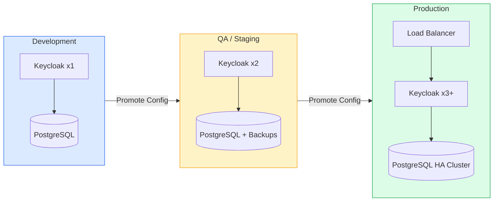
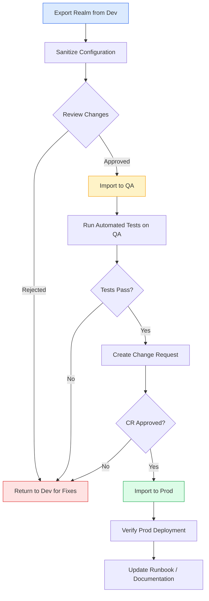
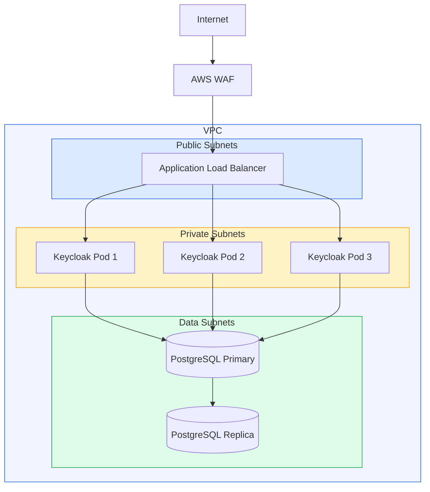

# Environment Management (Dev, QA, Prod)

This document describes the environment management strategy for the enterprise IAM platform built on Keycloak. It covers environment topology, configuration management, promotion workflows, database management, access control, and cost optimization.

For customization details applied across environments, see [Keycloak Customization Guide](./11-keycloak-customization.md).

---

## Table of Contents

1. [Environment Strategy Overview](#environment-strategy-overview)
2. [Environment Comparison](#environment-comparison)
3. [Configuration Management](#configuration-management)
4. [Realm Promotion Workflow](#realm-promotion-workflow)
5. [Database Management](#database-management)
6. [DNS and Networking Per Environment](#dns-and-networking-per-environment)
7. [Access Control Per Environment](#access-control-per-environment)
8. [Environment Provisioning Automation](#environment-provisioning-automation)
9. [Environment Teardown Procedures](#environment-teardown-procedures)
10. [Cost Optimization Strategies](#cost-optimization-strategies)

---

## Environment Strategy Overview

The IAM platform follows a three-environment promotion model: Development, QA (Staging), and Production. Each environment is isolated with its own infrastructure, configuration, and access policies.



**Promotion Principles:**

- Code and configuration flow forward only: Dev -> QA -> Prod.
- Infrastructure is provisioned independently per environment using Terraform.
- Realm configurations are exported, sanitized, and imported across environments.
- Secrets are never promoted; they are managed per-environment via a secrets manager.

---

## Environment Comparison

| Aspect | Dev | QA | Prod |
|--------|-----|-----|------|
| **Keycloak Replicas** | 1 | 2 | 3+ |
| **Database** | Single PostgreSQL instance | Single instance with daily backups | HA cluster (primary + read replicas) |
| **TLS** | Self-signed certificates | Let's Encrypt staging | Let's Encrypt production / CA-signed |
| **Monitoring** | Basic (Prometheus metrics) | Full (Prometheus + Grafana) | Full + alerting (PagerDuty/Opsgenie) |
| **Log Level** | DEBUG | INFO | WARN |
| **CPU Request / Limit** | 500m / 1000m | 1000m / 2000m | 2000m / 4000m |
| **Memory Request / Limit** | 1Gi / 2Gi | 2Gi / 4Gi | 4Gi / 8Gi |
| **Backup Frequency** | None | Daily | Hourly |
| **Backup Retention** | N/A | 7 days | 30 days |
| **Horizontal Pod Autoscaler** | Disabled | Disabled | Enabled (3-10 replicas) |
| **Infinispan Cache** | Embedded | Embedded distributed | External Infinispan cluster |
| **Feature Flags** | All enabled | Production-like | Production only |
| **Data** | Synthetic test data | Sanitized production clone | Real data |
| **Uptime SLA** | Best effort | 99.5% | 99.95% |
| **Change Management** | Direct push | PR + approval | PR + approval + change ticket |

---

## Configuration Management

### Environment-Specific Values Files (Helm)

Each environment has its own Helm values file that overrides the base configuration.

**Directory structure:**

```
helm/
  keycloak/
    Chart.yaml
    values.yaml                  # Base/default values
    values-dev.yaml              # Dev overrides
    values-qa.yaml               # QA overrides
    values-prod.yaml             # Prod overrides
    templates/
      deployment.yaml
      service.yaml
      ingress.yaml
      configmap.yaml
```

**`values.yaml` (base):**

```yaml
replicaCount: 1
image:
  repository: registry.ximplicity.com/iam/keycloak
  tag: "24.0.0"
  pullPolicy: IfNotPresent

keycloak:
  loglevel: INFO
  features: "scripts,token-exchange"
  metricsEnabled: true

resources:
  requests:
    cpu: 500m
    memory: 1Gi
  limits:
    cpu: 1000m
    memory: 2Gi

database:
  vendor: postgres
  host: keycloak-db
  port: 5432
  database: keycloak
```

**`values-dev.yaml`:**

```yaml
replicaCount: 1

keycloak:
  loglevel: DEBUG
  hostname: keycloak.dev.ximplicity.internal

ingress:
  enabled: true
  tls:
    secretName: keycloak-tls-dev
  annotations:
    cert-manager.io/cluster-issuer: selfsigned-issuer

resources:
  requests:
    cpu: 500m
    memory: 1Gi
  limits:
    cpu: 1000m
    memory: 2Gi
```

**`values-qa.yaml`:**

```yaml
replicaCount: 2

keycloak:
  loglevel: INFO
  hostname: keycloak.qa.ximplicity.com

ingress:
  enabled: true
  tls:
    secretName: keycloak-tls-qa
  annotations:
    cert-manager.io/cluster-issuer: letsencrypt-staging

resources:
  requests:
    cpu: 1000m
    memory: 2Gi
  limits:
    cpu: 2000m
    memory: 4Gi
```

**`values-prod.yaml`:**

```yaml
replicaCount: 3

keycloak:
  loglevel: WARN
  hostname: keycloak.ximplicity.com

autoscaling:
  enabled: true
  minReplicas: 3
  maxReplicas: 10
  targetCPUUtilizationPercentage: 70

ingress:
  enabled: true
  tls:
    secretName: keycloak-tls-prod
  annotations:
    cert-manager.io/cluster-issuer: letsencrypt-prod

resources:
  requests:
    cpu: 2000m
    memory: 4Gi
  limits:
    cpu: 4000m
    memory: 8Gi

podDisruptionBudget:
  enabled: true
  minAvailable: 2
```

**Deployment commands:**

```bash
# Deploy to Dev
helm upgrade --install keycloak ./helm/keycloak \
  -f helm/keycloak/values.yaml \
  -f helm/keycloak/values-dev.yaml \
  -n iam-dev --create-namespace

# Deploy to QA
helm upgrade --install keycloak ./helm/keycloak \
  -f helm/keycloak/values.yaml \
  -f helm/keycloak/values-qa.yaml \
  -n iam-qa --create-namespace

# Deploy to Prod
helm upgrade --install keycloak ./helm/keycloak \
  -f helm/keycloak/values.yaml \
  -f helm/keycloak/values-prod.yaml \
  -n iam-prod --create-namespace
```

### Terraform tfvars Per Environment

Infrastructure provisioning uses Terraform with environment-specific variable files.

**Directory structure:**

```
terraform/
  environments/
    dev/
      terraform.tfvars
      backend.tf
    qa/
      terraform.tfvars
      backend.tf
    prod/
      terraform.tfvars
      backend.tf
  modules/
    keycloak-infra/
      main.tf
      variables.tf
      outputs.tf
    database/
      main.tf
      variables.tf
    networking/
      main.tf
      variables.tf
```

**`terraform/environments/dev/terraform.tfvars`:**

```hcl
environment         = "dev"
region              = "us-east-1"
keycloak_replicas   = 1
db_instance_class   = "db.t3.medium"
db_multi_az         = false
db_backup_retention = 0
node_instance_type  = "t3.large"
node_count          = 2
enable_monitoring   = true
enable_alerting     = false
```

**`terraform/environments/prod/terraform.tfvars`:**

```hcl
environment         = "prod"
region              = "us-east-1"
keycloak_replicas   = 3
db_instance_class   = "db.r6g.xlarge"
db_multi_az         = true
db_backup_retention = 30
node_instance_type  = "m6i.xlarge"
node_count          = 6
enable_monitoring   = true
enable_alerting     = true
```

### Keycloak Realm Configuration Per Environment

Certain realm settings vary by environment:

| Setting | Dev | QA | Prod |
|---------|-----|-----|------|
| `bruteForceProtected` | `false` | `true` | `true` |
| `failureFactor` | 30 | 10 | 5 |
| `passwordPolicy` | `length(4)` | `length(8) and upperCase(1)` | `length(12) and upperCase(1) and digit(1) and specialChars(1)` |
| `sslRequired` | `none` | `external` | `all` |
| `accessTokenLifespan` | 3600 (1h) | 600 (10m) | 300 (5m) |
| `ssoSessionIdleTimeout` | 86400 (24h) | 3600 (1h) | 1800 (30m) |
| `registrationAllowed` | `true` | `true` | Per tenant policy |
| `verifyEmail` | `false` | `true` | `true` |
| SMTP server | Mailhog (local) | Staging email service | Production email service |

### Feature Flags Per Environment

| Feature Flag | Dev | QA | Prod |
|-------------|-----|-----|------|
| `scripts` | Enabled | Enabled | Enabled |
| `token-exchange` | Enabled | Enabled | Enabled |
| `admin-fine-grained-authz` | Enabled | Enabled | Enabled |
| `preview` | Enabled | Disabled | Disabled |
| `account3` | Enabled | Enabled | Enabled |
| `docker` | Enabled | Disabled | Disabled |

---

## Realm Promotion Workflow

Realm configurations are promoted across environments through a controlled export-sanitize-import process.



### Step 1: Export from Dev

```bash
# Export realm configuration (without users/secrets)
/opt/keycloak/bin/kc.sh export \
  --dir /tmp/realm-export \
  --realm tenant-master \
  --users skip
```

Or using the Admin REST API:

```bash
curl -X POST \
  "https://keycloak.dev.ximplicity.internal/admin/realms/tenant-master/partial-export?exportClients=true&exportGroupsAndRoles=true" \
  -H "Authorization: Bearer ${DEV_TOKEN}" \
  -o realm-export.json
```

### Step 2: Sanitize (Remove Environment-Specific Values)

The sanitization script removes or replaces values that are environment-specific:

```bash
#!/bin/bash
# scripts/sanitize-realm-export.sh

INPUT_FILE=$1
OUTPUT_FILE=$2

cat "$INPUT_FILE" | jq '
  # Remove environment-specific SMTP settings
  del(.smtpServer) |

  # Remove client secrets (will be set per-environment)
  (.clients // []) |= map(del(.secret)) |

  # Remove environment-specific redirect URIs
  (.clients // []) |= map(
    if .redirectUris then
      .redirectUris = ["PLACEHOLDER_REDIRECT_URI"]
    else . end
  ) |

  # Remove identity provider secrets
  (.identityProviders // []) |= map(
    .config.clientSecret = "PLACEHOLDER"
  ) |

  # Remove user federation config (LDAP passwords, etc.)
  (.components."org.keycloak.storage.UserStorageProvider" // []) |= map(
    .config.bindCredential = ["PLACEHOLDER"]
  ) |

  # Reset environment-specific URLs
  del(.attributes."frontendUrl")
' > "$OUTPUT_FILE"

echo "Sanitized realm exported to $OUTPUT_FILE"
```

### Step 3: Import to Target Environment

```bash
# Apply environment-specific overrides and import
/opt/keycloak/bin/kc.sh import \
  --file /tmp/sanitized-realm.json \
  --override true
```

Or via the Admin REST API with environment-specific patches:

```bash
# Import base configuration
curl -X POST \
  "https://keycloak.qa.ximplicity.com/admin/realms" \
  -H "Authorization: Bearer ${QA_TOKEN}" \
  -H "Content-Type: application/json" \
  -d @sanitized-realm.json

# Apply environment-specific settings
curl -X PUT \
  "https://keycloak.qa.ximplicity.com/admin/realms/tenant-master" \
  -H "Authorization: Bearer ${QA_TOKEN}" \
  -H "Content-Type: application/json" \
  -d '{
    "sslRequired": "external",
    "bruteForceProtected": true,
    "failureFactor": 10,
    "accessTokenLifespan": 600,
    "ssoSessionIdleTimeout": 3600
  }'
```

### Step 4: Validate

Run automated validation checks after import:

```bash
#!/bin/bash
# scripts/validate-realm-import.sh

KEYCLOAK_URL=$1
REALM=$2
TOKEN=$3

echo "Validating realm: $REALM on $KEYCLOAK_URL"

# Check realm exists and is enabled
REALM_STATUS=$(curl -s \
  "$KEYCLOAK_URL/admin/realms/$REALM" \
  -H "Authorization: Bearer $TOKEN" | jq -r '.enabled')

if [ "$REALM_STATUS" != "true" ]; then
  echo "FAIL: Realm is not enabled"
  exit 1
fi

# Check required clients exist
for CLIENT in "webapp" "mobile-app" "service-account"; do
  CLIENT_EXISTS=$(curl -s \
    "$KEYCLOAK_URL/admin/realms/$REALM/clients?clientId=$CLIENT" \
    -H "Authorization: Bearer $TOKEN" | jq 'length')
  if [ "$CLIENT_EXISTS" -eq 0 ]; then
    echo "FAIL: Client $CLIENT not found"
    exit 1
  fi
done

# Check authentication flows
FLOWS=$(curl -s \
  "$KEYCLOAK_URL/admin/realms/$REALM/authentication/flows" \
  -H "Authorization: Bearer $TOKEN" | jq 'length')
if [ "$FLOWS" -lt 1 ]; then
  echo "FAIL: No authentication flows found"
  exit 1
fi

echo "PASS: All validation checks passed"
```

---

## Database Management

### Schema Migration Strategy

Keycloak manages its own database schema using automatic migrations. When a new version of Keycloak starts, it detects the current schema version and applies any pending migrations.

**Key considerations:**

| Concern | Strategy |
|---------|----------|
| Schema upgrades | Automatic via Keycloak on startup |
| Rollback | Restore from backup before upgrade |
| Testing migrations | Test in QA before applying to Prod |
| Blue-green deployments | Not supported for schema changes |
| Custom tables | Use a separate database; never modify Keycloak schema |

**Migration verification:**

```sql
-- Check current schema version
SELECT * FROM databasechangelog ORDER BY dateexecuted DESC LIMIT 10;

-- Verify migration status
SELECT COUNT(*) as pending_changes
FROM databasechangeloglock
WHERE locked = true;
```

### Backup and Restore Procedures

**Automated backup script:**

```bash
#!/bin/bash
# scripts/backup-keycloak-db.sh

ENV=$1  # dev, qa, prod
TIMESTAMP=$(date +%Y%m%d_%H%M%S)
BACKUP_DIR="/backups/keycloak/${ENV}"
RETENTION_DAYS=${2:-30}

mkdir -p "$BACKUP_DIR"

# PostgreSQL backup
PGPASSWORD="${DB_PASSWORD}" pg_dump \
  -h "${DB_HOST}" \
  -U "${DB_USER}" \
  -d keycloak \
  --format=custom \
  --compress=9 \
  --file="${BACKUP_DIR}/keycloak_${ENV}_${TIMESTAMP}.dump"

# Verify backup
if [ $? -eq 0 ]; then
  echo "Backup created: keycloak_${ENV}_${TIMESTAMP}.dump"
  # Upload to S3
  aws s3 cp \
    "${BACKUP_DIR}/keycloak_${ENV}_${TIMESTAMP}.dump" \
    "s3://ximplicity-iam-backups/${ENV}/keycloak_${ENV}_${TIMESTAMP}.dump" \
    --storage-class STANDARD_IA
else
  echo "ERROR: Backup failed"
  exit 1
fi

# Cleanup old backups
find "$BACKUP_DIR" -name "*.dump" -mtime +${RETENTION_DAYS} -delete
```

**Restore procedure:**

```bash
#!/bin/bash
# scripts/restore-keycloak-db.sh

ENV=$1
BACKUP_FILE=$2

echo "WARNING: This will restore the Keycloak database for ${ENV}."
echo "All current data will be overwritten."
read -p "Continue? (yes/no): " CONFIRM

if [ "$CONFIRM" != "yes" ]; then
  echo "Aborted."
  exit 0
fi

# Scale down Keycloak
kubectl scale deployment keycloak --replicas=0 -n "iam-${ENV}"
sleep 10

# Restore database
PGPASSWORD="${DB_PASSWORD}" pg_restore \
  -h "${DB_HOST}" \
  -U "${DB_USER}" \
  -d keycloak \
  --clean \
  --if-exists \
  --no-owner \
  "${BACKUP_FILE}"

# Scale up Keycloak
kubectl scale deployment keycloak --replicas=${REPLICAS} -n "iam-${ENV}"

echo "Restore complete. Keycloak is restarting."
```

### Data Seeding for Dev/QA

Development and QA environments use synthetic data for testing. A seeding script creates test realms, clients, users, and roles.

```bash
#!/bin/bash
# scripts/seed-test-data.sh

KEYCLOAK_URL=$1
ADMIN_TOKEN=$2

# Create test users
for i in $(seq 1 50); do
  curl -s -X POST \
    "$KEYCLOAK_URL/admin/realms/test-realm/users" \
    -H "Authorization: Bearer $ADMIN_TOKEN" \
    -H "Content-Type: application/json" \
    -d "{
      \"username\": \"testuser${i}\",
      \"email\": \"testuser${i}@test.ximplicity.com\",
      \"enabled\": true,
      \"firstName\": \"Test\",
      \"lastName\": \"User${i}\",
      \"credentials\": [{
        \"type\": \"password\",
        \"value\": \"TestPassword123!\",
        \"temporary\": false
      }],
      \"attributes\": {
        \"tenantId\": [\"test-tenant\"],
        \"phoneNumber\": [\"+1555000$(printf '%04d' $i)\"]
      }
    }"
done

echo "Seeded 50 test users"
```

---

## DNS and Networking Per Environment

| Component | Dev | QA | Prod |
|-----------|-----|-----|------|
| **Keycloak URL** | `keycloak.dev.ximplicity.internal` | `keycloak.qa.ximplicity.com` | `keycloak.ximplicity.com` |
| **Admin URL** | `keycloak.dev.ximplicity.internal/admin` | `keycloak.qa.ximplicity.com/admin` | `keycloak.ximplicity.com/admin` (restricted) |
| **DNS Zone** | Private (VPC internal) | Public (restricted CIDR) | Public |
| **Load Balancer** | None (NodePort) | AWS ALB | AWS ALB with WAF |
| **WAF** | Disabled | Disabled | Enabled (OWASP rules) |
| **Network Policy** | Permissive | Restricted | Strict (allowlist only) |
| **Egress** | Unrestricted | Restricted to known endpoints | Strict allowlist |
| **VPN Required** | Yes (for external access) | Yes (for admin access) | Yes (for admin access) |

**Network isolation diagram:**



---

## Access Control Per Environment

### Dev: All Developers

| Access Type | Who | Method |
|-------------|-----|--------|
| Keycloak Admin Console | All developers | SSO via corporate IdP |
| Kubernetes cluster | All developers | `kubectl` via kubeconfig |
| Database (read) | All developers | Port-forward or pgAdmin |
| Database (write) | Senior developers | Port-forward with approval |
| Realm export/import | All developers | Direct |
| Infrastructure (Terraform) | DevOps team | Terraform Cloud |

### QA: Developers + QA Team

| Access Type | Who | Method |
|-------------|-----|--------|
| Keycloak Admin Console | QA team + senior developers | SSO + role-based access |
| Kubernetes cluster | DevOps + senior developers | `kubectl` with restricted RBAC |
| Database (read) | QA team + developers | Read-only connection |
| Database (write) | DevOps only | Approved change scripts |
| Realm export/import | DevOps + tech lead | With PR review |
| Infrastructure (Terraform) | DevOps team | Terraform Cloud with approval |

### Prod: SRE/DevOps Only

| Access Type | Who | Method |
|-------------|-----|--------|
| Keycloak Admin Console | SRE/DevOps on-call | SSO + MFA + VPN + break-glass |
| Kubernetes cluster | SRE/DevOps | `kubectl` with audit logging |
| Database (read) | SRE/DevOps | VPN + read replica only |
| Database (write) | SRE/DevOps (emergency only) | Break-glass procedure |
| Realm export/import | SRE/DevOps | Change ticket required |
| Infrastructure (Terraform) | SRE/DevOps | Terraform Cloud with dual approval |

**Break-glass procedure for production:**

1. Create an incident ticket.
2. Obtain time-limited credentials from the secrets vault.
3. All actions are logged and audited.
4. Credentials are automatically revoked after the TTL.
5. Post-incident review is mandatory.

---

## Environment Provisioning Automation

Environments are provisioned using Terraform with a standardized module structure.

**Provisioning a new environment:**

```bash
#!/bin/bash
# scripts/provision-environment.sh

ENV=$1  # dev, qa, prod
REGION=${2:-us-east-1}

echo "Provisioning environment: $ENV in $REGION"

# 1. Provision infrastructure with Terraform
cd terraform/environments/${ENV}
terraform init \
  -backend-config="key=iam/${ENV}/terraform.tfstate"
terraform plan -var-file=terraform.tfvars -out=tfplan
terraform apply tfplan

# 2. Configure Kubernetes context
aws eks update-kubeconfig \
  --name "iam-${ENV}" \
  --region "$REGION" \
  --alias "iam-${ENV}"

# 3. Create namespace and secrets
kubectl create namespace "iam-${ENV}" --dry-run=client -o yaml | kubectl apply -f -

# 4. Deploy Keycloak via Helm
helm upgrade --install keycloak ./helm/keycloak \
  -f helm/keycloak/values.yaml \
  -f "helm/keycloak/values-${ENV}.yaml" \
  -n "iam-${ENV}"

# 5. Wait for deployment
kubectl rollout status deployment/keycloak -n "iam-${ENV}" --timeout=300s

# 6. Import base realm configuration
if [ "$ENV" != "prod" ]; then
  echo "Seeding test data..."
  bash scripts/seed-test-data.sh \
    "https://keycloak.${ENV}.ximplicity.com" \
    "$ADMIN_TOKEN"
fi

echo "Environment $ENV provisioned successfully."
```

**Terraform module for Keycloak infrastructure:**

```hcl
# terraform/modules/keycloak-infra/main.tf

module "vpc" {
  source  = "terraform-aws-modules/vpc/aws"
  version = "5.5.0"

  name = "iam-${var.environment}"
  cidr = var.vpc_cidr

  azs             = var.availability_zones
  private_subnets = var.private_subnet_cidrs
  public_subnets  = var.public_subnet_cidrs
  database_subnets = var.database_subnet_cidrs

  enable_nat_gateway   = true
  single_nat_gateway   = var.environment == "dev" ? true : false
  enable_dns_hostnames = true

  tags = {
    Environment = var.environment
    Project     = "iam-keycloak"
    ManagedBy   = "terraform"
  }
}

module "eks" {
  source  = "terraform-aws-modules/eks/aws"
  version = "20.8.0"

  cluster_name    = "iam-${var.environment}"
  cluster_version = "1.29"

  vpc_id     = module.vpc.vpc_id
  subnet_ids = module.vpc.private_subnets

  eks_managed_node_groups = {
    keycloak = {
      instance_types = [var.node_instance_type]
      min_size       = var.environment == "prod" ? 3 : 1
      max_size       = var.environment == "prod" ? 10 : var.node_count
      desired_size   = var.node_count
    }
  }

  tags = {
    Environment = var.environment
    Project     = "iam-keycloak"
  }
}

module "rds" {
  source  = "terraform-aws-modules/rds/aws"
  version = "6.5.0"

  identifier = "keycloak-${var.environment}"

  engine               = "postgres"
  engine_version       = "16.2"
  family               = "postgres16"
  major_engine_version = "16"
  instance_class       = var.db_instance_class

  allocated_storage     = var.environment == "prod" ? 100 : 20
  max_allocated_storage = var.environment == "prod" ? 500 : 50

  db_name  = "keycloak"
  username = "keycloak"
  port     = 5432

  multi_az               = var.db_multi_az
  db_subnet_group_name   = module.vpc.database_subnet_group_name
  vpc_security_group_ids = [module.db_security_group.security_group_id]

  backup_retention_period = var.db_backup_retention
  backup_window           = "03:00-04:00"
  maintenance_window      = "Mon:04:00-Mon:05:00"

  deletion_protection = var.environment == "prod" ? true : false

  tags = {
    Environment = var.environment
    Project     = "iam-keycloak"
  }
}
```

---

## Environment Teardown Procedures

Teardown is relevant for dev and QA environments that may be ephemeral or need periodic recreation.

> **Warning:** Production environments should never be torn down without executive approval and a documented migration plan.

```bash
#!/bin/bash
# scripts/teardown-environment.sh

ENV=$1

if [ "$ENV" == "prod" ]; then
  echo "ERROR: Cannot tear down production environment via script."
  echo "Follow the manual teardown procedure with executive approval."
  exit 1
fi

echo "WARNING: This will destroy ALL resources in the ${ENV} environment."
read -p "Type the environment name to confirm: " CONFIRM

if [ "$CONFIRM" != "$ENV" ]; then
  echo "Aborted."
  exit 0
fi

# 1. Create final backup
echo "Creating final backup..."
bash scripts/backup-keycloak-db.sh "$ENV" 365

# 2. Remove Helm releases
echo "Removing Helm releases..."
helm uninstall keycloak -n "iam-${ENV}" || true

# 3. Delete Kubernetes namespace
echo "Deleting Kubernetes namespace..."
kubectl delete namespace "iam-${ENV}" --timeout=120s || true

# 4. Destroy infrastructure
echo "Destroying infrastructure..."
cd "terraform/environments/${ENV}"
terraform destroy -var-file=terraform.tfvars -auto-approve

# 5. Clean up DNS records
echo "Cleaning up DNS records..."
# (environment-specific DNS cleanup)

echo "Environment ${ENV} has been torn down."
echo "Final backup retained for 365 days."
```

---

## Cost Optimization Strategies

### Per-Environment Cost Strategies

| Strategy | Dev | QA | Prod |
|----------|-----|-----|------|
| **Scheduling** | Shut down nights/weekends | Shut down weekends | Always on |
| **Instance type** | Spot/preemptible | On-demand (small) | On-demand (reserved) |
| **Reserved instances** | No | No | Yes (1-year RI) |
| **Database** | Smallest viable | Right-sized | Reserved + auto-scaling |
| **Storage** | gp3 (minimum IOPS) | gp3 | io2 (provisioned IOPS) |
| **Backups** | None | S3 Standard-IA | S3 Standard + Glacier archival |
| **NAT Gateway** | Single | Single | Per-AZ |
| **Monitoring retention** | 7 days | 30 days | 90 days |

### Scheduled Scaling for Non-Production

```yaml
# CronJob to scale down Dev environment at night
apiVersion: batch/v1
kind: CronJob
metadata:
  name: scale-down-keycloak
  namespace: iam-dev
spec:
  schedule: "0 20 * * 1-5"  # 8 PM weekdays
  jobTemplate:
    spec:
      template:
        spec:
          containers:
            - name: kubectl
              image: bitnami/kubectl:latest
              command:
                - kubectl
                - scale
                - deployment/keycloak
                - --replicas=0
                - -n
                - iam-dev
          restartPolicy: OnFailure
---
# CronJob to scale up Dev environment in the morning
apiVersion: batch/v1
kind: CronJob
metadata:
  name: scale-up-keycloak
  namespace: iam-dev
spec:
  schedule: "0 7 * * 1-5"  # 7 AM weekdays
  jobTemplate:
    spec:
      template:
        spec:
          containers:
            - name: kubectl
              image: bitnami/kubectl:latest
              command:
                - kubectl
                - scale
                - deployment/keycloak
                - --replicas=1
                - -n
                - iam-dev
          restartPolicy: OnFailure
```

### Cost Monitoring

Implement tagging and cost allocation:

```hcl
# Required tags for all resources
locals {
  common_tags = {
    Project     = "iam-keycloak"
    Environment = var.environment
    ManagedBy   = "terraform"
    CostCenter  = "engineering-iam"
    Owner       = "iam-team"
  }
}
```

Set up AWS Budget alerts:

```hcl
resource "aws_budgets_budget" "iam_monthly" {
  name         = "iam-${var.environment}-monthly"
  budget_type  = "COST"
  limit_amount = var.environment == "prod" ? "5000" : "1000"
  limit_unit   = "USD"
  time_unit    = "MONTHLY"

  cost_filter {
    name   = "TagKeyValue"
    values = ["user:Project$iam-keycloak", "user:Environment$${var.environment}"]
  }

  notification {
    comparison_operator       = "GREATER_THAN"
    threshold                 = 80
    threshold_type            = "PERCENTAGE"
    notification_type         = "FORECASTED"
    subscriber_email_addresses = ["iam-team@ximplicity.com"]
  }
}
```

### Estimated Monthly Costs

| Component | Dev | QA | Prod |
|-----------|-----|-----|------|
| EKS Cluster | $73 | $73 | $73 |
| EC2 Nodes | $150 | $300 | $1,200 (RI) |
| RDS PostgreSQL | $50 | $100 | $600 (RI + Multi-AZ) |
| Load Balancer | $20 | $20 | $40 |
| NAT Gateway | $35 | $35 | $105 |
| S3 (backups) | $1 | $5 | $30 |
| Monitoring | $10 | $30 | $80 |
| **Estimated Total** | **~$340** | **~$565** | **~$2,130** |

> **Note:** Costs are approximate and vary by region and usage patterns. Apply scheduled scaling for Dev/QA to reduce costs by 40-60%.

---

## Related Documents

- [Keycloak Customization Guide](./11-keycloak-customization.md) -- Theme, SPI, and extension customization
