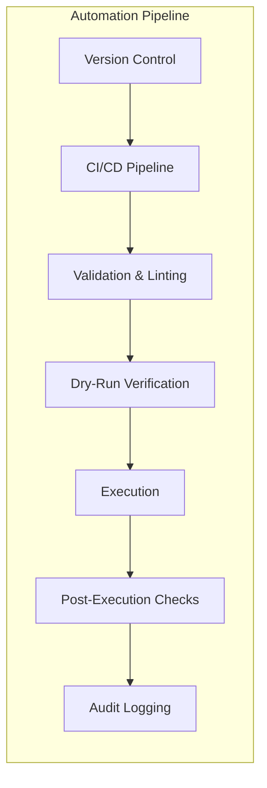
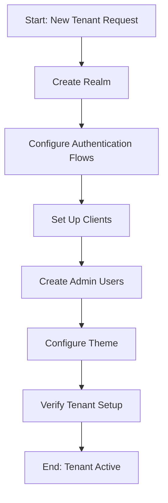
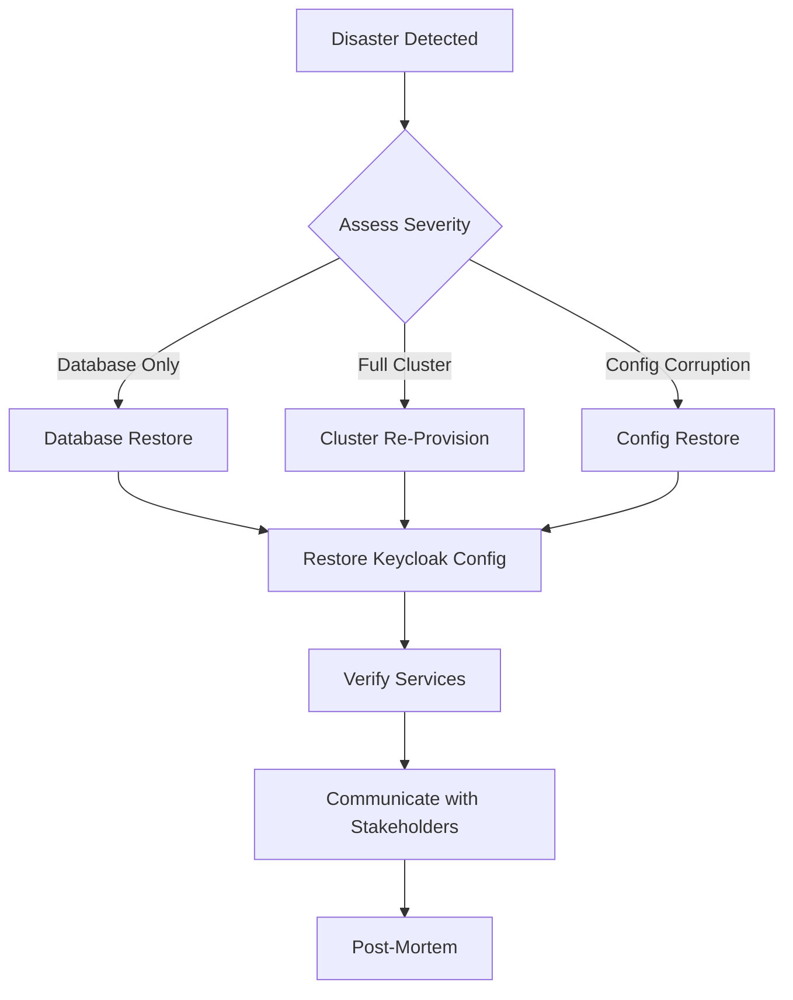
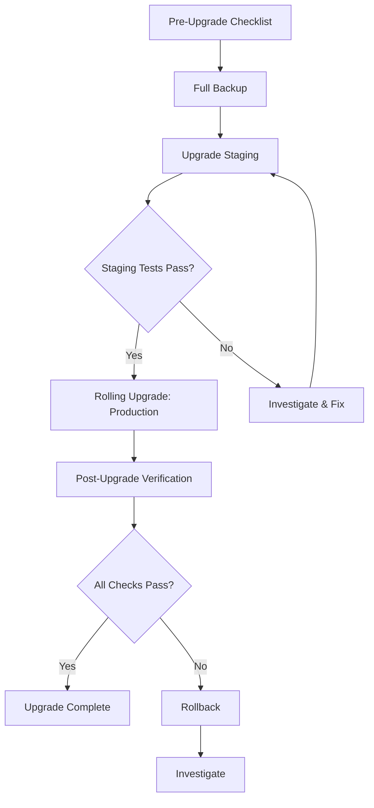
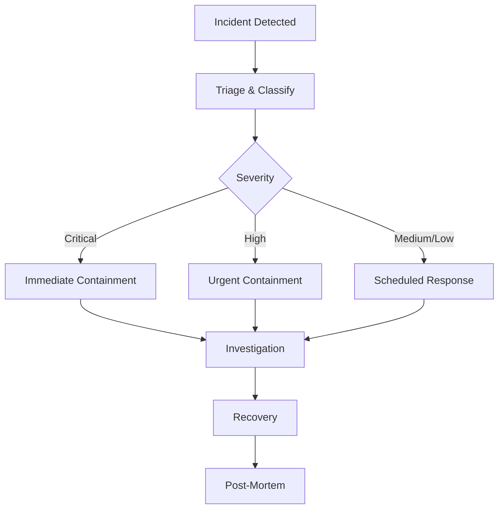

# 13. Automation, Workbooks, and Scripts

## Table of Contents

- [1. Automation Overview and Philosophy](#1-automation-overview-and-philosophy)
- [2. Script Repository Structure](#2-script-repository-structure)
- [3. Operational Workbooks (Runbooks)](#3-operational-workbooks-runbooks)
  - [Workbook 1: Initial Environment Setup](#workbook-1-initial-environment-setup)
  - [Workbook 2: New Tenant Onboarding](#workbook-2-new-tenant-onboarding)
  - [Workbook 3: Disaster Recovery](#workbook-3-disaster-recovery)
  - [Workbook 4: Certificate Rotation](#workbook-4-certificate-rotation)
  - [Workbook 5: Keycloak Upgrade](#workbook-5-keycloak-upgrade)
  - [Workbook 6: Security Incident Response](#workbook-6-security-incident-response)
- [4. Keycloak Admin CLI (kcadm) Reference](#4-keycloak-admin-cli-kcadm-reference)
- [5. Keycloak Admin REST API Examples](#5-keycloak-admin-rest-api-examples)
- [6. Scheduled Automation (Kubernetes CronJobs)](#6-scheduled-automation-kubernetes-cronjobs)

---

## 1. Automation Overview and Philosophy

The IAM platform automation strategy is built on the following core principles:

| Principle | Description |
|---|---|
| **Everything Scriptable** | Every operational task must be executable via script. Manual console-only procedures are not acceptable for production operations. |
| **Idempotent Operations** | All scripts must be safely re-runnable. Executing a script multiple times must produce the same result as executing it once. |
| **Infrastructure as Code** | All infrastructure definitions, Keycloak realm configurations, and deployment manifests are version-controlled. |
| **Fail-Safe Defaults** | Scripts must validate preconditions before executing destructive operations and default to the safest behavior. |
| **Audit Trail** | Every automated action is logged with timestamp, actor, and outcome for compliance and troubleshooting. |
| **Dry-Run Support** | Destructive or high-impact scripts must support a `--dry-run` flag to preview changes without applying them. |



### Script Conventions

All scripts follow these conventions:

- **Language**: Bash (POSIX-compatible) for infrastructure; Python for complex logic.
- **Error Handling**: All scripts use `set -euo pipefail` and trap handlers for cleanup.
- **Logging**: Structured output with `[INFO]`, `[WARN]`, `[ERROR]` prefixes.
- **Configuration**: Environment-specific values are loaded from `.env` files or Kubernetes Secrets -- never hardcoded.
- **Exit Codes**: `0` for success, `1` for general error, `2` for misconfiguration, `3` for dependency failure.

---

## 2. Script Repository Structure

```
scripts/
  infrastructure/
    setup-cluster.sh          # Provision Kubernetes cluster and base infrastructure
    teardown-cluster.sh       # Destroy cluster (with safety prompts)
    rotate-secrets.sh         # Rotate Kubernetes Secrets and Vault entries
  keycloak/
    create-realm.sh           # Create a new realm with default configuration
    export-realm.sh           # Export realm configuration to JSON
    import-realm.sh           # Import realm configuration from JSON
    create-client.sh          # Register a new OIDC/SAML client
    create-user.sh            # Create a user with roles and group membership
    configure-mfa.sh          # Enable and configure MFA policies for a realm
    backup-config.sh          # Full Keycloak configuration backup
  database/
    backup-db.sh              # PostgreSQL logical backup (pg_dump)
    restore-db.sh             # Restore database from backup
    health-check.sh           # Validate database connectivity and replication
  monitoring/
    setup-dashboards.sh       # Deploy Grafana dashboards from JSON definitions
    configure-alerts.sh       # Apply Alertmanager rules and notification channels
  operations/
    health-check-all.sh       # End-to-end health check across all components
    rotate-certificates.sh    # TLS certificate rotation workflow
    scale-cluster.sh          # Horizontal scaling of Keycloak pods
```

### Script Template

Every script in the repository follows a standard template:

```bash
#!/usr/bin/env bash
set -euo pipefail

# ============================================================
# Script:  <script-name>.sh
# Purpose: <one-line description>
# Usage:   ./<script-name>.sh [--dry-run] [--env <environment>]
# ============================================================

SCRIPT_DIR="$(cd "$(dirname "${BASH_SOURCE[0]}")" && pwd)"
source "${SCRIPT_DIR}/../common/logging.sh"
source "${SCRIPT_DIR}/../common/preconditions.sh"

# --- Configuration ---
ENV="${ENV:-dev}"
DRY_RUN="${DRY_RUN:-false}"

# --- Functions ---
usage() {
  echo "Usage: $0 [--dry-run] [--env <dev|staging|prod>]"
  exit 2
}

# --- Main ---
main() {
  log_info "Starting $(basename "$0") for environment: ${ENV}"
  check_preconditions
  # ... script logic ...
  log_info "Completed successfully."
}

main "$@"
```

---

## 3. Operational Workbooks (Runbooks)

Each workbook provides a complete, step-by-step procedure for a specific operational scenario. Workbooks are designed to be followed by on-call engineers with minimal prior context.

### Workbook 1: Initial Environment Setup

**Objective**: Provision a new environment from scratch and verify Keycloak is operational.

**Estimated Duration**: 45--60 minutes

#### Prerequisites Checklist

| Item | Verification Command | Expected Result |
|---|---|---|
| Kubernetes cluster access | `kubectl cluster-info` | Cluster endpoint displayed |
| Helm 3.x installed | `helm version` | Version 3.x confirmed |
| `kubectl` configured | `kubectl get nodes` | Nodes listed with `Ready` status |
| Container registry access | `docker pull <registry>/keycloak:latest` | Image pulled successfully |
| DNS records configured | `nslookup iam.<domain>` | Resolves to load balancer IP |
| TLS certificates available | `ls certs/` | Certificate and key files present |
| Database credentials in Vault | `vault kv get secret/iam/db` | Credentials retrieved |

#### Step-by-Step Cluster Provisioning

**Step 1**: Set environment variables.

```bash
export ENV=staging
export NAMESPACE=iam-${ENV}
export KEYCLOAK_VERSION=26.x
```

**Step 2**: Create the Kubernetes namespace and apply resource quotas.

```bash
kubectl create namespace "${NAMESPACE}" --dry-run=client -o yaml | kubectl apply -f -
kubectl apply -f manifests/resource-quotas/${ENV}.yaml -n "${NAMESPACE}"
```

**Step 3**: Deploy secrets from Vault.

```bash
./scripts/infrastructure/rotate-secrets.sh --env "${ENV}" --initial
```

**Step 4**: Deploy the PostgreSQL database.

```bash
helm upgrade --install iam-db bitnami/postgresql \
  -f helm/values/db-${ENV}.yaml \
  -n "${NAMESPACE}" \
  --wait --timeout 300s
```

**Step 5**: Deploy Keycloak.

```bash
helm upgrade --install keycloak bitnami/keycloak \
  -f helm/values/keycloak-${ENV}.yaml \
  -n "${NAMESPACE}" \
  --wait --timeout 600s
```

#### Keycloak Deployment Verification

```bash
# Verify pods are running
kubectl get pods -n "${NAMESPACE}" -l app=keycloak

# Check Keycloak logs for startup completion
kubectl logs -n "${NAMESPACE}" -l app=keycloak --tail=50 | grep "started in"

# Verify the HTTPS endpoint
curl -s -o /dev/null -w "%{http_code}" https://iam.${ENV}.example.com/health/ready
```

#### Smoke Tests

```bash
./scripts/operations/health-check-all.sh --env "${ENV}"
```

The smoke test script validates:

1. Keycloak admin console is accessible.
2. OpenID Connect discovery endpoint returns valid metadata.
3. Admin user can authenticate and obtain a token.
4. Database connectivity and replication status.
5. Monitoring dashboards are receiving metrics.

---

### Workbook 2: New Tenant Onboarding

**Objective**: Onboard a new tenant (organization) with a dedicated realm, authentication flows, clients, and admin users.

**Estimated Duration**: 20--30 minutes



#### Step 1: Create Realm

```bash
./scripts/keycloak/create-realm.sh \
  --realm "tenant-acme" \
  --display-name "ACME Corporation" \
  --env staging
```

This script creates a realm with:
- Default token lifespans (access: 5 min, refresh: 30 min, SSO session: 10 hours).
- Brute force protection enabled (max 5 failures, lockout 15 minutes).
- Email verification required.
- Internationalization enabled (default locale: `en`).

#### Step 2: Configure Authentication Flows

```bash
# Enable OTP-based MFA for the realm
./scripts/keycloak/configure-mfa.sh \
  --realm "tenant-acme" \
  --mfa-policy "required" \
  --otp-type "totp" \
  --otp-algorithm "SHA256" \
  --otp-digits 6
```

#### Step 3: Set Up Clients

```bash
# Frontend application (Authorization Code + PKCE)
./scripts/keycloak/create-client.sh \
  --realm "tenant-acme" \
  --client-id "acme-web-app" \
  --client-type "public" \
  --redirect-uris "https://app.acme.example.com/*" \
  --web-origins "https://app.acme.example.com" \
  --protocol "openid-connect"

# Backend API (confidential client for token validation)
./scripts/keycloak/create-client.sh \
  --realm "tenant-acme" \
  --client-id "acme-api" \
  --client-type "confidential" \
  --service-account-enabled \
  --protocol "openid-connect"
```

#### Step 4: Create Admin Users

```bash
./scripts/keycloak/create-user.sh \
  --realm "tenant-acme" \
  --username "acme-admin" \
  --email "admin@acme.example.com" \
  --first-name "ACME" \
  --last-name "Administrator" \
  --roles "realm-admin" \
  --temporary-password
```

#### Step 5: Configure Theme

```bash
# Apply tenant-specific branding
kcadm.sh update realms/tenant-acme \
  -s "loginTheme=acme-theme" \
  -s "accountTheme=acme-theme" \
  -s "emailTheme=acme-theme"
```

#### Step 6: Verify Tenant Setup

```bash
# Run tenant verification suite
./scripts/operations/health-check-all.sh --realm "tenant-acme"
```

Verification checklist:

| Check | Command | Expected |
|---|---|---|
| Realm accessible | `curl https://iam.example.com/realms/tenant-acme` | 200 OK with realm metadata |
| OIDC discovery | `curl https://iam.example.com/realms/tenant-acme/.well-known/openid-configuration` | Valid JSON with endpoints |
| Admin login | Authenticate via `kcadm.sh` | Token obtained |
| Client registered | `kcadm.sh get clients -r tenant-acme --fields clientId` | Clients listed |
| MFA configured | Attempt login in browser | OTP prompt displayed |

---

### Workbook 3: Disaster Recovery

**Objective**: Restore the IAM platform from a catastrophic failure, including database loss or complete cluster failure.

**Estimated Duration**: 60--120 minutes (depending on severity)



#### Step 1: Assess the Situation

1. Identify the failure scope: database, Keycloak pods, networking, or full cluster.
2. Check if the issue is transient (e.g., pod restart loop) or permanent (e.g., data loss).
3. Determine the Recovery Point Objective (RPO) -- when was the last successful backup?
4. Record the start time for incident tracking.

```bash
# Gather cluster status
kubectl get nodes
kubectl get pods -n iam-prod --field-selector status.phase!=Running
kubectl get events -n iam-prod --sort-by='.lastTimestamp' | tail -20
```

#### Step 2: Database Restore Procedure

```bash
# List available backups
./scripts/database/backup-db.sh --list --env prod

# Restore from the most recent backup
./scripts/database/restore-db.sh \
  --env prod \
  --backup-file "iam-db-backup-2026-03-07-0200.sql.gz" \
  --confirm
```

Post-restore validation:

```bash
./scripts/database/health-check.sh --env prod --verbose
```

#### Step 3: Keycloak Configuration Restore

```bash
# If realm configuration was corrupted, re-import from backup
./scripts/keycloak/import-realm.sh \
  --env prod \
  --file backups/realm-exports/master-realm-latest.json

./scripts/keycloak/import-realm.sh \
  --env prod \
  --file backups/realm-exports/tenant-acme-latest.json
```

#### Step 4: Verify Services

```bash
./scripts/operations/health-check-all.sh --env prod --verbose
```

| Service | Check | Command |
|---|---|---|
| PostgreSQL | Connectivity and data integrity | `./scripts/database/health-check.sh` |
| Keycloak | Admin console accessible | `curl -s https://iam.example.com/admin/` |
| Keycloak | Token issuance works | Obtain token via OIDC |
| Monitoring | Metrics flowing | Check Grafana dashboards |
| Alerting | Alerts resolved | Check Alertmanager |

#### Step 5: Communicate with Stakeholders

1. Send initial status update to the incident Slack channel.
2. Update the status page with estimated resolution time.
3. Notify tenant administrators if their service was affected.
4. Send final resolution notice when all services are confirmed operational.
5. Schedule a post-mortem meeting within 48 hours.

---

### Workbook 4: Certificate Rotation

**Objective**: Rotate TLS certificates before expiry with zero downtime.

**Estimated Duration**: 30--45 minutes

#### Step 1: Identify Expiring Certificates

```bash
./scripts/operations/rotate-certificates.sh --check --days 30

# Example output:
# [WARN] Certificate iam.example.com expires in 21 days (2026-03-28)
# [INFO] Certificate iam-api.example.com expires in 90 days (OK)
```

#### Step 2: Generate New Certificates

```bash
# Using cert-manager (automatic)
kubectl get certificate -n iam-prod

# Manual generation (if cert-manager is not used)
openssl req -new -newkey rsa:4096 -nodes \
  -keyout iam.example.com.key \
  -out iam.example.com.csr \
  -subj "/CN=iam.example.com/O=ExampleOrg"
```

#### Step 3: Deploy Certificates

```bash
# Update Kubernetes TLS secret
kubectl create secret tls iam-tls \
  --cert=iam.example.com.crt \
  --key=iam.example.com.key \
  -n iam-prod \
  --dry-run=client -o yaml | kubectl apply -f -

# Restart ingress controller to pick up new certificate
kubectl rollout restart deployment ingress-nginx-controller -n ingress-nginx
```

#### Step 4: Verify TLS Termination

```bash
# Verify the new certificate is served
echo | openssl s_client -connect iam.example.com:443 -servername iam.example.com 2>/dev/null \
  | openssl x509 -noout -dates -subject

# Expected: notAfter should reflect the new expiry date
```

#### Step 5: Update Monitoring

```bash
# Verify certificate expiry metrics are updated in Prometheus
curl -s http://prometheus:9090/api/v1/query?query=probe_ssl_earliest_cert_expiry \
  | jq '.data.result[].value[1]'

# Confirm no certificate-related alerts are firing
./scripts/monitoring/configure-alerts.sh --validate
```

---

### Workbook 5: Keycloak Upgrade

**Objective**: Upgrade Keycloak to a new version with minimal downtime using a rolling upgrade strategy.

**Estimated Duration**: 60--90 minutes



#### Pre-Upgrade Checklist

| Item | Status |
|---|---|
| Release notes reviewed for breaking changes | |
| Custom SPIs tested against new version | |
| Custom themes tested against new version | |
| Database migration notes reviewed | |
| Staging environment upgraded and validated | |
| Maintenance window communicated to stakeholders | |
| Rollback procedure reviewed by team | |
| On-call engineer confirmed and available | |

#### Backup Procedure

```bash
# Full database backup
./scripts/database/backup-db.sh --env prod --label "pre-upgrade-26.x"

# Export all realm configurations
./scripts/keycloak/backup-config.sh --env prod --output backups/pre-upgrade/

# Backup Helm values
helm get values keycloak -n iam-prod > backups/pre-upgrade/helm-values.yaml
```

#### Rolling Upgrade Steps

```bash
# 1. Update the Helm chart values with the new Keycloak version
sed -i "s/tag: .*/tag: 26.1.0/" helm/values/keycloak-prod.yaml

# 2. Perform rolling upgrade
helm upgrade keycloak bitnami/keycloak \
  -f helm/values/keycloak-prod.yaml \
  -n iam-prod \
  --wait --timeout 900s

# 3. Monitor the rollout
kubectl rollout status statefulset/keycloak -n iam-prod --timeout=600s
```

#### Post-Upgrade Verification

```bash
# Verify Keycloak version
curl -s https://iam.example.com/admin/serverinfo | jq '.systemInfo.version'

# Run full health check suite
./scripts/operations/health-check-all.sh --env prod --verbose

# Verify authentication flows work
./scripts/keycloak/create-user.sh --realm master --username upgrade-test --temporary-password --delete-after-test
```

#### Rollback Procedure

If critical issues are detected after upgrade:

```bash
# 1. Rollback Helm release
helm rollback keycloak -n iam-prod

# 2. If database migration occurred, restore from backup
./scripts/database/restore-db.sh \
  --env prod \
  --backup-file "iam-db-backup-pre-upgrade-26.x.sql.gz" \
  --confirm

# 3. Verify rollback
./scripts/operations/health-check-all.sh --env prod
```

---

### Workbook 6: Security Incident Response

**Objective**: Respond to a security incident involving the IAM platform (e.g., compromised credentials, unauthorized access, brute force attacks).

**Estimated Duration**: Variable (2--8 hours depending on severity)



#### Step 1: Detection and Triage

| Severity | Criteria | Response Time |
|---|---|---|
| **Critical** | Active data exfiltration, admin account compromised, mass credential leak | Immediate (< 15 min) |
| **High** | Brute force attack in progress, unauthorized client registration, privilege escalation | < 1 hour |
| **Medium** | Suspicious login patterns, failed MFA bypass attempts | < 4 hours |
| **Low** | Single account lockout, minor policy violation | Next business day |

#### Step 2: Containment

**Force logout all sessions in a realm:**

```bash
# Invalidate all sessions for a specific realm
kcadm.sh create realms/tenant-acme/logout-all

# Disable a specific compromised user account
kcadm.sh update users/<USER_ID> -r tenant-acme -s enabled=false

# Revoke all tokens for a specific client
kcadm.sh create realms/tenant-acme/clients/<CLIENT_ID>/revoke
```

**Disable compromised client credentials:**

```bash
# Regenerate client secret (invalidates old secret immediately)
kcadm.sh create realms/tenant-acme/clients/<CLIENT_ID>/client-secret
```

**Block suspicious IP addresses (at ingress level):**

```bash
kubectl annotate ingress keycloak-ingress -n iam-prod \
  nginx.ingress.kubernetes.io/configuration-snippet="deny <SUSPICIOUS_IP>;"
```

#### Step 3: Investigation (Audit Logs)

```bash
# Query Keycloak admin events
kcadm.sh get admin-events -r tenant-acme \
  --offset 0 --limit 100 \
  -q "dateFrom=2026-03-07T00:00:00Z" \
  -q "operationType=CREATE,UPDATE,DELETE"

# Query user login events
kcadm.sh get events -r tenant-acme \
  --offset 0 --limit 100 \
  -q "dateFrom=2026-03-07T00:00:00Z" \
  -q "type=LOGIN_ERROR,LOGIN"

# Export full audit log for forensic analysis
./scripts/keycloak/export-realm.sh \
  --realm tenant-acme \
  --include-events \
  --output incident-$(date +%Y%m%d)/
```

#### Step 4: Recovery

1. Reset credentials for all affected users.
2. Re-enable accounts after verification.
3. Rotate all client secrets for affected clients.
4. Update firewall rules if IP-based blocking was applied.
5. Verify authentication flows are operating normally.

```bash
# Force password reset for affected users
kcadm.sh update users/<USER_ID> -r tenant-acme \
  -s 'requiredActions=["UPDATE_PASSWORD"]'

# Re-enable user after investigation
kcadm.sh update users/<USER_ID> -r tenant-acme -s enabled=true
```

#### Step 5: Post-Mortem

Post-mortem document must include:

1. **Timeline**: Minute-by-minute account of events.
2. **Root Cause**: What vulnerability or misconfiguration was exploited.
3. **Impact Assessment**: Number of affected users, data exposure scope.
4. **Remediation Actions**: What was done to resolve the incident.
5. **Preventive Measures**: Changes to prevent recurrence (policy, configuration, monitoring).
6. **Action Items**: Assigned tasks with owners and deadlines.

---

## 4. Keycloak Admin CLI (kcadm) Reference

The Keycloak Admin CLI (`kcadm.sh` / `kcadm.bat`) provides a command-line interface for managing Keycloak. All examples below assume the CLI is available in the system PATH.

### Authentication

```bash
# Authenticate with username/password
kcadm.sh config credentials \
  --server https://iam.example.com \
  --realm master \
  --user admin \
  --password "${KEYCLOAK_ADMIN_PASSWORD}"

# Authenticate with a service account (client credentials)
kcadm.sh config credentials \
  --server https://iam.example.com \
  --realm master \
  --client admin-cli \
  --secret "${ADMIN_CLI_SECRET}"
```

### Realm Operations

```bash
# Create a realm
kcadm.sh create realms -s realm=tenant-acme -s enabled=true

# List all realms
kcadm.sh get realms --fields realm,enabled

# Update realm settings
kcadm.sh update realms/tenant-acme \
  -s "sslRequired=external" \
  -s "bruteForceProtected=true" \
  -s "maxFailureWaitSeconds=900" \
  -s "failureFactor=5"

# Export realm configuration
kcadm.sh get realms/tenant-acme > tenant-acme-realm.json

# Delete a realm (use with extreme caution)
kcadm.sh delete realms/tenant-acme
```

### User Operations

```bash
# Create a user
kcadm.sh create users -r tenant-acme \
  -s username=jdoe \
  -s email=jdoe@acme.example.com \
  -s firstName=John \
  -s lastName=Doe \
  -s enabled=true

# Set a password
kcadm.sh set-password -r tenant-acme \
  --username jdoe \
  --new-password "TempPass123!" \
  --temporary

# Search for users
kcadm.sh get users -r tenant-acme -q username=jdoe

# Get user by ID
kcadm.sh get users/<USER_ID> -r tenant-acme

# Update user attributes
kcadm.sh update users/<USER_ID> -r tenant-acme \
  -s 'attributes.department=["Engineering"]'

# Delete a user
kcadm.sh delete users/<USER_ID> -r tenant-acme

# List user sessions
kcadm.sh get users/<USER_ID>/sessions -r tenant-acme

# Logout a user (invalidate all sessions)
kcadm.sh create users/<USER_ID>/logout -r tenant-acme
```

### Client Operations

```bash
# Create a public client (SPA)
kcadm.sh create clients -r tenant-acme \
  -s clientId=acme-spa \
  -s publicClient=true \
  -s 'redirectUris=["https://app.acme.example.com/*"]' \
  -s 'webOrigins=["https://app.acme.example.com"]' \
  -s directAccessGrantsEnabled=false

# Create a confidential client
kcadm.sh create clients -r tenant-acme \
  -s clientId=acme-api \
  -s publicClient=false \
  -s serviceAccountsEnabled=true \
  -s 'redirectUris=["https://api.acme.example.com/*"]'

# Get client secret
kcadm.sh get clients/<CLIENT_ID>/client-secret -r tenant-acme

# Regenerate client secret
kcadm.sh create clients/<CLIENT_ID>/client-secret -r tenant-acme

# List all clients
kcadm.sh get clients -r tenant-acme --fields id,clientId,enabled

# Add a protocol mapper to a client
kcadm.sh create clients/<CLIENT_ID>/protocol-mappers/models -r tenant-acme \
  -s name=department-mapper \
  -s protocol=openid-connect \
  -s protocolMapper=oidc-usermodel-attribute-mapper \
  -s 'config."claim.name"=department' \
  -s 'config."user.attribute"=department' \
  -s 'config."id.token.claim"=true' \
  -s 'config."access.token.claim"=true'
```

### Role Operations

```bash
# Create a realm role
kcadm.sh create roles -r tenant-acme -s name=app-admin -s description="Application Administrator"

# List realm roles
kcadm.sh get roles -r tenant-acme

# Assign a realm role to a user
kcadm.sh add-roles -r tenant-acme --uusername jdoe --rolename app-admin

# Create a client role
kcadm.sh create clients/<CLIENT_ID>/roles -r tenant-acme -s name=editor

# Assign a client role to a user
kcadm.sh add-roles -r tenant-acme --uusername jdoe \
  --cclientid acme-api --rolename editor

# Create a composite role
kcadm.sh add-roles -r tenant-acme --rname app-admin \
  --cclientid acme-api --rolename editor
```

---

## 5. Keycloak Admin REST API Examples

All examples use `curl` and assume the Keycloak server is available at `https://iam.example.com`.

### Get Admin Token

```bash
# Obtain an admin access token
ACCESS_TOKEN=$(curl -s -X POST \
  "https://iam.example.com/realms/master/protocol/openid-connect/token" \
  -H "Content-Type: application/x-www-form-urlencoded" \
  -d "grant_type=client_credentials" \
  -d "client_id=admin-cli" \
  -d "client_secret=${ADMIN_CLI_SECRET}" \
  | jq -r '.access_token')

echo "Token obtained: ${ACCESS_TOKEN:0:20}..."
```

### Realm CRUD Operations

```bash
# Create a realm
curl -s -X POST "https://iam.example.com/admin/realms" \
  -H "Authorization: Bearer ${ACCESS_TOKEN}" \
  -H "Content-Type: application/json" \
  -d '{
    "realm": "tenant-beta",
    "enabled": true,
    "sslRequired": "external",
    "bruteForceProtected": true,
    "failureFactor": 5
  }'

# Get realm details
curl -s "https://iam.example.com/admin/realms/tenant-beta" \
  -H "Authorization: Bearer ${ACCESS_TOKEN}" | jq .

# Update a realm
curl -s -X PUT "https://iam.example.com/admin/realms/tenant-beta" \
  -H "Authorization: Bearer ${ACCESS_TOKEN}" \
  -H "Content-Type: application/json" \
  -d '{
    "loginWithEmailAllowed": true,
    "duplicateEmailsAllowed": false,
    "verifyEmail": true
  }'

# Delete a realm
curl -s -X DELETE "https://iam.example.com/admin/realms/tenant-beta" \
  -H "Authorization: Bearer ${ACCESS_TOKEN}"
```

### Client CRUD Operations

```bash
# Create a client
curl -s -X POST "https://iam.example.com/admin/realms/tenant-acme/clients" \
  -H "Authorization: Bearer ${ACCESS_TOKEN}" \
  -H "Content-Type: application/json" \
  -d '{
    "clientId": "acme-mobile",
    "publicClient": true,
    "directAccessGrantsEnabled": false,
    "standardFlowEnabled": true,
    "redirectUris": ["com.acme.mobile:/callback"],
    "attributes": {
      "pkce.code.challenge.method": "S256"
    }
  }'

# List clients
curl -s "https://iam.example.com/admin/realms/tenant-acme/clients" \
  -H "Authorization: Bearer ${ACCESS_TOKEN}" | jq '.[].clientId'

# Get client by clientId
CLIENT_UUID=$(curl -s "https://iam.example.com/admin/realms/tenant-acme/clients?clientId=acme-mobile" \
  -H "Authorization: Bearer ${ACCESS_TOKEN}" | jq -r '.[0].id')
```

### User CRUD Operations

```bash
# Create a user
curl -s -X POST "https://iam.example.com/admin/realms/tenant-acme/users" \
  -H "Authorization: Bearer ${ACCESS_TOKEN}" \
  -H "Content-Type: application/json" \
  -d '{
    "username": "jane.smith",
    "email": "jane.smith@acme.example.com",
    "firstName": "Jane",
    "lastName": "Smith",
    "enabled": true,
    "emailVerified": true,
    "credentials": [{
      "type": "password",
      "value": "TempPass456!",
      "temporary": true
    }]
  }'

# Search users
curl -s "https://iam.example.com/admin/realms/tenant-acme/users?search=jane" \
  -H "Authorization: Bearer ${ACCESS_TOKEN}" | jq .

# Get user count
curl -s "https://iam.example.com/admin/realms/tenant-acme/users/count" \
  -H "Authorization: Bearer ${ACCESS_TOKEN}"
```

### Bulk Operations

```bash
# Bulk create users from a JSON file
while IFS= read -r user; do
  curl -s -X POST "https://iam.example.com/admin/realms/tenant-acme/users" \
    -H "Authorization: Bearer ${ACCESS_TOKEN}" \
    -H "Content-Type: application/json" \
    -d "${user}"
  sleep 0.1  # Rate limiting
done < <(jq -c '.[]' users-bulk.json)

# Bulk disable inactive users (last login > 90 days)
THRESHOLD=$(date -d "-90 days" +%s)000
INACTIVE_USERS=$(curl -s "https://iam.example.com/admin/realms/tenant-acme/users?max=500" \
  -H "Authorization: Bearer ${ACCESS_TOKEN}" | jq -r ".[] | select(.attributes.lastLogin[0] < \"${THRESHOLD}\") | .id")

for user_id in ${INACTIVE_USERS}; do
  curl -s -X PUT "https://iam.example.com/admin/realms/tenant-acme/users/${user_id}" \
    -H "Authorization: Bearer ${ACCESS_TOKEN}" \
    -H "Content-Type: application/json" \
    -d '{"enabled": false}'
  echo "[INFO] Disabled user: ${user_id}"
done
```

---

## 6. Scheduled Automation (Kubernetes CronJobs)

The following CronJobs automate recurring operational tasks in the Kubernetes cluster.

### Database Backup

```yaml
apiVersion: batch/v1
kind: CronJob
metadata:
  name: iam-db-backup
  namespace: iam-prod
spec:
  schedule: "0 2 * * *"  # Daily at 02:00 UTC
  concurrencyPolicy: Forbid
  successfulJobsHistoryLimit: 7
  failedJobsHistoryLimit: 3
  jobTemplate:
    spec:
      backoffLimit: 2
      template:
        spec:
          restartPolicy: OnFailure
          containers:
            - name: db-backup
              image: registry.example.com/iam-tools:latest
              command:
                - /scripts/database/backup-db.sh
              args:
                - "--env"
                - "prod"
                - "--upload-to-s3"
                - "--retention-days"
                - "30"
              envFrom:
                - secretRef:
                    name: iam-db-credentials
                - secretRef:
                    name: iam-s3-credentials
              resources:
                requests:
                  memory: "256Mi"
                  cpu: "100m"
                limits:
                  memory: "512Mi"
                  cpu: "500m"
```

### Certificate Renewal Check

```yaml
apiVersion: batch/v1
kind: CronJob
metadata:
  name: iam-cert-check
  namespace: iam-prod
spec:
  schedule: "0 8 * * 1"  # Weekly on Monday at 08:00 UTC
  concurrencyPolicy: Forbid
  jobTemplate:
    spec:
      template:
        spec:
          restartPolicy: OnFailure
          containers:
            - name: cert-check
              image: registry.example.com/iam-tools:latest
              command:
                - /scripts/operations/rotate-certificates.sh
              args:
                - "--check"
                - "--days"
                - "30"
                - "--notify-slack"
              envFrom:
                - secretRef:
                    name: iam-slack-webhook
```

### Inactive User Cleanup

```yaml
apiVersion: batch/v1
kind: CronJob
metadata:
  name: iam-inactive-user-cleanup
  namespace: iam-prod
spec:
  schedule: "0 4 1 * *"  # Monthly on the 1st at 04:00 UTC
  concurrencyPolicy: Forbid
  jobTemplate:
    spec:
      template:
        spec:
          restartPolicy: OnFailure
          containers:
            - name: user-cleanup
              image: registry.example.com/iam-tools:latest
              command:
                - /bin/bash
                - -c
                - |
                  #!/usr/bin/env bash
                  set -euo pipefail

                  # Authenticate to Keycloak
                  ACCESS_TOKEN=$(curl -s -X POST \
                    "${KEYCLOAK_URL}/realms/master/protocol/openid-connect/token" \
                    -d "grant_type=client_credentials" \
                    -d "client_id=${CLIENT_ID}" \
                    -d "client_secret=${CLIENT_SECRET}" \
                    | jq -r '.access_token')

                  # Find users inactive for 90+ days
                  THRESHOLD=$(date -d "-90 days" +%s)000

                  for REALM in $(curl -s "${KEYCLOAK_URL}/admin/realms" \
                    -H "Authorization: Bearer ${ACCESS_TOKEN}" \
                    | jq -r '.[].realm'); do

                    echo "[INFO] Processing realm: ${REALM}"

                    USERS=$(curl -s "${KEYCLOAK_URL}/admin/realms/${REALM}/users?max=1000" \
                      -H "Authorization: Bearer ${ACCESS_TOKEN}")

                    echo "${USERS}" | jq -c '.[]' | while read -r user; do
                      USER_ID=$(echo "${user}" | jq -r '.id')
                      SESSIONS=$(curl -s "${KEYCLOAK_URL}/admin/realms/${REALM}/users/${USER_ID}/sessions" \
                        -H "Authorization: Bearer ${ACCESS_TOKEN}")

                      if [ "$(echo "${SESSIONS}" | jq 'length')" -eq 0 ]; then
                        echo "[INFO] Disabling inactive user: ${USER_ID} in realm: ${REALM}"
                        curl -s -X PUT "${KEYCLOAK_URL}/admin/realms/${REALM}/users/${USER_ID}" \
                          -H "Authorization: Bearer ${ACCESS_TOKEN}" \
                          -H "Content-Type: application/json" \
                          -d '{"enabled": false}'
                      fi
                    done
                  done

                  echo "[INFO] Inactive user cleanup completed."
              envFrom:
                - secretRef:
                    name: iam-admin-credentials
              env:
                - name: KEYCLOAK_URL
                  value: "https://iam.example.com"
```

### Metric Aggregation

```yaml
apiVersion: batch/v1
kind: CronJob
metadata:
  name: iam-metric-aggregation
  namespace: iam-prod
spec:
  schedule: "*/15 * * * *"  # Every 15 minutes
  concurrencyPolicy: Forbid
  jobTemplate:
    spec:
      template:
        spec:
          restartPolicy: OnFailure
          containers:
            - name: metric-aggregator
              image: registry.example.com/iam-tools:latest
              command:
                - /bin/bash
                - -c
                - |
                  #!/usr/bin/env bash
                  set -euo pipefail

                  ACCESS_TOKEN=$(curl -s -X POST \
                    "${KEYCLOAK_URL}/realms/master/protocol/openid-connect/token" \
                    -d "grant_type=client_credentials" \
                    -d "client_id=${CLIENT_ID}" \
                    -d "client_secret=${CLIENT_SECRET}" \
                    | jq -r '.access_token')

                  for REALM in $(curl -s "${KEYCLOAK_URL}/admin/realms" \
                    -H "Authorization: Bearer ${ACCESS_TOKEN}" \
                    | jq -r '.[].realm'); do

                    USER_COUNT=$(curl -s "${KEYCLOAK_URL}/admin/realms/${REALM}/users/count" \
                      -H "Authorization: Bearer ${ACCESS_TOKEN}")

                    SESSION_COUNT=$(curl -s "${KEYCLOAK_URL}/admin/realms/${REALM}/client-session-stats" \
                      -H "Authorization: Bearer ${ACCESS_TOKEN}" \
                      | jq '[.[].active // 0] | add // 0')

                    CLIENT_COUNT=$(curl -s "${KEYCLOAK_URL}/admin/realms/${REALM}/clients" \
                      -H "Authorization: Bearer ${ACCESS_TOKEN}" \
                      | jq 'length')

                    # Push metrics to Prometheus Pushgateway
                    cat <<EOF | curl -s --data-binary @- \
                      "http://prometheus-pushgateway:9091/metrics/job/iam-aggregator/realm/${REALM}"
                  iam_realm_user_count ${USER_COUNT}
                  iam_realm_active_sessions ${SESSION_COUNT}
                  iam_realm_client_count ${CLIENT_COUNT}
                  EOF

                    echo "[INFO] Pushed metrics for realm: ${REALM} (users=${USER_COUNT}, sessions=${SESSION_COUNT}, clients=${CLIENT_COUNT})"
                  done
              envFrom:
                - secretRef:
                    name: iam-admin-credentials
              env:
                - name: KEYCLOAK_URL
                  value: "https://iam.example.com"
```

### CronJob Summary

| CronJob | Schedule | Purpose | Retention/Notes |
|---|---|---|---|
| `iam-db-backup` | Daily 02:00 UTC | PostgreSQL logical backup to S3 | 30-day retention |
| `iam-cert-check` | Weekly Monday 08:00 UTC | Check certificate expiry, notify via Slack | Alert if < 30 days to expiry |
| `iam-inactive-user-cleanup` | Monthly 1st 04:00 UTC | Disable users with no sessions in 90+ days | Disables only, does not delete |
| `iam-metric-aggregation` | Every 15 minutes | Aggregate per-realm metrics to Prometheus | Pushes to Pushgateway |

---

## Related Documents

- [Target Architecture](./01-target-architecture.md)
- [Infrastructure as Code](./05-infrastructure-as-code.md)
- [Observability](./10-observability.md)
- [Environment Management](./12-environment-management.md)
- [Security by Design](./07-security-by-design.md)
- [Client Applications](./14-client-applications.md)
