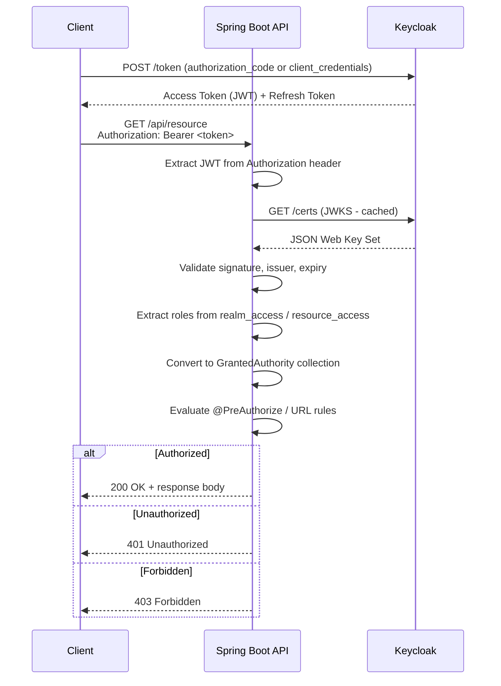
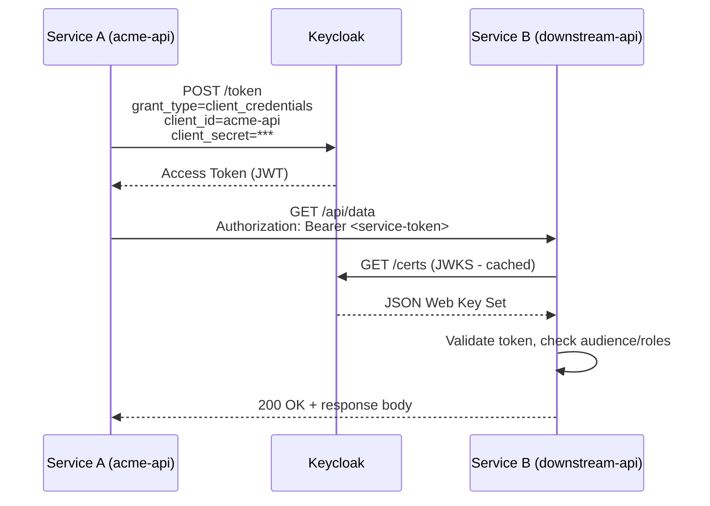
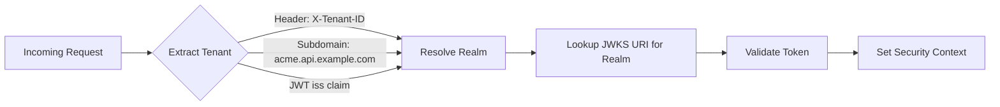

# 14-01. Java 17 / Spring Boot 3.4 Integration Guide

> **Project:** Enterprise IAM Platform based on Keycloak
> **Parent document:** [Client Applications Hub](14-client-applications.md)
> **Related documents:** [Authentication and Authorization](08-authentication-authorization.md) | [Observability](10-observability.md) | [Security by Design](07-security-by-design.md)

---

## Table of Contents

1. [Prerequisites](#1-prerequisites)
2. [Project Setup](#2-project-setup)
3. [Application Configuration](#3-application-configuration)
4. [SecurityFilterChain Configuration](#4-securityfilterchain-configuration)
5. [JWT Role Extraction (realm_access and resource_access)](#5-jwt-role-extraction-realm_access-and-resource_access)
6. [Custom JwtDecoder for Custom Claims](#6-custom-jwtdecoder-for-custom-claims)
7. [Role-Based Method Security](#7-role-based-method-security)
8. [Example REST Controller](#8-example-rest-controller)
9. [Token Relay for Service-to-Service Calls](#9-token-relay-for-service-to-service-calls)
10. [Multi-Tenant Support](#10-multi-tenant-support)
11. [OpenTelemetry Instrumentation](#11-opentelemetry-instrumentation)
12. [Testing](#12-testing)
13. [Docker Compose for Local Development](#13-docker-compose-for-local-development)
14. [Recommended Project Structure](#14-recommended-project-structure)

---

## 1. Prerequisites

| Requirement | Minimum Version | Recommended Version |
|---|---|---|
| Java Development Kit | 17 | 21 (LTS) |
| Spring Boot | 3.2.0 | 3.4.x |
| Spring Security | 6.2.0 | 6.4.x |
| Keycloak Server | 25.x | 26.x |
| Gradle | 8.5 | 8.12+ |
| Maven | 3.9.0 | 3.9.9+ |
| Docker / Docker Compose | 24.x | 27.x |

Before beginning integration, ensure you have:

- A running Keycloak instance (local or remote) with at least one realm configured.
- A confidential client registered in Keycloak (e.g., `acme-api`) with the appropriate roles and mappers.
- The realm's issuer URI (e.g., `https://iam.example.com/realms/tenant-acme`).

---

## 2. Project Setup

### 2.1 Gradle Kotlin DSL (build.gradle.kts)

```kotlin
plugins {
    java
    id("org.springframework.boot") version "3.4.1"
    id("io.spring.dependency-management") version "1.1.7"
}

group = "com.example"
version = "1.0.0"

java {
    toolchain {
        languageVersion = JavaLanguageVersion.of(17)
    }
}

repositories {
    mavenCentral()
}

dependencies {
    // Spring Boot starters
    implementation("org.springframework.boot:spring-boot-starter-web")
    implementation("org.springframework.boot:spring-boot-starter-security")
    implementation("org.springframework.boot:spring-boot-starter-oauth2-resource-server")
    implementation("org.springframework.boot:spring-boot-starter-oauth2-client")

    // OpenTelemetry (optional, see Section 11)
    implementation("io.opentelemetry.instrumentation:opentelemetry-spring-boot-starter:2.11.0")
    implementation("io.micrometer:micrometer-registry-otlp:1.14.3")

    // Testing
    testImplementation("org.springframework.boot:spring-boot-starter-test")
    testImplementation("org.springframework.security:spring-security-test")
    testImplementation("org.testcontainers:junit-jupiter:1.20.4")
    testImplementation("com.github.dasniko:testcontainers-keycloak:3.5.1")
}

tasks.withType<Test> {
    useJUnitPlatform()
}
```

### 2.2 Maven (pom.xml)

```xml
<?xml version="1.0" encoding="UTF-8"?>
<project xmlns="http://maven.apache.org/POM/4.0.0"
         xmlns:xsi="http://www.w3.org/2001/XMLSchema-instance"
         xsi:schemaLocation="http://maven.apache.org/POM/4.0.0
         https://maven.apache.org/xsd/maven-4.0.0.xsd">
    <modelVersion>4.0.0</modelVersion>

    <parent>
        <groupId>org.springframework.boot</groupId>
        <artifactId>spring-boot-starter-parent</artifactId>
        <version>3.4.1</version>
        <relativePath/>
    </parent>

    <groupId>com.example</groupId>
    <artifactId>keycloak-integration</artifactId>
    <version>1.0.0</version>

    <properties>
        <java.version>17</java.version>
        <testcontainers.version>1.20.4</testcontainers.version>
        <otel.version>2.11.0</otel.version>
    </properties>

    <dependencies>
        <!-- Spring Boot Starters -->
        <dependency>
            <groupId>org.springframework.boot</groupId>
            <artifactId>spring-boot-starter-web</artifactId>
        </dependency>
        <dependency>
            <groupId>org.springframework.boot</groupId>
            <artifactId>spring-boot-starter-security</artifactId>
        </dependency>
        <dependency>
            <groupId>org.springframework.boot</groupId>
            <artifactId>spring-boot-starter-oauth2-resource-server</artifactId>
        </dependency>
        <dependency>
            <groupId>org.springframework.boot</groupId>
            <artifactId>spring-boot-starter-oauth2-client</artifactId>
        </dependency>

        <!-- OpenTelemetry (optional) -->
        <dependency>
            <groupId>io.opentelemetry.instrumentation</groupId>
            <artifactId>opentelemetry-spring-boot-starter</artifactId>
            <version>${otel.version}</version>
        </dependency>

        <!-- Testing -->
        <dependency>
            <groupId>org.springframework.boot</groupId>
            <artifactId>spring-boot-starter-test</artifactId>
            <scope>test</scope>
        </dependency>
        <dependency>
            <groupId>org.springframework.security</groupId>
            <artifactId>spring-security-test</artifactId>
            <scope>test</scope>
        </dependency>
        <dependency>
            <groupId>org.testcontainers</groupId>
            <artifactId>junit-jupiter</artifactId>
            <version>${testcontainers.version}</version>
            <scope>test</scope>
        </dependency>
        <dependency>
            <groupId>com.github.dasniko</groupId>
            <artifactId>testcontainers-keycloak</artifactId>
            <version>3.5.1</version>
            <scope>test</scope>
        </dependency>
    </dependencies>

    <build>
        <plugins>
            <plugin>
                <groupId>org.springframework.boot</groupId>
                <artifactId>spring-boot-maven-plugin</artifactId>
            </plugin>
        </plugins>
    </build>
</project>
```

---

## 3. Application Configuration

### 3.1 application.yml

```yaml
server:
  port: 8081

spring:
  application:
    name: acme-api

  security:
    oauth2:
      resourceserver:
        jwt:
          issuer-uri: ${KEYCLOAK_ISSUER_URI:https://iam.example.com/realms/tenant-acme}
          jwk-set-uri: ${KEYCLOAK_JWK_SET_URI:https://iam.example.com/realms/tenant-acme/protocol/openid-connect/certs}

      client:
        registration:
          keycloak:
            client-id: ${KEYCLOAK_CLIENT_ID:acme-api}
            client-secret: ${KEYCLOAK_CLIENT_SECRET}
            authorization-grant-type: client_credentials
            scope: openid
        provider:
          keycloak:
            issuer-uri: ${KEYCLOAK_ISSUER_URI:https://iam.example.com/realms/tenant-acme}

# Application-specific settings
app:
  keycloak:
    client-id: ${KEYCLOAK_CLIENT_ID:acme-api}
    # Comma-separated list of allowed issuers for multi-tenant setups
    allowed-issuers: ${KEYCLOAK_ALLOWED_ISSUERS:https://iam.example.com/realms/tenant-acme}

logging:
  level:
    org.springframework.security: INFO
    org.springframework.security.oauth2: DEBUG
```

### 3.2 Configuration Properties Class

```java
package com.example.config;

import org.springframework.boot.context.properties.ConfigurationProperties;
import java.util.List;

@ConfigurationProperties(prefix = "app.keycloak")
public record KeycloakProperties(
    String clientId,
    List<String> allowedIssuers
) {}
```

### 3.3 Authentication Flow

The following diagram illustrates the complete authentication flow between a client application, the Spring Boot resource server, and Keycloak.



---

## 4. SecurityFilterChain Configuration

This is the central security configuration that wires up JWT validation, role mapping, CORS, CSRF, and session management.

```java
package com.example.config;

import org.springframework.context.annotation.Bean;
import org.springframework.context.annotation.Configuration;
import org.springframework.security.config.annotation.method.configuration.EnableMethodSecurity;
import org.springframework.security.config.annotation.web.builders.HttpSecurity;
import org.springframework.security.config.annotation.web.configuration.EnableWebSecurity;
import org.springframework.security.config.http.SessionCreationPolicy;
import org.springframework.security.oauth2.server.resource.authentication.JwtAuthenticationConverter;
import org.springframework.security.web.SecurityFilterChain;
import org.springframework.http.HttpMethod;

@Configuration
@EnableWebSecurity
@EnableMethodSecurity  // Enables @PreAuthorize, @PostAuthorize, @Secured
public class SecurityConfig {

    private final KeycloakJwtAuthoritiesConverter keycloakJwtAuthoritiesConverter;

    public SecurityConfig(KeycloakJwtAuthoritiesConverter keycloakJwtAuthoritiesConverter) {
        this.keycloakJwtAuthoritiesConverter = keycloakJwtAuthoritiesConverter;
    }

    @Bean
    public SecurityFilterChain securityFilterChain(HttpSecurity http) throws Exception {
        http
            // Stateless session management - no server-side sessions
            .sessionManagement(session -> session
                .sessionCreationPolicy(SessionCreationPolicy.STATELESS)
            )

            // Disable CSRF for stateless APIs (tokens provide replay protection)
            .csrf(csrf -> csrf.disable())

            // CORS configuration - adjust origins for your deployment
            .cors(cors -> cors.configurationSource(request -> {
                var config = new org.springframework.web.cors.CorsConfiguration();
                config.setAllowedOrigins(java.util.List.of(
                    "https://app.example.com",
                    "http://localhost:3000"
                ));
                config.setAllowedMethods(java.util.List.of("GET", "POST", "PUT", "DELETE", "OPTIONS"));
                config.setAllowedHeaders(java.util.List.of("Authorization", "Content-Type", "X-Tenant-ID"));
                config.setMaxAge(3600L);
                return config;
            }))

            // URL-based authorization rules
            .authorizeHttpRequests(auth -> auth
                // Public endpoints
                .requestMatchers("/api/public/**").permitAll()
                .requestMatchers("/actuator/health", "/actuator/info").permitAll()
                .requestMatchers(HttpMethod.OPTIONS, "/**").permitAll()

                // Admin endpoints
                .requestMatchers("/api/admin/**").hasRole("ADMIN")

                // All other API endpoints require authentication
                .requestMatchers("/api/**").authenticated()

                // Deny everything else
                .anyRequest().denyAll()
            )

            // Configure OAuth2 Resource Server with JWT
            .oauth2ResourceServer(oauth2 -> oauth2
                .jwt(jwt -> jwt
                    .jwtAuthenticationConverter(jwtAuthenticationConverter())
                )
            );

        return http.build();
    }

    @Bean
    public JwtAuthenticationConverter jwtAuthenticationConverter() {
        JwtAuthenticationConverter converter = new JwtAuthenticationConverter();
        converter.setJwtGrantedAuthoritiesConverter(keycloakJwtAuthoritiesConverter);
        converter.setPrincipalClaimName("preferred_username");
        return converter;
    }
}
```

---

## 5. JWT Role Extraction (realm_access and resource_access)

Keycloak embeds roles in nested JSON structures within the JWT. The standard Spring Security `JwtGrantedAuthoritiesConverter` cannot parse these structures, so a custom converter is required.

### 5.1 Keycloak JWT Claims Structure

```json
{
  "sub": "f1b2c3d4-5678-9abc-def0-1234567890ab",
  "realm_access": {
    "roles": ["user", "editor"]
  },
  "resource_access": {
    "acme-api": {
      "roles": ["data-reader", "report-viewer"]
    },
    "account": {
      "roles": ["manage-account"]
    }
  },
  "tenant_id": "acme",
  "email": "jane.doe@acme.example.com",
  "preferred_username": "jane.doe"
}
```

### 5.2 Custom Authorities Converter

```java
package com.example.config;

import org.springframework.core.convert.converter.Converter;
import org.springframework.security.core.GrantedAuthority;
import org.springframework.security.core.authority.SimpleGrantedAuthority;
import org.springframework.security.oauth2.jwt.Jwt;
import org.springframework.stereotype.Component;

import java.util.*;
import java.util.stream.Collectors;
import java.util.stream.Stream;

/**
 * Extracts granted authorities from Keycloak JWT tokens.
 * <p>
 * Processes both {@code realm_access.roles} (realm-level roles)
 * and {@code resource_access.<client-id>.roles} (client-level roles).
 * All roles are prefixed with {@code ROLE_} and uppercased to conform
 * to Spring Security conventions.
 */
@Component
public class KeycloakJwtAuthoritiesConverter
        implements Converter<Jwt, Collection<GrantedAuthority>> {

    private static final String REALM_ACCESS_CLAIM = "realm_access";
    private static final String RESOURCE_ACCESS_CLAIM = "resource_access";
    private static final String ROLES_KEY = "roles";
    private static final String ROLE_PREFIX = "ROLE_";

    private final KeycloakProperties keycloakProperties;

    public KeycloakJwtAuthoritiesConverter(KeycloakProperties keycloakProperties) {
        this.keycloakProperties = keycloakProperties;
    }

    @Override
    public Collection<GrantedAuthority> convert(Jwt jwt) {
        return Stream.concat(
            extractRealmRoles(jwt).stream(),
            extractClientRoles(jwt).stream()
        ).collect(Collectors.toSet());
    }

    /**
     * Extracts roles from the {@code realm_access.roles} claim.
     */
    @SuppressWarnings("unchecked")
    private Collection<GrantedAuthority> extractRealmRoles(Jwt jwt) {
        Map<String, Object> realmAccess = jwt.getClaim(REALM_ACCESS_CLAIM);
        if (realmAccess == null) {
            return Collections.emptySet();
        }

        List<String> roles = (List<String>) realmAccess.get(ROLES_KEY);
        if (roles == null) {
            return Collections.emptySet();
        }

        return roles.stream()
            .map(role -> new SimpleGrantedAuthority(ROLE_PREFIX + role.toUpperCase()))
            .collect(Collectors.toSet());
    }

    /**
     * Extracts roles from the {@code resource_access.<client-id>.roles} claim.
     * The client ID is resolved from application configuration.
     */
    @SuppressWarnings("unchecked")
    private Collection<GrantedAuthority> extractClientRoles(Jwt jwt) {
        Map<String, Object> resourceAccess = jwt.getClaim(RESOURCE_ACCESS_CLAIM);
        if (resourceAccess == null) {
            return Collections.emptySet();
        }

        String clientId = keycloakProperties.clientId();
        Map<String, Object> clientAccess = (Map<String, Object>) resourceAccess.get(clientId);
        if (clientAccess == null) {
            return Collections.emptySet();
        }

        List<String> clientRoles = (List<String>) clientAccess.get(ROLES_KEY);
        if (clientRoles == null) {
            return Collections.emptySet();
        }

        return clientRoles.stream()
            .map(role -> new SimpleGrantedAuthority(ROLE_PREFIX + role.toUpperCase()))
            .collect(Collectors.toSet());
    }
}
```

### 5.3 Role Mapping Summary

| Keycloak Location | Example Role | Spring Security Authority |
|---|---|---|
| `realm_access.roles` | `admin` | `ROLE_ADMIN` |
| `realm_access.roles` | `user` | `ROLE_USER` |
| `resource_access.acme-api.roles` | `data-reader` | `ROLE_DATA-READER` |
| `resource_access.acme-api.roles` | `report-viewer` | `ROLE_REPORT-VIEWER` |

---

## 6. Custom JwtDecoder for Custom Claims

When the Keycloak token contains custom claims (e.g., `tenant_id`, `department`, `cost_center`), you can configure a custom `JwtDecoder` to validate and transform them.

```java
package com.example.config;

import org.springframework.context.annotation.Bean;
import org.springframework.context.annotation.Configuration;
import org.springframework.security.oauth2.core.DelegatingOAuth2TokenValidator;
import org.springframework.security.oauth2.core.OAuth2Error;
import org.springframework.security.oauth2.core.OAuth2TokenValidator;
import org.springframework.security.oauth2.core.OAuth2TokenValidatorResult;
import org.springframework.security.oauth2.jwt.*;

import java.util.Collections;
import java.util.Map;

@Configuration
public class JwtDecoderConfig {

    private final KeycloakProperties keycloakProperties;

    public JwtDecoderConfig(KeycloakProperties keycloakProperties) {
        this.keycloakProperties = keycloakProperties;
    }

    @Bean
    public JwtDecoder jwtDecoder() {
        NimbusJwtDecoder decoder = NimbusJwtDecoder
            .withJwkSetUri(keycloakProperties.allowedIssuers().getFirst()
                + "/protocol/openid-connect/certs")
            .build();

        // Custom claim set converter for transforming claim names
        decoder.setClaimSetConverter(claims -> {
            MappedJwtClaimSetConverter delegate =
                MappedJwtClaimSetConverter.withDefaults(Collections.emptyMap());
            Map<String, Object> convertedClaims = delegate.convert(claims);

            // Normalize custom claims
            if (convertedClaims.containsKey("tenant_id")) {
                convertedClaims.put("tenantId", convertedClaims.get("tenant_id"));
            }
            if (convertedClaims.containsKey("cost_center")) {
                convertedClaims.put("costCenter", convertedClaims.get("cost_center"));
            }

            return convertedClaims;
        });

        // Add custom validators
        OAuth2TokenValidator<Jwt> defaultValidators = JwtValidators
            .createDefaultWithIssuer(keycloakProperties.allowedIssuers().getFirst());

        OAuth2TokenValidator<Jwt> tenantValidator = new TenantIdValidator();

        decoder.setJwtValidator(new DelegatingOAuth2TokenValidator<>(
            defaultValidators,
            tenantValidator
        ));

        return decoder;
    }

    /**
     * Custom validator that ensures the token contains a non-empty tenant_id claim.
     * Remove or adjust this if tenant_id is not required for your use case.
     */
    static class TenantIdValidator implements OAuth2TokenValidator<Jwt> {

        private static final OAuth2Error MISSING_TENANT = new OAuth2Error(
            "missing_tenant",
            "The token does not contain a tenant_id claim",
            null
        );

        @Override
        public OAuth2TokenValidatorResult validate(Jwt jwt) {
            String tenantId = jwt.getClaimAsString("tenant_id");
            if (tenantId != null && !tenantId.isBlank()) {
                return OAuth2TokenValidatorResult.success();
            }
            return OAuth2TokenValidatorResult.failure(MISSING_TENANT);
        }
    }
}
```

---

## 7. Role-Based Method Security

With `@EnableMethodSecurity` active (see Section 4), you can use annotations on any Spring-managed bean method.

### 7.1 Annotation Reference

| Annotation | Expression | Description |
|---|---|---|
| `@PreAuthorize("hasRole('ADMIN')")` | Role check | Requires `ROLE_ADMIN` authority |
| `@PreAuthorize("hasAnyRole('EDITOR', 'ADMIN')")` | Multiple roles | Any of the listed roles |
| `@PreAuthorize("hasAuthority('ROLE_DATA-READER')")` | Exact authority | Exact authority string match |
| `@PreAuthorize("isAuthenticated()")` | Authenticated | Any valid token |
| `@PreAuthorize("#userId == authentication.token.subject")` | Owner check | Token subject must match path variable |
| `@PreAuthorize("@tenantSecurity.isTenantMember(authentication, #tenantId)")` | Custom bean | Delegates to a Spring bean method |
| `@PostAuthorize("returnObject.ownerId == authentication.token.subject")` | Post-check | Validates after method execution |

### 7.2 Custom Security Expression Bean

```java
package com.example.security;

import org.springframework.security.core.Authentication;
import org.springframework.security.oauth2.jwt.Jwt;
import org.springframework.security.oauth2.server.resource.authentication.JwtAuthenticationToken;
import org.springframework.stereotype.Component;

@Component("tenantSecurity")
public class TenantSecurityExpression {

    /**
     * Checks whether the authenticated user belongs to the specified tenant.
     */
    public boolean isTenantMember(Authentication authentication, String tenantId) {
        if (authentication instanceof JwtAuthenticationToken jwtAuth) {
            Jwt jwt = jwtAuth.getToken();
            String tokenTenantId = jwt.getClaimAsString("tenant_id");
            return tenantId != null && tenantId.equals(tokenTenantId);
        }
        return false;
    }

    /**
     * Checks whether the user is a tenant admin for the specified tenant.
     */
    public boolean isTenantAdmin(Authentication authentication, String tenantId) {
        if (!isTenantMember(authentication, tenantId)) {
            return false;
        }
        return authentication.getAuthorities().stream()
            .anyMatch(a -> a.getAuthority().equals("ROLE_ADMIN"));
    }
}
```

---

## 8. Example REST Controller

The following controller demonstrates all common endpoint protection patterns: public, authenticated, role-based, owner-scoped, and tenant-scoped.

```java
package com.example.controller;

import org.springframework.http.ResponseEntity;
import org.springframework.security.access.prepost.PreAuthorize;
import org.springframework.security.core.annotation.AuthenticationPrincipal;
import org.springframework.security.oauth2.jwt.Jwt;
import org.springframework.web.bind.annotation.*;

import java.util.List;
import java.util.Map;

@RestController
@RequestMapping("/api")
public class ResourceController {

    // ---------------------------------------------------------------
    // 1. Public endpoint - no authentication required
    // ---------------------------------------------------------------
    @GetMapping("/public/health")
    public ResponseEntity<Map<String, String>> health() {
        return ResponseEntity.ok(Map.of("status", "UP"));
    }

    @GetMapping("/public/info")
    public ResponseEntity<Map<String, String>> info() {
        return ResponseEntity.ok(Map.of(
            "service", "acme-api",
            "version", "1.0.0"
        ));
    }

    // ---------------------------------------------------------------
    // 2. Authenticated endpoint - any valid token
    // ---------------------------------------------------------------
    @GetMapping("/profile")
    @PreAuthorize("isAuthenticated()")
    public ResponseEntity<Map<String, Object>> getProfile(
            @AuthenticationPrincipal Jwt jwt) {
        return ResponseEntity.ok(Map.of(
            "sub", jwt.getSubject(),
            "email", jwt.getClaimAsString("email"),
            "name", jwt.getClaimAsString("preferred_username"),
            "tenantId", jwt.getClaimAsString("tenant_id")
        ));
    }

    // ---------------------------------------------------------------
    // 3. Role-based endpoint - ADMIN role required
    // ---------------------------------------------------------------
    @GetMapping("/admin/users")
    @PreAuthorize("hasRole('ADMIN')")
    public ResponseEntity<List<Map<String, String>>> listUsers() {
        // In production, delegate to a UserService
        return ResponseEntity.ok(List.of(
            Map.of("id", "u-001", "name", "Alice"),
            Map.of("id", "u-002", "name", "Bob")
        ));
    }

    @DeleteMapping("/admin/users/{userId}")
    @PreAuthorize("hasRole('ADMIN')")
    public ResponseEntity<Void> deleteUser(@PathVariable String userId) {
        // Admin-only destructive operation
        return ResponseEntity.noContent().build();
    }

    // ---------------------------------------------------------------
    // 4. Multiple roles - EDITOR or ADMIN
    // ---------------------------------------------------------------
    @PutMapping("/documents/{docId}")
    @PreAuthorize("hasAnyRole('EDITOR', 'ADMIN')")
    public ResponseEntity<Map<String, Object>> updateDocument(
            @PathVariable String docId,
            @RequestBody Map<String, Object> content) {
        return ResponseEntity.ok(Map.of(
            "documentId", docId,
            "updated", true
        ));
    }

    // ---------------------------------------------------------------
    // 5. Owner-scoped endpoint - user can only access own data
    // ---------------------------------------------------------------
    @GetMapping("/users/{userId}/settings")
    @PreAuthorize("#userId == authentication.token.subject or hasRole('ADMIN')")
    public ResponseEntity<Map<String, String>> getUserSettings(
            @PathVariable String userId) {
        return ResponseEntity.ok(Map.of(
            "userId", userId,
            "theme", "dark",
            "language", "en"
        ));
    }

    // ---------------------------------------------------------------
    // 6. Tenant-scoped endpoint - custom security expression
    // ---------------------------------------------------------------
    @GetMapping("/tenants/{tenantId}/reports")
    @PreAuthorize("@tenantSecurity.isTenantMember(authentication, #tenantId)")
    public ResponseEntity<List<Map<String, String>>> getTenantReports(
            @PathVariable String tenantId) {
        return ResponseEntity.ok(List.of(
            Map.of("reportId", "r-001", "title", "Monthly Summary"),
            Map.of("reportId", "r-002", "title", "Quarterly Review")
        ));
    }

    @PostMapping("/tenants/{tenantId}/config")
    @PreAuthorize("@tenantSecurity.isTenantAdmin(authentication, #tenantId)")
    public ResponseEntity<Map<String, Object>> updateTenantConfig(
            @PathVariable String tenantId,
            @RequestBody Map<String, Object> config) {
        return ResponseEntity.ok(Map.of(
            "tenantId", tenantId,
            "updated", true
        ));
    }
}
```

---

## 9. Token Relay for Service-to-Service Calls

When your Spring Boot application needs to call downstream services, you can use OAuth2 Client Credentials flow managed by Spring Security's `OAuth2AuthorizedClientManager`.

### 9.1 Client Manager Configuration

```java
package com.example.config;

import org.springframework.context.annotation.Bean;
import org.springframework.context.annotation.Configuration;
import org.springframework.security.oauth2.client.*;
import org.springframework.security.oauth2.client.registration.ClientRegistrationRepository;

@Configuration
public class OAuth2ClientConfig {

    @Bean
    public OAuth2AuthorizedClientManager authorizedClientManager(
            ClientRegistrationRepository registrationRepository,
            OAuth2AuthorizedClientService clientService) {

        OAuth2AuthorizedClientProvider provider =
            OAuth2AuthorizedClientProviderBuilder.builder()
                .clientCredentials()  // For service-to-service calls
                .refreshToken()       // For user-context token refresh
                .build();

        AuthorizedClientServiceOAuth2AuthorizedClientManager manager =
            new AuthorizedClientServiceOAuth2AuthorizedClientManager(
                registrationRepository, clientService);

        manager.setAuthorizedClientProvider(provider);
        return manager;
    }
}
```

### 9.2 Service Client Using RestClient

```java
package com.example.service;

import org.springframework.http.HttpHeaders;
import org.springframework.security.oauth2.client.OAuth2AuthorizeRequest;
import org.springframework.security.oauth2.client.OAuth2AuthorizedClient;
import org.springframework.security.oauth2.client.OAuth2AuthorizedClientManager;
import org.springframework.stereotype.Service;
import org.springframework.web.client.RestClient;

@Service
public class DownstreamApiClient {

    private final RestClient restClient;
    private final OAuth2AuthorizedClientManager clientManager;

    public DownstreamApiClient(
            RestClient.Builder restClientBuilder,
            OAuth2AuthorizedClientManager clientManager) {
        this.restClient = restClientBuilder
            .baseUrl("https://downstream-api.example.com")
            .build();
        this.clientManager = clientManager;
    }

    /**
     * Calls a downstream service using client credentials (service account).
     */
    public String fetchDataWithClientCredentials() {
        String token = obtainServiceToken();

        return restClient.get()
            .uri("/api/data")
            .header(HttpHeaders.AUTHORIZATION, "Bearer " + token)
            .retrieve()
            .body(String.class);
    }

    /**
     * Relays the current user's token to a downstream service (token passthrough).
     */
    public String fetchDataWithUserToken(String userAccessToken) {
        return restClient.get()
            .uri("/api/user-data")
            .header(HttpHeaders.AUTHORIZATION, "Bearer " + userAccessToken)
            .retrieve()
            .body(String.class);
    }

    private String obtainServiceToken() {
        OAuth2AuthorizeRequest request = OAuth2AuthorizeRequest
            .withClientRegistrationId("keycloak")
            .principal("acme-api")
            .build();

        OAuth2AuthorizedClient client = clientManager.authorize(request);
        if (client == null || client.getAccessToken() == null) {
            throw new IllegalStateException(
                "Failed to obtain service access token from Keycloak");
        }
        return client.getAccessToken().getTokenValue();
    }
}
```

### 9.3 Service-to-Service Flow



---

## 10. Multi-Tenant Support

In a multi-tenant architecture (realm-per-tenant), the application must dynamically resolve the Keycloak issuer based on the incoming request.

### 10.1 Tenant Resolution Strategy



### 10.2 Dynamic Issuer Resolution

```java
package com.example.config;

import org.springframework.context.annotation.Bean;
import org.springframework.context.annotation.Configuration;
import org.springframework.security.authentication.AuthenticationManager;
import org.springframework.security.authentication.AuthenticationManagerResolver;
import org.springframework.security.oauth2.jwt.JwtDecoders;
import org.springframework.security.oauth2.server.resource.authentication.JwtAuthenticationProvider;

import jakarta.servlet.http.HttpServletRequest;
import java.util.Map;
import java.util.concurrent.ConcurrentHashMap;

@Configuration
public class MultiTenantSecurityConfig {

    private static final String KEYCLOAK_BASE_URL = "https://iam.example.com/realms/";

    private final Map<String, AuthenticationManager> authenticationManagers =
        new ConcurrentHashMap<>();

    private final KeycloakJwtAuthoritiesConverter authoritiesConverter;
    private final KeycloakProperties keycloakProperties;

    public MultiTenantSecurityConfig(
            KeycloakJwtAuthoritiesConverter authoritiesConverter,
            KeycloakProperties keycloakProperties) {
        this.authoritiesConverter = authoritiesConverter;
        this.keycloakProperties = keycloakProperties;
    }

    @Bean
    public AuthenticationManagerResolver<HttpServletRequest>
            multiTenantAuthenticationManagerResolver() {

        return request -> {
            String tenantId = resolveTenantId(request);
            String issuerUri = KEYCLOAK_BASE_URL + tenantId;

            // Validate that the issuer is in the allowed list
            if (!keycloakProperties.allowedIssuers().contains(issuerUri)) {
                throw new org.springframework.security.access.AccessDeniedException(
                    "Unknown tenant: " + tenantId);
            }

            return authenticationManagers.computeIfAbsent(tenantId, tid -> {
                var jwtDecoder = JwtDecoders.fromIssuerLocation(issuerUri);
                var jwtConverter = new org.springframework.security.oauth2.server.resource
                    .authentication.JwtAuthenticationConverter();
                jwtConverter.setJwtGrantedAuthoritiesConverter(authoritiesConverter);

                var provider = new JwtAuthenticationProvider(jwtDecoder);
                provider.setJwtAuthenticationConverter(jwtConverter);
                return provider::authenticate;
            });
        };
    }

    private String resolveTenantId(HttpServletRequest request) {
        // Strategy 1: HTTP header
        String tenantHeader = request.getHeader("X-Tenant-ID");
        if (tenantHeader != null && !tenantHeader.isBlank()) {
            return "tenant-" + tenantHeader;
        }

        // Strategy 2: Subdomain
        String host = request.getServerName();
        if (host.contains(".")) {
            String subdomain = host.split("\\.")[0];
            if (!"www".equals(subdomain) && !"api".equals(subdomain)) {
                return "tenant-" + subdomain;
            }
        }

        // Strategy 3: Fallback to default realm
        return "tenant-acme";
    }
}
```

### 10.3 Multi-Tenant SecurityFilterChain

Replace the standard `oauth2ResourceServer` configuration with the dynamic resolver:

```java
@Bean
public SecurityFilterChain multiTenantSecurityFilterChain(
        HttpSecurity http,
        AuthenticationManagerResolver<HttpServletRequest> tenantResolver) throws Exception {
    http
        .sessionManagement(s -> s.sessionCreationPolicy(SessionCreationPolicy.STATELESS))
        .csrf(csrf -> csrf.disable())
        .authorizeHttpRequests(auth -> auth
            .requestMatchers("/api/public/**").permitAll()
            .requestMatchers("/api/**").authenticated()
            .anyRequest().denyAll()
        )
        .oauth2ResourceServer(oauth2 -> oauth2
            .authenticationManagerResolver(tenantResolver)
        );

    return http.build();
}
```

---

## 11. OpenTelemetry Instrumentation

Integrate OpenTelemetry to propagate identity context through distributed traces and record authentication-related metrics.

### 11.1 application.yml OpenTelemetry Configuration

```yaml
otel:
  exporter:
    otlp:
      endpoint: ${OTEL_EXPORTER_OTLP_ENDPOINT:http://localhost:4318}
      protocol: http/protobuf
  resource:
    attributes:
      service.name: acme-api
      service.version: 1.0.0
      deployment.environment: ${ENVIRONMENT:development}
  instrumentation:
    spring-web:
      enabled: true
    spring-security:
      enabled: true
```

### 11.2 Identity Context in Spans

```java
package com.example.observability;

import io.opentelemetry.api.trace.Span;
import io.opentelemetry.api.trace.Tracer;
import jakarta.servlet.*;
import jakarta.servlet.http.HttpServletRequest;
import org.springframework.security.core.Authentication;
import org.springframework.security.core.context.SecurityContextHolder;
import org.springframework.security.oauth2.jwt.Jwt;
import org.springframework.security.oauth2.server.resource.authentication.JwtAuthenticationToken;
import org.springframework.stereotype.Component;

import java.io.IOException;

/**
 * Servlet filter that enriches the current OpenTelemetry span with user identity
 * attributes extracted from the JWT token.
 */
@Component
public class IdentityContextFilter implements Filter {

    @Override
    public void doFilter(ServletRequest request, ServletResponse response,
                         FilterChain chain) throws IOException, ServletException {

        chain.doFilter(request, response);

        // After the security filter chain has run, enrich the span
        Authentication auth = SecurityContextHolder.getContext().getAuthentication();
        if (auth instanceof JwtAuthenticationToken jwtAuth) {
            Jwt jwt = jwtAuth.getToken();
            Span currentSpan = Span.current();

            currentSpan.setAttribute("enduser.id", jwt.getSubject());
            currentSpan.setAttribute("enduser.role",
                String.join(",", jwtAuth.getAuthorities().stream()
                    .map(Object::toString).toList()));

            String tenantId = jwt.getClaimAsString("tenant_id");
            if (tenantId != null) {
                currentSpan.setAttribute("enduser.tenant", tenantId);
            }

            String clientId = jwt.getClaimAsString("azp");
            if (clientId != null) {
                currentSpan.setAttribute("enduser.client_id", clientId);
            }

            String realm = extractRealmFromIssuer(jwt.getIssuer().toString());
            if (realm != null) {
                currentSpan.setAttribute("enduser.realm", realm);
            }
        }
    }

    private String extractRealmFromIssuer(String issuer) {
        // issuer format: https://iam.example.com/realms/{realm-name}
        int idx = issuer.lastIndexOf("/realms/");
        return idx >= 0 ? issuer.substring(idx + 8) : null;
    }
}
```

### 11.3 Custom Metrics for Authentication Events

```java
package com.example.observability;

import io.micrometer.core.instrument.Counter;
import io.micrometer.core.instrument.MeterRegistry;
import io.micrometer.core.instrument.Timer;
import org.springframework.stereotype.Component;

/**
 * Records custom metrics for authentication and authorization events.
 * These metrics feed into Prometheus / Grafana dashboards.
 */
@Component
public class AuthMetrics {

    private final Counter authSuccessCounter;
    private final Counter authFailureCounter;
    private final Counter authorizationDeniedCounter;
    private final Timer tokenValidationTimer;

    public AuthMetrics(MeterRegistry registry) {
        this.authSuccessCounter = Counter.builder("iam.auth.success")
            .description("Number of successful authentications")
            .tag("service", "acme-api")
            .register(registry);

        this.authFailureCounter = Counter.builder("iam.auth.failure")
            .description("Number of failed authentications")
            .tag("service", "acme-api")
            .register(registry);

        this.authorizationDeniedCounter = Counter.builder("iam.authz.denied")
            .description("Number of authorization denials")
            .tag("service", "acme-api")
            .register(registry);

        this.tokenValidationTimer = Timer.builder("iam.token.validation.duration")
            .description("Time spent validating JWT tokens")
            .tag("service", "acme-api")
            .register(registry);
    }

    public void recordAuthSuccess(String realm, String clientId) {
        authSuccessCounter.increment();
    }

    public void recordAuthFailure(String reason) {
        authFailureCounter.increment();
    }

    public void recordAuthorizationDenied(String resource, String role) {
        authorizationDeniedCounter.increment();
    }

    public Timer.Sample startTokenValidation() {
        return Timer.start();
    }

    public void stopTokenValidation(Timer.Sample sample) {
        sample.stop(tokenValidationTimer);
    }
}
```

### 11.4 Span Attribute Summary

| Attribute | Source | Example Value |
|---|---|---|
| `enduser.id` | `jwt.sub` | `f1b2c3d4-5678-9abc-def0-1234567890ab` |
| `enduser.role` | Extracted authorities | `ROLE_ADMIN,ROLE_USER` |
| `enduser.tenant` | `jwt.tenant_id` | `acme` |
| `enduser.client_id` | `jwt.azp` | `acme-api` |
| `enduser.realm` | Extracted from `jwt.iss` | `tenant-acme` |

---

## 12. Testing

### 12.1 MockMvc with @WithMockUser

For simple tests that do not need a real JWT:

```java
package com.example.controller;

import org.junit.jupiter.api.Test;
import org.springframework.beans.factory.annotation.Autowired;
import org.springframework.boot.test.autoconfigure.web.servlet.AutoConfigureMockMvc;
import org.springframework.boot.test.context.SpringBootTest;
import org.springframework.security.test.context.support.WithMockUser;
import org.springframework.test.web.servlet.MockMvc;

import static org.springframework.test.web.servlet.request.MockMvcRequestBuilders.get;
import static org.springframework.test.web.servlet.result.MockMvcResultMatchers.*;

@SpringBootTest
@AutoConfigureMockMvc
class ResourceControllerTest {

    @Autowired
    private MockMvc mockMvc;

    @Test
    void publicEndpoint_shouldReturnOk_withoutAuthentication() throws Exception {
        mockMvc.perform(get("/api/public/health"))
            .andExpect(status().isOk())
            .andExpect(jsonPath("$.status").value("UP"));
    }

    @Test
    void protectedEndpoint_shouldReturn401_withoutToken() throws Exception {
        mockMvc.perform(get("/api/profile"))
            .andExpect(status().isUnauthorized());
    }

    @Test
    @WithMockUser(roles = "ADMIN")
    void adminEndpoint_shouldReturnOk_withAdminRole() throws Exception {
        mockMvc.perform(get("/api/admin/users"))
            .andExpect(status().isOk());
    }

    @Test
    @WithMockUser(roles = "USER")
    void adminEndpoint_shouldReturn403_withUserRole() throws Exception {
        mockMvc.perform(get("/api/admin/users"))
            .andExpect(status().isForbidden());
    }
}
```

### 12.2 SecurityMockMvcRequestPostProcessors.jwt()

For tests that require specific JWT claims (e.g., tenant_id, custom roles):

```java
package com.example.controller;

import org.junit.jupiter.api.Test;
import org.springframework.beans.factory.annotation.Autowired;
import org.springframework.boot.test.autoconfigure.web.servlet.AutoConfigureMockMvc;
import org.springframework.boot.test.context.SpringBootTest;
import org.springframework.test.web.servlet.MockMvc;

import static org.springframework.security.test.web.servlet.request.SecurityMockMvcRequestPostProcessors.jwt;
import static org.springframework.test.web.servlet.request.MockMvcRequestBuilders.get;
import static org.springframework.test.web.servlet.result.MockMvcResultMatchers.*;

import java.util.List;
import java.util.Map;

@SpringBootTest
@AutoConfigureMockMvc
class JwtSecurityTest {

    @Autowired
    private MockMvc mockMvc;

    @Test
    void profile_shouldReturnClaims_withValidJwt() throws Exception {
        mockMvc.perform(get("/api/profile")
            .with(jwt()
                .jwt(jwt -> jwt
                    .subject("user-001")
                    .claim("email", "jane@acme.example.com")
                    .claim("preferred_username", "jane.doe")
                    .claim("tenant_id", "acme")
                    .claim("realm_access", Map.of("roles", List.of("user")))
                )
                .authorities(new org.springframework.security.core.authority
                    .SimpleGrantedAuthority("ROLE_USER"))
            ))
            .andExpect(status().isOk())
            .andExpect(jsonPath("$.sub").value("user-001"))
            .andExpect(jsonPath("$.email").value("jane@acme.example.com"));
    }

    @Test
    void adminEndpoint_shouldSucceed_withAdminJwt() throws Exception {
        mockMvc.perform(get("/api/admin/users")
            .with(jwt()
                .jwt(jwt -> jwt
                    .subject("admin-001")
                    .claim("realm_access", Map.of("roles", List.of("admin")))
                )
                .authorities(new org.springframework.security.core.authority
                    .SimpleGrantedAuthority("ROLE_ADMIN"))
            ))
            .andExpect(status().isOk());
    }

    @Test
    void tenantEndpoint_shouldSucceed_forMatchingTenant() throws Exception {
        mockMvc.perform(get("/api/tenants/acme/reports")
            .with(jwt()
                .jwt(jwt -> jwt
                    .subject("user-001")
                    .claim("tenant_id", "acme")
                    .claim("realm_access", Map.of("roles", List.of("user")))
                )
                .authorities(new org.springframework.security.core.authority
                    .SimpleGrantedAuthority("ROLE_USER"))
            ))
            .andExpect(status().isOk());
    }

    @Test
    void tenantEndpoint_shouldFail_forMismatchedTenant() throws Exception {
        mockMvc.perform(get("/api/tenants/acme/reports")
            .with(jwt()
                .jwt(jwt -> jwt
                    .subject("user-001")
                    .claim("tenant_id", "other-corp")
                )
                .authorities(new org.springframework.security.core.authority
                    .SimpleGrantedAuthority("ROLE_USER"))
            ))
            .andExpect(status().isForbidden());
    }
}
```

### 12.3 Testcontainers with Keycloak

For full integration tests with a real Keycloak instance:

```java
package com.example;

import dasniko.testcontainers.keycloak.KeycloakContainer;
import org.junit.jupiter.api.BeforeAll;
import org.junit.jupiter.api.Test;
import org.springframework.beans.factory.annotation.Autowired;
import org.springframework.boot.test.autoconfigure.web.servlet.AutoConfigureMockMvc;
import org.springframework.boot.test.context.SpringBootTest;
import org.springframework.http.HttpHeaders;
import org.springframework.http.MediaType;
import org.springframework.test.context.DynamicPropertyRegistry;
import org.springframework.test.context.DynamicPropertySource;
import org.springframework.test.web.servlet.MockMvc;
import org.testcontainers.junit.jupiter.Container;
import org.testcontainers.junit.jupiter.Testcontainers;

import static org.springframework.test.web.servlet.request.MockMvcRequestBuilders.get;
import static org.springframework.test.web.servlet.result.MockMvcResultMatchers.*;

@SpringBootTest(webEnvironment = SpringBootTest.WebEnvironment.RANDOM_PORT)
@AutoConfigureMockMvc
@Testcontainers
class KeycloakIntegrationTest {

    @Container
    static KeycloakContainer keycloak = new KeycloakContainer("quay.io/keycloak/keycloak:26.1.0")
        .withRealmImportFile("test-realm.json");

    @Autowired
    private MockMvc mockMvc;

    @DynamicPropertySource
    static void configureKeycloak(DynamicPropertyRegistry registry) {
        String issuerUri = keycloak.getAuthServerUrl() + "/realms/test-realm";
        registry.add("spring.security.oauth2.resourceserver.jwt.issuer-uri", () -> issuerUri);
        registry.add("spring.security.oauth2.resourceserver.jwt.jwk-set-uri",
            () -> issuerUri + "/protocol/openid-connect/certs");
    }

    @Test
    void protectedEndpoint_withRealToken_shouldSucceed() throws Exception {
        // Obtain a real token from the Keycloak container
        String accessToken = obtainAccessToken("test-user", "password");

        mockMvc.perform(get("/api/profile")
            .header(HttpHeaders.AUTHORIZATION, "Bearer " + accessToken))
            .andExpect(status().isOk())
            .andExpect(jsonPath("$.sub").exists());
    }

    @Test
    void protectedEndpoint_withExpiredToken_shouldReturn401() throws Exception {
        mockMvc.perform(get("/api/profile")
            .header(HttpHeaders.AUTHORIZATION, "Bearer expired.jwt.token"))
            .andExpect(status().isUnauthorized());
    }

    /**
     * Obtains an access token from the Keycloak container using
     * the Resource Owner Password Credentials grant (for testing only).
     */
    private String obtainAccessToken(String username, String password) {
        var client = java.net.http.HttpClient.newHttpClient();
        String tokenUrl = keycloak.getAuthServerUrl()
            + "/realms/test-realm/protocol/openid-connect/token";

        String body = "grant_type=password"
            + "&client_id=test-client"
            + "&username=" + username
            + "&password=" + password;

        var request = java.net.http.HttpRequest.newBuilder()
            .uri(java.net.URI.create(tokenUrl))
            .header("Content-Type", "application/x-www-form-urlencoded")
            .POST(java.net.http.HttpRequest.BodyPublishers.ofString(body))
            .build();

        try {
            var response = client.send(request,
                java.net.http.HttpResponse.BodyHandlers.ofString());
            // Parse access_token from JSON response
            var json = new com.fasterxml.jackson.databind.ObjectMapper()
                .readTree(response.body());
            return json.get("access_token").asText();
        } catch (Exception e) {
            throw new RuntimeException("Failed to obtain test token", e);
        }
    }
}
```

---

## 13. Docker Compose for Local Development

```yaml
# docker-compose.yml
services:
  keycloak:
    image: quay.io/keycloak/keycloak:26.1.0
    command: start-dev --import-realm
    environment:
      KC_BOOTSTRAP_ADMIN_USERNAME: admin
      KC_BOOTSTRAP_ADMIN_PASSWORD: admin
      KC_HTTP_PORT: 8080
      KC_HEALTH_ENABLED: "true"
      KC_METRICS_ENABLED: "true"
    ports:
      - "8080:8080"
    volumes:
      - ./keycloak/realms:/opt/keycloak/data/import
    healthcheck:
      test: ["CMD-SHELL", "exec 3<>/dev/tcp/localhost/8080 && echo -e 'GET /health/ready HTTP/1.1\r\nHost: localhost\r\n\r\n' >&3 && cat <&3 | grep -q '200'"]
      interval: 10s
      timeout: 5s
      retries: 15
      start_period: 30s

  postgres-keycloak:
    image: postgres:16-alpine
    environment:
      POSTGRES_DB: keycloak
      POSTGRES_USER: keycloak
      POSTGRES_PASSWORD: keycloak
    ports:
      - "5432:5432"
    volumes:
      - keycloak-db-data:/var/lib/postgresql/data

  app:
    build:
      context: .
      dockerfile: Dockerfile
    environment:
      SPRING_PROFILES_ACTIVE: local
      KEYCLOAK_ISSUER_URI: http://keycloak:8080/realms/tenant-acme
      KEYCLOAK_JWK_SET_URI: http://keycloak:8080/realms/tenant-acme/protocol/openid-connect/certs
      KEYCLOAK_CLIENT_ID: acme-api
      KEYCLOAK_CLIENT_SECRET: change-me-in-production
      OTEL_EXPORTER_OTLP_ENDPOINT: http://otel-collector:4318
    ports:
      - "8081:8081"
    depends_on:
      keycloak:
        condition: service_healthy

  # Optional: OpenTelemetry Collector for local observability
  otel-collector:
    image: otel/opentelemetry-collector-contrib:0.114.0
    ports:
      - "4317:4317"   # gRPC
      - "4318:4318"   # HTTP
      - "8888:8888"   # Metrics
    volumes:
      - ./otel/collector-config.yaml:/etc/otelcol-contrib/config.yaml

volumes:
  keycloak-db-data:
```

---

## 14. Recommended Project Structure

The example project follows **Clean Architecture** principles, separating the codebase into controller (adapter), service (use case), domain (entity), and repository (adapter) layers. All public classes and methods use **JavaDoc** comments to document intent, parameters, and return values.

**Testing** is organized in three tiers: **unit tests** (MockMvc with `@WithMockUser`), **integration tests** (Testcontainers with a real Keycloak instance), and **code coverage** via JaCoCo. The application is containerized with **Docker** and orchestrated with **docker-compose** for local development.

```
acme-api/
├── build.gradle.kts                    # or pom.xml
├── docker-compose.yml
├── Dockerfile
├── src/
│   ├── main/
│   │   ├── java/com/example/
│   │   │   ├── Application.java
│   │   │   ├── config/
│   │   │   │   ├── KeycloakProperties.java           # Configuration properties
│   │   │   │   ├── SecurityConfig.java                # SecurityFilterChain
│   │   │   │   ├── JwtDecoderConfig.java              # Custom JwtDecoder
│   │   │   │   ├── OAuth2ClientConfig.java            # Client credentials manager
│   │   │   │   └── MultiTenantSecurityConfig.java     # Multi-tenant resolver
│   │   │   ├── security/
│   │   │   │   ├── KeycloakJwtAuthoritiesConverter.java
│   │   │   │   └── TenantSecurityExpression.java
│   │   │   ├── controller/
│   │   │   │   └── ResourceController.java
│   │   │   ├── service/
│   │   │   │   └── DownstreamApiClient.java
│   │   │   └── observability/
│   │   │       ├── IdentityContextFilter.java
│   │   │       └── AuthMetrics.java
│   │   └── resources/
│   │       ├── application.yml
│   │       └── application-local.yml
│   └── test/
│       ├── java/com/example/
│       │   ├── controller/
│       │   │   ├── ResourceControllerTest.java
│       │   │   └── JwtSecurityTest.java
│       │   └── KeycloakIntegrationTest.java
│       └── resources/
│           └── test-realm.json           # Keycloak realm export for Testcontainers
├── keycloak/
│   └── realms/
│       └── tenant-acme.json              # Realm import for Docker Compose
└── otel/
    └── collector-config.yaml             # OpenTelemetry Collector config
```

---

---

## Scripts and DevOps Tooling

Each example project includes a `scripts/` folder with automation scripts for common development and operations tasks. These scripts can be executed independently or through an interactive menu.

### Interactive Menu

Launch the interactive DevOps menu from the project root:

```bash
./scripts/devops-menu.sh
```

The menu presents a numbered list of operations with colored output, prerequisite checks, and error handling.

### Available Scripts

| # | Operation | Independent Command | Description |
|---|-----------|-------------------|-------------|
| 1 | Start Keycloak | `docker-compose up -d keycloak` | Start the Keycloak identity provider via Docker Compose |
| 2 | Run application | `./gradlew bootRun` | Start the Spring Boot application in development mode |
| 3 | Run unit tests | `./gradlew test` | Execute unit tests with MockMvc and `@WithMockUser` |
| 4 | Run integration tests | `./gradlew integrationTest` | Execute integration tests using Testcontainers with Keycloak |
| 5 | Generate coverage report | `./gradlew jacocoTestReport` | Generate a JaCoCo code coverage report |
| 6 | Build Docker image | `docker build -t iam-spring-boot .` | Build the application Docker image |
| 7 | Run with Docker Compose | `docker-compose up` | Start all services (Keycloak + app) with Docker Compose |
| 8 | Lint and format | `./gradlew spotlessApply` | Run Spotless code formatter on the source code |
| 9 | Check vulnerabilities | `./gradlew dependencyCheckAnalyze` | Analyze dependencies for known vulnerabilities |
| 10 | View application logs | `docker-compose logs -f app` | Tail the application container logs |
| 11 | Stop all containers | `docker-compose down` | Stop and remove all Docker Compose containers |
| 12 | Clean build artifacts | `./gradlew clean` | Remove build output directories |

### Script Location

All scripts are located in the [`examples/java/spring-boot/scripts/`](../examples/java/spring-boot/scripts/) directory relative to the project root.

---

## Related Documents

- [Client Applications Hub](14-client-applications.md) -- parent index for all client integration guides
- [Authentication and Authorization](08-authentication-authorization.md) -- OIDC flows, RBAC, token lifecycle
- [Observability](10-observability.md) -- OpenTelemetry, Prometheus, Grafana stack
- [Security by Design](07-security-by-design.md) -- security controls and hardening
- [Keycloak Configuration](04-keycloak-configuration.md) -- realm, client, and provider setup
