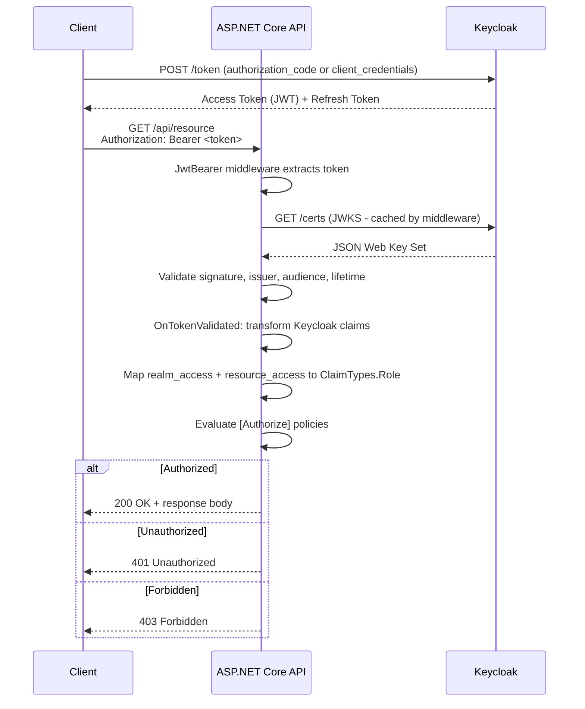
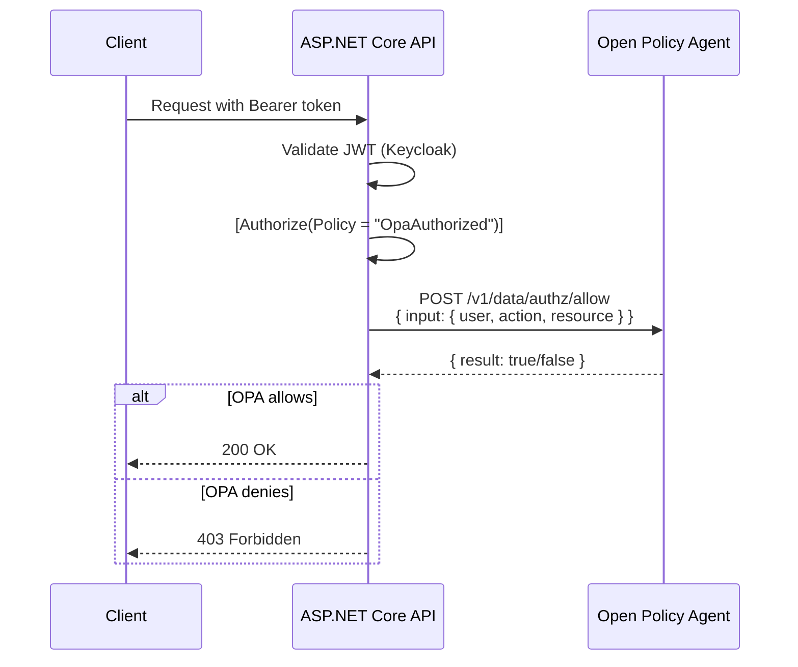
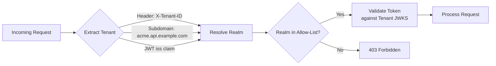

# 14-02. .NET 9 / ASP.NET Core Integration Guide

> **Project:** Enterprise IAM Platform based on Keycloak
> **Parent document:** [Client Applications Hub](14-client-applications.md)
> **Related documents:** [Authentication and Authorization](08-authentication-authorization.md) | [Observability](10-observability.md) | [Security by Design](07-security-by-design.md)

---

## Table of Contents

1. [Prerequisites](#1-prerequisites)
2. [Project Setup](#2-project-setup)
3. [Program.cs Configuration](#3-programcs-configuration)
4. [TokenValidationParameters](#4-tokenvalidationparameters)
5. [Custom Claim Transformation](#5-custom-claim-transformation)
6. [Policy-Based Authorization](#6-policy-based-authorization)
7. [Example Controller](#7-example-controller)
8. [Custom Authorization Handler for OPA Integration](#8-custom-authorization-handler-for-opa-integration)
9. [Multi-Tenant Support](#9-multi-tenant-support)
10. [OpenTelemetry Instrumentation](#10-opentelemetry-instrumentation)
11. [Testing](#11-testing)
12. [Docker Compose for Local Development](#12-docker-compose-for-local-development)
13. [Recommended Project Structure](#13-recommended-project-structure)

---

## 1. Prerequisites

| Requirement | Minimum Version | Recommended Version |
|---|---|---|
| .NET SDK | 9.0.100 | 9.0.200+ |
| ASP.NET Core Runtime | 9.0.0 | 9.0.x (latest patch) |
| Keycloak Server | 25.x | 26.x |
| Docker / Docker Compose | 24.x | 27.x |
| IDE | VS 2022 17.12+ / Rider 2024.3+ / VS Code + C# Dev Kit | -- |

Before beginning integration, ensure you have:

- A running Keycloak instance (local or remote) with at least one realm configured.
- A confidential client registered in Keycloak (e.g., `acme-api`) with the appropriate roles and protocol mappers.
- The realm's issuer URI (e.g., `https://iam.example.com/realms/tenant-acme`).

---

## 2. Project Setup

### 2.1 Create the Project

```bash
dotnet new webapi -n Acme.Api --framework net9.0
cd Acme.Api
```

### 2.2 NuGet Packages

```bash
# Authentication
dotnet add package Microsoft.AspNetCore.Authentication.JwtBearer --version 9.0.*
dotnet add package Microsoft.AspNetCore.Authentication.OpenIdConnect --version 9.0.*

# OpenTelemetry (optional, see Section 10)
dotnet add package OpenTelemetry.Extensions.Hosting --version 1.10.*
dotnet add package OpenTelemetry.Instrumentation.AspNetCore --version 1.10.*
dotnet add package OpenTelemetry.Instrumentation.Http --version 1.10.*
dotnet add package OpenTelemetry.Exporter.OpenTelemetryProtocol --version 1.10.*

# Testing
dotnet add package Microsoft.AspNetCore.Mvc.Testing --version 9.0.*
dotnet add package xunit --version 2.9.*
dotnet add package Moq --version 4.20.*
```

Or add directly to the `.csproj`:

```xml
<ItemGroup>
    <!-- Authentication -->
    <PackageReference Include="Microsoft.AspNetCore.Authentication.JwtBearer" Version="9.0.*" />
    <PackageReference Include="Microsoft.AspNetCore.Authentication.OpenIdConnect" Version="9.0.*" />

    <!-- OpenTelemetry (optional) -->
    <PackageReference Include="OpenTelemetry.Extensions.Hosting" Version="1.10.*" />
    <PackageReference Include="OpenTelemetry.Instrumentation.AspNetCore" Version="1.10.*" />
    <PackageReference Include="OpenTelemetry.Instrumentation.Http" Version="1.10.*" />
    <PackageReference Include="OpenTelemetry.Exporter.OpenTelemetryProtocol" Version="1.10.*" />
</ItemGroup>
```

### 2.3 Authentication Flow



---

## 3. Program.cs Configuration

The following is a complete `Program.cs` that configures JWT Bearer authentication with Keycloak, authorization policies, and the middleware pipeline.

```csharp
using Acme.Api.Auth;
using Microsoft.AspNetCore.Authentication.JwtBearer;
using Microsoft.IdentityModel.Tokens;
using System.Security.Claims;

var builder = WebApplication.CreateBuilder(args);

// ---------------------------------------------------------------------------
// 1. Configuration
// ---------------------------------------------------------------------------
var keycloakSection = builder.Configuration.GetSection("Keycloak");
string authority = keycloakSection["Authority"]
    ?? "https://iam.example.com/realms/tenant-acme";
string audience = keycloakSection["Audience"] ?? "account";
string clientId = keycloakSection["ClientId"] ?? "acme-api";

// ---------------------------------------------------------------------------
// 2. Authentication - JWT Bearer with Keycloak
// ---------------------------------------------------------------------------
builder.Services.AddAuthentication(JwtBearerDefaults.AuthenticationScheme)
    .AddJwtBearer(options =>
    {
        options.Authority = authority;
        options.Audience = audience;
        options.RequireHttpsMetadata =
            !builder.Environment.IsDevelopment(); // Allow HTTP in dev

        options.TokenValidationParameters = new TokenValidationParameters
        {
            ValidateIssuer = true,
            ValidIssuer = authority,
            ValidateAudience = true,
            ValidAudience = audience,
            ValidateLifetime = true,
            ClockSkew = TimeSpan.FromSeconds(30),
            NameClaimType = "preferred_username",
            RoleClaimType = ClaimTypes.Role
        };

        options.Events = new JwtBearerEvents
        {
            OnTokenValidated = context =>
            {
                // Transform Keycloak claims into standard .NET role claims
                var identity = context.Principal?.Identity as ClaimsIdentity;
                KeycloakClaimTransformer.TransformClaims(identity, clientId);
                return Task.CompletedTask;
            },
            OnAuthenticationFailed = context =>
            {
                var logger = context.HttpContext.RequestServices
                    .GetRequiredService<ILoggerFactory>()
                    .CreateLogger("JwtBearer");
                logger.LogWarning(
                    "Authentication failed: {Error}", context.Exception.Message);
                return Task.CompletedTask;
            },
            OnChallenge = context =>
            {
                // Customize the 401 response body
                if (!context.Response.HasStarted)
                {
                    context.Response.StatusCode = 401;
                    context.Response.ContentType = "application/json";
                    context.HandleResponse();
                    return context.Response.WriteAsync(
                        """{"error":"unauthorized","message":"Invalid or missing token"}""");
                }
                return Task.CompletedTask;
            }
        };
    });

// ---------------------------------------------------------------------------
// 3. Authorization - Policy-Based
// ---------------------------------------------------------------------------
builder.Services.AddAuthorization(options =>
{
    options.AddPolicy("AdminOnly", policy =>
        policy.RequireRole("admin"));

    options.AddPolicy("EditorOrAdmin", policy =>
        policy.RequireRole("editor", "admin"));

    options.AddPolicy("TenantAccess", policy =>
        policy.RequireClaim("tenant_id"));

    options.AddPolicy("VerifiedEmail", policy =>
        policy.RequireClaim("email_verified", "true"));
});

// ---------------------------------------------------------------------------
// 4. Services
// ---------------------------------------------------------------------------
builder.Services.AddControllers();
builder.Services.AddEndpointsApiExplorer();
builder.Services.AddSwaggerGen();

// Register HTTP client for downstream service calls
builder.Services.AddHttpClient("downstream-api", client =>
{
    client.BaseAddress = new Uri(
        builder.Configuration["DownstreamApi:BaseUrl"]
        ?? "https://downstream-api.example.com");
});

var app = builder.Build();

// ---------------------------------------------------------------------------
// 5. Middleware Pipeline
// ---------------------------------------------------------------------------
if (app.Environment.IsDevelopment())
{
    app.UseSwagger();
    app.UseSwaggerUI();
}

app.UseHttpsRedirection();

// Authentication must come before Authorization
app.UseAuthentication();
app.UseAuthorization();

app.MapControllers();

app.Run();

// Make the implicit Program class public for WebApplicationFactory in tests
public partial class Program { }
```

### 3.1 appsettings.json

```json
{
  "Keycloak": {
    "Authority": "https://iam.example.com/realms/tenant-acme",
    "Audience": "account",
    "ClientId": "acme-api",
    "ClientSecret": "",
    "AllowedIssuers": [
      "https://iam.example.com/realms/tenant-acme",
      "https://iam.example.com/realms/tenant-globex"
    ]
  },
  "DownstreamApi": {
    "BaseUrl": "https://downstream-api.example.com"
  },
  "Logging": {
    "LogLevel": {
      "Default": "Information",
      "Microsoft.AspNetCore.Authentication": "Debug"
    }
  }
}
```

### 3.2 appsettings.Development.json

```json
{
  "Keycloak": {
    "Authority": "http://localhost:8080/realms/tenant-acme",
    "Audience": "account",
    "ClientId": "acme-api",
    "ClientSecret": "dev-secret-change-me"
  }
}
```

---

## 4. TokenValidationParameters

The following table documents every relevant parameter and its recommended setting.

| Parameter | Value | Description |
|---|---|---|
| `ValidateIssuer` | `true` | Ensures the token was issued by the expected Keycloak realm |
| `ValidIssuer` | `https://iam.example.com/realms/tenant-acme` | Must match the `iss` claim exactly |
| `ValidateAudience` | `true` | Prevents tokens intended for other clients from being accepted |
| `ValidAudience` | `account` | Must match the `aud` claim in the JWT |
| `ValidateLifetime` | `true` | Rejects expired tokens |
| `ClockSkew` | `TimeSpan.FromSeconds(30)` | Tolerance for clock drift between servers (default is 5 minutes, which is too generous) |
| `ValidateIssuerSigningKey` | `true` (default) | Verifies the token signature against Keycloak's JWKS |
| `NameClaimType` | `preferred_username` | Maps `User.Identity.Name` to the Keycloak username |
| `RoleClaimType` | `ClaimTypes.Role` | Enables `User.IsInRole()` and `[Authorize(Roles = "...")]` |

---

## 5. Custom Claim Transformation

Keycloak embeds roles in nested JSON structures (`realm_access` and `resource_access`) that the default .NET JWT handler does not parse. A custom claim transformer is required to map these into standard `ClaimTypes.Role` claims.

### 5.1 Keycloak JWT Claims Structure

```json
{
  "sub": "f1b2c3d4-5678-9abc-def0-1234567890ab",
  "realm_access": {
    "roles": ["user", "editor"]
  },
  "resource_access": {
    "acme-api": {
      "roles": ["data-reader", "report-viewer"]
    },
    "account": {
      "roles": ["manage-account"]
    }
  },
  "tenant_id": "acme",
  "email": "jane.doe@acme.example.com",
  "email_verified": true,
  "preferred_username": "jane.doe"
}
```

### 5.2 Claim Transformer Implementation

```csharp
// Auth/KeycloakClaimTransformer.cs
using System.Security.Claims;
using System.Text.Json;

namespace Acme.Api.Auth;

/// <summary>
/// Transforms Keycloak-specific JWT claims into standard .NET ClaimTypes.Role claims.
/// This enables the use of [Authorize(Roles = "admin")], User.IsInRole("admin"),
/// and policy-based authorization with RequireRole.
/// </summary>
public static class KeycloakClaimTransformer
{
    /// <summary>
    /// Extracts roles from realm_access and resource_access claims and adds them
    /// as ClaimTypes.Role to the identity.
    /// </summary>
    /// <param name="identity">The ClaimsIdentity to transform.</param>
    /// <param name="clientId">The Keycloak client ID for extracting client-specific roles.</param>
    public static void TransformClaims(ClaimsIdentity? identity, string clientId)
    {
        if (identity is null) return;

        ExtractRealmRoles(identity);
        ExtractClientRoles(identity, clientId);
    }

    private static void ExtractRealmRoles(ClaimsIdentity identity)
    {
        var realmAccessClaim = identity.FindFirst("realm_access");
        if (realmAccessClaim is null) return;

        try
        {
            using var doc = JsonDocument.Parse(realmAccessClaim.Value);
            if (doc.RootElement.TryGetProperty("roles", out var roles))
            {
                foreach (var role in roles.EnumerateArray())
                {
                    var roleName = role.GetString();
                    if (!string.IsNullOrWhiteSpace(roleName))
                    {
                        identity.AddClaim(new Claim(ClaimTypes.Role, roleName));
                    }
                }
            }
        }
        catch (JsonException)
        {
            // Log and continue - malformed claim should not crash the pipeline
        }
    }

    private static void ExtractClientRoles(ClaimsIdentity identity, string clientId)
    {
        var resourceAccessClaim = identity.FindFirst("resource_access");
        if (resourceAccessClaim is null) return;

        try
        {
            using var doc = JsonDocument.Parse(resourceAccessClaim.Value);
            if (doc.RootElement.TryGetProperty(clientId, out var clientAccess) &&
                clientAccess.TryGetProperty("roles", out var clientRoles))
            {
                foreach (var role in clientRoles.EnumerateArray())
                {
                    var roleName = role.GetString();
                    if (!string.IsNullOrWhiteSpace(roleName))
                    {
                        identity.AddClaim(new Claim(ClaimTypes.Role, roleName));
                    }
                }
            }
        }
        catch (JsonException)
        {
            // Log and continue
        }
    }
}
```

### 5.3 Alternative: IClaimsTransformation (Registered as a Service)

If you prefer a service-based approach that runs on every request (useful when you need to look up additional data from a database):

```csharp
// Auth/KeycloakClaimsTransformation.cs
using Microsoft.AspNetCore.Authentication;
using System.Security.Claims;

namespace Acme.Api.Auth;

public class KeycloakClaimsTransformation : IClaimsTransformation
{
    private readonly IConfiguration _configuration;

    public KeycloakClaimsTransformation(IConfiguration configuration)
    {
        _configuration = configuration;
    }

    public Task<ClaimsPrincipal> TransformAsync(ClaimsPrincipal principal)
    {
        var identity = principal.Identity as ClaimsIdentity;
        var clientId = _configuration["Keycloak:ClientId"] ?? "acme-api";

        KeycloakClaimTransformer.TransformClaims(identity, clientId);

        return Task.FromResult(principal);
    }
}
```

Register it in `Program.cs`:

```csharp
builder.Services.AddTransient<IClaimsTransformation, KeycloakClaimsTransformation>();
```

### 5.4 Role Mapping Summary

| Keycloak Location | Example Role | .NET Claim |
|---|---|---|
| `realm_access.roles` | `admin` | `ClaimTypes.Role` = `admin` |
| `realm_access.roles` | `user` | `ClaimTypes.Role` = `user` |
| `resource_access.acme-api.roles` | `data-reader` | `ClaimTypes.Role` = `data-reader` |
| `resource_access.acme-api.roles` | `report-viewer` | `ClaimTypes.Role` = `report-viewer` |

---

## 6. Policy-Based Authorization

ASP.NET Core policies provide a flexible and testable authorization model. Each policy can combine multiple requirements.

### 6.1 Policy Definitions

Policies are registered in `Program.cs` (see Section 3). Here is an extended set:

```csharp
builder.Services.AddAuthorization(options =>
{
    // Simple role-based policies
    options.AddPolicy("AdminOnly", policy =>
        policy.RequireRole("admin"));

    options.AddPolicy("EditorOrAdmin", policy =>
        policy.RequireRole("editor", "admin"));

    // Claim-based policies
    options.AddPolicy("TenantAccess", policy =>
        policy.RequireClaim("tenant_id"));

    options.AddPolicy("VerifiedEmail", policy =>
        policy.RequireClaim("email_verified", "true"));

    // Composite policies
    options.AddPolicy("TenantAdmin", policy =>
    {
        policy.RequireClaim("tenant_id");
        policy.RequireRole("admin");
    });

    // Custom requirement policies (see Section 8 for OPA)
    options.AddPolicy("OpaAuthorized", policy =>
        policy.AddRequirements(new OpaAuthorizationRequirement()));

    // Default policy for [Authorize] without arguments
    options.DefaultPolicy = new Microsoft.AspNetCore.Authorization.AuthorizationPolicyBuilder()
        .RequireAuthenticatedUser()
        .Build();

    // Fallback policy - applied to endpoints without any [Authorize] or [AllowAnonymous]
    options.FallbackPolicy = null; // null = allow anonymous by default for undecorated endpoints
});
```

### 6.2 Policy Reference Table

| Policy Name | Requirements | Use Case |
|---|---|---|
| `AdminOnly` | Role: `admin` | Administrative operations |
| `EditorOrAdmin` | Role: `editor` OR `admin` | Content management |
| `TenantAccess` | Claim: `tenant_id` exists | Any tenant-scoped operation |
| `VerifiedEmail` | Claim: `email_verified` = `"true"` | Sensitive operations requiring verified identity |
| `TenantAdmin` | Claim: `tenant_id` + Role: `admin` | Tenant-level administrative actions |
| `OpaAuthorized` | Custom requirement (OPA evaluation) | Fine-grained policy decisions |

---

## 7. Example Controller

The following controller demonstrates all common endpoint protection patterns.

```csharp
// Controllers/ResourceController.cs
using Microsoft.AspNetCore.Authorization;
using Microsoft.AspNetCore.Mvc;
using System.Security.Claims;

namespace Acme.Api.Controllers;

[ApiController]
[Route("api")]
public class ResourceController : ControllerBase
{
    // -------------------------------------------------------------------
    // 1. Public endpoint - no authentication required
    // -------------------------------------------------------------------
    [HttpGet("public/health")]
    [AllowAnonymous]
    public IActionResult Health()
    {
        return Ok(new { status = "UP", timestamp = DateTime.UtcNow });
    }

    [HttpGet("public/info")]
    [AllowAnonymous]
    public IActionResult Info()
    {
        return Ok(new { service = "acme-api", version = "1.0.0" });
    }

    // -------------------------------------------------------------------
    // 2. Authenticated endpoint - any valid token
    // -------------------------------------------------------------------
    [HttpGet("profile")]
    [Authorize]
    public IActionResult GetProfile()
    {
        var profile = new
        {
            Sub = User.FindFirst(ClaimTypes.NameIdentifier)?.Value
                  ?? User.FindFirst("sub")?.Value,
            Email = User.FindFirst("email")?.Value,
            Name = User.Identity?.Name,  // Maps to preferred_username via NameClaimType
            Roles = User.FindAll(ClaimTypes.Role).Select(c => c.Value).ToList(),
            TenantId = User.FindFirst("tenant_id")?.Value,
            EmailVerified = User.FindFirst("email_verified")?.Value
        };
        return Ok(profile);
    }

    // -------------------------------------------------------------------
    // 3. Admin-only endpoint
    // -------------------------------------------------------------------
    [HttpGet("admin/users")]
    [Authorize(Policy = "AdminOnly")]
    public IActionResult ListUsers()
    {
        return Ok(new[]
        {
            new { Id = "u-001", Name = "Alice", Role = "admin" },
            new { Id = "u-002", Name = "Bob", Role = "editor" }
        });
    }

    [HttpDelete("admin/users/{userId}")]
    [Authorize(Policy = "AdminOnly")]
    public IActionResult DeleteUser(string userId)
    {
        return NoContent();
    }

    // -------------------------------------------------------------------
    // 4. Editor or Admin endpoint
    // -------------------------------------------------------------------
    [HttpPut("documents/{docId}")]
    [Authorize(Policy = "EditorOrAdmin")]
    public IActionResult UpdateDocument(string docId, [FromBody] object content)
    {
        return Ok(new { documentId = docId, updated = true });
    }

    // -------------------------------------------------------------------
    // 5. Tenant-scoped endpoint
    // -------------------------------------------------------------------
    [HttpGet("tenant/data")]
    [Authorize(Policy = "TenantAccess")]
    public IActionResult GetTenantData()
    {
        var tenantId = User.FindFirst("tenant_id")?.Value;
        return Ok(new { tenantId, data = "Tenant-specific data" });
    }

    [HttpGet("tenant/reports")]
    [Authorize(Policy = "TenantAdmin")]
    public IActionResult GetTenantReports()
    {
        var tenantId = User.FindFirst("tenant_id")?.Value;
        return Ok(new
        {
            tenantId,
            reports = new[]
            {
                new { Id = "r-001", Title = "Monthly Summary" },
                new { Id = "r-002", Title = "Quarterly Review" }
            }
        });
    }

    // -------------------------------------------------------------------
    // 6. Verified email endpoint
    // -------------------------------------------------------------------
    [HttpPost("sensitive/operation")]
    [Authorize(Policy = "VerifiedEmail")]
    public IActionResult PerformSensitiveOperation([FromBody] object payload)
    {
        return Ok(new { completed = true });
    }
}
```

---

## 8. Custom Authorization Handler for OPA Integration

For fine-grained authorization decisions that go beyond role and claim checks, integrate with an Open Policy Agent (OPA) instance.

### 8.1 Architecture



### 8.2 Authorization Requirement and Handler

```csharp
// Auth/OpaAuthorizationRequirement.cs
using Microsoft.AspNetCore.Authorization;

namespace Acme.Api.Auth;

/// <summary>
/// Marker requirement for OPA-based authorization.
/// </summary>
public class OpaAuthorizationRequirement : IAuthorizationRequirement { }
```

```csharp
// Auth/OpaAuthorizationHandler.cs
using Microsoft.AspNetCore.Authorization;
using Microsoft.AspNetCore.Http;
using System.Net.Http.Json;
using System.Security.Claims;

namespace Acme.Api.Auth;

/// <summary>
/// Authorization handler that delegates policy decisions to an OPA instance.
/// </summary>
public class OpaAuthorizationHandler : AuthorizationHandler<OpaAuthorizationRequirement>
{
    private readonly IHttpClientFactory _httpClientFactory;
    private readonly ILogger<OpaAuthorizationHandler> _logger;
    private readonly IHttpContextAccessor _httpContextAccessor;

    public OpaAuthorizationHandler(
        IHttpClientFactory httpClientFactory,
        ILogger<OpaAuthorizationHandler> logger,
        IHttpContextAccessor httpContextAccessor)
    {
        _httpClientFactory = httpClientFactory;
        _logger = logger;
        _httpContextAccessor = httpContextAccessor;
    }

    protected override async Task HandleRequirementAsync(
        AuthorizationHandlerContext context,
        OpaAuthorizationRequirement requirement)
    {
        var httpContext = _httpContextAccessor.HttpContext;
        if (httpContext is null)
        {
            context.Fail();
            return;
        }

        var user = context.User;
        var request = httpContext.Request;

        // Build the OPA input document
        var opaInput = new
        {
            input = new
            {
                subject = new
                {
                    sub = user.FindFirst(ClaimTypes.NameIdentifier)?.Value
                          ?? user.FindFirst("sub")?.Value,
                    roles = user.FindAll(ClaimTypes.Role).Select(c => c.Value).ToArray(),
                    tenant_id = user.FindFirst("tenant_id")?.Value,
                    email = user.FindFirst("email")?.Value
                },
                action = request.Method,
                resource = new
                {
                    path = request.Path.Value,
                    query = request.QueryString.Value
                }
            }
        };

        try
        {
            var client = _httpClientFactory.CreateClient("opa");
            var response = await client.PostAsJsonAsync(
                "/v1/data/authz/allow", opaInput);

            if (response.IsSuccessStatusCode)
            {
                var result = await response.Content
                    .ReadFromJsonAsync<OpaDecisionResponse>();
                if (result?.Result == true)
                {
                    context.Succeed(requirement);
                    return;
                }
            }

            _logger.LogWarning(
                "OPA denied access for user {Sub} to {Method} {Path}",
                opaInput.input.subject.sub,
                opaInput.input.action,
                opaInput.input.resource.path);
        }
        catch (Exception ex)
        {
            _logger.LogError(ex, "OPA authorization check failed");
            // Fail closed - deny access if OPA is unreachable
        }

        context.Fail();
    }

    private record OpaDecisionResponse(bool Result);
}
```

### 8.3 Registration

```csharp
// In Program.cs
builder.Services.AddHttpContextAccessor();
builder.Services.AddHttpClient("opa", client =>
{
    client.BaseAddress = new Uri(
        builder.Configuration["Opa:BaseUrl"] ?? "http://localhost:8181");
    client.Timeout = TimeSpan.FromSeconds(2);
});
builder.Services.AddSingleton<IAuthorizationHandler, OpaAuthorizationHandler>();
```

---

## 9. Multi-Tenant Support

In a multi-tenant deployment where each tenant has its own Keycloak realm, the application must dynamically resolve the JWT Bearer options per tenant.

### 9.1 Tenant Resolution Strategy



### 9.2 Dynamic JwtBearer Options per Tenant

```csharp
// Auth/MultiTenantJwtBearerHandler.cs
using Microsoft.AspNetCore.Authentication.JwtBearer;
using Microsoft.Extensions.Options;
using Microsoft.IdentityModel.Protocols;
using Microsoft.IdentityModel.Protocols.OpenIdConnect;
using Microsoft.IdentityModel.Tokens;
using System.Collections.Concurrent;

namespace Acme.Api.Auth;

/// <summary>
/// Dynamically configures JwtBearerOptions based on the tenant extracted from
/// the incoming request (X-Tenant-ID header or subdomain).
/// </summary>
public class MultiTenantJwtBearerEvents : JwtBearerEvents
{
    private readonly ConcurrentDictionary<string, ConfigurationManager<OpenIdConnectConfiguration>>
        _configManagers = new();

    private readonly IConfiguration _configuration;
    private readonly ILogger<MultiTenantJwtBearerEvents> _logger;

    public MultiTenantJwtBearerEvents(
        IConfiguration configuration,
        ILogger<MultiTenantJwtBearerEvents> logger)
    {
        _configuration = configuration;
        _logger = logger;
    }

    public override async Task MessageReceived(MessageReceivedContext context)
    {
        var tenantId = ResolveTenantId(context.HttpContext);
        if (string.IsNullOrWhiteSpace(tenantId))
        {
            context.Fail("Unable to resolve tenant");
            return;
        }

        var keycloakBase = _configuration["Keycloak:BaseUrl"]
            ?? "https://iam.example.com";
        var realmName = $"tenant-{tenantId}";
        var authority = $"{keycloakBase}/realms/{realmName}";

        // Validate against allow-list
        var allowedIssuers = _configuration
            .GetSection("Keycloak:AllowedIssuers").Get<string[]>() ?? [];
        if (!allowedIssuers.Contains(authority))
        {
            _logger.LogWarning("Tenant {TenantId} maps to disallowed issuer {Authority}",
                tenantId, authority);
            context.Fail("Unknown tenant");
            return;
        }

        // Get or create the OIDC configuration manager for this tenant
        var metadataAddress = $"{authority}/.well-known/openid-configuration";
        var configManager = _configManagers.GetOrAdd(realmName,
            _ => new ConfigurationManager<OpenIdConnectConfiguration>(
                metadataAddress,
                new OpenIdConnectConfigurationRetriever(),
                new HttpDocumentRetriever()));

        var oidcConfig = await configManager.GetConfigurationAsync(
            context.HttpContext.RequestAborted);

        // Override the validation parameters for this specific tenant
        context.Options.TokenValidationParameters = new TokenValidationParameters
        {
            ValidateIssuer = true,
            ValidIssuer = authority,
            ValidateAudience = true,
            ValidAudience = _configuration["Keycloak:Audience"] ?? "account",
            ValidateLifetime = true,
            ClockSkew = TimeSpan.FromSeconds(30),
            IssuerSigningKeys = oidcConfig.SigningKeys,
            NameClaimType = "preferred_username",
            RoleClaimType = System.Security.Claims.ClaimTypes.Role
        };

        // Store tenant ID for later use in controllers
        context.HttpContext.Items["TenantId"] = tenantId;
    }

    private static string? ResolveTenantId(HttpContext httpContext)
    {
        // Strategy 1: HTTP header
        var tenantHeader = httpContext.Request.Headers["X-Tenant-ID"].FirstOrDefault();
        if (!string.IsNullOrWhiteSpace(tenantHeader))
            return tenantHeader;

        // Strategy 2: Subdomain
        var host = httpContext.Request.Host.Host;
        if (host.Contains('.'))
        {
            var subdomain = host.Split('.')[0];
            if (subdomain is not ("www" or "api"))
                return subdomain;
        }

        // Strategy 3: Default
        return null;
    }
}
```

### 9.3 Registration

```csharp
// In Program.cs
builder.Services.AddSingleton<MultiTenantJwtBearerEvents>();

builder.Services.AddAuthentication(JwtBearerDefaults.AuthenticationScheme)
    .AddJwtBearer(options =>
    {
        // Base configuration - will be overridden per-tenant
        options.Authority = authority;
        options.EventsType = typeof(MultiTenantJwtBearerEvents);
    });
```

---

## 10. OpenTelemetry Instrumentation

Integrate OpenTelemetry to propagate identity context through distributed traces and record authentication-related metrics.

### 10.1 OpenTelemetry Setup in Program.cs

```csharp
using OpenTelemetry.Metrics;
using OpenTelemetry.Resources;
using OpenTelemetry.Trace;

// Add to Program.cs before builder.Build()
builder.Services.AddOpenTelemetry()
    .ConfigureResource(resource => resource
        .AddService(
            serviceName: builder.Configuration["Otel:ServiceName"] ?? "acme-api",
            serviceVersion: "1.0.0")
        .AddAttributes(new Dictionary<string, object>
        {
            ["deployment.environment"] =
                builder.Configuration["Otel:Environment"] ?? "development"
        }))
    .WithTracing(tracing => tracing
        .AddAspNetCoreInstrumentation(options =>
        {
            options.EnrichWithHttpRequest = (activity, request) =>
            {
                // Add tenant context to every span
                if (request.HttpContext.Items.TryGetValue("TenantId", out var tenantId))
                {
                    activity.SetTag("enduser.tenant", tenantId?.ToString());
                }
            };
            options.EnrichWithHttpResponse = (activity, response) =>
            {
                if (response.StatusCode == 401)
                    activity.SetTag("auth.result", "unauthorized");
                else if (response.StatusCode == 403)
                    activity.SetTag("auth.result", "forbidden");
            };
        })
        .AddHttpClientInstrumentation()
        .AddOtlpExporter(options =>
        {
            options.Endpoint = new Uri(
                builder.Configuration["Otel:OtlpEndpoint"]
                ?? "http://localhost:4317");
        }))
    .WithMetrics(metrics => metrics
        .AddAspNetCoreInstrumentation()
        .AddHttpClientInstrumentation()
        .AddMeter("Acme.Api.Auth")
        .AddOtlpExporter(options =>
        {
            options.Endpoint = new Uri(
                builder.Configuration["Otel:OtlpEndpoint"]
                ?? "http://localhost:4317");
        }));
```

### 10.2 Identity Context Middleware

```csharp
// Observability/IdentityContextMiddleware.cs
using System.Diagnostics;
using System.Security.Claims;

namespace Acme.Api.Observability;

/// <summary>
/// Middleware that enriches the current Activity (OpenTelemetry span) with
/// identity attributes extracted from the authenticated user's claims.
/// </summary>
public class IdentityContextMiddleware
{
    private readonly RequestDelegate _next;

    public IdentityContextMiddleware(RequestDelegate next)
    {
        _next = next;
    }

    public async Task InvokeAsync(HttpContext context)
    {
        await _next(context);

        // Enrich after authentication has run
        var activity = Activity.Current;
        if (activity is null || context.User.Identity?.IsAuthenticated != true)
            return;

        var sub = context.User.FindFirst(ClaimTypes.NameIdentifier)?.Value
                  ?? context.User.FindFirst("sub")?.Value;
        if (sub is not null)
            activity.SetTag("enduser.id", sub);

        var roles = context.User.FindAll(ClaimTypes.Role)
            .Select(c => c.Value);
        activity.SetTag("enduser.role", string.Join(",", roles));

        var tenantId = context.User.FindFirst("tenant_id")?.Value;
        if (tenantId is not null)
            activity.SetTag("enduser.tenant", tenantId);

        var clientId = context.User.FindFirst("azp")?.Value;
        if (clientId is not null)
            activity.SetTag("enduser.client_id", clientId);

        var issuer = context.User.FindFirst("iss")?.Value;
        if (issuer is not null)
        {
            var realmIdx = issuer.LastIndexOf("/realms/", StringComparison.Ordinal);
            if (realmIdx >= 0)
                activity.SetTag("enduser.realm", issuer[(realmIdx + 8)..]);
        }
    }
}

// Extension method for clean registration
public static class IdentityContextMiddlewareExtensions
{
    public static IApplicationBuilder UseIdentityContext(
        this IApplicationBuilder builder)
    {
        return builder.UseMiddleware<IdentityContextMiddleware>();
    }
}
```

Register in `Program.cs` after `UseAuthentication()`:

```csharp
app.UseAuthentication();
app.UseIdentityContext();  // Add identity context to traces
app.UseAuthorization();
```

### 10.3 Custom Metrics for Authentication Events

```csharp
// Observability/AuthMetrics.cs
using System.Diagnostics;
using System.Diagnostics.Metrics;

namespace Acme.Api.Observability;

/// <summary>
/// Custom metrics for authentication and authorization events.
/// Registered under the "Acme.Api.Auth" meter for Prometheus/Grafana consumption.
/// </summary>
public sealed class AuthMetrics
{
    public static readonly string MeterName = "Acme.Api.Auth";

    private readonly Counter<long> _authSuccessCounter;
    private readonly Counter<long> _authFailureCounter;
    private readonly Counter<long> _authzDeniedCounter;
    private readonly Histogram<double> _tokenValidationDuration;

    public AuthMetrics(IMeterFactory meterFactory)
    {
        var meter = meterFactory.Create(MeterName);

        _authSuccessCounter = meter.CreateCounter<long>(
            "iam.auth.success",
            description: "Number of successful authentications");

        _authFailureCounter = meter.CreateCounter<long>(
            "iam.auth.failure",
            description: "Number of failed authentications");

        _authzDeniedCounter = meter.CreateCounter<long>(
            "iam.authz.denied",
            description: "Number of authorization denials");

        _tokenValidationDuration = meter.CreateHistogram<double>(
            "iam.token.validation.duration",
            unit: "ms",
            description: "Time spent validating JWT tokens");
    }

    public void RecordAuthSuccess(string? realm = null, string? clientId = null)
    {
        var tags = new TagList
        {
            { "realm", realm ?? "unknown" },
            { "client_id", clientId ?? "unknown" }
        };
        _authSuccessCounter.Add(1, tags);
    }

    public void RecordAuthFailure(string reason)
    {
        _authFailureCounter.Add(1, new TagList { { "reason", reason } });
    }

    public void RecordAuthzDenied(string resource, string? policy = null)
    {
        var tags = new TagList
        {
            { "resource", resource },
            { "policy", policy ?? "unknown" }
        };
        _authzDeniedCounter.Add(1, tags);
    }

    public void RecordTokenValidationDuration(double durationMs)
    {
        _tokenValidationDuration.Record(durationMs);
    }
}
```

Register in `Program.cs`:

```csharp
builder.Services.AddSingleton<AuthMetrics>();
```

### 10.4 Span Attribute Summary

| Attribute | Source | Example Value |
|---|---|---|
| `enduser.id` | `ClaimTypes.NameIdentifier` | `f1b2c3d4-5678-9abc-def0-1234567890ab` |
| `enduser.role` | `ClaimTypes.Role` (all values) | `admin,user` |
| `enduser.tenant` | `tenant_id` claim | `acme` |
| `enduser.client_id` | `azp` claim | `acme-api` |
| `enduser.realm` | Extracted from `iss` claim | `tenant-acme` |
| `auth.result` | HTTP response status | `unauthorized` / `forbidden` |

---

## 11. Testing

### 11.1 WebApplicationFactory with Mock JWT

```csharp
// Tests/ResourceControllerTests.cs
using System.Net;
using System.Net.Http.Headers;
using System.Security.Claims;
using Microsoft.AspNetCore.Authentication;
using Microsoft.AspNetCore.Mvc.Testing;
using Microsoft.Extensions.DependencyInjection;
using Xunit;

namespace Acme.Api.Tests;

public class ResourceControllerTests : IClassFixture<WebApplicationFactory<Program>>
{
    private readonly WebApplicationFactory<Program> _factory;

    public ResourceControllerTests(WebApplicationFactory<Program> factory)
    {
        _factory = factory.WithWebHostBuilder(builder =>
        {
            builder.ConfigureServices(services =>
            {
                // Replace the default authentication with a test scheme
                services.AddAuthentication("Test")
                    .AddScheme<AuthenticationSchemeOptions, TestAuthHandler>(
                        "Test", options => { });
            });
        });
    }

    [Fact]
    public async Task PublicEndpoint_ReturnsOk_WithoutAuthentication()
    {
        var client = _factory.CreateClient();
        var response = await client.GetAsync("/api/public/health");

        Assert.Equal(HttpStatusCode.OK, response.StatusCode);
    }

    [Fact]
    public async Task ProtectedEndpoint_Returns401_WithoutToken()
    {
        // Use a factory without the test auth handler
        var rawFactory = new WebApplicationFactory<Program>();
        var client = rawFactory.CreateClient();

        var response = await client.GetAsync("/api/profile");

        Assert.Equal(HttpStatusCode.Unauthorized, response.StatusCode);
    }

    [Fact]
    public async Task AdminEndpoint_ReturnsOk_WithAdminRole()
    {
        var client = _factory.CreateClient();
        // The TestAuthHandler below returns admin role by default
        // when the X-Test-Role header is set
        client.DefaultRequestHeaders.Add("X-Test-Role", "admin");

        var response = await client.GetAsync("/api/admin/users");

        Assert.Equal(HttpStatusCode.OK, response.StatusCode);
    }

    [Fact]
    public async Task AdminEndpoint_Returns403_WithUserRole()
    {
        var client = _factory.CreateClient();
        client.DefaultRequestHeaders.Add("X-Test-Role", "user");

        var response = await client.GetAsync("/api/admin/users");

        Assert.Equal(HttpStatusCode.Forbidden, response.StatusCode);
    }

    [Fact]
    public async Task TenantEndpoint_ReturnsOk_WithTenantClaim()
    {
        var client = _factory.CreateClient();
        client.DefaultRequestHeaders.Add("X-Test-Role", "admin");
        client.DefaultRequestHeaders.Add("X-Test-Tenant", "acme");

        var response = await client.GetAsync("/api/tenant/data");

        Assert.Equal(HttpStatusCode.OK, response.StatusCode);
    }
}
```

### 11.2 Custom Test Authentication Handler

```csharp
// Tests/TestAuthHandler.cs
using System.Security.Claims;
using System.Text.Encodings.Web;
using Microsoft.AspNetCore.Authentication;
using Microsoft.Extensions.Logging;
using Microsoft.Extensions.Options;

namespace Acme.Api.Tests;

/// <summary>
/// A test authentication handler that creates a ClaimsPrincipal from request headers.
/// This allows tests to simulate different users, roles, and claims without a real
/// Keycloak instance or JWT tokens.
/// </summary>
public class TestAuthHandler : AuthenticationHandler<AuthenticationSchemeOptions>
{
    public TestAuthHandler(
        IOptionsMonitor<AuthenticationSchemeOptions> options,
        ILoggerFactory logger,
        UrlEncoder encoder)
        : base(options, logger, encoder) { }

    protected override Task<AuthenticateResult> HandleAuthenticateAsync()
    {
        var claims = new List<Claim>
        {
            new(ClaimTypes.NameIdentifier, "test-user-001"),
            new("sub", "test-user-001"),
            new("preferred_username", "test.user"),
            new("email", "test@acme.example.com"),
            new("email_verified", "true")
        };

        // Add role from header
        if (Request.Headers.TryGetValue("X-Test-Role", out var roleHeader))
        {
            foreach (var role in roleHeader.ToString().Split(','))
            {
                claims.Add(new Claim(ClaimTypes.Role, role.Trim()));
            }
        }

        // Add tenant from header
        if (Request.Headers.TryGetValue("X-Test-Tenant", out var tenantHeader))
        {
            claims.Add(new Claim("tenant_id", tenantHeader.ToString()));
        }

        var identity = new ClaimsIdentity(claims, "Test");
        var principal = new ClaimsPrincipal(identity);
        var ticket = new AuthenticationTicket(principal, "Test");

        return Task.FromResult(AuthenticateResult.Success(ticket));
    }
}
```

### 11.3 Integration Test with Real JWT

For tests that require a real JWT signature verification flow:

```csharp
// Tests/JwtIntegrationTests.cs
using System.IdentityModel.Tokens.Jwt;
using System.Net;
using System.Net.Http.Headers;
using System.Security.Claims;
using System.Security.Cryptography;
using Microsoft.AspNetCore.Mvc.Testing;
using Microsoft.Extensions.DependencyInjection;
using Microsoft.IdentityModel.Tokens;
using Xunit;

namespace Acme.Api.Tests;

/// <summary>
/// Integration tests that generate real JWT tokens signed with an RSA key.
/// The application's JwtBearer handler is configured to trust this test key.
/// </summary>
public class JwtIntegrationTests : IClassFixture<WebApplicationFactory<Program>>
{
    private static readonly RSA _rsa = RSA.Create(2048);
    private static readonly RsaSecurityKey _signingKey = new(_rsa);
    private static readonly string _issuer = "https://test-keycloak/realms/test";
    private static readonly string _audience = "account";

    private readonly HttpClient _client;

    public JwtIntegrationTests(WebApplicationFactory<Program> factory)
    {
        _client = factory.WithWebHostBuilder(builder =>
        {
            builder.ConfigureServices(services =>
            {
                // Override JWT validation to use our test signing key
                services.PostConfigure<Microsoft.AspNetCore.Authentication.JwtBearer
                    .JwtBearerOptions>(
                    Microsoft.AspNetCore.Authentication.JwtBearer
                        .JwtBearerDefaults.AuthenticationScheme,
                    options =>
                    {
                        options.Authority = null;
                        options.TokenValidationParameters = new TokenValidationParameters
                        {
                            ValidateIssuer = true,
                            ValidIssuer = _issuer,
                            ValidateAudience = true,
                            ValidAudience = _audience,
                            ValidateLifetime = true,
                            IssuerSigningKey = _signingKey,
                            NameClaimType = "preferred_username",
                            RoleClaimType = ClaimTypes.Role
                        };
                    });
            });
        }).CreateClient();
    }

    [Fact]
    public async Task ValidToken_ReturnsProfile()
    {
        var token = GenerateToken("user-001", "jane.doe", ["user"]);
        _client.DefaultRequestHeaders.Authorization =
            new AuthenticationHeaderValue("Bearer", token);

        var response = await _client.GetAsync("/api/profile");

        Assert.Equal(HttpStatusCode.OK, response.StatusCode);
    }

    [Fact]
    public async Task AdminToken_CanAccessAdminEndpoint()
    {
        var token = GenerateToken("admin-001", "admin.user", ["admin"]);
        _client.DefaultRequestHeaders.Authorization =
            new AuthenticationHeaderValue("Bearer", token);

        var response = await _client.GetAsync("/api/admin/users");

        Assert.Equal(HttpStatusCode.OK, response.StatusCode);
    }

    [Fact]
    public async Task ExpiredToken_Returns401()
    {
        var token = GenerateToken("user-001", "jane.doe", ["user"],
            expiresIn: TimeSpan.FromMinutes(-5));
        _client.DefaultRequestHeaders.Authorization =
            new AuthenticationHeaderValue("Bearer", token);

        var response = await _client.GetAsync("/api/profile");

        Assert.Equal(HttpStatusCode.Unauthorized, response.StatusCode);
    }

    private static string GenerateToken(
        string sub,
        string username,
        string[] roles,
        TimeSpan? expiresIn = null)
    {
        var credentials = new SigningCredentials(
            _signingKey, SecurityAlgorithms.RsaSha256);

        var claims = new List<Claim>
        {
            new("sub", sub),
            new("preferred_username", username),
            new("email", $"{username}@acme.example.com"),
            new("email_verified", "true"),
            new("tenant_id", "acme"),
            new("azp", "acme-api")
        };

        // Add roles as ClaimTypes.Role for direct use by policies
        foreach (var role in roles)
        {
            claims.Add(new Claim(ClaimTypes.Role, role));
        }

        var token = new JwtSecurityToken(
            issuer: _issuer,
            audience: _audience,
            claims: claims,
            notBefore: DateTime.UtcNow.AddMinutes(-1),
            expires: DateTime.UtcNow.Add(expiresIn ?? TimeSpan.FromMinutes(30)),
            signingCredentials: credentials);

        return new JwtSecurityTokenHandler().WriteToken(token);
    }
}
```

---

## 12. Docker Compose for Local Development

```yaml
# docker-compose.yml
services:
  app:
    build:
      context: .
      dockerfile: Dockerfile
    environment:
      ASPNETCORE_ENVIRONMENT: Development
      ASPNETCORE_URLS: http://+:5000
      Keycloak__Authority: http://iam-keycloak:8080/realms/tenant-acme
      Keycloak__Audience: account
      Keycloak__ClientId: acme-api
      Keycloak__ClientSecret: dev-secret-change-me
      Otel__OtlpEndpoint: http://otel-collector:4317
    ports:
      - "5000:5000"
    networks:
      - iam-network
    env_file:
      - .env.example

  # Optional: OPA for policy-based authorization
  opa:
    image: openpolicyagent/opa:1.2.0
    command: run --server --addr :8181 /policies
    ports:
      - "8181:8181"
    volumes:
      - ./opa/policies:/policies

  # Optional: OpenTelemetry Collector
  otel-collector:
    image: otel/opentelemetry-collector-contrib:0.114.0
    ports:
      - "4317:4317"
      - "4318:4318"
      - "8888:8888"
    volumes:
      - ./otel/collector-config.yaml:/etc/otelcol-contrib/config.yaml

networks:
  iam-network:
    external: true
    name: devops_iam-network
```

---

## 13. Recommended Project Structure

The example project follows **Clean Architecture** principles, separating the codebase into controllers (adapter), services (use case), domain (entity), and infrastructure (adapter) layers. All public types and members use **XML documentation comments** (`/// <summary>`) to document intent, parameters, and return values.

**Testing** is organized in three tiers: **unit tests** (xUnit with `WebApplicationFactory` for in-memory endpoint testing), **integration tests** (Testcontainers with a real Keycloak instance), and **code coverage** via Coverlet (`--collect:"XPlat Code Coverage"`). The application is containerized with **Docker** and orchestrated with **docker-compose** for local development.

```
Acme.Api/
├── Acme.Api.sln
├── docker-compose.yml
├── Dockerfile
├── src/
│   └── Acme.Api/
│       ├── Acme.Api.csproj
│       ├── Program.cs
│       ├── appsettings.json
│       ├── appsettings.Development.json
│       ├── Auth/
│       │   ├── KeycloakClaimTransformer.cs
│       │   ├── KeycloakClaimsTransformation.cs        # IClaimsTransformation (optional)
│       │   ├── MultiTenantJwtBearerEvents.cs
│       │   ├── OpaAuthorizationRequirement.cs
│       │   └── OpaAuthorizationHandler.cs
│       ├── Controllers/
│       │   └── ResourceController.cs
│       └── Observability/
│           ├── IdentityContextMiddleware.cs
│           └── AuthMetrics.cs
├── tests/
│   └── Acme.Api.Tests/
│       ├── Acme.Api.Tests.csproj
│       ├── ResourceControllerTests.cs
│       ├── JwtIntegrationTests.cs
│       └── TestAuthHandler.cs
├── keycloak/
│   └── realms/
│       └── tenant-acme.json                           # Realm import for Docker Compose
└── opa/
    └── policies/
        └── authz.rego                                 # OPA policy file
```

---

---

## Scripts and DevOps Tooling

Each example project includes a `scripts/` folder with automation scripts for common development and operations tasks. These scripts can be executed independently or through an interactive menu.

### Interactive Menu

Launch the interactive DevOps menu from the project root:

```bash
./scripts/devops-menu.sh
```

The menu presents a numbered list of operations with colored output, prerequisite checks, and error handling.

### Available Scripts

| # | Operation | Independent Command | Description |
|---|-----------|-------------------|-------------|
| 1 | Start Keycloak | `docker-compose up -d keycloak` | Start the Keycloak identity provider via Docker Compose |
| 2 | Run application | `dotnet run` | Start the ASP.NET Core application |
| 3 | Run tests | `dotnet test` | Execute all tests (unit and integration) |
| 4 | Run tests with coverage | `dotnet test --collect:"XPlat Code Coverage"` | Execute tests and collect code coverage data |
| 5 | Build Docker image | `docker build -t iam-dotnet .` | Build the application Docker image |
| 6 | Run with Docker Compose | `docker-compose up` | Start all services (Keycloak + app) with Docker Compose |
| 7 | Format code | `dotnet format` | Format the source code using dotnet format |
| 8 | Check vulnerabilities | `dotnet list package --vulnerable` | Check NuGet packages for known vulnerabilities |
| 9 | View application logs | `docker-compose logs -f app` | Tail the application container logs |
| 10 | Stop all containers | `docker-compose down` | Stop and remove all Docker Compose containers |
| 11 | Clean build artifacts | `dotnet clean` | Remove build output directories |

### Script Location

All scripts are located in the [`examples/dotnet/scripts/`](../examples/dotnet/scripts/) directory relative to the project root.

---

## Related Documents

- [Client Applications Hub](14-client-applications.md) -- parent index for all client integration guides
- [Authentication and Authorization](08-authentication-authorization.md) -- OIDC flows, RBAC, token lifecycle
- [Observability](10-observability.md) -- OpenTelemetry, Prometheus, Grafana stack
- [Security by Design](07-security-by-design.md) -- security controls and hardening
- [Keycloak Configuration](04-keycloak-configuration.md) -- realm, client, and provider setup
