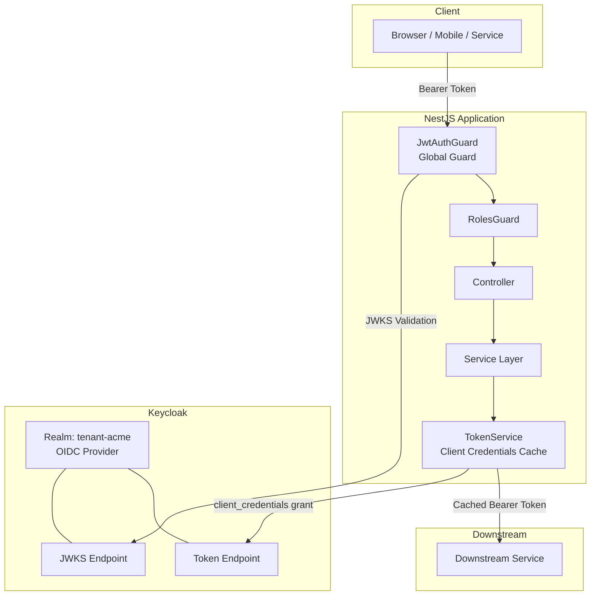
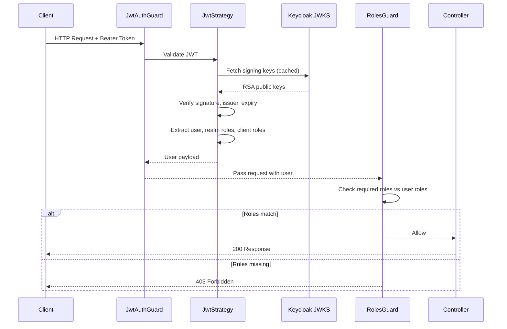
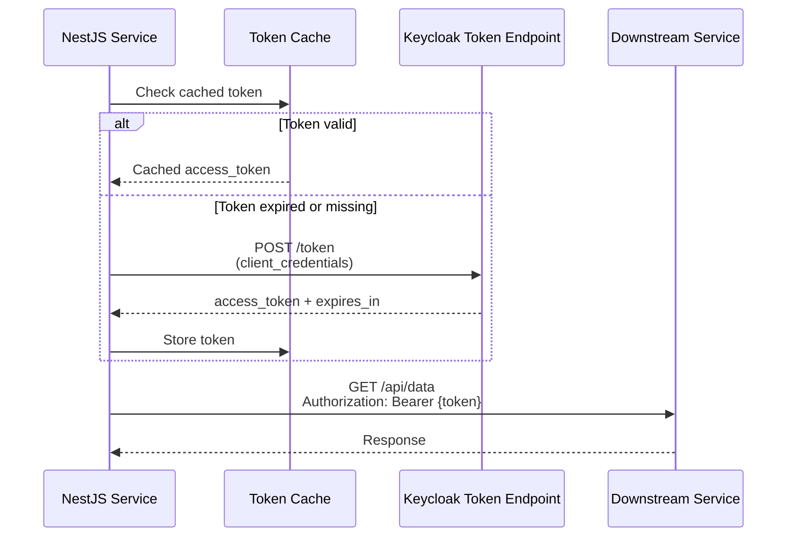
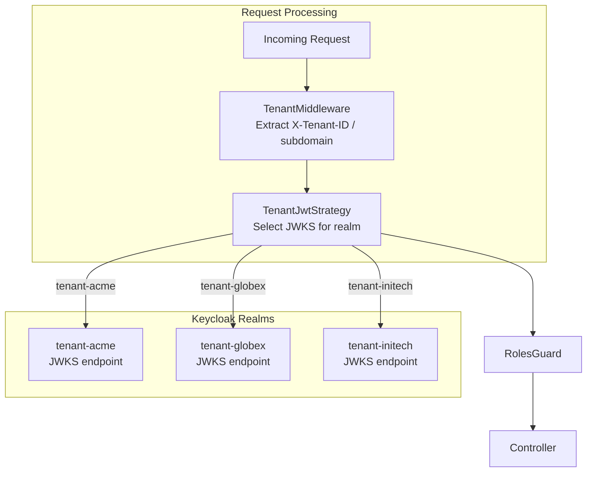

# 14-03. NestJS 10 Integration Guide

## Table of Contents

- [1. Overview](#1-overview)
- [2. Prerequisites](#2-prerequisites)
- [3. Dependencies](#3-dependencies)
- [4. Project Structure](#4-project-structure)
- [5. Environment Configuration](#5-environment-configuration)
- [6. AuthModule Setup](#6-authmodule-setup)
- [7. JwtStrategy with JWKS Validation](#7-jwtstrategy-with-jwks-validation)
- [8. Custom Decorators](#8-custom-decorators)
- [9. Guards](#9-guards)
- [10. Global Exception Filter for Auth Errors](#10-global-exception-filter-for-auth-errors)
- [11. Example Controller](#11-example-controller)
- [12. Service-to-Service Calls with Client Credentials](#12-service-to-service-calls-with-client-credentials)
- [13. Multi-Tenant Support](#13-multi-tenant-support)
- [14. OpenTelemetry Instrumentation](#14-opentelemetry-instrumentation)
- [15. Swagger / OpenAPI Integration](#15-swagger--openapi-integration)
- [16. Testing](#16-testing)
- [17. Docker Compose for Local Development](#17-docker-compose-for-local-development)
- [18. Related Documents](#18-related-documents)

---

## 1. Overview

This guide provides a complete, production-ready integration of a NestJS 10.x application with the Keycloak IAM platform. It covers JWT-based authentication using Passport, role-based authorization, multi-tenant realm resolution, service-to-service communication via client credentials, OpenTelemetry observability, and automated testing strategies.



### Authentication and Authorization Flow



---

## 2. Prerequisites

| Requirement | Version | Notes |
|---|---|---|
| Node.js | 22.x LTS | Required for ES2024 features and native fetch |
| npm | 10.x+ | Ships with Node.js 22.x |
| NestJS CLI | 10.x | Install globally: `npm i -g @nestjs/cli` |
| TypeScript | 5.3+ | Included via NestJS scaffolding |
| Keycloak | 26.x | Running instance with at least one realm configured |

Verify your environment:

```bash
node --version    # v22.x.x
npm --version     # 10.x.x
nest --version    # 10.x.x
```

---

## 3. Dependencies

Install all required packages:

```bash
# Core authentication
npm install @nestjs/passport passport passport-jwt jwks-rsa
npm install -D @types/passport-jwt

# Configuration
npm install @nestjs/config

# HTTP client for service-to-service calls
npm install axios

# OpenTelemetry
npm install @opentelemetry/sdk-node \
            @opentelemetry/auto-instrumentations-node \
            @opentelemetry/api \
            @opentelemetry/semantic-conventions \
            @opentelemetry/exporter-trace-otlp-http \
            @opentelemetry/exporter-metrics-otlp-http

# Swagger
npm install @nestjs/swagger

# Security
npm install helmet

# Testing
npm install -D supertest @types/supertest jest @nestjs/testing
```

### Dependency Summary

| Package | Purpose |
|---|---|
| `@nestjs/passport` | Passport integration for NestJS |
| `passport` | Core authentication framework |
| `passport-jwt` | JWT extraction and validation strategy |
| `jwks-rsa` | Dynamic JWKS key retrieval with caching |
| `@nestjs/config` | Environment-based configuration |
| `axios` | HTTP client for client credentials token exchange |
| `@opentelemetry/sdk-node` | OpenTelemetry Node.js SDK |
| `@opentelemetry/auto-instrumentations-node` | Automatic instrumentation for HTTP, Express, etc. |
| `@nestjs/swagger` | Swagger/OpenAPI document generation |
| `helmet` | Security HTTP headers |

---

## 4. Project Structure

The example project follows **Clean Architecture** principles using NestJS modules: controllers (adapter), services (use case), domain (entity), and guards/strategies (adapter). All public classes, methods, and interfaces use **TSDoc / JSDoc** comments (Compodoc-compatible) to document intent, parameters, and return values.

**Testing** is organized in three tiers: **unit tests** (Jest for isolated service/guard testing), **end-to-end tests** (supertest with a mock JWKS server), and **code coverage** via Istanbul/Jest (`npm run test:cov`). The application is containerized with **Docker** and orchestrated with **docker-compose** for local development.

```
src/
  auth/
    auth.module.ts
    jwt.strategy.ts
    jwt-auth.guard.ts
    roles.guard.ts
    decorators/
      current-user.decorator.ts
      roles.decorator.ts
      public.decorator.ts
    filters/
      auth-exception.filter.ts
    interfaces/
      jwt-payload.interface.ts
      authenticated-user.interface.ts
  config/
    keycloak.config.ts
    app.config.ts
  health/
    health.controller.ts
  resources/
    resources.controller.ts
    resources.module.ts
  clients/
    token.service.ts
    downstream-api.client.ts
    clients.module.ts
  tenant/
    tenant.middleware.ts
    tenant-jwt.strategy.ts
    tenant.module.ts
  telemetry/
    tracing.ts
    otel-user.interceptor.ts
  app.module.ts
  main.ts
test/
  auth.e2e-spec.ts
  helpers/
    mock-jwt.helper.ts
docker-compose.yml
.env
.env.example
```

---

## 5. Environment Configuration

### .env.example

```env
# Application
PORT=3000
NODE_ENV=development

# Keycloak
KEYCLOAK_URL=http://localhost:8080
KEYCLOAK_REALM=tenant-acme
KEYCLOAK_CLIENT_ID=acme-api
KEYCLOAK_CLIENT_SECRET=your-client-secret

# Downstream services
DOWNSTREAM_API_URL=http://localhost:4000

# OpenTelemetry
OTEL_SERVICE_NAME=nestjs-acme-api
OTEL_EXPORTER_OTLP_ENDPOINT=http://localhost:4318
```

### src/config/keycloak.config.ts

```typescript
import { registerAs } from '@nestjs/config';

export const keycloakConfig = registerAs('keycloak', () => ({
  url: process.env.KEYCLOAK_URL || 'https://iam.example.com',
  realm: process.env.KEYCLOAK_REALM || 'tenant-acme',
  clientId: process.env.KEYCLOAK_CLIENT_ID || 'acme-api',
  clientSecret: process.env.KEYCLOAK_CLIENT_SECRET || '',

  get issuer() {
    return `${this.url}/realms/${this.realm}`;
  },
  get jwksUri() {
    return `${this.url}/realms/${this.realm}/protocol/openid-connect/certs`;
  },
  get tokenEndpoint() {
    return `${this.url}/realms/${this.realm}/protocol/openid-connect/token`;
  },
}));
```

---

## 6. AuthModule Setup

### src/auth/interfaces/jwt-payload.interface.ts

```typescript
export interface JwtPayload {
  sub: string;
  email?: string;
  preferred_username?: string;
  realm_access?: {
    roles: string[];
  };
  resource_access?: {
    [clientId: string]: {
      roles: string[];
    };
  };
  tenant_id?: string;
  iss: string;
  aud: string | string[];
  exp: number;
  iat: number;
}
```

### src/auth/interfaces/authenticated-user.interface.ts

```typescript
export interface AuthenticatedUser {
  sub: string;
  email: string;
  username: string;
  realmRoles: string[];
  clientRoles: string[];
  tenantId?: string;
  rawToken?: string;
}
```

### src/auth/auth.module.ts

```typescript
import { Module } from '@nestjs/common';
import { PassportModule } from '@nestjs/passport';
import { ConfigModule } from '@nestjs/config';
import { APP_GUARD } from '@nestjs/core';
import { JwtStrategy } from './jwt.strategy';
import { JwtAuthGuard } from './jwt-auth.guard';
import { RolesGuard } from './roles.guard';
import { keycloakConfig } from '../config/keycloak.config';

@Module({
  imports: [
    PassportModule.register({ defaultStrategy: 'jwt' }),
    ConfigModule.forFeature(keycloakConfig),
  ],
  providers: [
    JwtStrategy,
    // Register JwtAuthGuard globally -- @Public() opts out
    {
      provide: APP_GUARD,
      useClass: JwtAuthGuard,
    },
    // Register RolesGuard globally -- only enforces when @Roles() is present
    {
      provide: APP_GUARD,
      useClass: RolesGuard,
    },
  ],
  exports: [PassportModule],
})
export class AuthModule {}
```

---

## 7. JwtStrategy with JWKS Validation

### src/auth/jwt.strategy.ts

```typescript
import { Injectable, UnauthorizedException } from '@nestjs/common';
import { ConfigService } from '@nestjs/config';
import { PassportStrategy } from '@nestjs/passport';
import { ExtractJwt, Strategy } from 'passport-jwt';
import { passportJwtSecret } from 'jwks-rsa';
import { JwtPayload } from './interfaces/jwt-payload.interface';
import { AuthenticatedUser } from './interfaces/authenticated-user.interface';

@Injectable()
export class JwtStrategy extends PassportStrategy(Strategy) {
  constructor(private readonly configService: ConfigService) {
    const keycloakUrl = configService.get<string>('keycloak.url');
    const realm = configService.get<string>('keycloak.realm');
    const issuer = `${keycloakUrl}/realms/${realm}`;
    const jwksUri = `${keycloakUrl}/realms/${realm}/protocol/openid-connect/certs`;
    const clientId = configService.get<string>('keycloak.clientId');

    super({
      jwtFromRequest: ExtractJwt.fromAuthHeaderAsBearerToken(),
      issuer,
      algorithms: ['RS256'],
      secretOrKeyProvider: passportJwtSecret({
        cache: true,
        cacheMaxEntries: 5,
        cacheMaxAge: 600_000, // 10 minutes
        rateLimit: true,
        jwksRequestsPerMinute: 10,
        jwksUri,
      }),
      passReqToCallback: true,
    });

    this.clientId = clientId;
  }

  private readonly clientId: string;

  validate(req: any, payload: JwtPayload): AuthenticatedUser {
    if (!payload.sub) {
      throw new UnauthorizedException('Invalid token: missing subject claim');
    }

    // Extract realm roles
    const realmRoles = payload.realm_access?.roles ?? [];

    // Extract client-specific roles
    const clientRoles =
      payload.resource_access?.[this.clientId]?.roles ?? [];

    return {
      sub: payload.sub,
      email: payload.email ?? '',
      username: payload.preferred_username ?? '',
      realmRoles,
      clientRoles,
      tenantId: payload.tenant_id,
      rawToken: ExtractJwt.fromAuthHeaderAsBearerToken()(req),
    };
  }
}
```

### Key Configuration Parameters

| Parameter | Value | Purpose |
|---|---|---|
| `algorithms` | `['RS256']` | Accept only RS256-signed tokens (Keycloak default) |
| `cache` | `true` | Cache JWKS keys to avoid per-request fetches |
| `cacheMaxAge` | `600000` (10 min) | JWKS cache TTL -- balances key rotation responsiveness vs. performance |
| `rateLimit` | `true` | Prevent excessive JWKS fetches on cache miss |
| `jwksRequestsPerMinute` | `10` | JWKS fetch rate limit |
| `issuer` | Realm URL | Validates `iss` claim matches expected Keycloak realm |

---

## 8. Custom Decorators

### @CurrentUser()

```typescript
// src/auth/decorators/current-user.decorator.ts
import { createParamDecorator, ExecutionContext } from '@nestjs/common';
import { AuthenticatedUser } from '../interfaces/authenticated-user.interface';

export const CurrentUser = createParamDecorator(
  (data: keyof AuthenticatedUser | undefined, ctx: ExecutionContext) => {
    const request = ctx.switchToHttp().getRequest();
    const user: AuthenticatedUser = request.user;
    return data ? user?.[data] : user;
  },
);
```

### @Roles()

```typescript
// src/auth/decorators/roles.decorator.ts
import { SetMetadata } from '@nestjs/common';

export const ROLES_KEY = 'roles';
export const Roles = (...roles: string[]) => SetMetadata(ROLES_KEY, roles);
```

### @Public()

```typescript
// src/auth/decorators/public.decorator.ts
import { SetMetadata } from '@nestjs/common';

export const IS_PUBLIC_KEY = 'isPublic';
export const Public = () => SetMetadata(IS_PUBLIC_KEY, true);
```

---

## 9. Guards

### JwtAuthGuard (Global)

The `JwtAuthGuard` is registered globally in `AuthModule`. Endpoints decorated with `@Public()` bypass authentication entirely.

```typescript
// src/auth/jwt-auth.guard.ts
import { ExecutionContext, Injectable } from '@nestjs/common';
import { Reflector } from '@nestjs/core';
import { AuthGuard } from '@nestjs/passport';
import { IS_PUBLIC_KEY } from './decorators/public.decorator';
import { Observable } from 'rxjs';

@Injectable()
export class JwtAuthGuard extends AuthGuard('jwt') {
  constructor(private reflector: Reflector) {
    super();
  }

  canActivate(
    context: ExecutionContext,
  ): boolean | Promise<boolean> | Observable<boolean> {
    const isPublic = this.reflector.getAllAndOverride<boolean>(IS_PUBLIC_KEY, [
      context.getHandler(),
      context.getClass(),
    ]);

    if (isPublic) {
      return true;
    }

    return super.canActivate(context);
  }
}
```

### RolesGuard

The `RolesGuard` is registered globally. It only enforces authorization when a handler or controller is decorated with `@Roles()`. Both realm and client roles are checked.

```typescript
// src/auth/roles.guard.ts
import {
  Injectable,
  CanActivate,
  ExecutionContext,
  ForbiddenException,
} from '@nestjs/common';
import { Reflector } from '@nestjs/core';
import { ROLES_KEY } from './decorators/roles.decorator';
import { IS_PUBLIC_KEY } from './decorators/public.decorator';
import { AuthenticatedUser } from './interfaces/authenticated-user.interface';

@Injectable()
export class RolesGuard implements CanActivate {
  constructor(private reflector: Reflector) {}

  canActivate(context: ExecutionContext): boolean {
    // Skip for public routes
    const isPublic = this.reflector.getAllAndOverride<boolean>(IS_PUBLIC_KEY, [
      context.getHandler(),
      context.getClass(),
    ]);
    if (isPublic) {
      return true;
    }

    const requiredRoles = this.reflector.getAllAndOverride<string[]>(
      ROLES_KEY,
      [context.getHandler(), context.getClass()],
    );

    // No @Roles() decorator means any authenticated user is allowed
    if (!requiredRoles || requiredRoles.length === 0) {
      return true;
    }

    const request = context.switchToHttp().getRequest();
    const user: AuthenticatedUser = request.user;

    if (!user) {
      throw new ForbiddenException('No user context found');
    }

    const userRoles = [...user.realmRoles, ...user.clientRoles];
    const hasRole = requiredRoles.some((role) => userRoles.includes(role));

    if (!hasRole) {
      throw new ForbiddenException(
        `Insufficient permissions. Required one of: [${requiredRoles.join(', ')}]`,
      );
    }

    return true;
  }
}
```

### Guard Execution Order

```mermaid
flowchart LR
    A[Incoming Request] --> B{@Public?}
    B -- Yes --> F[Controller]
    B -- No --> C[JwtAuthGuard<br/>Validate JWT]
    C -- Invalid --> G[401 Unauthorized]
    C -- Valid --> D{@Roles present?}
    D -- No --> F
    D -- Yes --> E[RolesGuard<br/>Check roles]
    E -- Pass --> F
    E -- Fail --> H[403 Forbidden]
```

---

## 10. Global Exception Filter for Auth Errors

```typescript
// src/auth/filters/auth-exception.filter.ts
import {
  ExceptionFilter,
  Catch,
  ArgumentsHost,
  UnauthorizedException,
  ForbiddenException,
  HttpStatus,
  Logger,
} from '@nestjs/common';
import { Response } from 'express';

@Catch(UnauthorizedException, ForbiddenException)
export class AuthExceptionFilter implements ExceptionFilter {
  private readonly logger = new Logger(AuthExceptionFilter.name);

  catch(exception: UnauthorizedException | ForbiddenException, host: ArgumentsHost): void {
    const ctx = host.switchToHttp();
    const response = ctx.getResponse<Response>();
    const request = ctx.getRequest();
    const status = exception.getStatus();

    const errorCode =
      status === HttpStatus.UNAUTHORIZED
        ? 'AUTHENTICATION_REQUIRED'
        : 'INSUFFICIENT_PERMISSIONS';

    this.logger.warn(
      `Auth error [${errorCode}]: ${exception.message} | ` +
        `Path: ${request.method} ${request.url} | ` +
        `IP: ${request.ip}`,
    );

    response.status(status).json({
      statusCode: status,
      error: errorCode,
      message:
        status === HttpStatus.UNAUTHORIZED
          ? 'Authentication is required to access this resource'
          : 'You do not have permission to access this resource',
      timestamp: new Date().toISOString(),
      path: request.url,
    });
  }
}
```

Register the filter in `main.ts`:

```typescript
// src/main.ts
import { NestFactory } from '@nestjs/core';
import { AppModule } from './app.module';
import { AuthExceptionFilter } from './auth/filters/auth-exception.filter';
import helmet from 'helmet';

async function bootstrap() {
  const app = await NestFactory.create(AppModule);

  app.use(helmet());
  app.useGlobalFilters(new AuthExceptionFilter());

  app.enableCors({
    origin: process.env.CORS_ORIGIN || 'http://localhost:3001',
    credentials: true,
  });

  const port = process.env.PORT || 3000;
  await app.listen(port);
}
bootstrap();
```

---

## 11. Example Controller

```typescript
// src/resources/resources.controller.ts
import {
  Controller,
  Get,
  Put,
  Delete,
  Param,
  Body,
  Headers,
} from '@nestjs/common';
import {
  ApiBearerAuth,
  ApiTags,
  ApiOperation,
  ApiUnauthorizedResponse,
  ApiForbiddenResponse,
} from '@nestjs/swagger';
import { Public } from '../auth/decorators/public.decorator';
import { Roles } from '../auth/decorators/roles.decorator';
import { CurrentUser } from '../auth/decorators/current-user.decorator';
import { AuthenticatedUser } from '../auth/interfaces/authenticated-user.interface';

@ApiTags('resources')
@Controller('api')
export class ResourcesController {

  // --- Public endpoint (no auth required) ---

  @Get('public/health')
  @Public()
  @ApiOperation({ summary: 'Health check (public)' })
  health() {
    return { status: 'ok', timestamp: new Date().toISOString() };
  }

  // --- Authenticated endpoint (any valid token) ---

  @Get('profile')
  @ApiBearerAuth()
  @ApiOperation({ summary: 'Get current user profile' })
  @ApiUnauthorizedResponse({ description: 'Missing or invalid Bearer token' })
  getProfile(@CurrentUser() user: AuthenticatedUser) {
    return {
      sub: user.sub,
      email: user.email,
      username: user.username,
      realmRoles: user.realmRoles,
      clientRoles: user.clientRoles,
    };
  }

  // --- Role-protected endpoint ---

  @Get('admin/users')
  @Roles('admin')
  @ApiBearerAuth()
  @ApiOperation({ summary: 'List all users (admin only)' })
  @ApiUnauthorizedResponse({ description: 'Missing or invalid Bearer token' })
  @ApiForbiddenResponse({ description: 'Requires admin role' })
  listUsers() {
    return { users: [] };
  }

  @Put('documents/:id')
  @Roles('editor', 'admin')
  @ApiBearerAuth()
  @ApiOperation({ summary: 'Update a document (editor or admin)' })
  @ApiUnauthorizedResponse({ description: 'Missing or invalid Bearer token' })
  @ApiForbiddenResponse({ description: 'Requires editor or admin role' })
  updateDocument(@Param('id') id: string, @Body() content: any) {
    return { documentId: id, updated: true };
  }

  @Delete('admin/users/:userId')
  @Roles('admin')
  @ApiBearerAuth()
  @ApiOperation({ summary: 'Delete a user (admin only)' })
  @ApiUnauthorizedResponse({ description: 'Missing or invalid Bearer token' })
  @ApiForbiddenResponse({ description: 'Requires admin role' })
  deleteUser(@Param('userId') userId: string) {
    return { deleted: true, userId };
  }

  // --- Tenant-scoped endpoint ---

  @Get('tenant/data')
  @ApiBearerAuth()
  @ApiOperation({ summary: 'Get data scoped to the current tenant' })
  @ApiUnauthorizedResponse({ description: 'Missing or invalid Bearer token' })
  getTenantData(@CurrentUser() user: AuthenticatedUser) {
    return {
      tenantId: user.tenantId,
      message: `Data for tenant ${user.tenantId}`,
    };
  }

  // --- Endpoint using specific user field via decorator ---

  @Get('my-email')
  @ApiBearerAuth()
  getEmail(@CurrentUser('email') email: string) {
    return { email };
  }
}
```

---

## 12. Service-to-Service Calls with Client Credentials

### Token Service with Caching

```typescript
// src/clients/token.service.ts
import { Injectable, Logger } from '@nestjs/common';
import { ConfigService } from '@nestjs/config';
import axios from 'axios';

interface CachedToken {
  accessToken: string;
  expiresAt: number; // Unix timestamp in ms
}

@Injectable()
export class TokenService {
  private readonly logger = new Logger(TokenService.name);
  private tokenCache: Map<string, CachedToken> = new Map();

  // Refresh 30 seconds before actual expiry
  private readonly EXPIRY_BUFFER_MS = 30_000;

  constructor(private readonly configService: ConfigService) {}

  /**
   * Obtain a client credentials token for the given audience/scope.
   * Tokens are cached and refreshed automatically.
   */
  async getClientToken(scope = 'openid'): Promise<string> {
    const cacheKey = `cc:${scope}`;
    const cached = this.tokenCache.get(cacheKey);

    if (cached && Date.now() < cached.expiresAt - this.EXPIRY_BUFFER_MS) {
      return cached.accessToken;
    }

    this.logger.debug(`Fetching new client credentials token (scope: ${scope})`);

    const tokenEndpoint = this.configService.get<string>('keycloak.tokenEndpoint');
    const clientId = this.configService.get<string>('keycloak.clientId');
    const clientSecret = this.configService.get<string>('keycloak.clientSecret');

    const params = new URLSearchParams({
      grant_type: 'client_credentials',
      client_id: clientId,
      client_secret: clientSecret,
      scope,
    });

    try {
      const response = await axios.post(tokenEndpoint, params.toString(), {
        headers: { 'Content-Type': 'application/x-www-form-urlencoded' },
        timeout: 5_000,
      });

      const { access_token, expires_in } = response.data;

      this.tokenCache.set(cacheKey, {
        accessToken: access_token,
        expiresAt: Date.now() + expires_in * 1000,
      });

      this.logger.debug(`Client credentials token cached (expires_in: ${expires_in}s)`);
      return access_token;
    } catch (error) {
      this.logger.error('Failed to obtain client credentials token', error?.message);
      throw error;
    }
  }
}
```

### Downstream API Client

```typescript
// src/clients/downstream-api.client.ts
import { Injectable, Logger } from '@nestjs/common';
import { ConfigService } from '@nestjs/config';
import axios, { AxiosInstance } from 'axios';
import { TokenService } from './token.service';

@Injectable()
export class DownstreamApiClient {
  private readonly logger = new Logger(DownstreamApiClient.name);
  private readonly httpClient: AxiosInstance;

  constructor(
    private readonly tokenService: TokenService,
    private readonly configService: ConfigService,
  ) {
    this.httpClient = axios.create({
      baseURL: this.configService.get<string>('DOWNSTREAM_API_URL'),
      timeout: 10_000,
    });
  }

  async getData(): Promise<any> {
    const token = await this.tokenService.getClientToken();

    const response = await this.httpClient.get('/api/data', {
      headers: { Authorization: `Bearer ${token}` },
    });

    return response.data;
  }
}
```

### Clients Module

```typescript
// src/clients/clients.module.ts
import { Module } from '@nestjs/common';
import { ConfigModule } from '@nestjs/config';
import { TokenService } from './token.service';
import { DownstreamApiClient } from './downstream-api.client';

@Module({
  imports: [ConfigModule],
  providers: [TokenService, DownstreamApiClient],
  exports: [TokenService, DownstreamApiClient],
})
export class ClientsModule {}
```

### Client Credentials Flow



---

## 13. Multi-Tenant Support

Multi-tenant applications must resolve the Keycloak realm dynamically per request. The strategy below uses a custom `X-Tenant-ID` header or subdomain to determine the realm.

### Tenant Resolution Middleware

```typescript
// src/tenant/tenant.middleware.ts
import { Injectable, NestMiddleware, BadRequestException } from '@nestjs/common';
import { Request, Response, NextFunction } from 'express';

// Extend Express Request to carry tenantId
declare global {
  namespace Express {
    interface Request {
      tenantId?: string;
    }
  }
}

@Injectable()
export class TenantMiddleware implements NestMiddleware {
  private readonly ALLOWED_TENANTS = new Set([
    'tenant-acme',
    'tenant-globex',
    'tenant-initech',
  ]);

  use(req: Request, _res: Response, next: NextFunction): void {
    // Strategy 1: Explicit header
    let tenantId = req.headers['x-tenant-id'] as string | undefined;

    // Strategy 2: Subdomain extraction (e.g., acme.api.example.com)
    if (!tenantId) {
      const host = req.hostname;
      const subdomain = host.split('.')[0];
      if (subdomain && subdomain !== 'api' && subdomain !== 'www') {
        tenantId = `tenant-${subdomain}`;
      }
    }

    if (!tenantId) {
      throw new BadRequestException(
        'Tenant identification required. Provide X-Tenant-ID header or use a tenant subdomain.',
      );
    }

    if (!this.ALLOWED_TENANTS.has(tenantId)) {
      throw new BadRequestException(`Unknown tenant: ${tenantId}`);
    }

    req.tenantId = tenantId;
    next();
  }
}
```

### Dynamic JwtStrategy per Tenant

For multi-tenant JWT validation, replace the single-realm `JwtStrategy` with a dynamic approach that selects the JWKS URI based on the resolved tenant.

```typescript
// src/tenant/tenant-jwt.strategy.ts
import { Injectable, UnauthorizedException } from '@nestjs/common';
import { PassportStrategy } from '@nestjs/passport';
import { Strategy, ExtractJwt } from 'passport-jwt';
import { passportJwtSecret, GetVerificationKey } from 'jwks-rsa';
import { ConfigService } from '@nestjs/config';
import { Request } from 'express';
import { JwtPayload } from '../auth/interfaces/jwt-payload.interface';
import { AuthenticatedUser } from '../auth/interfaces/authenticated-user.interface';

@Injectable()
export class TenantJwtStrategy extends PassportStrategy(Strategy, 'tenant-jwt') {
  private readonly keycloakUrl: string;
  private readonly clientId: string;
  private readonly jwksProviders: Map<string, GetVerificationKey> = new Map();

  constructor(private readonly configService: ConfigService) {
    const keycloakUrl = configService.get<string>('keycloak.url');

    super({
      jwtFromRequest: ExtractJwt.fromAuthHeaderAsBearerToken(),
      algorithms: ['RS256'],
      passReqToCallback: true,
      // secretOrKeyProvider is resolved dynamically below
      secretOrKeyProvider: (
        req: Request,
        rawJwtToken: string,
        done: (err: any, key?: string) => void,
      ) => {
        const tenantId = (req as any).tenantId;
        if (!tenantId) {
          return done(new UnauthorizedException('Tenant not resolved'));
        }

        const provider = this.getJwksProvider(tenantId);
        provider(req, rawJwtToken, done);
      },
    });

    this.keycloakUrl = keycloakUrl;
    this.clientId = configService.get<string>('keycloak.clientId');
  }

  private getJwksProvider(tenantId: string): GetVerificationKey {
    if (!this.jwksProviders.has(tenantId)) {
      const jwksUri = `${this.keycloakUrl}/realms/${tenantId}/protocol/openid-connect/certs`;
      const provider = passportJwtSecret({
        cache: true,
        cacheMaxEntries: 5,
        cacheMaxAge: 600_000,
        rateLimit: true,
        jwksRequestsPerMinute: 10,
        jwksUri,
      });
      this.jwksProviders.set(tenantId, provider);
    }
    return this.jwksProviders.get(tenantId)!;
  }

  validate(req: Request, payload: JwtPayload): AuthenticatedUser {
    const tenantId = (req as any).tenantId;
    const expectedIssuer = `${this.keycloakUrl}/realms/${tenantId}`;

    if (payload.iss !== expectedIssuer) {
      throw new UnauthorizedException(
        `Token issuer mismatch: expected ${expectedIssuer}, got ${payload.iss}`,
      );
    }

    if (!payload.sub) {
      throw new UnauthorizedException('Invalid token: missing subject claim');
    }

    return {
      sub: payload.sub,
      email: payload.email ?? '',
      username: payload.preferred_username ?? '',
      realmRoles: payload.realm_access?.roles ?? [],
      clientRoles: payload.resource_access?.[this.clientId]?.roles ?? [],
      tenantId,
    };
  }
}
```

### Multi-Tenant Architecture



### Tenant Module

```typescript
// src/tenant/tenant.module.ts
import { Module, MiddlewareConsumer, RequestMethod } from '@nestjs/common';
import { ConfigModule } from '@nestjs/config';
import { PassportModule } from '@nestjs/passport';
import { TenantMiddleware } from './tenant.middleware';
import { TenantJwtStrategy } from './tenant-jwt.strategy';
import { keycloakConfig } from '../config/keycloak.config';

@Module({
  imports: [
    PassportModule.register({ defaultStrategy: 'tenant-jwt' }),
    ConfigModule.forFeature(keycloakConfig),
  ],
  providers: [TenantJwtStrategy],
})
export class TenantModule {
  configure(consumer: MiddlewareConsumer) {
    consumer
      .apply(TenantMiddleware)
      .forRoutes({ path: '*', method: RequestMethod.ALL });
  }
}
```

### Tenant Resolution Strategies

| Strategy | Header / Pattern | Pros | Cons |
|---|---|---|---|
| `X-Tenant-ID` header | `X-Tenant-ID: tenant-acme` | Explicit, easy to test | Requires client cooperation |
| Subdomain | `acme.api.example.com` | Clean separation, transparent | Requires wildcard DNS + TLS |
| Path prefix | `/tenant-acme/api/...` | Simple setup | Pollutes URL namespace |
| JWT claim | `tenant_id` in token body | No extra header needed | Requires custom Keycloak mapper |

---

## 14. OpenTelemetry Instrumentation

### Tracing Bootstrap

Create the tracing configuration file. This must be loaded **before** the NestJS application starts.

```typescript
// src/telemetry/tracing.ts
import { NodeSDK } from '@opentelemetry/sdk-node';
import { getNodeAutoInstrumentations } from '@opentelemetry/auto-instrumentations-node';
import { OTLPTraceExporter } from '@opentelemetry/exporter-trace-otlp-http';
import { OTLPMetricExporter } from '@opentelemetry/exporter-metrics-otlp-http';
import { PeriodicExportingMetricReader } from '@opentelemetry/sdk-metrics';
import { Resource } from '@opentelemetry/resources';
import {
  ATTR_SERVICE_NAME,
  ATTR_SERVICE_VERSION,
} from '@opentelemetry/semantic-conventions';

const resource = new Resource({
  [ATTR_SERVICE_NAME]: process.env.OTEL_SERVICE_NAME || 'nestjs-acme-api',
  [ATTR_SERVICE_VERSION]: process.env.npm_package_version || '1.0.0',
});

const traceExporter = new OTLPTraceExporter({
  url: `${process.env.OTEL_EXPORTER_OTLP_ENDPOINT}/v1/traces`,
});

const metricExporter = new OTLPMetricExporter({
  url: `${process.env.OTEL_EXPORTER_OTLP_ENDPOINT}/v1/metrics`,
});

const sdk = new NodeSDK({
  resource,
  traceExporter,
  metricReader: new PeriodicExportingMetricReader({
    exporter: metricExporter,
    exportIntervalMillis: 15_000,
  }),
  instrumentations: [
    getNodeAutoInstrumentations({
      '@opentelemetry/instrumentation-http': {
        ignoreIncomingPaths: ['/api/public/health'],
      },
      '@opentelemetry/instrumentation-fs': { enabled: false },
    }),
  ],
});

sdk.start();
process.on('SIGTERM', () => sdk.shutdown());
```

Load the tracing module early via the `--require` flag:

```json
// package.json (scripts section)
{
  "scripts": {
    "start": "node --require ./dist/telemetry/tracing.js dist/main.js",
    "start:dev": "nest start --watch --exec \"node --require dist/telemetry/tracing.js\""
  }
}
```

### Adding User Identity to Spans

```typescript
// src/telemetry/otel-user.interceptor.ts
import {
  Injectable,
  NestInterceptor,
  ExecutionContext,
  CallHandler,
} from '@nestjs/common';
import { Observable, tap } from 'rxjs';
import { trace, SpanStatusCode, metrics } from '@opentelemetry/api';
import { AuthenticatedUser } from '../auth/interfaces/authenticated-user.interface';

@Injectable()
export class OtelUserInterceptor implements NestInterceptor {
  private readonly meter = metrics.getMeter('nestjs-auth');

  private readonly authSuccessCounter = this.meter.createCounter(
    'auth.success.total',
    { description: 'Total successful authentications' },
  );

  private readonly authFailureCounter = this.meter.createCounter(
    'auth.failure.total',
    { description: 'Total failed authentications' },
  );

  private readonly requestDurationHistogram = this.meter.createHistogram(
    'http.auth_request.duration',
    { description: 'Duration of authenticated requests in ms', unit: 'ms' },
  );

  intercept(context: ExecutionContext, next: CallHandler): Observable<any> {
    const request = context.switchToHttp().getRequest();
    const user: AuthenticatedUser | undefined = request.user;
    const startTime = Date.now();

    const span = trace.getActiveSpan();

    if (span && user) {
      span.setAttribute('enduser.id', user.sub);
      span.setAttribute('enduser.email', user.email);
      span.setAttribute('enduser.roles', user.realmRoles.join(','));
      if (user.tenantId) {
        span.setAttribute('enduser.tenant', user.tenantId);
      }
      this.authSuccessCounter.add(1, { tenant: user.tenantId ?? 'default' });
    }

    return next.handle().pipe(
      tap({
        next: () => {
          this.requestDurationHistogram.record(Date.now() - startTime, {
            method: request.method,
            route: request.route?.path ?? request.url,
            status: 'success',
          });
        },
        error: (err) => {
          if (span) {
            span.setStatus({ code: SpanStatusCode.ERROR, message: err.message });
          }
          if (err.status === 401 || err.status === 403) {
            this.authFailureCounter.add(1, {
              reason: err.status === 401 ? 'unauthenticated' : 'forbidden',
            });
          }
          this.requestDurationHistogram.record(Date.now() - startTime, {
            method: request.method,
            route: request.route?.path ?? request.url,
            status: 'error',
          });
        },
      }),
    );
  }
}
```

Register the interceptor globally in `app.module.ts`:

```typescript
import { APP_INTERCEPTOR } from '@nestjs/core';
import { OtelUserInterceptor } from './telemetry/otel-user.interceptor';

@Module({
  providers: [
    {
      provide: APP_INTERCEPTOR,
      useClass: OtelUserInterceptor,
    },
  ],
})
export class AppModule {}
```

### Custom Metrics Summary

| Metric | Type | Labels | Description |
|---|---|---|---|
| `auth.success.total` | Counter | `tenant` | Successful authentication events |
| `auth.failure.total` | Counter | `reason` | Failed authentication events |
| `http.auth_request.duration` | Histogram | `method`, `route`, `status` | Duration of authenticated requests |

---

## 15. Swagger / OpenAPI Integration

### Setup in main.ts

```typescript
// Add to src/main.ts bootstrap function
import { DocumentBuilder, SwaggerModule } from '@nestjs/swagger';

async function bootstrap() {
  const app = await NestFactory.create(AppModule);

  // Swagger setup
  const config = new DocumentBuilder()
    .setTitle('Acme API')
    .setDescription('NestJS API integrated with Keycloak IAM')
    .setVersion('1.0')
    .addBearerAuth(
      {
        type: 'http',
        scheme: 'bearer',
        bearerFormat: 'JWT',
        description: 'Enter the Keycloak access token',
      },
      'bearer',
    )
    .build();

  const document = SwaggerModule.createDocument(app, config);
  SwaggerModule.setup('docs', app, document);

  await app.listen(process.env.PORT || 3000);
}
```

### Controller Decorators Reference

| Decorator | Purpose |
|---|---|
| `@ApiBearerAuth()` | Marks endpoint as requiring Bearer token in Swagger UI |
| `@ApiOperation({ summary: '...' })` | Describes the endpoint |
| `@ApiUnauthorizedResponse({ description: '...' })` | Documents 401 response |
| `@ApiForbiddenResponse({ description: '...' })` | Documents 403 response |
| `@ApiTags('...')` | Groups endpoints in Swagger UI |

---

## 16. Testing

### Unit Test: JwtStrategy

```typescript
// src/auth/__tests__/jwt.strategy.spec.ts
import { Test, TestingModule } from '@nestjs/testing';
import { ConfigService } from '@nestjs/config';
import { UnauthorizedException } from '@nestjs/common';
import { JwtStrategy } from '../jwt.strategy';

describe('JwtStrategy', () => {
  let strategy: JwtStrategy;

  beforeEach(async () => {
    const module: TestingModule = await Test.createTestingModule({
      providers: [
        JwtStrategy,
        {
          provide: ConfigService,
          useValue: {
            get: (key: string) => {
              const config: Record<string, string> = {
                'keycloak.url': 'https://iam.example.com',
                'keycloak.realm': 'tenant-acme',
                'keycloak.clientId': 'acme-api',
              };
              return config[key];
            },
          },
        },
      ],
    }).compile();

    strategy = module.get<JwtStrategy>(JwtStrategy);
  });

  it('should extract realm and client roles from a valid payload', () => {
    const mockReq = {
      headers: { authorization: 'Bearer mock-token' },
    };

    const payload = {
      sub: 'user-123',
      email: 'alice@acme.com',
      preferred_username: 'alice',
      realm_access: { roles: ['user', 'editor'] },
      resource_access: {
        'acme-api': { roles: ['document-writer'] },
      },
      tenant_id: 'tenant-acme',
      iss: 'https://iam.example.com/realms/tenant-acme',
      aud: 'account',
      exp: Math.floor(Date.now() / 1000) + 300,
      iat: Math.floor(Date.now() / 1000),
    };

    const result = strategy.validate(mockReq, payload);

    expect(result).toEqual({
      sub: 'user-123',
      email: 'alice@acme.com',
      username: 'alice',
      realmRoles: ['user', 'editor'],
      clientRoles: ['document-writer'],
      tenantId: 'tenant-acme',
      rawToken: undefined, // ExtractJwt returns undefined for mock
    });
  });

  it('should throw UnauthorizedException when sub is missing', () => {
    const payload = { iss: 'x', aud: 'y', exp: 0, iat: 0 } as any;
    expect(() => strategy.validate({}, payload)).toThrow(UnauthorizedException);
  });
});
```

### Unit Test: RolesGuard

```typescript
// src/auth/__tests__/roles.guard.spec.ts
import { RolesGuard } from '../roles.guard';
import { Reflector } from '@nestjs/core';
import { ExecutionContext, ForbiddenException } from '@nestjs/common';

describe('RolesGuard', () => {
  let guard: RolesGuard;
  let reflector: Reflector;

  beforeEach(() => {
    reflector = new Reflector();
    guard = new RolesGuard(reflector);
  });

  function mockExecutionContext(user: any, roles: string[] | undefined): ExecutionContext {
    const ctx = {
      getHandler: () => ({}),
      getClass: () => ({}),
      switchToHttp: () => ({
        getRequest: () => ({ user }),
      }),
    } as unknown as ExecutionContext;

    jest.spyOn(reflector, 'getAllAndOverride').mockImplementation((key: string) => {
      if (key === 'isPublic') return false;
      if (key === 'roles') return roles;
      return undefined;
    });

    return ctx;
  }

  it('should allow when no roles are required', () => {
    const ctx = mockExecutionContext({ realmRoles: [], clientRoles: [] }, undefined);
    expect(guard.canActivate(ctx)).toBe(true);
  });

  it('should allow when user has required role', () => {
    const ctx = mockExecutionContext(
      { realmRoles: ['admin'], clientRoles: [] },
      ['admin'],
    );
    expect(guard.canActivate(ctx)).toBe(true);
  });

  it('should deny when user lacks required role', () => {
    const ctx = mockExecutionContext(
      { realmRoles: ['user'], clientRoles: [] },
      ['admin'],
    );
    expect(() => guard.canActivate(ctx)).toThrow(ForbiddenException);
  });

  it('should allow when user has required client role', () => {
    const ctx = mockExecutionContext(
      { realmRoles: [], clientRoles: ['document-writer'] },
      ['document-writer'],
    );
    expect(guard.canActivate(ctx)).toBe(true);
  });
});
```

### E2E Test with Mock JWT

```typescript
// test/auth.e2e-spec.ts
import { Test, TestingModule } from '@nestjs/testing';
import { INestApplication, HttpStatus } from '@nestjs/common';
import * as request from 'supertest';
import * as jose from 'jose';
import { AppModule } from '../src/app.module';

describe('Auth E2E', () => {
  let app: INestApplication;
  let privateKey: jose.KeyLike;
  let jwksServer: any;
  const ISSUER = 'https://iam.example.com/realms/tenant-acme';

  beforeAll(async () => {
    // Generate an RSA key pair for signing test tokens
    const { privateKey: pk, publicKey } = await jose.generateKeyPair('RS256');
    privateKey = pk;

    // Export the public key as JWK for the mock JWKS endpoint
    const publicJwk = await jose.exportJWK(publicKey);
    publicJwk.kid = 'test-key-1';
    publicJwk.alg = 'RS256';
    publicJwk.use = 'sig';

    // Start a lightweight JWKS server
    const http = await import('http');
    jwksServer = http.createServer((_req, res) => {
      res.writeHead(200, { 'Content-Type': 'application/json' });
      res.end(JSON.stringify({ keys: [publicJwk] }));
    });
    await new Promise<void>((resolve) => jwksServer.listen(9090, resolve));

    // Override environment for tests
    process.env.KEYCLOAK_URL = 'http://localhost:9090';
    process.env.KEYCLOAK_REALM = 'tenant-acme';
    process.env.KEYCLOAK_CLIENT_ID = 'acme-api';

    const moduleFixture: TestingModule = await Test.createTestingModule({
      imports: [AppModule],
    }).compile();

    app = moduleFixture.createNestApplication();
    await app.init();
  });

  afterAll(async () => {
    await app.close();
    jwksServer.close();
  });

  async function generateToken(claims: Record<string, any> = {}): Promise<string> {
    return new jose.SignJWT({
      sub: 'test-user-1',
      email: 'test@acme.com',
      preferred_username: 'testuser',
      realm_access: { roles: ['user'] },
      resource_access: { 'acme-api': { roles: [] } },
      ...claims,
    })
      .setProtectedHeader({ alg: 'RS256', kid: 'test-key-1' })
      .setIssuer(ISSUER)
      .setAudience('account')
      .setExpirationTime('5m')
      .setIssuedAt()
      .sign(privateKey);
  }

  it('should allow access to public endpoints without a token', () => {
    return request(app.getHttpServer())
      .get('/api/public/health')
      .expect(HttpStatus.OK)
      .expect((res) => {
        expect(res.body.status).toBe('ok');
      });
  });

  it('should reject requests without a token', () => {
    return request(app.getHttpServer())
      .get('/api/profile')
      .expect(HttpStatus.UNAUTHORIZED);
  });

  it('should allow authenticated users to access /api/profile', async () => {
    const token = await generateToken();
    return request(app.getHttpServer())
      .get('/api/profile')
      .set('Authorization', `Bearer ${token}`)
      .expect(HttpStatus.OK)
      .expect((res) => {
        expect(res.body.sub).toBe('test-user-1');
        expect(res.body.email).toBe('test@acme.com');
      });
  });

  it('should deny non-admin users from /api/admin/users', async () => {
    const token = await generateToken({ realm_access: { roles: ['user'] } });
    return request(app.getHttpServer())
      .get('/api/admin/users')
      .set('Authorization', `Bearer ${token}`)
      .expect(HttpStatus.FORBIDDEN);
  });

  it('should allow admin users to access /api/admin/users', async () => {
    const token = await generateToken({ realm_access: { roles: ['admin'] } });
    return request(app.getHttpServer())
      .get('/api/admin/users')
      .set('Authorization', `Bearer ${token}`)
      .expect(HttpStatus.OK);
  });

  it('should reject expired tokens', async () => {
    const token = await new jose.SignJWT({ sub: 'user-1' })
      .setProtectedHeader({ alg: 'RS256', kid: 'test-key-1' })
      .setIssuer(ISSUER)
      .setExpirationTime('-1m') // already expired
      .sign(privateKey);

    return request(app.getHttpServer())
      .get('/api/profile')
      .set('Authorization', `Bearer ${token}`)
      .expect(HttpStatus.UNAUTHORIZED);
  });
});
```

### Test Summary

| Test Type | Tool | What It Validates |
|---|---|---|
| Unit -- JwtStrategy | Jest | Role extraction, claim validation, error handling |
| Unit -- RolesGuard | Jest | Role matching logic, public route bypass |
| E2E -- Auth flow | supertest + jose | Full HTTP flow with mock JWKS server |
| E2E -- Token expiry | supertest + jose | Expired token rejection |
| E2E -- Role enforcement | supertest + jose | 403 for missing roles, 200 for valid roles |

---

## 17. Docker Compose for Local Development

```yaml
# docker-compose.yml
services:
  nestjs-app:
    build:
      context: .
      dockerfile: Dockerfile
    environment:
      PORT: 3000
      KEYCLOAK_URL: http://iam-keycloak:8080
      KEYCLOAK_REALM: tenant-acme
      KEYCLOAK_CLIENT_ID: acme-api
      KEYCLOAK_CLIENT_SECRET: change-me
      OTEL_SERVICE_NAME: nestjs-acme-api
      OTEL_EXPORTER_OTLP_ENDPOINT: http://otel-collector:4318
    ports:
      - "3000:3000"
    networks:
      - iam-network
    env_file:
      - .env.example

  otel-collector:
    image: otel/opentelemetry-collector-contrib:0.98.0
    command: ["--config=/etc/otel-config.yaml"]
    volumes:
      - ./otel-config.yaml:/etc/otel-config.yaml
    ports:
      - "4318:4318"   # OTLP HTTP receiver
      - "8888:8888"   # Prometheus metrics

networks:
  iam-network:
    external: true
    name: devops_iam-network
```

### Dockerfile

```dockerfile
FROM node:22-alpine AS builder
WORKDIR /app
COPY package*.json ./
RUN npm ci
COPY . .
RUN npm run build

FROM node:22-alpine
WORKDIR /app
COPY --from=builder /app/dist ./dist
COPY --from=builder /app/node_modules ./node_modules
COPY --from=builder /app/package.json ./
EXPOSE 3000
CMD ["node", "--require", "./dist/telemetry/tracing.js", "dist/main.js"]
```

---

## Scripts and DevOps Tooling

Each example project includes a `scripts/` folder with automation scripts for common development and operations tasks. These scripts can be executed independently or through an interactive menu.

### Interactive Menu

Launch the interactive DevOps menu from the project root:

```bash
./scripts/devops-menu.sh
```

The menu presents a numbered list of operations with colored output, prerequisite checks, and error handling.

### Available Scripts

| # | Operation | Independent Command | Description |
|---|-----------|-------------------|-------------|
| 1 | Start Keycloak | `docker-compose up -d keycloak` | Start the Keycloak identity provider via Docker Compose |
| 2 | Install dependencies | `npm ci` | Install project dependencies from the lockfile |
| 3 | Run application | `npm run start:dev` | Start the NestJS application in development mode with hot reload |
| 4 | Run unit tests | `npm test` | Execute unit tests with Jest |
| 5 | Run e2e tests | `npm run test:e2e` | Execute end-to-end tests with supertest |
| 6 | Generate coverage report | `npm run test:cov` | Generate a code coverage report with Istanbul/Jest |
| 7 | Generate documentation | `npm run doc` | Generate API documentation with Compodoc |
| 8 | Build Docker image | `docker build -t iam-nestjs .` | Build the application Docker image |
| 9 | Run with Docker Compose | `docker-compose up` | Start all services (Keycloak + app) with Docker Compose |
| 10 | Lint code | `npm run lint` | Run ESLint on the source code |
| 11 | View application logs | `docker-compose logs -f app` | Tail the application container logs |
| 12 | Stop all containers | `docker-compose down` | Stop and remove all Docker Compose containers |
| 13 | Clean | `rm -rf dist node_modules` | Remove build artifacts and installed dependencies |

### Script Location

All scripts are located in the [`examples/node/nestjs/scripts/`](../examples/node/nestjs/scripts/) directory relative to the project root.

---

## 18. Related Documents

- [Client Applications Hub](14-client-applications.md)
- [Node.js 22 / Express Integration Guide](14-04-express.md)
- [Target Architecture](01-target-architecture.md)
- [Authentication and Authorization](08-authentication-authorization.md)
- [Observability](10-observability.md)
- [Security by Design](07-security-by-design.md)
