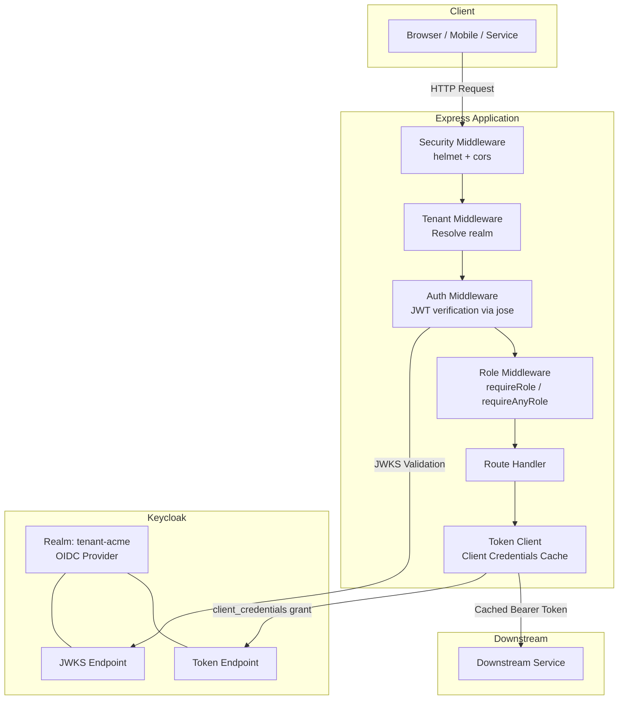
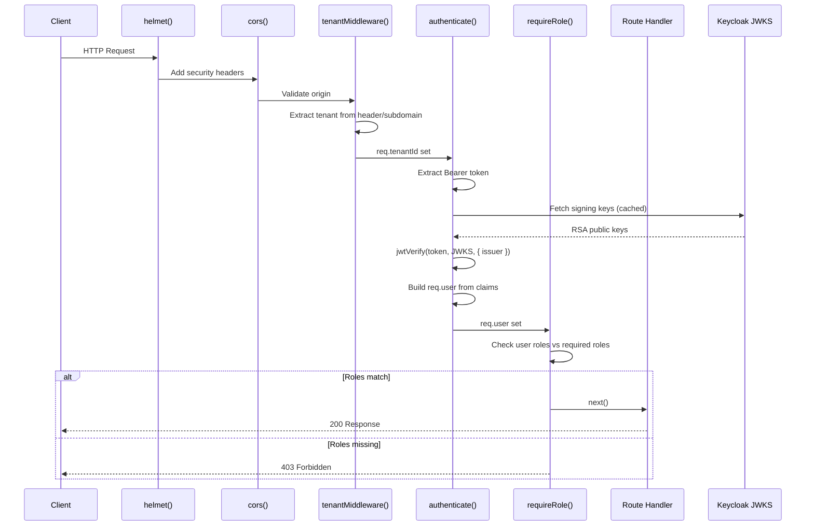
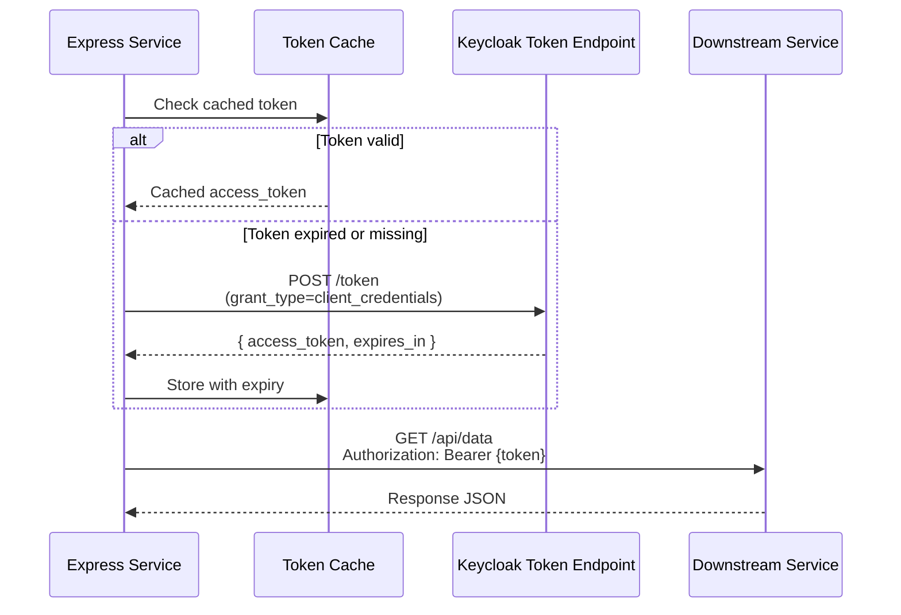
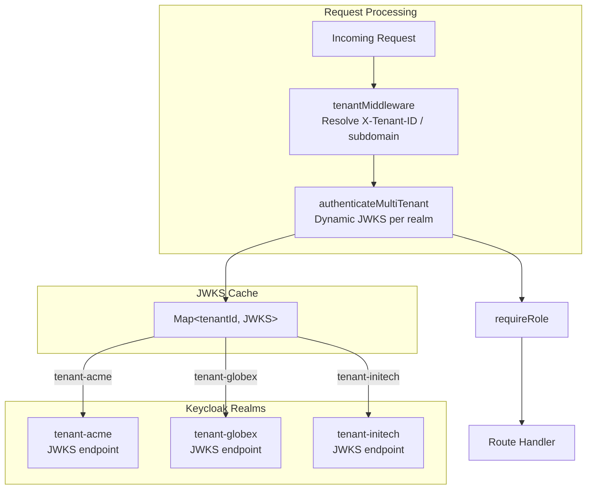

# 14-04. Node.js 22 / Express Integration Guide

## Table of Contents

- [1. Overview](#1-overview)
- [2. Prerequisites](#2-prerequisites)
- [3. Dependencies](#3-dependencies)
- [4. Project Structure](#4-project-structure)
- [5. Environment Configuration](#5-environment-configuration)
- [6. JWT Validation Middleware](#6-jwt-validation-middleware)
- [7. Role-Checking Middleware](#7-role-checking-middleware)
- [8. Tenant Extraction Middleware](#8-tenant-extraction-middleware)
- [9. Security Middleware](#9-security-middleware)
- [10. Example Routes](#10-example-routes)
- [11. Service-to-Service Calls with Client Credentials](#11-service-to-service-calls-with-client-credentials)
- [12. Multi-Tenant Support](#12-multi-tenant-support)
- [13. Error Handling Middleware](#13-error-handling-middleware)
- [14. OpenTelemetry Instrumentation](#14-opentelemetry-instrumentation)
- [15. Testing](#15-testing)
- [16. Docker Compose for Local Development](#16-docker-compose-for-local-development)
- [17. Related Documents](#17-related-documents)

---

## 1. Overview

This guide provides a complete, production-ready integration of a Node.js 22 / Express application with the Keycloak IAM platform. The approach uses modern ES modules, the `jose` library for standards-compliant JWT verification via JWKS, and `openid-client` for OIDC discovery. No Passport dependency is required -- this guide favors lightweight, explicit middleware over framework abstractions.



### Request Lifecycle



---

## 2. Prerequisites

| Requirement | Version | Notes |
|---|---|---|
| Node.js | 22.x LTS | Required for native fetch, ES module support, and modern V8 features |
| npm | 10.x+ | Ships with Node.js 22.x |
| Keycloak | 26.x | Running instance with at least one realm configured |
| ES Modules | `"type": "module"` | Set in `package.json` -- all code uses `import`/`export` |

Verify your environment:

```bash
node --version    # v22.x.x
npm --version     # 10.x.x
```

### package.json Module Configuration

```json
{
  "name": "express-keycloak-api",
  "version": "1.0.0",
  "type": "module",
  "engines": {
    "node": ">=22.0.0"
  }
}
```

---

## 3. Dependencies

```bash
# Core
npm install express jose openid-client dotenv

# Security
npm install helmet cors

# OpenTelemetry
npm install @opentelemetry/sdk-node \
            @opentelemetry/auto-instrumentations-node \
            @opentelemetry/api \
            @opentelemetry/semantic-conventions \
            @opentelemetry/exporter-trace-otlp-http \
            @opentelemetry/exporter-metrics-otlp-http

# Development / Testing
npm install -D supertest jest @jest/globals
```

### Dependency Summary

| Package | Purpose |
|---|---|
| `express` | Minimal HTTP framework |
| `jose` | JWT verification, JWK set resolution (standards-compliant, no native deps) |
| `openid-client` | OIDC discovery for dynamic configuration |
| `dotenv` | Load environment variables from `.env` |
| `helmet` | Set secure HTTP response headers |
| `cors` | Cross-Origin Resource Sharing configuration |
| `@opentelemetry/sdk-node` | OpenTelemetry Node.js SDK |
| `@opentelemetry/auto-instrumentations-node` | Automatic instrumentation for HTTP, Express |
| `supertest` | HTTP assertion library for testing |
| `jest` | Test runner |

---

## 4. Project Structure

```
src/
  middleware/
    authenticate.js
    roles.js
    tenant.js
    error-handler.js
    security.js
  clients/
    token-client.js
    downstream-client.js
  routes/
    public.js
    profile.js
    admin.js
    tenant-data.js
  config/
    keycloak.js
  telemetry/
    tracing.js
    otel-middleware.js
  app.js
  server.js
test/
  auth.test.js
  roles.test.js
  helpers/
    mock-jwks.js
    token-factory.js
docker-compose.yml
.env
.env.example
package.json
```

---

## 5. Environment Configuration

### .env.example

```env
# Application
PORT=3000
NODE_ENV=development
CORS_ORIGIN=http://localhost:3001
APP_URL=http://localhost:3000

# Session
SESSION_SECRET=change-me-to-a-random-string
# Set to "true" only when the app is behind a TLS-terminating reverse proxy.
COOKIE_SECURE=false

# Keycloak
KEYCLOAK_URL=http://localhost:8080
KEYCLOAK_REALM=tenant-acme
KEYCLOAK_CLIENT_ID=acme-api
KEYCLOAK_CLIENT_SECRET=your-client-secret

# Public Keycloak URL reachable by the browser (for login and logout redirects).
# Only needed in Docker where KEYCLOAK_URL points to an internal hostname.
# KEYCLOAK_URL_PUBLIC=http://localhost:8080

# Downstream services
DOWNSTREAM_API_URL=http://localhost:4000

# OpenTelemetry
OTEL_SERVICE_NAME=express-acme-api
OTEL_EXPORTER_OTLP_ENDPOINT=http://localhost:4318
```

### src/config/keycloak.js

```javascript
// src/config/keycloak.js
import 'dotenv/config';

/** Internal Keycloak URL for server-to-server calls (token exchange, userinfo). */
const KEYCLOAK_URL = process.env.KEYCLOAK_URL || 'https://iam.example.com';

/**
 * Browser-reachable Keycloak URL for authorization and logout redirects.
 *
 * In Docker, KEYCLOAK_URL points to an internal hostname (e.g. iam-keycloak)
 * unreachable by the browser. This variable provides the localhost URL that
 * the browser can reach. Falls back to KEYCLOAK_URL when not set.
 */
const KEYCLOAK_URL_PUBLIC = process.env.KEYCLOAK_URL_PUBLIC || KEYCLOAK_URL;

const REALM = process.env.KEYCLOAK_REALM || 'tenant-acme';

export const keycloakConfig = {
  url: KEYCLOAK_URL,
  urlPublic: KEYCLOAK_URL_PUBLIC,
  realm: REALM,
  clientId: process.env.KEYCLOAK_CLIENT_ID || 'acme-api',
  clientSecret: process.env.KEYCLOAK_CLIENT_SECRET || '',

  /** Issuer must match the iss claim in tokens (use the public URL). */
  get issuer() {
    return `${this.urlPublic}/realms/${this.realm}`;
  },

  /** JWKS endpoint -- server-to-server (use internal URL). */
  get jwksUri() {
    return `${this.url}/realms/${this.realm}/protocol/openid-connect/certs`;
  },

  /** Token endpoint -- server-to-server (use internal URL). */
  get tokenEndpoint() {
    return `${this.url}/realms/${this.realm}/protocol/openid-connect/token`;
  },

  /** Userinfo endpoint -- server-to-server (use internal URL). */
  get userinfoEndpoint() {
    return `${this.url}/realms/${this.realm}/protocol/openid-connect/userinfo`;
  },

  /** Authorization URL -- browser-facing (use public URL). */
  get authorizationUrl() {
    return `${this.urlPublic}/realms/${this.realm}/protocol/openid-connect/auth`;
  },
};
```

> **Important -- Dual URL Pattern for Docker Deployments**
>
> When running inside Docker, the Express container reaches Keycloak via its
> internal hostname (e.g. `http://iam-keycloak:8080`), but the browser must use
> a URL it can resolve (e.g. `http://localhost:8080`). Keycloak with
> `KC_HOSTNAME_BACKCHANNEL_DYNAMIC=true` always reports the public hostname as
> the `iss` claim in tokens. Therefore:
>
> - **Browser-facing URLs** (authorization, logout) must use `KEYCLOAK_URL_PUBLIC`.
> - **Server-to-server URLs** (token exchange, JWKS, userinfo) use `KEYCLOAK_URL`.
> - The **issuer** configured in the OIDC strategy must match the public URL
>   (it is compared against the `iss` claim in the ID token).

---

## 6. JWT Validation Middleware

The `authenticate` middleware uses `jose` to verify JWTs against Keycloak's JWKS endpoint. The `createRemoteJWKSet` function handles key fetching, caching, and rotation automatically.

```javascript
// src/middleware/authenticate.js
import { createRemoteJWKSet, jwtVerify } from 'jose';
import { keycloakConfig } from '../config/keycloak.js';

const JWKS = createRemoteJWKSet(new URL(keycloakConfig.jwksUri));

/**
 * Express middleware that validates the Bearer JWT token.
 *
 * On success, sets req.user with the following shape:
 *   { sub, email, username, realmRoles, clientRoles, tenantId, rawToken }
 *
 * On failure, responds with 401.
 */
export async function authenticate(req, res, next) {
  const authHeader = req.headers.authorization;

  if (!authHeader || !authHeader.startsWith('Bearer ')) {
    return res.status(401).json({
      statusCode: 401,
      error: 'AUTHENTICATION_REQUIRED',
      message: 'Missing or malformed Authorization header. Expected: Bearer <token>',
    });
  }

  const token = authHeader.slice(7);

  try {
    const { payload } = await jwtVerify(token, JWKS, {
      issuer: keycloakConfig.issuer,
      algorithms: ['RS256'],
    });

    req.user = {
      sub: payload.sub,
      email: payload.email ?? '',
      username: payload.preferred_username ?? '',
      realmRoles: payload.realm_access?.roles ?? [],
      clientRoles:
        payload.resource_access?.[keycloakConfig.clientId]?.roles ?? [],
      tenantId: payload.tenant_id ?? null,
      rawToken: token,
    };

    next();
  } catch (err) {
    const message =
      err.code === 'ERR_JWT_EXPIRED'
        ? 'Token has expired'
        : err.code === 'ERR_JWS_SIGNATURE_VERIFICATION_FAILED'
          ? 'Token signature verification failed'
          : 'Invalid token';

    return res.status(401).json({
      statusCode: 401,
      error: 'INVALID_TOKEN',
      message,
    });
  }
}
```

### Key Validation Parameters

| Parameter | Value | Purpose |
|---|---|---|
| `issuer` | `https://iam.example.com/realms/{realm}` | Validates `iss` claim matches expected Keycloak realm |
| `algorithms` | `['RS256']` | Accept only RS256-signed tokens |
| JWKS caching | Built into `createRemoteJWKSet` | Automatic key rotation handling with HTTP caching headers |

### Claims Extraction Summary

| JWT Claim | `req.user` Field | Source |
|---|---|---|
| `sub` | `sub` | Standard OIDC subject identifier |
| `email` | `email` | Keycloak user attribute |
| `preferred_username` | `username` | Keycloak username |
| `realm_access.roles` | `realmRoles` | Realm-level roles array |
| `resource_access.{clientId}.roles` | `clientRoles` | Client-level roles array |
| `tenant_id` | `tenantId` | Custom claim (requires Keycloak mapper) |

---

## 7. Role-Checking Middleware

### requireRole (all listed roles required)

```javascript
// src/middleware/roles.js

/**
 * Requires the user to have ALL of the specified roles.
 * Checks both realm roles and client roles.
 *
 * @param  {...string} roles - Required roles
 * @returns {Function} Express middleware
 */
export function requireRole(...roles) {
  return (req, res, next) => {
    if (!req.user) {
      return res.status(401).json({
        statusCode: 401,
        error: 'AUTHENTICATION_REQUIRED',
        message: 'Authentication is required before role checking',
      });
    }

    const userRoles = new Set([
      ...req.user.realmRoles,
      ...req.user.clientRoles,
    ]);

    const missingRoles = roles.filter((role) => !userRoles.has(role));

    if (missingRoles.length > 0) {
      return res.status(403).json({
        statusCode: 403,
        error: 'INSUFFICIENT_PERMISSIONS',
        message: 'You do not have the required permissions to access this resource',
      });
    }

    next();
  };
}

/**
 * Requires the user to have AT LEAST ONE of the specified roles.
 * Checks both realm roles and client roles.
 *
 * @param  {...string} roles - Acceptable roles (any one is sufficient)
 * @returns {Function} Express middleware
 */
export function requireAnyRole(...roles) {
  return (req, res, next) => {
    if (!req.user) {
      return res.status(401).json({
        statusCode: 401,
        error: 'AUTHENTICATION_REQUIRED',
        message: 'Authentication is required before role checking',
      });
    }

    const userRoles = new Set([
      ...req.user.realmRoles,
      ...req.user.clientRoles,
    ]);

    const hasAny = roles.some((role) => userRoles.has(role));

    if (!hasAny) {
      return res.status(403).json({
        statusCode: 403,
        error: 'INSUFFICIENT_PERMISSIONS',
        message: 'You do not have the required permissions to access this resource',
      });
    }

    next();
  };
}
```

### Middleware Composition Examples

| Pattern | Middleware Stack | Behavior |
|---|---|---|
| Public | None | No auth needed |
| Authenticated | `authenticate` | Any valid token accepted |
| Single role | `authenticate`, `requireRole('admin')` | Must have `admin` role |
| Any of several | `authenticate`, `requireAnyRole('editor', 'admin')` | Must have at least one |
| Multiple required | `authenticate`, `requireRole('user', 'verified')` | Must have both roles |

---

## 8. Tenant Extraction Middleware

```javascript
// src/middleware/tenant.js

const ALLOWED_TENANTS = new Set([
  'tenant-acme',
  'tenant-globex',
  'tenant-initech',
]);

/**
 * Extracts tenant identifier from the request.
 *
 * Resolution order:
 *   1. X-Tenant-ID header
 *   2. Subdomain (e.g., acme.api.example.com -> tenant-acme)
 *
 * Sets req.tenantId on success.
 */
export function tenantMiddleware(req, res, next) {
  // Strategy 1: Explicit header
  let tenantId = req.headers['x-tenant-id'];

  // Strategy 2: Subdomain extraction
  if (!tenantId) {
    const host = req.hostname;
    const subdomain = host.split('.')[0];
    if (subdomain && subdomain !== 'api' && subdomain !== 'www' && subdomain !== 'localhost') {
      tenantId = `tenant-${subdomain}`;
    }
  }

  if (!tenantId) {
    return res.status(400).json({
      statusCode: 400,
      error: 'TENANT_REQUIRED',
      message: 'Tenant identification required. Provide X-Tenant-ID header or use a tenant subdomain.',
    });
  }

  if (!ALLOWED_TENANTS.has(tenantId)) {
    return res.status(400).json({
      statusCode: 400,
      error: 'UNKNOWN_TENANT',
      message: `Unknown tenant: ${tenantId}`,
    });
  }

  req.tenantId = tenantId;
  next();
}
```

---

## 9. Security Middleware

### Helmet and CORS Configuration

```javascript
// src/middleware/security.js
import helmet from 'helmet';
import cors from 'cors';

/**
 * Helmet configuration.
 * Sets security-related HTTP response headers.
 */
export const securityHeaders = helmet({
  contentSecurityPolicy: {
    directives: {
      defaultSrc: ["'self'"],
      scriptSrc: ["'self'"],
      styleSrc: ["'self'", "'unsafe-inline'"],
      imgSrc: ["'self'", 'data:'],
      connectSrc: ["'self'", process.env.KEYCLOAK_URL || 'https://iam.example.com'],
      frameSrc: ["'none'"],
      objectSrc: ["'none'"],
    },
  },
  crossOriginEmbedderPolicy: true,
  crossOriginOpenerPolicy: true,
  crossOriginResourcePolicy: { policy: 'same-origin' },
  hsts: { maxAge: 31536000, includeSubDomains: true, preload: true },
  referrerPolicy: { policy: 'strict-origin-when-cross-origin' },
});

/**
 * CORS configuration for Keycloak-integrated applications.
 *
 * Allows the frontend origin and Keycloak origin to make credentialed requests.
 */
export const corsMiddleware = cors({
  origin: (origin, callback) => {
    const allowedOrigins = [
      process.env.CORS_ORIGIN || 'http://localhost:3001',
      process.env.KEYCLOAK_URL || 'http://localhost:8080',
    ];

    // Allow requests with no origin (server-to-server, curl, etc.)
    if (!origin || allowedOrigins.includes(origin)) {
      callback(null, true);
    } else {
      callback(new Error(`Origin ${origin} not allowed by CORS`));
    }
  },
  credentials: true,
  methods: ['GET', 'POST', 'PUT', 'PATCH', 'DELETE', 'OPTIONS'],
  allowedHeaders: ['Content-Type', 'Authorization', 'X-Tenant-ID'],
  exposedHeaders: ['X-Request-Id'],
  maxAge: 86400,
});
```

### Security Headers Summary

| Header | Value | Purpose |
|---|---|---|
| `Strict-Transport-Security` | `max-age=31536000; includeSubDomains; preload` | Force HTTPS |
| `Content-Security-Policy` | Restrictive directives | Prevent XSS, injection |
| `X-Content-Type-Options` | `nosniff` | Prevent MIME sniffing |
| `X-Frame-Options` | `DENY` | Prevent clickjacking |
| `Referrer-Policy` | `strict-origin-when-cross-origin` | Control referrer leakage |

---

## 10. Example Routes

### Application Entry Point

```javascript
// src/app.js
import express from 'express';
import { securityHeaders, corsMiddleware } from './middleware/security.js';
import { authenticate } from './middleware/authenticate.js';
import { requireRole, requireAnyRole } from './middleware/roles.js';
import { tenantMiddleware } from './middleware/tenant.js';
import { errorHandler } from './middleware/error-handler.js';

const app = express();

// --- Global middleware ---
app.use(securityHeaders);
app.use(corsMiddleware);
app.use(express.json({ limit: '1mb' }));

// --- Public routes (no auth) ---

app.get('/api/public/health', (_req, res) => {
  res.json({
    status: 'ok',
    timestamp: new Date().toISOString(),
    version: process.env.npm_package_version || '1.0.0',
  });
});

app.get('/api/public/ready', (_req, res) => {
  // Readiness check -- could verify Keycloak connectivity
  res.json({ ready: true });
});

// --- Authenticated routes ---

app.get('/api/profile', authenticate, (req, res) => {
  res.json({
    sub: req.user.sub,
    email: req.user.email,
    username: req.user.username,
    realmRoles: req.user.realmRoles,
    clientRoles: req.user.clientRoles,
  });
});

app.get('/api/me/roles', authenticate, (req, res) => {
  res.json({
    realm: req.user.realmRoles,
    client: req.user.clientRoles,
    combined: [...req.user.realmRoles, ...req.user.clientRoles],
  });
});

// --- Role-protected routes ---

app.get('/api/admin/users', authenticate, requireRole('admin'), (_req, res) => {
  res.json({ users: [] });
});

app.delete(
  '/api/admin/users/:userId',
  authenticate,
  requireRole('admin'),
  (req, res) => {
    res.json({ deleted: true, userId: req.params.userId });
  },
);

app.put(
  '/api/documents/:id',
  authenticate,
  requireAnyRole('editor', 'admin'),
  (req, res) => {
    res.json({ documentId: req.params.id, updated: true });
  },
);

// --- Tenant-scoped routes ---

app.get(
  '/api/tenant/data',
  tenantMiddleware,
  authenticate,
  (req, res) => {
    res.json({
      tenantId: req.tenantId,
      userId: req.user.sub,
      message: `Data for tenant ${req.tenantId}`,
    });
  },
);

// --- Error handler (must be last) ---
app.use(errorHandler);

export default app;
```

### Server Entry Point

```javascript
// src/server.js
import 'dotenv/config';
import app from './app.js';

const PORT = parseInt(process.env.PORT || '3000', 10);

app.listen(PORT, () => {
  console.log(`[server] Listening on port ${PORT}`);
  console.log(`[server] Health check: http://localhost:${PORT}/api/public/health`);
});
```

---

## 11. Service-to-Service Calls with Client Credentials

### Token Client with Caching

```javascript
// src/clients/token-client.js
import { keycloakConfig } from '../config/keycloak.js';

/**
 * Client credentials token manager with automatic caching and refresh.
 */
class TokenClient {
  #cache = new Map();
  #EXPIRY_BUFFER_MS = 30_000; // Refresh 30s before expiry

  /**
   * Obtain a client credentials access token.
   * Returns a cached token if still valid.
   *
   * @param {string} [scope='openid'] - Requested scope
   * @returns {Promise<string>} Access token
   */
  async getToken(scope = 'openid') {
    const cacheKey = `cc:${scope}`;
    const cached = this.#cache.get(cacheKey);

    if (cached && Date.now() < cached.expiresAt - this.#EXPIRY_BUFFER_MS) {
      return cached.accessToken;
    }

    const params = new URLSearchParams({
      grant_type: 'client_credentials',
      client_id: keycloakConfig.clientId,
      client_secret: keycloakConfig.clientSecret,
      scope,
    });

    const response = await fetch(keycloakConfig.tokenEndpoint, {
      method: 'POST',
      headers: { 'Content-Type': 'application/x-www-form-urlencoded' },
      body: params.toString(),
      signal: AbortSignal.timeout(5_000),
    });

    if (!response.ok) {
      const body = await response.text();
      throw new Error(
        `Client credentials token request failed: ${response.status} ${body}`,
      );
    }

    const data = await response.json();

    this.#cache.set(cacheKey, {
      accessToken: data.access_token,
      expiresAt: Date.now() + data.expires_in * 1000,
    });

    return data.access_token;
  }

  /**
   * Invalidate all cached tokens.
   */
  clearCache() {
    this.#cache.clear();
  }
}

export const tokenClient = new TokenClient();
```

### Downstream API Client

```javascript
// src/clients/downstream-client.js
import { tokenClient } from './token-client.js';

const DOWNSTREAM_URL =
  process.env.DOWNSTREAM_API_URL || 'http://localhost:4000';

/**
 * Call a downstream service using client credentials authentication.
 *
 * @param {string} path - API path (e.g., '/api/data')
 * @param {object} [options] - Additional fetch options
 * @returns {Promise<any>} Parsed JSON response
 */
export async function callDownstream(path, options = {}) {
  const token = await tokenClient.getToken();

  const response = await fetch(`${DOWNSTREAM_URL}${path}`, {
    ...options,
    headers: {
      Authorization: `Bearer ${token}`,
      'Content-Type': 'application/json',
      ...options.headers,
    },
    signal: options.signal ?? AbortSignal.timeout(10_000),
  });

  if (!response.ok) {
    throw new Error(
      `Downstream call failed: ${response.status} ${response.statusText}`,
    );
  }

  return response.json();
}
```

### Client Credentials Flow



---

## 12. Multi-Tenant Support

In a multi-tenant deployment, each tenant maps to a separate Keycloak realm. The application must dynamically resolve the JWKS endpoint based on the tenant identified in the request.

### Dynamic JWKS Resolution

```javascript
// src/middleware/authenticate-multi-tenant.js
import { createRemoteJWKSet, jwtVerify } from 'jose';

const KEYCLOAK_URL = process.env.KEYCLOAK_URL || 'https://iam.example.com';
const CLIENT_ID = process.env.KEYCLOAK_CLIENT_ID || 'acme-api';

// Cache JWKS instances per tenant to avoid repeated construction
const jwksCache = new Map();

/**
 * Returns a cached createRemoteJWKSet instance for the given tenant realm.
 *
 * @param {string} tenantId - Tenant/realm identifier
 * @returns {Function} JWKS key resolution function
 */
function getJWKS(tenantId) {
  if (!jwksCache.has(tenantId)) {
    const jwksUri = `${KEYCLOAK_URL}/realms/${tenantId}/protocol/openid-connect/certs`;
    jwksCache.set(tenantId, createRemoteJWKSet(new URL(jwksUri)));
  }
  return jwksCache.get(tenantId);
}

/**
 * Multi-tenant JWT authentication middleware.
 *
 * Requires req.tenantId to be set (by tenantMiddleware).
 * Validates the JWT against the tenant-specific JWKS endpoint.
 */
export async function authenticateMultiTenant(req, res, next) {
  const tenantId = req.tenantId;

  if (!tenantId) {
    return res.status(400).json({
      statusCode: 400,
      error: 'TENANT_REQUIRED',
      message: 'Tenant must be resolved before authentication',
    });
  }

  const authHeader = req.headers.authorization;

  if (!authHeader || !authHeader.startsWith('Bearer ')) {
    return res.status(401).json({
      statusCode: 401,
      error: 'AUTHENTICATION_REQUIRED',
      message: 'Missing or malformed Authorization header',
    });
  }

  const token = authHeader.slice(7);
  const expectedIssuer = `${KEYCLOAK_URL}/realms/${tenantId}`;

  try {
    const JWKS = getJWKS(tenantId);

    const { payload } = await jwtVerify(token, JWKS, {
      issuer: expectedIssuer,
      algorithms: ['RS256'],
    });

    req.user = {
      sub: payload.sub,
      email: payload.email ?? '',
      username: payload.preferred_username ?? '',
      realmRoles: payload.realm_access?.roles ?? [],
      clientRoles: payload.resource_access?.[CLIENT_ID]?.roles ?? [],
      tenantId,
      rawToken: token,
    };

    next();
  } catch (err) {
    const message =
      err.code === 'ERR_JWT_EXPIRED'
        ? 'Token has expired'
        : err.code === 'ERR_JWS_SIGNATURE_VERIFICATION_FAILED'
          ? 'Token signature verification failed'
          : 'Invalid token';

    return res.status(401).json({
      statusCode: 401,
      error: 'INVALID_TOKEN',
      message,
    });
  }
}
```

### Multi-Tenant Route Example

```javascript
// Multi-tenant route composition
import { tenantMiddleware } from './middleware/tenant.js';
import { authenticateMultiTenant } from './middleware/authenticate-multi-tenant.js';
import { requireRole } from './middleware/roles.js';

// All tenant routes use the tenant + multi-tenant auth pipeline
app.get(
  '/api/tenant/profile',
  tenantMiddleware,
  authenticateMultiTenant,
  (req, res) => {
    res.json({
      tenant: req.tenantId,
      user: req.user,
    });
  },
);

app.get(
  '/api/tenant/admin/settings',
  tenantMiddleware,
  authenticateMultiTenant,
  requireRole('admin'),
  (req, res) => {
    res.json({
      tenant: req.tenantId,
      settings: {},
    });
  },
);
```

### Multi-Tenant Architecture



### Tenant Resolution Strategies

| Strategy | Header / Pattern | Pros | Cons |
|---|---|---|---|
| `X-Tenant-ID` header | `X-Tenant-ID: tenant-acme` | Explicit, easy to test | Requires client cooperation |
| Subdomain | `acme.api.example.com` | Clean separation, transparent | Requires wildcard DNS + TLS |
| Path prefix | `/tenant-acme/api/...` | Simple setup | Pollutes URL namespace |
| JWT claim | `tenant_id` in token body | No extra header needed | Requires custom Keycloak mapper |

---

## 13. Error Handling Middleware

```javascript
// src/middleware/error-handler.js

/**
 * Central error handling middleware.
 *
 * Catches all unhandled errors and returns structured JSON responses.
 * Auth-specific errors produce appropriate HTTP status codes.
 */
export function errorHandler(err, req, res, _next) {
  // CORS rejection
  if (err.message && err.message.includes('not allowed by CORS')) {
    return res.status(403).json({
      statusCode: 403,
      error: 'CORS_REJECTED',
      message: 'Cross-origin request not allowed',
      timestamp: new Date().toISOString(),
      path: req.originalUrl,
    });
  }

  // JSON parse error
  if (err.type === 'entity.parse.failed') {
    return res.status(400).json({
      statusCode: 400,
      error: 'INVALID_JSON',
      message: 'Request body contains invalid JSON',
      timestamp: new Date().toISOString(),
      path: req.originalUrl,
    });
  }

  // Payload too large
  if (err.type === 'entity.too.large') {
    return res.status(413).json({
      statusCode: 413,
      error: 'PAYLOAD_TOO_LARGE',
      message: 'Request body exceeds size limit',
      timestamp: new Date().toISOString(),
      path: req.originalUrl,
    });
  }

  // Default server error
  const statusCode = err.statusCode || err.status || 500;

  console.error(
    `[error] ${req.method} ${req.originalUrl} -> ${statusCode}:`,
    err.message,
  );

  // Do not leak internal error details in production
  const message =
    process.env.NODE_ENV === 'production' && statusCode === 500
      ? 'Internal server error'
      : err.message;

  res.status(statusCode).json({
    statusCode,
    error: 'INTERNAL_ERROR',
    message,
    timestamp: new Date().toISOString(),
    path: req.originalUrl,
  });
}
```

### Error Response Format

All error responses follow a consistent shape:

```json
{
  "statusCode": 401,
  "error": "INVALID_TOKEN",
  "message": "Token has expired",
  "timestamp": "2026-03-07T12:00:00.000Z",
  "path": "/api/profile"
}
```

| Field | Type | Description |
|---|---|---|
| `statusCode` | number | HTTP status code |
| `error` | string | Machine-readable error code |
| `message` | string | Human-readable description (sanitized in production) |
| `timestamp` | string | ISO 8601 timestamp |
| `path` | string | Request path |

### Error Code Reference

| Error Code | HTTP Status | Cause |
|---|---|---|
| `AUTHENTICATION_REQUIRED` | 401 | No Bearer token provided |
| `INVALID_TOKEN` | 401 | Token expired, signature invalid, or malformed |
| `INSUFFICIENT_PERMISSIONS` | 403 | Valid token but missing required role |
| `CORS_REJECTED` | 403 | Origin not in allowed list |
| `TENANT_REQUIRED` | 400 | No tenant identifier found in request |
| `UNKNOWN_TENANT` | 400 | Tenant not in allowed list |
| `INVALID_JSON` | 400 | Malformed JSON request body |
| `PAYLOAD_TOO_LARGE` | 413 | Request body exceeds configured limit |
| `INTERNAL_ERROR` | 500 | Unhandled server error |

---

## 14. OpenTelemetry Instrumentation

### Tracing Bootstrap

The tracing configuration must be loaded **before** the Express application starts. Use Node.js `--import` flag (ES modules) to ensure early initialization.

```javascript
// src/telemetry/tracing.js
import { NodeSDK } from '@opentelemetry/sdk-node';
import { getNodeAutoInstrumentations } from '@opentelemetry/auto-instrumentations-node';
import { OTLPTraceExporter } from '@opentelemetry/exporter-trace-otlp-http';
import { OTLPMetricExporter } from '@opentelemetry/exporter-metrics-otlp-http';
import { PeriodicExportingMetricReader } from '@opentelemetry/sdk-metrics';
import { Resource } from '@opentelemetry/resources';
import {
  ATTR_SERVICE_NAME,
  ATTR_SERVICE_VERSION,
} from '@opentelemetry/semantic-conventions';

const resource = new Resource({
  [ATTR_SERVICE_NAME]: process.env.OTEL_SERVICE_NAME || 'express-acme-api',
  [ATTR_SERVICE_VERSION]: process.env.npm_package_version || '1.0.0',
});

const traceExporter = new OTLPTraceExporter({
  url: `${process.env.OTEL_EXPORTER_OTLP_ENDPOINT || 'http://localhost:4318'}/v1/traces`,
});

const metricExporter = new OTLPMetricExporter({
  url: `${process.env.OTEL_EXPORTER_OTLP_ENDPOINT || 'http://localhost:4318'}/v1/metrics`,
});

const sdk = new NodeSDK({
  resource,
  traceExporter,
  metricReader: new PeriodicExportingMetricReader({
    exporter: metricExporter,
    exportIntervalMillis: 15_000,
  }),
  instrumentations: [
    getNodeAutoInstrumentations({
      '@opentelemetry/instrumentation-http': {
        ignoreIncomingPaths: ['/api/public/health', '/api/public/ready'],
      },
      '@opentelemetry/instrumentation-fs': { enabled: false },
    }),
  ],
});

sdk.start();

process.on('SIGTERM', () => {
  sdk.shutdown().then(
    () => console.log('[otel] Shutdown complete'),
    (err) => console.error('[otel] Shutdown error', err),
  );
});
```

Start with tracing:

```json
{
  "scripts": {
    "start": "node --import ./src/telemetry/tracing.js src/server.js",
    "dev": "node --watch --import ./src/telemetry/tracing.js src/server.js"
  }
}
```

### Adding User Context to Spans and Custom Metrics

```javascript
// src/telemetry/otel-middleware.js
import { trace, SpanStatusCode, metrics } from '@opentelemetry/api';

const meter = metrics.getMeter('express-auth');

const authSuccessCounter = meter.createCounter('auth.success.total', {
  description: 'Total successful authentications',
});

const authFailureCounter = meter.createCounter('auth.failure.total', {
  description: 'Total authentication failures',
});

const requestDurationHistogram = meter.createHistogram(
  'http.auth_request.duration',
  {
    description: 'Duration of authenticated requests in ms',
    unit: 'ms',
  },
);

/**
 * Middleware that enriches the active OpenTelemetry span with user identity
 * attributes and records custom auth metrics.
 *
 * Place AFTER authenticate middleware.
 */
export function otelUserContext(req, res, next) {
  const span = trace.getActiveSpan();
  const startTime = Date.now();

  if (span && req.user) {
    span.setAttribute('enduser.id', req.user.sub);
    span.setAttribute('enduser.email', req.user.email);
    span.setAttribute('enduser.roles', req.user.realmRoles.join(','));
    if (req.user.tenantId) {
      span.setAttribute('enduser.tenant', req.user.tenantId);
    }
    authSuccessCounter.add(1, {
      tenant: req.user.tenantId ?? 'default',
    });
  }

  // Record duration on response finish
  res.on('finish', () => {
    const duration = Date.now() - startTime;
    const isError = res.statusCode >= 400;

    requestDurationHistogram.record(duration, {
      method: req.method,
      route: req.route?.path ?? req.path,
      status_code: String(res.statusCode),
    });

    if (span && isError) {
      span.setStatus({
        code: SpanStatusCode.ERROR,
        message: `HTTP ${res.statusCode}`,
      });
    }

    if (res.statusCode === 401 || res.statusCode === 403) {
      authFailureCounter.add(1, {
        reason: res.statusCode === 401 ? 'unauthenticated' : 'forbidden',
        path: req.path,
      });
    }
  });

  next();
}
```

### Using the OTel Middleware

```javascript
// In route definitions
app.get(
  '/api/profile',
  authenticate,
  otelUserContext,
  (req, res) => {
    res.json({ sub: req.user.sub, email: req.user.email });
  },
);
```

Or apply globally after authenticate for all authenticated routes:

```javascript
import { otelUserContext } from './telemetry/otel-middleware.js';

// Apply to all routes under /api (except public)
app.use('/api', (req, res, next) => {
  // Skip for public routes
  if (req.path.startsWith('/public')) return next();
  otelUserContext(req, res, next);
});
```

### Custom Metrics Summary

| Metric | Type | Labels | Description |
|---|---|---|---|
| `auth.success.total` | Counter | `tenant` | Successful authentication events |
| `auth.failure.total` | Counter | `reason`, `path` | Failed authentication events |
| `http.auth_request.duration` | Histogram | `method`, `route`, `status_code` | Request duration for authenticated endpoints |

---

## 15. Testing

### Test Helper: Mock JWKS Server

```javascript
// test/helpers/mock-jwks.js
import http from 'node:http';
import { exportJWK, generateKeyPair } from 'jose';

/**
 * Creates a mock JWKS server and key pair for testing.
 *
 * @returns {{ start, stop, publicJwk, privateKey, JWKS_PORT }}
 */
export async function createMockJWKS() {
  const { privateKey, publicKey } = await generateKeyPair('RS256');

  const publicJwk = await exportJWK(publicKey);
  publicJwk.kid = 'test-key-1';
  publicJwk.alg = 'RS256';
  publicJwk.use = 'sig';

  const jwksResponse = JSON.stringify({ keys: [publicJwk] });
  const JWKS_PORT = 9876;

  let server;

  async function start() {
    server = http.createServer((_req, res) => {
      res.writeHead(200, { 'Content-Type': 'application/json' });
      res.end(jwksResponse);
    });
    await new Promise((resolve) => server.listen(JWKS_PORT, resolve));
  }

  async function stop() {
    if (server) {
      await new Promise((resolve) => server.close(resolve));
    }
  }

  return { start, stop, publicJwk, privateKey, JWKS_PORT };
}
```

### Test Helper: Token Factory

```javascript
// test/helpers/token-factory.js
import { SignJWT } from 'jose';

/**
 * Creates a signed JWT for testing purposes.
 *
 * @param {import('jose').KeyLike} privateKey - RSA private key
 * @param {object} [overrides] - Claim overrides
 * @returns {Promise<string>} Signed JWT string
 */
export async function createTestToken(privateKey, overrides = {}) {
  const claims = {
    sub: 'test-user-1',
    email: 'test@acme.com',
    preferred_username: 'testuser',
    realm_access: { roles: ['user'] },
    resource_access: { 'acme-api': { roles: [] } },
    ...overrides,
  };

  return new SignJWT(claims)
    .setProtectedHeader({ alg: 'RS256', kid: 'test-key-1' })
    .setIssuer('http://localhost:9876/realms/tenant-acme')
    .setAudience('account')
    .setExpirationTime('5m')
    .setIssuedAt()
    .sign(privateKey);
}

/**
 * Creates an expired JWT for testing rejection.
 */
export async function createExpiredToken(privateKey) {
  return new SignJWT({ sub: 'expired-user' })
    .setProtectedHeader({ alg: 'RS256', kid: 'test-key-1' })
    .setIssuer('http://localhost:9876/realms/tenant-acme')
    .setExpirationTime('-1m')
    .setIssuedAt(Math.floor(Date.now() / 1000) - 120)
    .sign(privateKey);
}
```

### E2E Test Suite

```javascript
// test/auth.test.js
import { describe, it, beforeAll, afterAll, expect } from '@jest/globals';
import request from 'supertest';
import { createMockJWKS } from './helpers/mock-jwks.js';
import { createTestToken, createExpiredToken } from './helpers/token-factory.js';

describe('Authentication & Authorization E2E', () => {
  let app;
  let mockJwks;

  beforeAll(async () => {
    mockJwks = await createMockJWKS();
    await mockJwks.start();

    // Override env before importing app
    process.env.KEYCLOAK_URL = `http://localhost:${mockJwks.JWKS_PORT}`;
    process.env.KEYCLOAK_REALM = 'tenant-acme';
    process.env.KEYCLOAK_CLIENT_ID = 'acme-api';

    // Dynamic import after env setup
    const module = await import('../src/app.js');
    app = module.default;
  });

  afterAll(async () => {
    await mockJwks.stop();
  });

  // --- Public endpoints ---

  it('GET /api/public/health should return 200 without auth', async () => {
    const res = await request(app)
      .get('/api/public/health')
      .expect(200);

    expect(res.body.status).toBe('ok');
  });

  // --- Authentication ---

  it('GET /api/profile should return 401 without token', async () => {
    await request(app)
      .get('/api/profile')
      .expect(401);
  });

  it('GET /api/profile should return 401 with malformed header', async () => {
    await request(app)
      .get('/api/profile')
      .set('Authorization', 'InvalidScheme abc')
      .expect(401);
  });

  it('GET /api/profile should return 200 with valid token', async () => {
    const token = await createTestToken(mockJwks.privateKey);

    const res = await request(app)
      .get('/api/profile')
      .set('Authorization', `Bearer ${token}`)
      .expect(200);

    expect(res.body.sub).toBe('test-user-1');
    expect(res.body.email).toBe('test@acme.com');
    expect(res.body.realmRoles).toContain('user');
  });

  it('GET /api/profile should return 401 with expired token', async () => {
    const token = await createExpiredToken(mockJwks.privateKey);

    const res = await request(app)
      .get('/api/profile')
      .set('Authorization', `Bearer ${token}`)
      .expect(401);

    expect(res.body.error).toBe('INVALID_TOKEN');
    expect(res.body.message).toBe('Token has expired');
  });

  // --- Role-based authorization ---

  it('GET /api/admin/users should return 403 for non-admin user', async () => {
    const token = await createTestToken(mockJwks.privateKey, {
      realm_access: { roles: ['user'] },
    });

    const res = await request(app)
      .get('/api/admin/users')
      .set('Authorization', `Bearer ${token}`)
      .expect(403);

    expect(res.body.error).toBe('INSUFFICIENT_PERMISSIONS');
  });

  it('GET /api/admin/users should return 200 for admin user', async () => {
    const token = await createTestToken(mockJwks.privateKey, {
      realm_access: { roles: ['admin'] },
    });

    await request(app)
      .get('/api/admin/users')
      .set('Authorization', `Bearer ${token}`)
      .expect(200);
  });

  it('PUT /api/documents/:id should allow editor role', async () => {
    const token = await createTestToken(mockJwks.privateKey, {
      realm_access: { roles: ['editor'] },
    });

    const res = await request(app)
      .put('/api/documents/doc-123')
      .set('Authorization', `Bearer ${token}`)
      .send({ title: 'Updated' })
      .expect(200);

    expect(res.body.documentId).toBe('doc-123');
    expect(res.body.updated).toBe(true);
  });

  it('PUT /api/documents/:id should allow admin role', async () => {
    const token = await createTestToken(mockJwks.privateKey, {
      realm_access: { roles: ['admin'] },
    });

    await request(app)
      .put('/api/documents/doc-456')
      .set('Authorization', `Bearer ${token}`)
      .send({ title: 'Updated' })
      .expect(200);
  });

  it('PUT /api/documents/:id should deny user without editor/admin', async () => {
    const token = await createTestToken(mockJwks.privateKey, {
      realm_access: { roles: ['viewer'] },
    });

    await request(app)
      .put('/api/documents/doc-789')
      .set('Authorization', `Bearer ${token}`)
      .send({ title: 'Updated' })
      .expect(403);
  });

  // --- Client roles ---

  it('should recognize client-level roles', async () => {
    const token = await createTestToken(mockJwks.privateKey, {
      realm_access: { roles: [] },
      resource_access: { 'acme-api': { roles: ['admin'] } },
    });

    await request(app)
      .get('/api/admin/users')
      .set('Authorization', `Bearer ${token}`)
      .expect(200);
  });
});
```

### Running Tests

```bash
# Run all tests
npx jest

# Run with coverage
npx jest --coverage

# Run in watch mode
npx jest --watch
```

### Jest Configuration for ES Modules

```json
// package.json
{
  "jest": {
    "transform": {},
    "testEnvironment": "node",
    "extensionsToTreatAsEsm": [],
    "moduleNameMapper": {}
  }
}
```

Or use the `--experimental-vm-modules` flag:

```bash
NODE_OPTIONS='--experimental-vm-modules' npx jest
```

### Test Summary

| Test Type | Tool | What It Validates |
|---|---|---|
| E2E -- Public routes | supertest | No auth needed, returns health data |
| E2E -- Missing token | supertest | Returns 401 with structured error |
| E2E -- Valid token | supertest + jose | User profile returned, claims extracted |
| E2E -- Expired token | supertest + jose | Returns 401 with specific message |
| E2E -- Role enforcement | supertest + jose | 403 for missing roles, 200 for valid |
| E2E -- Client roles | supertest + jose | Client-level roles recognized |
| Unit -- Middleware | jest mock | Individual middleware behavior in isolation |

---

## 16. Docker Compose for Local Development

```yaml
# docker-compose.yml
services:
  express-app:
    build:
      context: .
      dockerfile: Dockerfile
    environment:
      PORT: 3000
      NODE_ENV: production
      KEYCLOAK_URL: http://iam-keycloak:8080
      KEYCLOAK_URL_PUBLIC: http://localhost:8080
      KEYCLOAK_REALM: tenant-acme
      KEYCLOAK_CLIENT_ID: acme-api
      KEYCLOAK_CLIENT_SECRET: change-me
      APP_URL: http://localhost:3000
      CORS_ORIGIN: http://localhost:3001
      OTEL_SERVICE_NAME: express-acme-api
      OTEL_EXPORTER_OTLP_ENDPOINT: http://otel-collector:4318
    ports:
      - "3000:3000"
    networks:
      - iam-network
    env_file:
      - .env.example

  otel-collector:
    image: otel/opentelemetry-collector-contrib:0.98.0
    command: ["--config=/etc/otel-config.yaml"]
    volumes:
      - ./otel-config.yaml:/etc/otel-config.yaml
    ports:
      - "4318:4318"   # OTLP HTTP receiver
      - "8888:8888"   # Prometheus metrics

networks:
  iam-network:
    external: true
    name: devops_iam-network
```

### Dockerfile

```dockerfile
FROM node:22-alpine
WORKDIR /app
COPY package*.json ./
RUN npm ci --omit=dev
COPY src/ ./src/
EXPOSE 3000
CMD ["node", "--import", "./src/telemetry/tracing.js", "src/server.js"]
```

### Local Development Without Docker

```bash
# Terminal 1: Start Keycloak
docker run --rm -p 8080:8080 \
  -e KC_BOOTSTRAP_ADMIN_USERNAME=admin \
  -e KC_BOOTSTRAP_ADMIN_PASSWORD=admin \
  quay.io/keycloak/keycloak:26.1.0 start-dev

# Terminal 2: Start the application
cp .env.example .env
# Edit .env with your configuration
npm run dev
```

---

## Scripts and DevOps Tooling

Each example project includes a `scripts/` folder with automation scripts for common development and operations tasks. These scripts can be executed independently or through an interactive menu.

### Interactive Menu

Launch the interactive DevOps menu from the project root:

```bash
./scripts/devops-menu.sh
```

The menu presents a numbered list of operations with colored output, prerequisite checks, and error handling.

### Available Scripts

| # | Operation | Independent Command | Description |
|---|-----------|-------------------|-------------|
| 1 | Start Keycloak | `docker-compose up -d keycloak` | Start Keycloak via Docker Compose on port 8080 |
| 2 | Install dependencies | `npm ci` | Install project dependencies using a clean install |
| 3 | Run application | `npm run start:dev` | Start the Express application in development mode with file watching |
| 4 | Run unit tests | `npm test` | Run unit tests with Jest |
| 5 | Run e2e tests | `npm run test:e2e` | Run end-to-end tests with supertest |
| 6 | Generate coverage report | `npm run test:cov` | Generate code coverage report at `coverage/lcov-report/index.html` |
| 7 | Build Docker image | `docker build -t iam-express .` | Build the Docker image for the application |
| 8 | Run with Docker Compose | `docker-compose up` | Start all services with Docker Compose |
| 9 | Lint code | `npm run lint` | Run ESLint on the source code |
| 10 | View application logs | `docker-compose logs -f app` | Follow application container logs |
| 11 | Stop all containers | `docker-compose down` | Stop and remove all Docker Compose containers |
| 12 | Clean | `rm -rf dist node_modules` | Remove build artifacts and installed dependencies |

### Script Location

All scripts are located in the [`examples/node/express/scripts/`](../examples/node/express/scripts/) directory relative to the project root.

---

## 17. Related Documents

- [Client Applications Hub](14-client-applications.md)
- [NestJS 10 Integration Guide](14-03-nestjs.md)
- [Target Architecture](01-target-architecture.md)
- [Authentication and Authorization](08-authentication-authorization.md)
- [Observability](10-observability.md)
- [Security by Design](07-security-by-design.md)
