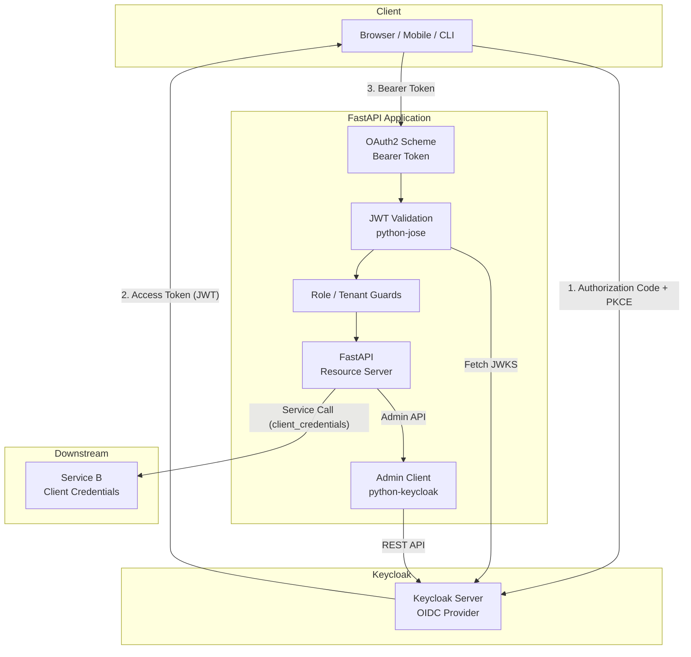
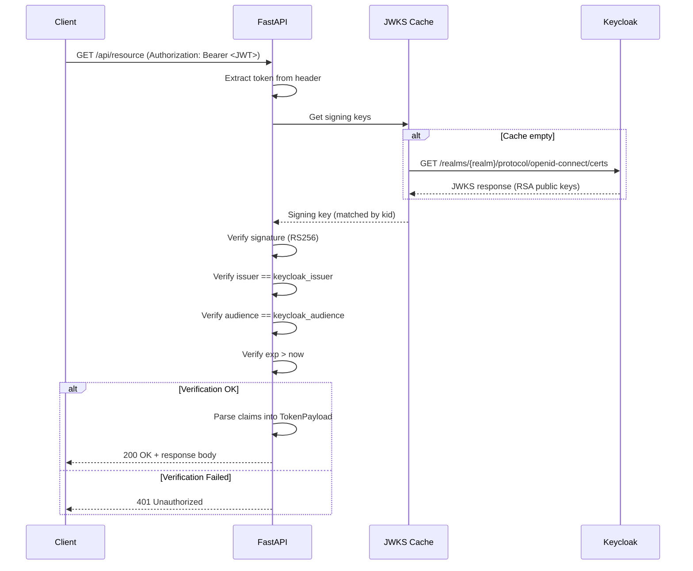
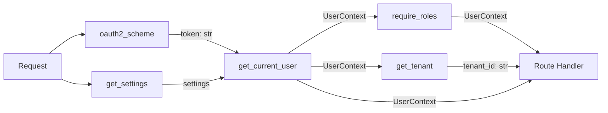
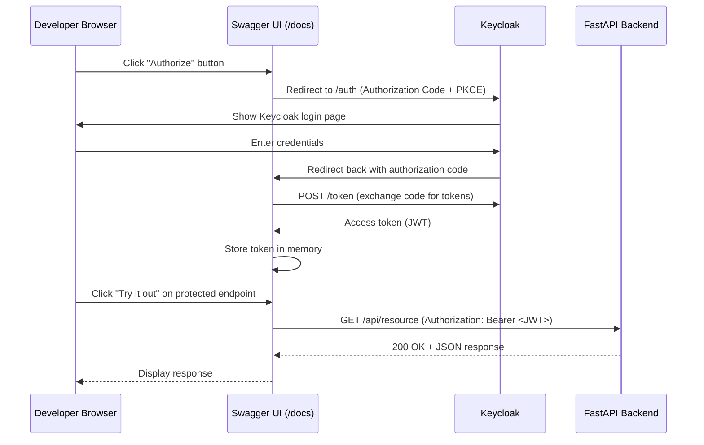
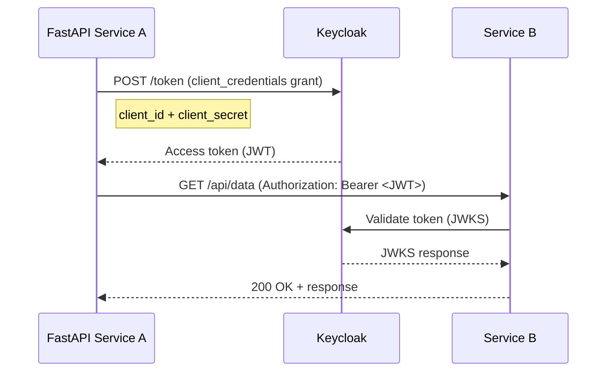
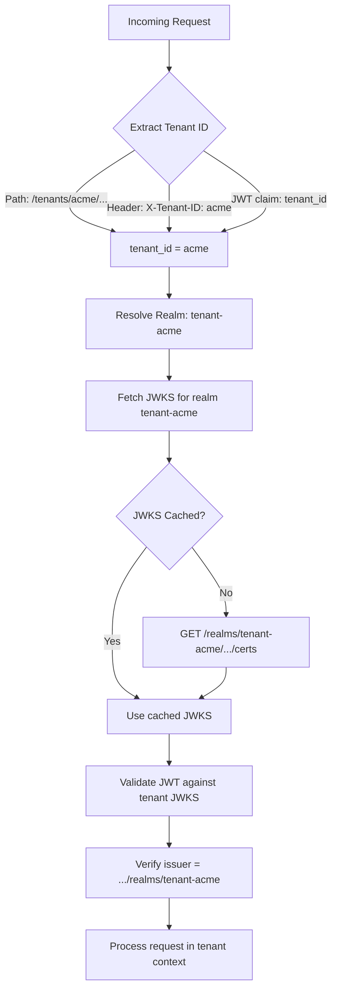
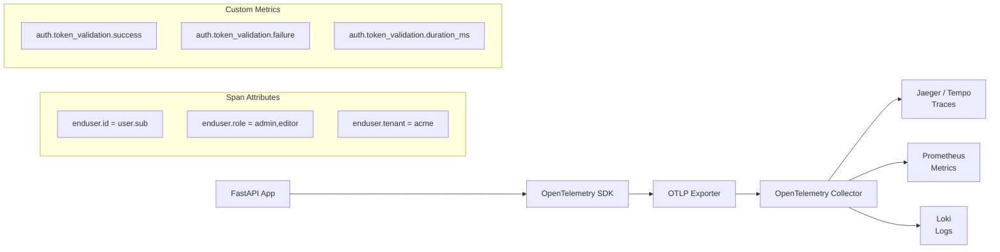

# 14-05. Python 3.12 / FastAPI Integration Guide

> **Project:** Enterprise IAM Platform based on Keycloak
> **Parent document:** [Client Applications Hub](14-client-applications.md)
> **Related documents:** [Authentication and Authorization](08-authentication-authorization.md) | [Observability](10-observability.md) | [Keycloak Configuration](04-keycloak-configuration.md)

---

## Table of Contents

1. [Overview](#1-overview)
2. [Prerequisites](#2-prerequisites)
3. [Dependencies](#3-dependencies)
4. [Project Structure](#4-project-structure)
5. [Configuration with Pydantic Settings](#5-configuration-with-pydantic-settings)
6. [JWT Validation Dependency](#6-jwt-validation-dependency)
7. [Pydantic Models for Token Payload and User Context](#7-pydantic-models-for-token-payload-and-user-context)
8. [FastAPI Authentication Dependencies](#8-fastapi-authentication-dependencies)
9. [OpenAPI and Swagger UI Integration](#9-openapi-and-swagger-ui-integration)
10. [Example Routers](#10-example-routers)
11. [Admin Operations with python-keycloak](#11-admin-operations-with-python-keycloak)
12. [Service-to-Service Calls with Client Credentials](#12-service-to-service-calls-with-client-credentials)
13. [Multi-Tenant Support](#13-multi-tenant-support)
14. [OpenTelemetry Instrumentation](#14-opentelemetry-instrumentation)
15. [Testing](#15-testing)
16. [Dockerfile](#16-dockerfile)
17. [Docker Compose for Local Development](#17-docker-compose-for-local-development)
18. [Troubleshooting](#18-troubleshooting)

---

## 1. Overview

This guide covers the end-to-end integration of a Python 3.12 / FastAPI application with the Keycloak IAM platform. The integration uses OpenID Connect (OIDC) for authentication and JWT-based authorization, following the resource server pattern.



### Authentication Flow Summary

| Step | Actor | Action |
|------|-------|--------|
| 1 | Client | Authenticates with Keycloak via Authorization Code + PKCE |
| 2 | Keycloak | Returns access token (JWT), refresh token, and ID token |
| 3 | Client | Sends request to FastAPI with `Authorization: Bearer <token>` |
| 4 | FastAPI | Extracts token via OAuth2 scheme |
| 5 | FastAPI | Validates JWT signature against Keycloak JWKS endpoint |
| 6 | FastAPI | Verifies issuer, audience, and expiration claims |
| 7 | FastAPI | Extracts roles and tenant context from token claims |
| 8 | FastAPI | Processes request or returns 401/403 |

---

## 2. Prerequisites

| Requirement | Version | Purpose |
|-------------|---------|---------|
| Python | 3.12+ | Runtime |
| pip or Poetry | Latest | Dependency management |
| Keycloak | 26.x | Identity provider |
| Docker | 27.x | Local development environment |
| Docker Compose | 2.x | Multi-container orchestration |

Ensure that a Keycloak realm and client are configured before proceeding:

- **Realm**: `tenant-acme` (or your tenant realm)
- **Client ID**: `acme-api`
- **Client Protocol**: `openid-connect`
- **Access Type**: `confidential` (for service accounts) or `public` (for SPAs forwarding tokens)
- **Valid Redirect URIs**: Configured per environment
- **Client Scopes**: `openid`, `profile`, `email`

---

## 3. Dependencies

### Using pip (requirements.txt)

```text
fastapi==0.115.6
uvicorn[standard]==0.34.0
python-jose[cryptography]==3.3.0
python-keycloak==4.7.3
httpx==0.28.1
pydantic-settings==2.7.1
opentelemetry-sdk==1.29.0
opentelemetry-api==1.29.0
opentelemetry-instrumentation-fastapi==0.50b0
opentelemetry-instrumentation-httpx==0.50b0
opentelemetry-exporter-otlp-proto-grpc==1.29.0
pytest==8.3.4
pytest-asyncio==0.25.0
httpx[http2]==0.28.1
```

### Using Poetry (pyproject.toml)

```toml
[tool.poetry]
name = "acme-fastapi-service"
version = "1.0.0"
description = "FastAPI service integrated with Keycloak IAM"
python = "^3.12"

[tool.poetry.dependencies]
python = "^3.12"
fastapi = "^0.115.6"
uvicorn = {version = "^0.34.0", extras = ["standard"]}
python-jose = {version = "^3.3.0", extras = ["cryptography"]}
python-keycloak = "^4.7.3"
httpx = "^0.28.1"
pydantic-settings = "^2.7.1"

[tool.poetry.group.telemetry.dependencies]
opentelemetry-sdk = "^1.29.0"
opentelemetry-api = "^1.29.0"
opentelemetry-instrumentation-fastapi = "^0.50b0"
opentelemetry-instrumentation-httpx = "^0.50b0"
opentelemetry-exporter-otlp-proto-grpc = "^1.29.0"

[tool.poetry.group.dev.dependencies]
pytest = "^8.3.4"
pytest-asyncio = "^0.25.0"
```

### Dependency Purpose Matrix

| Package | Version | Purpose |
|---------|---------|---------|
| `fastapi` | 0.115.x | ASGI web framework with automatic OpenAPI generation |
| `uvicorn` | 0.34.x | ASGI server for running FastAPI |
| `python-jose[cryptography]` | 3.3.x | JWT decoding, signature verification, JWKS handling |
| `python-keycloak` | 4.x | Keycloak Admin REST API client |
| `httpx` | 0.28.x | Async HTTP client for service-to-service calls |
| `pydantic-settings` | 2.7.x | Environment-based configuration with validation |
| `opentelemetry-*` | 1.29.x / 0.50.x | Distributed tracing, metrics, and instrumentation |

---

## 4. Project Structure

```
app/
  main.py                  # FastAPI application entry point
  config.py                # Pydantic settings and configuration
  auth/
    __init__.py
    dependencies.py        # FastAPI auth dependencies (get_current_user, require_roles)
    models.py              # Pydantic models for token payload, user context
    keycloak_client.py     # python-keycloak admin wrapper
  routers/
    public.py              # Public (unauthenticated) endpoints
    protected.py           # Authenticated and role-protected endpoints
    admin.py               # Keycloak admin operation endpoints
  telemetry/
    setup.py               # OpenTelemetry SDK configuration and instrumentation
tests/
  conftest.py              # Shared fixtures, test JWT generation
  test_auth.py             # Unit tests for auth dependencies
  test_protected.py        # Integration tests for protected endpoints
Dockerfile
docker-compose.yml
pyproject.toml             # Poetry configuration
requirements.txt           # pip alternative
```

---

## 5. Configuration with Pydantic Settings

All configuration values are loaded from environment variables with sensible defaults for local development.

```python
# app/config.py
from pydantic_settings import BaseSettings
from functools import lru_cache


class Settings(BaseSettings):
    """Application settings loaded from environment variables."""

    # Application
    app_name: str = "acme-fastapi-service"
    app_version: str = "1.0.0"
    debug: bool = False

    # Keycloak OIDC
    keycloak_url: str = "https://iam.example.com"
    keycloak_realm: str = "tenant-acme"
    keycloak_client_id: str = "acme-api"
    keycloak_client_secret: str = ""
    keycloak_audience: str = "account"

    # Keycloak Admin (for python-keycloak operations)
    keycloak_admin_client_id: str = "admin-cli"
    keycloak_admin_client_secret: str = ""

    # OpenTelemetry
    otel_service_name: str = "acme-fastapi-service"
    otel_exporter_otlp_endpoint: str = "http://localhost:4317"
    otel_enabled: bool = True

    @property
    def keycloak_issuer(self) -> str:
        return f"{self.keycloak_url}/realms/{self.keycloak_realm}"

    @property
    def keycloak_jwks_url(self) -> str:
        return (
            f"{self.keycloak_url}/realms/{self.keycloak_realm}"
            f"/protocol/openid-connect/certs"
        )

    @property
    def keycloak_token_url(self) -> str:
        return (
            f"{self.keycloak_url}/realms/{self.keycloak_realm}"
            f"/protocol/openid-connect/token"
        )

    @property
    def keycloak_auth_url(self) -> str:
        return (
            f"{self.keycloak_url}/realms/{self.keycloak_realm}"
            f"/protocol/openid-connect/auth"
        )

    @property
    def keycloak_openid_config_url(self) -> str:
        return (
            f"{self.keycloak_url}/realms/{self.keycloak_realm}"
            f"/.well-known/openid-configuration"
        )

    model_config = {
        "env_prefix": "",
        "env_file": ".env",
        "env_file_encoding": "utf-8",
        "case_sensitive": False,
    }


@lru_cache
def get_settings() -> Settings:
    """Return cached settings instance."""
    return Settings()
```

### Environment Variables

| Variable | Required | Default | Description |
|----------|----------|---------|-------------|
| `KEYCLOAK_URL` | Yes | `https://iam.example.com` | Keycloak base URL |
| `KEYCLOAK_REALM` | Yes | `tenant-acme` | Keycloak realm name |
| `KEYCLOAK_CLIENT_ID` | Yes | `acme-api` | OIDC client ID |
| `KEYCLOAK_CLIENT_SECRET` | For confidential clients | `""` | OIDC client secret |
| `KEYCLOAK_AUDIENCE` | No | `account` | Expected JWT audience |
| `KEYCLOAK_ADMIN_CLIENT_ID` | For admin ops | `admin-cli` | Admin API client ID |
| `KEYCLOAK_ADMIN_CLIENT_SECRET` | For admin ops | `""` | Admin API client secret |
| `OTEL_SERVICE_NAME` | No | `acme-fastapi-service` | OpenTelemetry service name |
| `OTEL_EXPORTER_OTLP_ENDPOINT` | No | `http://localhost:4317` | OTLP collector endpoint |
| `OTEL_ENABLED` | No | `true` | Enable/disable telemetry |

---

## 6. JWT Validation Dependency

The JWT validation layer fetches the JSON Web Key Set (JWKS) from Keycloak, caches it, and verifies the token signature, issuer, audience, and expiration on every request.

```python
# app/auth/dependencies.py
import logging
from typing import Annotated, Optional

import httpx
from fastapi import Depends, HTTPException, status
from fastapi.security import OAuth2AuthorizationCodeBearer
from jose import JWTError, jwt

from app.config import Settings, get_settings
from app.auth.models import TokenPayload, UserContext

logger = logging.getLogger(__name__)

# ---------------------------------------------------------------------------
# JWKS cache
# ---------------------------------------------------------------------------

_jwks_cache: Optional[dict] = None


async def _fetch_jwks(settings: Settings) -> dict:
    """Fetch the JWKS from Keycloak and cache it in-process."""
    global _jwks_cache
    if _jwks_cache is not None:
        return _jwks_cache

    async with httpx.AsyncClient(timeout=10.0) as client:
        response = await client.get(settings.keycloak_jwks_url)
        response.raise_for_status()
        _jwks_cache = response.json()
        logger.info(
            "JWKS fetched from %s (%d keys)",
            settings.keycloak_jwks_url,
            len(_jwks_cache.get("keys", [])),
        )
        return _jwks_cache


def clear_jwks_cache() -> None:
    """Clear the cached JWKS (useful after key rotation or in tests)."""
    global _jwks_cache
    _jwks_cache = None


def _get_signing_key(jwks: dict, token: str) -> dict:
    """Extract the signing key from the JWKS that matches the token's kid."""
    unverified_header = jwt.get_unverified_header(token)
    kid = unverified_header.get("kid")
    if not kid:
        raise HTTPException(
            status_code=status.HTTP_401_UNAUTHORIZED,
            detail="Token header missing 'kid'",
        )

    for key in jwks.get("keys", []):
        if key.get("kid") == kid:
            return key

    # Key not found -- clear cache and raise; caller can retry after re-fetch
    clear_jwks_cache()
    raise HTTPException(
        status_code=status.HTTP_401_UNAUTHORIZED,
        detail="Signing key not found in JWKS (key may have been rotated)",
    )


# ---------------------------------------------------------------------------
# OAuth2 scheme (used by Swagger UI and token extraction)
# ---------------------------------------------------------------------------


def _build_oauth2_scheme(settings: Settings) -> OAuth2AuthorizationCodeBearer:
    return OAuth2AuthorizationCodeBearer(
        authorizationUrl=settings.keycloak_auth_url,
        tokenUrl=settings.keycloak_token_url,
        scopes={
            "openid": "OpenID Connect",
            "profile": "User profile",
            "email": "Email address",
        },
    )


# The scheme instance is created at import time with default settings.
# For multi-tenant dynamic resolution, see Section 13.
oauth2_scheme = _build_oauth2_scheme(get_settings())


# ---------------------------------------------------------------------------
# Core token verification
# ---------------------------------------------------------------------------


async def _verify_token(
    token: str,
    settings: Settings,
) -> TokenPayload:
    """Verify JWT signature, issuer, audience, and expiration."""
    jwks = await _fetch_jwks(settings)
    signing_key = _get_signing_key(jwks, token)

    try:
        payload = jwt.decode(
            token,
            signing_key,
            algorithms=["RS256"],
            audience=settings.keycloak_audience,
            issuer=settings.keycloak_issuer,
            options={
                "verify_aud": True,
                "verify_iss": True,
                "verify_exp": True,
                "verify_iat": True,
            },
        )
    except JWTError as exc:
        logger.warning("JWT verification failed: %s", exc)
        raise HTTPException(
            status_code=status.HTTP_401_UNAUTHORIZED,
            detail=f"Token verification failed: {exc}",
            headers={"WWW-Authenticate": "Bearer"},
        )

    return TokenPayload(**payload)
```

### JWT Validation Flow



---

## 7. Pydantic Models for Token Payload and User Context

These models provide type-safe access to JWT claims and a clean user context object for downstream application logic.

```python
# app/auth/models.py
from typing import Optional
from pydantic import BaseModel, Field


class RealmAccess(BaseModel):
    """Keycloak realm-level role assignments."""
    roles: list[str] = Field(default_factory=list)


class ResourceAccess(BaseModel):
    """Keycloak client-level role assignments."""
    roles: list[str] = Field(default_factory=list)


class TokenPayload(BaseModel):
    """Parsed JWT token payload from Keycloak.

    Maps standard OIDC claims and Keycloak-specific claim structures
    to typed fields.
    """
    # Standard OIDC claims
    sub: str
    iss: str
    aud: str | list[str]
    exp: int
    iat: int
    jti: Optional[str] = None

    # Profile claims
    preferred_username: Optional[str] = None
    email: Optional[str] = None
    email_verified: Optional[bool] = None
    given_name: Optional[str] = None
    family_name: Optional[str] = None
    name: Optional[str] = None

    # Keycloak-specific claims
    realm_access: Optional[RealmAccess] = None
    resource_access: Optional[dict[str, ResourceAccess]] = None
    scope: Optional[str] = None
    azp: Optional[str] = None  # Authorized party (client_id)
    session_state: Optional[str] = None

    # Custom claims (added via Keycloak protocol mappers)
    tenant_id: Optional[str] = None
    org_id: Optional[str] = None

    model_config = {"extra": "allow"}


class UserContext(BaseModel):
    """Simplified user context derived from the token payload.

    This is the object injected into route handlers via the
    get_current_user dependency.
    """
    sub: str
    username: Optional[str] = None
    email: Optional[str] = None
    email_verified: bool = False
    full_name: Optional[str] = None
    realm_roles: list[str] = Field(default_factory=list)
    client_roles: list[str] = Field(default_factory=list)
    tenant_id: Optional[str] = None
    scopes: list[str] = Field(default_factory=list)

    @property
    def all_roles(self) -> list[str]:
        """Combined realm and client roles."""
        return list(set(self.realm_roles + self.client_roles))

    def has_role(self, role: str) -> bool:
        """Check if the user has a specific role (realm or client)."""
        return role in self.all_roles

    def has_any_role(self, *roles: str) -> bool:
        """Check if the user has any of the specified roles."""
        return bool(set(roles) & set(self.all_roles))

    def has_all_roles(self, *roles: str) -> bool:
        """Check if the user has all of the specified roles."""
        return set(roles).issubset(set(self.all_roles))

    @classmethod
    def from_token(cls, payload: TokenPayload, client_id: str = "acme-api") -> "UserContext":
        """Construct a UserContext from a validated TokenPayload."""
        realm_roles = payload.realm_access.roles if payload.realm_access else []
        client_roles = (
            payload.resource_access.get(client_id, ResourceAccess()).roles
            if payload.resource_access
            else []
        )
        scopes = payload.scope.split() if payload.scope else []

        return cls(
            sub=payload.sub,
            username=payload.preferred_username,
            email=payload.email,
            email_verified=payload.email_verified or False,
            full_name=payload.name,
            realm_roles=realm_roles,
            client_roles=client_roles,
            tenant_id=payload.tenant_id,
            scopes=scopes,
        )
```

### Keycloak JWT Claim Structure Reference

The following table maps Keycloak token claims to the Pydantic model fields.

| JWT Claim | Pydantic Field | Type | Description |
|-----------|---------------|------|-------------|
| `sub` | `sub` | `str` | Keycloak user ID (UUID) |
| `iss` | `iss` | `str` | Issuer URL (realm endpoint) |
| `aud` | `aud` | `str \| list[str]` | Audience (client ID or `account`) |
| `exp` | `exp` | `int` | Expiration timestamp (Unix epoch) |
| `preferred_username` | `preferred_username` | `str` | Keycloak username |
| `email` | `email` | `str` | User email address |
| `realm_access.roles` | `realm_access.roles` | `list[str]` | Realm-level role assignments |
| `resource_access.<client>.roles` | `resource_access[client].roles` | `list[str]` | Client-level role assignments |
| `tenant_id` | `tenant_id` | `str` | Custom claim via protocol mapper |
| `azp` | `azp` | `str` | Authorized party (requesting client) |

---

## 8. FastAPI Authentication Dependencies

The dependency injection system in FastAPI makes it straightforward to compose authentication, authorization, and tenant resolution as reusable dependencies.

```python
# app/auth/dependencies.py (continued)

# ---------------------------------------------------------------------------
# get_current_user
# ---------------------------------------------------------------------------


async def get_current_user(
    token: Annotated[str, Depends(oauth2_scheme)],
    settings: Annotated[Settings, Depends(get_settings)],
) -> UserContext:
    """FastAPI dependency: validate token and return the current user context.

    Usage:
        @app.get("/profile")
        async def profile(user: UserContext = Depends(get_current_user)):
            return {"sub": user.sub}
    """
    payload = await _verify_token(token, settings)
    return UserContext.from_token(payload, client_id=settings.keycloak_client_id)


# ---------------------------------------------------------------------------
# require_roles (parameterized dependency)
# ---------------------------------------------------------------------------


def require_roles(*required_roles: str):
    """FastAPI dependency factory: enforce that the user holds at least one
    of the specified roles.

    Usage:
        @app.get("/admin", dependencies=[Depends(require_roles("admin"))])
        async def admin_endpoint():
            ...

    Or inject the user:
        @app.get("/admin")
        async def admin_endpoint(
            user: UserContext = Depends(require_roles("admin", "superadmin"))
        ):
            return {"user": user.sub}
    """

    async def _role_checker(
        user: Annotated[UserContext, Depends(get_current_user)],
    ) -> UserContext:
        if not user.has_any_role(*required_roles):
            logger.warning(
                "Access denied for user %s: requires one of %s, has %s",
                user.sub,
                required_roles,
                user.all_roles,
            )
            raise HTTPException(
                status_code=status.HTTP_403_FORBIDDEN,
                detail=(
                    f"Insufficient permissions. "
                    f"Required roles: {', '.join(required_roles)}"
                ),
            )
        return user

    return _role_checker


# ---------------------------------------------------------------------------
# get_tenant (extract tenant from token, path, or header)
# ---------------------------------------------------------------------------


async def get_tenant(
    user: Annotated[UserContext, Depends(get_current_user)],
) -> str:
    """FastAPI dependency: extract and validate the tenant identifier.

    The tenant ID is resolved from the JWT 'tenant_id' claim. If no
    tenant claim is present, a 403 is returned.

    Usage:
        @app.get("/tenant/data")
        async def tenant_data(tenant_id: str = Depends(get_tenant)):
            return {"tenant": tenant_id}
    """
    if not user.tenant_id:
        raise HTTPException(
            status_code=status.HTTP_403_FORBIDDEN,
            detail="No tenant context found in token",
        )
    return user.tenant_id
```

### Dependency Chain Diagram



### Dependency Summary

| Dependency | Returns | Raises | Use Case |
|-----------|---------|--------|----------|
| `get_current_user` | `UserContext` | `401` if token is invalid or missing | Any authenticated endpoint |
| `require_roles("admin", ...)` | `UserContext` | `401` if unauthenticated; `403` if role missing | Role-protected endpoints |
| `get_tenant` | `str` (tenant ID) | `403` if no tenant claim in token | Tenant-scoped endpoints |

---

## 9. OpenAPI and Swagger UI Integration

FastAPI automatically generates an OpenAPI 3.1 specification. By configuring the `OAuth2AuthorizationCodeBearer` security scheme, the Swagger UI "Authorize" button enables interactive authentication against Keycloak directly from the API documentation page.

### Security Scheme Configuration

The `OAuth2AuthorizationCodeBearer` instance is defined in `app/auth/dependencies.py` (shown in Section 6). The key parameters are:

```python
from fastapi.security import OAuth2AuthorizationCodeBearer

oauth2_scheme = OAuth2AuthorizationCodeBearer(
    authorizationUrl="https://iam.example.com/realms/tenant-acme/protocol/openid-connect/auth",
    tokenUrl="https://iam.example.com/realms/tenant-acme/protocol/openid-connect/token",
    scopes={
        "openid": "OpenID Connect",
        "profile": "User profile",
        "email": "Email address",
    },
)
```

| Parameter | Value | Description |
|-----------|-------|-------------|
| `authorizationUrl` | Keycloak `/auth` endpoint | Where Swagger UI redirects for user login |
| `tokenUrl` | Keycloak `/token` endpoint | Where Swagger UI exchanges the code for tokens |
| `scopes` | `openid`, `profile`, `email` | Requested OIDC scopes |

### Keycloak Client Configuration for Swagger UI

For the Swagger UI "Authorize" button to work, the Keycloak client must allow the Swagger UI redirect URI.

| Keycloak Client Setting | Value |
|--------------------------|-------|
| Valid Redirect URIs | `http://localhost:8000/docs/oauth2-redirect` |
| Web Origins | `http://localhost:8000` |
| Access Type | `public` (no client secret in browser) |
| Standard Flow Enabled | `true` |
| PKCE Code Challenge Method | `S256` |

### Swagger UI Authorization Flow



### FastAPI App with OpenAPI Metadata

```python
# app/main.py
from fastapi import FastAPI
from app.config import get_settings
from app.routers import public, protected, admin


settings = get_settings()

app = FastAPI(
    title=settings.app_name,
    version=settings.app_version,
    description="FastAPI service integrated with Keycloak IAM platform",
    docs_url="/docs",
    redoc_url="/redoc",
    openapi_url="/openapi.json",
    swagger_ui_init_oauth={
        "clientId": settings.keycloak_client_id,
        "scopes": "openid profile email",
        "usePkceWithAuthorizationCodeGrant": True,
    },
)

app.include_router(public.router, prefix="/api", tags=["Public"])
app.include_router(protected.router, prefix="/api", tags=["Protected"])
app.include_router(admin.router, prefix="/api/admin", tags=["Admin"])
```

The `swagger_ui_init_oauth` parameter pre-fills the OAuth2 dialog in Swagger UI so developers do not need to manually enter the client ID or scopes.

---

## 10. Example Routers

### Public Router (No Authentication)

```python
# app/routers/public.py
from fastapi import APIRouter

router = APIRouter()


@router.get("/health", summary="Health check")
async def health():
    """Public health check endpoint. No authentication required."""
    return {"status": "ok"}


@router.get("/info", summary="Service info")
async def info():
    """Return service name and version. No authentication required."""
    return {
        "service": "acme-fastapi-service",
        "version": "1.0.0",
        "status": "running",
    }
```

### Protected Router (Authenticated and Role-Protected)

```python
# app/routers/protected.py
from typing import Annotated

from fastapi import APIRouter, Depends

from app.auth.dependencies import get_current_user, get_tenant, require_roles
from app.auth.models import UserContext

router = APIRouter()


# --- Authenticated: any valid user ---


@router.get("/profile", summary="Get current user profile")
async def get_profile(
    user: Annotated[UserContext, Depends(get_current_user)],
):
    """Return the profile of the authenticated user.
    Requires a valid Bearer token.
    """
    return {
        "sub": user.sub,
        "username": user.username,
        "email": user.email,
        "email_verified": user.email_verified,
        "full_name": user.full_name,
        "realm_roles": user.realm_roles,
        "client_roles": user.client_roles,
    }


# --- Role-protected: editor or admin ---


@router.get(
    "/documents",
    summary="List documents",
    dependencies=[Depends(require_roles("editor", "admin"))],
)
async def list_documents():
    """List documents. Requires 'editor' or 'admin' role."""
    return {"documents": [{"id": "doc-1", "title": "Sample Document"}]}


@router.put("/documents/{document_id}", summary="Update document")
async def update_document(
    document_id: str,
    user: Annotated[UserContext, Depends(require_roles("editor", "admin"))],
):
    """Update a document. Requires 'editor' or 'admin' role."""
    return {
        "document_id": document_id,
        "updated_by": user.sub,
        "status": "updated",
    }


# --- Role-protected: admin only ---


@router.delete("/documents/{document_id}", summary="Delete document")
async def delete_document(
    document_id: str,
    user: Annotated[UserContext, Depends(require_roles("admin"))],
):
    """Delete a document. Requires 'admin' role."""
    return {
        "document_id": document_id,
        "deleted_by": user.sub,
        "status": "deleted",
    }


# --- Tenant-scoped ---


@router.get("/tenant/data", summary="Get tenant-scoped data")
async def get_tenant_data(
    user: Annotated[UserContext, Depends(get_current_user)],
    tenant_id: Annotated[str, Depends(get_tenant)],
):
    """Return data scoped to the current tenant.
    The tenant is extracted from the JWT 'tenant_id' claim.
    """
    return {
        "tenant_id": tenant_id,
        "user": user.sub,
        "data": f"Tenant-specific data for {tenant_id}",
    }
```

### Admin Router (Keycloak Admin Operations)

```python
# app/routers/admin.py
from typing import Annotated

from fastapi import APIRouter, Depends, HTTPException, status
from pydantic import BaseModel, EmailStr

from app.auth.dependencies import require_roles
from app.auth.keycloak_client import get_keycloak_admin, KeycloakAdminService
from app.auth.models import UserContext

router = APIRouter()


class CreateUserRequest(BaseModel):
    username: str
    email: EmailStr
    first_name: str
    last_name: str
    password: str
    temporary_password: bool = True
    realm_roles: list[str] = []


class AssignRolesRequest(BaseModel):
    realm_roles: list[str]


@router.post("/users", summary="Create a new user in Keycloak", status_code=201)
async def create_user(
    body: CreateUserRequest,
    user: Annotated[UserContext, Depends(require_roles("admin"))],
    kc: Annotated[KeycloakAdminService, Depends(get_keycloak_admin)],
):
    """Create a new user in the Keycloak realm. Requires 'admin' role."""
    new_user_id = kc.create_user(
        username=body.username,
        email=body.email,
        first_name=body.first_name,
        last_name=body.last_name,
        password=body.password,
        temporary_password=body.temporary_password,
    )

    if body.realm_roles:
        kc.assign_realm_roles(user_id=new_user_id, roles=body.realm_roles)

    return {
        "user_id": new_user_id,
        "username": body.username,
        "created_by": user.sub,
    }


@router.get("/users/{user_id}", summary="Get user info from Keycloak")
async def get_user(
    user_id: str,
    _: Annotated[UserContext, Depends(require_roles("admin"))],
    kc: Annotated[KeycloakAdminService, Depends(get_keycloak_admin)],
):
    """Retrieve user details from Keycloak by user ID. Requires 'admin' role."""
    user_info = kc.get_user(user_id)
    if not user_info:
        raise HTTPException(status_code=status.HTTP_404_NOT_FOUND, detail="User not found")
    return user_info


@router.post(
    "/users/{user_id}/roles",
    summary="Assign realm roles to a user",
    status_code=204,
)
async def assign_roles(
    user_id: str,
    body: AssignRolesRequest,
    _: Annotated[UserContext, Depends(require_roles("admin"))],
    kc: Annotated[KeycloakAdminService, Depends(get_keycloak_admin)],
):
    """Assign realm roles to a user. Requires 'admin' role."""
    kc.assign_realm_roles(user_id=user_id, roles=body.realm_roles)
```

---

## 11. Admin Operations with python-keycloak

The `python-keycloak` library provides a high-level client for the Keycloak Admin REST API. Wrap it in a service class for clean dependency injection.

```python
# app/auth/keycloak_client.py
import logging
from typing import Any, Optional

from keycloak import KeycloakAdmin, KeycloakOpenIDConnection
from fastapi import Depends, HTTPException, status

from app.config import Settings, get_settings

logger = logging.getLogger(__name__)


class KeycloakAdminService:
    """Wrapper around python-keycloak for admin operations."""

    def __init__(self, settings: Settings):
        connection = KeycloakOpenIDConnection(
            server_url=settings.keycloak_url,
            realm_name=settings.keycloak_realm,
            client_id=settings.keycloak_admin_client_id,
            client_secret_key=settings.keycloak_admin_client_secret,
            verify=True,
        )
        self._admin = KeycloakAdmin(connection=connection)

    def create_user(
        self,
        username: str,
        email: str,
        first_name: str,
        last_name: str,
        password: str,
        temporary_password: bool = True,
    ) -> str:
        """Create a user in Keycloak and return the new user ID."""
        try:
            user_id = self._admin.create_user(
                {
                    "username": username,
                    "email": email,
                    "firstName": first_name,
                    "lastName": last_name,
                    "enabled": True,
                    "emailVerified": False,
                    "credentials": [
                        {
                            "type": "password",
                            "value": password,
                            "temporary": temporary_password,
                        }
                    ],
                }
            )
            logger.info("Created user %s (id=%s)", username, user_id)
            return user_id
        except Exception as exc:
            logger.error("Failed to create user %s: %s", username, exc)
            raise HTTPException(
                status_code=status.HTTP_502_BAD_GATEWAY,
                detail=f"Keycloak admin error: {exc}",
            )

    def get_user(self, user_id: str) -> Optional[dict[str, Any]]:
        """Retrieve user details by user ID."""
        try:
            return self._admin.get_user(user_id)
        except Exception as exc:
            logger.error("Failed to get user %s: %s", user_id, exc)
            return None

    def assign_realm_roles(self, user_id: str, roles: list[str]) -> None:
        """Assign realm-level roles to a user."""
        try:
            # Fetch role representations by name
            all_realm_roles = self._admin.get_realm_roles()
            role_representations = [
                role for role in all_realm_roles if role["name"] in roles
            ]

            if not role_representations:
                raise ValueError(f"None of the requested roles exist: {roles}")

            self._admin.assign_realm_roles(
                user_id=user_id,
                roles=role_representations,
            )
            logger.info("Assigned roles %s to user %s", roles, user_id)
        except Exception as exc:
            logger.error("Failed to assign roles to %s: %s", user_id, exc)
            raise HTTPException(
                status_code=status.HTTP_502_BAD_GATEWAY,
                detail=f"Keycloak admin error: {exc}",
            )

    def get_realm_roles(self) -> list[dict[str, Any]]:
        """List all realm-level roles."""
        return self._admin.get_realm_roles()


def get_keycloak_admin(
    settings: Settings = Depends(get_settings),
) -> KeycloakAdminService:
    """FastAPI dependency that provides a KeycloakAdminService instance."""
    return KeycloakAdminService(settings)
```

### Admin Operation Matrix

| Operation | python-keycloak Method | Required Role | HTTP Method |
|-----------|----------------------|---------------|-------------|
| Create user | `create_user()` | `admin` | `POST /api/admin/users` |
| Get user info | `get_user(user_id)` | `admin` | `GET /api/admin/users/{id}` |
| Assign realm roles | `assign_realm_roles()` | `admin` | `POST /api/admin/users/{id}/roles` |
| List realm roles | `get_realm_roles()` | `admin` | `GET /api/admin/roles` |
| Delete user | `delete_user(user_id)` | `admin` | `DELETE /api/admin/users/{id}` |
| Update user | `update_user(user_id, payload)` | `admin` | `PUT /api/admin/users/{id}` |

---

## 12. Service-to-Service Calls with Client Credentials

When a FastAPI service needs to call another backend service, it authenticates using the OAuth2 Client Credentials flow and passes the resulting access token.

```python
# app/auth/service_client.py
import logging
from typing import Any

import httpx
from app.config import Settings, get_settings

logger = logging.getLogger(__name__)


class ServiceClient:
    """HTTP client that authenticates via OAuth2 Client Credentials grant."""

    def __init__(self, settings: Settings):
        self._settings = settings
        self._token: str | None = None
        self._client = httpx.AsyncClient(timeout=30.0)

    async def _get_access_token(self) -> str:
        """Obtain an access token using client credentials grant."""
        response = await self._client.post(
            self._settings.keycloak_token_url,
            data={
                "grant_type": "client_credentials",
                "client_id": self._settings.keycloak_client_id,
                "client_secret": self._settings.keycloak_client_secret,
                "scope": "openid",
            },
            headers={"Content-Type": "application/x-www-form-urlencoded"},
        )
        response.raise_for_status()
        token_data = response.json()
        self._token = token_data["access_token"]
        logger.info(
            "Obtained client credentials token (expires_in=%s)",
            token_data.get("expires_in"),
        )
        return self._token

    async def call_service(
        self,
        method: str,
        url: str,
        **kwargs: Any,
    ) -> httpx.Response:
        """Make an authenticated HTTP request to a downstream service.

        Automatically obtains and refreshes the client credentials token.
        """
        if not self._token:
            await self._get_access_token()

        headers = kwargs.pop("headers", {})
        headers["Authorization"] = f"Bearer {self._token}"

        response = await self._client.request(
            method, url, headers=headers, **kwargs
        )

        # If 401, refresh token and retry once
        if response.status_code == 401:
            logger.info("Token expired, refreshing client credentials token")
            await self._get_access_token()
            headers["Authorization"] = f"Bearer {self._token}"
            response = await self._client.request(
                method, url, headers=headers, **kwargs
            )

        return response

    async def close(self) -> None:
        """Close the underlying HTTP client."""
        await self._client.aclose()
```

### Client Credentials Flow Diagram



### Usage in a Route Handler

```python
# In a router file
from app.auth.service_client import ServiceClient
from app.config import get_settings

service_client = ServiceClient(get_settings())


@router.get("/aggregated-data")
async def get_aggregated_data(
    user: Annotated[UserContext, Depends(get_current_user)],
):
    """Fetch data from a downstream service using client credentials."""
    response = await service_client.call_service(
        "GET",
        "https://service-b.internal/api/data",
    )
    response.raise_for_status()
    return {"user": user.sub, "downstream_data": response.json()}
```

---

## 13. Multi-Tenant Support

In a multi-tenant deployment, each tenant maps to a separate Keycloak realm. The FastAPI application must dynamically resolve the correct realm (issuer, JWKS endpoint) based on the incoming request.

### Tenant Resolution Strategies

| Strategy | Extraction Point | Example | Implementation |
|----------|-----------------|---------|----------------|
| Path parameter | URL path | `/api/tenants/acme/resource` | `tenant_id: str` path param |
| HTTP header | Request header | `X-Tenant-ID: acme` | `Header("X-Tenant-ID")` |
| JWT claim | Token body | `{"tenant_id": "acme"}` | Parsed from validated token |
| Subdomain | Host header | `acme.api.example.com` | Parsed from `request.headers["host"]` |

### Dynamic Issuer Resolution

```python
# app/auth/multi_tenant.py
import logging
from typing import Annotated, Optional

import httpx
from fastapi import Depends, Header, HTTPException, Path, status
from jose import JWTError, jwt

from app.auth.models import TokenPayload, UserContext
from app.config import Settings, get_settings

logger = logging.getLogger(__name__)

# Per-tenant JWKS cache: realm -> JWKS dict
_tenant_jwks_cache: dict[str, dict] = {}


async def _fetch_tenant_jwks(keycloak_url: str, realm: str) -> dict:
    """Fetch and cache JWKS for a specific tenant realm."""
    cache_key = realm
    if cache_key in _tenant_jwks_cache:
        return _tenant_jwks_cache[cache_key]

    jwks_url = f"{keycloak_url}/realms/{realm}/protocol/openid-connect/certs"
    async with httpx.AsyncClient(timeout=10.0) as client:
        response = await client.get(jwks_url)
        if response.status_code != 200:
            raise HTTPException(
                status_code=status.HTTP_502_BAD_GATEWAY,
                detail=f"Failed to fetch JWKS for realm '{realm}'",
            )
        jwks = response.json()
        _tenant_jwks_cache[cache_key] = jwks
        logger.info("Cached JWKS for realm '%s' (%d keys)", realm, len(jwks.get("keys", [])))
        return jwks


def resolve_tenant_from_header(
    x_tenant_id: Annotated[str, Header()],
) -> str:
    """Extract tenant ID from X-Tenant-ID header."""
    return x_tenant_id


def resolve_tenant_from_path(
    tenant_id: Annotated[str, Path()],
) -> str:
    """Extract tenant ID from URL path parameter."""
    return tenant_id


async def get_current_user_multi_tenant(
    token: Annotated[str, Depends(lambda: None)],  # replaced at runtime
    tenant_id: str,
    settings: Annotated[Settings, Depends(get_settings)],
) -> UserContext:
    """Validate a JWT against a tenant-specific Keycloak realm.

    This dependency dynamically resolves the issuer and JWKS endpoint
    based on the tenant ID.
    """
    realm = f"tenant-{tenant_id}"
    expected_issuer = f"{settings.keycloak_url}/realms/{realm}"

    jwks = await _fetch_tenant_jwks(settings.keycloak_url, realm)

    # Find the signing key
    unverified_header = jwt.get_unverified_header(token)
    kid = unverified_header.get("kid")
    signing_key = None
    for key in jwks.get("keys", []):
        if key.get("kid") == kid:
            signing_key = key
            break

    if not signing_key:
        # Clear cache and fail -- key may have rotated
        _tenant_jwks_cache.pop(realm, None)
        raise HTTPException(
            status_code=status.HTTP_401_UNAUTHORIZED,
            detail="Signing key not found for tenant realm",
        )

    try:
        payload = jwt.decode(
            token,
            signing_key,
            algorithms=["RS256"],
            audience=settings.keycloak_audience,
            issuer=expected_issuer,
        )
    except JWTError as exc:
        raise HTTPException(
            status_code=status.HTTP_401_UNAUTHORIZED,
            detail=f"Token verification failed for tenant '{tenant_id}': {exc}",
        )

    token_payload = TokenPayload(**payload)
    return UserContext.from_token(token_payload, client_id=settings.keycloak_client_id)
```

### Multi-Tenant Router Example

```python
# app/routers/tenant.py
from typing import Annotated

from fastapi import APIRouter, Depends, Header, Path

from app.auth.dependencies import oauth2_scheme
from app.auth.multi_tenant import (
    get_current_user_multi_tenant,
    resolve_tenant_from_header,
)
from app.auth.models import UserContext
from app.config import Settings, get_settings

router = APIRouter()


@router.get("/tenants/{tenant_id}/resources")
async def get_tenant_resources(
    tenant_id: Annotated[str, Path(description="Tenant identifier")],
    token: Annotated[str, Depends(oauth2_scheme)],
    settings: Annotated[Settings, Depends(get_settings)],
):
    """Retrieve resources for a specific tenant.

    The JWT is validated against the tenant-specific Keycloak realm
    (e.g., realm 'tenant-acme' for tenant_id='acme').
    """
    user = await get_current_user_multi_tenant(
        token=token, tenant_id=tenant_id, settings=settings
    )
    return {
        "tenant_id": tenant_id,
        "user": user.sub,
        "resources": [],
    }
```

### Multi-Tenant Architecture Diagram



---

## 14. OpenTelemetry Instrumentation

Instrument the FastAPI application with OpenTelemetry to produce distributed traces, metrics, and to attach user identity context to spans.

### Dependencies

| Package | Purpose |
|---------|---------|
| `opentelemetry-sdk` | Core SDK (TracerProvider, MeterProvider) |
| `opentelemetry-api` | Public API for creating spans and metrics |
| `opentelemetry-instrumentation-fastapi` | Auto-instrument FastAPI request handling |
| `opentelemetry-instrumentation-httpx` | Auto-instrument outgoing httpx calls |
| `opentelemetry-exporter-otlp-proto-grpc` | Export telemetry to an OTLP collector |

### Telemetry Setup

```python
# app/telemetry/setup.py
import logging

from opentelemetry import trace, metrics
from opentelemetry.sdk.trace import TracerProvider
from opentelemetry.sdk.trace.export import BatchSpanProcessor
from opentelemetry.sdk.metrics import MeterProvider
from opentelemetry.sdk.metrics.export import PeriodicExportingMetricReader
from opentelemetry.sdk.resources import Resource
from opentelemetry.exporter.otlp.proto.grpc.trace_exporter import OTLPSpanExporter
from opentelemetry.exporter.otlp.proto.grpc.metric_exporter import OTLPMetricExporter
from opentelemetry.instrumentation.fastapi import FastAPIInstrumentor
from opentelemetry.instrumentation.httpx import HTTPXClientInstrumentor

from app.config import Settings

logger = logging.getLogger(__name__)


# Custom metrics for authentication events
_meter = metrics.get_meter("acme-fastapi-auth")
auth_success_counter = _meter.create_counter(
    name="auth.token_validation.success",
    description="Number of successful token validations",
    unit="1",
)
auth_failure_counter = _meter.create_counter(
    name="auth.token_validation.failure",
    description="Number of failed token validations",
    unit="1",
)
auth_latency_histogram = _meter.create_histogram(
    name="auth.token_validation.duration_ms",
    description="Token validation latency in milliseconds",
    unit="ms",
)


def setup_telemetry(app, settings: Settings) -> None:
    """Initialize OpenTelemetry SDK and instrument FastAPI + httpx."""
    if not settings.otel_enabled:
        logger.info("OpenTelemetry is disabled")
        return

    resource = Resource.create(
        {
            "service.name": settings.otel_service_name,
            "service.version": settings.app_version,
            "deployment.environment": "production",
        }
    )

    # --- Traces ---
    tracer_provider = TracerProvider(resource=resource)
    span_exporter = OTLPSpanExporter(endpoint=settings.otel_exporter_otlp_endpoint)
    tracer_provider.add_span_processor(BatchSpanProcessor(span_exporter))
    trace.set_tracer_provider(tracer_provider)

    # --- Metrics ---
    metric_reader = PeriodicExportingMetricReader(
        OTLPMetricExporter(endpoint=settings.otel_exporter_otlp_endpoint),
        export_interval_millis=15000,
    )
    meter_provider = MeterProvider(resource=resource, metric_readers=[metric_reader])
    metrics.set_meter_provider(meter_provider)

    # --- Auto-instrumentation ---
    FastAPIInstrumentor.instrument_app(
        app,
        excluded_urls="health,ready",
    )
    HTTPXClientInstrumentor().instrument()

    logger.info(
        "OpenTelemetry initialized (service=%s, endpoint=%s)",
        settings.otel_service_name,
        settings.otel_exporter_otlp_endpoint,
    )
```

### Adding User Context to Spans

Enrich every span with user identity information for correlation in tracing backends (Jaeger, Tempo, Grafana).

```python
# app/telemetry/middleware.py
import time

from opentelemetry import trace
from starlette.middleware.base import BaseHTTPMiddleware
from starlette.requests import Request
from starlette.responses import Response

from app.telemetry.setup import (
    auth_success_counter,
    auth_failure_counter,
    auth_latency_histogram,
)


class UserContextTelemetryMiddleware(BaseHTTPMiddleware):
    """Middleware that adds user identity attributes to the current span
    and records authentication metrics.
    """

    async def dispatch(self, request: Request, call_next) -> Response:
        span = trace.get_current_span()

        start_time = time.monotonic()
        response: Response = await call_next(request)
        elapsed_ms = (time.monotonic() - start_time) * 1000

        # Attach user context if authentication was successful
        user = getattr(request.state, "user", None)
        if user:
            span.set_attribute("enduser.id", user.sub)
            span.set_attribute("enduser.role", ",".join(user.all_roles))
            if user.tenant_id:
                span.set_attribute("enduser.tenant", user.tenant_id)
            auth_success_counter.add(1, {"tenant": user.tenant_id or "default"})
        elif response.status_code == 401:
            auth_failure_counter.add(1, {"reason": "unauthorized"})
        elif response.status_code == 403:
            auth_failure_counter.add(1, {"reason": "forbidden"})

        auth_latency_histogram.record(elapsed_ms)

        return response
```

### Wiring Telemetry into the Application

```python
# app/main.py (updated)
from fastapi import FastAPI
from app.config import get_settings
from app.routers import public, protected, admin
from app.telemetry.setup import setup_telemetry
from app.telemetry.middleware import UserContextTelemetryMiddleware

settings = get_settings()

app = FastAPI(
    title=settings.app_name,
    version=settings.app_version,
    description="FastAPI service integrated with Keycloak IAM platform",
    swagger_ui_init_oauth={
        "clientId": settings.keycloak_client_id,
        "scopes": "openid profile email",
        "usePkceWithAuthorizationCodeGrant": True,
    },
)

# Initialize OpenTelemetry
setup_telemetry(app, settings)

# Add telemetry middleware
app.add_middleware(UserContextTelemetryMiddleware)

# Register routers
app.include_router(public.router, prefix="/api", tags=["Public"])
app.include_router(protected.router, prefix="/api", tags=["Protected"])
app.include_router(admin.router, prefix="/api/admin", tags=["Admin"])
```

### Telemetry Data Flow



---

## 15. Testing

### Test Configuration (conftest.py)

Generate test JWTs using a local RSA key pair and override FastAPI dependencies to bypass real Keycloak validation during testing.

```python
# tests/conftest.py
import time
from typing import Generator

import pytest
from cryptography.hazmat.primitives.asymmetric import rsa
from cryptography.hazmat.primitives import serialization
from fastapi.testclient import TestClient
from jose import jwt

from app.auth.dependencies import get_current_user, oauth2_scheme
from app.auth.models import UserContext
from app.config import Settings, get_settings
from app.main import app

# ---------------------------------------------------------------------------
# RSA key pair for signing test JWTs
# ---------------------------------------------------------------------------

_private_key = rsa.generate_private_key(public_exponent=65537, key_size=2048)
_public_key = _private_key.public_key()

PRIVATE_KEY_PEM = _private_key.private_bytes(
    encoding=serialization.Encoding.PEM,
    format=serialization.PrivateFormat.PKCS8,
    encryption_algorithm=serialization.NoEncryption(),
)

PUBLIC_KEY_PEM = _public_key.public_bytes(
    encoding=serialization.Encoding.PEM,
    format=serialization.PublicFormat.SubjectPublicKeyInfo,
)


def create_test_jwt(
    sub: str = "test-user-id",
    username: str = "testuser",
    email: str = "test@example.com",
    realm_roles: list[str] | None = None,
    client_roles: list[str] | None = None,
    tenant_id: str | None = None,
    expires_in: int = 3600,
) -> str:
    """Generate a signed JWT for testing."""
    now = int(time.time())
    payload = {
        "sub": sub,
        "iss": "https://iam.example.com/realms/tenant-acme",
        "aud": "account",
        "exp": now + expires_in,
        "iat": now,
        "preferred_username": username,
        "email": email,
        "email_verified": True,
        "realm_access": {"roles": realm_roles or ["user"]},
        "resource_access": {
            "acme-api": {"roles": client_roles or []},
        },
        "scope": "openid profile email",
        "azp": "acme-api",
    }
    if tenant_id:
        payload["tenant_id"] = tenant_id

    return jwt.encode(payload, PRIVATE_KEY_PEM, algorithm="RS256")


# ---------------------------------------------------------------------------
# Fixtures
# ---------------------------------------------------------------------------


def _make_user_context(
    sub: str = "test-user-id",
    username: str = "testuser",
    email: str = "test@example.com",
    realm_roles: list[str] | None = None,
    client_roles: list[str] | None = None,
    tenant_id: str | None = None,
) -> UserContext:
    return UserContext(
        sub=sub,
        username=username,
        email=email,
        email_verified=True,
        full_name="Test User",
        realm_roles=realm_roles or ["user"],
        client_roles=client_roles or [],
        tenant_id=tenant_id,
        scopes=["openid", "profile", "email"],
    )


@pytest.fixture
def regular_user() -> UserContext:
    """A regular user with the 'user' role."""
    return _make_user_context()


@pytest.fixture
def admin_user() -> UserContext:
    """An admin user with 'admin' and 'user' roles."""
    return _make_user_context(
        sub="admin-user-id",
        username="admin",
        email="admin@example.com",
        realm_roles=["admin", "user"],
    )


@pytest.fixture
def tenant_user() -> UserContext:
    """A user with tenant context."""
    return _make_user_context(
        tenant_id="acme",
        realm_roles=["user"],
    )


@pytest.fixture
def client(regular_user: UserContext) -> Generator[TestClient, None, None]:
    """TestClient with auth dependency overridden to return a regular user."""

    app.dependency_overrides[get_current_user] = lambda: regular_user
    app.dependency_overrides[oauth2_scheme] = lambda: "mock-token"

    with TestClient(app) as tc:
        yield tc

    app.dependency_overrides.clear()


@pytest.fixture
def admin_client(admin_user: UserContext) -> Generator[TestClient, None, None]:
    """TestClient with auth dependency overridden to return an admin user."""

    app.dependency_overrides[get_current_user] = lambda: admin_user
    app.dependency_overrides[oauth2_scheme] = lambda: "mock-token"

    with TestClient(app) as tc:
        yield tc

    app.dependency_overrides.clear()


@pytest.fixture
def unauthenticated_client() -> Generator[TestClient, None, None]:
    """TestClient with no auth overrides (requests will fail auth)."""
    app.dependency_overrides.clear()
    with TestClient(app) as tc:
        yield tc
```

### Authentication Tests

```python
# tests/test_auth.py
import time

import pytest
from jose import jwt

from app.auth.models import TokenPayload, UserContext, RealmAccess, ResourceAccess
from tests.conftest import create_test_jwt, PRIVATE_KEY_PEM


class TestTokenPayload:
    """Unit tests for TokenPayload model."""

    def test_parse_standard_claims(self):
        payload = TokenPayload(
            sub="user-123",
            iss="https://iam.example.com/realms/tenant-acme",
            aud="account",
            exp=int(time.time()) + 3600,
            iat=int(time.time()),
        )
        assert payload.sub == "user-123"

    def test_parse_realm_roles(self):
        payload = TokenPayload(
            sub="user-123",
            iss="https://iam.example.com/realms/tenant-acme",
            aud="account",
            exp=int(time.time()) + 3600,
            iat=int(time.time()),
            realm_access=RealmAccess(roles=["admin", "user"]),
        )
        assert "admin" in payload.realm_access.roles
        assert "user" in payload.realm_access.roles

    def test_extra_claims_allowed(self):
        payload = TokenPayload(
            sub="user-123",
            iss="https://iam.example.com/realms/tenant-acme",
            aud="account",
            exp=int(time.time()) + 3600,
            iat=int(time.time()),
            custom_claim="custom_value",
        )
        assert payload.model_extra["custom_claim"] == "custom_value"


class TestUserContext:
    """Unit tests for UserContext model."""

    def test_has_role(self):
        user = UserContext(
            sub="user-123",
            realm_roles=["admin", "user"],
            client_roles=["editor"],
        )
        assert user.has_role("admin")
        assert user.has_role("editor")
        assert not user.has_role("superadmin")

    def test_has_any_role(self):
        user = UserContext(sub="user-123", realm_roles=["user"])
        assert user.has_any_role("admin", "user")
        assert not user.has_any_role("admin", "superadmin")

    def test_has_all_roles(self):
        user = UserContext(sub="user-123", realm_roles=["admin", "user"])
        assert user.has_all_roles("admin", "user")
        assert not user.has_all_roles("admin", "superadmin")

    def test_from_token(self):
        payload = TokenPayload(
            sub="user-123",
            iss="https://iam.example.com/realms/tenant-acme",
            aud="account",
            exp=int(time.time()) + 3600,
            iat=int(time.time()),
            preferred_username="testuser",
            email="test@example.com",
            realm_access=RealmAccess(roles=["user"]),
            resource_access={"acme-api": ResourceAccess(roles=["editor"])},
            scope="openid profile email",
            tenant_id="acme",
        )
        user = UserContext.from_token(payload, client_id="acme-api")
        assert user.sub == "user-123"
        assert user.username == "testuser"
        assert "user" in user.realm_roles
        assert "editor" in user.client_roles
        assert user.tenant_id == "acme"
        assert "openid" in user.scopes


class TestCreateTestJwt:
    """Verify test JWT generation utility."""

    def test_generates_valid_jwt(self):
        token = create_test_jwt(sub="user-1", realm_roles=["admin"])
        decoded = jwt.decode(token, PRIVATE_KEY_PEM, algorithms=["RS256"], options={"verify_aud": False})
        assert decoded["sub"] == "user-1"
        assert "admin" in decoded["realm_access"]["roles"]

    def test_expired_token(self):
        token = create_test_jwt(expires_in=-60)
        with pytest.raises(Exception):
            jwt.decode(token, PRIVATE_KEY_PEM, algorithms=["RS256"], options={"verify_aud": False})
```

### Protected Endpoint Tests

```python
# tests/test_protected.py
import pytest
from fastapi.testclient import TestClient

from app.auth.dependencies import get_current_user, oauth2_scheme
from app.auth.models import UserContext
from app.main import app


class TestPublicEndpoints:
    """Tests for unauthenticated endpoints."""

    def test_health_returns_ok(self, unauthenticated_client: TestClient):
        response = unauthenticated_client.get("/api/health")
        assert response.status_code == 200
        assert response.json()["status"] == "ok"

    def test_info_returns_service_info(self, unauthenticated_client: TestClient):
        response = unauthenticated_client.get("/api/info")
        assert response.status_code == 200


class TestAuthenticatedEndpoints:
    """Tests for endpoints requiring authentication."""

    def test_profile_returns_user_info(self, client: TestClient):
        response = client.get("/api/profile")
        assert response.status_code == 200
        data = response.json()
        assert data["sub"] == "test-user-id"
        assert data["username"] == "testuser"

    def test_profile_requires_auth(self, unauthenticated_client: TestClient):
        response = unauthenticated_client.get("/api/profile")
        assert response.status_code in (401, 403)


class TestRoleProtectedEndpoints:
    """Tests for endpoints requiring specific roles."""

    def test_admin_endpoint_with_admin_user(self, admin_client: TestClient):
        response = admin_client.delete("/api/documents/doc-1")
        assert response.status_code == 200
        assert response.json()["status"] == "deleted"

    def test_admin_endpoint_with_regular_user(self, client: TestClient):
        response = client.delete("/api/documents/doc-1")
        assert response.status_code == 403

    def test_editor_endpoint_with_admin_user(self, admin_client: TestClient):
        response = admin_client.put(
            "/api/documents/doc-1",
            json={"title": "Updated"},
        )
        assert response.status_code == 200


class TestTenantEndpoints:
    """Tests for tenant-scoped endpoints."""

    def test_tenant_data_with_tenant_user(self):
        tenant_user = UserContext(
            sub="tenant-user",
            realm_roles=["user"],
            tenant_id="acme",
        )
        app.dependency_overrides[get_current_user] = lambda: tenant_user
        app.dependency_overrides[oauth2_scheme] = lambda: "mock-token"

        with TestClient(app) as tc:
            response = tc.get("/api/tenant/data")
            assert response.status_code == 200
            assert response.json()["tenant_id"] == "acme"

        app.dependency_overrides.clear()

    def test_tenant_data_without_tenant_claim(self, client: TestClient):
        response = client.get("/api/tenant/data")
        assert response.status_code == 403
```

---

## 16. Dockerfile

```dockerfile
# syntax=docker/dockerfile:1

# ---------------------------------------------------------------------------
# Stage 1: Build
# ---------------------------------------------------------------------------
FROM python:3.12-slim AS builder

WORKDIR /build

# Install build dependencies
RUN pip install --no-cache-dir poetry==1.8.5

COPY pyproject.toml poetry.lock* ./

# Export requirements and install into a virtual env
RUN poetry config virtualenvs.create false \
    && poetry install --no-interaction --no-ansi --only main,telemetry

COPY app/ ./app/

# ---------------------------------------------------------------------------
# Stage 2: Runtime
# ---------------------------------------------------------------------------
FROM python:3.12-slim AS runtime

LABEL org.opencontainers.image.title="acme-fastapi-service" \
      org.opencontainers.image.description="FastAPI service with Keycloak IAM integration" \
      org.opencontainers.image.vendor="Acme Corp"

# Create non-root user
RUN groupadd --gid 1000 appuser \
    && useradd --uid 1000 --gid appuser --shell /bin/false --create-home appuser

WORKDIR /app

# Copy installed packages and application code from builder
COPY --from=builder /usr/local/lib/python3.12/site-packages/ /usr/local/lib/python3.12/site-packages/
COPY --from=builder /usr/local/bin/ /usr/local/bin/
COPY --from=builder /build/app/ ./app/

# Switch to non-root user
USER appuser

EXPOSE 8000

HEALTHCHECK --interval=30s --timeout=5s --retries=3 \
    CMD ["python", "-c", "import httpx; httpx.get('http://localhost:8000/api/health').raise_for_status()"]

ENTRYPOINT ["uvicorn", "app.main:app"]
CMD ["--host", "0.0.0.0", "--port", "8000", "--workers", "4", "--log-level", "info"]
```

### Build and Run

```bash
# Build the image
docker build -t acme-fastapi-service:latest .

# Run the container
docker run -d \
  --name acme-api \
  -p 8000:8000 \
  -e KEYCLOAK_URL=https://iam.example.com \
  -e KEYCLOAK_REALM=tenant-acme \
  -e KEYCLOAK_CLIENT_ID=acme-api \
  -e KEYCLOAK_CLIENT_SECRET=your-client-secret \
  acme-fastapi-service:latest
```

---

## 17. Docker Compose for Local Development

The following Docker Compose file starts Keycloak with a PostgreSQL database alongside the FastAPI service for local development and integration testing.

```yaml
# docker-compose.yml
services:
  keycloak-db:
    image: postgres:17-alpine
    environment:
      POSTGRES_DB: keycloak
      POSTGRES_USER: keycloak
      POSTGRES_PASSWORD: keycloak
    volumes:
      - keycloak-db-data:/var/lib/postgresql/data
    ports:
      - "5432:5432"
    healthcheck:
      test: ["CMD-SHELL", "pg_isready -U keycloak"]
      interval: 10s
      timeout: 5s
      retries: 5

  keycloak:
    image: quay.io/keycloak/keycloak:26.1.0
    command: start-dev --import-realm
    environment:
      KC_BOOTSTRAP_ADMIN_USERNAME: admin
      KC_BOOTSTRAP_ADMIN_PASSWORD: admin
      KC_DB: postgres
      KC_DB_URL: jdbc:postgresql://keycloak-db:5432/keycloak
      KC_DB_USERNAME: keycloak
      KC_DB_PASSWORD: keycloak
      KC_HTTP_PORT: 8080
      KC_HEALTH_ENABLED: "true"
      KC_METRICS_ENABLED: "true"
    ports:
      - "8080:8080"
    depends_on:
      keycloak-db:
        condition: service_healthy
    volumes:
      - ./keycloak/realms:/opt/keycloak/data/import
    healthcheck:
      test: ["CMD-SHELL", "exec 3<>/dev/tcp/localhost/8080 && echo -e 'GET /health/ready HTTP/1.1\r\nHost: localhost\r\n\r\n' >&3 && cat <&3 | grep -q '200'"]
      interval: 15s
      timeout: 10s
      retries: 10

  fastapi:
    build:
      context: .
      dockerfile: Dockerfile
    environment:
      KEYCLOAK_URL: http://keycloak:8080
      KEYCLOAK_REALM: tenant-acme
      KEYCLOAK_CLIENT_ID: acme-api
      KEYCLOAK_CLIENT_SECRET: change-me-in-real-env
      KEYCLOAK_AUDIENCE: account
      KEYCLOAK_ADMIN_CLIENT_ID: admin-cli
      KEYCLOAK_ADMIN_CLIENT_SECRET: change-me-admin-secret
      OTEL_ENABLED: "false"
      DEBUG: "true"
    ports:
      - "8000:8000"
    depends_on:
      keycloak:
        condition: service_healthy

  # --- Optional: OpenTelemetry Collector for local telemetry ---
  otel-collector:
    image: otel/opentelemetry-collector-contrib:0.116.0
    command: ["--config=/etc/otelcol/config.yaml"]
    volumes:
      - ./otel-collector-config.yaml:/etc/otelcol/config.yaml
    ports:
      - "4317:4317"   # OTLP gRPC
      - "4318:4318"   # OTLP HTTP
      - "8888:8888"   # Collector metrics
    profiles:
      - telemetry

volumes:
  keycloak-db-data:
```

### Local Development Workflow

```bash
# Start Keycloak and FastAPI
docker compose up -d keycloak-db keycloak fastapi

# Wait for Keycloak to be ready
docker compose logs -f keycloak

# Open Keycloak Admin Console
# http://localhost:8080 (admin / admin)

# Open FastAPI Swagger UI
# http://localhost:8000/docs

# Run with telemetry stack
docker compose --profile telemetry up -d

# Run tests locally against the dev stack
pytest tests/ -v
```

---

## 18. Troubleshooting

### Common Issues

| Symptom | Cause | Resolution |
|---------|-------|------------|
| `401 Token verification failed: Signature verification failed` | JWKS mismatch or key rotation | Clear JWKS cache; verify `KEYCLOAK_URL` and `KEYCLOAK_REALM` are correct |
| `401 Token header missing 'kid'` | Token not issued by Keycloak (e.g., opaque token) | Ensure the client is configured for JWT access tokens in Keycloak |
| `401 Invalid audience` | Token `aud` claim does not match `KEYCLOAK_AUDIENCE` | Check the Keycloak client's "audience" mapper or set `KEYCLOAK_AUDIENCE` to match |
| `403 No tenant context found` | Token lacks `tenant_id` custom claim | Add a protocol mapper in Keycloak for the `tenant_id` claim |
| `502 Keycloak admin error` | Admin client credentials invalid or insufficient permissions | Verify `KEYCLOAK_ADMIN_CLIENT_SECRET` and ensure the admin client has the required realm roles |
| Swagger UI "Authorize" does not redirect | Incorrect `authorizationUrl` or missing redirect URI | Verify `KEYCLOAK_URL` is accessible from the browser and the redirect URI is registered in Keycloak |
| `ConnectionError` fetching JWKS | Keycloak unreachable from FastAPI container | Ensure Keycloak hostname resolves within Docker network; check `KEYCLOAK_URL` |

### Key Rotation Handling

When Keycloak rotates signing keys, the cached JWKS becomes stale. The implementation in Section 6 handles this by clearing the cache when a `kid` is not found and returning a 401, prompting a retry. For production systems, consider implementing a background task that periodically refreshes the JWKS cache.

### Logging Configuration

Enable debug logging for authentication troubleshooting:

```python
import logging

logging.getLogger("app.auth").setLevel(logging.DEBUG)
logging.getLogger("jose").setLevel(logging.DEBUG)
```

---

## Scripts and DevOps Tooling

Each example project includes a `scripts/` folder with automation scripts for common development and operations tasks. These scripts can be executed independently or through an interactive menu.

### Interactive Menu

Launch the interactive DevOps menu from the project root:

```bash
./scripts/devops-menu.sh
```

The menu presents a numbered list of operations with colored output, prerequisite checks, and error handling.

### Available Scripts

| # | Operation | Independent Command | Description |
|---|-----------|-------------------|-------------|
| 1 | Start Keycloak | `docker-compose up -d keycloak` | Start Keycloak via Docker Compose on port 8080 |
| 2 | Create virtual environment | `python -m venv .venv` | Create a Python virtual environment in the project root |
| 3 | Install dependencies | `pip install -r requirements.txt` | Install project dependencies into the active virtual environment |
| 4 | Run application | `uvicorn app.main:app --reload` | Start the FastAPI application with auto-reload on port 8000 |
| 5 | Run tests | `pytest` | Run the full test suite with pytest |
| 6 | Run tests with coverage | `pytest --cov=app --cov-report=html` | Run tests and generate an HTML coverage report at `htmlcov/index.html` |
| 7 | Generate OpenAPI spec | _(inline Python script)_ | Export the OpenAPI specification to `openapi.json` |
| 8 | Build Docker image | `docker build -t iam-fastapi .` | Build the Docker image for the application |
| 9 | Run with Docker Compose | `docker-compose up` | Start all services with Docker Compose |
| 10 | Lint code | `ruff check app tests` | Run the ruff linter on application and test code |
| 11 | Format code | `ruff format app tests` | Auto-format application and test code with ruff |
| 12 | Type check | `mypy app` | Run mypy static type checking on the application code |
| 13 | View application logs | `docker-compose logs -f app` | Follow application container logs |
| 14 | Stop all containers | `docker-compose down` | Stop and remove all Docker Compose containers |
| 15 | Clean build artifacts | _(rm caches + optional venv removal)_ | Remove `__pycache__`, `.pytest_cache`, `.mypy_cache`, `.ruff_cache`, `htmlcov`, and optionally the virtual environment |

### Script Location

All scripts are located in the [`examples/python/fastapi/scripts/`](../examples/python/fastapi/scripts/) directory relative to the project root.

---

## Related Documents

- [Client Applications Hub](14-client-applications.md) -- parent document with cross-platform patterns
- [Authentication and Authorization](08-authentication-authorization.md) -- OIDC flows, RBAC design, token lifecycle
- [Keycloak Configuration](04-keycloak-configuration.md) -- realm, client, and protocol mapper setup
- [Observability](10-observability.md) -- OpenTelemetry collector, Prometheus, Grafana dashboards
- [Security by Design](07-security-by-design.md) -- threat model, TLS, network policies
