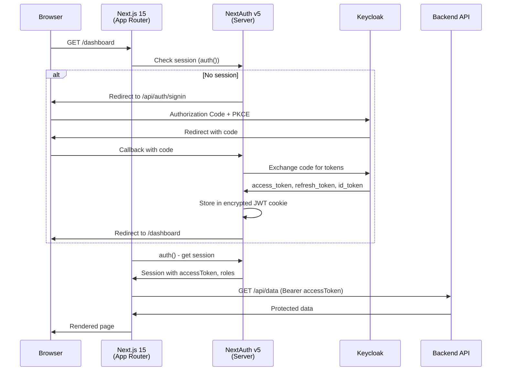
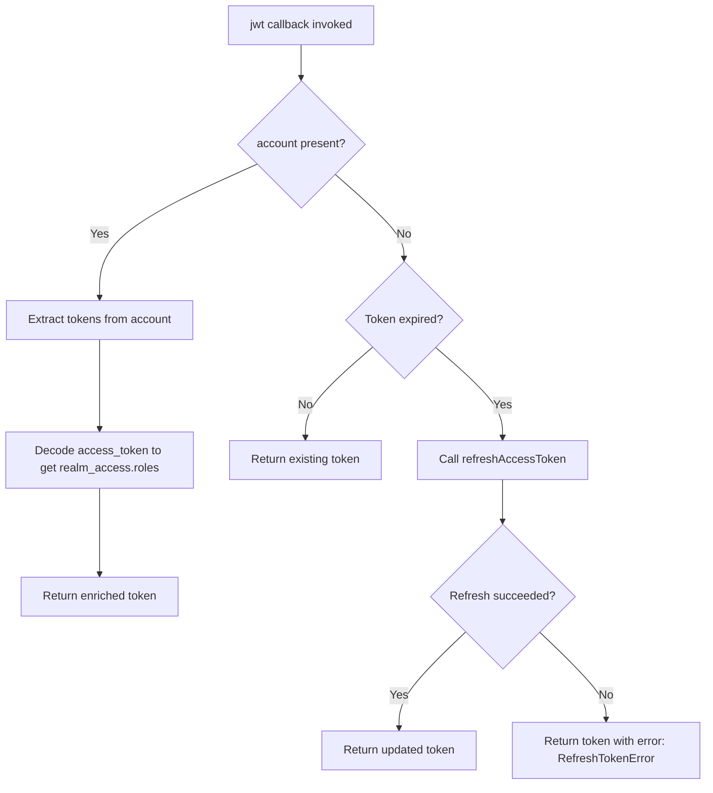
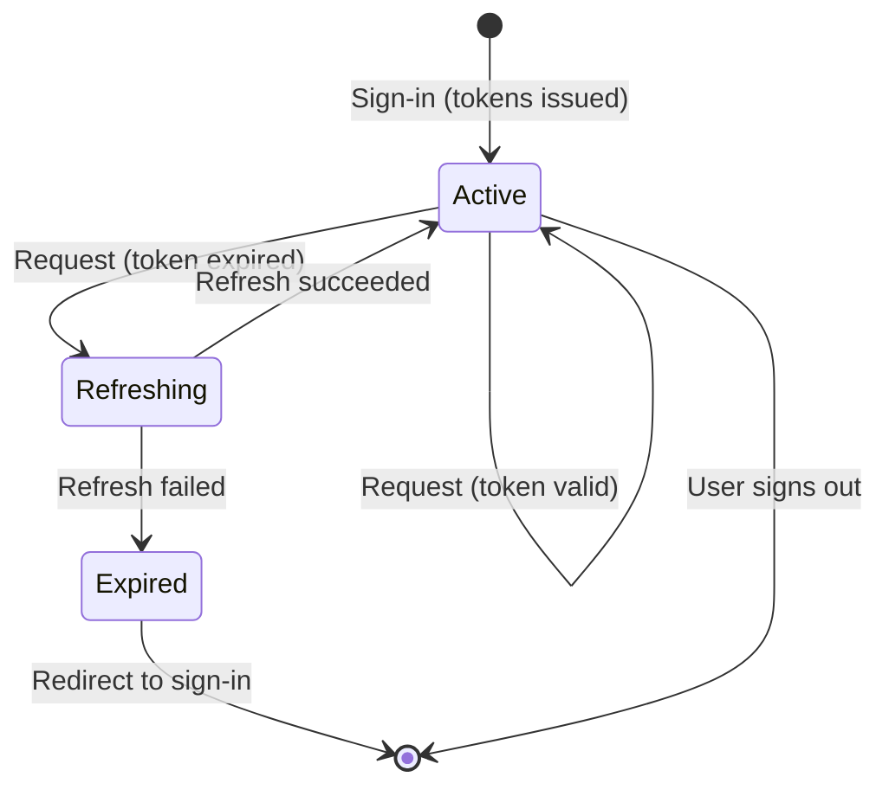
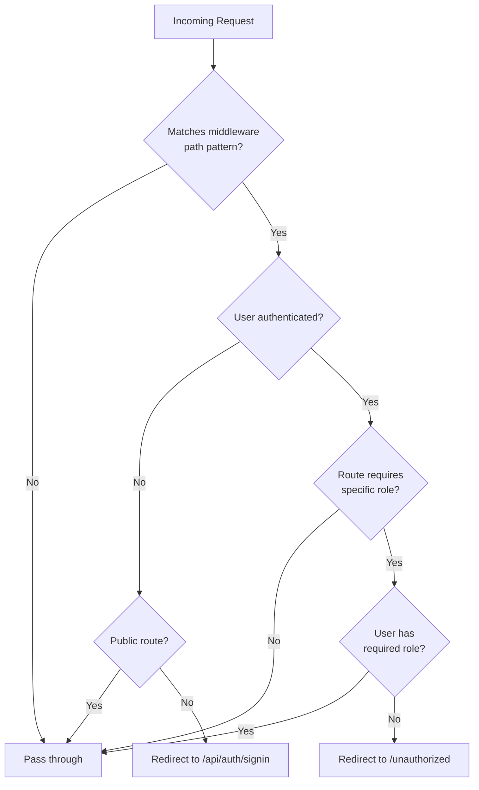

# 14-06. Next.js 15 Integration Guide

## Table of Contents

- [1. Overview](#1-overview)
- [2. Prerequisites](#2-prerequisites)
- [3. Dependencies](#3-dependencies)
- [4. NextAuth Configuration with Keycloak Provider](#4-nextauth-configuration-with-keycloak-provider)
- [5. Token Refresh Implementation](#5-token-refresh-implementation)
- [6. Keycloak Back-Channel Logout](#6-keycloak-back-channel-logout)
- [7. App Router Route Handler](#7-app-router-route-handler)
- [8. Middleware for Route Protection](#8-middleware-for-route-protection)
- [9. Server Component: Accessing Session](#9-server-component-accessing-session)
- [10. Client Component: useSession Hook](#10-client-component-usesession-hook)
- [11. API Route Protection](#11-api-route-protection)
- [12. SessionProvider in Root Layout](#12-sessionprovider-in-root-layout)
- [13. Role-Based Component Rendering](#13-role-based-component-rendering)
- [14. Calling Protected Backend APIs from Server Components](#14-calling-protected-backend-apis-from-server-components)
- [15. OpenTelemetry Instrumentation](#15-opentelemetry-instrumentation)
- [16. Environment Variables](#16-environment-variables)
- [17. Testing](#17-testing)
- [18. Docker Compose for Local Development](#18-docker-compose-for-local-development)
- [19. Project Structure Recommendation](#19-project-structure-recommendation)
- [20. Related Documents](#20-related-documents)

---

## 1. Overview

This guide covers the full integration of a **Next.js 15** application with **Keycloak** using **NextAuth v5** (`@auth/core`). It addresses server-side rendering, client-side interactivity, token management, role-based access control, observability, and testing. The application uses the Next.js App Router exclusively.

### Authentication Flow



---

## 2. Prerequisites

| Requirement | Version | Notes |
|---|---|---|
| Node.js | 22.x LTS | Required for Next.js 15 |
| npm / pnpm / yarn | Latest | Package manager |
| Next.js | 15.x | App Router |
| Keycloak | 26.x | OIDC provider |
| Keycloak Client | Confidential | Authorization Code flow with client secret |

Before starting, ensure the following Keycloak configuration is in place:

1. A **realm** exists (e.g., `tenant-acme`).
2. A **client** is registered with:
   - **Client ID**: e.g., `acme-web`
   - **Client authentication**: On (confidential)
   - **Valid redirect URIs**: `http://localhost:3000/api/auth/callback/keycloak` (dev), plus production URIs
   - **Valid post logout redirect URIs**: `http://localhost:3000` (dev), plus production URIs
   - **Web origins**: `http://localhost:3000` (dev), plus production origins
3. **Realm roles** are defined (e.g., `admin`, `editor`, `viewer`).
4. **Users** are created and assigned roles.

---

## 3. Dependencies

Install the required packages:

```bash
npm install next-auth@5 @auth/core next@15
```

| Package | Version | Purpose |
|---|---|---|
| `next-auth` | 5.x | Authentication library for Next.js (NextAuth v5) |
| `@auth/core` | 0.37.x | Core authentication primitives |
| `next` | 15.x | Next.js framework |

### TypeScript Type Extensions

Create a type declaration file to extend the default NextAuth types with custom properties:

```typescript
// types/next-auth.d.ts
import { DefaultSession } from 'next-auth';

declare module 'next-auth' {
  interface Session extends DefaultSession {
    accessToken?: string;
    roles?: string[];
    error?: string;
  }
}

declare module 'next-auth/jwt' {
  interface JWT {
    accessToken?: string;
    refreshToken?: string;
    expiresAt?: number;
    idToken?: string;
    roles?: string[];
    error?: string;
  }
}
```

---

## 4. NextAuth Configuration with Keycloak Provider

Create the central authentication configuration file at the project root:

```typescript
// auth.ts
import NextAuth from 'next-auth';
import Keycloak from 'next-auth/providers/keycloak';

export const { handlers, auth, signIn, signOut } = NextAuth({
  providers: [
    Keycloak({
      clientId: process.env.KEYCLOAK_CLIENT_ID!,
      clientSecret: process.env.KEYCLOAK_CLIENT_SECRET!,
      issuer: process.env.KEYCLOAK_ISSUER!,
    }),
  ],
  callbacks: {
    async jwt({ token, account }) {
      // On initial sign-in, persist tokens from the OIDC provider
      if (account) {
        token.accessToken = account.access_token;
        token.refreshToken = account.refresh_token;
        token.expiresAt = account.expires_at;
        token.idToken = account.id_token;

        // Extract realm roles from the access token payload
        if (account.access_token) {
          const payload = JSON.parse(
            Buffer.from(account.access_token.split('.')[1], 'base64').toString()
          );
          token.roles = payload.realm_access?.roles ?? [];
        }
      }

      // Return the token as-is if it has not expired
      if (Date.now() < (token.expiresAt as number) * 1000) {
        return token;
      }

      // Token has expired -- attempt a refresh
      return await refreshAccessToken(token);
    },

    async session({ session, token }) {
      session.accessToken = token.accessToken as string;
      session.roles = token.roles as string[];
      session.error = token.error as string | undefined;
      return session;
    },
  },

  events: {
    async signOut(message) {
      // Keycloak back-channel logout (see Section 6)
      if ('token' in message && message.token?.idToken) {
        const logoutUrl = new URL(
          `${process.env.KEYCLOAK_ISSUER}/protocol/openid-connect/logout`
        );
        logoutUrl.searchParams.set('id_token_hint', message.token.idToken as string);
        await fetch(logoutUrl.toString());
      }
    },
  },

  pages: {
    signIn: '/auth/signin',   // Optional: custom sign-in page
    error: '/auth/error',     // Optional: custom error page
  },
});
```

### JWT Callback Details

The `jwt` callback fires on every request that needs a session. The flow is:



### Session Callback Details

The `session` callback controls what data is available on the client side. It maps JWT properties to the session object:

| JWT Property | Session Property | Description |
|---|---|---|
| `token.accessToken` | `session.accessToken` | The Keycloak access token for API calls |
| `token.roles` | `session.roles` | Array of realm role names |
| `token.error` | `session.error` | Error flag (e.g., `RefreshTokenError`) |

---

## 5. Token Refresh Implementation

The following function handles transparent token refresh when the access token expires:

```typescript
// auth.ts (continued)
async function refreshAccessToken(token: any): Promise<any> {
  try {
    const params = new URLSearchParams({
      client_id: process.env.KEYCLOAK_CLIENT_ID!,
      client_secret: process.env.KEYCLOAK_CLIENT_SECRET!,
      grant_type: 'refresh_token',
      refresh_token: token.refreshToken as string,
    });

    const response = await fetch(
      `${process.env.KEYCLOAK_ISSUER}/protocol/openid-connect/token`,
      {
        method: 'POST',
        headers: { 'Content-Type': 'application/x-www-form-urlencoded' },
        body: params,
      }
    );

    const refreshed = await response.json();

    if (!response.ok) {
      throw new Error(
        `Token refresh failed: ${response.status} ${JSON.stringify(refreshed)}`
      );
    }

    // Decode refreshed access token to extract updated roles
    const payload = JSON.parse(
      Buffer.from(refreshed.access_token.split('.')[1], 'base64').toString()
    );

    return {
      ...token,
      accessToken: refreshed.access_token,
      refreshToken: refreshed.refresh_token ?? token.refreshToken,
      expiresAt: Math.floor(Date.now() / 1000) + refreshed.expires_in,
      idToken: refreshed.id_token ?? token.idToken,
      roles: payload.realm_access?.roles ?? token.roles,
      error: undefined,
    };
  } catch (error) {
    console.error('[AUTH] Token refresh failed:', error);
    return {
      ...token,
      error: 'RefreshTokenError',
    };
  }
}
```

### Token Lifecycle



---

## 6. Keycloak Back-Channel Logout

When a user signs out, the application should also invalidate the session on the Keycloak side. This is handled in the `signOut` event of the NextAuth configuration (shown in Section 4).

The back-channel logout sends a GET request to the Keycloak logout endpoint with the `id_token_hint` parameter. This ensures that:

1. The Keycloak session is terminated.
2. Other applications in the same SSO session receive logout notifications (if back-channel logout is enabled in Keycloak).

For applications that need to **receive** back-channel logout notifications from Keycloak, implement a dedicated endpoint:

```typescript
// app/api/auth/backchannel-logout/route.ts
import { NextRequest, NextResponse } from 'next/server';
import { jwtVerify, createRemoteJWKSet } from 'jose';

const JWKS = createRemoteJWKSet(
  new URL(`${process.env.KEYCLOAK_ISSUER}/protocol/openid-connect/certs`)
);

export async function POST(request: NextRequest) {
  const formData = await request.formData();
  const logoutToken = formData.get('logout_token') as string;

  if (!logoutToken) {
    return NextResponse.json({ error: 'Missing logout_token' }, { status: 400 });
  }

  try {
    const { payload } = await jwtVerify(logoutToken, JWKS, {
      issuer: process.env.KEYCLOAK_ISSUER!,
    });

    const userId = payload.sub;
    const sessionId = payload.sid;

    // Invalidate the user's session in your application
    // This depends on your session storage strategy
    console.log(
      `[AUTH] Back-channel logout received for user=${userId}, session=${sessionId}`
    );

    return NextResponse.json({ success: true });
  } catch (error) {
    console.error('[AUTH] Back-channel logout validation failed:', error);
    return NextResponse.json({ error: 'Invalid logout_token' }, { status: 400 });
  }
}
```

---

## 7. App Router Route Handler

The NextAuth route handler exposes the authentication API endpoints under `/api/auth/`:

```typescript
// app/api/auth/[...nextauth]/route.ts
import { handlers } from '@/auth';

export const { GET, POST } = handlers;
```

This single file enables all NextAuth endpoints:

| Endpoint | Method | Description |
|---|---|---|
| `/api/auth/signin` | GET | Sign-in page (or redirects to Keycloak) |
| `/api/auth/signout` | POST | Sign-out and session cleanup |
| `/api/auth/callback/keycloak` | GET | OIDC callback after Keycloak authentication |
| `/api/auth/session` | GET | Returns the current session (JSON) |
| `/api/auth/csrf` | GET | CSRF token for POST requests |

---

## 8. Middleware for Route Protection

Create `middleware.ts` at the project root to protect routes globally:

```typescript
// middleware.ts
import { auth } from './auth';

export default auth((req) => {
  const { pathname } = req.nextUrl;
  const isLoggedIn = !!req.auth;

  // Define public routes that do not require authentication
  const publicRoutes = ['/', '/public', '/auth/signin', '/auth/error'];
  const isPublicRoute = publicRoutes.some(
    (route) => pathname === route || pathname.startsWith(`${route}/`)
  );

  // Redirect unauthenticated users to sign-in
  if (!isLoggedIn && !isPublicRoute) {
    const signInUrl = new URL('/api/auth/signin', req.nextUrl.origin);
    signInUrl.searchParams.set('callbackUrl', req.nextUrl.href);
    return Response.redirect(signInUrl);
  }

  // Optional: Role-based route protection at the middleware level
  if (isLoggedIn && pathname.startsWith('/admin')) {
    const roles = (req.auth as any)?.roles ?? [];
    if (!roles.includes('admin')) {
      return Response.redirect(new URL('/unauthorized', req.nextUrl.origin));
    }
  }
});

export const config = {
  matcher: [
    /*
     * Match all request paths except:
     * - api/auth (NextAuth endpoints)
     * - _next/static (static files)
     * - _next/image (image optimization)
     * - favicon.ico
     * - public assets
     */
    '/((?!api/auth|_next/static|_next/image|favicon\\.ico|public/).*)',
  ],
};
```

### Middleware Flow



---

## 9. Server Component: Accessing Session

In Server Components, use the `auth()` function to access the session without any client-side JavaScript:

```typescript
// app/dashboard/page.tsx
import { auth } from '@/auth';
import { redirect } from 'next/navigation';

export default async function DashboardPage() {
  const session = await auth();

  if (!session) {
    redirect('/api/auth/signin');
  }

  if (session.error === 'RefreshTokenError') {
    redirect('/api/auth/signin');
  }

  return (
    <main>
      <h1>Dashboard</h1>
      <section>
        <h2>User Information</h2>
        <dl>
          <dt>Name</dt>
          <dd>{session.user?.name}</dd>
          <dt>Email</dt>
          <dd>{session.user?.email}</dd>
        </dl>
      </section>
      <section>
        <h2>Assigned Roles</h2>
        <ul>
          {session.roles?.map((role) => (
            <li key={role}>{role}</li>
          ))}
        </ul>
      </section>
      {session.roles?.includes('admin') && (
        <section>
          <h2>Administration</h2>
          <p>You have administrative access.</p>
          <a href="/admin">Go to Admin Panel</a>
        </section>
      )}
    </main>
  );
}
```

### Protected Page with Data Fetching

```typescript
// app/projects/page.tsx
import { auth } from '@/auth';
import { redirect } from 'next/navigation';

async function getProjects(accessToken: string) {
  const response = await fetch(`${process.env.API_BASE_URL}/api/projects`, {
    headers: {
      Authorization: `Bearer ${accessToken}`,
    },
    next: { revalidate: 60 }, // Cache for 60 seconds
  });

  if (!response.ok) {
    throw new Error(`Failed to fetch projects: ${response.status}`);
  }

  return response.json();
}

export default async function ProjectsPage() {
  const session = await auth();

  if (!session?.accessToken) {
    redirect('/api/auth/signin');
  }

  const projects = await getProjects(session.accessToken);

  return (
    <main>
      <h1>Projects</h1>
      <ul>
        {projects.map((project: { id: string; name: string }) => (
          <li key={project.id}>{project.name}</li>
        ))}
      </ul>
    </main>
  );
}
```

---

## 10. Client Component: useSession Hook

### UserProfile Component

```typescript
// components/UserProfile.tsx
'use client';

import { useSession, signIn, signOut } from 'next-auth/react';

export function UserProfile() {
  const { data: session, status } = useSession();

  if (status === 'loading') {
    return <div aria-busy="true">Loading session...</div>;
  }

  if (status === 'unauthenticated') {
    return (
      <div>
        <p>You are not signed in.</p>
        <button onClick={() => signIn('keycloak')}>Sign in with Keycloak</button>
      </div>
    );
  }

  // Handle token refresh failure
  if (session?.error === 'RefreshTokenError') {
    return (
      <div>
        <p>Your session has expired. Please sign in again.</p>
        <button onClick={() => signIn('keycloak')}>Sign in</button>
      </div>
    );
  }

  return (
    <div>
      <h2>User Profile</h2>
      <p>Name: {session?.user?.name}</p>
      <p>Email: {session?.user?.email}</p>
      <p>Roles: {session?.roles?.join(', ') || 'None'}</p>
      <button onClick={() => signOut({ callbackUrl: '/' })}>Sign out</button>
    </div>
  );
}
```

### Handling RefreshTokenError Globally

For applications that need to handle `RefreshTokenError` at a global level, create a session monitor component:

```typescript
// components/SessionMonitor.tsx
'use client';

import { useSession, signIn } from 'next-auth/react';
import { useEffect } from 'react';

export function SessionMonitor() {
  const { data: session } = useSession();

  useEffect(() => {
    if (session?.error === 'RefreshTokenError') {
      // Redirect to sign-in when the refresh token is no longer valid
      signIn('keycloak');
    }
  }, [session?.error]);

  return null;
}
```

Include `<SessionMonitor />` in your root layout alongside `<SessionProvider>`.

---

## 11. API Route Protection

Protect API routes by checking the session server-side:

```typescript
// app/api/data/route.ts
import { auth } from '@/auth';
import { NextResponse } from 'next/server';

export async function GET() {
  const session = await auth();

  if (!session) {
    return NextResponse.json(
      { error: 'Unauthorized', message: 'Authentication required' },
      { status: 401 }
    );
  }

  if (!session.roles?.includes('viewer') && !session.roles?.includes('admin')) {
    return NextResponse.json(
      { error: 'Forbidden', message: 'Insufficient permissions' },
      { status: 403 }
    );
  }

  // Optionally forward the request to a backend API
  const backendResponse = await fetch(`${process.env.API_BASE_URL}/api/data`, {
    headers: {
      Authorization: `Bearer ${session.accessToken}`,
    },
  });

  const data = await backendResponse.json();
  return NextResponse.json(data);
}

export async function POST(request: Request) {
  const session = await auth();

  if (!session) {
    return NextResponse.json({ error: 'Unauthorized' }, { status: 401 });
  }

  if (!session.roles?.includes('editor') && !session.roles?.includes('admin')) {
    return NextResponse.json({ error: 'Forbidden' }, { status: 403 });
  }

  const body = await request.json();

  const backendResponse = await fetch(`${process.env.API_BASE_URL}/api/data`, {
    method: 'POST',
    headers: {
      Authorization: `Bearer ${session.accessToken}`,
      'Content-Type': 'application/json',
    },
    body: JSON.stringify(body),
  });

  const result = await backendResponse.json();
  return NextResponse.json(result, { status: backendResponse.status });
}
```

---

## 12. SessionProvider in Root Layout

Wrap the entire application with `SessionProvider` to make `useSession` available in all Client Components:

```typescript
// app/layout.tsx
import type { Metadata } from 'next';
import { SessionProvider } from 'next-auth/react';
import { SessionMonitor } from '@/components/SessionMonitor';

export const metadata: Metadata = {
  title: 'ACME Application',
  description: 'Keycloak-secured Next.js application',
};

export default function RootLayout({
  children,
}: {
  children: React.ReactNode;
}) {
  return (
    <html lang="en">
      <body>
        <SessionProvider
          refetchInterval={4 * 60}   // Re-check session every 4 minutes
          refetchOnWindowFocus={true} // Re-check when tab gains focus
        >
          <SessionMonitor />
          {children}
        </SessionProvider>
      </body>
    </html>
  );
}
```

| SessionProvider Prop | Value | Description |
|---|---|---|
| `refetchInterval` | `240` (seconds) | Periodically re-validates the session to detect expiry |
| `refetchOnWindowFocus` | `true` | Re-checks the session when the user returns to the tab |

---

## 13. Role-Based Component Rendering

### Inline Role Checks

```typescript
// components/Navigation.tsx
'use client';

import { useSession } from 'next-auth/react';

export function Navigation() {
  const { data: session } = useSession();
  const roles = session?.roles ?? [];

  return (
    <nav>
      <ul>
        <li><a href="/dashboard">Dashboard</a></li>
        {roles.includes('editor') && (
          <li><a href="/content">Content Editor</a></li>
        )}
        {roles.includes('admin') && (
          <li><a href="/admin">Administration</a></li>
        )}
        {(roles.includes('admin') || roles.includes('manager')) && (
          <li><a href="/reports">Reports</a></li>
        )}
      </ul>
    </nav>
  );
}
```

### Reusable RoleGate Component

```typescript
// components/RoleGate.tsx
'use client';

import { useSession } from 'next-auth/react';
import { ReactNode } from 'react';

interface RoleGateProps {
  /** One or more roles required. User must have at least one. */
  allowedRoles: string[];
  /** Content to render if the user has the required role(s). */
  children: ReactNode;
  /** Optional fallback content if the user lacks the required role(s). */
  fallback?: ReactNode;
}

export function RoleGate({ allowedRoles, children, fallback = null }: RoleGateProps) {
  const { data: session, status } = useSession();

  if (status === 'loading') {
    return null;
  }

  const userRoles = session?.roles ?? [];
  const hasRequiredRole = allowedRoles.some((role) => userRoles.includes(role));

  if (!hasRequiredRole) {
    return <>{fallback}</>;
  }

  return <>{children}</>;
}
```

Usage:

```tsx
<RoleGate allowedRoles={['admin']}>
  <AdminPanel />
</RoleGate>

<RoleGate
  allowedRoles={['admin', 'manager']}
  fallback={<p>You do not have access to reports.</p>}
>
  <ReportsView />
</RoleGate>
```

### Server-Side Role Gate

For Server Components, create a helper function:

```typescript
// lib/auth-helpers.ts
import { auth } from '@/auth';

export async function hasRole(...roles: string[]): Promise<boolean> {
  const session = await auth();
  if (!session?.roles) return false;
  return roles.some((role) => session.roles!.includes(role));
}

export async function requireRole(...roles: string[]): Promise<void> {
  const hasRequiredRole = await hasRole(...roles);
  if (!hasRequiredRole) {
    throw new Error('Forbidden: insufficient permissions');
  }
}
```

---

## 14. Calling Protected Backend APIs from Server Components

When Server Components call downstream APIs, forward the Keycloak access token from the session:

```typescript
// lib/api-client.ts
import { auth } from '@/auth';

class ApiError extends Error {
  constructor(
    public status: number,
    message: string,
  ) {
    super(message);
    this.name = 'ApiError';
  }
}

async function getAccessToken(): Promise<string> {
  const session = await auth();

  if (!session?.accessToken) {
    throw new ApiError(401, 'No access token available');
  }

  if (session.error === 'RefreshTokenError') {
    throw new ApiError(401, 'Session expired');
  }

  return session.accessToken;
}

export async function apiGet<T>(path: string): Promise<T> {
  const token = await getAccessToken();

  const response = await fetch(`${process.env.API_BASE_URL}${path}`, {
    headers: {
      Authorization: `Bearer ${token}`,
      'Content-Type': 'application/json',
    },
  });

  if (!response.ok) {
    throw new ApiError(response.status, `API request failed: ${path}`);
  }

  return response.json();
}

export async function apiPost<T>(path: string, body: unknown): Promise<T> {
  const token = await getAccessToken();

  const response = await fetch(`${process.env.API_BASE_URL}${path}`, {
    method: 'POST',
    headers: {
      Authorization: `Bearer ${token}`,
      'Content-Type': 'application/json',
    },
    body: JSON.stringify(body),
  });

  if (!response.ok) {
    throw new ApiError(response.status, `API request failed: ${path}`);
  }

  return response.json();
}
```

Usage in a Server Component:

```typescript
// app/users/page.tsx
import { apiGet } from '@/lib/api-client';
import { redirect } from 'next/navigation';

interface User {
  id: string;
  name: string;
  email: string;
}

export default async function UsersPage() {
  try {
    const users = await apiGet<User[]>('/api/users');

    return (
      <main>
        <h1>Users</h1>
        <table>
          <thead>
            <tr>
              <th>Name</th>
              <th>Email</th>
            </tr>
          </thead>
          <tbody>
            {users.map((user) => (
              <tr key={user.id}>
                <td>{user.name}</td>
                <td>{user.email}</td>
              </tr>
            ))}
          </tbody>
        </table>
      </main>
    );
  } catch (error: any) {
    if (error.status === 401) {
      redirect('/api/auth/signin');
    }
    throw error;
  }
}
```

---

## 15. OpenTelemetry Instrumentation

### Setup with @vercel/otel

Install dependencies:

```bash
npm install @vercel/otel @opentelemetry/api @opentelemetry/sdk-node
```

### Instrumentation Hook

Create the Next.js instrumentation file:

```typescript
// instrumentation.ts
export async function register() {
  if (process.env.NEXT_RUNTIME === 'nodejs') {
    const { registerOTel } = await import('@vercel/otel');

    registerOTel({
      serviceName: process.env.OTEL_SERVICE_NAME || 'acme-web',
      attributes: {
        'deployment.environment': process.env.NODE_ENV || 'development',
      },
    });
  }
}
```

### Adding User Context to Spans

Enrich traces with user identity for better observability:

```typescript
// lib/tracing.ts
import { trace, SpanStatusCode } from '@opentelemetry/api';
import { auth } from '@/auth';

const tracer = trace.getTracer('acme-web');

export async function withUserTrace<T>(
  spanName: string,
  fn: () => Promise<T>
): Promise<T> {
  const session = await auth();

  return tracer.startActiveSpan(spanName, async (span) => {
    try {
      // Add user context to the span
      if (session?.user) {
        span.setAttribute('user.id', session.user.email ?? 'unknown');
        span.setAttribute('user.roles', (session.roles ?? []).join(','));
      } else {
        span.setAttribute('user.authenticated', false);
      }

      const result = await fn();
      span.setStatus({ code: SpanStatusCode.OK });
      return result;
    } catch (error) {
      span.setStatus({
        code: SpanStatusCode.ERROR,
        message: error instanceof Error ? error.message : 'Unknown error',
      });
      throw error;
    } finally {
      span.end();
    }
  });
}
```

Enable instrumentation in `next.config.ts`:

```typescript
// next.config.ts
import type { NextConfig } from 'next';

const nextConfig: NextConfig = {
  experimental: {
    instrumentationHook: true,
  },
};

export default nextConfig;
```

---

## 16. Environment Variables

Create `.env.local` for local development:

```bash
# .env.local

# Keycloak OIDC Configuration
KEYCLOAK_CLIENT_ID=acme-web
KEYCLOAK_CLIENT_SECRET=your-client-secret-here
KEYCLOAK_ISSUER=http://localhost:8080/realms/tenant-acme

# NextAuth Configuration
NEXTAUTH_URL=http://localhost:3000
NEXTAUTH_SECRET=generate-a-random-32-char-secret-here

# Backend API
API_BASE_URL=http://localhost:8081

# OpenTelemetry
OTEL_SERVICE_NAME=acme-web
OTEL_EXPORTER_OTLP_ENDPOINT=http://localhost:4318
```

| Variable | Required | Description |
|---|---|---|
| `KEYCLOAK_CLIENT_ID` | Yes | The Keycloak client ID |
| `KEYCLOAK_CLIENT_SECRET` | Yes | The Keycloak client secret |
| `KEYCLOAK_ISSUER` | Yes | Full issuer URL including realm (e.g., `https://iam.example.com/realms/tenant-acme`) |
| `NEXTAUTH_URL` | Yes | The canonical URL of the Next.js application |
| `NEXTAUTH_SECRET` | Yes | Secret used to encrypt the session JWT cookie |
| `API_BASE_URL` | No | Base URL of the backend API for server-side calls |
| `OTEL_SERVICE_NAME` | No | OpenTelemetry service name |
| `OTEL_EXPORTER_OTLP_ENDPOINT` | No | OpenTelemetry collector endpoint |

Generate `NEXTAUTH_SECRET` with:

```bash
openssl rand -base64 32
```

---

## 17. Testing

### next/jest Configuration

```typescript
// jest.config.ts
import type { Config } from 'jest';
import nextJest from 'next/jest';

const createJestConfig = nextJest({
  dir: './',
});

const config: Config = {
  testEnvironment: 'jsdom',
  setupFilesAfterSetup: ['<rootDir>/jest.setup.ts'],
  moduleNameMapper: {
    '^@/(.*)$': '<rootDir>/$1',
  },
};

export default createJestConfig(config);
```

### Mocking the NextAuth Session

```typescript
// __tests__/components/UserProfile.test.tsx
import { render, screen } from '@testing-library/react';
import { useSession } from 'next-auth/react';
import { UserProfile } from '@/components/UserProfile';

// Mock next-auth/react
jest.mock('next-auth/react', () => ({
  useSession: jest.fn(),
  signIn: jest.fn(),
  signOut: jest.fn(),
}));

const mockUseSession = useSession as jest.Mock;

describe('UserProfile', () => {
  it('renders loading state', () => {
    mockUseSession.mockReturnValue({ data: null, status: 'loading' });
    render(<UserProfile />);
    expect(screen.getByText(/loading/i)).toBeInTheDocument();
  });

  it('renders sign-in prompt when unauthenticated', () => {
    mockUseSession.mockReturnValue({ data: null, status: 'unauthenticated' });
    render(<UserProfile />);
    expect(screen.getByText(/not signed in/i)).toBeInTheDocument();
    expect(screen.getByRole('button', { name: /sign in/i })).toBeInTheDocument();
  });

  it('renders user information when authenticated', () => {
    mockUseSession.mockReturnValue({
      data: {
        user: { name: 'Jane Doe', email: 'jane@example.com' },
        roles: ['admin', 'editor'],
      },
      status: 'authenticated',
    });

    render(<UserProfile />);
    expect(screen.getByText(/Jane Doe/)).toBeInTheDocument();
    expect(screen.getByText(/jane@example.com/)).toBeInTheDocument();
    expect(screen.getByText(/admin, editor/)).toBeInTheDocument();
  });

  it('redirects to sign-in on RefreshTokenError', () => {
    mockUseSession.mockReturnValue({
      data: {
        user: { name: 'Jane Doe', email: 'jane@example.com' },
        error: 'RefreshTokenError',
      },
      status: 'authenticated',
    });

    render(<UserProfile />);
    expect(screen.getByText(/session has expired/i)).toBeInTheDocument();
  });
});
```

### Testing Server Components with Mocked Auth

```typescript
// __tests__/app/dashboard.test.tsx
import { render, screen } from '@testing-library/react';

// Mock the auth function
jest.mock('@/auth', () => ({
  auth: jest.fn(),
}));

jest.mock('next/navigation', () => ({
  redirect: jest.fn(),
}));

import { auth } from '@/auth';
import { redirect } from 'next/navigation';
import DashboardPage from '@/app/dashboard/page';

const mockAuth = auth as jest.Mock;
const mockRedirect = redirect as jest.Mock;

describe('DashboardPage', () => {
  it('redirects when not authenticated', async () => {
    mockAuth.mockResolvedValue(null);
    await DashboardPage();
    expect(mockRedirect).toHaveBeenCalledWith('/api/auth/signin');
  });

  it('renders dashboard for authenticated user', async () => {
    mockAuth.mockResolvedValue({
      user: { name: 'Jane Doe', email: 'jane@example.com' },
      roles: ['admin'],
      accessToken: 'mock-token',
    });

    const result = await DashboardPage();
    render(result);
    expect(screen.getByText(/Dashboard/)).toBeInTheDocument();
    expect(screen.getByText(/Jane Doe/)).toBeInTheDocument();
  });
});
```

### Testing the RoleGate Component

```typescript
// __tests__/components/RoleGate.test.tsx
import { render, screen } from '@testing-library/react';
import { useSession } from 'next-auth/react';
import { RoleGate } from '@/components/RoleGate';

jest.mock('next-auth/react', () => ({
  useSession: jest.fn(),
}));

const mockUseSession = useSession as jest.Mock;

describe('RoleGate', () => {
  it('renders children when user has the required role', () => {
    mockUseSession.mockReturnValue({
      data: { roles: ['admin', 'editor'] },
      status: 'authenticated',
    });

    render(
      <RoleGate allowedRoles={['admin']}>
        <p>Admin content</p>
      </RoleGate>
    );

    expect(screen.getByText('Admin content')).toBeInTheDocument();
  });

  it('renders fallback when user lacks the required role', () => {
    mockUseSession.mockReturnValue({
      data: { roles: ['viewer'] },
      status: 'authenticated',
    });

    render(
      <RoleGate allowedRoles={['admin']} fallback={<p>Access denied</p>}>
        <p>Admin content</p>
      </RoleGate>
    );

    expect(screen.queryByText('Admin content')).not.toBeInTheDocument();
    expect(screen.getByText('Access denied')).toBeInTheDocument();
  });
});
```

---

## 18. Docker Compose for Local Development

```yaml
# docker-compose.yml
services:
  nextjs-app:
    build:
      context: .
      dockerfile: Dockerfile
    ports:
      - "3000:3000"
    env_file:
      - .env.example
    environment:
      KEYCLOAK_CLIENT_ID: acme-web
      KEYCLOAK_CLIENT_SECRET: your-client-secret
      KEYCLOAK_ISSUER: http://iam-keycloak:8080/realms/tenant-acme
      NEXTAUTH_URL: http://localhost:3000
      NEXTAUTH_SECRET: change-me-to-a-random-secret
      API_BASE_URL: http://backend-api:8081
    networks:
      - iam-network

  backend-api:
    image: your-backend-api:latest
    ports:
      - "8081:8081"
    environment:
      KEYCLOAK_ISSUER_URI: http://iam-keycloak:8080/realms/tenant-acme
      KEYCLOAK_JWKS_URI: http://iam-keycloak:8080/realms/tenant-acme/protocol/openid-connect/certs
    networks:
      - iam-network

  # Optional: OpenTelemetry Collector
  otel-collector:
    image: otel/opentelemetry-collector-contrib:0.96.0
    ports:
      - "4317:4317"   # gRPC
      - "4318:4318"   # HTTP
    volumes:
      - ./otel-config.yaml:/etc/otel/config.yaml
    command: ["--config", "/etc/otel/config.yaml"]

networks:
  iam-network:
    external: true
    name: devops_iam-network
```

Start the stack:

```bash
docker compose up -d
```

---

## 19. Project Structure Recommendation

```
project-root/
  auth.ts                          # NextAuth configuration (Keycloak provider, callbacks)
  middleware.ts                     # Route protection middleware
  instrumentation.ts               # OpenTelemetry setup
  next.config.ts                   # Next.js configuration
  .env.local                       # Environment variables (not committed)
  types/
    next-auth.d.ts                 # NextAuth type extensions
  app/
    layout.tsx                     # Root layout with SessionProvider
    page.tsx                       # Home page
    auth/
      signin/page.tsx              # Custom sign-in page (optional)
      error/page.tsx               # Custom error page (optional)
    dashboard/
      page.tsx                     # Protected dashboard (Server Component)
    admin/
      page.tsx                     # Admin-only page
      layout.tsx                   # Admin layout with role check
    projects/
      page.tsx                     # Data-fetching page
    api/
      auth/
        [...nextauth]/route.ts     # NextAuth route handler
        backchannel-logout/route.ts # Back-channel logout endpoint
      data/
        route.ts                   # Protected API route
  components/
    UserProfile.tsx                # Client Component with useSession
    RoleGate.tsx                   # Role-based rendering component
    SessionMonitor.tsx             # Global session error handler
    Navigation.tsx                 # Role-aware navigation
  lib/
    api-client.ts                  # Server-side API client with token forwarding
    auth-helpers.ts                # hasRole, requireRole utilities
    tracing.ts                     # OpenTelemetry user context helpers
  __tests__/
    components/
      UserProfile.test.tsx
      RoleGate.test.tsx
    app/
      dashboard.test.tsx
  jest.config.ts
  jest.setup.ts
  docker-compose.yml
```

---

## Scripts and DevOps Tooling

Each example project includes a `scripts/` folder with automation scripts for common development and operations tasks. These scripts can be executed independently or through an interactive menu.

### Interactive Menu

Launch the interactive DevOps menu from the project root:

```bash
./scripts/devops-menu.sh
```

The menu presents a numbered list of operations with colored output, prerequisite checks, and error handling.

### Available Scripts

| # | Operation | Independent Command | Description |
|---|-----------|-------------------|-------------|
| 1 | Start Keycloak | `docker compose up -d keycloak` | Start Keycloak via the infrastructure Docker Compose file |
| 2 | Install dependencies | `npm ci` | Install project dependencies using a clean install |
| 3 | Run development server | `npm run dev` | Start the Next.js development server with hot reload |
| 4 | Run unit tests | `npm test` | Run the unit test suite with Jest or Vitest |
| 5 | Run E2E tests | `npm run test:e2e` | Run end-to-end tests with Playwright |
| 6 | Generate coverage report | `npm run test:cov` | Generate a test coverage report in the `coverage/` directory |
| 7 | Build production bundle | `npm run build` | Create an optimized production build |
| 8 | Start production server | `npm start` | Start the Next.js production server |
| 9 | Build Docker image | `docker build -t nextjs-iam .` | Build the Docker image for the application |
| 10 | Run with Docker Compose | `docker compose up -d` | Start all services with Docker Compose |
| 11 | Lint | `npm run lint` | Run ESLint on the source code |
| 12 | Analyze bundle size | `npm run analyze` | Analyze the production bundle size |
| 13 | View logs | `docker compose logs -f` | Follow container logs for all services |
| 14 | Stop containers | `docker compose down` | Stop and remove all Docker Compose containers |
| 15 | Clean | `rm -rf .next node_modules` | Remove build output and installed dependencies |

### Script Location

All scripts are located in the [`examples/frontend/nextjs/scripts/`](../examples/frontend/nextjs/scripts/) directory relative to the project root.

---

## 20. Related Documents

- [Client Applications Hub](14-client-applications.md) -- overview of all client integration guides
- [Architecture Overview](01-architecture-overview.md)
- [Authentication and Authorization](04-authentication-authorization.md)
- [Multi-Tenancy](05-multi-tenancy.md)
- [Security and Hardening](12-security-hardening.md)
