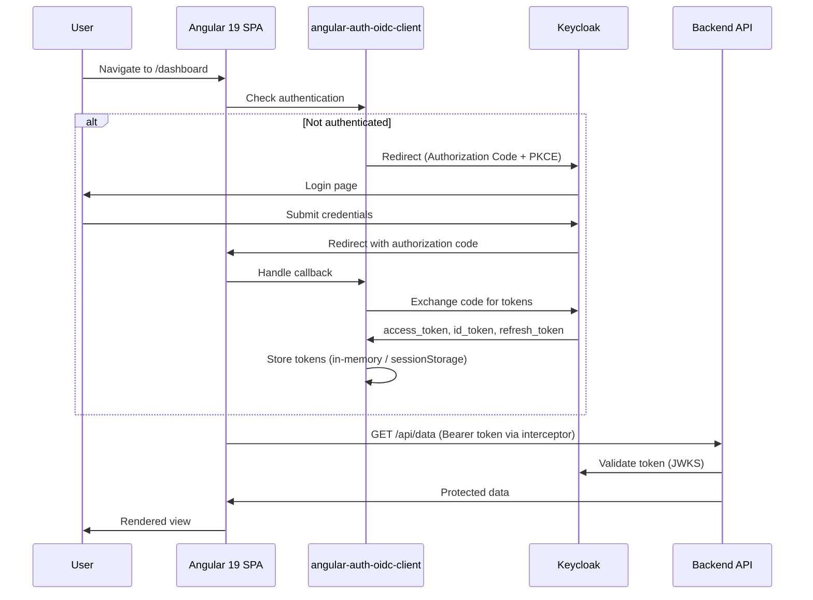
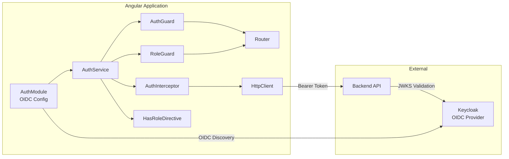
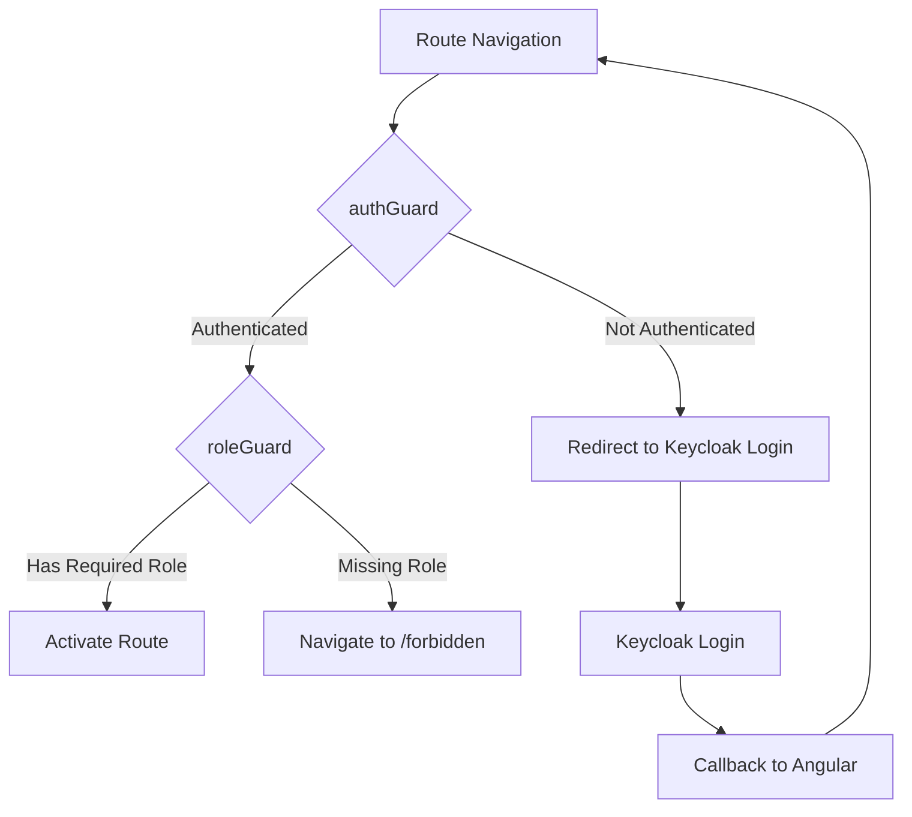
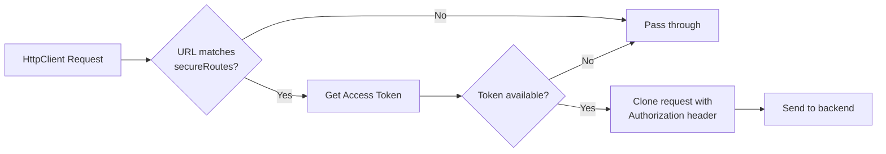
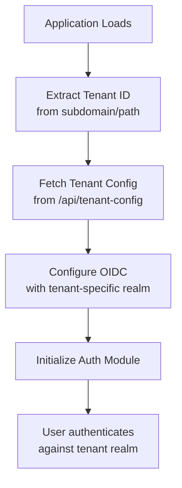
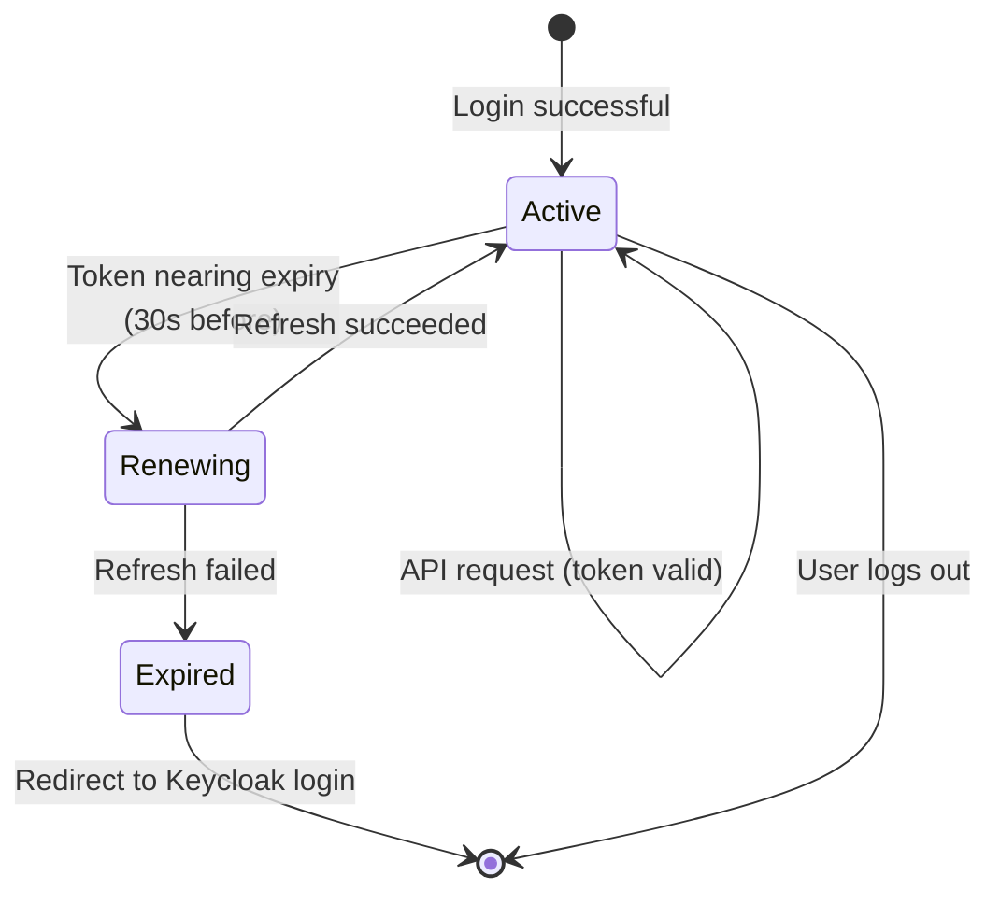
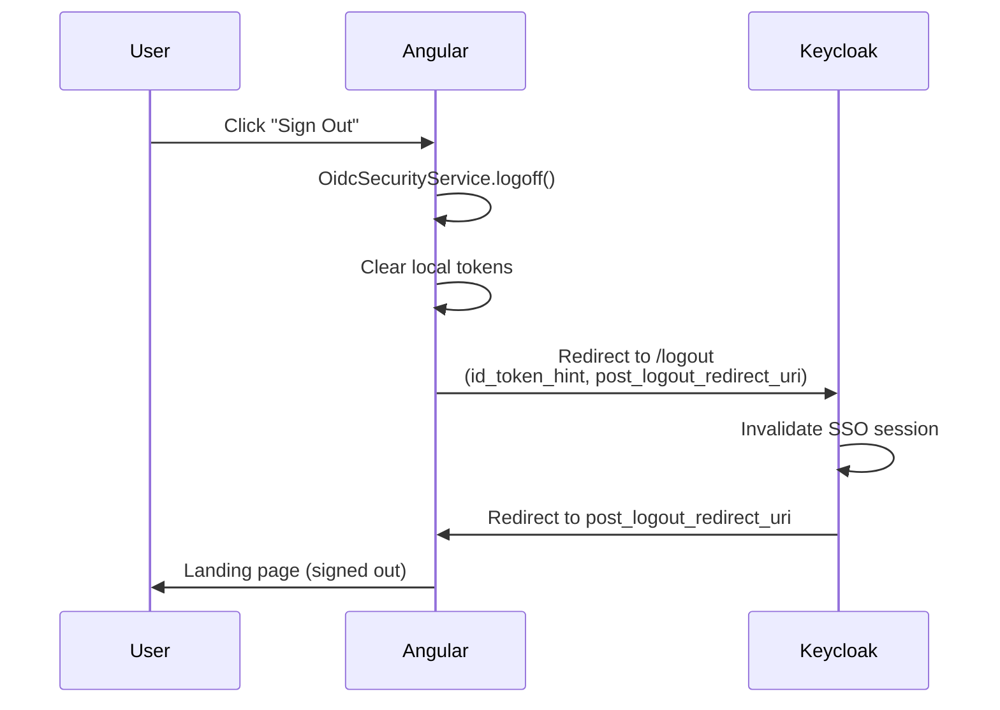

# 14-07. Angular 19 Integration Guide

## Table of Contents

- [1. Overview](#1-overview)
- [2. Prerequisites](#2-prerequisites)
- [3. Dependencies](#3-dependencies)
- [4. OIDC Configuration](#4-oidc-configuration)
- [5. Auth Service](#5-auth-service)
- [6. Route Guards](#6-route-guards)
- [7. HTTP Interceptor](#7-http-interceptor)
- [8. Example Components](#8-example-components)
- [9. Role-Based Template Directives](#9-role-based-template-directives)
- [10. Multi-Tenant Support](#10-multi-tenant-support)
- [11. OpenTelemetry Instrumentation](#11-opentelemetry-instrumentation)
- [12. Silent Renew and Token Expiry](#12-silent-renew-and-token-expiry)
- [13. Logout](#13-logout)
- [14. Environment Configuration](#14-environment-configuration)
- [15. Testing](#15-testing)
- [16. Docker Compose for Local Development](#16-docker-compose-for-local-development)
- [17. Project Structure Recommendation](#17-project-structure-recommendation)
- [18. Related Documents](#18-related-documents)

---

## 1. Overview

This guide covers the integration of an **Angular 19** single-page application with **Keycloak** using the **angular-auth-oidc-client** library (v18.x). It addresses OIDC configuration, token management, route protection, role-based UI rendering, multi-tenancy, observability, and testing.

### Authentication Flow



### Architecture



---

## 2. Prerequisites

| Requirement | Version | Notes |
|---|---|---|
| Node.js | 22.x LTS | Required for Angular CLI 19 |
| Angular CLI | 19.x | `npm install -g @angular/cli@19` |
| TypeScript | 5.6+ | Included with Angular 19 |
| Keycloak | 26.x | OIDC provider |
| Keycloak Client | Public | Authorization Code + PKCE (no client secret for SPAs) |

Keycloak client configuration:

1. **Client type**: OpenID Connect
2. **Client authentication**: Off (public client -- SPAs cannot hold secrets)
3. **Standard flow**: Enabled
4. **Valid redirect URIs**: `http://localhost:4200` (dev), plus production URIs
5. **Valid post logout redirect URIs**: `http://localhost:4200` (dev), plus production URIs
6. **Web origins**: `http://localhost:4200` (dev), plus production origins
7. **PKCE challenge method**: S256

---

## 3. Dependencies

Install the OIDC library:

```bash
npm install angular-auth-oidc-client@18
```

| Package | Version | Purpose |
|---|---|---|
| `angular-auth-oidc-client` | 18.x | Full OIDC/OAuth 2.0 client for Angular |

For OpenTelemetry (optional):

```bash
npm install @opentelemetry/api @opentelemetry/sdk-trace-web @opentelemetry/instrumentation-fetch @opentelemetry/exporter-trace-otlp-http @opentelemetry/resources @opentelemetry/semantic-conventions @opentelemetry/instrumentation-xml-http-request
```

---

## 4. OIDC Configuration

### Auth Configuration Module

```typescript
// src/app/auth/auth.config.ts
import { PassedInitialConfig, LogLevel } from 'angular-auth-oidc-client';
import { environment } from '../../environments/environment';

export const authConfig: PassedInitialConfig = {
  config: {
    authority: environment.keycloak.authority,
    redirectUrl: environment.keycloak.redirectUrl,
    postLogoutRedirectUri: environment.keycloak.postLogoutRedirectUri,
    clientId: environment.keycloak.clientId,
    scope: 'openid profile email offline_access',
    responseType: 'code',
    silentRenew: true,
    useRefreshToken: true,
    renewTimeBeforeTokenExpiresInSec: 30,
    logLevel: environment.production ? LogLevel.Error : LogLevel.Debug,

    // Secure routes: the interceptor will attach tokens to requests matching these URLs
    secureRoutes: [environment.apiBaseUrl],

    // PKCE is used by default for public clients
    customParamsAuthRequest: {
      // Additional parameters for the authorization request (if needed)
    },

    // Post-login callback handling
    postLoginRoute: '/dashboard',
    forbiddenRoute: '/forbidden',
    unauthorizedRoute: '/unauthorized',
  },
};
```

### Registering the Auth Module

```typescript
// src/app/app.config.ts
import { ApplicationConfig, provideZoneChangeDetection } from '@angular/core';
import { provideRouter } from '@angular/router';
import { provideHttpClient, withInterceptors } from '@angular/common/http';
import { provideAuth } from 'angular-auth-oidc-client';

import { routes } from './app.routes';
import { authConfig } from './auth/auth.config';
import { authInterceptor } from './auth/auth.interceptor';

export const appConfig: ApplicationConfig = {
  providers: [
    provideZoneChangeDetection({ eventCoalescing: true }),
    provideRouter(routes),
    provideHttpClient(withInterceptors([authInterceptor])),
    provideAuth(authConfig),
  ],
};
```

### App Component Initialization

```typescript
// src/app/app.component.ts
import { Component, OnInit, inject } from '@angular/core';
import { OidcSecurityService } from 'angular-auth-oidc-client';
import { RouterOutlet } from '@angular/router';

@Component({
  selector: 'app-root',
  standalone: true,
  imports: [RouterOutlet],
  template: `<router-outlet />`,
})
export class AppComponent implements OnInit {
  private readonly oidcService = inject(OidcSecurityService);

  ngOnInit(): void {
    // Complete the OIDC login callback if returning from Keycloak
    this.oidcService.checkAuth().subscribe(({ isAuthenticated }) => {
      console.log('[AUTH] Authenticated:', isAuthenticated);
    });
  }
}
```

---

## 5. Auth Service

Wrap `OidcSecurityService` in a domain-specific service that exposes authentication state, roles, and convenience methods:

```typescript
// src/app/auth/auth.service.ts
import { Injectable, inject } from '@angular/core';
import { OidcSecurityService } from 'angular-auth-oidc-client';
import { Observable, map, switchMap, of } from 'rxjs';

export interface UserData {
  sub: string;
  email: string;
  name: string;
  preferredUsername: string;
  emailVerified: boolean;
}

@Injectable({ providedIn: 'root' })
export class AuthService {
  private readonly oidcService = inject(OidcSecurityService);

  /** Observable that emits true when the user is authenticated. */
  readonly isAuthenticated$: Observable<boolean> = this.oidcService.isAuthenticated$.pipe(
    map((result) => result.isAuthenticated)
  );

  /** Observable that emits the user's realm roles extracted from the access token. */
  readonly roles$: Observable<string[]> = this.oidcService.getAccessToken().pipe(
    map((token) => {
      if (!token) return [];
      try {
        const payload = JSON.parse(atob(token.split('.')[1]));
        return payload.realm_access?.roles ?? [];
      } catch {
        return [];
      }
    })
  );

  /** Observable that emits user profile data from the ID token. */
  readonly userData$: Observable<UserData | null> = this.oidcService.userData$.pipe(
    map((result) => {
      if (!result.userData) return null;
      const ud = result.userData;
      return {
        sub: ud.sub,
        email: ud.email,
        name: ud.name,
        preferredUsername: ud.preferred_username,
        emailVerified: ud.email_verified,
      };
    })
  );

  /** Initiates the OIDC login flow (redirects to Keycloak). */
  login(): void {
    this.oidcService.authorize();
  }

  /** Logs the user out and redirects to the post-logout URI. */
  logout(): void {
    this.oidcService.logoff().subscribe();
  }

  /** Returns the current access token as a one-shot Observable. */
  getAccessToken(): Observable<string> {
    return this.oidcService.getAccessToken();
  }

  /** Returns user data as a one-shot Observable. */
  getUserData(): Observable<UserData | null> {
    return this.userData$;
  }

  /** Checks if the current user has at least one of the specified roles. */
  hasRole(...requiredRoles: string[]): Observable<boolean> {
    return this.roles$.pipe(
      map((userRoles) => requiredRoles.some((role) => userRoles.includes(role)))
    );
  }

  /** Synchronously checks roles from the last known access token. */
  hasRoleSync(...requiredRoles: string[]): boolean {
    const token = this.getAccessTokenSync();
    if (!token) return false;
    try {
      const payload = JSON.parse(atob(token.split('.')[1]));
      const roles: string[] = payload.realm_access?.roles ?? [];
      return requiredRoles.some((role) => roles.includes(role));
    } catch {
      return false;
    }
  }

  /** Returns the current access token synchronously (if available). */
  private getAccessTokenSync(): string | null {
    let token: string | null = null;
    this.oidcService.getAccessToken().subscribe((t) => (token = t));
    return token;
  }
}
```

---

## 6. Route Guards

### AuthGuard -- Require Authentication

```typescript
// src/app/auth/auth.guard.ts
import { inject } from '@angular/core';
import { CanActivateFn, Router } from '@angular/router';
import { OidcSecurityService } from 'angular-auth-oidc-client';
import { map, take } from 'rxjs';

export const authGuard: CanActivateFn = (route, state) => {
  const oidcService = inject(OidcSecurityService);
  const router = inject(Router);

  return oidcService.isAuthenticated$.pipe(
    take(1),
    map(({ isAuthenticated }) => {
      if (isAuthenticated) {
        return true;
      }

      // Store the attempted URL for post-login redirect
      sessionStorage.setItem('auth_redirect_url', state.url);

      // Trigger login
      oidcService.authorize();
      return false;
    })
  );
};
```

### RoleGuard -- Require Specific Roles

```typescript
// src/app/auth/role.guard.ts
import { inject } from '@angular/core';
import { CanActivateFn, Router, ActivatedRouteSnapshot } from '@angular/router';
import { AuthService } from './auth.service';
import { map, take } from 'rxjs';

export const roleGuard: CanActivateFn = (route: ActivatedRouteSnapshot) => {
  const authService = inject(AuthService);
  const router = inject(Router);

  const requiredRoles: string[] = route.data['roles'] ?? [];

  if (requiredRoles.length === 0) {
    return true;
  }

  return authService.roles$.pipe(
    take(1),
    map((userRoles) => {
      const hasRole = requiredRoles.some((role) => userRoles.includes(role));

      if (!hasRole) {
        router.navigate(['/forbidden']);
        return false;
      }

      return true;
    })
  );
};
```

### Route Configuration

```typescript
// src/app/app.routes.ts
import { Routes } from '@angular/router';
import { authGuard } from './auth/auth.guard';
import { roleGuard } from './auth/role.guard';

export const routes: Routes = [
  {
    path: '',
    loadComponent: () =>
      import('./features/home/home.component').then((m) => m.HomeComponent),
  },
  {
    path: 'dashboard',
    loadComponent: () =>
      import('./features/dashboard/dashboard.component').then((m) => m.DashboardComponent),
    canActivate: [authGuard],
  },
  {
    path: 'profile',
    loadComponent: () =>
      import('./features/profile/profile.component').then((m) => m.ProfileComponent),
    canActivate: [authGuard],
  },
  {
    path: 'admin',
    loadComponent: () =>
      import('./features/admin/admin-dashboard.component').then(
        (m) => m.AdminDashboardComponent
      ),
    canActivate: [authGuard, roleGuard],
    data: { roles: ['admin'] },
  },
  {
    path: 'reports',
    loadComponent: () =>
      import('./features/reports/reports.component').then((m) => m.ReportsComponent),
    canActivate: [authGuard, roleGuard],
    data: { roles: ['admin', 'manager'] },
  },
  {
    path: 'forbidden',
    loadComponent: () =>
      import('./shared/forbidden/forbidden.component').then((m) => m.ForbiddenComponent),
  },
  {
    path: 'unauthorized',
    loadComponent: () =>
      import('./shared/unauthorized/unauthorized.component').then(
        (m) => m.UnauthorizedComponent
      ),
  },
  {
    path: '**',
    redirectTo: '',
  },
];
```

### Guard Flow



---

## 7. HTTP Interceptor

Automatically attach the Bearer token to outgoing HTTP requests for configured secure routes:

```typescript
// src/app/auth/auth.interceptor.ts
import { HttpInterceptorFn, HttpRequest, HttpHandlerFn } from '@angular/common/http';
import { inject } from '@angular/core';
import { OidcSecurityService } from 'angular-auth-oidc-client';
import { switchMap, take, catchError } from 'rxjs';
import { environment } from '../../environments/environment';

export const authInterceptor: HttpInterceptorFn = (
  req: HttpRequest<unknown>,
  next: HttpHandlerFn
) => {
  const oidcService = inject(OidcSecurityService);

  // Only attach token to requests targeting the configured API base URL
  const secureUrls = [environment.apiBaseUrl];
  const isSecureUrl = secureUrls.some((url) => req.url.startsWith(url));

  if (!isSecureUrl) {
    return next(req);
  }

  return oidcService.getAccessToken().pipe(
    take(1),
    switchMap((token) => {
      if (token) {
        const authReq = req.clone({
          setHeaders: {
            Authorization: `Bearer ${token}`,
          },
        });
        return next(authReq);
      }
      return next(req);
    }),
    catchError((error) => {
      console.error('[AUTH] Interceptor error:', error);
      return next(req);
    })
  );
};
```

### Interceptor Flow



---

## 8. Example Components

### LoginComponent

```typescript
// src/app/features/login/login.component.ts
import { Component, inject } from '@angular/core';
import { AuthService } from '../../auth/auth.service';
import { AsyncPipe } from '@angular/common';

@Component({
  selector: 'app-login',
  standalone: true,
  imports: [AsyncPipe],
  template: `
    @if (isAuthenticated$ | async) {
      <div>
        <p>You are signed in.</p>
        <button (click)="logout()">Sign Out</button>
      </div>
    } @else {
      <div>
        <h2>Welcome</h2>
        <p>Please sign in to continue.</p>
        <button (click)="login()">Sign In with Keycloak</button>
      </div>
    }
  `,
})
export class LoginComponent {
  private readonly authService = inject(AuthService);

  readonly isAuthenticated$ = this.authService.isAuthenticated$;

  login(): void {
    this.authService.login();
  }

  logout(): void {
    this.authService.logout();
  }
}
```

### ProfileComponent

```typescript
// src/app/features/profile/profile.component.ts
import { Component, inject, OnInit, signal } from '@angular/core';
import { AuthService, UserData } from '../../auth/auth.service';

@Component({
  selector: 'app-profile',
  standalone: true,
  template: `
    <h1>User Profile</h1>

    @if (user()) {
      <dl>
        <dt>Subject ID</dt>
        <dd>{{ user()!.sub }}</dd>

        <dt>Name</dt>
        <dd>{{ user()!.name }}</dd>

        <dt>Email</dt>
        <dd>{{ user()!.email }}</dd>

        <dt>Username</dt>
        <dd>{{ user()!.preferredUsername }}</dd>

        <dt>Email Verified</dt>
        <dd>{{ user()!.emailVerified ? 'Yes' : 'No' }}</dd>
      </dl>

      <h2>Roles</h2>
      <ul>
        @for (role of roles(); track role) {
          <li>{{ role }}</li>
        }
      </ul>
    } @else {
      <p>Loading profile...</p>
    }
  `,
})
export class ProfileComponent implements OnInit {
  private readonly authService = inject(AuthService);

  readonly user = signal<UserData | null>(null);
  readonly roles = signal<string[]>([]);

  ngOnInit(): void {
    this.authService.getUserData().subscribe((data) => this.user.set(data));
    this.authService.roles$.subscribe((roles) => this.roles.set(roles));
  }
}
```

### AdminDashboardComponent

```typescript
// src/app/features/admin/admin-dashboard.component.ts
import { Component, inject, OnInit, signal } from '@angular/core';
import { HttpClient } from '@angular/common/http';
import { environment } from '../../../environments/environment';

interface AdminStats {
  totalUsers: number;
  activeUsers: number;
  totalSessions: number;
}

@Component({
  selector: 'app-admin-dashboard',
  standalone: true,
  template: `
    <h1>Admin Dashboard</h1>

    @if (stats()) {
      <div class="stats-grid">
        <div class="stat-card">
          <h3>Total Users</h3>
          <p>{{ stats()!.totalUsers }}</p>
        </div>
        <div class="stat-card">
          <h3>Active Users</h3>
          <p>{{ stats()!.activeUsers }}</p>
        </div>
        <div class="stat-card">
          <h3>Total Sessions</h3>
          <p>{{ stats()!.totalSessions }}</p>
        </div>
      </div>
    } @else if (error()) {
      <p class="error">Failed to load admin data: {{ error() }}</p>
    } @else {
      <p>Loading admin statistics...</p>
    }
  `,
})
export class AdminDashboardComponent implements OnInit {
  private readonly http = inject(HttpClient);

  readonly stats = signal<AdminStats | null>(null);
  readonly error = signal<string | null>(null);

  ngOnInit(): void {
    this.http.get<AdminStats>(`${environment.apiBaseUrl}/api/admin/stats`).subscribe({
      next: (data) => this.stats.set(data),
      error: (err) => this.error.set(err.message ?? 'Unknown error'),
    });
  }
}
```

---

## 9. Role-Based Template Directives

### Using Built-in Control Flow with Role Check

The simplest approach uses the `AuthService.hasRole()` method directly in templates:

```typescript
// src/app/features/dashboard/dashboard.component.ts
import { Component, inject } from '@angular/core';
import { AuthService } from '../../auth/auth.service';
import { AsyncPipe } from '@angular/common';
import { HasRoleDirective } from '../../auth/has-role.directive';

@Component({
  selector: 'app-dashboard',
  standalone: true,
  imports: [AsyncPipe, HasRoleDirective],
  template: `
    <h1>Dashboard</h1>

    <nav>
      <a routerLink="/profile">Profile</a>

      @if (isAdmin$ | async) {
        <a routerLink="/admin">Admin Panel</a>
      }

      @if (isEditorOrAdmin$ | async) {
        <a routerLink="/content">Content Editor</a>
      }
    </nav>

    <!-- Using the custom structural directive -->
    <section *hasRole="'admin'">
      <h2>Administration Quick Actions</h2>
      <button>Manage Users</button>
      <button>View Audit Logs</button>
    </section>

    <section *hasRole="['editor', 'admin']">
      <h2>Content Management</h2>
      <button>Create Post</button>
      <button>Review Drafts</button>
    </section>
  `,
})
export class DashboardComponent {
  private readonly authService = inject(AuthService);

  readonly isAdmin$ = this.authService.hasRole('admin');
  readonly isEditorOrAdmin$ = this.authService.hasRole('editor', 'admin');
}
```

### Custom Structural Directive: *hasRole

```typescript
// src/app/auth/has-role.directive.ts
import {
  Directive,
  Input,
  TemplateRef,
  ViewContainerRef,
  OnInit,
  OnDestroy,
  inject,
} from '@angular/core';
import { Subscription } from 'rxjs';
import { AuthService } from './auth.service';

@Directive({
  selector: '[hasRole]',
  standalone: true,
})
export class HasRoleDirective implements OnInit, OnDestroy {
  private readonly authService = inject(AuthService);
  private readonly templateRef = inject(TemplateRef<any>);
  private readonly viewContainer = inject(ViewContainerRef);

  private subscription: Subscription | null = null;
  private hasView = false;

  /** Accepts a single role string or an array of roles. User needs at least one. */
  @Input()
  set hasRole(roleOrRoles: string | string[]) {
    const roles = Array.isArray(roleOrRoles) ? roleOrRoles : [roleOrRoles];
    this.updateView(roles);
  }

  ngOnInit(): void {
    // Initial check handled by the setter
  }

  ngOnDestroy(): void {
    this.subscription?.unsubscribe();
  }

  private updateView(roles: string[]): void {
    this.subscription?.unsubscribe();

    this.subscription = this.authService.hasRole(...roles).subscribe((hasRole) => {
      if (hasRole && !this.hasView) {
        this.viewContainer.createEmbeddedView(this.templateRef);
        this.hasView = true;
      } else if (!hasRole && this.hasView) {
        this.viewContainer.clear();
        this.hasView = false;
      }
    });
  }
}
```

### Directive Usage Summary

| Pattern | Syntax | Example |
|---|---|---|
| Single role | `*hasRole="'admin'"` | Show only to admins |
| Multiple roles (OR) | `*hasRole="['admin', 'editor']"` | Show to admins or editors |
| Async pipe | `@if (isAdmin$ \| async)` | Inline conditional check |
| Component method | `authService.hasRole('admin')` | Programmatic check |

---

## 10. Multi-Tenant Support

For applications that serve multiple tenants (each mapped to a different Keycloak realm), use dynamic OIDC configuration:

```typescript
// src/app/auth/auth.config.ts (multi-tenant variant)
import { StsConfigHttpLoader, StsConfigLoader } from 'angular-auth-oidc-client';
import { HttpClient } from '@angular/common/http';
import { map } from 'rxjs';

export function tenantConfigFactory(httpClient: HttpClient): StsConfigLoader {
  // Determine tenant from the URL subdomain or path
  const hostname = window.location.hostname;
  const tenantSlug = hostname.split('.')[0]; // e.g., "acme" from "acme.app.example.com"

  return new StsConfigHttpLoader(
    httpClient.get<TenantConfig>(`/api/tenant-config/${tenantSlug}`).pipe(
      map((tenantConfig) => ({
        authority: `${tenantConfig.keycloakUrl}/realms/${tenantConfig.realm}`,
        redirectUrl: window.location.origin,
        postLogoutRedirectUri: window.location.origin,
        clientId: tenantConfig.clientId,
        scope: 'openid profile email offline_access',
        responseType: 'code',
        silentRenew: true,
        useRefreshToken: true,
        renewTimeBeforeTokenExpiresInSec: 30,
        secureRoutes: [tenantConfig.apiBaseUrl],
      }))
    )
  );
}

interface TenantConfig {
  keycloakUrl: string;
  realm: string;
  clientId: string;
  apiBaseUrl: string;
}
```

Register the dynamic configuration:

```typescript
// src/app/app.config.ts (multi-tenant variant)
import { ApplicationConfig } from '@angular/core';
import { provideRouter } from '@angular/router';
import { provideHttpClient, withInterceptors } from '@angular/common/http';
import { provideAuth, StsConfigLoader } from 'angular-auth-oidc-client';
import { HttpClient } from '@angular/common/http';

import { routes } from './app.routes';
import { authInterceptor } from './auth/auth.interceptor';
import { tenantConfigFactory } from './auth/auth.config';

export const appConfig: ApplicationConfig = {
  providers: [
    provideRouter(routes),
    provideHttpClient(withInterceptors([authInterceptor])),
    provideAuth({
      loader: {
        provide: StsConfigLoader,
        useFactory: tenantConfigFactory,
        deps: [HttpClient],
      },
    }),
  ],
};
```

### Multi-Tenant Resolution



| Tenant Resolution Strategy | Implementation | Example URL |
|---|---|---|
| Subdomain | `hostname.split('.')[0]` | `acme.app.example.com` |
| Path prefix | `pathname.split('/')[1]` | `app.example.com/acme/dashboard` |
| Query parameter | `searchParams.get('tenant')` | `app.example.com?tenant=acme` |
| Configuration endpoint | Fetch from backend API | `/api/tenant-config/acme` |

---

## 11. OpenTelemetry Instrumentation

### Setup

```typescript
// src/app/telemetry/tracing.ts
import { WebTracerProvider } from '@opentelemetry/sdk-trace-web';
import { BatchSpanProcessor } from '@opentelemetry/sdk-trace-web';
import { OTLPTraceExporter } from '@opentelemetry/exporter-trace-otlp-http';
import { Resource } from '@opentelemetry/resources';
import { ATTR_SERVICE_NAME } from '@opentelemetry/semantic-conventions';
import { FetchInstrumentation } from '@opentelemetry/instrumentation-fetch';
import { XMLHttpRequestInstrumentation } from '@opentelemetry/instrumentation-xml-http-request';
import { registerInstrumentations } from '@opentelemetry/instrumentation';
import { ZoneContextManager } from '@opentelemetry/context-zone';
import { trace, context } from '@opentelemetry/api';
import { environment } from '../../environments/environment';

export function initTelemetry(): void {
  const resource = new Resource({
    [ATTR_SERVICE_NAME]: environment.otel.serviceName,
    'deployment.environment': environment.production ? 'production' : 'development',
  });

  const exporter = new OTLPTraceExporter({
    url: `${environment.otel.collectorUrl}/v1/traces`,
  });

  const provider = new WebTracerProvider({
    resource,
    spanProcessors: [new BatchSpanProcessor(exporter)],
  });

  provider.register({
    contextManager: new ZoneContextManager(),
  });

  registerInstrumentations({
    instrumentations: [
      new FetchInstrumentation({
        propagateTraceHeaderCorsUrls: [new RegExp(environment.apiBaseUrl)],
        clearTimingResources: true,
      }),
      new XMLHttpRequestInstrumentation({
        propagateTraceHeaderCorsUrls: [new RegExp(environment.apiBaseUrl)],
      }),
    ],
  });
}

/** Add user context to the current active span. */
export function setUserContext(userId: string, roles: string[]): void {
  const span = trace.getActiveSpan();
  if (span) {
    span.setAttribute('user.id', userId);
    span.setAttribute('user.roles', roles.join(','));
  }
}

/** Create a custom span with user context. */
export function traceWithUser(
  spanName: string,
  userId: string,
  roles: string[],
  fn: () => void
): void {
  const tracer = trace.getTracer(environment.otel.serviceName);
  tracer.startActiveSpan(spanName, (span) => {
    span.setAttribute('user.id', userId);
    span.setAttribute('user.roles', roles.join(','));
    try {
      fn();
    } finally {
      span.end();
    }
  });
}
```

### Initialize in main.ts

```typescript
// src/main.ts
import { bootstrapApplication } from '@angular/platform-browser';
import { AppComponent } from './app/app.component';
import { appConfig } from './app/app.config';
import { initTelemetry } from './app/telemetry/tracing';
import { environment } from './environments/environment';

if (environment.otel.enabled) {
  initTelemetry();
}

bootstrapApplication(AppComponent, appConfig).catch((err) =>
  console.error(err)
);
```

### Adding User Context After Authentication

```typescript
// src/app/app.component.ts (enhanced with telemetry)
import { Component, OnInit, inject } from '@angular/core';
import { OidcSecurityService } from 'angular-auth-oidc-client';
import { RouterOutlet } from '@angular/router';
import { AuthService } from './auth/auth.service';
import { setUserContext } from './telemetry/tracing';

@Component({
  selector: 'app-root',
  standalone: true,
  imports: [RouterOutlet],
  template: `<router-outlet />`,
})
export class AppComponent implements OnInit {
  private readonly oidcService = inject(OidcSecurityService);
  private readonly authService = inject(AuthService);

  ngOnInit(): void {
    this.oidcService.checkAuth().subscribe(({ isAuthenticated, userData }) => {
      if (isAuthenticated && userData) {
        // Enrich all subsequent spans with user identity
        this.authService.roles$.subscribe((roles) => {
          setUserContext(userData.sub, roles);
        });
      }
    });
  }
}
```

---

## 12. Silent Renew and Token Expiry

The `angular-auth-oidc-client` library handles silent token renewal automatically when configured with `silentRenew: true` and `useRefreshToken: true`.

### Configuration Parameters

| Parameter | Value | Description |
|---|---|---|
| `silentRenew` | `true` | Enable automatic token renewal |
| `useRefreshToken` | `true` | Use refresh tokens instead of iframe-based silent renew |
| `renewTimeBeforeTokenExpiresInSec` | `30` | Start renewal 30 seconds before token expiry |

### Handling Renewal Events

```typescript
// src/app/auth/token-renewal.service.ts
import { Injectable, inject, OnDestroy } from '@angular/core';
import { EventTypes, OidcSecurityService, PublicEventsService } from 'angular-auth-oidc-client';
import { Subscription, filter } from 'rxjs';
import { Router } from '@angular/router';

@Injectable({ providedIn: 'root' })
export class TokenRenewalService implements OnDestroy {
  private readonly events = inject(PublicEventsService);
  private readonly router = inject(Router);
  private readonly oidcService = inject(OidcSecurityService);
  private subscription: Subscription;

  constructor() {
    this.subscription = this.events
      .registerForEvents()
      .subscribe((event) => {
        switch (event.type) {
          case EventTypes.SilentRenewStarted:
            console.log('[AUTH] Silent renew started');
            break;

          case EventTypes.TokenExpired:
            console.warn('[AUTH] Token expired');
            break;

          case EventTypes.NewAuthenticationResult:
            if (event.value?.isRenewProcess) {
              console.log('[AUTH] Token renewed successfully');
            }
            break;

          case EventTypes.SilentRenewFailed:
            console.error('[AUTH] Silent renew failed:', event.value);
            // Redirect to login if renewal fails
            this.oidcService.authorize();
            break;
        }
      });
  }

  ngOnDestroy(): void {
    this.subscription.unsubscribe();
  }
}
```

Register the service as an `APP_INITIALIZER` or inject it into `AppComponent` to ensure it starts with the application:

```typescript
// In AppComponent
export class AppComponent implements OnInit {
  private readonly tokenRenewalService = inject(TokenRenewalService);
  // ...
}
```

### Token Lifecycle



---

## 13. Logout

### Front-Channel Logout

The `angular-auth-oidc-client` library handles front-channel logout by redirecting the browser to the Keycloak logout endpoint:

```typescript
// Logout with redirect
this.oidcService.logoff().subscribe();

// Logout with custom parameters
this.oidcService.logoffAndRevokeTokens().subscribe();
```

The logout URL constructed by the library follows this pattern:

```
GET https://iam.example.com/realms/tenant-acme/protocol/openid-connect/logout
  ?id_token_hint=<id_token>
  &post_logout_redirect_uri=http://localhost:4200
  &client_id=acme-spa
```

### Logout Component

```typescript
// src/app/features/logout/logout.component.ts
import { Component, inject, OnInit } from '@angular/core';
import { AuthService } from '../../auth/auth.service';

@Component({
  selector: 'app-logout',
  standalone: true,
  template: `
    <div>
      <h2>Signing out...</h2>
      <p>You are being redirected to complete the sign-out process.</p>
    </div>
  `,
})
export class LogoutComponent implements OnInit {
  private readonly authService = inject(AuthService);

  ngOnInit(): void {
    this.authService.logout();
  }
}
```

### Logout Flow



---

## 14. Environment Configuration

### Development Environment

```typescript
// src/environments/environment.ts
export const environment = {
  production: false,

  keycloak: {
    authority: 'http://localhost:8080/realms/tenant-acme',
    redirectUrl: 'http://localhost:4200',
    postLogoutRedirectUri: 'http://localhost:4200',
    clientId: 'acme-spa',
  },

  apiBaseUrl: 'http://localhost:8081',

  otel: {
    enabled: true,
    serviceName: 'acme-spa',
    collectorUrl: 'http://localhost:4318',
  },
};
```

### Production Environment

```typescript
// src/environments/environment.prod.ts
export const environment = {
  production: true,

  keycloak: {
    authority: 'https://iam.example.com/realms/tenant-acme',
    redirectUrl: 'https://app.acme.example.com',
    postLogoutRedirectUri: 'https://app.acme.example.com',
    clientId: 'acme-spa',
  },

  apiBaseUrl: 'https://api.acme.example.com',

  otel: {
    enabled: true,
    serviceName: 'acme-spa',
    collectorUrl: 'https://otel.acme.example.com',
  },
};
```

### Environment Variables Summary

| Property | Dev Value | Prod Value | Description |
|---|---|---|---|
| `keycloak.authority` | `http://localhost:8080/realms/tenant-acme` | `https://iam.example.com/realms/tenant-acme` | OIDC discovery base URL |
| `keycloak.redirectUrl` | `http://localhost:4200` | `https://app.acme.example.com` | Post-login redirect |
| `keycloak.postLogoutRedirectUri` | `http://localhost:4200` | `https://app.acme.example.com` | Post-logout redirect |
| `keycloak.clientId` | `acme-spa` | `acme-spa` | Public Keycloak client ID |
| `apiBaseUrl` | `http://localhost:8081` | `https://api.acme.example.com` | Backend API URL |
| `otel.serviceName` | `acme-spa` | `acme-spa` | OpenTelemetry service name |
| `otel.collectorUrl` | `http://localhost:4318` | `https://otel.acme.example.com` | OTLP collector endpoint |

---

## 15. Testing

### Unit Tests with TestBed and Mock Auth Service

```typescript
// src/app/auth/auth.service.mock.ts
import { Injectable } from '@angular/core';
import { BehaviorSubject, Observable, of } from 'rxjs';
import { UserData } from './auth.service';

@Injectable()
export class MockAuthService {
  private authenticatedSubject = new BehaviorSubject<boolean>(false);
  private rolesSubject = new BehaviorSubject<string[]>([]);

  readonly isAuthenticated$ = this.authenticatedSubject.asObservable();
  readonly roles$ = this.rolesSubject.asObservable();
  readonly userData$ = of<UserData | null>(null);

  login(): void {}
  logout(): void {}
  getAccessToken(): Observable<string> {
    return of('mock-access-token');
  }
  getUserData(): Observable<UserData | null> {
    return this.userData$;
  }
  hasRole(...roles: string[]): Observable<boolean> {
    return of(roles.some((r) => this.rolesSubject.value.includes(r)));
  }

  // Test helpers
  setAuthenticated(value: boolean): void {
    this.authenticatedSubject.next(value);
  }
  setRoles(roles: string[]): void {
    this.rolesSubject.next(roles);
  }
}
```

### Component Test Example

```typescript
// src/app/features/profile/profile.component.spec.ts
import { ComponentFixture, TestBed } from '@angular/core/testing';
import { ProfileComponent } from './profile.component';
import { AuthService } from '../../auth/auth.service';
import { MockAuthService } from '../../auth/auth.service.mock';
import { of } from 'rxjs';

describe('ProfileComponent', () => {
  let component: ProfileComponent;
  let fixture: ComponentFixture<ProfileComponent>;
  let mockAuthService: MockAuthService;

  beforeEach(async () => {
    mockAuthService = new MockAuthService();

    await TestBed.configureTestingModule({
      imports: [ProfileComponent],
      providers: [{ provide: AuthService, useValue: mockAuthService }],
    }).compileComponents();

    fixture = TestBed.createComponent(ProfileComponent);
    component = fixture.componentInstance;
  });

  it('should create', () => {
    expect(component).toBeTruthy();
  });

  it('should display user data when available', () => {
    const mockUser = {
      sub: '12345',
      email: 'jane@example.com',
      name: 'Jane Doe',
      preferredUsername: 'janedoe',
      emailVerified: true,
    };

    (mockAuthService as any).userData$ = of(mockUser);
    mockAuthService.setRoles(['admin', 'editor']);

    fixture.detectChanges();

    const compiled = fixture.nativeElement as HTMLElement;
    expect(compiled.textContent).toContain('Jane Doe');
    expect(compiled.textContent).toContain('jane@example.com');
    expect(compiled.textContent).toContain('admin');
    expect(compiled.textContent).toContain('editor');
  });

  it('should display loading state when user data is not yet available', () => {
    (mockAuthService as any).userData$ = of(null);

    fixture.detectChanges();

    const compiled = fixture.nativeElement as HTMLElement;
    expect(compiled.textContent).toContain('Loading profile');
  });
});
```

### Guard Test Example

```typescript
// src/app/auth/role.guard.spec.ts
import { TestBed } from '@angular/core/testing';
import { Router, ActivatedRouteSnapshot, RouterStateSnapshot } from '@angular/router';
import { of } from 'rxjs';
import { roleGuard } from './role.guard';
import { AuthService } from './auth.service';

describe('roleGuard', () => {
  let mockAuthService: jasmine.SpyObj<AuthService>;
  let mockRouter: jasmine.SpyObj<Router>;

  beforeEach(() => {
    mockAuthService = jasmine.createSpyObj('AuthService', ['hasRole'], {
      roles$: of(['admin', 'viewer']),
    });
    mockRouter = jasmine.createSpyObj('Router', ['navigate']);

    TestBed.configureTestingModule({
      providers: [
        { provide: AuthService, useValue: mockAuthService },
        { provide: Router, useValue: mockRouter },
      ],
    });
  });

  it('should allow access when user has the required role', (done) => {
    const route = { data: { roles: ['admin'] } } as unknown as ActivatedRouteSnapshot;
    const state = {} as RouterStateSnapshot;

    TestBed.runInInjectionContext(() => {
      const result$ = roleGuard(route, state) as any;
      result$.subscribe((allowed: boolean) => {
        expect(allowed).toBeTrue();
        done();
      });
    });
  });

  it('should deny access and redirect when user lacks the required role', (done) => {
    (Object.getOwnPropertyDescriptor(mockAuthService, 'roles$')!.get as jasmine.Spy)
      .and.returnValue(of(['viewer']));

    const route = { data: { roles: ['superadmin'] } } as unknown as ActivatedRouteSnapshot;
    const state = {} as RouterStateSnapshot;

    TestBed.runInInjectionContext(() => {
      const result$ = roleGuard(route, state) as any;
      result$.subscribe((allowed: boolean) => {
        expect(allowed).toBeFalse();
        expect(mockRouter.navigate).toHaveBeenCalledWith(['/forbidden']);
        done();
      });
    });
  });
});
```

### Cypress E2E with Programmatic Login

```typescript
// cypress/support/commands.ts
declare namespace Cypress {
  interface Chainable {
    keycloakLogin(username: string, password: string): Chainable<void>;
  }
}

Cypress.Commands.add('keycloakLogin', (username: string, password: string) => {
  const authority = Cypress.env('KEYCLOAK_AUTHORITY');
  const clientId = Cypress.env('KEYCLOAK_CLIENT_ID');

  // Obtain tokens directly from Keycloak using Resource Owner Password Grant
  // Note: This grant type must be enabled on the Keycloak client for testing only
  cy.request({
    method: 'POST',
    url: `${authority}/protocol/openid-connect/token`,
    form: true,
    body: {
      grant_type: 'password',
      client_id: clientId,
      username,
      password,
      scope: 'openid profile email',
    },
  }).then((response) => {
    const { access_token, id_token, refresh_token } = response.body;

    // Store tokens in sessionStorage where angular-auth-oidc-client expects them
    window.sessionStorage.setItem(
      `${clientId}_authnResult`,
      JSON.stringify({
        access_token,
        id_token,
        refresh_token,
        token_type: 'Bearer',
      })
    );
  });
});
```

```typescript
// cypress/e2e/admin.cy.ts
describe('Admin Dashboard', () => {
  beforeEach(() => {
    cy.keycloakLogin('admin-user', 'admin-password');
    cy.visit('/admin');
  });

  it('should display admin statistics', () => {
    cy.get('h1').should('contain', 'Admin Dashboard');
    cy.get('.stat-card').should('have.length', 3);
  });

  it('should display total users count', () => {
    cy.get('.stat-card').first().should('contain', 'Total Users');
  });
});

describe('Forbidden Access', () => {
  beforeEach(() => {
    cy.keycloakLogin('regular-user', 'user-password');
  });

  it('should redirect non-admin users to forbidden page', () => {
    cy.visit('/admin');
    cy.url().should('include', '/forbidden');
  });
});
```

### Cypress Configuration

```typescript
// cypress.config.ts
import { defineConfig } from 'cypress';

export default defineConfig({
  e2e: {
    baseUrl: 'http://localhost:4200',
    env: {
      KEYCLOAK_AUTHORITY: 'http://localhost:8080/realms/tenant-acme',
      KEYCLOAK_CLIENT_ID: 'acme-spa',
    },
    setupNodeEvents(on, config) {
      // Node event listeners
    },
  },
});
```

---

## 16. Docker Compose for Local Development

```yaml
# docker-compose.yml
services:
  angular-app:
    build:
      context: .
      dockerfile: Dockerfile
    ports:
      - "4200:80"
    env_file:
      - .env.example
    networks:
      - iam-network

  backend-api:
    image: your-backend-api:latest
    ports:
      - "8081:8081"
    environment:
      KEYCLOAK_ISSUER_URI: http://iam-keycloak:8080/realms/tenant-acme
      KEYCLOAK_JWKS_URI: http://iam-keycloak:8080/realms/tenant-acme/protocol/openid-connect/certs
    networks:
      - iam-network

  # Optional: OpenTelemetry Collector
  otel-collector:
    image: otel/opentelemetry-collector-contrib:0.96.0
    ports:
      - "4317:4317"   # gRPC
      - "4318:4318"   # HTTP
    volumes:
      - ./otel-config.yaml:/etc/otel/config.yaml
    command: ["--config", "/etc/otel/config.yaml"]

networks:
  iam-network:
    external: true
    name: devops_iam-network
```

### Angular Dockerfile (multi-stage)

```dockerfile
# Dockerfile
FROM node:22-alpine AS build
WORKDIR /app
COPY package*.json ./
RUN npm ci
COPY . .
RUN npm run build -- --configuration production

FROM nginx:alpine
COPY --from=build /app/dist/acme-spa/browser /usr/share/nginx/html
COPY nginx.conf /etc/nginx/conf.d/default.conf
EXPOSE 80
```

### Nginx Configuration for SPA Routing

```nginx
# nginx.conf
server {
    listen 80;
    server_name localhost;
    root /usr/share/nginx/html;
    index index.html;

    location / {
        try_files $uri $uri/ /index.html;
    }

    # Security headers
    add_header X-Frame-Options "SAMEORIGIN" always;
    add_header X-Content-Type-Options "nosniff" always;
    add_header X-XSS-Protection "1; mode=block" always;
    add_header Referrer-Policy "strict-origin-when-cross-origin" always;
    add_header Content-Security-Policy "default-src 'self'; script-src 'self'; style-src 'self' 'unsafe-inline'; connect-src 'self' http://localhost:8080 http://localhost:8081 http://localhost:4318;" always;
}
```

Start the stack:

```bash
docker compose up -d
```

---

## 17. Project Structure Recommendation

```
src/app/
  auth/
    auth.config.ts              # OIDC configuration (Keycloak authority, clientId, etc.)
    auth.service.ts             # Wrapper around OidcSecurityService (login, logout, roles)
    auth.service.mock.ts        # Mock auth service for unit tests
    auth.guard.ts               # Authentication guard (canActivate)
    role.guard.ts               # Role-based guard (canActivate with data.roles)
    auth.interceptor.ts         # HTTP interceptor for Bearer token attachment
    has-role.directive.ts       # Structural directive *hasRole for templates
    token-renewal.service.ts    # Silent renew event handler
  features/
    dashboard/
      dashboard.component.ts    # Main dashboard view
      dashboard.component.spec.ts
    profile/
      profile.component.ts      # User profile view
      profile.component.spec.ts
    admin/
      admin-dashboard.component.ts   # Admin-only view
      admin-dashboard.component.spec.ts
    home/
      home.component.ts         # Public landing page
    login/
      login.component.ts        # Login/logout toggle
    logout/
      logout.component.ts       # Logout redirect handler
    reports/
      reports.component.ts      # Role-restricted reports view
  shared/
    forbidden/
      forbidden.component.ts    # 403 Forbidden page
    unauthorized/
      unauthorized.component.ts # 401 Unauthorized page
  telemetry/
    tracing.ts                  # OpenTelemetry initialization and helpers
  app.component.ts              # Root component (checkAuth, telemetry init)
  app.config.ts                 # Application configuration (providers)
  app.routes.ts                 # Route definitions with guards
src/environments/
  environment.ts                # Development configuration
  environment.prod.ts           # Production configuration
src/main.ts                     # Bootstrap with telemetry init
cypress/
  e2e/
    admin.cy.ts                 # E2E tests for admin features
    auth.cy.ts                  # E2E tests for authentication flows
  support/
    commands.ts                 # Custom commands (keycloakLogin)
cypress.config.ts               # Cypress configuration
docker-compose.yml              # Local development stack
Dockerfile                      # Multi-stage Angular build
nginx.conf                      # SPA routing for production
```

---

## 18. Scripts and DevOps Tooling

Each example project includes a `scripts/` folder with automation scripts for common development and operations tasks. These scripts can be executed independently or through an interactive menu.

### Interactive Menu

Launch the interactive DevOps menu from the project root:

```bash
./scripts/devops-menu.sh
```

The menu presents a numbered list of operations with colored output, prerequisite checks, and error handling.

### Available Scripts

| # | Operation | Independent Command | Description |
|---|-----------|-------------------|-------------|
| 1 | Start Keycloak | `docker compose -f ../../infrastructure/docker-compose.yml up -d keycloak` | Start the Keycloak identity provider container |
| 2 | Install dependencies | `npm ci` | Install project dependencies from the lock file |
| 3 | Run development server | `ng serve` | Start Angular development server with live reload |
| 4 | Run unit tests | `ng test --watch=false` | Execute the unit test suite |
| 5 | Run E2E tests | `ng e2e` | Execute end-to-end tests using Cypress |
| 6 | Generate coverage report | `ng test --watch=false --code-coverage` | Run unit tests and produce a coverage report |
| 7 | Generate documentation | `npm run compodoc` | Generate project documentation with Compodoc |
| 8 | Build production | `ng build --configuration=production` | Create an optimized production build |
| 9 | Build Docker image | `docker build -t angular-iam .` | Build the Docker image for the application |
| 10 | Run with Docker Compose | `docker compose up -d` | Start all services via Docker Compose |
| 11 | Lint | `ng lint` | Run the linter across the project |
| 12 | Extract i18n messages | `ng extract-i18n` | Extract translatable strings from templates |
| 13 | View logs | `docker compose logs -f` | Tail container logs |
| 14 | Stop containers | `docker compose down` | Stop and remove all containers |
| 15 | Clean | `rm -rf dist node_modules .angular` | Remove build artifacts and dependencies |

### Script Location

All scripts are located in the [`examples/frontend/angular/scripts/`](../examples/frontend/angular/scripts/) directory relative to the project root.

---

## 19. Related Documents

- [Client Applications Hub](14-client-applications.md) -- overview of all client integration guides
- [Architecture Overview](01-architecture-overview.md)
- [Authentication and Authorization](04-authentication-authorization.md)
- [Multi-Tenancy](05-multi-tenancy.md)
- [Security and Hardening](12-security-hardening.md)
