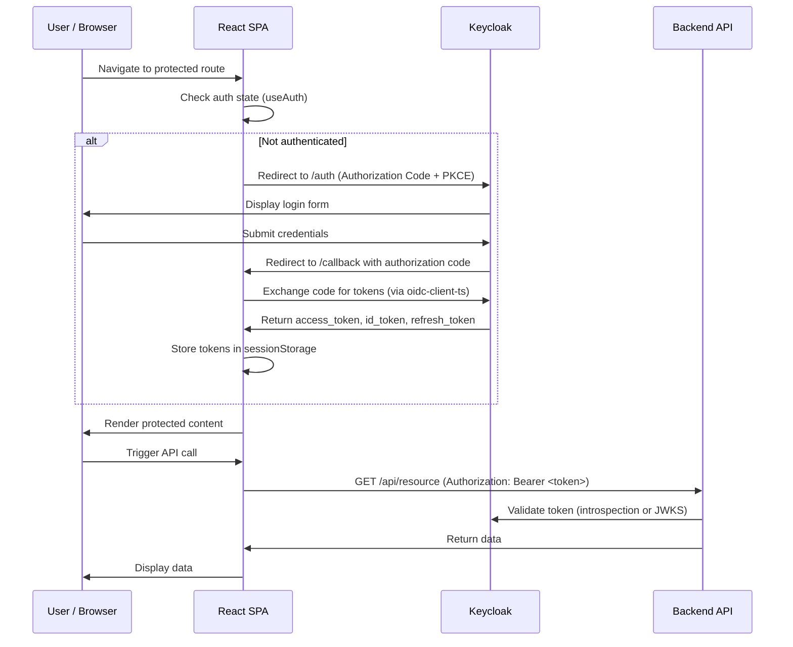
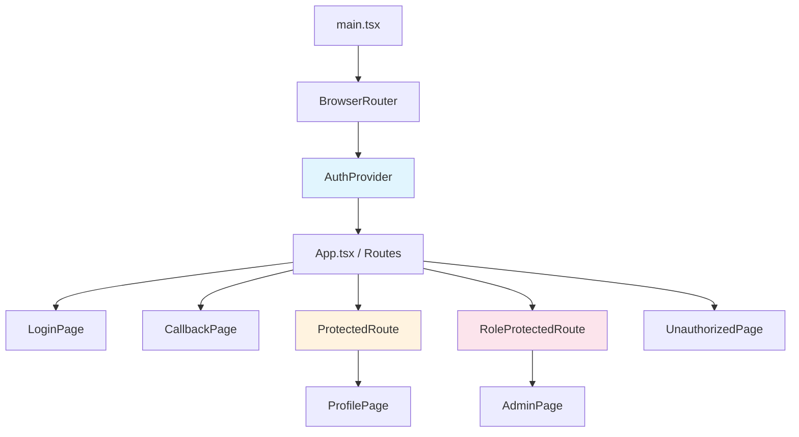
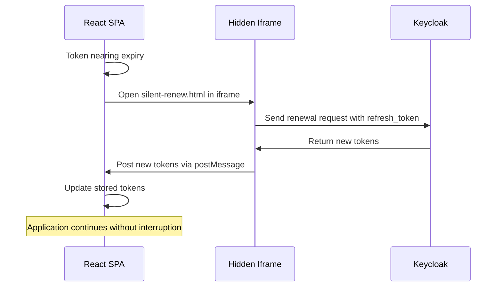

# 14-08. React 19 Integration Guide

This guide provides a comprehensive walkthrough for integrating a **React 19** single-page application with **Keycloak** using the OpenID Connect (OIDC) protocol. It covers authentication, authorization, role-based access control, API communication, multi-tenant support, observability, and testing.

---

## Table of Contents

1. [Prerequisites](#1-prerequisites)
2. [Dependencies](#2-dependencies)
3. [Project Structure](#3-project-structure)
4. [OIDC Configuration](#4-oidc-configuration)
5. [AuthProvider Setup](#5-authprovider-setup)
6. [Auth Hooks](#6-auth-hooks)
7. [Protected Routes](#7-protected-routes)
8. [Role-Based Access Control](#8-role-based-access-control)
9. [Example Pages](#9-example-pages)
10. [Calling Protected APIs](#10-calling-protected-apis)
11. [Silent Token Renewal](#11-silent-token-renewal)
12. [Logout](#12-logout)
13. [Multi-Tenant Support](#13-multi-tenant-support)
14. [OpenTelemetry Instrumentation](#14-opentelemetry-instrumentation)
15. [Environment Variables](#15-environment-variables)
16. [Testing](#16-testing)
17. [Docker Compose for Local Development](#17-docker-compose-for-local-development)
18. [Architecture Overview](#18-architecture-overview)

---

## 1. Prerequisites

| Requirement        | Version    | Notes                                      |
|--------------------|------------|--------------------------------------------|
| Node.js            | 22.x LTS   | Required for modern JavaScript support     |
| npm or pnpm        | 10.x+ / 9.x+ | Package manager                         |
| Vite               | 6.x        | Recommended build tool (CRA also supported)|
| Keycloak           | 26.x+      | Running instance with realm configured     |
| Browser            | Modern     | Chrome, Firefox, Edge, Safari              |

Ensure a Keycloak realm is configured with a **public** client (Authorization Code Flow with PKCE). The client must have the following settings:

- **Client Protocol**: openid-connect
- **Access Type**: public
- **Valid Redirect URIs**: `http://localhost:5173/*` (development)
- **Web Origins**: `http://localhost:5173` (development)
- **Post Logout Redirect URIs**: `http://localhost:5173/`

---

## 2. Dependencies

Install the required packages:

```bash
npm install react@^19.0.0 react-dom@^19.0.0 react-router-dom@^7.0.0 \
  oidc-client-ts@^3.1.0 react-oidc-context@^3.2.0
```

| Package              | Version | Purpose                                  |
|----------------------|---------|------------------------------------------|
| `react`              | 19.x    | UI framework                             |
| `react-dom`          | 19.x    | DOM renderer                             |
| `react-router-dom`   | 7.x     | Client-side routing                      |
| `oidc-client-ts`     | 3.1.x   | OIDC/OAuth 2.0 client library            |
| `react-oidc-context`  | 3.2.x   | React bindings for oidc-client-ts        |

---

## 3. Project Structure

```
src/
  auth/
    AuthProvider.tsx        # OIDC provider wrapper
    ProtectedRoute.tsx      # Route guard for authenticated users
    RoleProtectedRoute.tsx  # Route guard for role-based access
    HasRole.tsx             # Conditional rendering by role
    useHasRole.ts           # Hook to check user roles
    authConfig.ts           # OIDC configuration
  pages/
    LoginPage.tsx           # Login landing page
    CallbackPage.tsx        # OIDC redirect callback handler
    ProfilePage.tsx         # User profile display
    AdminPage.tsx           # Admin-only page
    UnauthorizedPage.tsx    # Access denied page
  services/
    api.ts                  # API client with token attachment
  telemetry/
    setup.ts                # OpenTelemetry initialization
  App.tsx                   # Root component with routing
  main.tsx                  # Application entry point
```

---

## 4. OIDC Configuration

Create the OIDC configuration file that connects the React application to Keycloak.

**`src/auth/authConfig.ts`**

```typescript
import { WebStorageStateStore, type UserManagerSettings } from "oidc-client-ts";

export const oidcConfig: UserManagerSettings = {
  authority: import.meta.env.VITE_KEYCLOAK_AUTHORITY,
  // e.g., "https://keycloak.example.com/realms/my-realm"

  client_id: import.meta.env.VITE_KEYCLOAK_CLIENT_ID,
  // e.g., "react-spa"

  redirect_uri: import.meta.env.VITE_REDIRECT_URI,
  // e.g., "http://localhost:5173/callback"

  post_logout_redirect_uri: import.meta.env.VITE_POST_LOGOUT_REDIRECT_URI,
  // e.g., "http://localhost:5173/"

  scope: "openid profile email",
  response_type: "code",

  automaticSilentRenew: true,
  silent_redirect_uri: import.meta.env.VITE_SILENT_REDIRECT_URI,
  // e.g., "http://localhost:5173/silent-renew.html"

  userStore: new WebStorageStateStore({ store: window.sessionStorage }),
};
```

### Configuration Parameters

| Parameter                  | Value / Source                          | Description                                         |
|----------------------------|----------------------------------------|-----------------------------------------------------|
| `authority`                | Keycloak realm URL                     | OIDC discovery endpoint base                        |
| `client_id`                | Keycloak client ID                     | Public client identifier                            |
| `redirect_uri`             | Application callback URL               | Where Keycloak redirects after login                 |
| `post_logout_redirect_uri` | Application home URL                   | Where Keycloak redirects after logout                |
| `scope`                    | `openid profile email`                 | Requested OIDC scopes                               |
| `response_type`            | `code`                                 | Authorization Code Flow (PKCE applied automatically) |
| `automaticSilentRenew`     | `true`                                 | Enables background token refresh                    |
| `silent_redirect_uri`      | Silent renew HTML page URL             | Hidden iframe callback for token refresh             |

---

## 5. AuthProvider Setup

Wrap the application with the OIDC authentication provider.

**`src/auth/AuthProvider.tsx`**

```tsx
import { ReactNode } from "react";
import { AuthProvider as OidcAuthProvider } from "react-oidc-context";
import { oidcConfig } from "./authConfig";

interface AuthProviderProps {
  children: ReactNode;
}

export function AuthProvider({ children }: AuthProviderProps) {
  const onSigninCallback = () => {
    // Remove OIDC query parameters from the URL after successful login
    window.history.replaceState({}, document.title, window.location.pathname);
  };

  return (
    <OidcAuthProvider
      {...oidcConfig}
      onSigninCallback={onSigninCallback}
    >
      {children}
    </OidcAuthProvider>
  );
}
```

**`src/main.tsx`**

```tsx
import { StrictMode } from "react";
import { createRoot } from "react-dom/client";
import { BrowserRouter } from "react-router-dom";
import { AuthProvider } from "./auth/AuthProvider";
import { App } from "./App";
import { initTelemetry } from "./telemetry/setup";

// Initialize OpenTelemetry before rendering
initTelemetry();

createRoot(document.getElementById("root")!).render(
  <StrictMode>
    <BrowserRouter>
      <AuthProvider>
        <App />
      </AuthProvider>
    </BrowserRouter>
  </StrictMode>
);
```

---

## 6. Auth Hooks

The `react-oidc-context` library provides the `useAuth()` hook for accessing authentication state.

### Core Hook Usage

```tsx
import { useAuth } from "react-oidc-context";

function MyComponent() {
  const auth = useAuth();

  // Authentication state
  const isAuthenticated: boolean = auth.isAuthenticated;
  const isLoading: boolean = auth.isLoading;

  // User information
  const user = auth.user;                     // Full OIDC User object
  const profile = auth.user?.profile;          // ID token claims
  const accessToken = auth.user?.access_token; // Raw access token string

  // Actions
  const login = () => auth.signinRedirect();
  const logout = () => auth.signoutRedirect();

  return null;
}
```

### Auth State Reference

| Property            | Type        | Description                              |
|---------------------|-------------|------------------------------------------|
| `isAuthenticated`   | `boolean`   | Whether the user is logged in            |
| `isLoading`         | `boolean`   | Whether auth state is being determined   |
| `user`              | `User|null` | OIDC User object with tokens and claims  |
| `user?.profile`     | `object`    | Decoded ID token claims                  |
| `user?.access_token`| `string`    | Raw JWT access token                     |
| `signinRedirect()`  | `function`  | Initiate login redirect to Keycloak      |
| `signoutRedirect()` | `function`  | Initiate logout redirect                 |
| `signinSilent()`    | `function`  | Manually trigger silent token renewal    |

---

## 7. Protected Routes

### ProtectedRoute Component

Restricts access to authenticated users. Unauthenticated users are redirected to the login page.

**`src/auth/ProtectedRoute.tsx`**

```tsx
import { ReactNode } from "react";
import { Navigate, useLocation } from "react-router-dom";
import { useAuth } from "react-oidc-context";

interface ProtectedRouteProps {
  children: ReactNode;
}

export function ProtectedRoute({ children }: ProtectedRouteProps) {
  const auth = useAuth();
  const location = useLocation();

  if (auth.isLoading) {
    return <div>Loading authentication...</div>;
  }

  if (!auth.isAuthenticated) {
    return <Navigate to="/login" state={{ from: location }} replace />;
  }

  return <>{children}</>;
}
```

### RoleProtectedRoute Component

Extends `ProtectedRoute` to additionally check user roles from the access token.

**`src/auth/RoleProtectedRoute.tsx`**

```tsx
import { ReactNode } from "react";
import { Navigate, useLocation } from "react-router-dom";
import { useAuth } from "react-oidc-context";

interface RoleProtectedRouteProps {
  children: ReactNode;
  roles: string[];
  requireAll?: boolean; // If true, user must have ALL roles; default: any one
}

function getRolesFromToken(accessToken: string): string[] {
  try {
    const payload = JSON.parse(atob(accessToken.split(".")[1]));
    const realmRoles: string[] = payload.realm_access?.roles ?? [];
    const clientRoles: string[] = Object.values(
      payload.resource_access ?? {}
    ).flatMap((resource: any) => resource.roles ?? []);
    return [...realmRoles, ...clientRoles];
  } catch {
    return [];
  }
}

export function RoleProtectedRoute({
  children,
  roles,
  requireAll = false,
}: RoleProtectedRouteProps) {
  const auth = useAuth();
  const location = useLocation();

  if (auth.isLoading) {
    return <div>Loading authentication...</div>;
  }

  if (!auth.isAuthenticated) {
    return <Navigate to="/login" state={{ from: location }} replace />;
  }

  const userRoles = getRolesFromToken(auth.user!.access_token);
  const hasAccess = requireAll
    ? roles.every((role) => userRoles.includes(role))
    : roles.some((role) => userRoles.includes(role));

  if (!hasAccess) {
    return <Navigate to="/unauthorized" replace />;
  }

  return <>{children}</>;
}
```

### Routing Configuration

**`src/App.tsx`**

```tsx
import { Routes, Route } from "react-router-dom";
import { ProtectedRoute } from "./auth/ProtectedRoute";
import { RoleProtectedRoute } from "./auth/RoleProtectedRoute";
import { LoginPage } from "./pages/LoginPage";
import { CallbackPage } from "./pages/CallbackPage";
import { ProfilePage } from "./pages/ProfilePage";
import { AdminPage } from "./pages/AdminPage";
import { UnauthorizedPage } from "./pages/UnauthorizedPage";

export function App() {
  return (
    <Routes>
      {/* Public routes */}
      <Route path="/login" element={<LoginPage />} />
      <Route path="/callback" element={<CallbackPage />} />
      <Route path="/unauthorized" element={<UnauthorizedPage />} />

      {/* Authenticated routes */}
      <Route
        path="/profile"
        element={
          <ProtectedRoute>
            <ProfilePage />
          </ProtectedRoute>
        }
      />

      {/* Role-protected routes */}
      <Route
        path="/admin"
        element={
          <RoleProtectedRoute roles={["admin", "realm-admin"]}>
            <AdminPage />
          </RoleProtectedRoute>
        }
      />

      {/* Default redirect */}
      <Route path="/" element={<LoginPage />} />
    </Routes>
  );
}
```

---

## 8. Role-Based Access Control

### useHasRole Hook

**`src/auth/useHasRole.ts`**

```typescript
import { useAuth } from "react-oidc-context";

function getRolesFromToken(accessToken: string): string[] {
  try {
    const payload = JSON.parse(atob(accessToken.split(".")[1]));
    const realmRoles: string[] = payload.realm_access?.roles ?? [];
    const clientRoles: string[] = Object.values(
      payload.resource_access ?? {}
    ).flatMap((resource: any) => resource.roles ?? []);
    return [...realmRoles, ...clientRoles];
  } catch {
    return [];
  }
}

export function useHasRole(role: string): boolean {
  const auth = useAuth();
  if (!auth.isAuthenticated || !auth.user?.access_token) {
    return false;
  }
  const roles = getRolesFromToken(auth.user.access_token);
  return roles.includes(role);
}

export function useRoles(): string[] {
  const auth = useAuth();
  if (!auth.isAuthenticated || !auth.user?.access_token) {
    return [];
  }
  return getRolesFromToken(auth.user.access_token);
}
```

### HasRole Component

Renders children only if the current user has the specified role.

**`src/auth/HasRole.tsx`**

```tsx
import { ReactNode } from "react";
import { useHasRole } from "./useHasRole";

interface HasRoleProps {
  role: string;
  children: ReactNode;
  fallback?: ReactNode;
}

export function HasRole({ role, children, fallback = null }: HasRoleProps) {
  const hasRole = useHasRole(role);
  return hasRole ? <>{children}</> : <>{fallback}</>;
}
```

### Usage Example

```tsx
import { HasRole } from "./auth/HasRole";

function NavigationBar() {
  return (
    <nav>
      <a href="/profile">Profile</a>
      <HasRole role="admin">
        <a href="/admin">Admin Panel</a>
      </HasRole>
      <HasRole role="editor" fallback={<span>View Only</span>}>
        <a href="/editor">Editor</a>
      </HasRole>
    </nav>
  );
}
```

---

## 9. Example Pages

### LoginPage

**`src/pages/LoginPage.tsx`**

```tsx
import { useAuth } from "react-oidc-context";
import { Navigate } from "react-router-dom";

export function LoginPage() {
  const auth = useAuth();

  if (auth.isAuthenticated) {
    return <Navigate to="/profile" replace />;
  }

  return (
    <div>
      <h1>Welcome</h1>
      <p>Please log in to access the application.</p>
      <button onClick={() => auth.signinRedirect()} disabled={auth.isLoading}>
        {auth.isLoading ? "Loading..." : "Log in with Keycloak"}
      </button>
      {auth.error && <p style={{ color: "red" }}>Error: {auth.error.message}</p>}
    </div>
  );
}
```

### CallbackPage

**`src/pages/CallbackPage.tsx`**

```tsx
import { useAuth } from "react-oidc-context";
import { Navigate } from "react-router-dom";

export function CallbackPage() {
  const auth = useAuth();

  if (auth.isLoading) {
    return <div>Processing login...</div>;
  }

  if (auth.error) {
    return (
      <div>
        <h2>Authentication Error</h2>
        <p>{auth.error.message}</p>
        <a href="/login">Return to Login</a>
      </div>
    );
  }

  if (auth.isAuthenticated) {
    return <Navigate to="/profile" replace />;
  }

  return <Navigate to="/login" replace />;
}
```

### ProfilePage

**`src/pages/ProfilePage.tsx`**

```tsx
import { useAuth } from "react-oidc-context";
import { useRoles } from "../auth/useHasRole";

export function ProfilePage() {
  const auth = useAuth();
  const roles = useRoles();
  const profile = auth.user?.profile;

  return (
    <div>
      <h1>User Profile</h1>
      <table>
        <tbody>
          <tr>
            <td><strong>Name</strong></td>
            <td>{profile?.name}</td>
          </tr>
          <tr>
            <td><strong>Email</strong></td>
            <td>{profile?.email as string}</td>
          </tr>
          <tr>
            <td><strong>Subject</strong></td>
            <td>{profile?.sub}</td>
          </tr>
          <tr>
            <td><strong>Roles</strong></td>
            <td>{roles.join(", ") || "None"}</td>
          </tr>
        </tbody>
      </table>

      <h2>Token Details</h2>
      <p><strong>Token expires at:</strong>{" "}
        {auth.user?.expires_at
          ? new Date(auth.user.expires_at * 1000).toLocaleString()
          : "N/A"}
      </p>

      <button onClick={() => auth.signoutRedirect()}>Log Out</button>
    </div>
  );
}
```

### AdminPage

**`src/pages/AdminPage.tsx`**

```tsx
import { useState, useEffect } from "react";
import { apiClient } from "../services/api";

interface UserRecord {
  id: string;
  username: string;
  email: string;
}

export function AdminPage() {
  const [users, setUsers] = useState<UserRecord[]>([]);
  const [error, setError] = useState<string | null>(null);

  useEffect(() => {
    apiClient<UserRecord[]>("/admin/users")
      .then(setUsers)
      .catch((err) => setError(err.message));
  }, []);

  return (
    <div>
      <h1>Admin Panel</h1>
      {error && <p style={{ color: "red" }}>{error}</p>}
      <table>
        <thead>
          <tr>
            <th>ID</th>
            <th>Username</th>
            <th>Email</th>
          </tr>
        </thead>
        <tbody>
          {users.map((user) => (
            <tr key={user.id}>
              <td>{user.id}</td>
              <td>{user.username}</td>
              <td>{user.email}</td>
            </tr>
          ))}
        </tbody>
      </table>
    </div>
  );
}
```

### UnauthorizedPage

**`src/pages/UnauthorizedPage.tsx`**

```tsx
import { useNavigate } from "react-router-dom";

export function UnauthorizedPage() {
  const navigate = useNavigate();

  return (
    <div>
      <h1>Access Denied</h1>
      <p>You do not have the required permissions to view this page.</p>
      <button onClick={() => navigate("/profile")}>Go to Profile</button>
      <button onClick={() => navigate("/")}>Go to Home</button>
    </div>
  );
}
```

---

## 10. Calling Protected APIs

Create an API utility that automatically attaches the Bearer token to outgoing requests.

**`src/services/api.ts`**

```typescript
import { User } from "oidc-client-ts";

const API_BASE_URL = import.meta.env.VITE_API_BASE_URL || "http://localhost:8080/api";

function getAccessToken(): string | null {
  const oidcStorage = sessionStorage.getItem(
    `oidc.user:${import.meta.env.VITE_KEYCLOAK_AUTHORITY}:${import.meta.env.VITE_KEYCLOAK_CLIENT_ID}`
  );
  if (!oidcStorage) return null;

  const user: User = User.fromStorageString(oidcStorage);
  return user.access_token;
}

export async function apiClient<T>(
  endpoint: string,
  options: RequestInit = {}
): Promise<T> {
  const token = getAccessToken();

  const headers: HeadersInit = {
    "Content-Type": "application/json",
    ...options.headers,
  };

  if (token) {
    (headers as Record<string, string>)["Authorization"] = `Bearer ${token}`;
  }

  const response = await fetch(`${API_BASE_URL}${endpoint}`, {
    ...options,
    headers,
  });

  if (response.status === 401) {
    // Token expired or invalid -- trigger re-authentication
    window.location.href = "/login";
    throw new Error("Authentication required");
  }

  if (response.status === 403) {
    throw new Error("Insufficient permissions");
  }

  if (!response.ok) {
    throw new Error(`API error: ${response.status} ${response.statusText}`);
  }

  return response.json() as Promise<T>;
}
```

### Usage in Components

```tsx
import { apiClient } from "../services/api";

// GET request
const data = await apiClient<MyDataType>("/resource");

// POST request
const created = await apiClient<MyDataType>("/resource", {
  method: "POST",
  body: JSON.stringify({ name: "New Item" }),
});

// DELETE request
await apiClient<void>("/resource/123", { method: "DELETE" });
```

---

## 11. Silent Token Renewal

Silent token renewal keeps the user session alive without requiring interaction. This is handled automatically by `oidc-client-ts` when `automaticSilentRenew` is set to `true`.

### Silent Renew HTML Page

Create a static HTML file at `public/silent-renew.html`:

```html
<!DOCTYPE html>
<html>
<head>
  <title>Silent Renew</title>
</head>
<body>
  <script src="https://cdn.jsdelivr.net/npm/oidc-client-ts/dist/browser/oidc-client-ts.min.js"></script>
  <script>
    new oidcClientTs.UserManager().signinSilentCallback();
  </script>
</body>
</html>
```

### Handling Renewal Events

You can subscribe to token renewal events in the AuthProvider:

```tsx
import { useAuth } from "react-oidc-context";
import { useEffect } from "react";

function TokenRenewalListener() {
  const auth = useAuth();

  useEffect(() => {
    const handleRenewed = () => {
      console.log("Token silently renewed");
    };

    const handleError = () => {
      console.error("Silent renewal failed, redirecting to login");
      auth.signinRedirect();
    };

    // Access underlying UserManager events
    auth.events.addAccessTokenExpired(handleError);
    auth.events.addSilentRenewError(handleError);
    auth.events.addUserLoaded(handleRenewed);

    return () => {
      auth.events.removeAccessTokenExpired(handleError);
      auth.events.removeSilentRenewError(handleError);
      auth.events.removeUserLoaded(handleRenewed);
    };
  }, [auth]);

  return null;
}
```

---

## 12. Logout

Implement RP-initiated logout by redirecting to the Keycloak end-session endpoint.

```tsx
import { useAuth } from "react-oidc-context";

function LogoutButton() {
  const auth = useAuth();

  const handleLogout = () => {
    auth.signoutRedirect({
      post_logout_redirect_uri: import.meta.env.VITE_POST_LOGOUT_REDIRECT_URI,
    });
  };

  return <button onClick={handleLogout}>Log Out</button>;
}
```

The `signoutRedirect` method:

1. Clears the local session storage.
2. Redirects the browser to the Keycloak `end_session_endpoint`.
3. Keycloak terminates the SSO session.
4. Keycloak redirects the browser back to the `post_logout_redirect_uri`.

---

## 13. Multi-Tenant Support

For applications that serve multiple tenants, each mapped to a different Keycloak realm, configure the OIDC `UserManager` dynamically.

```typescript
// src/auth/multiTenantConfig.ts
import { UserManager, UserManagerSettings, WebStorageStateStore } from "oidc-client-ts";

const tenantConfigs: Record<string, UserManagerSettings> = {};

export function getUserManagerForTenant(tenantId: string): UserManager {
  if (!tenantConfigs[tenantId]) {
    const settings: UserManagerSettings = {
      authority: `${import.meta.env.VITE_KEYCLOAK_BASE_URL}/realms/${tenantId}`,
      client_id: import.meta.env.VITE_KEYCLOAK_CLIENT_ID,
      redirect_uri: `${window.location.origin}/callback?tenant=${tenantId}`,
      post_logout_redirect_uri: `${window.location.origin}/?tenant=${tenantId}`,
      scope: "openid profile email",
      response_type: "code",
      automaticSilentRenew: true,
      silent_redirect_uri: `${window.location.origin}/silent-renew.html`,
      userStore: new WebStorageStateStore({
        store: window.sessionStorage,
        prefix: `oidc.${tenantId}.`,
      }),
    };
    tenantConfigs[tenantId] = settings;
  }

  return new UserManager(tenantConfigs[tenantId]);
}
```

### Multi-Tenant AuthProvider

```tsx
import { ReactNode, useMemo } from "react";
import { AuthProvider as OidcAuthProvider } from "react-oidc-context";
import { useSearchParams } from "react-router-dom";
import { getUserManagerForTenant } from "./multiTenantConfig";

export function MultiTenantAuthProvider({ children }: { children: ReactNode }) {
  const [searchParams] = useSearchParams();
  const tenantId = searchParams.get("tenant") || "default-realm";

  const userManager = useMemo(
    () => getUserManagerForTenant(tenantId),
    [tenantId]
  );

  return (
    <OidcAuthProvider userManager={userManager}>
      {children}
    </OidcAuthProvider>
  );
}
```

---

## 14. OpenTelemetry Instrumentation

Add browser-side observability to trace page loads and API calls, enriching spans with user context.

### Install Dependencies

```bash
npm install @opentelemetry/sdk-trace-web @opentelemetry/instrumentation-document-load \
  @opentelemetry/instrumentation-fetch @opentelemetry/exporter-trace-otlp-http \
  @opentelemetry/resources @opentelemetry/semantic-conventions \
  @opentelemetry/context-zone
```

### Telemetry Setup

**`src/telemetry/setup.ts`**

```typescript
import { WebTracerProvider } from "@opentelemetry/sdk-trace-web";
import { BatchSpanProcessor } from "@opentelemetry/sdk-trace-web";
import { OTLPTraceExporter } from "@opentelemetry/exporter-trace-otlp-http";
import { ZoneContextManager } from "@opentelemetry/context-zone";
import { Resource } from "@opentelemetry/resources";
import {
  ATTR_SERVICE_NAME,
  ATTR_SERVICE_VERSION,
} from "@opentelemetry/semantic-conventions";
import { DocumentLoadInstrumentation } from "@opentelemetry/instrumentation-document-load";
import { FetchInstrumentation } from "@opentelemetry/instrumentation-fetch";
import { registerInstrumentations } from "@opentelemetry/instrumentation";
import { User } from "oidc-client-ts";

export function initTelemetry() {
  const resource = new Resource({
    [ATTR_SERVICE_NAME]: "react-spa",
    [ATTR_SERVICE_VERSION]: import.meta.env.VITE_APP_VERSION || "0.0.0",
  });

  const exporter = new OTLPTraceExporter({
    url: import.meta.env.VITE_OTEL_EXPORTER_URL || "http://localhost:4318/v1/traces",
  });

  const provider = new WebTracerProvider({
    resource,
    spanProcessors: [new BatchSpanProcessor(exporter)],
  });

  provider.register({
    contextManager: new ZoneContextManager(),
  });

  registerInstrumentations({
    instrumentations: [
      new DocumentLoadInstrumentation(),
      new FetchInstrumentation({
        propagateTraceHeaderCorsUrls: [
          new RegExp(import.meta.env.VITE_API_BASE_URL || "http://localhost:8080"),
        ],
        applyCustomAttributesOnSpan: (span) => {
          // Add user context to fetch spans
          const oidcStorage = sessionStorage.getItem(
            `oidc.user:${import.meta.env.VITE_KEYCLOAK_AUTHORITY}:${import.meta.env.VITE_KEYCLOAK_CLIENT_ID}`
          );
          if (oidcStorage) {
            try {
              const user = User.fromStorageString(oidcStorage);
              span.setAttribute("enduser.id", user.profile.sub ?? "unknown");
              span.setAttribute("enduser.name", user.profile.name ?? "unknown");
            } catch {
              // Ignore parse errors
            }
          }
        },
      }),
    ],
  });
}
```

---

## 15. Environment Variables

Create a `.env` file in the project root:

```env
# Keycloak OIDC
VITE_KEYCLOAK_AUTHORITY=https://keycloak.example.com/realms/my-realm
VITE_KEYCLOAK_CLIENT_ID=react-spa
VITE_KEYCLOAK_BASE_URL=https://keycloak.example.com
VITE_REDIRECT_URI=http://localhost:5173/callback
VITE_POST_LOGOUT_REDIRECT_URI=http://localhost:5173/
VITE_SILENT_REDIRECT_URI=http://localhost:5173/silent-renew.html

# API
VITE_API_BASE_URL=http://localhost:8080/api

# OpenTelemetry
VITE_OTEL_EXPORTER_URL=http://localhost:4318/v1/traces
VITE_APP_VERSION=1.0.0
```

| Variable                          | Description                              |
|-----------------------------------|------------------------------------------|
| `VITE_KEYCLOAK_AUTHORITY`         | Full Keycloak realm URL                  |
| `VITE_KEYCLOAK_CLIENT_ID`        | OIDC client identifier                    |
| `VITE_KEYCLOAK_BASE_URL`         | Keycloak base URL (for multi-tenant)      |
| `VITE_REDIRECT_URI`              | Post-login redirect target                |
| `VITE_POST_LOGOUT_REDIRECT_URI`  | Post-logout redirect target               |
| `VITE_SILENT_REDIRECT_URI`       | Silent renew iframe URL                   |
| `VITE_API_BASE_URL`              | Backend API base URL                      |
| `VITE_OTEL_EXPORTER_URL`         | OTLP collector endpoint                   |
| `VITE_APP_VERSION`               | Application version for telemetry         |

---

## 16. Testing

### Install Test Dependencies

```bash
npm install -D vitest @testing-library/react @testing-library/jest-dom \
  @testing-library/user-event jsdom
```

### Vitest Configuration

**`vitest.config.ts`**

```typescript
import { defineConfig } from "vitest/config";

export default defineConfig({
  test: {
    environment: "jsdom",
    globals: true,
    setupFiles: ["./src/test/setup.ts"],
  },
});
```

### Mock AuthProvider

**`src/test/mockAuthProvider.tsx`**

```tsx
import { ReactNode } from "react";
import { AuthContext, AuthContextProps } from "react-oidc-context";
import { User } from "oidc-client-ts";

interface MockAuthProviderProps {
  children: ReactNode;
  isAuthenticated?: boolean;
  user?: Partial<User>;
  roles?: string[];
}

export function MockAuthProvider({
  children,
  isAuthenticated = false,
  user = {},
  roles = [],
}: MockAuthProviderProps) {
  // Build a mock access token with roles
  const payload = {
    sub: user?.profile?.sub || "test-user-id",
    realm_access: { roles },
    resource_access: {},
  };
  const fakeToken = `header.${btoa(JSON.stringify(payload))}.signature`;

  const mockAuth: AuthContextProps = {
    isAuthenticated,
    isLoading: false,
    user: isAuthenticated
      ? ({
          access_token: fakeToken,
          profile: {
            sub: "test-user-id",
            name: "Test User",
            email: "test@example.com",
            ...user?.profile,
          },
          expires_at: Math.floor(Date.now() / 1000) + 3600,
          ...user,
        } as User)
      : null,
    signinRedirect: vi.fn(),
    signoutRedirect: vi.fn(),
    signinSilent: vi.fn(),
    removeUser: vi.fn(),
    signinPopup: vi.fn(),
    signoutPopup: vi.fn(),
    signinResourceOwnerCredentials: vi.fn(),
    querySessionStatus: vi.fn(),
    revokeTokens: vi.fn(),
    startSilentRenew: vi.fn(),
    stopSilentRenew: vi.fn(),
    clearStaleState: vi.fn(),
    events: {} as any,
    settings: {} as any,
    activeNavigator: undefined,
    error: undefined,
  };

  return (
    <AuthContext.Provider value={mockAuth}>
      {children}
    </AuthContext.Provider>
  );
}
```

### Example Test

```tsx
import { render, screen } from "@testing-library/react";
import { MemoryRouter } from "react-router-dom";
import { describe, it, expect } from "vitest";
import { MockAuthProvider } from "./mockAuthProvider";
import { ProfilePage } from "../pages/ProfilePage";

describe("ProfilePage", () => {
  it("displays user profile when authenticated", () => {
    render(
      <MemoryRouter>
        <MockAuthProvider
          isAuthenticated={true}
          user={{
            profile: {
              sub: "user-123",
              name: "Jane Doe",
              email: "jane@example.com",
              iss: "",
              aud: "",
              exp: 0,
              iat: 0,
            },
          }}
          roles={["admin"]}
        >
          <ProfilePage />
        </MockAuthProvider>
      </MemoryRouter>
    );

    expect(screen.getByText("Jane Doe")).toBeInTheDocument();
    expect(screen.getByText("jane@example.com")).toBeInTheDocument();
  });
});

describe("RoleProtectedRoute", () => {
  it("redirects to /unauthorized when user lacks required role", () => {
    render(
      <MemoryRouter initialEntries={["/admin"]}>
        <MockAuthProvider isAuthenticated={true} roles={["user"]}>
          <RoleProtectedRoute roles={["admin"]}>
            <AdminPage />
          </RoleProtectedRoute>
        </MockAuthProvider>
      </MemoryRouter>
    );

    // User should not see the admin content
    expect(screen.queryByText("Admin Panel")).not.toBeInTheDocument();
  });
});
```

---

## 17. Docker Compose for Local Development

```yaml
# docker-compose.yml
services:
  keycloak:
    image: quay.io/keycloak/keycloak:26.2
    command: start-dev
    environment:
      KC_BOOTSTRAP_ADMIN_USERNAME: admin
      KC_BOOTSTRAP_ADMIN_PASSWORD: admin
      KC_HTTP_PORT: 8443
    ports:
      - "8443:8443"
    volumes:
      - keycloak_data:/opt/keycloak/data

  react-app:
    build:
      context: .
      dockerfile: Dockerfile
    ports:
      - "5173:5173"
    environment:
      VITE_KEYCLOAK_AUTHORITY: http://localhost:8443/realms/my-realm
      VITE_KEYCLOAK_CLIENT_ID: react-spa
      VITE_REDIRECT_URI: http://localhost:5173/callback
      VITE_POST_LOGOUT_REDIRECT_URI: http://localhost:5173/
      VITE_SILENT_REDIRECT_URI: http://localhost:5173/silent-renew.html
      VITE_API_BASE_URL: http://localhost:8080/api
    depends_on:
      - keycloak

volumes:
  keycloak_data:
```

---

## 18. Architecture Overview

### Authentication Flow



### Component Architecture



### Token Renewal Flow



---

## 19. Scripts and DevOps Tooling

Each example project includes a `scripts/` folder with automation scripts for common development and operations tasks. These scripts can be executed independently or through an interactive menu.

### Interactive Menu

Launch the interactive DevOps menu from the project root:

```bash
./scripts/devops-menu.sh
```

The menu presents a numbered list of operations with colored output, prerequisite checks, and error handling.

### Available Scripts

| # | Operation | Independent Command | Description |
|---|-----------|-------------------|-------------|
| 1 | Start Keycloak | `docker compose -f ../../infrastructure/docker-compose.yml up -d keycloak` | Start the Keycloak identity provider container |
| 2 | Install dependencies | `npm ci` | Install project dependencies from the lock file |
| 3 | Run development server | `npm run dev` | Start Vite development server with HMR |
| 4 | Run unit tests | `npx vitest run` | Execute the unit test suite using Vitest |
| 5 | Run E2E tests | `npm run test:e2e` | Execute end-to-end tests using Playwright |
| 6 | Generate coverage report | `npx vitest run --coverage` | Run unit tests and produce a coverage report |
| 7 | Build production | `npm run build` | Create an optimized production build |
| 8 | Preview production build | `npm run preview` | Preview the production build locally |
| 9 | Build Docker image | `docker build -t react-iam .` | Build the Docker image for the application |
| 10 | Run with Docker Compose | `docker compose up -d` | Start all services via Docker Compose |
| 11 | Lint | `npm run lint` | Run ESLint across the project |
| 12 | View logs | `docker compose logs -f` | Tail container logs |
| 13 | Stop containers | `docker compose down` | Stop and remove all containers |
| 14 | Clean | `rm -rf dist node_modules` | Remove build artifacts and dependencies |

### Script Location

All scripts are located in the [`examples/frontend/react/scripts/`](../examples/frontend/react/scripts/) directory relative to the project root.

---

**See also:** [Client Applications Hub](14-client-applications.md)
