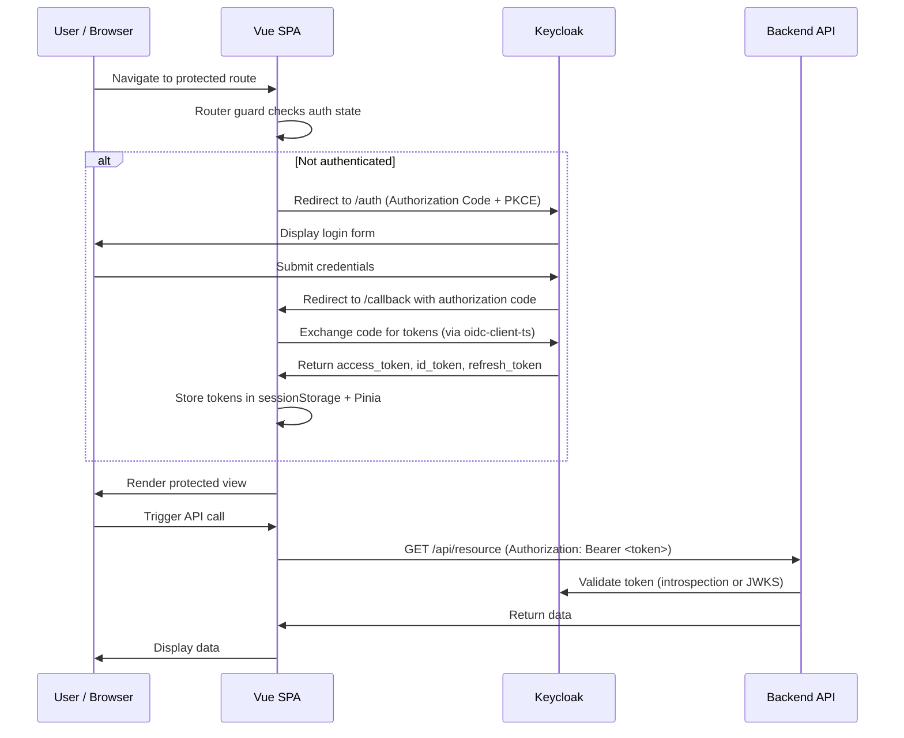
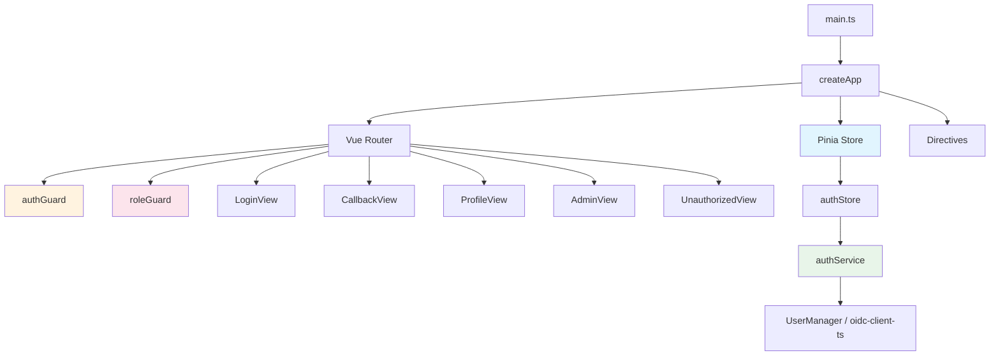
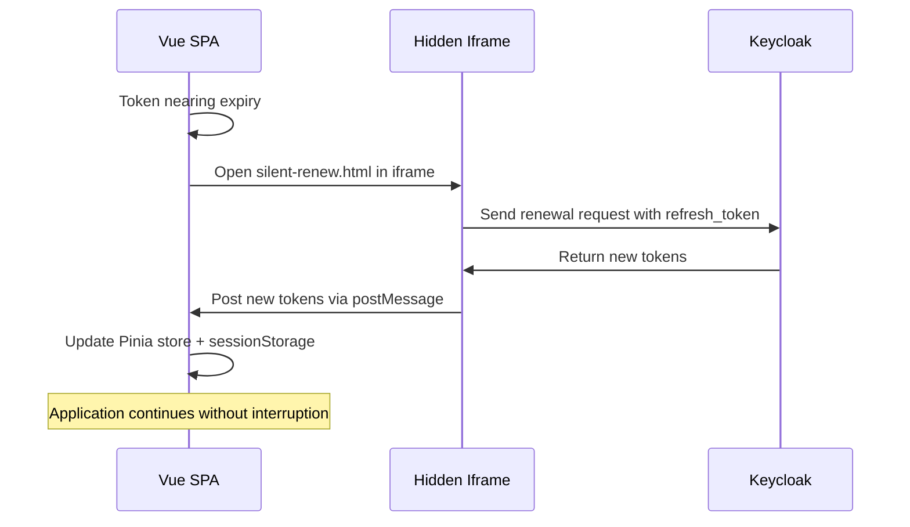
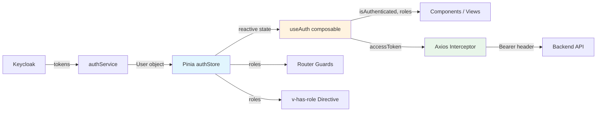

# 14-09. Vue 3.5 Integration Guide

This guide provides a comprehensive walkthrough for integrating a **Vue 3.5** single-page application with **Keycloak** using the OpenID Connect (OIDC) protocol. It covers authentication, authorization, role-based access control, API communication, multi-tenant support, observability, and testing.

---

## Table of Contents

1. [Prerequisites](#1-prerequisites)
2. [Dependencies](#2-dependencies)
3. [Project Structure](#3-project-structure)
4. [OIDC Configuration](#4-oidc-configuration)
5. [Auth Service](#5-auth-service)
6. [Auth Composable](#6-auth-composable)
7. [Pinia Auth Store](#7-pinia-auth-store)
8. [Vue Router Navigation Guards](#8-vue-router-navigation-guards)
9. [Role-Based Access Control](#9-role-based-access-control)
10. [Example Components](#10-example-components)
11. [Calling Protected APIs](#11-calling-protected-apis)
12. [Silent Token Renewal](#12-silent-token-renewal)
13. [Logout](#13-logout)
14. [Multi-Tenant Support](#14-multi-tenant-support)
15. [OpenTelemetry Instrumentation](#15-opentelemetry-instrumentation)
16. [Environment Variables](#16-environment-variables)
17. [Testing](#17-testing)
18. [Docker Compose for Local Development](#18-docker-compose-for-local-development)
19. [Architecture Overview](#19-architecture-overview)

---

## 1. Prerequisites

| Requirement        | Version    | Notes                                      |
|--------------------|------------|--------------------------------------------|
| Node.js            | 22.x LTS   | Required for modern JavaScript support     |
| npm or pnpm        | 10.x+ / 9.x+ | Package manager                         |
| Vite               | 6.x        | Recommended build tool                     |
| Keycloak           | 26.x+      | Running instance with realm configured     |
| Browser            | Modern     | Chrome, Firefox, Edge, Safari              |

Ensure a Keycloak realm is configured with a **public** client (Authorization Code Flow with PKCE). The client must have the following settings:

- **Client Protocol**: openid-connect
- **Access Type**: public
- **Valid Redirect URIs**: `http://localhost:5173/*` (development)
- **Web Origins**: `http://localhost:5173` (development)
- **Post Logout Redirect URIs**: `http://localhost:5173/`

---

## 2. Dependencies

Install the required packages:

```bash
npm install vue@^3.5.0 vue-router@^4.0.0 pinia@^2.0.0 \
  oidc-client-ts@^3.1.0 axios@^1.7.0
```

| Package          | Version | Purpose                                    |
|------------------|---------|--------------------------------------------|
| `vue`            | 3.5.x   | UI framework                               |
| `vue-router`     | 4.x     | Client-side routing                        |
| `pinia`          | 2.x     | State management                           |
| `oidc-client-ts` | 3.1.x   | OIDC/OAuth 2.0 client library              |
| `axios`          | 1.7.x   | HTTP client with interceptor support       |

---

## 3. Project Structure

```
src/
  auth/
    authConfig.ts           # OIDC configuration
    authService.ts          # UserManager wrapper service
    useAuth.ts              # Composition API auth composable
    authStore.ts            # Pinia store for auth state
  guards/
    authGuard.ts            # Router guard for authentication
    roleGuard.ts            # Router guard for role-based access
  directives/
    hasRole.ts              # v-has-role custom directive
  views/
    LoginView.vue           # Login landing page
    CallbackView.vue        # OIDC redirect callback handler
    ProfileView.vue         # User profile display
    AdminView.vue           # Admin-only page
    UnauthorizedView.vue    # Access denied page
  components/
    HasRole.vue             # Conditional rendering component
  services/
    api.ts                  # Axios instance with token interceptor
  telemetry/
    setup.ts                # OpenTelemetry initialization
  App.vue                   # Root component
  main.ts                   # Application entry point
  router.ts                 # Router configuration
```

---

## 4. OIDC Configuration

Create the OIDC configuration file that connects the Vue application to Keycloak.

**`src/auth/authConfig.ts`**

```typescript
import { WebStorageStateStore, type UserManagerSettings } from "oidc-client-ts";

export const oidcConfig: UserManagerSettings = {
  authority: import.meta.env.VITE_KEYCLOAK_AUTHORITY,
  // e.g., "https://keycloak.example.com/realms/my-realm"

  client_id: import.meta.env.VITE_KEYCLOAK_CLIENT_ID,
  // e.g., "vue-spa"

  redirect_uri: import.meta.env.VITE_REDIRECT_URI,
  // e.g., "http://localhost:5173/callback"

  post_logout_redirect_uri: import.meta.env.VITE_POST_LOGOUT_REDIRECT_URI,
  // e.g., "http://localhost:5173/"

  scope: "openid profile email",
  response_type: "code",

  automaticSilentRenew: true,
  silent_redirect_uri: import.meta.env.VITE_SILENT_REDIRECT_URI,
  // e.g., "http://localhost:5173/silent-renew.html"

  userStore: new WebStorageStateStore({ store: window.sessionStorage }),
};
```

### Configuration Parameters

| Parameter                  | Value / Source                          | Description                                         |
|----------------------------|----------------------------------------|-----------------------------------------------------|
| `authority`                | Keycloak realm URL                     | OIDC discovery endpoint base                        |
| `client_id`                | Keycloak client ID                     | Public client identifier                            |
| `redirect_uri`             | Application callback URL               | Where Keycloak redirects after login                 |
| `post_logout_redirect_uri` | Application home URL                   | Where Keycloak redirects after logout                |
| `scope`                    | `openid profile email`                 | Requested OIDC scopes                               |
| `response_type`            | `code`                                 | Authorization Code Flow (PKCE applied automatically) |
| `automaticSilentRenew`     | `true`                                 | Enables background token refresh                    |
| `silent_redirect_uri`      | Silent renew HTML page URL             | Hidden iframe callback for token refresh             |

---

## 5. Auth Service

Wrap the `UserManager` from `oidc-client-ts` in a service class for centralized access.

**`src/auth/authService.ts`**

```typescript
import { UserManager, User, type UserManagerSettings } from "oidc-client-ts";
import { oidcConfig } from "./authConfig";

class AuthService {
  private userManager: UserManager;

  constructor(settings: UserManagerSettings = oidcConfig) {
    this.userManager = new UserManager(settings);
  }

  /** Redirect to Keycloak login page */
  async signinRedirect(): Promise<void> {
    await this.userManager.signinRedirect();
  }

  /** Handle the callback after Keycloak redirects back */
  async signinCallback(): Promise<User> {
    const user = await this.userManager.signinCallback();
    return user;
  }

  /** Perform silent token renewal */
  async signinSilent(): Promise<User | null> {
    return await this.userManager.signinSilent();
  }

  /** Redirect to Keycloak logout endpoint */
  async signoutRedirect(): Promise<void> {
    await this.userManager.signoutRedirect({
      post_logout_redirect_uri: import.meta.env.VITE_POST_LOGOUT_REDIRECT_URI,
    });
  }

  /** Get the currently authenticated user */
  async getUser(): Promise<User | null> {
    return await this.userManager.getUser();
  }

  /** Get the access token string */
  async getAccessToken(): Promise<string | null> {
    const user = await this.userManager.getUser();
    return user?.access_token ?? null;
  }

  /** Extract roles from the access token */
  getRolesFromToken(accessToken: string): string[] {
    try {
      const payload = JSON.parse(atob(accessToken.split(".")[1]));
      const realmRoles: string[] = payload.realm_access?.roles ?? [];
      const clientRoles: string[] = Object.values(
        payload.resource_access ?? {}
      ).flatMap((resource: any) => resource.roles ?? []);
      return [...realmRoles, ...clientRoles];
    } catch {
      return [];
    }
  }

  /** Access the underlying UserManager for event subscriptions */
  getUserManager(): UserManager {
    return this.userManager;
  }

  /** Replace the UserManager (used for multi-tenant switching) */
  setUserManager(settings: UserManagerSettings): void {
    this.userManager = new UserManager(settings);
  }
}

export const authService = new AuthService();
```

---

## 6. Auth Composable

Provide a reactive `useAuth()` composable using the Composition API.

**`src/auth/useAuth.ts`**

```typescript
import { computed } from "vue";
import { useAuthStore } from "./authStore";
import { authService } from "./authService";

export function useAuth() {
  const store = useAuthStore();

  const isAuthenticated = computed(() => store.isAuthenticated);
  const isLoading = computed(() => store.isLoading);
  const user = computed(() => store.user);
  const accessToken = computed(() => store.accessToken);
  const roles = computed(() => store.roles);
  const error = computed(() => store.error);

  async function login() {
    await authService.signinRedirect();
  }

  async function logout() {
    store.clearAuth();
    await authService.signoutRedirect();
  }

  async function handleCallback() {
    store.setLoading(true);
    try {
      const user = await authService.signinCallback();
      store.setUser(user);
      // Clean URL
      window.history.replaceState({}, document.title, window.location.pathname);
    } catch (err: any) {
      store.setError(err.message);
      throw err;
    } finally {
      store.setLoading(false);
    }
  }

  async function checkAuth() {
    store.setLoading(true);
    try {
      const user = await authService.getUser();
      if (user && !user.expired) {
        store.setUser(user);
      } else {
        store.clearAuth();
      }
    } catch (err: any) {
      store.setError(err.message);
    } finally {
      store.setLoading(false);
    }
  }

  function hasRole(role: string): boolean {
    return store.roles.includes(role);
  }

  function hasAnyRole(requiredRoles: string[]): boolean {
    return requiredRoles.some((role) => store.roles.includes(role));
  }

  function hasAllRoles(requiredRoles: string[]): boolean {
    return requiredRoles.every((role) => store.roles.includes(role));
  }

  return {
    // State
    isAuthenticated,
    isLoading,
    user,
    accessToken,
    roles,
    error,

    // Actions
    login,
    logout,
    handleCallback,
    checkAuth,
    hasRole,
    hasAnyRole,
    hasAllRoles,
  };
}
```

---

## 7. Pinia Auth Store

Maintain reactive authentication state using Pinia.

**`src/auth/authStore.ts`**

```typescript
import { defineStore } from "pinia";
import { ref, computed } from "vue";
import { User } from "oidc-client-ts";
import { authService } from "./authService";

export const useAuthStore = defineStore("auth", () => {
  // State
  const user = ref<User | null>(null);
  const isLoading = ref(true);
  const error = ref<string | null>(null);

  // Getters
  const isAuthenticated = computed(() => !!user.value && !user.value.expired);
  const accessToken = computed(() => user.value?.access_token ?? null);
  const profile = computed(() => user.value?.profile ?? null);

  const roles = computed<string[]>(() => {
    if (!user.value?.access_token) return [];
    return authService.getRolesFromToken(user.value.access_token);
  });

  const tokenExpiresAt = computed(() => {
    if (!user.value?.expires_at) return null;
    return new Date(user.value.expires_at * 1000);
  });

  // Actions
  function setUser(newUser: User) {
    user.value = newUser;
    error.value = null;
  }

  function clearAuth() {
    user.value = null;
    error.value = null;
  }

  function setLoading(loading: boolean) {
    isLoading.value = loading;
  }

  function setError(errorMessage: string) {
    error.value = errorMessage;
  }

  return {
    // State
    user,
    isLoading,
    error,

    // Getters
    isAuthenticated,
    accessToken,
    profile,
    roles,
    tokenExpiresAt,

    // Actions
    setUser,
    clearAuth,
    setLoading,
    setError,
  };
});
```

---

## 8. Vue Router Navigation Guards

### Router Configuration

**`src/router.ts`**

```typescript
import { createRouter, createWebHistory, type RouteRecordRaw } from "vue-router";
import LoginView from "./views/LoginView.vue";
import CallbackView from "./views/CallbackView.vue";
import ProfileView from "./views/ProfileView.vue";
import AdminView from "./views/AdminView.vue";
import UnauthorizedView from "./views/UnauthorizedView.vue";
import { authGuard } from "./guards/authGuard";
import { roleGuard } from "./guards/roleGuard";

declare module "vue-router" {
  interface RouteMeta {
    requiresAuth?: boolean;
    roles?: string[];
  }
}

const routes: RouteRecordRaw[] = [
  {
    path: "/",
    redirect: "/login",
  },
  {
    path: "/login",
    name: "Login",
    component: LoginView,
    meta: { requiresAuth: false },
  },
  {
    path: "/callback",
    name: "Callback",
    component: CallbackView,
    meta: { requiresAuth: false },
  },
  {
    path: "/unauthorized",
    name: "Unauthorized",
    component: UnauthorizedView,
    meta: { requiresAuth: false },
  },
  {
    path: "/profile",
    name: "Profile",
    component: ProfileView,
    meta: { requiresAuth: true },
  },
  {
    path: "/admin",
    name: "Admin",
    component: AdminView,
    meta: { requiresAuth: true, roles: ["admin", "realm-admin"] },
  },
];

const router = createRouter({
  history: createWebHistory(),
  routes,
});

// Register global guards
router.beforeEach(authGuard);
router.beforeEach(roleGuard);

export default router;
```

### Authentication Guard

**`src/guards/authGuard.ts`**

```typescript
import type { NavigationGuardWithThis } from "vue-router";
import { useAuthStore } from "../auth/authStore";
import { authService } from "../auth/authService";

export const authGuard: NavigationGuardWithThis<undefined> = async (to) => {
  // Skip guard for routes that do not require auth
  if (to.meta.requiresAuth === false) {
    return true;
  }

  const store = useAuthStore();

  // If store is not yet initialized, check for existing session
  if (!store.isAuthenticated && store.isLoading) {
    const user = await authService.getUser();
    if (user && !user.expired) {
      store.setUser(user);
      store.setLoading(false);
    } else {
      store.clearAuth();
      store.setLoading(false);
    }
  }

  if (!store.isAuthenticated) {
    // Save intended destination and redirect to login
    return { name: "Login", query: { redirect: to.fullPath } };
  }

  return true;
};
```

### Role Guard

**`src/guards/roleGuard.ts`**

```typescript
import type { NavigationGuardWithThis } from "vue-router";
import { useAuthStore } from "../auth/authStore";

export const roleGuard: NavigationGuardWithThis<undefined> = (to) => {
  const requiredRoles = to.meta.roles;

  // Skip if no roles are specified
  if (!requiredRoles || requiredRoles.length === 0) {
    return true;
  }

  const store = useAuthStore();
  const userRoles = store.roles;

  // Check if user has at least one of the required roles
  const hasAccess = requiredRoles.some((role: string) =>
    userRoles.includes(role)
  );

  if (!hasAccess) {
    return { name: "Unauthorized" };
  }

  return true;
};
```

---

## 9. Role-Based Access Control

### HasRole Component

**`src/components/HasRole.vue`**

```vue
<script setup lang="ts">
import { useAuth } from "../auth/useAuth";

const props = defineProps<{
  role: string;
}>();

const { hasRole } = useAuth();
const visible = hasRole(props.role);
</script>

<template>
  <slot v-if="visible" />
  <slot v-else name="fallback" />
</template>
```

#### Usage

```vue
<HasRole role="admin">
  <button>Admin Settings</button>
  <template #fallback>
    <span>No admin access</span>
  </template>
</HasRole>
```

### v-has-role Custom Directive

**`src/directives/hasRole.ts`**

```typescript
import type { Directive, DirectiveBinding } from "vue";
import { useAuthStore } from "../auth/authStore";

export const vHasRole: Directive<HTMLElement, string | string[]> = {
  mounted(el: HTMLElement, binding: DirectiveBinding<string | string[]>) {
    updateVisibility(el, binding);
  },
  updated(el: HTMLElement, binding: DirectiveBinding<string | string[]>) {
    updateVisibility(el, binding);
  },
};

function updateVisibility(
  el: HTMLElement,
  binding: DirectiveBinding<string | string[]>
) {
  const store = useAuthStore();
  const requiredRoles = Array.isArray(binding.value)
    ? binding.value
    : [binding.value];

  const hasAccess = requiredRoles.some((role) => store.roles.includes(role));

  if (!hasAccess) {
    el.style.display = "none";
  } else {
    el.style.display = "";
  }
}
```

#### Registration and Usage

Register the directive in `main.ts`:

```typescript
import { vHasRole } from "./directives/hasRole";

app.directive("has-role", vHasRole);
```

Use in templates:

```vue
<template>
  <button v-has-role="'admin'">Delete User</button>
  <button v-has-role="['editor', 'admin']">Edit Content</button>
</template>
```

---

## 10. Example Components

### LoginView

**`src/views/LoginView.vue`**

```vue
<script setup lang="ts">
import { useAuth } from "../auth/useAuth";
import { useRouter } from "vue-router";
import { watch } from "vue";

const { login, isAuthenticated, isLoading, error } = useAuth();
const router = useRouter();

watch(isAuthenticated, (authenticated) => {
  if (authenticated) {
    router.push("/profile");
  }
});
</script>

<template>
  <div class="login-page">
    <h1>Welcome</h1>
    <p>Please log in to access the application.</p>
    <button @click="login" :disabled="isLoading">
      {{ isLoading ? "Loading..." : "Log in with Keycloak" }}
    </button>
    <p v-if="error" class="error">Error: {{ error }}</p>
  </div>
</template>

<style scoped>
.error {
  color: red;
}
</style>
```

### CallbackView

**`src/views/CallbackView.vue`**

```vue
<script setup lang="ts">
import { onMounted, ref } from "vue";
import { useRouter } from "vue-router";
import { useAuth } from "../auth/useAuth";

const router = useRouter();
const { handleCallback, isAuthenticated } = useAuth();
const callbackError = ref<string | null>(null);

onMounted(async () => {
  try {
    await handleCallback();
    router.push("/profile");
  } catch (err: any) {
    callbackError.value = err.message;
  }
});
</script>

<template>
  <div v-if="callbackError" class="error-container">
    <h2>Authentication Error</h2>
    <p>{{ callbackError }}</p>
    <router-link to="/login">Return to Login</router-link>
  </div>
  <div v-else>
    <p>Processing login...</p>
  </div>
</template>
```

### ProfileView

**`src/views/ProfileView.vue`**

```vue
<script setup lang="ts">
import { useAuth } from "../auth/useAuth";
import { computed } from "vue";

const { user, roles, logout, accessToken } = useAuth();

const profile = computed(() => user.value?.profile);
const expiresAt = computed(() => {
  if (!user.value?.expires_at) return "N/A";
  return new Date(user.value.expires_at * 1000).toLocaleString();
});
</script>

<template>
  <div class="profile-page">
    <h1>User Profile</h1>

    <table v-if="profile">
      <tbody>
        <tr>
          <td><strong>Name</strong></td>
          <td>{{ profile.name }}</td>
        </tr>
        <tr>
          <td><strong>Email</strong></td>
          <td>{{ profile.email }}</td>
        </tr>
        <tr>
          <td><strong>Subject</strong></td>
          <td>{{ profile.sub }}</td>
        </tr>
        <tr>
          <td><strong>Roles</strong></td>
          <td>{{ roles.length ? roles.join(", ") : "None" }}</td>
        </tr>
      </tbody>
    </table>

    <h2>Token Details</h2>
    <p><strong>Token expires at:</strong> {{ expiresAt }}</p>

    <button @click="logout">Log Out</button>
  </div>
</template>
```

### AdminView

**`src/views/AdminView.vue`**

```vue
<script setup lang="ts">
import { ref, onMounted } from "vue";
import { apiClient } from "../services/api";

interface UserRecord {
  id: string;
  username: string;
  email: string;
}

const users = ref<UserRecord[]>([]);
const error = ref<string | null>(null);

onMounted(async () => {
  try {
    const response = await apiClient.get<UserRecord[]>("/admin/users");
    users.value = response.data;
  } catch (err: any) {
    error.value = err.message;
  }
});
</script>

<template>
  <div class="admin-page">
    <h1>Admin Panel</h1>
    <p v-if="error" class="error">{{ error }}</p>

    <table>
      <thead>
        <tr>
          <th>ID</th>
          <th>Username</th>
          <th>Email</th>
        </tr>
      </thead>
      <tbody>
        <tr v-for="user in users" :key="user.id">
          <td>{{ user.id }}</td>
          <td>{{ user.username }}</td>
          <td>{{ user.email }}</td>
        </tr>
      </tbody>
    </table>
  </div>
</template>

<style scoped>
.error {
  color: red;
}
</style>
```

### UnauthorizedView

**`src/views/UnauthorizedView.vue`**

```vue
<script setup lang="ts">
import { useRouter } from "vue-router";

const router = useRouter();
</script>

<template>
  <div class="unauthorized-page">
    <h1>Access Denied</h1>
    <p>You do not have the required permissions to view this page.</p>
    <button @click="router.push('/profile')">Go to Profile</button>
    <button @click="router.push('/')">Go to Home</button>
  </div>
</template>
```

---

## 11. Calling Protected APIs

### Axios Instance with Token Interceptor

**`src/services/api.ts`**

```typescript
import axios, { type AxiosInstance, type InternalAxiosRequestConfig } from "axios";
import { authService } from "../auth/authService";

const API_BASE_URL =
  import.meta.env.VITE_API_BASE_URL || "http://localhost:8080/api";

export const apiClient: AxiosInstance = axios.create({
  baseURL: API_BASE_URL,
  headers: {
    "Content-Type": "application/json",
  },
});

// Request interceptor: attach Bearer token
apiClient.interceptors.request.use(
  async (config: InternalAxiosRequestConfig) => {
    const token = await authService.getAccessToken();
    if (token) {
      config.headers.Authorization = `Bearer ${token}`;
    }
    return config;
  },
  (error) => Promise.reject(error)
);

// Response interceptor: handle auth errors
apiClient.interceptors.response.use(
  (response) => response,
  (error) => {
    if (error.response?.status === 401) {
      // Token expired or invalid -- redirect to login
      window.location.href = "/login";
    }
    if (error.response?.status === 403) {
      window.location.href = "/unauthorized";
    }
    return Promise.reject(error);
  }
);
```

### Usage in Components

```vue
<script setup lang="ts">
import { apiClient } from "../services/api";

// GET request
const { data: items } = await apiClient.get<Item[]>("/items");

// POST request
const { data: created } = await apiClient.post<Item>("/items", {
  name: "New Item",
});

// DELETE request
await apiClient.delete("/items/123");
</script>
```

---

## 12. Silent Token Renewal

Silent token renewal keeps the user session alive without requiring interaction. It is handled automatically by `oidc-client-ts` when `automaticSilentRenew` is set to `true`.

### Silent Renew HTML Page

Create a static HTML file at `public/silent-renew.html`:

```html
<!DOCTYPE html>
<html>
<head>
  <title>Silent Renew</title>
</head>
<body>
  <script src="https://cdn.jsdelivr.net/npm/oidc-client-ts/dist/browser/oidc-client-ts.min.js"></script>
  <script>
    new oidcClientTs.UserManager().signinSilentCallback();
  </script>
</body>
</html>
```

### Handling Renewal Events

Subscribe to `UserManager` events to keep the Pinia store in sync.

**In `main.ts` or a dedicated plugin:**

```typescript
import { authService } from "./auth/authService";
import { useAuthStore } from "./auth/authStore";

function setupAuthEvents() {
  const store = useAuthStore();
  const userManager = authService.getUserManager();

  // Token successfully renewed
  userManager.events.addUserLoaded((user) => {
    console.log("Token silently renewed");
    store.setUser(user);
  });

  // Silent renewal failed
  userManager.events.addSilentRenewError((error) => {
    console.error("Silent renewal failed:", error.message);
    store.setError("Session renewal failed. Please log in again.");
  });

  // Token expired
  userManager.events.addAccessTokenExpired(() => {
    console.warn("Access token expired");
    store.clearAuth();
    window.location.href = "/login";
  });

  // User signed out from another tab
  userManager.events.addUserSignedOut(() => {
    console.warn("User signed out from another session");
    store.clearAuth();
    window.location.href = "/login";
  });
}
```

---

## 13. Logout

Implement RP-initiated logout by redirecting to the Keycloak end-session endpoint.

```vue
<script setup lang="ts">
import { useAuth } from "../auth/useAuth";

const { logout } = useAuth();
</script>

<template>
  <button @click="logout">Log Out</button>
</template>
```

The logout flow:

1. Clears local session storage and Pinia state.
2. Redirects the browser to the Keycloak `end_session_endpoint`.
3. Keycloak terminates the SSO session.
4. Keycloak redirects the browser back to the `post_logout_redirect_uri`.

---

## 14. Multi-Tenant Support

For applications that serve multiple tenants, each mapped to a different Keycloak realm, configure the `UserManager` dynamically.

```typescript
// src/auth/multiTenantConfig.ts
import { type UserManagerSettings, WebStorageStateStore } from "oidc-client-ts";
import { authService } from "./authService";

export function switchTenant(tenantId: string): void {
  const settings: UserManagerSettings = {
    authority: `${import.meta.env.VITE_KEYCLOAK_BASE_URL}/realms/${tenantId}`,
    client_id: import.meta.env.VITE_KEYCLOAK_CLIENT_ID,
    redirect_uri: `${window.location.origin}/callback?tenant=${tenantId}`,
    post_logout_redirect_uri: `${window.location.origin}/?tenant=${tenantId}`,
    scope: "openid profile email",
    response_type: "code",
    automaticSilentRenew: true,
    silent_redirect_uri: `${window.location.origin}/silent-renew.html`,
    userStore: new WebStorageStateStore({
      store: window.sessionStorage,
      prefix: `oidc.${tenantId}.`,
    }),
  };

  authService.setUserManager(settings);
}
```

### Usage with Router

```typescript
// In router.ts or a navigation guard
router.beforeEach((to) => {
  const tenantId = to.query.tenant as string;
  if (tenantId) {
    switchTenant(tenantId);
  }
  return true;
});
```

---

## 15. OpenTelemetry Instrumentation

Add browser-side observability to trace page loads and API calls, enriching spans with user context.

### Install Dependencies

```bash
npm install @opentelemetry/sdk-trace-web @opentelemetry/instrumentation-document-load \
  @opentelemetry/instrumentation-fetch @opentelemetry/exporter-trace-otlp-http \
  @opentelemetry/resources @opentelemetry/semantic-conventions \
  @opentelemetry/context-zone
```

### Telemetry Setup

**`src/telemetry/setup.ts`**

```typescript
import { WebTracerProvider } from "@opentelemetry/sdk-trace-web";
import { BatchSpanProcessor } from "@opentelemetry/sdk-trace-web";
import { OTLPTraceExporter } from "@opentelemetry/exporter-trace-otlp-http";
import { ZoneContextManager } from "@opentelemetry/context-zone";
import { Resource } from "@opentelemetry/resources";
import {
  ATTR_SERVICE_NAME,
  ATTR_SERVICE_VERSION,
} from "@opentelemetry/semantic-conventions";
import { DocumentLoadInstrumentation } from "@opentelemetry/instrumentation-document-load";
import { FetchInstrumentation } from "@opentelemetry/instrumentation-fetch";
import { registerInstrumentations } from "@opentelemetry/instrumentation";
import { User } from "oidc-client-ts";

export function initTelemetry() {
  const resource = new Resource({
    [ATTR_SERVICE_NAME]: "vue-spa",
    [ATTR_SERVICE_VERSION]: import.meta.env.VITE_APP_VERSION || "0.0.0",
  });

  const exporter = new OTLPTraceExporter({
    url:
      import.meta.env.VITE_OTEL_EXPORTER_URL ||
      "http://localhost:4318/v1/traces",
  });

  const provider = new WebTracerProvider({
    resource,
    spanProcessors: [new BatchSpanProcessor(exporter)],
  });

  provider.register({
    contextManager: new ZoneContextManager(),
  });

  registerInstrumentations({
    instrumentations: [
      new DocumentLoadInstrumentation(),
      new FetchInstrumentation({
        propagateTraceHeaderCorsUrls: [
          new RegExp(
            import.meta.env.VITE_API_BASE_URL || "http://localhost:8080"
          ),
        ],
        applyCustomAttributesOnSpan: (span) => {
          // Add user context to fetch spans
          const oidcStorage = sessionStorage.getItem(
            `oidc.user:${import.meta.env.VITE_KEYCLOAK_AUTHORITY}:${import.meta.env.VITE_KEYCLOAK_CLIENT_ID}`
          );
          if (oidcStorage) {
            try {
              const user = User.fromStorageString(oidcStorage);
              span.setAttribute("enduser.id", user.profile.sub ?? "unknown");
              span.setAttribute(
                "enduser.name",
                user.profile.name ?? "unknown"
              );
            } catch {
              // Ignore parse errors
            }
          }
        },
      }),
    ],
  });
}
```

---

## 16. Environment Variables

Create a `.env` file in the project root:

```env
# Keycloak OIDC
VITE_KEYCLOAK_AUTHORITY=https://keycloak.example.com/realms/my-realm
VITE_KEYCLOAK_CLIENT_ID=vue-spa
VITE_KEYCLOAK_BASE_URL=https://keycloak.example.com
VITE_REDIRECT_URI=http://localhost:5173/callback
VITE_POST_LOGOUT_REDIRECT_URI=http://localhost:5173/
VITE_SILENT_REDIRECT_URI=http://localhost:5173/silent-renew.html

# API
VITE_API_BASE_URL=http://localhost:8080/api

# OpenTelemetry
VITE_OTEL_EXPORTER_URL=http://localhost:4318/v1/traces
VITE_APP_VERSION=1.0.0
```

| Variable                          | Description                              |
|-----------------------------------|------------------------------------------|
| `VITE_KEYCLOAK_AUTHORITY`         | Full Keycloak realm URL                  |
| `VITE_KEYCLOAK_CLIENT_ID`        | OIDC client identifier                    |
| `VITE_KEYCLOAK_BASE_URL`         | Keycloak base URL (for multi-tenant)      |
| `VITE_REDIRECT_URI`              | Post-login redirect target                |
| `VITE_POST_LOGOUT_REDIRECT_URI`  | Post-logout redirect target               |
| `VITE_SILENT_REDIRECT_URI`       | Silent renew iframe URL                   |
| `VITE_API_BASE_URL`              | Backend API base URL                      |
| `VITE_OTEL_EXPORTER_URL`         | OTLP collector endpoint                   |
| `VITE_APP_VERSION`               | Application version for telemetry         |

---

## 17. Testing

### Install Test Dependencies

```bash
npm install -D vitest @vue/test-utils jsdom
```

### Vitest Configuration

**`vitest.config.ts`**

```typescript
import { defineConfig } from "vitest/config";
import vue from "@vitejs/plugin-vue";

export default defineConfig({
  plugins: [vue()],
  test: {
    environment: "jsdom",
    globals: true,
    setupFiles: ["./src/test/setup.ts"],
  },
});
```

### Mock Auth Composable

**`src/test/mockAuth.ts`**

```typescript
import { ref, computed } from "vue";
import type { User } from "oidc-client-ts";

interface MockAuthOptions {
  isAuthenticated?: boolean;
  user?: Partial<User>;
  roles?: string[];
}

export function createMockAuth(options: MockAuthOptions = {}) {
  const {
    isAuthenticated: authenticated = false,
    user: userData = {},
    roles: userRoles = [],
  } = options;

  // Build a mock access token with roles
  const payload = {
    sub: userData?.profile?.sub || "test-user-id",
    realm_access: { roles: userRoles },
    resource_access: {},
  };
  const fakeToken = `header.${btoa(JSON.stringify(payload))}.signature`;

  const mockUser = authenticated
    ? ({
        access_token: fakeToken,
        profile: {
          sub: "test-user-id",
          name: "Test User",
          email: "test@example.com",
          ...userData?.profile,
        },
        expires_at: Math.floor(Date.now() / 1000) + 3600,
        expired: false,
        ...userData,
      } as User)
    : null;

  return {
    isAuthenticated: computed(() => authenticated),
    isLoading: ref(false),
    user: ref(mockUser),
    accessToken: computed(() => (authenticated ? fakeToken : null)),
    roles: computed(() => userRoles),
    error: ref(null),
    login: vi.fn(),
    logout: vi.fn(),
    handleCallback: vi.fn(),
    checkAuth: vi.fn(),
    hasRole: (role: string) => userRoles.includes(role),
    hasAnyRole: (roles: string[]) => roles.some((r) => userRoles.includes(r)),
    hasAllRoles: (roles: string[]) => roles.every((r) => userRoles.includes(r)),
  };
}
```

### Mock Pinia Auth Store

**`src/test/mockAuthStore.ts`**

```typescript
import { defineStore } from "pinia";
import { ref, computed } from "vue";

export function createMockAuthStore(options: {
  isAuthenticated?: boolean;
  roles?: string[];
} = {}) {
  return defineStore("auth", () => {
    const isAuthenticated = computed(() => options.isAuthenticated ?? false);
    const roles = computed(() => options.roles ?? []);
    const isLoading = ref(false);
    const error = ref<string | null>(null);
    const user = ref(null);
    const accessToken = computed(() => null);
    const profile = computed(() => null);
    const tokenExpiresAt = computed(() => null);

    return {
      isAuthenticated,
      roles,
      isLoading,
      error,
      user,
      accessToken,
      profile,
      tokenExpiresAt,
      setUser: vi.fn(),
      clearAuth: vi.fn(),
      setLoading: vi.fn(),
      setError: vi.fn(),
    };
  });
}
```

### Example Tests

```typescript
import { describe, it, expect, vi } from "vitest";
import { mount } from "@vue/test-utils";
import { createPinia, setActivePinia } from "pinia";
import ProfileView from "../views/ProfileView.vue";

// Mock the useAuth composable
vi.mock("../auth/useAuth", () => ({
  useAuth: () => createMockAuth({
    isAuthenticated: true,
    user: {
      profile: {
        sub: "user-123",
        name: "Jane Doe",
        email: "jane@example.com",
      },
    },
    roles: ["admin", "user"],
  }),
}));

import { createMockAuth } from "./mockAuth";

describe("ProfileView", () => {
  beforeEach(() => {
    setActivePinia(createPinia());
  });

  it("displays user profile when authenticated", () => {
    const wrapper = mount(ProfileView);

    expect(wrapper.text()).toContain("Jane Doe");
    expect(wrapper.text()).toContain("jane@example.com");
    expect(wrapper.text()).toContain("admin");
  });

  it("renders logout button", () => {
    const wrapper = mount(ProfileView);
    const button = wrapper.find("button");

    expect(button.text()).toBe("Log Out");
  });
});
```

```typescript
import { describe, it, expect } from "vitest";
import { createMockAuth } from "./mockAuth";

describe("useAuth mock", () => {
  it("reports correct role access", () => {
    const auth = createMockAuth({
      isAuthenticated: true,
      roles: ["admin", "editor"],
    });

    expect(auth.hasRole("admin")).toBe(true);
    expect(auth.hasRole("viewer")).toBe(false);
    expect(auth.hasAnyRole(["viewer", "editor"])).toBe(true);
    expect(auth.hasAllRoles(["admin", "editor"])).toBe(true);
    expect(auth.hasAllRoles(["admin", "superadmin"])).toBe(false);
  });
});
```

---

## 18. Docker Compose for Local Development

```yaml
# docker-compose.yml
services:
  vue-app:
    build:
      context: .
      dockerfile: Dockerfile
    ports:
      - "5173:5173"
    env_file:
      - .env.example
    environment:
      VITE_KEYCLOAK_AUTHORITY: http://localhost:8080/realms/my-realm
      VITE_KEYCLOAK_CLIENT_ID: vue-spa
      VITE_REDIRECT_URI: http://localhost:5173/callback
      VITE_POST_LOGOUT_REDIRECT_URI: http://localhost:5173/
      VITE_SILENT_REDIRECT_URI: http://localhost:5173/silent-renew.html
      VITE_API_BASE_URL: http://localhost:8080/api
    networks:
      - iam-network

networks:
  iam-network:
    external: true
    name: devops_iam-network
```

---

## 19. Architecture Overview

### Authentication Flow



### Component Architecture



### Token Renewal Flow



### Data Flow



---

## 20. Scripts and DevOps Tooling

Each example project includes a `scripts/` folder with automation scripts for common development and operations tasks. These scripts can be executed independently or through an interactive menu.

### Interactive Menu

Launch the interactive DevOps menu from the project root:

```bash
./scripts/devops-menu.sh
```

The menu presents a numbered list of operations with colored output, prerequisite checks, and error handling.

### Available Scripts

| # | Operation | Independent Command | Description |
|---|-----------|-------------------|-------------|
| 1 | Start Keycloak | `docker compose -f ../../infrastructure/docker-compose.yml up -d keycloak` | Start the Keycloak identity provider container |
| 2 | Install dependencies | `npm ci` | Install project dependencies from the lock file |
| 3 | Run development server | `npm run dev` | Start Vite development server with HMR |
| 4 | Run unit tests | `npx vitest run` | Execute the unit test suite using Vitest |
| 5 | Run E2E tests | `npm run test:e2e` | Execute end-to-end tests |
| 6 | Generate coverage report | `npx vitest run --coverage` | Run unit tests and produce a coverage report |
| 7 | Build production | `npm run build` | Create an optimized production build |
| 8 | Preview production build | `npm run preview` | Preview the production build locally |
| 9 | Build Docker image | `docker build -t vue-iam .` | Build the Docker image for the application |
| 10 | Run with Docker Compose | `docker compose up -d` | Start all services via Docker Compose |
| 11 | Lint | `npm run lint` | Run ESLint across the project |
| 12 | View logs | `docker compose logs -f` | Tail container logs |
| 13 | Stop containers | `docker compose down` | Stop and remove all containers |
| 14 | Clean | `rm -rf dist node_modules` | Remove build artifacts and dependencies |

### Script Location

All scripts are located in the [`examples/frontend/vue/scripts/`](../examples/frontend/vue/scripts/) directory relative to the project root.

---

**See also:** [Client Applications Hub](14-client-applications.md)
