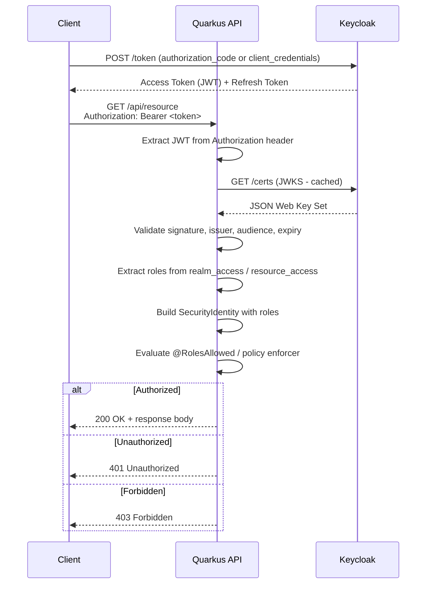
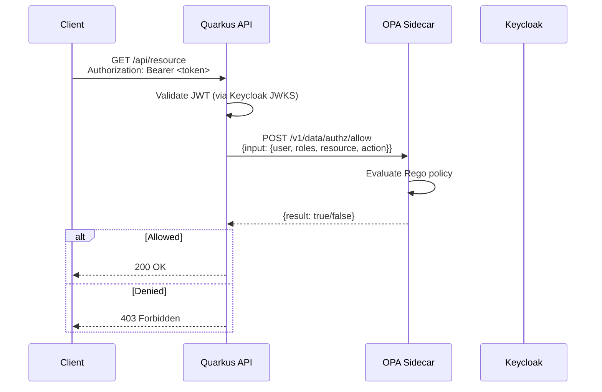
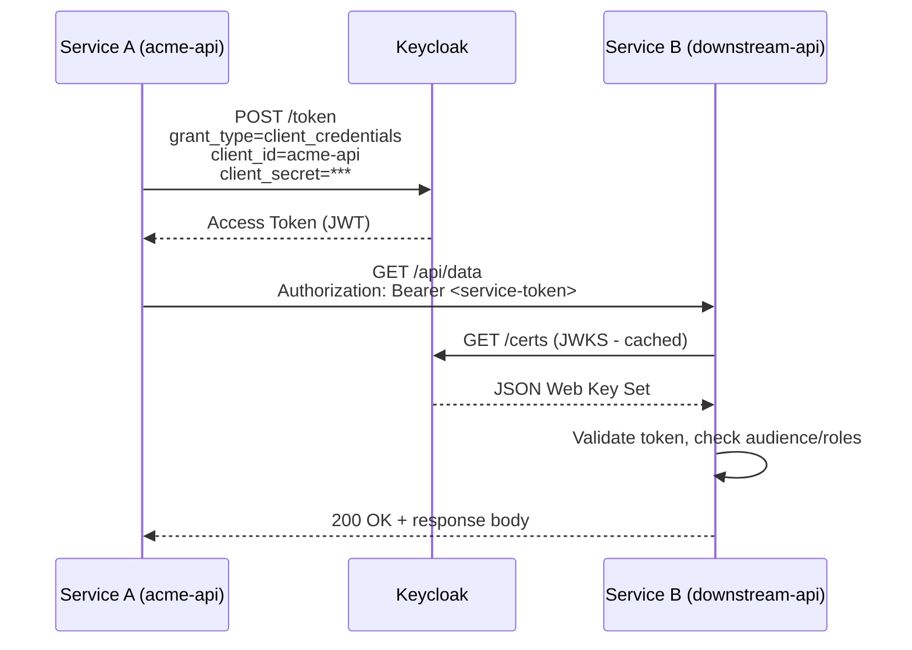
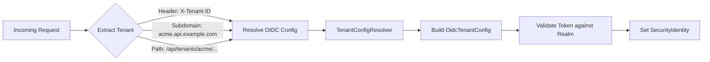
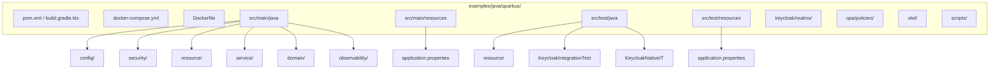

# 14-10. Java 17 / Quarkus 3.17 Integration Guide

> **Project:** Enterprise IAM Platform based on Keycloak
> **Parent document:** [Client Applications Hub](14-client-applications.md)
> **Related documents:** [Authentication and Authorization](08-authentication-authorization.md) | [Observability](10-observability.md) | [Security by Design](07-security-by-design.md)

---

## Overview

Quarkus is a cloud-native, Kubernetes-native Java framework designed for GraalVM native compilation and low-memory, fast-startup workloads. Since Keycloak 17+, **Keycloak itself runs on Quarkus**, making Quarkus the most natural fit for services that integrate with Keycloak. The two projects share the same underlying runtime, the same extension ecosystem, and many of the same core libraries (Vert.x, SmallRye, RESTEasy).

Key advantages of using Quarkus with Keycloak:

- **Dev Services** -- Quarkus automatically starts a Keycloak container during development and testing (`quarkus-oidc` Dev Services), eliminating manual container management.
- **Native compilation** -- GraalVM native builds produce binaries with sub-second startup and tens of megabytes of RSS, ideal for serverless and edge deployments.
- **First-class OIDC support** -- The `quarkus-oidc` extension provides built-in JWT validation, token propagation, multi-tenancy, and Keycloak authorization policy enforcement.
- **Shared codebase lineage** -- Bug fixes and security patches in the Keycloak Quarkus distribution often benefit downstream Quarkus OIDC extensions and vice versa.

This guide follows the same structure and depth as the [Spring Boot Integration Guide (14-01)](14-01-spring-boot.md) and targets the example project located at [`examples/java/quarkus/`](../examples/java/quarkus/).

---

## Table of Contents

1. [Prerequisites](#1-prerequisites)
2. [Project Setup](#2-project-setup)
3. [Application Configuration](#3-application-configuration)
4. [Security Configuration](#4-security-configuration)
5. [JWT Role Extraction (realm_access and resource_access)](#5-jwt-role-extraction-realm_access-and-resource_access)
6. [Custom Role Mapper and Security Configuration](#6-custom-role-mapper-and-security-configuration)
7. [Role-Based Method Security](#7-role-based-method-security)
8. [Example REST Resource](#8-example-rest-resource)
9. [OPA Integration for Fine-Grained Authorization](#9-opa-integration-for-fine-grained-authorization)
10. [Service-to-Service Communication](#10-service-to-service-communication)
11. [Multi-Tenant Support](#11-multi-tenant-support)
12. [OpenTelemetry Instrumentation](#12-opentelemetry-instrumentation)
13. [Testing](#13-testing)
14. [Docker and Native Builds](#14-docker-and-native-builds)
15. [Docker Compose for Local Development](#15-docker-compose-for-local-development)
16. [Recommended Project Structure](#16-recommended-project-structure)
17. [Environment Variables](#17-environment-variables)
18. [Troubleshooting](#18-troubleshooting)

---

## 1. Prerequisites

| Requirement | Minimum Version | Recommended Version |
|---|---|---|
| Java Development Kit | 17 | 21 (LTS) |
| Quarkus | 3.15.0 | 3.17.x |
| Keycloak Server | 25.x | 26.x |
| Maven | 3.9.0 | 3.9.9+ |
| Gradle | 8.5 | 8.12+ |
| GraalVM (native builds) | 23.1 | 24.x |
| Docker / Docker Compose | 24.x | 27.x |

Before beginning integration, ensure you have:

- A running Keycloak instance (local or remote) with at least one realm configured. In development mode, Quarkus Dev Services can start one automatically.
- A confidential client registered in Keycloak (e.g., `acme-api`) with the appropriate roles and mappers.
- The realm's issuer URI (e.g., `https://iam.example.com/realms/tenant-acme`).

---

## 2. Project Setup

### 2.1 Maven (pom.xml) -- Primary

```xml
<?xml version="1.0" encoding="UTF-8"?>
<project xmlns="http://maven.apache.org/POM/4.0.0"
         xmlns:xsi="http://www.w3.org/2001/XMLSchema-instance"
         xsi:schemaLocation="http://maven.apache.org/POM/4.0.0
         https://maven.apache.org/xsd/maven-4.0.0.xsd">
    <modelVersion>4.0.0</modelVersion>

    <groupId>com.example</groupId>
    <artifactId>keycloak-quarkus-integration</artifactId>
    <version>1.0.0</version>

    <properties>
        <compiler-plugin.version>3.13.0</compiler-plugin.version>
        <maven.compiler.release>17</maven.compiler.release>
        <project.build.sourceEncoding>UTF-8</project.build.sourceEncoding>
        <quarkus.platform.artifact-id>quarkus-bom</quarkus.platform.artifact-id>
        <quarkus.platform.group-id>io.quarkus.platform</quarkus.platform.group-id>
        <quarkus.platform.version>3.17.0</quarkus.platform.version>
        <surefire-plugin.version>3.5.2</surefire-plugin.version>
    </properties>

    <dependencyManagement>
        <dependencies>
            <dependency>
                <groupId>${quarkus.platform.group-id}</groupId>
                <artifactId>${quarkus.platform.artifact-id}</artifactId>
                <version>${quarkus.platform.version}</version>
                <type>pom</type>
                <scope>import</scope>
            </dependency>
        </dependencies>
    </dependencyManagement>

    <dependencies>
        <!-- Quarkus Core -->
        <dependency>
            <groupId>io.quarkus</groupId>
            <artifactId>quarkus-rest</artifactId>
        </dependency>
        <dependency>
            <groupId>io.quarkus</groupId>
            <artifactId>quarkus-rest-jackson</artifactId>
        </dependency>

        <!-- OIDC and Security -->
        <dependency>
            <groupId>io.quarkus</groupId>
            <artifactId>quarkus-oidc</artifactId>
        </dependency>
        <dependency>
            <groupId>io.quarkus</groupId>
            <artifactId>quarkus-keycloak-authorization</artifactId>
        </dependency>
        <dependency>
            <groupId>io.quarkus</groupId>
            <artifactId>quarkus-smallrye-jwt</artifactId>
        </dependency>

        <!-- OIDC Client for service-to-service calls -->
        <dependency>
            <groupId>io.quarkus</groupId>
            <artifactId>quarkus-oidc-client</artifactId>
        </dependency>

        <!-- OpenTelemetry (optional, see Section 12) -->
        <dependency>
            <groupId>io.quarkus</groupId>
            <artifactId>quarkus-opentelemetry</artifactId>
        </dependency>

        <!-- Health and Metrics -->
        <dependency>
            <groupId>io.quarkus</groupId>
            <artifactId>quarkus-smallrye-health</artifactId>
        </dependency>
        <dependency>
            <groupId>io.quarkus</groupId>
            <artifactId>quarkus-micrometer-registry-prometheus</artifactId>
        </dependency>

        <!-- Docker image build -->
        <dependency>
            <groupId>io.quarkus</groupId>
            <artifactId>quarkus-container-image-docker</artifactId>
        </dependency>

        <!-- Testing -->
        <dependency>
            <groupId>io.quarkus</groupId>
            <artifactId>quarkus-junit5</artifactId>
            <scope>test</scope>
        </dependency>
        <dependency>
            <groupId>io.quarkus</groupId>
            <artifactId>quarkus-test-security</artifactId>
            <scope>test</scope>
        </dependency>
        <dependency>
            <groupId>io.quarkus</groupId>
            <artifactId>quarkus-test-keycloak-server</artifactId>
            <scope>test</scope>
        </dependency>
        <dependency>
            <groupId>io.rest-assured</groupId>
            <artifactId>rest-assured</artifactId>
            <scope>test</scope>
        </dependency>
    </dependencies>

    <build>
        <plugins>
            <plugin>
                <groupId>${quarkus.platform.group-id}</groupId>
                <artifactId>quarkus-maven-plugin</artifactId>
                <version>${quarkus.platform.version}</version>
                <extensions>true</extensions>
                <executions>
                    <execution>
                        <goals>
                            <goal>build</goal>
                            <goal>generate-code</goal>
                            <goal>generate-code-tests</goal>
                            <goal>native-image-agent</goal>
                        </goals>
                    </execution>
                </executions>
            </plugin>
            <plugin>
                <artifactId>maven-compiler-plugin</artifactId>
                <version>${compiler-plugin.version}</version>
                <configuration>
                    <release>${maven.compiler.release}</release>
                </configuration>
            </plugin>
            <plugin>
                <artifactId>maven-surefire-plugin</artifactId>
                <version>${surefire-plugin.version}</version>
                <configuration>
                    <systemPropertyVariables>
                        <java.util.logging.manager>
                            org.jboss.logmanager.LogManager
                        </java.util.logging.manager>
                    </systemPropertyVariables>
                </configuration>
            </plugin>
            <plugin>
                <artifactId>maven-failsafe-plugin</artifactId>
                <version>${surefire-plugin.version}</version>
                <executions>
                    <execution>
                        <goals>
                            <goal>integration-test</goal>
                            <goal>verify</goal>
                        </goals>
                    </execution>
                </executions>
                <configuration>
                    <systemPropertyVariables>
                        <java.util.logging.manager>
                            org.jboss.logmanager.LogManager
                        </java.util.logging.manager>
                    </systemPropertyVariables>
                </configuration>
            </plugin>
        </plugins>
    </build>

    <profiles>
        <profile>
            <id>native</id>
            <activation>
                <property>
                    <name>native</name>
                </property>
            </activation>
            <properties>
                <skipITs>false</skipITs>
                <quarkus.native.enabled>true</quarkus.native.enabled>
            </properties>
        </profile>
    </profiles>
</project>
```

### 2.2 Gradle Kotlin DSL (build.gradle.kts) -- Secondary

```kotlin
plugins {
    java
    id("io.quarkus") version "3.17.0"
}

group = "com.example"
version = "1.0.0"

java {
    toolchain {
        languageVersion = JavaLanguageVersion.of(17)
    }
}

repositories {
    mavenCentral()
    mavenLocal()
}

val quarkusPlatformGroupId: String by project
val quarkusPlatformArtifactId: String by project
val quarkusPlatformVersion: String by project

dependencies {
    implementation(enforcedPlatform("${quarkusPlatformGroupId}:${quarkusPlatformArtifactId}:${quarkusPlatformVersion}"))

    // Quarkus Core
    implementation("io.quarkus:quarkus-rest")
    implementation("io.quarkus:quarkus-rest-jackson")

    // OIDC and Security
    implementation("io.quarkus:quarkus-oidc")
    implementation("io.quarkus:quarkus-keycloak-authorization")
    implementation("io.quarkus:quarkus-smallrye-jwt")

    // OIDC Client for service-to-service calls
    implementation("io.quarkus:quarkus-oidc-client")

    // OpenTelemetry (optional)
    implementation("io.quarkus:quarkus-opentelemetry")

    // Health and Metrics
    implementation("io.quarkus:quarkus-smallrye-health")
    implementation("io.quarkus:quarkus-micrometer-registry-prometheus")

    // Docker image build
    implementation("io.quarkus:quarkus-container-image-docker")

    // Testing
    testImplementation("io.quarkus:quarkus-junit5")
    testImplementation("io.quarkus:quarkus-test-security")
    testImplementation("io.quarkus:quarkus-test-keycloak-server")
    testImplementation("io.rest-assured:rest-assured")
}

tasks.withType<Test> {
    systemProperty("java.util.logging.manager", "org.jboss.logmanager.LogManager")
}

tasks.withType<JavaCompile> {
    options.encoding = "UTF-8"
    options.compilerArgs.add("-parameters")
}
```

---

## 3. Application Configuration

Quarkus uses `application.properties` as its primary configuration format. All OIDC-related properties are managed through the `quarkus.oidc.*` namespace.

### 3.1 application.properties

```properties
# =============================================================================
# Server
# =============================================================================
quarkus.http.port=8081
quarkus.application.name=acme-api

# =============================================================================
# OIDC Configuration (Keycloak)
# =============================================================================
# The auth-server-url points to the Keycloak realm. Quarkus appends
# /.well-known/openid-configuration automatically to discover endpoints.
quarkus.oidc.auth-server-url=${KEYCLOAK_AUTH_SERVER_URL:https://iam.example.com/realms/tenant-acme}
quarkus.oidc.client-id=${KEYCLOAK_CLIENT_ID:acme-api}
quarkus.oidc.credentials.secret=${KEYCLOAK_CLIENT_SECRET:change-me-in-production}

# Application type: service = bearer-only resource server
quarkus.oidc.application-type=service

# Token verification
quarkus.oidc.token.issuer=${KEYCLOAK_ISSUER:https://iam.example.com/realms/tenant-acme}
quarkus.oidc.token.audience=${KEYCLOAK_AUDIENCE:acme-api}

# Role source: extract roles from realm_access claim
quarkus.oidc.roles.role-claim-path=realm_access/roles
quarkus.oidc.roles.source=accesstoken

# =============================================================================
# Keycloak Authorization (policy enforcement)
# =============================================================================
quarkus.keycloak.policy-enforcer.enable=true
quarkus.keycloak.policy-enforcer.lazy-load-paths=true

# Public endpoints excluded from policy enforcement
quarkus.keycloak.policy-enforcer.paths.health.path=/q/health/*
quarkus.keycloak.policy-enforcer.paths.health.enforcement-mode=DISABLED
quarkus.keycloak.policy-enforcer.paths.public.path=/api/public/*
quarkus.keycloak.policy-enforcer.paths.public.enforcement-mode=DISABLED

# =============================================================================
# Dev Services (automatic Keycloak container in dev/test mode)
# =============================================================================
# Quarkus automatically starts a Keycloak container when no auth-server-url
# is reachable. This eliminates manual container management during development.
quarkus.keycloak.devservices.enabled=true
quarkus.keycloak.devservices.realm-path=keycloak/realms/tenant-acme.json
quarkus.keycloak.devservices.image-name=quay.io/keycloak/keycloak:26.1.0
quarkus.keycloak.devservices.port=0

# =============================================================================
# Logging
# =============================================================================
quarkus.log.category."io.quarkus.oidc".level=DEBUG
quarkus.log.category."org.keycloak".level=INFO
quarkus.log.console.format=%d{yyyy-MM-dd HH:mm:ss} %-5p [%c{2.}] (%t) %s%e%n
```

### 3.2 Configuration Properties Class

```java
package com.example.config;

import io.smallrye.config.ConfigMapping;
import io.smallrye.config.WithDefault;
import java.util.List;
import java.util.Optional;

/**
 * Application-specific configuration properties for the Keycloak integration.
 * Mapped from the {@code app.keycloak} prefix in application.properties.
 */
@ConfigMapping(prefix = "app.keycloak")
public interface KeycloakConfig {

    /** The OIDC client ID registered in Keycloak. */
    @WithDefault("acme-api")
    String clientId();

    /** Comma-separated list of allowed issuers for multi-tenant setups. */
    List<String> allowedIssuers();

    /** Optional base URL for the Keycloak server. */
    Optional<String> baseUrl();
}
```

The corresponding properties:

```properties
# =============================================================================
# Application-Specific Keycloak Settings
# =============================================================================
app.keycloak.client-id=${KEYCLOAK_CLIENT_ID:acme-api}
app.keycloak.allowed-issuers=${KEYCLOAK_ALLOWED_ISSUERS:https://iam.example.com/realms/tenant-acme}
app.keycloak.base-url=${KEYCLOAK_BASE_URL:https://iam.example.com}
```

### 3.3 Authentication Flow

The following diagram illustrates the complete authentication flow between a client application, the Quarkus resource server, and Keycloak.



---

## 4. Security Configuration

Unlike Spring Boot, Quarkus does not require a `SecurityFilterChain` bean. Security is primarily configured through `application.properties` and annotations. The `quarkus-oidc` extension handles JWT validation, JWKS caching, and `SecurityIdentity` creation automatically.

### 4.1 HTTP Security Policy (application.properties)

```properties
# =============================================================================
# HTTP Security Policy
# =============================================================================
# Public endpoints
quarkus.http.auth.permission.public.paths=/api/public/*,/q/health/*,/q/metrics
quarkus.http.auth.permission.public.policy=permit

# Admin endpoints require the "admin" role
quarkus.http.auth.permission.admin.paths=/api/admin/*
quarkus.http.auth.permission.admin.policy=admin-policy
quarkus.http.auth.policy.admin-policy.roles-allowed=admin

# All other API endpoints require authentication
quarkus.http.auth.permission.authenticated.paths=/api/*
quarkus.http.auth.permission.authenticated.policy=authenticated

# =============================================================================
# CORS Configuration
# =============================================================================
quarkus.http.cors=true
quarkus.http.cors.origins=${CORS_ALLOWED_ORIGINS:https://app.example.com,http://localhost:3000}
quarkus.http.cors.methods=GET,POST,PUT,DELETE,OPTIONS
quarkus.http.cors.headers=Authorization,Content-Type,X-Tenant-ID
quarkus.http.cors.access-control-max-age=1H
```

### 4.2 SecurityIdentity and Injection Points

Quarkus provides several CDI-injectable security objects:

| Injectable Type | Description | Usage |
|---|---|---|
| `SecurityIdentity` | The authenticated identity with roles and attributes | `@Inject SecurityIdentity identity` |
| `JsonWebToken` | The parsed JWT with all claims | `@Inject JsonWebToken jwt` |
| `@Claim` annotation | Individual claim extraction | `@Claim("tenant_id") String tenantId` |
| `SecurityContext` | JAX-RS security context | Method parameter |

```java
package com.example.security;

import io.quarkus.security.identity.SecurityIdentity;
import jakarta.enterprise.context.ApplicationScoped;
import jakarta.inject.Inject;
import org.eclipse.microprofile.jwt.JsonWebToken;

/**
 * Provides convenience methods for accessing the authenticated user's
 * identity and token claims throughout the application.
 */
@ApplicationScoped
public class IdentityService {

    @Inject
    SecurityIdentity securityIdentity;

    @Inject
    JsonWebToken jwt;

    /** Returns the authenticated user's subject (sub claim). */
    public String getUserId() {
        return jwt.getSubject();
    }

    /** Returns the tenant ID from the token's custom claim. */
    public String getTenantId() {
        return jwt.getClaim("tenant_id");
    }

    /** Returns the user's email address. */
    public String getEmail() {
        return jwt.getClaim("email");
    }

    /** Returns the preferred username. */
    public String getUsername() {
        return jwt.getClaim("preferred_username");
    }

    /** Checks whether the authenticated user has the given role. */
    public boolean hasRole(String role) {
        return securityIdentity.hasRole(role);
    }
}
```

---

## 5. JWT Role Extraction (realm_access and resource_access)

Keycloak embeds roles in nested JSON structures within the JWT. Quarkus can be configured to extract roles from specific claim paths, but for full control over both realm-level and client-level roles, a custom `SecurityIdentityAugmentor` is recommended.

### 5.1 Keycloak JWT Claims Structure

```json
{
  "sub": "f1b2c3d4-5678-9abc-def0-1234567890ab",
  "realm_access": {
    "roles": ["user", "editor"]
  },
  "resource_access": {
    "acme-api": {
      "roles": ["data-reader", "report-viewer"]
    },
    "account": {
      "roles": ["manage-account"]
    }
  },
  "tenant_id": "acme",
  "email": "jane.doe@acme.example.com",
  "preferred_username": "jane.doe"
}
```

### 5.2 Custom SecurityIdentityAugmentor

```java
package com.example.security;

import io.quarkus.security.identity.AuthenticationRequestContext;
import io.quarkus.security.identity.SecurityIdentity;
import io.quarkus.security.identity.SecurityIdentityAugmentor;
import io.quarkus.security.runtime.QuarkusSecurityIdentity;
import io.smallrye.mutiny.Uni;
import jakarta.enterprise.context.ApplicationScoped;
import jakarta.inject.Inject;
import org.eclipse.microprofile.jwt.JsonWebToken;

import java.util.Collections;
import java.util.List;
import java.util.Map;
import java.util.Set;
import java.util.stream.Collectors;
import java.util.stream.Stream;

/**
 * Augments the SecurityIdentity with roles extracted from both
 * {@code realm_access.roles} and {@code resource_access.<client-id>.roles}
 * in the Keycloak JWT token.
 * <p>
 * This augmentor runs after the initial OIDC authentication and adds
 * additional roles that may not be captured by the default role-claim-path
 * configuration.
 */
@ApplicationScoped
public class KeycloakRoleAugmentor implements SecurityIdentityAugmentor {

    private static final String REALM_ACCESS_CLAIM = "realm_access";
    private static final String RESOURCE_ACCESS_CLAIM = "resource_access";
    private static final String ROLES_KEY = "roles";

    @Inject
    KeycloakConfig keycloakConfig;

    @Override
    public Uni<SecurityIdentity> augment(SecurityIdentity identity,
                                          AuthenticationRequestContext context) {
        if (identity.isAnonymous()) {
            return Uni.createFrom().item(identity);
        }

        return Uni.createFrom().item(() -> {
            QuarkusSecurityIdentity.Builder builder =
                QuarkusSecurityIdentity.builder(identity);

            if (identity.getPrincipal() instanceof JsonWebToken jwt) {
                Set<String> allRoles = Stream.concat(
                    extractRealmRoles(jwt).stream(),
                    extractClientRoles(jwt).stream()
                ).collect(Collectors.toSet());

                allRoles.forEach(builder::addRole);
            }

            return builder.build();
        });
    }

    /**
     * Extracts roles from the {@code realm_access.roles} claim.
     */
    @SuppressWarnings("unchecked")
    private Set<String> extractRealmRoles(JsonWebToken jwt) {
        Map<String, Object> realmAccess = jwt.getClaim(REALM_ACCESS_CLAIM);
        if (realmAccess == null) {
            return Collections.emptySet();
        }

        List<String> roles = (List<String>) realmAccess.get(ROLES_KEY);
        if (roles == null) {
            return Collections.emptySet();
        }

        return roles.stream()
            .map(String::toLowerCase)
            .collect(Collectors.toSet());
    }

    /**
     * Extracts roles from the {@code resource_access.<client-id>.roles} claim.
     * The client ID is resolved from application configuration.
     */
    @SuppressWarnings("unchecked")
    private Set<String> extractClientRoles(JsonWebToken jwt) {
        Map<String, Object> resourceAccess = jwt.getClaim(RESOURCE_ACCESS_CLAIM);
        if (resourceAccess == null) {
            return Collections.emptySet();
        }

        String clientId = keycloakConfig.clientId();
        Map<String, Object> clientAccess =
            (Map<String, Object>) resourceAccess.get(clientId);
        if (clientAccess == null) {
            return Collections.emptySet();
        }

        List<String> clientRoles = (List<String>) clientAccess.get(ROLES_KEY);
        if (clientRoles == null) {
            return Collections.emptySet();
        }

        return clientRoles.stream()
            .map(String::toLowerCase)
            .collect(Collectors.toSet());
    }
}
```

### 5.3 Role Mapping Summary

| Keycloak Location | Example Role | Quarkus SecurityIdentity Role |
|---|---|---|
| `realm_access.roles` | `admin` | `admin` |
| `realm_access.roles` | `user` | `user` |
| `resource_access.acme-api.roles` | `data-reader` | `data-reader` |
| `resource_access.acme-api.roles` | `report-viewer` | `report-viewer` |

> **Note:** Unlike Spring Security, Quarkus does not use a `ROLE_` prefix by default. The `@RolesAllowed` annotation matches role names directly as they appear in the `SecurityIdentity`.

---

## 6. Custom Role Mapper and Security Configuration

### 6.1 Custom Token Validator

For validating custom claims such as `tenant_id`, implement a custom `OidcTokenValidator`:

```java
package com.example.security;

import io.quarkus.oidc.OidcTenantConfig;
import io.quarkus.oidc.TokenIntrospection;
import io.quarkus.oidc.common.OidcEndpoint;
import io.quarkus.oidc.common.OidcRequestContextProperties;
import io.quarkus.security.identity.SecurityIdentity;
import jakarta.enterprise.context.ApplicationScoped;
import org.eclipse.microprofile.jwt.JsonWebToken;
import org.jose4j.jwt.consumer.InvalidJwtException;

/**
 * Validates custom claims in the Keycloak JWT token.
 * This validator runs after standard OIDC token validation.
 */
@ApplicationScoped
public class CustomTokenValidator {

    /**
     * Validates that the token contains a non-empty tenant_id claim.
     *
     * @param jwt the parsed JWT token
     * @throws SecurityException if the tenant_id claim is missing or empty
     */
    public void validateTenantClaim(JsonWebToken jwt) {
        String tenantId = jwt.getClaim("tenant_id");
        if (tenantId == null || tenantId.isBlank()) {
            throw new SecurityException(
                "Token does not contain a valid tenant_id claim");
        }
    }

    /**
     * Validates that the token's audience contains the expected client ID.
     *
     * @param jwt      the parsed JWT token
     * @param clientId the expected client ID
     * @throws SecurityException if the audience does not match
     */
    public void validateAudience(JsonWebToken jwt, String clientId) {
        if (jwt.getAudience() == null || !jwt.getAudience().contains(clientId)) {
            throw new SecurityException(
                "Token audience does not contain expected client: " + clientId);
        }
    }
}
```

### 6.2 Custom Security Event Observer

```java
package com.example.security;

import io.quarkus.oidc.SecurityEvent;
import jakarta.enterprise.context.ApplicationScoped;
import jakarta.enterprise.event.Observes;
import org.jboss.logging.Logger;

/**
 * Observes OIDC security events for logging and metrics.
 */
@ApplicationScoped
public class SecurityEventObserver {

    private static final Logger LOG = Logger.getLogger(SecurityEventObserver.class);

    public void onSecurityEvent(@Observes SecurityEvent event) {
        switch (event.getEventType()) {
            case OIDC_LOGIN -> LOG.infof("OIDC login: %s", event.getSecurityIdentity().getPrincipal().getName());
            case OIDC_LOGOUT -> LOG.infof("OIDC logout: %s", event.getSecurityIdentity().getPrincipal().getName());
            case OIDC_SERVER_AVAILABLE -> LOG.info("Keycloak server is available");
            case OIDC_SERVER_NOT_AVAILABLE -> LOG.warn("Keycloak server is not available");
            default -> LOG.debugf("Security event: %s", event.getEventType());
        }
    }
}
```

---

## 7. Role-Based Method Security

Quarkus supports standard Jakarta Security annotations for method-level security.

### 7.1 Annotation Reference

| Annotation | Expression | Description |
|---|---|---|
| `@RolesAllowed("admin")` | Role check | Requires `admin` role in SecurityIdentity |
| `@RolesAllowed({"editor", "admin"})` | Multiple roles | Any of the listed roles |
| `@PermitAll` | Open access | No authentication required |
| `@DenyAll` | Block access | Always denied |
| `@Authenticated` | Authenticated | Any valid token |

### 7.2 Custom Security Expression Bean

```java
package com.example.security;

import io.quarkus.security.identity.SecurityIdentity;
import jakarta.enterprise.context.ApplicationScoped;
import jakarta.inject.Inject;
import org.eclipse.microprofile.jwt.JsonWebToken;

/**
 * Provides custom security expressions for tenant-scoped authorization.
 * Injected into resource classes for programmatic authorization checks.
 */
@ApplicationScoped
public class TenantSecurity {

    @Inject
    SecurityIdentity securityIdentity;

    @Inject
    JsonWebToken jwt;

    /**
     * Checks whether the authenticated user belongs to the specified tenant.
     */
    public boolean isTenantMember(String tenantId) {
        String tokenTenantId = jwt.getClaim("tenant_id");
        return tenantId != null && tenantId.equals(tokenTenantId);
    }

    /**
     * Checks whether the user is a tenant admin for the specified tenant.
     */
    public boolean isTenantAdmin(String tenantId) {
        if (!isTenantMember(tenantId)) {
            return false;
        }
        return securityIdentity.hasRole("admin");
    }

    /**
     * Checks whether the authenticated user is the resource owner.
     */
    public boolean isOwner(String resourceOwnerId) {
        return jwt.getSubject() != null && jwt.getSubject().equals(resourceOwnerId);
    }
}
```

---

## 8. Example REST Resource

The following resource demonstrates all common endpoint protection patterns: public, authenticated, role-based, owner-scoped, and tenant-scoped.

```java
package com.example.resource;

import com.example.security.TenantSecurity;
import io.quarkus.security.Authenticated;
import io.quarkus.security.identity.SecurityIdentity;
import jakarta.annotation.security.PermitAll;
import jakarta.annotation.security.RolesAllowed;
import jakarta.inject.Inject;
import jakarta.ws.rs.*;
import jakarta.ws.rs.core.MediaType;
import jakarta.ws.rs.core.Response;
import org.eclipse.microprofile.jwt.JsonWebToken;

import java.util.List;
import java.util.Map;

@Path("/api")
@Produces(MediaType.APPLICATION_JSON)
@Consumes(MediaType.APPLICATION_JSON)
public class ResourceEndpoint {

    @Inject
    SecurityIdentity securityIdentity;

    @Inject
    JsonWebToken jwt;

    @Inject
    TenantSecurity tenantSecurity;

    // -------------------------------------------------------------------
    // 1. Public endpoint - no authentication required
    // -------------------------------------------------------------------
    @GET
    @Path("/public/health")
    @PermitAll
    public Response health() {
        return Response.ok(Map.of("status", "UP")).build();
    }

    @GET
    @Path("/public/info")
    @PermitAll
    public Response info() {
        return Response.ok(Map.of(
            "service", "acme-api",
            "version", "1.0.0",
            "runtime", "Quarkus"
        )).build();
    }

    // -------------------------------------------------------------------
    // 2. Authenticated endpoint - any valid token
    // -------------------------------------------------------------------
    @GET
    @Path("/profile")
    @Authenticated
    public Response getProfile() {
        return Response.ok(Map.of(
            "sub", jwt.getSubject(),
            "email", jwt.getClaim("email"),
            "name", jwt.getClaim("preferred_username"),
            "tenantId", jwt.getClaim("tenant_id"),
            "roles", securityIdentity.getRoles()
        )).build();
    }

    // -------------------------------------------------------------------
    // 3. Role-based endpoint - admin role required
    // -------------------------------------------------------------------
    @GET
    @Path("/admin/users")
    @RolesAllowed("admin")
    public Response listUsers() {
        return Response.ok(List.of(
            Map.of("id", "u-001", "name", "Alice"),
            Map.of("id", "u-002", "name", "Bob")
        )).build();
    }

    @DELETE
    @Path("/admin/users/{userId}")
    @RolesAllowed("admin")
    public Response deleteUser(@PathParam("userId") String userId) {
        return Response.noContent().build();
    }

    // -------------------------------------------------------------------
    // 4. Multiple roles - editor or admin
    // -------------------------------------------------------------------
    @PUT
    @Path("/documents/{docId}")
    @RolesAllowed({"editor", "admin"})
    public Response updateDocument(
            @PathParam("docId") String docId,
            Map<String, Object> content) {
        return Response.ok(Map.of(
            "documentId", docId,
            "updated", true
        )).build();
    }

    // -------------------------------------------------------------------
    // 5. Owner-scoped endpoint - user can only access own data
    // -------------------------------------------------------------------
    @GET
    @Path("/users/{userId}/settings")
    @Authenticated
    public Response getUserSettings(@PathParam("userId") String userId) {
        if (!tenantSecurity.isOwner(userId) &&
                !securityIdentity.hasRole("admin")) {
            return Response.status(Response.Status.FORBIDDEN).build();
        }
        return Response.ok(Map.of(
            "userId", userId,
            "theme", "dark",
            "language", "en"
        )).build();
    }

    // -------------------------------------------------------------------
    // 6. Tenant-scoped endpoint - custom security expression
    // -------------------------------------------------------------------
    @GET
    @Path("/tenants/{tenantId}/reports")
    @Authenticated
    public Response getTenantReports(@PathParam("tenantId") String tenantId) {
        if (!tenantSecurity.isTenantMember(tenantId)) {
            return Response.status(Response.Status.FORBIDDEN).build();
        }
        return Response.ok(List.of(
            Map.of("reportId", "r-001", "title", "Monthly Summary"),
            Map.of("reportId", "r-002", "title", "Quarterly Review")
        )).build();
    }

    @POST
    @Path("/tenants/{tenantId}/config")
    @Authenticated
    public Response updateTenantConfig(
            @PathParam("tenantId") String tenantId,
            Map<String, Object> config) {
        if (!tenantSecurity.isTenantAdmin(tenantId)) {
            return Response.status(Response.Status.FORBIDDEN).build();
        }
        return Response.ok(Map.of(
            "tenantId", tenantId,
            "updated", true
        )).build();
    }
}
```

---

## 9. OPA Integration for Fine-Grained Authorization

For complex authorization policies that go beyond role-based access control, Quarkus can delegate decisions to an [Open Policy Agent (OPA)](https://www.openpolicyagent.org/) sidecar.

### 9.1 Architecture



### 9.2 OPA Client

```java
package com.example.security;

import jakarta.enterprise.context.ApplicationScoped;
import jakarta.inject.Inject;
import org.eclipse.microprofile.jwt.JsonWebToken;
import org.eclipse.microprofile.rest.client.inject.RestClient;

import java.util.Map;
import java.util.Set;

/**
 * Delegates fine-grained authorization decisions to an OPA sidecar.
 * The OPA service evaluates Rego policies against the request context.
 */
@ApplicationScoped
public class OpaAuthorizationService {

    @Inject
    @RestClient
    OpaClient opaClient;

    @Inject
    JsonWebToken jwt;

    /**
     * Checks whether the current user is authorized to perform the
     * given action on the specified resource.
     *
     * @param resource the resource identifier (e.g., "/api/documents/123")
     * @param action   the HTTP method (e.g., "GET", "POST", "DELETE")
     * @param roles    the user's roles from SecurityIdentity
     * @return true if the OPA policy allows the action
     */
    public boolean isAuthorized(String resource, String action, Set<String> roles) {
        Map<String, Object> input = Map.of(
            "user", jwt.getSubject(),
            "tenant", jwt.getClaim("tenant_id") != null ? jwt.getClaim("tenant_id") : "",
            "roles", roles,
            "resource", resource,
            "action", action
        );

        OpaResponse response = opaClient.evaluate(Map.of("input", input));
        return response.result();
    }
}
```

### 9.3 OPA REST Client Interface

```java
package com.example.security;

import jakarta.ws.rs.Consumes;
import jakarta.ws.rs.POST;
import jakarta.ws.rs.Path;
import jakarta.ws.rs.Produces;
import jakarta.ws.rs.core.MediaType;
import org.eclipse.microprofile.rest.client.inject.RegisterRestClient;

import java.util.Map;

@Path("/v1/data/authz")
@RegisterRestClient(configKey = "opa")
public interface OpaClient {

    @POST
    @Path("/allow")
    @Consumes(MediaType.APPLICATION_JSON)
    @Produces(MediaType.APPLICATION_JSON)
    OpaResponse evaluate(Map<String, Object> request);
}
```

```java
package com.example.security;

/**
 * Response from the OPA policy evaluation endpoint.
 */
public record OpaResponse(boolean result) {}
```

### 9.4 OPA Configuration (application.properties)

```properties
# =============================================================================
# OPA REST Client
# =============================================================================
quarkus.rest-client.opa.url=${OPA_URL:http://localhost:8181}
quarkus.rest-client.opa.scope=jakarta.inject.Singleton
```

---

## 10. Service-to-Service Communication

When your Quarkus application needs to call downstream services, use the `quarkus-oidc-client` extension for automatic token acquisition and propagation.

### 10.1 OIDC Client Configuration (application.properties)

```properties
# =============================================================================
# OIDC Client for Service-to-Service Calls
# =============================================================================
# Named client "downstream" for acquiring service-account tokens
quarkus.oidc-client.downstream.auth-server-url=${KEYCLOAK_AUTH_SERVER_URL:https://iam.example.com/realms/tenant-acme}
quarkus.oidc-client.downstream.client-id=${KEYCLOAK_CLIENT_ID:acme-api}
quarkus.oidc-client.downstream.credentials.secret=${KEYCLOAK_CLIENT_SECRET:change-me-in-production}
quarkus.oidc-client.downstream.grant.type=client
quarkus.oidc-client.downstream.grant-options.client.scope=openid
```

### 10.2 REST Client with Token Propagation

```java
package com.example.service;

import io.quarkus.oidc.client.filter.OidcClientFilter;
import jakarta.ws.rs.*;
import jakarta.ws.rs.core.MediaType;
import org.eclipse.microprofile.rest.client.inject.RegisterRestClient;

/**
 * MicroProfile REST Client for calling a downstream service.
 * The {@link OidcClientFilter} automatically acquires a client-credentials
 * token from Keycloak and attaches it as a Bearer token.
 */
@Path("/api")
@RegisterRestClient(configKey = "downstream-api")
@OidcClientFilter("downstream")
public interface DownstreamApiClient {

    @GET
    @Path("/data")
    @Produces(MediaType.APPLICATION_JSON)
    String fetchData();

    @GET
    @Path("/user-data")
    @Produces(MediaType.APPLICATION_JSON)
    String fetchUserData();
}
```

### 10.3 Token Propagation for User Context

When you need to relay the current user's token (rather than using a service account), use the `@TokenPropagation` filter:

```java
package com.example.service;

import io.quarkus.oidc.token.propagation.AccessToken;
import jakarta.ws.rs.*;
import jakarta.ws.rs.core.MediaType;
import org.eclipse.microprofile.rest.client.inject.RegisterRestClient;

/**
 * REST Client that propagates the incoming user's access token
 * to the downstream service, preserving user identity context.
 */
@Path("/api")
@RegisterRestClient(configKey = "downstream-api")
@AccessToken
public interface DownstreamUserContextClient {

    @GET
    @Path("/user-data")
    @Produces(MediaType.APPLICATION_JSON)
    String fetchUserData();
}
```

### 10.4 REST Client Configuration

```properties
# =============================================================================
# Downstream REST Client
# =============================================================================
quarkus.rest-client.downstream-api.url=${DOWNSTREAM_API_URL:https://downstream-api.example.com}
quarkus.rest-client.downstream-api.scope=jakarta.inject.Singleton
```

### 10.5 Service-to-Service Flow



---

## 11. Multi-Tenant Support

Quarkus OIDC provides built-in multi-tenancy through the `TenantConfigResolver` and annotation-based tenant selection. In a multi-tenant architecture (realm-per-tenant), the application dynamically resolves the Keycloak realm based on the incoming request.

### 11.1 Tenant Resolution Strategy



### 11.2 Static Multi-Tenant Configuration

For a known set of tenants, configure them in `application.properties`:

```properties
# =============================================================================
# Multi-Tenant OIDC Configuration (static)
# =============================================================================
# Default tenant
quarkus.oidc.auth-server-url=https://iam.example.com/realms/tenant-acme
quarkus.oidc.client-id=acme-api
quarkus.oidc.credentials.secret=secret-acme
quarkus.oidc.application-type=service

# Tenant: globex
quarkus.oidc.globex.auth-server-url=https://iam.example.com/realms/tenant-globex
quarkus.oidc.globex.client-id=globex-api
quarkus.oidc.globex.credentials.secret=secret-globex
quarkus.oidc.globex.application-type=service

# Tenant: initech
quarkus.oidc.initech.auth-server-url=https://iam.example.com/realms/tenant-initech
quarkus.oidc.initech.client-id=initech-api
quarkus.oidc.initech.credentials.secret=secret-initech
quarkus.oidc.initech.application-type=service
```

### 11.3 Dynamic TenantConfigResolver

For dynamic tenant resolution (e.g., realm-per-tenant with an unknown set of tenants):

```java
package com.example.config;

import io.quarkus.oidc.OidcRequestContext;
import io.quarkus.oidc.OidcTenantConfig;
import io.quarkus.oidc.TenantConfigResolver;
import io.smallrye.mutiny.Uni;
import io.vertx.ext.web.RoutingContext;
import jakarta.enterprise.context.ApplicationScoped;
import jakarta.inject.Inject;

/**
 * Dynamically resolves OIDC tenant configuration based on the incoming
 * request. Supports three tenant resolution strategies: HTTP header,
 * subdomain, and path segment.
 */
@ApplicationScoped
public class MultiTenantResolver implements TenantConfigResolver {

    private static final String KEYCLOAK_BASE_URL = "https://iam.example.com";

    @Inject
    KeycloakConfig keycloakConfig;

    @Override
    public Uni<OidcTenantConfig> resolve(RoutingContext routingContext,
                                          OidcRequestContext<OidcTenantConfig> requestContext) {
        String tenantId = resolveTenantId(routingContext);
        if (tenantId == null) {
            // Return null to use the default OIDC tenant configuration
            return Uni.createFrom().nullItem();
        }

        String issuerUrl = KEYCLOAK_BASE_URL + "/realms/tenant-" + tenantId;

        // Validate the issuer against the allowed list
        if (!keycloakConfig.allowedIssuers().contains(issuerUrl)) {
            return Uni.createFrom().failure(
                new SecurityException("Unknown tenant: " + tenantId));
        }

        OidcTenantConfig config = new OidcTenantConfig();
        config.setTenantId("tenant-" + tenantId);
        config.setAuthServerUrl(issuerUrl);
        config.setClientId(keycloakConfig.clientId());
        config.getCredentials().setSecret(
            routingContext.get("tenant_secret_" + tenantId));
        config.setApplicationType(OidcTenantConfig.ApplicationType.SERVICE);

        return Uni.createFrom().item(config);
    }

    private String resolveTenantId(RoutingContext context) {
        // Strategy 1: HTTP header
        String tenantHeader = context.request().getHeader("X-Tenant-ID");
        if (tenantHeader != null && !tenantHeader.isBlank()) {
            return tenantHeader;
        }

        // Strategy 2: Subdomain
        String host = context.request().host();
        if (host != null && host.contains(".")) {
            String subdomain = host.split("\\.")[0];
            if (!"www".equals(subdomain) && !"api".equals(subdomain)) {
                return subdomain;
            }
        }

        // Strategy 3: Path segment (e.g., /api/tenants/{tenantId}/...)
        String path = context.request().path();
        if (path != null && path.startsWith("/api/tenants/")) {
            String[] segments = path.split("/");
            if (segments.length > 3) {
                return segments[3];
            }
        }

        // Fallback: use default tenant
        return null;
    }
}
```

### 11.4 Annotation-Based Tenant Selection

For endpoints that map directly to a known tenant:

```java
@GET
@Path("/globex/reports")
@Tenant("globex")
@RolesAllowed("user")
public Response getGlobexReports() {
    return Response.ok(List.of(
        Map.of("reportId", "r-001", "title", "Globex Q4 Report")
    )).build();
}
```

---

## 12. OpenTelemetry Instrumentation

Quarkus provides built-in OpenTelemetry support through the `quarkus-opentelemetry` extension, which automatically instruments HTTP requests, REST clients, and CDI beans.

### 12.1 OpenTelemetry Configuration (application.properties)

```properties
# =============================================================================
# OpenTelemetry
# =============================================================================
quarkus.otel.enabled=true
quarkus.otel.exporter.otlp.endpoint=${OTEL_EXPORTER_OTLP_ENDPOINT:http://localhost:4318}
quarkus.otel.exporter.otlp.protocol=http/protobuf

quarkus.otel.resource.attributes=service.name=acme-api,service.version=1.0.0,deployment.environment=${ENVIRONMENT:development}

# Instrument HTTP server and client requests
quarkus.otel.instrument.rest=true
quarkus.otel.instrument.rest-client=true

# Propagation format
quarkus.otel.propagators=tracecontext,baggage
```

### 12.2 Identity Context in Spans

```java
package com.example.observability;

import io.opentelemetry.api.trace.Span;
import io.quarkus.security.identity.SecurityIdentity;
import jakarta.enterprise.context.ApplicationScoped;
import jakarta.inject.Inject;
import org.eclipse.microprofile.jwt.JsonWebToken;

/**
 * Enriches the current OpenTelemetry span with user identity attributes
 * extracted from the JWT token.
 */
@ApplicationScoped
public class IdentitySpanEnricher {

    @Inject
    SecurityIdentity securityIdentity;

    @Inject
    JsonWebToken jwt;

    /**
     * Adds identity attributes to the current span.
     * Call this method from resource endpoints or interceptors.
     */
    public void enrichCurrentSpan() {
        if (securityIdentity.isAnonymous()) {
            return;
        }

        Span currentSpan = Span.current();

        currentSpan.setAttribute("enduser.id", jwt.getSubject());
        currentSpan.setAttribute("enduser.role",
            String.join(",", securityIdentity.getRoles()));

        String tenantId = jwt.getClaim("tenant_id");
        if (tenantId != null) {
            currentSpan.setAttribute("enduser.tenant", tenantId);
        }

        String clientId = jwt.getClaim("azp");
        if (clientId != null) {
            currentSpan.setAttribute("enduser.client_id", clientId);
        }

        String issuer = jwt.getIssuer();
        if (issuer != null) {
            String realm = extractRealmFromIssuer(issuer);
            if (realm != null) {
                currentSpan.setAttribute("enduser.realm", realm);
            }
        }
    }

    private String extractRealmFromIssuer(String issuer) {
        int idx = issuer.lastIndexOf("/realms/");
        return idx >= 0 ? issuer.substring(idx + 8) : null;
    }
}
```

### 12.3 Request Filter for Automatic Enrichment

```java
package com.example.observability;

import jakarta.inject.Inject;
import jakarta.ws.rs.container.ContainerRequestContext;
import jakarta.ws.rs.container.ContainerResponseContext;
import jakarta.ws.rs.container.ContainerResponseFilter;
import jakarta.ws.rs.ext.Provider;

/**
 * JAX-RS response filter that automatically enriches the current
 * OpenTelemetry span with identity attributes after authentication.
 */
@Provider
public class IdentitySpanFilter implements ContainerResponseFilter {

    @Inject
    IdentitySpanEnricher identitySpanEnricher;

    @Override
    public void filter(ContainerRequestContext requestContext,
                       ContainerResponseContext responseContext) {
        identitySpanEnricher.enrichCurrentSpan();
    }
}
```

### 12.4 Custom Metrics for Authentication Events

```java
package com.example.observability;

import io.micrometer.core.instrument.Counter;
import io.micrometer.core.instrument.MeterRegistry;
import io.micrometer.core.instrument.Timer;
import jakarta.enterprise.context.ApplicationScoped;
import jakarta.inject.Inject;

/**
 * Records custom metrics for authentication and authorization events.
 * These metrics feed into Prometheus / Grafana dashboards.
 */
@ApplicationScoped
public class AuthMetrics {

    private final Counter authSuccessCounter;
    private final Counter authFailureCounter;
    private final Counter authorizationDeniedCounter;
    private final Timer tokenValidationTimer;

    @Inject
    public AuthMetrics(MeterRegistry registry) {
        this.authSuccessCounter = Counter.builder("iam.auth.success")
            .description("Number of successful authentications")
            .tag("service", "acme-api")
            .register(registry);

        this.authFailureCounter = Counter.builder("iam.auth.failure")
            .description("Number of failed authentications")
            .tag("service", "acme-api")
            .register(registry);

        this.authorizationDeniedCounter = Counter.builder("iam.authz.denied")
            .description("Number of authorization denials")
            .tag("service", "acme-api")
            .register(registry);

        this.tokenValidationTimer = Timer.builder("iam.token.validation.duration")
            .description("Time spent validating JWT tokens")
            .tag("service", "acme-api")
            .register(registry);
    }

    public void recordAuthSuccess(String realm, String clientId) {
        authSuccessCounter.increment();
    }

    public void recordAuthFailure(String reason) {
        authFailureCounter.increment();
    }

    public void recordAuthorizationDenied(String resource, String role) {
        authorizationDeniedCounter.increment();
    }

    public Timer.Sample startTokenValidation() {
        return Timer.start();
    }

    public void stopTokenValidation(Timer.Sample sample) {
        sample.stop(tokenValidationTimer);
    }
}
```

### 12.5 Span Attribute Summary

| Attribute | Source | Example Value |
|---|---|---|
| `enduser.id` | `jwt.sub` | `f1b2c3d4-5678-9abc-def0-1234567890ab` |
| `enduser.role` | SecurityIdentity roles | `admin,user` |
| `enduser.tenant` | `jwt.tenant_id` | `acme` |
| `enduser.client_id` | `jwt.azp` | `acme-api` |
| `enduser.realm` | Extracted from `jwt.iss` | `tenant-acme` |

---

## 13. Testing

Quarkus provides first-class testing support through `@QuarkusTest`, `@TestSecurity`, and **Dev Services for Keycloak** (an embedded Keycloak container started automatically during tests).

### 13.1 Unit Tests with @TestSecurity

For simple tests that do not need a real JWT or Keycloak container:

```java
package com.example.resource;

import io.quarkus.test.junit.QuarkusTest;
import io.quarkus.test.security.TestSecurity;
import org.junit.jupiter.api.Test;

import static io.restassured.RestAssured.given;
import static org.hamcrest.CoreMatchers.is;

@QuarkusTest
class ResourceEndpointTest {

    @Test
    void publicEndpoint_shouldReturnOk_withoutAuthentication() {
        given()
            .when().get("/api/public/health")
            .then()
            .statusCode(200)
            .body("status", is("UP"));
    }

    @Test
    void protectedEndpoint_shouldReturn401_withoutToken() {
        given()
            .when().get("/api/profile")
            .then()
            .statusCode(401);
    }

    @Test
    @TestSecurity(user = "admin-001", roles = "admin")
    void adminEndpoint_shouldReturnOk_withAdminRole() {
        given()
            .when().get("/api/admin/users")
            .then()
            .statusCode(200);
    }

    @Test
    @TestSecurity(user = "user-001", roles = "user")
    void adminEndpoint_shouldReturn403_withUserRole() {
        given()
            .when().get("/api/admin/users")
            .then()
            .statusCode(403);
    }
}
```

### 13.2 Tests with Custom JWT Claims

For tests that require specific JWT claims (e.g., `tenant_id`, custom roles), use `@TestSecurity` with `@OidcSecurity`:

```java
package com.example.resource;

import io.quarkus.test.junit.QuarkusTest;
import io.quarkus.test.security.TestSecurity;
import io.quarkus.test.security.oidc.Claim;
import io.quarkus.test.security.oidc.OidcSecurity;
import io.quarkus.test.security.oidc.UserInfo;
import org.junit.jupiter.api.Test;

import static io.restassured.RestAssured.given;
import static org.hamcrest.CoreMatchers.is;

@QuarkusTest
class JwtSecurityTest {

    @Test
    @TestSecurity(user = "user-001", roles = "user")
    @OidcSecurity(claims = {
        @Claim(key = "email", value = "jane@acme.example.com"),
        @Claim(key = "preferred_username", value = "jane.doe"),
        @Claim(key = "tenant_id", value = "acme")
    })
    void profile_shouldReturnClaims_withValidJwt() {
        given()
            .when().get("/api/profile")
            .then()
            .statusCode(200)
            .body("sub", is("user-001"))
            .body("email", is("jane@acme.example.com"));
    }

    @Test
    @TestSecurity(user = "user-001", roles = "user")
    @OidcSecurity(claims = {
        @Claim(key = "tenant_id", value = "acme")
    })
    void tenantEndpoint_shouldSucceed_forMatchingTenant() {
        given()
            .when().get("/api/tenants/acme/reports")
            .then()
            .statusCode(200);
    }

    @Test
    @TestSecurity(user = "user-001", roles = "user")
    @OidcSecurity(claims = {
        @Claim(key = "tenant_id", value = "other-corp")
    })
    void tenantEndpoint_shouldFail_forMismatchedTenant() {
        given()
            .when().get("/api/tenants/acme/reports")
            .then()
            .statusCode(403);
    }
}
```

### 13.3 Integration Tests with Dev Services for Keycloak

Quarkus Dev Services automatically starts a Keycloak container when the `quarkus-oidc` extension is present and no reachable `auth-server-url` is configured for the test profile. This eliminates the need for manual Testcontainers configuration.

```java
package com.example;

import io.quarkus.test.junit.QuarkusTest;
import io.quarkus.test.keycloak.client.KeycloakTestClient;
import org.junit.jupiter.api.Test;

import static io.restassured.RestAssured.given;
import static org.hamcrest.CoreMatchers.notNullValue;

/**
 * Integration test that uses Dev Services for Keycloak.
 * A real Keycloak container is started automatically with the realm
 * defined in quarkus.keycloak.devservices.realm-path.
 */
@QuarkusTest
class KeycloakIntegrationTest {

    KeycloakTestClient keycloakClient = new KeycloakTestClient();

    @Test
    void protectedEndpoint_withRealToken_shouldSucceed() {
        String accessToken = keycloakClient.getAccessToken("alice");

        given()
            .auth().oauth2(accessToken)
            .when().get("/api/profile")
            .then()
            .statusCode(200)
            .body("sub", notNullValue());
    }

    @Test
    void protectedEndpoint_withExpiredToken_shouldReturn401() {
        given()
            .auth().oauth2("expired.jwt.token")
            .when().get("/api/profile")
            .then()
            .statusCode(401);
    }

    @Test
    void adminEndpoint_withAdminToken_shouldSucceed() {
        String accessToken = keycloakClient.getAccessToken("admin");

        given()
            .auth().oauth2(accessToken)
            .when().get("/api/admin/users")
            .then()
            .statusCode(200);
    }
}
```

### 13.4 Native Integration Tests

Quarkus supports running integration tests against the native binary:

```java
package com.example;

import io.quarkus.test.junit.QuarkusIntegrationTest;

/**
 * Runs the same integration tests as {@link KeycloakIntegrationTest}
 * but against the native executable instead of the JVM build.
 */
@QuarkusIntegrationTest
class KeycloakNativeIT extends KeycloakIntegrationTest {
    // All tests from KeycloakIntegrationTest run against the native binary
}
```

---

## 14. Docker and Native Builds

Quarkus supports both JVM-based Docker images and GraalVM native images. Native images provide sub-second startup times and significantly lower memory consumption.

### 14.1 Dockerfile (JVM Mode)

```dockerfile
# Stage 1: Build
FROM maven:3.9-eclipse-temurin-17 AS build
WORKDIR /app
COPY pom.xml .
COPY src ./src
RUN mvn package -DskipTests -Dquarkus.package.jar.type=uber-jar

# Stage 2: Runtime
FROM eclipse-temurin:17-jre-alpine
WORKDIR /app

# Create non-root user
RUN addgroup -S quarkus && adduser -S quarkus -G quarkus
USER quarkus

COPY --from=build /app/target/*-runner.jar /app/application.jar

EXPOSE 8081

ENV JAVA_OPTS="-Xmx256m -Xms128m -Djava.util.logging.manager=org.jboss.logmanager.LogManager"

ENTRYPOINT ["sh", "-c", "java $JAVA_OPTS -jar /app/application.jar"]
```

### 14.2 Dockerfile (Native Mode)

```dockerfile
# Stage 1: Build native executable
FROM quay.io/quarkus/ubi-quarkus-mandrel-builder-image:jdk-21 AS build
WORKDIR /app
COPY --chown=quarkus:quarkus pom.xml .
COPY --chown=quarkus:quarkus src ./src
USER quarkus
RUN mvn package -Dnative -DskipTests \
    -Dquarkus.native.additional-build-args="--initialize-at-run-time=org.apache.http.impl.auth.NTLMEngineImpl"

# Stage 2: Runtime (minimal image)
FROM quay.io/quarkus/quarkus-micro-image:2.0
WORKDIR /app

COPY --from=build /app/target/*-runner /app/application

EXPOSE 8081

# Non-root user (already set in quarkus-micro-image)
USER 1001

ENTRYPOINT ["/app/application", "-Dquarkus.http.host=0.0.0.0"]
```

### 14.3 Build Commands

| Build Type | Command | Startup Time | Memory (RSS) |
|---|---|---|---|
| JVM (uber-jar) | `mvn package -DskipTests` | ~1.5s | ~150 MB |
| JVM (fast-jar, default) | `mvn package -DskipTests` | ~1.2s | ~130 MB |
| Native (local GraalVM) | `mvn package -Dnative -DskipTests` | ~0.03s | ~30 MB |
| Native (container build) | `mvn package -Dnative -Dquarkus.native.container-build=true -DskipTests` | ~0.03s | ~30 MB |
| Docker image (JVM) | `mvn package -Dquarkus.container-image.build=true -DskipTests` | ~1.2s | ~150 MB |
| Docker image (native) | `mvn package -Dnative -Dquarkus.container-image.build=true -DskipTests` | ~0.03s | ~30 MB |

> **Note:** Native compilation with GraalVM produces binaries with startup times of approximately 30 milliseconds and RSS memory usage around 30 MB. This makes Quarkus native builds ideal for serverless, edge, and Kubernetes deployments where fast scale-to-zero and scale-from-zero behavior is critical.

---

## 15. Docker Compose for Local Development

```yaml
# docker-compose.yml
services:
  keycloak:
    image: quay.io/keycloak/keycloak:26.1.0
    command: start-dev --import-realm
    environment:
      KC_BOOTSTRAP_ADMIN_USERNAME: admin
      KC_BOOTSTRAP_ADMIN_PASSWORD: admin
      KC_HTTP_PORT: 8080
      KC_HEALTH_ENABLED: "true"
      KC_METRICS_ENABLED: "true"
    ports:
      - "8080:8080"
    volumes:
      - ./keycloak/realms:/opt/keycloak/data/import
    healthcheck:
      test: ["CMD-SHELL", "exec 3<>/dev/tcp/localhost/8080 && echo -e 'GET /health/ready HTTP/1.1\r\nHost: localhost\r\n\r\n' >&3 && cat <&3 | grep -q '200'"]
      interval: 10s
      timeout: 5s
      retries: 15
      start_period: 30s

  postgres-keycloak:
    image: postgres:16-alpine
    environment:
      POSTGRES_DB: keycloak
      POSTGRES_USER: keycloak
      POSTGRES_PASSWORD: keycloak
    ports:
      - "5432:5432"
    volumes:
      - keycloak-db-data:/var/lib/postgresql/data

  app:
    build:
      context: .
      dockerfile: Dockerfile
    environment:
      QUARKUS_HTTP_PORT: 8081
      KEYCLOAK_AUTH_SERVER_URL: http://keycloak:8080/realms/tenant-acme
      KEYCLOAK_ISSUER: http://keycloak:8080/realms/tenant-acme
      KEYCLOAK_CLIENT_ID: acme-api
      KEYCLOAK_CLIENT_SECRET: change-me-in-production
      KEYCLOAK_AUDIENCE: acme-api
      OTEL_EXPORTER_OTLP_ENDPOINT: http://otel-collector:4318
    ports:
      - "8081:8081"
    depends_on:
      keycloak:
        condition: service_healthy

  # Optional: OPA sidecar for fine-grained authorization
  opa:
    image: openpolicyagent/opa:0.70.0
    command: run --server --addr :8181 /policies
    ports:
      - "8181:8181"
    volumes:
      - ./opa/policies:/policies

  # Optional: OpenTelemetry Collector for local observability
  otel-collector:
    image: otel/opentelemetry-collector-contrib:0.114.0
    ports:
      - "4317:4317"   # gRPC
      - "4318:4318"   # HTTP
      - "8888:8888"   # Metrics
    volumes:
      - ./otel/collector-config.yaml:/etc/otelcol-contrib/config.yaml

volumes:
  keycloak-db-data:
```

---

## 16. Recommended Project Structure

The example project follows **Clean Architecture** principles, separating the codebase into resource (adapter), service (use case), domain (entity), and repository (adapter) layers. All public classes and methods use **JavaDoc** comments to document intent, parameters, and return values.

**Testing** is organized in three tiers: **unit tests** (`@TestSecurity` with mocked identity), **integration tests** (Dev Services for Keycloak with a real container), and **native integration tests** (`@QuarkusIntegrationTest` against the native binary). The application supports both **JVM** and **GraalVM native** Docker builds.

### 16.1 Project Structure Diagram



### 16.2 Directory Tree

```
examples/java/quarkus/
├── pom.xml                                  # Maven build (primary)
├── build.gradle.kts                         # Gradle build (secondary)
├── docker-compose.yml
├── Dockerfile
├── Dockerfile.native
├── src/
│   ├── main/
│   │   ├── java/com/example/
│   │   │   ├── Application.java
│   │   │   ├── config/
│   │   │   │   ├── KeycloakConfig.java              # ConfigMapping properties
│   │   │   │   └── MultiTenantResolver.java         # TenantConfigResolver
│   │   │   ├── security/
│   │   │   │   ├── KeycloakRoleAugmentor.java       # SecurityIdentityAugmentor
│   │   │   │   ├── TenantSecurity.java              # Tenant security expressions
│   │   │   │   ├── IdentityService.java             # Identity convenience methods
│   │   │   │   ├── CustomTokenValidator.java        # Custom claim validation
│   │   │   │   ├── SecurityEventObserver.java       # OIDC event observer
│   │   │   │   ├── OpaAuthorizationService.java     # OPA client
│   │   │   │   ├── OpaClient.java                   # OPA REST client interface
│   │   │   │   └── OpaResponse.java                 # OPA response record
│   │   │   ├── resource/
│   │   │   │   └── ResourceEndpoint.java            # JAX-RS resource
│   │   │   ├── service/
│   │   │   │   ├── DownstreamApiClient.java         # Service-to-service (client creds)
│   │   │   │   └── DownstreamUserContextClient.java # Service-to-service (token relay)
│   │   │   ├── domain/
│   │   │   │   └── (business domain classes)
│   │   │   └── observability/
│   │   │       ├── IdentitySpanEnricher.java        # OTel span enrichment
│   │   │       ├── IdentitySpanFilter.java          # JAX-RS response filter
│   │   │       └── AuthMetrics.java                 # Micrometer metrics
│   │   └── resources/
│   │       ├── application.properties               # Main configuration
│   │       └── application-dev.properties           # Dev profile overrides
│   └── test/
│       ├── java/com/example/
│       │   ├── resource/
│       │   │   ├── ResourceEndpointTest.java        # @TestSecurity tests
│       │   │   └── JwtSecurityTest.java             # @OidcSecurity tests
│       │   ├── KeycloakIntegrationTest.java         # Dev Services integration
│       │   └── KeycloakNativeIT.java                # Native integration tests
│       └── resources/
│           └── application.properties               # Test configuration
├── keycloak/
│   └── realms/
│       └── tenant-acme.json                         # Realm import for Docker Compose / Dev Services
├── opa/
│   └── policies/
│       └── authz.rego                               # OPA authorization policy
├── otel/
│   └── collector-config.yaml                        # OpenTelemetry Collector config
└── scripts/
    └── devops-menu.sh                               # Interactive DevOps menu
```

---

## 17. Environment Variables

| Variable | Description | Default Value | Required |
|---|---|---|---|
| `KEYCLOAK_AUTH_SERVER_URL` | Keycloak realm URL (e.g., `https://iam.example.com/realms/tenant-acme`) | `https://iam.example.com/realms/tenant-acme` | Yes |
| `KEYCLOAK_CLIENT_ID` | OIDC client ID registered in Keycloak | `acme-api` | Yes |
| `KEYCLOAK_CLIENT_SECRET` | OIDC client secret | `change-me-in-production` | Yes |
| `KEYCLOAK_ISSUER` | Expected token issuer URI | Same as `KEYCLOAK_AUTH_SERVER_URL` | No |
| `KEYCLOAK_AUDIENCE` | Expected token audience | `acme-api` | No |
| `KEYCLOAK_ALLOWED_ISSUERS` | Comma-separated list of allowed issuers (multi-tenant) | `https://iam.example.com/realms/tenant-acme` | No |
| `KEYCLOAK_BASE_URL` | Base Keycloak URL (without realm path) | `https://iam.example.com` | No |
| `QUARKUS_HTTP_PORT` | Application HTTP port | `8081` | No |
| `CORS_ALLOWED_ORIGINS` | Comma-separated CORS origins | `https://app.example.com,http://localhost:3000` | No |
| `OPA_URL` | OPA sidecar URL | `http://localhost:8181` | No |
| `DOWNSTREAM_API_URL` | Downstream service URL | `https://downstream-api.example.com` | No |
| `OTEL_EXPORTER_OTLP_ENDPOINT` | OpenTelemetry Collector endpoint | `http://localhost:4318` | No |
| `ENVIRONMENT` | Deployment environment name | `development` | No |
| `QUARKUS_NATIVE_ENABLED` | Enable native compilation | `false` | No |

---

## 18. Troubleshooting

| Symptom | Cause | Solution |
|---|---|---|
| `401 Unauthorized` on all requests | Issuer mismatch between token and `quarkus.oidc.auth-server-url` | Verify that `quarkus.oidc.auth-server-url` matches the Keycloak realm URL exactly (including protocol and trailing path). Check the `iss` claim in the JWT. |
| `403 Forbidden` despite correct role | Role name case mismatch | Quarkus role matching is case-sensitive. Ensure `@RolesAllowed("admin")` matches the exact role name in the Keycloak token (e.g., `admin` not `Admin` or `ADMIN`). |
| Dev Services Keycloak not starting | Docker not running or port conflict | Ensure Docker Desktop is running. Check that no other container uses the randomly assigned port. Set `quarkus.keycloak.devservices.port=0` for automatic port selection. |
| `OIDC server is not available` in dev mode | Keycloak container startup timeout | Increase `quarkus.oidc.connection-delay` (e.g., `30S`). Dev Services may need more time on the first run to pull the Keycloak image. |
| Roles not extracted from token | Missing `SecurityIdentityAugmentor` | Ensure `KeycloakRoleAugmentor` is annotated with `@ApplicationScoped` and is in a package scanned by CDI. Alternatively, configure `quarkus.oidc.roles.role-claim-path`. |
| `ClassNotFoundException` in native build | Missing reflection registration | Add the affected class to `reflect-config.json` or annotate with `@RegisterForReflection`. Common with custom DTOs and Jackson serialization. |
| Native build fails with memory error | Insufficient memory for GraalVM | Native compilation requires at least 8 GB of RAM. Set `-Dquarkus.native.native-image-xmx=8g` or use container build: `-Dquarkus.native.container-build=true`. |
| Token propagation not working | Missing `@AccessToken` or `@OidcClientFilter` annotation | Ensure the REST client interface is annotated with the correct token filter. Check that `quarkus-oidc-client` or `quarkus-oidc-token-propagation` dependency is present. |
| Multi-tenant resolution fails | `TenantConfigResolver` not found by CDI | Ensure the resolver class is `@ApplicationScoped` and implements `io.quarkus.oidc.TenantConfigResolver`. Verify that the correct `quarkus-oidc` version is used. |
| CORS errors in browser | Missing CORS configuration | Set `quarkus.http.cors=true` and configure `quarkus.http.cors.origins` with the allowed frontend origins. |
| OpenTelemetry traces not appearing | Collector endpoint not reachable | Verify `OTEL_EXPORTER_OTLP_ENDPOINT` is correct. Check that the OpenTelemetry Collector is running and accessible from the application container. |
| Slow first request after startup | JWKS cold cache | Quarkus fetches the JWKS on the first request. Set `quarkus.oidc.token.forced-jwk-refresh-interval` to pre-warm the cache. Consider using `quarkus.oidc.jwks.resolve-early=true`. |

---

## Scripts and DevOps Tooling

Each example project includes a `scripts/` folder with automation scripts for common development and operations tasks. These scripts can be executed independently or through an interactive menu.

### Interactive Menu

Launch the interactive DevOps menu from the project root:

```bash
./scripts/devops-menu.sh
```

The menu presents a numbered list of operations with colored output, prerequisite checks, and error handling.

### Available Scripts

| # | Operation | Independent Command | Description |
|---|-----------|-------------------|-------------|
| 1 | Start Keycloak | `docker-compose up -d keycloak` | Start the Keycloak identity provider via Docker Compose |
| 2 | Run dev mode | `mvn quarkus:dev` | Start the Quarkus application in live-coding dev mode with Dev Services |
| 3 | Run unit tests | `mvn test` | Execute unit tests with `@TestSecurity` and REST Assured |
| 4 | Run integration tests | `mvn verify -Dquarkus.test.profile=integration` | Execute integration tests using Dev Services for Keycloak |
| 5 | Generate coverage report | `mvn verify -Dquarkus.jacoco.report=true` | Generate a JaCoCo code coverage report |
| 6 | Build Docker image (JVM) | `mvn package -Dquarkus.container-image.build=true -DskipTests` | Build the application Docker image in JVM mode |
| 7 | Build native image | `mvn package -Dnative -DskipTests` | Build a GraalVM native executable for sub-second startup |
| 8 | Run with Docker Compose | `docker-compose up` | Start all services (Keycloak + app + OPA) with Docker Compose |
| 9 | Lint/format (Spotless) | `mvn spotless:apply` | Run Spotless code formatter on the source code |
| 10 | Check vulnerabilities | `mvn org.owasp:dependency-check-maven:check` | Analyze dependencies for known vulnerabilities (CVEs) |
| 11 | View logs | `docker-compose logs -f app` | Tail the application container logs |
| 12 | Stop containers | `docker-compose down` | Stop and remove all Docker Compose containers |
| 13 | Clean build | `mvn clean` | Remove build output directories and generated sources |

### Script Location

All scripts are located in the [`examples/java/quarkus/scripts/`](../examples/java/quarkus/scripts/) directory relative to the project root.

---

## Related Documents

- [Client Applications Hub](14-client-applications.md) -- parent index for all client integration guides
- [Spring Boot Integration Guide](14-01-spring-boot.md) -- Java / Spring Boot integration with Keycloak
- [Authentication and Authorization](08-authentication-authorization.md) -- OIDC flows, RBAC, token lifecycle
- [Observability](10-observability.md) -- OpenTelemetry, Prometheus, Grafana stack
- [Security by Design](07-security-by-design.md) -- security controls and hardening
- [Keycloak Configuration](04-keycloak-configuration.md) -- realm, client, and provider setup
