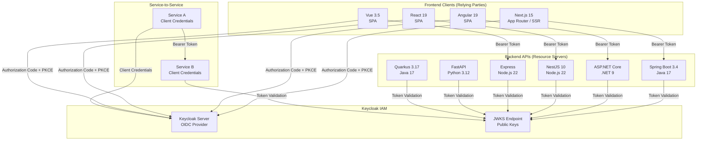
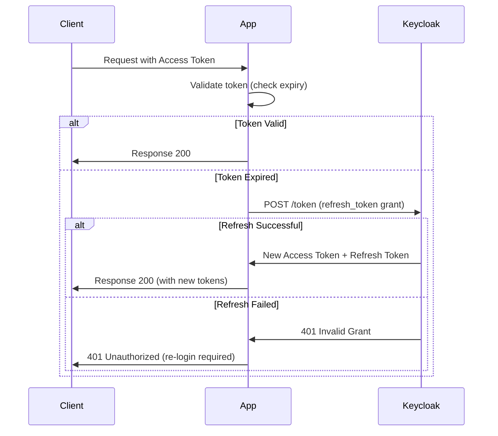
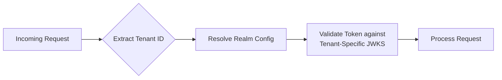

# 14. Client Application Integration Hub

## Table of Contents

- [Introduction](#introduction)
- [Architecture Overview](#architecture-overview)
- [Authentication Flows by Client Type](#authentication-flows-by-client-type)
- [Backend Service Guides](#backend-service-guides)
- [Frontend Application Guides](#frontend-application-guides)
- [Common Patterns Across All Platforms](#common-patterns-across-all-platforms)
- [SDK Version Compatibility Matrix](#sdk-version-compatibility-matrix)
- [Keycloak Server Compatibility](#keycloak-server-compatibility)
- [Related Documents](#related-documents)

---

## Introduction

This section provides detailed integration guides for connecting client applications to the Keycloak IAM platform across multiple programming languages and frameworks. It covers both backend API services (resource servers) that validate incoming tokens and enforce authorization policies, and frontend client applications (relying parties) that authenticate users through OpenID Connect flows. Each framework-specific guide is maintained as a separate sub-document to allow teams to reference only the technology stack relevant to their project.

All integrations use **OpenID Connect (OIDC)** as the primary protocol. SAML 2.0 is supported for legacy systems but is not covered in these guides.

---

## Architecture Overview

The following diagram illustrates how all client types connect to the Keycloak IAM platform, including the authentication flows and token validation mechanisms used by each category of application.



---

## Authentication Flows by Client Type

| Client Type | OIDC Flow | Token Storage | Examples |
|---|---|---|---|
| Single-Page Application (SPA) | Authorization Code + PKCE | Memory only (no localStorage) | Angular, React, Vue client-side apps |
| Server-Side Web App | Authorization Code | HTTP-only secure cookie | Next.js (server components) |
| Backend API (Resource Server) | Token validation only | N/A (validates incoming tokens) | Spring Boot, .NET, NestJS, Express, FastAPI |
| Service / Daemon | Client Credentials | In-memory with auto-refresh | Batch processors, schedulers, background workers |
| Mobile App | Authorization Code + PKCE | Secure OS keychain | React Native, Flutter |

---

## Backend Service Guides

The following guides cover the integration of backend API services that act as OAuth 2.0 resource servers. Each guide includes dependency setup, security configuration, JWT validation, role extraction from Keycloak tokens, and service-to-service communication patterns.

| # | Framework | Language | Document |
|---|---|---|---|
| 14-01 | Spring Boot 3.4 | Java 17 | [Spring Boot Integration Guide](14-01-spring-boot.md) |
| 14-02 | ASP.NET Core | C# / .NET 9 | [ASP.NET Core Integration Guide](14-02-dotnet.md) |
| 14-03 | NestJS 10 | TypeScript / Node.js 22 | [NestJS Integration Guide](14-03-nestjs.md) |
| 14-04 | Express | JavaScript / Node.js 22 | [Express Integration Guide](14-04-express.md) |
| 14-05 | FastAPI | Python 3.12 / OpenAPI | [FastAPI Integration Guide](14-05-python-fastapi.md) |
| 14-10 | Quarkus 3.17 | Java 17 | [Quarkus Integration Guide](14-10-quarkus.md) |

**Spring Boot 3.4** -- Covers Spring Security OAuth2 Resource Server configuration, `SecurityFilterChain` setup, custom `JwtAuthenticationConverter` for Keycloak realm and client role extraction, and token relay for downstream service calls using `RestClient`.

**ASP.NET Core** -- Covers JWT Bearer authentication middleware, `TokenValidationParameters` configuration, custom claim transformation for Keycloak role structures, and policy-based authorization using `[Authorize]` attributes.

**NestJS 10** -- Covers Passport JWT strategy with JWKS-based key resolution, custom guards and decorators for role-based access control, and module-based authentication architecture compatible with NestJS dependency injection.

**Express** -- Covers lightweight JWT validation middleware using the `jose` library, JWKS remote key set integration, role-checking middleware, and route-level protection patterns for Express applications.

**FastAPI** -- Covers Python-based JWT validation using `python-jose`, dependency injection-based authentication with FastAPI's `Depends` system, Pydantic models for token claims, and OpenAPI security scheme integration for automatic Swagger UI authentication.

**Quarkus 3.17** -- Covers the `quarkus-oidc` extension for JWT validation, `@RolesAllowed` annotation-based authorization, `SecurityIdentity` injection, multi-tenant OIDC configuration, and Dev Services for automatic Keycloak provisioning during development and testing.

---

## Frontend Application Guides

The following guides cover the integration of frontend client applications that authenticate users through Keycloak using OpenID Connect. Each guide includes OIDC client setup, token management, route protection, role-based UI rendering, and logout handling.

| # | Framework | Language | Document |
|---|---|---|---|
| 14-06 | Next.js 15 | TypeScript / React | [Next.js Integration Guide](14-06-nextjs.md) |
| 14-07 | Angular 19 | TypeScript | [Angular Integration Guide](14-07-angular.md) |
| 14-08 | React 19 | TypeScript | [React Integration Guide](14-08-react.md) |
| 14-09 | Vue 3.5 | TypeScript | [Vue Integration Guide](14-09-vue.md) |

**Next.js 15** -- Covers NextAuth v5 integration with the Keycloak provider, App Router middleware for route protection, server-side and client-side session management, token refresh handling, and back-channel logout implementation.

**Angular 19** -- Covers `angular-auth-oidc-client` configuration, route guards for protected views, HTTP interceptors for automatic Bearer token injection, role-based template directives, and silent token renewal strategies.

**React 19** -- Covers `oidc-client-ts` and `react-oidc-context` setup, `AuthProvider` integration, protected route components, hook-based authentication state access, and token lifecycle management in single-page application architectures.

**Vue 3.5** -- Covers OIDC client integration using `oidc-client-ts` with Vue composables or the `vue-oidc` library, navigation guard-based route protection, reactive authentication state management, and Pinia store integration for role-based access control.

---

## Common Patterns Across All Platforms

### Token Storage Best Practices

| Context | Recommended Storage | Rationale |
|---|---|---|
| Server-side (Spring, .NET, NestJS) | Not stored (validate on each request) | Tokens arrive in Authorization header; no persistence needed |
| Next.js Server Components | HTTP-only, Secure, SameSite=Lax cookie | Managed by NextAuth; inaccessible to JavaScript |
| SPA (Client Components) | In-memory only | Avoid localStorage/sessionStorage to prevent XSS token theft |
| Mobile | OS secure keychain (iOS Keychain, Android Keystore) | Hardware-backed secure storage |
| Service-to-service | In-memory with automatic refresh | Token cached until near expiry, then refreshed via client credentials |

### Token Refresh Handling



Key considerations for token refresh:

- **Access token lifetime**: Keep short (5 minutes recommended) to limit exposure.
- **Refresh token lifetime**: Set based on session policy (e.g., 30 minutes for active use, 8 hours for SSO).
- **Refresh token rotation**: Enable in Keycloak to invalidate old refresh tokens upon use.
- **Concurrent refresh**: Implement locking or queuing to prevent race conditions when multiple requests trigger refresh simultaneously.

### Logout Implementation

#### Front-Channel Logout

The user's browser is redirected to the Keycloak logout endpoint:

```
GET https://iam.example.com/realms/tenant-acme/protocol/openid-connect/logout
  ?id_token_hint=<id_token>
  &post_logout_redirect_uri=https://app.acme.example.com
```

#### Back-Channel Logout

Keycloak sends a POST request to the application's back-channel logout endpoint:

```
POST https://app.acme.example.com/api/auth/backchannel-logout
Content-Type: application/x-www-form-urlencoded

logout_token=<logout_token>
```

The application must:
1. Validate the `logout_token` (JWT signed by Keycloak).
2. Extract the `sub` (user ID) or `sid` (session ID) from the token.
3. Invalidate the corresponding local session.

### Multi-Tenant Client Configuration

For applications serving multiple tenants (realms), dynamically resolve the Keycloak configuration:



Tenant resolution strategies:

| Strategy | Example | Pros | Cons |
|---|---|---|---|
| Subdomain | `acme.app.example.com` | Clean URL, easy routing | Requires wildcard DNS/TLS |
| Path prefix | `app.example.com/acme/...` | Simple infrastructure | Pollutes URL namespace |
| HTTP header | `X-Tenant-ID: acme` | Flexible, infrastructure-agnostic | Requires client cooperation |
| JWT claim | `tenant_id` claim in token | No additional resolution needed | Requires custom claim mapper |

### Error Handling for Authentication Failures

| HTTP Status | Scenario | Client Action |
|---|---|---|
| `401 Unauthorized` | Missing or invalid token | Redirect to login or refresh token |
| `403 Forbidden` | Valid token but insufficient permissions | Display "access denied" message |
| `400 Bad Request` | Malformed token or request | Log error, display generic error |
| `503 Service Unavailable` | Keycloak is unreachable | Retry with backoff, display maintenance message |

All platforms should implement:

- **Graceful degradation** when Keycloak is temporarily unavailable (e.g., cache JWKS locally).
- **Structured error responses** with error codes that do not leak internal details.
- **Centralized error handling** via middleware or exception filters.

### Testing Authentication in Development

| Approach | Description | Suitable For |
|---|---|---|
| Local Keycloak (Docker) | Run Keycloak in Docker with pre-imported realm config | Integration tests, manual testing |
| Mock JWT | Generate JWTs with a local RSA key and mock the JWKS endpoint | Unit tests |
| Test tokens | Use Keycloak's direct access grant to obtain real tokens in CI | End-to-end tests |
| Wiremock | Stub the OIDC discovery and JWKS endpoints | Unit/integration tests without Keycloak |

Example Docker Compose for local development:

```yaml
# All example applications connect to the platform's shared Keycloak instance
# via the external Docker network. Start the platform first with:
#   cd devops && docker compose up -d
#
# Then start any example project:
#   cd examples/<project> && docker compose up -d

services:
  your-app:
    build:
      context: .
      dockerfile: Dockerfile
    env_file:
      - .env.example
    environment:
      KEYCLOAK_ISSUER_URI: http://iam-keycloak:8080/realms/tenant-acme
    networks:
      - iam-network

networks:
  iam-network:
    external: true
    name: devops_iam-network
```

---

## SDK Version Compatibility Matrix

The following table lists the tested and supported SDK/library versions for each platform integration with Keycloak 26.x.

| Platform | Library / SDK | Minimum Version | Recommended Version | Notes |
|---|---|---|---|---|
| **Java / Spring Boot** | spring-boot-starter-oauth2-resource-server | 3.2.0 | 3.4.x | Requires Java 17+ |
| | spring-boot-starter-oauth2-client | 3.2.0 | 3.4.x | For client credentials flow |
| | spring-security-oauth2-jose | 6.2.0 | 6.4.x | JWT decoding and validation |
| **Java / Quarkus** | quarkus-oidc | 3.8.0 | 3.17.x | Requires Java 17+ |
| | quarkus-keycloak-authorization | 3.8.0 | 3.17.x | Policy enforcement |
| | quarkus-oidc-client | 3.8.0 | 3.17.x | Service-to-service token propagation |
| | quarkus-smallrye-jwt | 3.8.0 | 3.17.x | JWT parsing and validation |
| **Node.js** | jose | 5.0.0 | 5.9.x | JWT verification, JWK handling |
| | openid-client | 5.6.0 | 6.1.x | OIDC client (RP) functionality |
| | express | 4.18.0 | 4.21.x | HTTP framework |
| **.NET** | Microsoft.AspNetCore.Authentication.JwtBearer | 8.0.0 | 9.0.x | JWT Bearer authentication |
| | Microsoft.IdentityModel.Tokens | 7.0.0 | 8.3.x | Token validation primitives |
| | System.IdentityModel.Tokens.Jwt | 7.0.0 | 8.3.x | JWT handling |
| **NestJS** | @nestjs/passport | 10.0.0 | 10.0.x | Passport integration for NestJS |
| | passport-jwt | 4.0.1 | 4.0.x | JWT strategy for Passport |
| | jwks-rsa | 3.1.0 | 3.1.x | JWKS key retrieval |
| **Next.js** | next-auth | 5.0.0-beta.0 | 5.0.x | Authentication for Next.js |
| | next | 14.0.0 | 15.x | App Router support |
| | @auth/core | 0.30.0 | 0.37.x | Core auth library |
| **Python** | python-jose | 3.3.0 | 3.3.x | JWT decoding and validation |
| | fastapi | 0.110.0 | 0.115.x | Async web framework with OpenAPI |
| | python-keycloak | 3.0.0 | 4.x | Keycloak admin and OIDC client |
| | uvicorn | 0.27.0 | 0.34.x | ASGI server |
| **Angular** | angular-auth-oidc-client | 17.0.0 | 18.x | OIDC/OAuth2 library for Angular |
| | @angular/core | 18.0.0 | 19.x | Angular framework |
| **React** | oidc-client-ts | 3.0.0 | 3.1.x | OIDC client for browser-based apps |
| | react-oidc-context | 3.0.0 | 3.2.x | React bindings for oidc-client-ts |
| | react | 18.0.0 | 19.x | React framework |
| **Vue** | oidc-client-ts | 3.0.0 | 3.1.x | OIDC client for browser-based apps |
| | vue-oidc | 1.0.0 | 1.x | Vue plugin (or manual integration) |
| | vue | 3.4.0 | 3.5.x | Vue framework |

---

## Keycloak Server Compatibility

| Keycloak Version | Status | End of Life | Notes |
|---|---|---|---|
| 26.x | Current (Recommended) | TBD | Latest features, active development |
| 25.x | Supported | TBD | Previous stable release |
| 24.x | Maintenance | TBD | Security patches only |
| < 24.x | Unsupported | Past | Upgrade required |

---

## Related Documents

- [Target Architecture](./01-target-architecture.md)
- [Authentication and Authorization](./08-authentication-authorization.md)
- [Security by Design](./07-security-by-design.md)
- [Automation, Workbooks, and Scripts](./13-automation-scripts.md)
