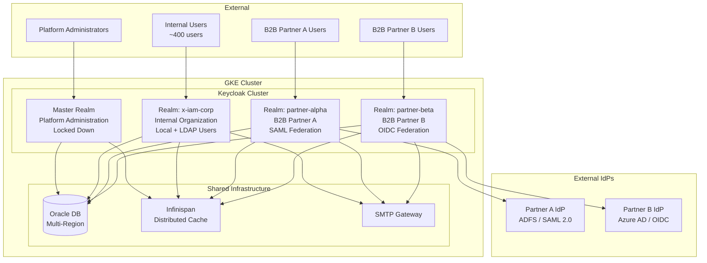
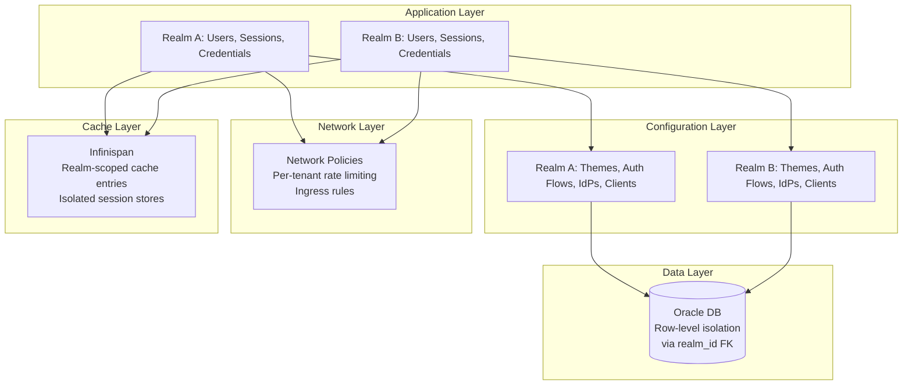
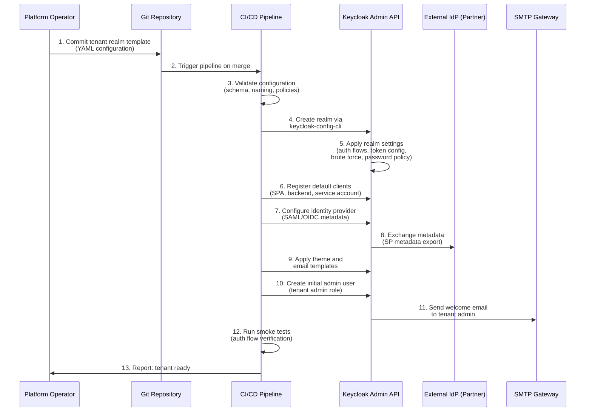
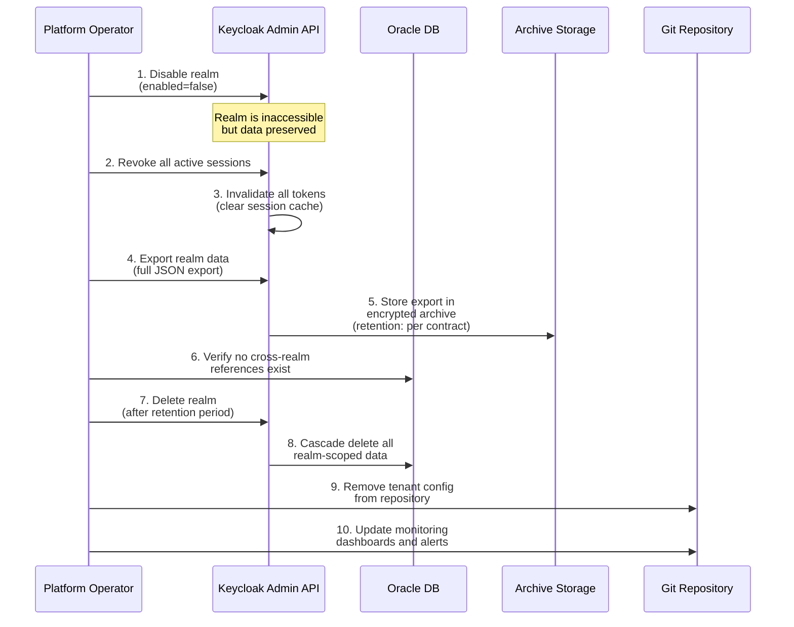
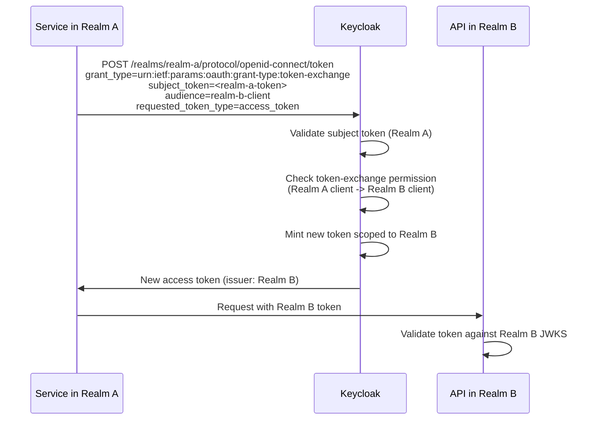
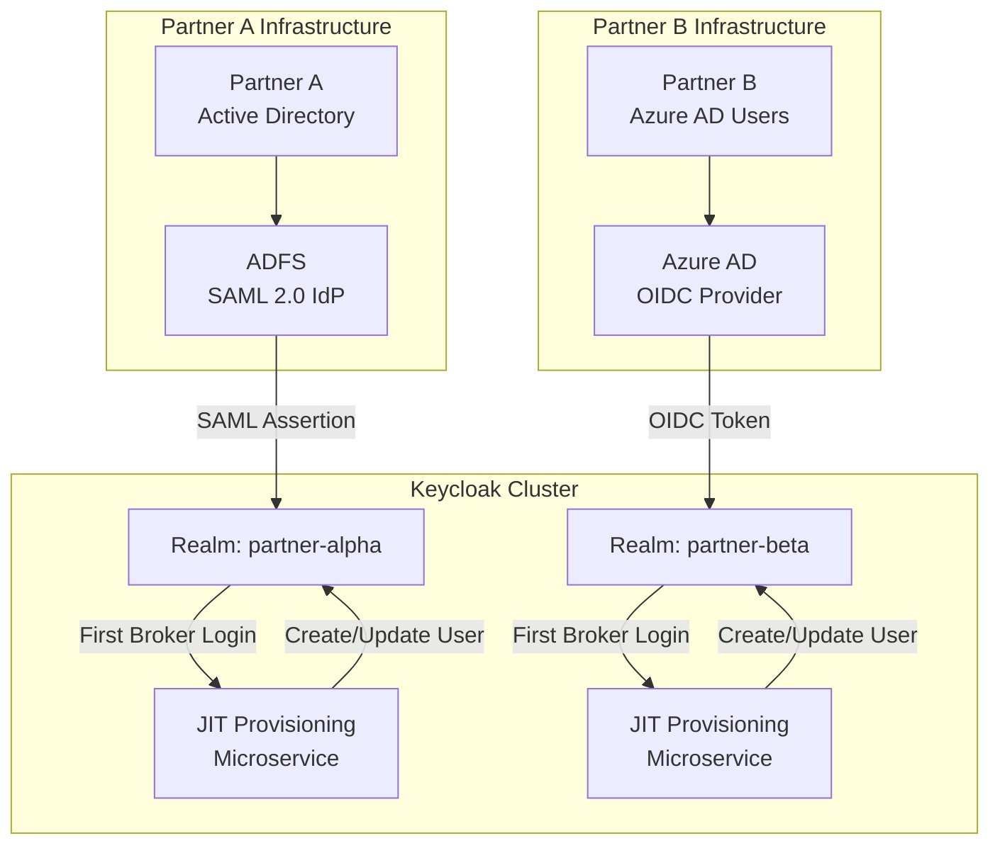

# 15 - Multi-Tenancy Design

> **Project:** Enterprise IAM Platform based on Keycloak
> **Related documents:** [01 - Target Architecture](./01-target-architecture.md) | [04 - Keycloak Configuration](./04-keycloak-configuration.md) | [07 - Security by Design](./07-security-by-design.md) | [09 - User Lifecycle](./09-user-lifecycle.md)

---

## Table of Contents

- [1. Multi-Tenancy Strategy Overview](#1-multi-tenancy-strategy-overview)
- [2. Realm-per-Tenant Architecture](#2-realm-per-tenant-architecture)
- [3. Tenant Isolation Model](#3-tenant-isolation-model)
- [4. Tenant Onboarding](#4-tenant-onboarding)
- [5. Tenant Offboarding](#5-tenant-offboarding)
- [6. Cross-Tenant Concerns](#6-cross-tenant-concerns)
- [7. Identity Federation per Tenant](#7-identity-federation-per-tenant)
- [8. Tenant-Specific Customization](#8-tenant-specific-customization)
- [9. Scalability Considerations](#9-scalability-considerations)
- [10. Monitoring and Observability per Tenant](#10-monitoring-and-observability-per-tenant)
- [11. Related Documents](#11-related-documents)

---

## 1. Multi-Tenancy Strategy Overview

Multi-tenancy is a foundational design decision for any enterprise Identity and Access Management (IAM) platform. It determines how multiple independent organizations (tenants) share the same Keycloak infrastructure while maintaining strict data and configuration isolation.

### 1.1 Strategy Comparison

The following table compares the three primary multi-tenancy strategies available in Keycloak 26.x:

| Strategy | Description | Isolation Level | Operational Cost | Scalability | Customization |
|----------|-------------|-----------------|------------------|-------------|---------------|
| **Realm-per-Tenant** | Each tenant receives a dedicated Keycloak Realm within a shared cluster | High | Medium | Good (up to ~100 realms) | Full per-tenant customization |
| **Shared Realm with Groups** | All tenants share a single Realm; tenants are separated by groups or attributes | Low | Low | Excellent | Limited; shared auth flows and themes |
| **Separate Keycloak Instances** | Each tenant receives a dedicated Keycloak deployment | Maximum | Very High | Limited by infrastructure | Full; completely independent |

### 1.2 Decision Rationale: Realm-per-Tenant

The platform adopts the **Realm-per-Tenant** model for the following reasons:

1. **Strong isolation without infrastructure overhead.** Each Realm provides complete separation of users, sessions, credentials, clients, and identity providers at the application layer, without requiring separate database instances or Keycloak deployments.

2. **Independent security policies.** Each B2B partner organization requires distinct authentication flows, Multi-Factor Authentication (MFA) policies, token lifetimes, and brute force detection thresholds. Realm-level configuration makes this straightforward.

3. **Per-tenant federation.** The current architecture federates with two B2B organizations via Security Assertion Markup Language (SAML) and OpenID Connect (OIDC). Each federation must be scoped to a specific tenant, which maps naturally to a Realm-level identity provider configuration.

4. **Operational feasibility.** With approximately 400 users and 2 B2B organizations, the expected realm count (3-10 realms) is well within Keycloak's tested limits. The Realm-per-Tenant model avoids the complexity of group-based tenant isolation while remaining far simpler to operate than per-tenant Keycloak instances.

5. **Compliance boundaries.** Realm-level isolation simplifies audit logging, data retention, and General Data Protection Regulation (GDPR) compliance since all tenant data is scoped to a single Realm identifier in the database.

### 1.3 When to Reconsider

The Realm-per-Tenant strategy should be revisited if:

- The number of tenants exceeds 50, at which point Infinispan cache overhead and database query performance may require evaluation.
- Tenants require completely independent uptime Service Level Agreements (SLAs) that cannot be met with a shared cluster.
- Regulatory requirements mandate physical database separation between tenants.

---

## 2. Realm-per-Tenant Architecture

### 2.1 Architecture Diagram

The following diagram illustrates how the shared Keycloak cluster hosts multiple tenant Realms, each with its own user base, clients, and identity provider federations.



### 2.2 Realm Inventory

| Realm Name | Purpose | User Source | Federation | Estimated Users |
|------------|---------|------------|------------|-----------------|
| `master` | Platform administration only | Local admin accounts (2-3) | None | 3 |
| `x-iam-corp` | Internal corporate users | Local + LDAP/AD sync | Optional (corporate ADFS) | ~400 |
| `partner-alpha` | B2B Partner A | Just-In-Time (JIT) provisioning | SAML 2.0 (ADFS) | ~50-200 |
| `partner-beta` | B2B Partner B | JIT provisioning | OIDC (Azure AD) | ~50-200 |

### 2.3 Realm Naming Convention

All tenant Realms follow a consistent naming convention to support automation, monitoring, and configuration management:

```
<organization-slug>[-<environment-suffix>]
```

| Component | Format | Example |
|-----------|--------|---------|
| Organization slug | Lowercase, hyphen-separated | `partner-alpha` |
| Environment suffix (optional) | `-dev`, `-qa`, `-prod` | `partner-alpha-dev` |

---

## 3. Tenant Isolation Model

Tenant isolation is enforced at multiple layers to prevent data leakage and ensure independent operation of each tenant.

### 3.1 Isolation Layer Diagram



### 3.2 Data Isolation

All Keycloak entities are scoped to a Realm via foreign key relationships in the database. The `REALM_ID` column is present on every major table, ensuring that standard Keycloak queries never return data from another tenant.

| Data Category | Isolation Mechanism | Database Scope |
|---------------|---------------------|----------------|
| Users and profiles | `USER_ENTITY.REALM_ID` | Per-realm |
| Credentials (passwords, OTP secrets) | `CREDENTIAL.USER_ID` (user is realm-scoped) | Per-realm |
| Sessions (SSO, offline) | `USER_SESSION.REALM_ID` | Per-realm |
| Events (login, admin) | `EVENT_ENTITY.REALM_ID` | Per-realm |
| Clients and client scopes | `CLIENT.REALM_ID` | Per-realm |
| Roles and groups | `KEYCLOAK_ROLE.REALM_ID`, `KEYCLOAK_GROUP.REALM_ID` | Per-realm |
| Identity providers | `IDENTITY_PROVIDER.REALM_ID` | Per-realm |
| Authentication flows | `AUTHENTICATION_FLOW.REALM_ID` | Per-realm |

**Oracle DB considerations:**

- Indexing on `REALM_ID` columns is critical for query performance with multiple realms.
- Partitioning by `REALM_ID` can be applied to high-volume tables (`EVENT_ENTITY`, `USER_SESSION`) for improved performance and simplified data lifecycle management.
- Tablespace-per-tenant is an optional enhancement for physical I/O isolation.

### 3.3 Configuration Isolation

Each Realm maintains independent configuration for all security-relevant settings:

| Configuration Area | Isolation Scope | Example |
|-------------------|-----------------|---------|
| Authentication flows | Per-realm | Partner A requires SAML + MFA; Partner B uses OIDC only |
| Token lifetimes | Per-realm | Internal: 5 min access token; Partner A: 10 min access token |
| Brute force detection | Per-realm | Internal: 5 failures / 60s lockout; Partner B: 3 failures / 300s lockout |
| Password policies | Per-realm | Internal: 12 chars + complexity; Partner A: delegated to external IdP |
| MFA policies | Per-realm | Internal: conditional TOTP; Partners: MFA delegated to federated IdP |
| Themes and branding | Per-realm | Each partner sees their own branded login page |
| Email templates | Per-realm | Localized templates per organization |
| Identity providers | Per-realm | Each partner realm connects to exactly one external IdP |

### 3.4 Network-Level Isolation

Network-level controls complement application-level isolation:

| Control | Implementation | Purpose |
|---------|----------------|---------|
| Per-tenant rate limiting | NGINX Ingress annotations per realm path | Prevent one tenant from exhausting cluster resources |
| IP allowlisting | Ingress rules scoped to `/realms/<tenant>/` paths | Restrict partner access to known IP ranges |
| Namespace network policies | Kubernetes NetworkPolicy in `iam-system` | Restrict pod-to-pod communication |
| TLS termination | Shared wildcard certificate or per-tenant certificates | Encrypt all traffic |

**NGINX rate limiting example per tenant:**

```yaml
# Ingress annotation for partner-alpha realm
apiVersion: networking.k8s.io/v1
kind: Ingress
metadata:
  name: keycloak-partner-alpha
  namespace: iam-system
  annotations:
    nginx.ingress.kubernetes.io/limit-rps: "50"
    nginx.ingress.kubernetes.io/limit-burst-multiplier: "3"
    nginx.ingress.kubernetes.io/whitelist-source-range: "203.0.113.0/24,198.51.100.0/24"
spec:
  rules:
    - host: auth.example.com
      http:
        paths:
          - path: /realms/partner-alpha
            pathType: Prefix
            backend:
              service:
                name: keycloak
                port:
                  number: 8443
```

---

## 4. Tenant Onboarding

Tenant onboarding is a fully automated process driven by configuration-as-code and the Keycloak Admin REST API. Manual realm creation is prohibited in all environments.

### 4.1 Onboarding Workflow



### 4.2 Realm Template

Every new tenant realm is created from a standardized template. The template is maintained as a YAML file processed by `keycloak-config-cli`.

```yaml
# keycloak-config/realms/tenant-template/realm.yaml
realm: "{{ tenant_slug }}"
displayName: "{{ tenant_display_name }}"
enabled: true

# Login settings
registrationAllowed: false
registrationEmailAsUsername: true
editUsernameAllowed: false
resetPasswordAllowed: true
rememberMe: true
verifyEmail: true
loginWithEmailAllowed: true
duplicateEmailsAllowed: false

# Token lifetimes (seconds)
accessTokenLifespan: 300
accessTokenLifespanForImplicitFlow: 300
ssoSessionIdleTimeout: 1800
ssoSessionMaxLifespan: 28800
offlineSessionIdleTimeout: 2592000
offlineSessionMaxLifespan: 5184000

# Security settings
bruteForceProtected: true
permanentLockout: false
maxFailureWaitSeconds: 900
minimumQuickLoginWaitSeconds: 60
waitIncrementSeconds: 60
quickLoginCheckMilliSeconds: 1000
maxDeltaTimeSeconds: 600
failureFactor: 5

# Password policy
passwordPolicy: >-
  length(12) and
  upperCase(1) and
  lowerCase(1) and
  digits(1) and
  specialChars(1) and
  notUsername and
  passwordHistory(5)

# Events
eventsEnabled: true
eventsExpiration: 7776000  # 90 days
adminEventsEnabled: true
adminEventsDetailsEnabled: true

# Internationalization
internationalizationEnabled: true
supportedLocales:
  - "en"
  - "es"
defaultLocale: "en"
```

### 4.3 Default Client Configuration

Each new tenant realm is provisioned with a standard set of clients:

```yaml
# keycloak-config/realms/tenant-template/clients/defaults.yaml
clients:
  - clientId: "{{ tenant_slug }}-spa"
    name: "{{ tenant_display_name }} SPA"
    protocol: openid-connect
    publicClient: true
    standardFlowEnabled: true
    implicitFlowEnabled: false
    directAccessGrantsEnabled: false
    redirectUris:
      - "https://{{ tenant_slug }}.app.example.com/*"
    webOrigins:
      - "https://{{ tenant_slug }}.app.example.com"
    attributes:
      pkce.code.challenge.method: "S256"

  - clientId: "{{ tenant_slug }}-backend"
    name: "{{ tenant_display_name }} Backend Service"
    protocol: openid-connect
    publicClient: false
    standardFlowEnabled: true
    implicitFlowEnabled: false
    directAccessGrantsEnabled: false
    serviceAccountsEnabled: false
    redirectUris:
      - "https://api.{{ tenant_slug }}.example.com/callback"
    webOrigins:
      - "https://api.{{ tenant_slug }}.example.com"

  - clientId: "{{ tenant_slug }}-service"
    name: "{{ tenant_display_name }} Service Account"
    protocol: openid-connect
    publicClient: false
    standardFlowEnabled: false
    implicitFlowEnabled: false
    directAccessGrantsEnabled: false
    serviceAccountsEnabled: true
    clientAuthenticatorType: "client-secret-jwt"
```

### 4.4 Onboarding via kcadm CLI

For ad-hoc or emergency provisioning, the Keycloak Admin CLI (`kcadm.sh`) can be used:

```bash
#!/usr/bin/env bash
# scripts/onboard-tenant.sh
# Provisions a new tenant realm using the Keycloak Admin CLI.

set -euo pipefail

TENANT_SLUG="${1:?Usage: onboard-tenant.sh <tenant-slug> <display-name>}"
DISPLAY_NAME="${2:?Usage: onboard-tenant.sh <tenant-slug> <display-name>}"
KC_URL="${KC_URL:-https://auth.example.com}"

# Authenticate to master realm
kcadm.sh config credentials \
  --server "${KC_URL}" \
  --realm master \
  --user "${KC_ADMIN_USER}" \
  --password "${KC_ADMIN_PASSWORD}"

# Create realm
kcadm.sh create realms \
  -s realm="${TENANT_SLUG}" \
  -s displayName="${DISPLAY_NAME}" \
  -s enabled=true \
  -s registrationAllowed=false \
  -s loginWithEmailAllowed=true \
  -s duplicateEmailsAllowed=false \
  -s bruteForceProtected=true \
  -s failureFactor=5 \
  -s accessTokenLifespan=300 \
  -s ssoSessionIdleTimeout=1800 \
  -s ssoSessionMaxLifespan=28800 \
  -s eventsEnabled=true \
  -s adminEventsEnabled=true

# Create default SPA client
kcadm.sh create clients -r "${TENANT_SLUG}" \
  -s clientId="${TENANT_SLUG}-spa" \
  -s publicClient=true \
  -s standardFlowEnabled=true \
  -s 'redirectUris=["https://'"${TENANT_SLUG}"'.app.example.com/*"]' \
  -s 'webOrigins=["https://'"${TENANT_SLUG}"'.app.example.com"]' \
  -s 'attributes={"pkce.code.challenge.method":"S256"}'

echo "Tenant '${TENANT_SLUG}' provisioned successfully."
```

---

## 5. Tenant Offboarding

Tenant offboarding must be handled with care to satisfy data retention, compliance, and audit requirements.

### 5.1 Offboarding Workflow



### 5.2 Data Retention Policy

| Data Category | Retention Period | Storage | Encryption |
|---------------|-----------------|---------|------------|
| Realm configuration export | 7 years (contractual) | Encrypted object storage (GCS) | AES-256-GCM |
| User data export | Per GDPR / contract | Encrypted object storage (GCS) | AES-256-GCM |
| Audit event logs | 7 years (regulatory) | Log archive (BigQuery / cold storage) | At rest + in transit |
| Session data | None (ephemeral) | Deleted with realm | N/A |
| Credential hashes | None after offboarding | Deleted with realm | N/A |

### 5.3 GDPR Considerations

| Requirement | Implementation |
|-------------|----------------|
| Right to erasure (Article 17) | Realm deletion cascades all user data; archived exports are pseudonymized |
| Data portability (Article 20) | Full realm export in JSON format provided to tenant before deletion |
| Lawful basis for retention | Contractual obligation and legitimate interest for audit logs |
| Data Protection Impact Assessment (DPIA) | Required before onboarding tenants processing special category data |
| Cross-border transfer | Realm data stays within GKE regions (Belgium / Madrid); no third-country transfer |

### 5.4 Realm Deletion Safety Checklist

Before executing realm deletion, the following checks must pass:

1. Realm has been disabled for at least the contractual notice period (default: 30 days).
2. All active sessions have been revoked and confirmed cleared from Infinispan.
3. Full realm export has been created, verified, and stored in the encrypted archive.
4. The tenant administrator has confirmed data export receipt (if applicable).
5. No cross-realm token exchange policies reference the target realm.
6. No service accounts in other realms hold tokens scoped to the target realm.
7. Monitoring dashboards and alerting rules referencing the realm have been updated.
8. The deletion is approved by the change advisory board (CAB) and logged in the audit trail.

---

## 6. Cross-Tenant Concerns

While tenant isolation is the primary design goal, certain platform-level concerns span across all tenants.

### 6.1 Shared Services

| Service | Scope | Access Control |
|---------|-------|----------------|
| Master Realm | Platform administration | IP-restricted, MFA-enforced, 2-3 break-glass accounts |
| Keycloak cluster (pods) | Shared compute | Resource quotas per namespace; no per-realm compute isolation |
| Oracle DB | Shared database instance | Row-level isolation via `REALM_ID`; shared connection pool |
| Infinispan cache | Shared distributed cache | Realm-scoped cache keys; no cross-realm cache access |
| SMTP gateway | Shared email delivery | Per-realm sender address and templates |
| Ingress controller | Shared routing layer | Per-tenant rate limits and IP rules |
| Observability stack | Shared Prometheus / Grafana | Per-realm metric labels and dashboard filters |

### 6.2 Cross-Realm Token Exchange

In scenarios where a service in one tenant realm needs to call an API protected by another tenant realm, cross-realm token exchange can be configured. This is an advanced pattern that should be used sparingly.



**Prerequisites for cross-realm token exchange:**

1. The `token-exchange` feature must be enabled in `KC_FEATURES`.
2. Fine-grained admin permissions must be enabled (`admin-fine-grained-authz`).
3. The source client must have a `token-exchange` permission granted for the target client.
4. Both realms must be on the same Keycloak cluster.

**Configuration (Realm A client policy):**

```json
{
  "clientId": "realm-a-service",
  "permissions": {
    "token-exchange": {
      "clients": ["realm-b-api-client"],
      "scopes": ["openid", "profile"]
    }
  }
}
```

### 6.3 Service Accounts for Inter-Tenant Communication

When backend services need to interact across tenant boundaries (for example, a shared reporting service that aggregates data from multiple tenant APIs), dedicated service accounts are used:

| Service Account | Home Realm | Target Realm(s) | Grant Type | Purpose |
|----------------|------------|------------------|------------|---------|
| `shared-reporting-svc` | `x-iam-corp` | `partner-alpha`, `partner-beta` | Client Credentials + Token Exchange | Aggregate partner metrics |
| `shared-notification-svc` | `x-iam-corp` | All tenant realms | Client Credentials | Send cross-tenant notifications |
| `audit-aggregator-svc` | `master` | All tenant realms | Client Credentials | Centralized audit log collection |

**Security constraints for cross-tenant service accounts:**

- Service accounts must use `client-secret-jwt` or `client-secret-post` authentication (never plain `client-secret` in headers).
- Token exchange permissions must follow least privilege: only the specific scopes and target clients required.
- All cross-tenant token exchanges are logged as admin events.
- Cross-tenant service account credentials are rotated on a 90-day schedule.

---

## 7. Identity Federation per Tenant

Each tenant realm maintains its own identity provider (IdP) federation configuration, enabling B2B partners to authenticate users through their own corporate identity systems.

### 7.1 Federation Architecture



### 7.2 SAML Federation (Partner A)

The SAML 2.0 federation for Partner A is configured in the `partner-alpha` realm. For full SAML IdP configuration parameters, see [04 - Keycloak Configuration](./04-keycloak-configuration.md), Section 4.1.

| Parameter | Value |
|-----------|-------|
| Realm | `partner-alpha` |
| IdP Alias | `partner-alpha-adfs` |
| Protocol | SAML 2.0 |
| SSO URL | `https://adfs.partner-alpha.com/adfs/ls/` |
| SLO URL | `https://adfs.partner-alpha.com/adfs/ls/?wa=wsignout1.0` |
| NameID Format | `emailAddress` |
| Assertions Signed | `true` |
| Assertions Encrypted | `true` |
| Sync Mode | `FORCE` (always update from IdP) |

### 7.3 OIDC Federation (Partner B)

The OIDC federation for Partner B is configured in the `partner-beta` realm. For full OIDC IdP configuration parameters, see [04 - Keycloak Configuration](./04-keycloak-configuration.md), Section 4.2.

| Parameter | Value |
|-----------|-------|
| Realm | `partner-beta` |
| IdP Alias | `partner-beta-azure` |
| Protocol | OpenID Connect |
| Discovery URL | `https://login.microsoftonline.com/<tenant-id>/.well-known/openid-configuration` |
| Client Authentication | `client_secret_post` |
| Default Scopes | `openid profile email` |
| Sync Mode | `FORCE` |
| Trust Email | `true` |

### 7.4 JIT Provisioning per Realm

Just-In-Time (JIT) provisioning creates or updates local user records in the tenant realm upon first federated login. The JIT microservice is invoked via the Keycloak "First Broker Login" authentication flow.

**JIT provisioning logic per tenant:**

| Step | Action | Realm-Specific Behavior |
|------|--------|------------------------|
| 1 | Receive IdP assertion/token | Validate against realm-specific IdP signing certificate or JWKS |
| 2 | Extract user attributes | Apply realm-specific attribute mapping (see below) |
| 3 | Lookup existing user | Search by email in the target realm only |
| 4 | Create or update user | Apply realm-specific default roles and group membership |
| 5 | Link identity | Create federated identity link scoped to the realm |
| 6 | Issue Keycloak token | Token claims include realm-specific custom mappers |

### 7.5 Attribute Mapping per Tenant

Each tenant defines its own attribute mapping from the external IdP to Keycloak user attributes:

**Partner A (SAML):**

| SAML Attribute | Keycloak Attribute | Transform |
|----------------|-------------------|-----------|
| `http://schemas.xmlsoap.org/ws/2005/05/identity/claims/emailaddress` | `email` | None |
| `http://schemas.xmlsoap.org/ws/2005/05/identity/claims/givenname` | `firstName` | None |
| `http://schemas.xmlsoap.org/ws/2005/05/identity/claims/surname` | `lastName` | None |
| `http://schemas.xmlsoap.org/claims/Group` | `groups` | Map to Keycloak groups |
| `http://schemas.xmlsoap.org/claims/Department` | `department` | Custom user attribute |
| `http://schemas.xmlsoap.org/claims/EmployeeID` | `employeeId` | Custom user attribute |

**Partner B (OIDC):**

| OIDC Claim | Keycloak Attribute | Transform |
|------------|-------------------|-----------|
| `email` | `email` | None |
| `given_name` | `firstName` | None |
| `family_name` | `lastName` | None |
| `groups` | `groups` | Filter by prefix `keycloak-` |
| `jobTitle` | `jobTitle` | Custom user attribute |
| `companyName` | `organization` | Custom user attribute |

---

## 8. Tenant-Specific Customization

Each tenant realm supports independent customization of the user-facing experience, including visual themes, email templates, and authentication flow policies.

### 8.1 Per-Tenant Themes

Keycloak themes are deployed as JAR files in the `providers/` directory. Each tenant can have a custom theme or use a shared base theme with tenant-specific overrides.

**Theme directory structure:**

```
keycloak/themes/
  base-enterprise/           # Shared base theme
    login/
      theme.properties
      resources/css/
      resources/img/
      messages/
      template.ftl
    email/
      messages/
      html/
      text/
  partner-alpha/             # Partner A theme (extends base)
    login/
      theme.properties       # parent=base-enterprise
      resources/css/partner-alpha.css
      resources/img/logo.svg
      messages/messages_en.properties
    email/
      html/
      text/
  partner-beta/              # Partner B theme (extends base)
    login/
      theme.properties       # parent=base-enterprise
      resources/css/partner-beta.css
      resources/img/logo.svg
      messages/messages_en.properties
      messages/messages_es.properties
    email/
      html/
      text/
```

**Theme assignment per realm:**

| Realm | Login Theme | Email Theme | Account Theme | Admin Theme |
|-------|-------------|-------------|---------------|-------------|
| `master` | `keycloak` (default) | `keycloak` | `keycloak` | `keycloak` |
| `x-iam-corp` | `base-enterprise` | `base-enterprise` | `base-enterprise` | `keycloak` |
| `partner-alpha` | `partner-alpha` | `partner-alpha` | `base-enterprise` | `keycloak` |
| `partner-beta` | `partner-beta` | `partner-beta` | `base-enterprise` | `keycloak` |

### 8.2 Per-Tenant Email Templates

Email templates are part of the theme and can be customized per tenant for branding and localization.

| Email Template | Purpose | Customizable Elements |
|----------------|---------|----------------------|
| `executeActions.ftl` | Required actions (verify email, update password) | Logo, colors, footer, sender name |
| `email-verification.ftl` | Email address verification | Logo, action button style |
| `password-reset.ftl` | Password reset link | Logo, expiration text, support contact |
| `email-otp.ftl` | Email-based OTP delivery | OTP format, branding, TTL text |
| `event-login_error.ftl` | Failed login notification | Security guidance, support contact |

### 8.3 Per-Tenant Authentication Flows

Each realm can define its own authentication flow tailored to the tenant's security requirements:

| Realm | Primary Auth | MFA Policy | Federation | Notes |
|-------|-------------|------------|------------|-------|
| `x-iam-corp` | Username/Password | Conditional TOTP (role-based) | Optional ADFS | Internal users; MFA for admin roles |
| `partner-alpha` | Federated (SAML) | Delegated to Partner A IdP | ADFS mandatory | No local passwords; MFA at partner IdP |
| `partner-beta` | Federated (OIDC) | Delegated to Partner B IdP | Azure AD mandatory | No local passwords; MFA at partner IdP |

**Custom browser flow for federated-only realms (partner realms):**

| Step | Execution | Requirement | Description |
|------|-----------|-------------|-------------|
| Cookie | Authenticator | ALTERNATIVE | Check existing SSO session |
| Identity Provider Redirector | Authenticator | ALTERNATIVE | Auto-redirect to configured IdP |

In federated-only realms, the username/password form is removed entirely. Users are automatically redirected to the external IdP, simplifying the login experience and ensuring that credential management remains with the partner organization.

**Flow configuration (keycloak-config-cli):**

```yaml
# keycloak-config/realms/partner-alpha/authentication-flows/browser-flow.yaml
authenticationFlows:
  - alias: "partner-alpha-browser"
    description: "Federated-only browser flow for Partner Alpha"
    providerId: "basic-flow"
    topLevel: true
    builtIn: false
    authenticationExecutions:
      - authenticator: "auth-cookie"
        authenticatorFlow: false
        requirement: "ALTERNATIVE"
        priority: 10
      - authenticator: "identity-provider-redirector"
        authenticatorFlow: false
        requirement: "ALTERNATIVE"
        priority: 20
        authenticatorConfig:
          alias: "partner-alpha-idp-redirector"
          config:
            defaultProvider: "partner-alpha-adfs"

browserFlow: "partner-alpha-browser"
```

---

## 9. Scalability Considerations

The Realm-per-Tenant model introduces specific scalability concerns that must be addressed in capacity planning and operational procedures.

### 9.1 Realm Count Limits

Keycloak does not impose a hard limit on the number of realms, but practical limits exist due to resource consumption:

| Factor | Impact | Recommended Limit | Mitigation |
|--------|--------|-------------------|------------|
| Infinispan cache memory | Each realm consumes cache entries for realm metadata, clients, roles, and session data | 50-100 realms per cluster | Increase Keycloak pod memory; tune cache eviction |
| Database table size | `REALM` and related tables grow linearly | No hard limit; monitor query performance | Index on `REALM_ID`; Oracle partitioning |
| Startup time | Keycloak loads all realm metadata on startup | 50 realms: ~30s; 100 realms: ~60s | Lazy loading (Keycloak 26.x default) |
| Admin console performance | Admin UI lists all realms | 50+ realms: noticeable delay | Use Admin REST API for automation |
| Configuration drift risk | More realms increase operational complexity | Managed by keycloak-config-cli | Automated configuration audits |

**Current deployment sizing:**

With 3-5 realms (master + x-iam-corp + 2 partner realms), the platform operates well within comfortable limits. The architecture supports growth to 20-30 tenants without infrastructure changes.

### 9.2 Infinispan Cache Partitioning

Keycloak 26.x uses embedded Infinispan for distributed caching. Cache entries are inherently realm-scoped via cache key prefixes.

| Cache Name | Content | Eviction Strategy | Max Entries (per node) |
|------------|---------|-------------------|----------------------|
| `realms` | Realm metadata and configuration | LRU | 10,000 |
| `users` | User entity cache | LRU | 10,000 |
| `sessions` | Active user sessions | None (session lifecycle) | Unbounded (monitor!) |
| `authenticationSessions` | In-progress authentication flows | Time-based (5 min TTL) | Unbounded |
| `offlineSessions` | Offline refresh tokens | None (explicit revocation) | Unbounded (monitor!) |
| `clientSessions` | Client-level session data | Tied to user session lifecycle | Unbounded |
| `actionTokens` | One-time action tokens | Time-based (per token TTL) | Unbounded |
| `authorization` | Authorization policy cache | LRU | 10,000 |

**Infinispan tuning for multi-tenant deployments:**

```xml
<!-- infinispan-config.xml (embedded in Keycloak) -->
<cache-container name="keycloak">
    <!-- Realm cache: increase for multi-tenant -->
    <local-cache name="realms">
        <encoding>
            <key media-type="application/x-java-object"/>
            <value media-type="application/x-java-object"/>
        </encoding>
        <memory max-count="20000" when-full="REMOVE"/>
    </local-cache>

    <!-- User cache: scale with total user count across all realms -->
    <local-cache name="users">
        <encoding>
            <key media-type="application/x-java-object"/>
            <value media-type="application/x-java-object"/>
        </encoding>
        <memory max-count="20000" when-full="REMOVE"/>
    </local-cache>

    <!-- Session caches: distributed for HA -->
    <distributed-cache name="sessions" owners="2">
        <encoding>
            <key media-type="application/x-java-object"/>
            <value media-type="application/x-java-object"/>
        </encoding>
    </distributed-cache>

    <distributed-cache name="offlineSessions" owners="2">
        <encoding>
            <key media-type="application/x-java-object"/>
            <value media-type="application/x-java-object"/>
        </encoding>
    </distributed-cache>
</cache-container>
```

### 9.3 Database Performance with Multiple Realms

Oracle DB performance must be monitored as the number of realms and users grows.

| Table | Growth Pattern | Indexing Strategy | Partitioning Recommendation |
|-------|---------------|-------------------|----------------------------|
| `USER_ENTITY` | Linear with total users | B-tree on `(REALM_ID, EMAIL)`, `(REALM_ID, USERNAME)` | Range partition by `REALM_ID` |
| `CREDENTIAL` | 1-3 rows per user | B-tree on `(USER_ID)` | Inherited from `USER_ENTITY` partitioning |
| `USER_SESSION` | Proportional to concurrent sessions | B-tree on `(REALM_ID, USER_ID)` | Range partition by `REALM_ID` |
| `EVENT_ENTITY` | High volume; time-series pattern | B-tree on `(REALM_ID, EVENT_TIME)` | Range partition by `EVENT_TIME` + sub-partition by `REALM_ID` |
| `CLIENT` | ~3-10 per realm | B-tree on `(REALM_ID)` | Not required at current scale |
| `FEDERATED_IDENTITY` | 1 per federated user | B-tree on `(REALM_ID, USER_ID)` | Inherited from `USER_ENTITY` partitioning |

**Connection pool sizing:**

```
Total connections = KC_DB_POOL_MAX_SIZE * number_of_keycloak_pods
                  = 50 * 3
                  = 150 connections

Oracle DB max_connections should be >= 150 + headroom (200 recommended)
```

With 3-5 realms and ~400 users, the default pool size of 50 per pod is sufficient. Monitor `active_connections` and `wait_count` metrics to identify contention.

### 9.4 Horizontal Scaling Impact

Adding Keycloak pods improves throughput but increases Infinispan cluster communication:

| Pods | Infinispan Cluster Size | Session Replication Overhead | Recommended For |
|------|------------------------|------------------------------|-----------------|
| 2 | 2 nodes | Low | Development, QA |
| 3 | 3 nodes | Moderate | Production (current) |
| 5 | 5 nodes | Moderate-High | High traffic periods |
| 10 | 10 nodes | High | Maximum tested scale |

For the current deployment (~400 users, 2 B2B partners), 3 Keycloak pods provide adequate throughput with room for 5-10x growth.

---

## 10. Monitoring and Observability per Tenant

Effective multi-tenant monitoring requires per-realm visibility into authentication activity, error rates, and performance. For the full observability stack design, see [10 - Observability](./10-observability.md).

### 10.1 Per-Realm Metrics

Keycloak 26.x exposes Micrometer-based metrics with realm labels. The following metrics are critical for per-tenant monitoring:

| Metric | Labels | Description | Alert Threshold |
|--------|--------|-------------|-----------------|
| `keycloak_login_attempts_total` | `realm`, `provider`, `status` | Total login attempts per realm | N/A (informational) |
| `keycloak_login_errors_total` | `realm`, `error` | Failed login attempts per realm | > 50/min (brute force) |
| `keycloak_registrations_total` | `realm` | User registrations per realm | Unexpected spike |
| `keycloak_token_requests_total` | `realm`, `grant_type` | Token issuance per realm | N/A (capacity planning) |
| `keycloak_active_sessions` | `realm` | Current active sessions per realm | > 80% of estimated capacity |
| `keycloak_refresh_token_requests_total` | `realm` | Refresh token usage per realm | Anomalous patterns |
| `keycloak_code_to_token_request_duration_seconds` | `realm` | Token exchange latency | p99 > 500ms |
| `keycloak_request_duration_seconds` | `realm`, `method`, `uri` | HTTP request duration per realm | p99 > 1s |

### 10.2 Tenant-Specific Dashboards

Grafana dashboards are organized by tenant using realm-based variable filters:

**Dashboard hierarchy:**

```
Grafana/
  Dashboards/
    IAM Platform/
      Overview (all realms)           # Executive summary across all tenants
      Realm: x-iam-corp/             # Internal organization dashboard
        Login Activity
        Session Overview
        MFA Compliance
        Error Analysis
      Realm: partner-alpha/          # Partner A dashboard
        Federation Health
        JIT Provisioning Stats
        Login Activity
        Error Analysis
      Realm: partner-beta/           # Partner B dashboard
        Federation Health
        JIT Provisioning Stats
        Login Activity
        Error Analysis
      Platform Health/               # Infrastructure dashboards
        Keycloak Pod Metrics
        Oracle DB Performance
        Infinispan Cache Stats
        Ingress Traffic
```

**Grafana dashboard variable for realm filtering:**

```json
{
  "name": "realm",
  "type": "query",
  "datasource": "Prometheus",
  "query": "label_values(keycloak_login_attempts_total, realm)",
  "multi": true,
  "includeAll": true,
  "allValue": ".*"
}
```

### 10.3 SLI/SLO per Tenant

Service Level Indicators (SLIs) and Service Level Objectives (SLOs) are defined per tenant to support differentiated service agreements:

| SLI | Measurement | SLO (Internal) | SLO (B2B Partners) |
|-----|-------------|-----------------|---------------------|
| Authentication availability | Successful logins / total login attempts (excluding user errors) | 99.9% monthly | 99.5% monthly |
| Authentication latency (p95) | Time from login request to token issuance | < 500ms | < 1000ms |
| Token issuance availability | Successful token requests / total token requests | 99.9% monthly | 99.5% monthly |
| Federation availability | Successful federated logins / total federated attempts | N/A | 99.5% monthly |
| Session availability | Active sessions / expected sessions | 99.9% monthly | 99.5% monthly |

**Alerting rules (Prometheus):**

```yaml
# prometheus/rules/keycloak-multi-tenant.yaml
groups:
  - name: keycloak-tenant-slos
    rules:
      # Authentication error rate per realm
      - alert: HighAuthErrorRate
        expr: |
          (
            sum(rate(keycloak_login_errors_total{error!="user_not_found"}[5m])) by (realm)
            /
            sum(rate(keycloak_login_attempts_total[5m])) by (realm)
          ) > 0.05
        for: 5m
        labels:
          severity: warning
        annotations:
          summary: "High authentication error rate in realm {{ $labels.realm }}"
          description: "Authentication error rate exceeds 5% for realm {{ $labels.realm }} over the last 5 minutes."

      # Authentication latency per realm
      - alert: HighAuthLatency
        expr: |
          histogram_quantile(0.95,
            sum(rate(keycloak_request_duration_seconds_bucket{uri=~"/realms/.*/protocol/openid-connect/token"}[5m])) by (realm, le)
          ) > 1.0
        for: 5m
        labels:
          severity: warning
        annotations:
          summary: "High authentication latency in realm {{ $labels.realm }}"
          description: "p95 authentication latency exceeds 1s for realm {{ $labels.realm }}."

      # Brute force detection per realm
      - alert: BruteForceDetected
        expr: |
          sum(rate(keycloak_login_errors_total{error="user_disabled"}[5m])) by (realm) > 0.5
        for: 2m
        labels:
          severity: critical
        annotations:
          summary: "Possible brute force attack on realm {{ $labels.realm }}"
          description: "Elevated account lockout rate detected in realm {{ $labels.realm }}."

      # Federation health per realm
      - alert: FederationFailures
        expr: |
          sum(rate(keycloak_login_errors_total{error="identity_provider_error"}[10m])) by (realm) > 0.1
        for: 10m
        labels:
          severity: critical
        annotations:
          summary: "Identity provider failures in realm {{ $labels.realm }}"
          description: "Federation errors detected for realm {{ $labels.realm }}. Check external IdP connectivity."
```

### 10.4 Audit Logging per Tenant

All authentication events are stored with the realm identifier, enabling per-tenant audit queries:

| Event Type | Stored Fields | Retention | Query Example |
|------------|--------------|-----------|---------------|
| LOGIN | realm, userId, ipAddress, clientId, timestamp | 90 days (online), 7 years (archive) | `realm_id = 'partner-alpha' AND type = 'LOGIN'` |
| LOGIN_ERROR | realm, userId, ipAddress, error, timestamp | 90 days (online), 7 years (archive) | `realm_id = 'partner-alpha' AND type = 'LOGIN_ERROR'` |
| LOGOUT | realm, userId, sessionId, timestamp | 90 days (online), 7 years (archive) | `realm_id = 'x-iam-corp' AND type = 'LOGOUT'` |
| CODE_TO_TOKEN | realm, clientId, userId, timestamp | 90 days (online), 7 years (archive) | `realm_id = 'partner-beta' AND type = 'CODE_TO_TOKEN'` |
| FEDERATED_IDENTITY_LINK | realm, userId, identityProvider, timestamp | 90 days (online), 7 years (archive) | `type = 'FEDERATED_IDENTITY_LINK'` |

For the full observability and alerting architecture, see [10 - Observability](./10-observability.md).

---

## 11. Related Documents

| Document | Relevance to Multi-Tenancy |
|----------|---------------------------|
| [00 - Overview](./00-overview.md) | Project scope, technology stack, and phase overview |
| [01 - Target Architecture](./01-target-architecture.md) | High-level architecture, multi-tenancy strategy summary, HA design |
| [02 - Analysis and Design](./02-analysis-and-design.md) | Requirements, data models, and authentication flow analysis |
| [03 - Transformation / Execution Plan](./03-transformation-execution.md) | Implementation roadmap and environment promotion workflow |
| [04 - Keycloak Configuration](./04-keycloak-configuration.md) | Realm template, client configuration, IdP setup, auth flows |
| [05 - Infrastructure as Code](./05-infrastructure-as-code.md) | Terraform modules, Kubernetes manifests, Helm charts |
| [06 - CI/CD Pipelines](./06-cicd-pipelines.md) | Automated realm deployment, configuration validation |
| [07 - Security by Design](./07-security-by-design.md) | Network policies, secrets management, OPA policies |
| [08 - Authentication and Authorization](./08-authentication-authorization.md) | SAML/OIDC protocols, RBAC, token exchange details |
| [09 - User Lifecycle](./09-user-lifecycle.md) | User provisioning, JIT provisioning, credential lifecycle |
| [10 - Observability](./10-observability.md) | Prometheus, Grafana, OpenTelemetry, alerting |
| [11 - Keycloak Customization](./11-keycloak-customization.md) | Themes, SPIs, email templates |
| [12 - Environment Management](./12-environment-management.md) | Dev, QA, Prod environment configuration |
| [13 - Automation and Scripts](./13-automation-scripts.md) | Runbooks, operational scripts, DR procedures |
| [14 - Client Applications](./14-client-applications.md) | Integration examples for backend and frontend applications |

---

*This document is part of the Enterprise IAM Platform documentation set. Return to [00 - Overview](./00-overview.md) for the full table of contents.*
