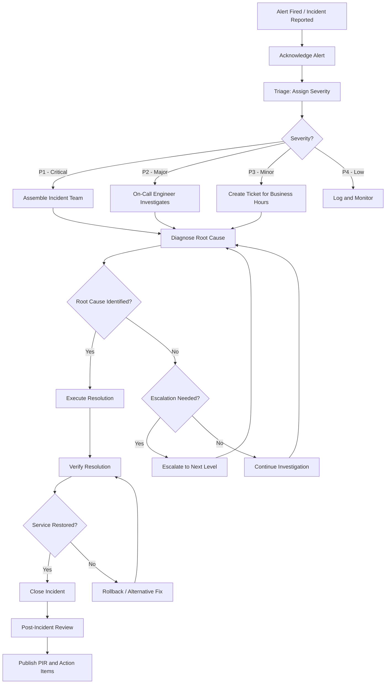
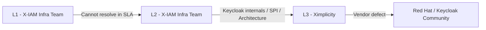
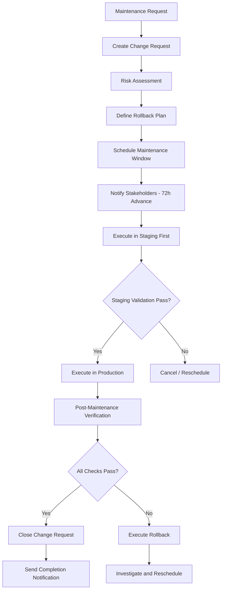

# 16 - Operations Runbook

> **Project:** Enterprise IAM Platform based on Keycloak
> **Related documents:** [13 - Automation and Scripts](./13-automation-scripts.md) | [10 - Observability](./10-observability.md) | [17 - Disaster Recovery](./17-disaster-recovery.md) | [07 - Security by Design](./07-security-by-design.md)

---

## Table of Contents

1. [Runbook Overview](#1-runbook-overview)
2. [Health Check Procedures](#2-health-check-procedures)
3. [Common Incidents and Resolution](#3-common-incidents-and-resolution)
4. [Incident Response Procedure](#4-incident-response-procedure)
5. [Escalation Matrix](#5-escalation-matrix)
6. [Day-2 Operations](#6-day-2-operations)
7. [Keycloak Administration Procedures](#7-keycloak-administration-procedures)
8. [Troubleshooting Guide](#8-troubleshooting-guide)
9. [Maintenance Windows](#9-maintenance-windows)
10. [Post-Incident Review Template](#10-post-incident-review-template)
11. [Related Documents](#11-related-documents)

---

## 1. Runbook Overview

### Purpose

This runbook serves as the authoritative reference for operating and maintaining the Enterprise IAM Platform based on Keycloak 26.4.2. It provides structured procedures for health verification, incident response, routine maintenance, and troubleshooting across the production environment running on Google Kubernetes Engine (GKE) with Oracle Database backend.

The platform serves approximately 400 users across 2 federated Business-to-Business (B2B) organizations, with multi-region deployment spanning Belgium and Madrid.

### Audience

This document is intended for the three-tier support model defined in the service agreement:

| Support Level | Team | Responsibilities |
|---|---|---|
| **L1 - First Line** | X-IAM Client Infrastructure Team | Alert acknowledgement, initial triage, health check execution, basic user operations, escalation to L2 |
| **L2 - Second Line** | X-IAM Client Infrastructure Team | Advanced diagnostics, configuration changes, performance analysis, database operations, escalation to L3 |
| **L3 - Third Line** | Ximplicity Software Solutions S.L. | Custom SPI development, Keycloak internals, architecture decisions, complex federation issues, production hotfixes |

### Service Level Agreement (SLA) Targets

| Metric | Target | Measurement |
|---|---|---|
| Authentication availability | 99.9% | Successful authentication requests / total requests (excluding 4xx client errors) |
| Login latency (p99) | < 2 seconds | Prometheus histogram on the token endpoint |
| Token issuance latency (p99) | < 500 milliseconds | Prometheus histogram on the token endpoint (POST) |
| Mean Time to Acknowledge (MTTA) - P1 | < 15 minutes | Time from alert firing to human acknowledgement |
| Mean Time to Resolve (MTTR) - P1 | < 1 hour | Time from alert firing to service restoration |
| Mean Time to Acknowledge (MTTA) - P2 | < 30 minutes | Time from alert firing to human acknowledgement |
| Mean Time to Resolve (MTTR) - P2 | < 4 hours | Time from alert firing to service restoration |
| Planned maintenance notification | 72 hours advance | Written notification to all stakeholders |

See [10 - Observability: SLI/SLO Definitions](./10-observability.md#6-slislo-definitions) for the complete set of Service Level Indicators (SLIs) and Service Level Objectives (SLOs).

---

## 2. Health Check Procedures

### 2.1 Keycloak Pod Health

Verify that all Keycloak pods are running and passing both liveness and readiness probes.

```bash
# Check pod status across all IAM namespaces
kubectl get pods -n iam-prod -l app=keycloak -o wide

# Verify readiness and liveness probe status
kubectl describe pods -n iam-prod -l app=keycloak | grep -A 5 "Conditions:"

# Query the Keycloak health endpoints directly
for POD in $(kubectl get pods -n iam-prod -l app=keycloak -o jsonpath='{.items[*].metadata.name}'); do
  echo "--- ${POD} ---"
  kubectl exec -n iam-prod "${POD}" -- curl -s http://localhost:9000/health/ready
  echo ""
  kubectl exec -n iam-prod "${POD}" -- curl -s http://localhost:9000/health/live
  echo ""
done

# Check Keycloak startup completion in logs
kubectl logs -n iam-prod -l app=keycloak --tail=20 | grep -i "started in"
```

**Expected result:** All pods in `Running` state with `1/1` containers ready. Health endpoints return `{"status":"UP"}`.

### 2.2 Database Connectivity

Verify Oracle Database connectivity and connection pool health from the Keycloak pods.

```bash
# Check active and idle connections via Prometheus
curl -s "http://prometheus:9090/api/v1/query?query=db_pool_active_connections" | jq '.data.result'
curl -s "http://prometheus:9090/api/v1/query?query=db_pool_idle_connections" | jq '.data.result'

# Check connection pool utilization ratio
curl -s "http://prometheus:9090/api/v1/query?query=keycloak:db_pool_utilization" | jq '.data.result[].value[1]'

# Verify database connectivity from a Keycloak pod
kubectl exec -n iam-prod keycloak-0 -- curl -s http://localhost:9000/health/ready | jq '.checks[] | select(.name=="Database connections health check")'

# Run the database health check script
./scripts/database/health-check.sh --env prod --verbose
```

**Expected result:** Pool utilization below 75%. Database health check returns `UP`. No connection timeout errors in the logs.

### 2.3 Infinispan Cluster Status

Verify that the embedded Infinispan cluster is formed correctly across all Keycloak pods.

```bash
# Check Infinispan cluster membership count
kubectl logs -n iam-prod -l app=keycloak | grep -i "cluster" | grep -i "members"

# Query Infinispan cache metrics via Prometheus
curl -s "http://prometheus:9090/api/v1/query?query=vendor_cache_manager_status" | jq '.data.result'

# Check cache hit rates
curl -s "http://prometheus:9090/api/v1/query?query=vendor_cache_hits_total/(vendor_cache_hits_total+vendor_cache_misses_total)" \
  | jq '.data.result'

# Check for split-brain indicators
kubectl logs -n iam-prod -l app=keycloak --since=1h | grep -i "split\|partition\|merge\|ISPN"
```

**Expected result:** All Keycloak pods visible as cluster members. Cache hit rate above 90%. No split-brain or partition messages in logs.

### 2.4 Certificate Expiry

Monitor TLS certificate expiry for all IAM-related endpoints.

```bash
# Check certificate expiry using the automation script
./scripts/operations/rotate-certificates.sh --check --days 30

# Manual check for the primary IAM endpoint
echo | openssl s_client -connect iam.prod.example.com:443 -servername iam.prod.example.com 2>/dev/null \
  | openssl x509 -noout -dates -subject

# Check Kubernetes TLS secrets for expiry
for SECRET in $(kubectl get secrets -n iam-prod --field-selector type=kubernetes.io/tls -o jsonpath='{.items[*].metadata.name}'); do
  echo "--- ${SECRET} ---"
  kubectl get secret "${SECRET}" -n iam-prod -o jsonpath='{.data.tls\.crt}' | base64 -d \
    | openssl x509 -noout -enddate
done

# Query Prometheus for certificate expiry metrics
curl -s "http://prometheus:9090/api/v1/query?query=(x509_cert_not_after-time())/86400" \
  | jq '.data.result[] | {subject: .metric.subject, days_remaining: .value[1]}'
```

**Expected result:** All certificates have more than 30 days until expiry. `CertificateExpiringSoon` alert is not firing.

### 2.5 Realm Availability

Verify that all configured realms are accessible and responding correctly.

```bash
# Check OIDC discovery endpoint for each realm
KEYCLOAK_URL="https://iam.prod.example.com"
for REALM in master xiam-b2b-org1 xiam-b2b-org2; do
  HTTP_CODE=$(curl -s -o /dev/null -w "%{http_code}" \
    "${KEYCLOAK_URL}/realms/${REALM}/.well-known/openid-configuration")
  echo "Realm: ${REALM} - OIDC Discovery: HTTP ${HTTP_CODE}"
done

# Verify token issuance is functional (using a test client)
curl -s -X POST "${KEYCLOAK_URL}/realms/master/protocol/openid-connect/token" \
  -d "grant_type=client_credentials" \
  -d "client_id=health-check-client" \
  -d "client_secret=${HEALTH_CHECK_CLIENT_SECRET}" \
  | jq '{access_token: .access_token[:20], expires_in: .expires_in, token_type: .token_type}'

# Run the comprehensive health check suite
./scripts/operations/health-check-all.sh --env prod --verbose
```

**Expected result:** All realms return HTTP 200 for the OIDC discovery endpoint. Token issuance succeeds with a valid access token.

---

## 3. Common Incidents and Resolution

The following table catalogs the most frequent incidents observed in the IAM platform, along with their severity, symptoms, likely root causes, and resolution steps.

### Incident Catalog

| ID | Incident | Severity | Symptoms | Root Cause | Resolution |
|---|---|---|---|---|---|
| INC-01 | Keycloak Pod CrashLoopBackOff | P1/P2 | Pods restarting repeatedly; `CrashLoopBackOff` status; users unable to authenticate | Out-of-memory (OOM) kill, database unreachable on startup, corrupted configuration, incompatible SPI deployment | See [INC-01 Resolution](#inc-01-keycloak-pod-crashloopbackoff) |
| INC-02 | Database Connection Pool Exhaustion | P1 | Authentication timeouts; `ConnectionPoolExhausted` in logs; `db_pool_utilization > 0.9` | Long-running queries, connection leaks, insufficient pool size, database overload | See [INC-02 Resolution](#inc-02-database-connection-pool-exhaustion) |
| INC-03 | Infinispan Split-Brain | P1 | Inconsistent session state; users logged out unexpectedly; duplicate sessions; cache merge warnings | Network partition between GKE nodes, JGroups misconfiguration, pod scheduling across failure domains | See [INC-03 Resolution](#inc-03-infinispan-split-brain) |
| INC-04 | Certificate Expiry Causing TLS Errors | P2 | `SSL_ERROR_EXPIRED_CERT_ALERT` in browser; `x509: certificate has expired` in logs; HTTPS connections refused | Certificate not renewed before expiry; cert-manager failure; DNS validation failure | See [INC-04 Resolution](#inc-04-certificate-expiry-causing-tls-errors) |
| INC-05 | Federation IdP Unavailable | P2 | Federated users unable to log in; SAML/OIDC broker errors; `IdentityProviderException` in logs | B2B partner IdP downtime, network connectivity issues, partner certificate change | See [INC-05 Resolution](#inc-05-federation-idp-unavailable) |
| INC-06 | Token Signing Key Rotation Failure | P2 | Token validation failures across clients; `InvalidSignatureException`; JWT `kid` mismatch | Key rotation interrupted, JWKS endpoint caching stale keys, Infinispan key sync failure | See [INC-06 Resolution](#inc-06-token-signing-key-rotation-failure) |
| INC-07 | High Authentication Latency | P3 | Login times exceeding 2 seconds; `HighTokenIssuanceLatency` alert firing; user complaints | Database slow queries, GC pressure, Infinispan cache misses, external IdP latency | See [INC-07 Resolution](#inc-07-high-authentication-latency) |
| INC-08 | User Lockout Due to Brute-Force Protection | P4 | Specific user unable to log in; `USER_DISABLED_BY_BRUTE_FORCE` event; `BruteForceDetected` alert | Legitimate user forgot password, automated system using stale credentials, targeted attack | See [INC-08 Resolution](#inc-08-user-lockout-due-to-brute-force-protection) |

### INC-01: Keycloak Pod CrashLoopBackOff

```bash
# Step 1: Identify the failing pod and check events
kubectl get pods -n iam-prod -l app=keycloak
kubectl describe pod <POD_NAME> -n iam-prod | tail -30

# Step 2: Check container exit code and OOM status
kubectl get pod <POD_NAME> -n iam-prod -o jsonpath='{.status.containerStatuses[0].lastState.terminated}'

# Step 3: Examine logs from the previous failed container
kubectl logs <POD_NAME> -n iam-prod --previous --tail=100

# Step 4a: If OOM killed (exit code 137) - increase memory limits
kubectl edit statefulset keycloak -n iam-prod
# Increase resources.limits.memory (e.g., from 1Gi to 2Gi)

# Step 4b: If database connection failure - verify database
./scripts/database/health-check.sh --env prod --verbose

# Step 4c: If SPI or configuration error - rollback the last deployment
helm rollback keycloak -n iam-prod

# Step 5: Verify recovery
kubectl rollout status statefulset/keycloak -n iam-prod --timeout=300s
```

### INC-02: Database Connection Pool Exhaustion

```bash
# Step 1: Confirm pool exhaustion
curl -s "http://prometheus:9090/api/v1/query?query=keycloak:db_pool_utilization" | jq '.data.result'

# Step 2: Identify long-running queries (Oracle-specific)
# Connect to Oracle DB and run:
# SELECT sid, serial#, sql_id, elapsed_time/1000000 elapsed_secs, status
# FROM v$session WHERE username = 'KEYCLOAK' ORDER BY elapsed_time DESC;

# Step 3: Check for connection leaks in Keycloak logs
kubectl logs -n iam-prod -l app=keycloak --since=30m | grep -i "connection\|pool\|timeout\|leak"

# Step 4: Temporary mitigation - restart pods in rolling fashion
kubectl rollout restart statefulset/keycloak -n iam-prod

# Step 5: Permanent fix - adjust pool sizing in Keycloak configuration
# Update KC_DB_POOL_MIN_SIZE, KC_DB_POOL_MAX_SIZE, KC_DB_POOL_INITIAL_SIZE
# in the Keycloak ConfigMap or Helm values
```

### INC-03: Infinispan Split-Brain

```bash
# Step 1: Detect split-brain condition
kubectl logs -n iam-prod -l app=keycloak --since=1h | grep -i "ISPN\|split\|merge\|partition\|view"

# Step 2: Check JGroups cluster view from each pod
for POD in $(kubectl get pods -n iam-prod -l app=keycloak -o jsonpath='{.items[*].metadata.name}'); do
  echo "--- ${POD} ---"
  kubectl logs -n iam-prod "${POD}" | grep "Received new cluster view" | tail -1
done

# Step 3: Verify network connectivity between pods
for POD in $(kubectl get pods -n iam-prod -l app=keycloak -o jsonpath='{.items[*].metadata.name}'); do
  POD_IP=$(kubectl get pod "${POD}" -n iam-prod -o jsonpath='{.status.podIP}')
  echo "--- ${POD} (${POD_IP}) ---"
  kubectl exec -n iam-prod "${POD}" -- ping -c 2 -W 2 "${POD_IP}" 2>/dev/null || echo "UNREACHABLE"
done

# Step 4: Force cluster reform by rolling restart
kubectl rollout restart statefulset/keycloak -n iam-prod
kubectl rollout status statefulset/keycloak -n iam-prod --timeout=600s

# Step 5: Verify cluster formation
kubectl logs -n iam-prod -l app=keycloak --tail=20 | grep "Received new cluster view"
```

### INC-04: Certificate Expiry Causing TLS Errors

```bash
# Step 1: Identify expired certificate
echo | openssl s_client -connect iam.prod.example.com:443 2>/dev/null | openssl x509 -noout -dates

# Step 2: Check cert-manager status (if applicable)
kubectl get certificate -n iam-prod
kubectl describe certificate iam-tls -n iam-prod

# Step 3: Manually renew if cert-manager failed
# Follow Workbook 4 in 13-automation-scripts.md
./scripts/operations/rotate-certificates.sh --env prod --force-renew

# Step 4: Update the Kubernetes TLS secret
kubectl create secret tls iam-tls \
  --cert=iam.prod.example.com.crt \
  --key=iam.prod.example.com.key \
  -n iam-prod \
  --dry-run=client -o yaml | kubectl apply -f -

# Step 5: Restart the ingress controller to load new certificate
kubectl rollout restart deployment ingress-nginx-controller -n ingress-nginx

# Step 6: Verify new certificate is served
echo | openssl s_client -connect iam.prod.example.com:443 2>/dev/null | openssl x509 -noout -dates -subject
```

### INC-05: Federation IdP Unavailable

```bash
# Step 1: Check federation broker logs
kubectl logs -n iam-prod -l app=keycloak --since=30m | grep -i "broker\|federation\|idp\|saml\|identity.provider"

# Step 2: Verify connectivity to the federated IdP
PARTNER_IDP_URL="https://idp.partner.example.com"
curl -s -o /dev/null -w "HTTP %{http_code} - %{time_total}s\n" "${PARTNER_IDP_URL}/metadata"

# Step 3: Check if the partner's SAML metadata or certificates changed
kubectl exec -n iam-prod keycloak-0 -- \
  curl -s "${PARTNER_IDP_URL}/.well-known/openid-configuration" | jq '.jwks_uri'

# Step 4: If partner is down - communicate with B2B partner contact
# Step 5: If certificate changed - update IdP configuration in Keycloak
kcadm.sh update identity-provider/instances/<IDP_ALIAS> -r xiam-b2b-org1 \
  -s 'config.signingCertificate=<NEW_CERT_PEM>'

# Step 6: Verify federation login flow after partner recovery
```

### INC-06: Token Signing Key Rotation Failure

```bash
# Step 1: Check current realm keys
kcadm.sh get keys -r xiam-b2b-org1 | jq '.keys[] | {kid, algorithm, status, type}'

# Step 2: Verify JWKS endpoint returns current keys
curl -s "https://iam.prod.example.com/realms/xiam-b2b-org1/protocol/openid-connect/certs" | jq '.keys[].kid'

# Step 3: Check for key propagation issues across the Infinispan cluster
kubectl logs -n iam-prod -l app=keycloak --since=1h | grep -i "key\|sign\|jwk\|kid"

# Step 4: If stale keys are cached by clients - advise clients to clear JWKS cache
# Most OIDC libraries cache JWKS; trigger a refresh by restarting client applications

# Step 5: If key rotation is stuck - manually trigger rotation
kcadm.sh create components -r xiam-b2b-org1 \
  -s name=rsa-generated \
  -s providerId=rsa-generated \
  -s providerType=org.keycloak.keys.KeyProvider \
  -s 'config.priority=["200"]' \
  -s 'config.keySize=["2048"]'

# Step 6: Verify new key is active
kcadm.sh get keys -r xiam-b2b-org1 | jq '.keys[] | select(.status=="ACTIVE")'
```

### INC-07: High Authentication Latency

```bash
# Step 1: Check current latency metrics
curl -s "http://prometheus:9090/api/v1/query?query=keycloak:auth_latency_p99_5m" | jq '.data.result'

# Step 2: Check database query performance
curl -s "http://prometheus:9090/api/v1/query?query=keycloak:db_pool_utilization" | jq '.data.result'

# Step 3: Check JVM garbage collection pressure
curl -s "http://prometheus:9090/api/v1/query?query=rate(jvm_gc_pause_seconds_sum[5m])" | jq '.data.result'

# Step 4: Check Infinispan cache hit rates
curl -s "http://prometheus:9090/api/v1/query?query=vendor_cache_hits_total/(vendor_cache_hits_total+vendor_cache_misses_total)" \
  | jq '.data.result'

# Step 5: Check external IdP latency (for federated logins)
curl -s -o /dev/null -w "Time: %{time_total}s\n" \
  "https://idp.partner.example.com/.well-known/openid-configuration"

# Step 6: Scale horizontally if load-related
kubectl scale statefulset keycloak -n iam-prod --replicas=4
```

### INC-08: User Lockout Due to Brute-Force Protection

```bash
# Step 1: Identify the locked user
kcadm.sh get users -r xiam-b2b-org1 -q "username=<USERNAME>" | jq '.[0] | {id, username, enabled}'

# Step 2: Check brute-force status
USER_ID=$(kcadm.sh get users -r xiam-b2b-org1 -q "username=<USERNAME>" | jq -r '.[0].id')
kcadm.sh get "attack-detection/brute-force/users/${USER_ID}" -r xiam-b2b-org1

# Step 3: Clear brute-force status and re-enable the user
kcadm.sh delete "attack-detection/brute-force/users/${USER_ID}" -r xiam-b2b-org1

# Step 4: Verify the user can log in
kcadm.sh get users -r xiam-b2b-org1 -q "username=<USERNAME>" | jq '.[0].enabled'

# Step 5: If attack-related, investigate source IPs
kubectl logs -n iam-prod -l app=keycloak --since=1h | grep -i "LOGIN_ERROR" | grep "<USERNAME>"
```

---

## 4. Incident Response Procedure

### 4.1 Incident Response Flowchart



### 4.2 Severity Levels and Response Times

| Priority | Name | Definition | MTTA | MTTR | Communication Frequency | Escalation Trigger |
|---|---|---|---|---|---|---|
| **P1** | Critical | Complete authentication outage. No users can log in. All realms affected. | 15 min | 1 hour | Every 15 min during incident | Immediate to L3 if not resolved in 30 min |
| **P2** | Major | Partial degradation. One realm or federation affected. Elevated error rates above 10%. | 30 min | 4 hours | Every 30 min during incident | Escalate to L3 if not resolved in 2 hours |
| **P3** | Minor | Performance degradation. Latency above SLO but service functional. Non-critical features affected. | 2 hours | 24 hours | Daily status update | Escalate to L2 if not resolved in 8 hours |
| **P4** | Low | Cosmetic issues, minor anomalies, single user impact. No service degradation. | Next business day | 5 business days | Resolution update only | Normal ticket workflow |

### 4.3 Communication Templates

**Initial Incident Notification (P1/P2):**

```
SUBJECT: [P1/P2] IAM Platform Incident - <Brief Description>

STATUS: Investigating
IMPACT: <Description of user/service impact>
STARTED: <Timestamp UTC>
AFFECTED: <Realms, clients, user groups affected>
NEXT UPDATE: <Timestamp of next scheduled update>

INCIDENT COMMANDER: <Name>
CURRENT ACTIONS: <What is being done right now>
```

**Status Update:**

```
SUBJECT: [UPDATE] IAM Platform Incident - <Brief Description>

STATUS: <Investigating / Identified / Mitigated / Resolved>
CURRENT STATE: <What has changed since last update>
ROOT CAUSE: <If identified, otherwise "Under investigation">
ETA FOR RESOLUTION: <Estimated time>
NEXT UPDATE: <Timestamp of next scheduled update>
```

**Resolution Notification:**

```
SUBJECT: [RESOLVED] IAM Platform Incident - <Brief Description>

STATUS: Resolved
DURATION: <Total incident duration>
ROOT CAUSE: <Brief root cause summary>
RESOLUTION: <What was done to fix the issue>
USER ACTION REQUIRED: <Any actions users need to take, or "None">
POST-INCIDENT REVIEW: Scheduled for <Date/Time>
```

---

## 5. Escalation Matrix

### 5.1 Escalation Levels



### 5.2 Responsibilities by Level

| Capability | L1 (X-IAM) | L2 (X-IAM) | L3 (Ximplicity) |
|---|---|---|---|
| Alert acknowledgement and initial triage | Yes | - | - |
| Execute health check procedures | Yes | Yes | Yes |
| User unlock and password reset | Yes | Yes | - |
| Pod restart and scaling | Yes | Yes | - |
| Log analysis and correlation | - | Yes | Yes |
| Database query analysis and tuning | - | Yes | Yes |
| Realm configuration changes | - | Yes | Yes |
| Client registration and modification | - | Yes | Yes |
| Certificate rotation | - | Yes | Yes |
| Infinispan cluster troubleshooting | - | - | Yes |
| Custom SPI development and debugging | - | - | Yes |
| Authentication flow customization | - | - | Yes |
| Federation/broker configuration | - | - | Yes |
| Keycloak version upgrade execution | - | - | Yes |
| Architecture and capacity decisions | - | - | Yes |
| Production hotfix deployment | - | - | Yes |

### 5.3 Escalation Triggers

| Trigger Condition | Escalate From | Escalate To |
|---|---|---|
| P1 incident not acknowledged within 15 minutes | Automatic | L1 on-call |
| P1 incident not resolved within 30 minutes | L1 | L2 |
| P1 incident not resolved within 1 hour | L2 | L3 (Ximplicity) |
| P2 incident not resolved within 2 hours | L1/L2 | L3 (Ximplicity) |
| CrashLoopBackOff persists after pod restart | L1 | L2 |
| Database performance issue requiring query optimization | L2 | L3 (Ximplicity) |
| Infinispan split-brain not resolved after rolling restart | L2 | L3 (Ximplicity) |
| Custom SPI error or authentication flow issue | L1/L2 | L3 (Ximplicity) |
| Federation broker failure requiring IdP reconfiguration | L2 | L3 (Ximplicity) |
| Security incident (credential compromise, unauthorized access) | L1 | L2 + L3 simultaneously |

### 5.4 Contact Information Template

| Role | Name | Email | Phone | Hours |
|---|---|---|---|---|
| L1 On-Call (X-IAM) | `<TBD>` | `<oncall-l1@xiam.example.com>` | `<TBD>` | 24/7 |
| L2 Lead (X-IAM) | `<TBD>` | `<oncall-l2@xiam.example.com>` | `<TBD>` | Business hours + on-call |
| L3 Lead (Ximplicity) | Jorge Rodriguez | `<jorge@ximplicity.com>` | `<TBD>` | Business hours (CET) |
| Incident Manager (X-IAM) | `<TBD>` | `<incident-mgr@xiam.example.com>` | `<TBD>` | On-call rotation |
| B2B Partner 1 Contact | Inaki Lardero | `<TBD>` | `<TBD>` | Business hours |

---

## 6. Day-2 Operations

### 6.1 Routine Maintenance Schedule

| Task | Frequency | Owner | Automation | Procedure |
|---|---|---|---|---|
| Database backup verification | Daily | L1 | CronJob `iam-db-backup` | Verify backup CronJob success; check backup file integrity |
| Certificate expiry check | Weekly (Monday) | L1 | CronJob `iam-cert-check` | Review weekly Slack notification; escalate if < 30 days |
| Log rotation and retention | Daily | L1 | Kubernetes + Loki retention | Verify Loki retention policies; check disk usage |
| Inactive user cleanup | Monthly (1st) | L2 | CronJob `iam-inactive-user-cleanup` | Review disabled accounts; communicate to realm admins |
| Keycloak session cleanup | Automatic | - | Keycloak internal | Verify `ssoSessionMaxLifespan` and `ssoSessionIdleTimeout` |
| Infinispan cache statistics review | Weekly | L2 | Manual | Check cache hit rates, eviction counts, rebalancing events |
| Prometheus storage review | Monthly | L2 | Manual | Verify retention period; check TSDB disk usage |
| Grafana dashboard review | Monthly | L2 | Manual | Verify dashboards load correctly; update queries if needed |
| Security patch review | Weekly | L2/L3 | Manual | Check Keycloak release notes for security advisories |
| Database maintenance (Oracle) | Monthly | L2 | Scheduled | Statistics gathering, index rebuild, tablespace review |

### 6.2 Log Rotation

Keycloak logs are written to stdout/stderr and collected by Fluent Bit as described in [10 - Observability: Log Management](./10-observability.md#5-log-management). Retention policies are configured at the Loki level.

```bash
# Check current Loki retention configuration
kubectl get configmap loki-config -n iam-observability -o yaml | grep retention

# Verify Fluent Bit is running on all nodes
kubectl get pods -n iam-observability -l app=fluent-bit -o wide

# Check Fluent Bit log processing metrics
kubectl logs -n iam-observability -l app=fluent-bit --tail=10 | grep -i "output\|flush"
```

### 6.3 Cache Clearing

Clear Infinispan caches in scenarios where stale data causes issues (for example, after a realm configuration change that does not propagate).

```bash
# Clear all user caches for a realm (forces re-read from database)
kcadm.sh create clear-user-cache -r xiam-b2b-org1

# Clear all realm caches (forces re-read of realm configuration)
kcadm.sh create clear-realm-cache -r xiam-b2b-org1

# Clear all keys caches (forces re-read of signing keys)
kcadm.sh create clear-keys-cache -r xiam-b2b-org1

# Verify cache metrics after clearing
curl -s "http://prometheus:9090/api/v1/query?query=vendor_cache_size" | jq '.data.result'
```

### 6.4 Database Maintenance (Oracle)

```bash
# Verify Oracle tablespace usage
# SQL: SELECT tablespace_name, ROUND(used_percent, 2) pct_used FROM dba_tablespace_usage_metrics;

# Gather optimizer statistics for Keycloak schema
# SQL: EXEC DBMS_STATS.GATHER_SCHEMA_STATS('KEYCLOAK', cascade => TRUE);

# Check for long-running sessions
# SQL: SELECT sid, serial#, username, status, last_call_et
#      FROM v$session WHERE username = 'KEYCLOAK' AND status = 'ACTIVE'
#      ORDER BY last_call_et DESC;

# Verify backup completion via the CronJob
kubectl get jobs -n iam-prod -l cronjob=iam-db-backup --sort-by='.status.startTime' | tail -5
```

### 6.5 Keycloak Version Updates

Follow Workbook 5 (Keycloak Upgrade) in [13 - Automation and Scripts](./13-automation-scripts.md#workbook-5-keycloak-upgrade) for the complete upgrade procedure. Key steps summary:

1. Review release notes for breaking changes and security fixes.
2. Test custom SPIs and themes against the new version in staging.
3. Execute a full backup (database + realm exports + Helm values).
4. Perform rolling upgrade via Helm in production.
5. Verify with the full health check suite.
6. Rollback if critical issues are detected.

---

## 7. Keycloak Administration Procedures

### 7.1 User Unlock

When a user is locked out due to brute-force protection or administrative action.

```bash
# Find the user
kcadm.sh get users -r xiam-b2b-org1 -q "username=<USERNAME>" --fields id,username,enabled

# Check brute-force status
USER_ID="<USER_UUID>"
kcadm.sh get "attack-detection/brute-force/users/${USER_ID}" -r xiam-b2b-org1

# Clear brute-force lockout
kcadm.sh delete "attack-detection/brute-force/users/${USER_ID}" -r xiam-b2b-org1

# Re-enable the user if administratively disabled
kcadm.sh update "users/${USER_ID}" -r xiam-b2b-org1 -s enabled=true

# Optionally force a password reset on next login
kcadm.sh update "users/${USER_ID}" -r xiam-b2b-org1 \
  -s 'requiredActions=["UPDATE_PASSWORD"]'

# Verify the user state
kcadm.sh get "users/${USER_ID}" -r xiam-b2b-org1 --fields username,enabled,requiredActions
```

### 7.2 Realm Export and Import

```bash
# Export a realm (full configuration, without users)
kcadm.sh get "realms/xiam-b2b-org1" > realm-export-xiam-b2b-org1.json

# Export a realm with users (using the Keycloak export endpoint)
kubectl exec -n iam-prod keycloak-0 -- \
  /opt/keycloak/bin/kc.sh export \
  --realm xiam-b2b-org1 \
  --dir /tmp/export \
  --users realm_file

# Copy the export from the pod
kubectl cp iam-prod/keycloak-0:/tmp/export ./realm-exports/

# Import a realm from JSON
kcadm.sh create realms -f realm-export-xiam-b2b-org1.json

# Import using the automation script
./scripts/keycloak/import-realm.sh \
  --env prod \
  --file realm-exports/xiam-b2b-org1-realm.json
```

### 7.3 Client Secret Rotation

```bash
# Identify the client internal UUID
CLIENT_UUID=$(kcadm.sh get clients -r xiam-b2b-org1 \
  -q "clientId=acme-api" | jq -r '.[0].id')

# Generate a new client secret (invalidates the old one immediately)
kcadm.sh create "clients/${CLIENT_UUID}/client-secret" -r xiam-b2b-org1

# Retrieve and display the new secret
kcadm.sh get "clients/${CLIENT_UUID}/client-secret" -r xiam-b2b-org1 | jq '.value'

# IMPORTANT: Update the client application configuration with the new secret
# and restart the client application before the old secret's tokens expire.

# Update the Kubernetes Secret used by the client application
kubectl create secret generic acme-api-credentials \
  --from-literal=client-secret="<NEW_SECRET>" \
  -n app-namespace \
  --dry-run=client -o yaml | kubectl apply -f -

# Restart the client application to pick up the new secret
kubectl rollout restart deployment acme-api -n app-namespace
```

### 7.4 Theme Deployment

```bash
# Build the custom theme JAR (from the keycloak/themes directory)
cd /path/to/repo/keycloak/themes
mvn clean package -pl xiam-theme

# Copy the theme JAR to the Keycloak providers directory
# Option A: Include in the Keycloak Docker image (preferred for production)
# Option B: Mount via PersistentVolume or ConfigMap

# Apply the theme to a realm
kcadm.sh update "realms/xiam-b2b-org1" \
  -s "loginTheme=xiam-theme" \
  -s "accountTheme=xiam-theme" \
  -s "emailTheme=xiam-theme"

# Verify the theme is applied
curl -s "https://iam.prod.example.com/realms/xiam-b2b-org1/account" -o /dev/null -w "%{http_code}"
```

### 7.5 Custom SPI Deployment

```bash
# Build the SPI JAR
cd /path/to/repo/keycloak/spi
mvn clean package -pl custom-event-listener

# Deploy via rolling update of the Keycloak StatefulSet
# The SPI JAR must be included in the Docker image or mounted as a volume

# Verify SPI is loaded after deployment
kubectl logs -n iam-prod keycloak-0 | grep -i "provider\|spi" | grep "<SPI_NAME>"

# Check available providers via server info
curl -s "https://iam.prod.example.com/admin/realms/master" \
  -H "Authorization: Bearer ${ACCESS_TOKEN}" | jq '.componentTypes'
```

---

## 8. Troubleshooting Guide

### 8.1 Login Failures

**Symptoms:** User receives "Invalid username or password" or a generic login error page.

```bash
# Step 1: Check Keycloak login events for the affected user
kcadm.sh get events -r xiam-b2b-org1 \
  --offset 0 --limit 20 \
  -q "type=LOGIN_ERROR" \
  -q "user=<USERNAME>"

# Step 2: Check if the user account is enabled
kcadm.sh get users -r xiam-b2b-org1 -q "username=<USERNAME>" \
  --fields id,username,enabled,emailVerified,requiredActions

# Step 3: Check for brute-force lockout
USER_ID=$(kcadm.sh get users -r xiam-b2b-org1 -q "username=<USERNAME>" | jq -r '.[0].id')
kcadm.sh get "attack-detection/brute-force/users/${USER_ID}" -r xiam-b2b-org1

# Step 4: Check if the client configuration is correct
kcadm.sh get clients -r xiam-b2b-org1 -q "clientId=<CLIENT_ID>" \
  --fields clientId,enabled,redirectUris,webOrigins

# Step 5: Check Keycloak logs for authentication flow errors
kubectl logs -n iam-prod -l app=keycloak --since=15m | grep -i "authentication\|login\|error" | grep "<USERNAME>"
```

**Common causes and fixes:**

| Cause | Fix |
|---|---|
| User account disabled | Re-enable: `kcadm.sh update users/<ID> -r <REALM> -s enabled=true` |
| Brute-force lockout | Clear lockout: `kcadm.sh delete attack-detection/brute-force/users/<ID> -r <REALM>` |
| Email not verified | Mark as verified: `kcadm.sh update users/<ID> -r <REALM> -s emailVerified=true` |
| Required action pending | Check and clear: `kcadm.sh update users/<ID> -r <REALM> -s 'requiredActions=[]'` |
| Wrong client ID or secret | Verify client configuration in Admin Console |

### 8.2 SAML Assertion Errors

**Symptoms:** Federated login fails with "Invalid SAML response" or "Assertion validation failed" in the broker logs.

```bash
# Step 1: Enable DEBUG logging for SAML broker (temporarily)
kubectl exec -n iam-prod keycloak-0 -- \
  /opt/keycloak/bin/kc.sh update-config --log-level=org.keycloak.broker.saml:DEBUG

# Alternative: Set via environment variable and restart
# KC_LOG_LEVEL=INFO,org.keycloak.broker.saml:DEBUG,org.keycloak.saml:DEBUG

# Step 2: Reproduce the login and capture detailed logs
kubectl logs -n iam-prod keycloak-0 --since=5m | grep -i "saml\|assertion\|signature\|certificate"

# Step 3: Common SAML issues checklist
# a) Clock skew - verify time synchronization between Keycloak and partner IdP
kubectl exec -n iam-prod keycloak-0 -- date -u
# Compare with the partner IdP time

# b) Certificate mismatch - compare the IdP signing certificate
kcadm.sh get "identity-provider/instances/<IDP_ALIAS>" -r xiam-b2b-org1 \
  | jq '.config.signingCertificate'
# Compare with the certificate in the partner's SAML metadata

# c) Audience restriction - verify the expected audience/entity ID
kcadm.sh get "identity-provider/instances/<IDP_ALIAS>" -r xiam-b2b-org1 \
  | jq '.config.entityId'

# Step 4: Reset logging to INFO after troubleshooting
```

### 8.3 JWT Validation Failures

**Symptoms:** Client applications reject tokens with "Invalid signature", "Token expired", or "Unknown kid" errors.

```bash
# Step 1: Decode the problematic JWT (header only)
echo "<JWT_TOKEN>" | cut -d. -f1 | base64 -d 2>/dev/null | jq .

# Step 2: Compare the kid in the JWT with the keys published by Keycloak
curl -s "https://iam.prod.example.com/realms/xiam-b2b-org1/protocol/openid-connect/certs" \
  | jq '.keys[].kid'

# Step 3: Check token expiry
echo "<JWT_TOKEN>" | cut -d. -f2 | base64 -d 2>/dev/null \
  | jq '{exp: .exp, iat: .iat, exp_human: (.exp | todate), iat_human: (.iat | todate)}'

# Step 4: Verify the issuer claim matches the expected value
echo "<JWT_TOKEN>" | cut -d. -f2 | base64 -d 2>/dev/null | jq '.iss'
# Expected: https://iam.prod.example.com/realms/xiam-b2b-org1

# Step 5: If kid mismatch - force JWKS cache refresh on the client side
# Most libraries cache JWKS for 24h; restart the client application

# Step 6: Check for recent key rotation
kcadm.sh get keys -r xiam-b2b-org1 | jq '.keys[] | {kid, algorithm, status, priority}'
```

### 8.4 CORS Issues

**Symptoms:** Browser console shows "Access to XMLHttpRequest has been blocked by CORS policy". Token requests or API calls fail from Single-Page Applications (SPAs).

```bash
# Step 1: Verify the client's Web Origins configuration
kcadm.sh get clients -r xiam-b2b-org1 -q "clientId=<CLIENT_ID>" \
  --fields clientId,webOrigins,redirectUris

# Step 2: The Web Origins must match the origin of the frontend application
# Example: If the frontend is at https://app.example.com, then webOrigins must include "https://app.example.com"

# Step 3: Check if the "+" wildcard is being used (derives origins from redirect URIs)
# webOrigins: ["+"] means "use the origins derived from redirectUris"

# Step 4: Update Web Origins if missing
CLIENT_UUID=$(kcadm.sh get clients -r xiam-b2b-org1 -q "clientId=<CLIENT_ID>" | jq -r '.[0].id')
kcadm.sh update "clients/${CLIENT_UUID}" -r xiam-b2b-org1 \
  -s 'webOrigins=["https://app.example.com"]'

# Step 5: Also verify ingress CORS annotations are not conflicting
kubectl get ingress keycloak-ingress -n iam-prod -o yaml | grep -i cors
```

### 8.5 Redirect URI Mismatches

**Symptoms:** Login fails with "Invalid parameter: redirect_uri" after entering credentials. The browser shows an error page from Keycloak.

```bash
# Step 1: Check the error in Keycloak logs
kubectl logs -n iam-prod -l app=keycloak --since=5m | grep -i "redirect_uri\|invalid.*redirect"

# Step 2: List the configured redirect URIs for the client
kcadm.sh get clients -r xiam-b2b-org1 -q "clientId=<CLIENT_ID>" \
  --fields clientId,redirectUris

# Step 3: Compare with the redirect URI being sent by the application
# The redirect URI in the authorization request must EXACTLY match one of the configured URIs
# (or match a configured wildcard pattern)

# Step 4: Update redirect URIs if needed
CLIENT_UUID=$(kcadm.sh get clients -r xiam-b2b-org1 -q "clientId=<CLIENT_ID>" | jq -r '.[0].id')
kcadm.sh update "clients/${CLIENT_UUID}" -r xiam-b2b-org1 \
  -s 'redirectUris=["https://app.example.com/callback","https://app.example.com/silent-renew"]'

# Step 5: Common pitfalls
# - Trailing slash mismatch: /callback vs /callback/
# - HTTP vs HTTPS mismatch
# - Port number differences in development: localhost:3000 vs localhost:4200
# - Wildcard patterns require careful configuration: https://app.example.com/*
```

---

## 9. Maintenance Windows

### 9.1 Planned Maintenance Process



### 9.2 Maintenance Window Schedule

| Window Type | Schedule | Duration | Approval Required |
|---|---|---|---|
| Standard maintenance | Tuesday or Wednesday, 02:00-06:00 UTC | Up to 4 hours | Change Advisory Board (CAB) |
| Emergency maintenance | Any time (with justification) | As needed | Incident Manager + L3 Lead |
| Minor configuration change | Business hours | Up to 30 minutes | L2 Lead |

### 9.3 Change Management Checklist

| Step | Description | Owner | Status |
|---|---|---|---|
| 1 | Document the change (what, why, when, impact) | Requestor | |
| 2 | Identify affected realms, clients, and users | L2/L3 | |
| 3 | Define success criteria and verification steps | L2/L3 | |
| 4 | Write rollback procedure with estimated rollback time | L2/L3 | |
| 5 | Execute full backup before the change | L1/L2 | |
| 6 | Test the change in staging environment | L2/L3 | |
| 7 | Obtain CAB approval (for standard changes) | Change Manager | |
| 8 | Send 72-hour advance notification to stakeholders | L1 | |
| 9 | Execute the change during the maintenance window | L2/L3 | |
| 10 | Run post-change verification (health checks + smoke tests) | L1/L2 | |
| 11 | Send completion notification | L1 | |
| 12 | Monitor for 24 hours post-change | L1 | |

### 9.4 Rollback Procedures

**Keycloak configuration rollback:**

```bash
# Rollback Helm release to the previous revision
helm history keycloak -n iam-prod
helm rollback keycloak <REVISION_NUMBER> -n iam-prod
kubectl rollout status statefulset/keycloak -n iam-prod --timeout=600s
```

**Realm configuration rollback:**

```bash
# Re-import the realm from the pre-change backup
./scripts/keycloak/import-realm.sh \
  --env prod \
  --file backups/pre-maintenance/xiam-b2b-org1-realm.json \
  --overwrite
```

**Database rollback:**

```bash
# Restore database from the pre-change backup
./scripts/database/restore-db.sh \
  --env prod \
  --backup-file "iam-db-backup-pre-maintenance.sql.gz" \
  --confirm
```

### 9.5 Maintenance Communication Template

```
SUBJECT: [PLANNED MAINTENANCE] IAM Platform - <Description>

SCHEDULED WINDOW: <Date> <Start Time> - <End Time> UTC
EXPECTED DOWNTIME: <Duration, or "Zero downtime expected">
AFFECTED SERVICES: <List of affected realms, clients, or features>

DESCRIPTION:
<Detailed description of the maintenance activity>

USER IMPACT:
<What users will experience during the maintenance window>

ACTION REQUIRED:
<Any actions users or application teams need to take>

CONTACT: <Incident Manager contact for questions>
```

---

## 10. Post-Incident Review Template

### Post-Incident Review (PIR) Document

Use this template for all P1 and P2 incidents. P3 incidents require a PIR at the discretion of the L2 lead.

---

**Incident ID:** `INC-YYYY-NNNN`

**Incident Title:** `<Brief descriptive title>`

**Severity:** `P1 / P2 / P3`

**Date of Incident:** `YYYY-MM-DD`

**Date of PIR:** `YYYY-MM-DD`

**PIR Author:** `<Name>`

**PIR Attendees:** `<List of participants>`

---

#### 1. Executive Summary

A concise (2-3 sentence) summary of the incident, its impact, and resolution.

#### 2. Timeline

| Time (UTC) | Event | Actor |
|---|---|---|
| `HH:MM` | Alert fired: `<alert name>` | Alertmanager |
| `HH:MM` | Alert acknowledged by `<name>` | L1 |
| `HH:MM` | Initial triage completed; severity assigned as P`<N>` | L1 |
| `HH:MM` | Escalated to L`<N>` | L1/L2 |
| `HH:MM` | Root cause identified: `<brief description>` | L2/L3 |
| `HH:MM` | Fix applied: `<brief description>` | L2/L3 |
| `HH:MM` | Service restored and verified | L1/L2 |
| `HH:MM` | Incident closed | Incident Manager |

#### 3. Impact Assessment

| Metric | Value |
|---|---|
| Duration of impact | `<minutes/hours>` |
| Number of affected users | `<count>` |
| Number of affected realms | `<count>` |
| Failed authentication attempts during incident | `<count>` |
| SLA impact (error budget consumed) | `<minutes>` |
| Revenue or business impact | `<description>` |

#### 4. Root Cause Analysis

**Proximate Cause:** The immediate technical cause of the incident.

**Contributing Factors:** Conditions that allowed the proximate cause to result in an incident (for example, missing monitoring, inadequate capacity, configuration drift).

**Root Cause:** The underlying systemic issue that, if addressed, would prevent recurrence.

#### 5. Resolution

A detailed description of the steps taken to resolve the incident, including any commands executed, configurations changed, or workarounds applied.

#### 6. What Went Well

- `<List of things that worked during the incident response>`
- `<Example: Alerting detected the issue within 2 minutes>`
- `<Example: Runbook procedures were accurate and easy to follow>`

#### 7. What Could Be Improved

- `<List of areas for improvement>`
- `<Example: Escalation to L3 took 45 minutes instead of the target 30 minutes>`
- `<Example: The runbook did not cover this specific failure mode>`

#### 8. Action Items

| ID | Action | Owner | Priority | Due Date | Status |
|---|---|---|---|---|---|
| AI-01 | `<Description of action>` | `<Name>` | High/Medium/Low | `YYYY-MM-DD` | Open |
| AI-02 | `<Description of action>` | `<Name>` | High/Medium/Low | `YYYY-MM-DD` | Open |
| AI-03 | `<Description of action>` | `<Name>` | High/Medium/Low | `YYYY-MM-DD` | Open |

#### 9. Lessons Learned

A narrative summary of the key takeaways from this incident that should be shared with the broader team.

---

## 11. Related Documents

| Document | Description | Path |
|---|---|---|
| Target Architecture | Phase 1 architecture and component topology | [01 - Target Architecture](./01-target-architecture.md) |
| Infrastructure as Code | Terraform, Kubernetes, and Helm configuration | [05 - Infrastructure as Code](./05-infrastructure-as-code.md) |
| CI/CD Pipelines | Build, test, and deployment pipelines | [06 - CI/CD Pipelines](./06-cicd-pipelines.md) |
| Security by Design | Security practices, OPA policies, secrets management | [07 - Security by Design](./07-security-by-design.md) |
| Authentication and Authorization | SAML, JWT, OIDC, MFA, RBAC configuration | [08 - Authentication and Authorization](./08-authentication-authorization.md) |
| User Lifecycle Management | User provisioning, deprovisioning, credential lifecycle | [09 - User Lifecycle Management](./09-user-lifecycle.md) |
| Observability | OpenTelemetry, Prometheus, Grafana, alerting rules | [10 - Observability](./10-observability.md) |
| Keycloak Customization | Themes, SPIs, email templates | [11 - Keycloak Customization](./11-keycloak-customization.md) |
| Environment Management | Dev, QA, and Prod environment configuration | [12 - Environment Management](./12-environment-management.md) |
| Automation and Scripts | Workbooks, kcadm reference, CronJobs | [13 - Automation and Scripts](./13-automation-scripts.md) |
| Disaster Recovery | Backup strategies, RPO/RTO, failover procedures | [17 - Disaster Recovery](./17-disaster-recovery.md) |

---

> **Next:** [17 - Disaster Recovery](./17-disaster-recovery.md) | **Previous:** [14 - Client Applications](./14-client-applications.md)
