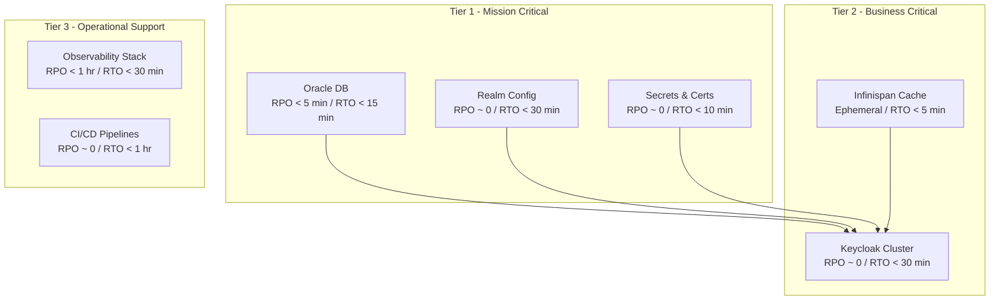
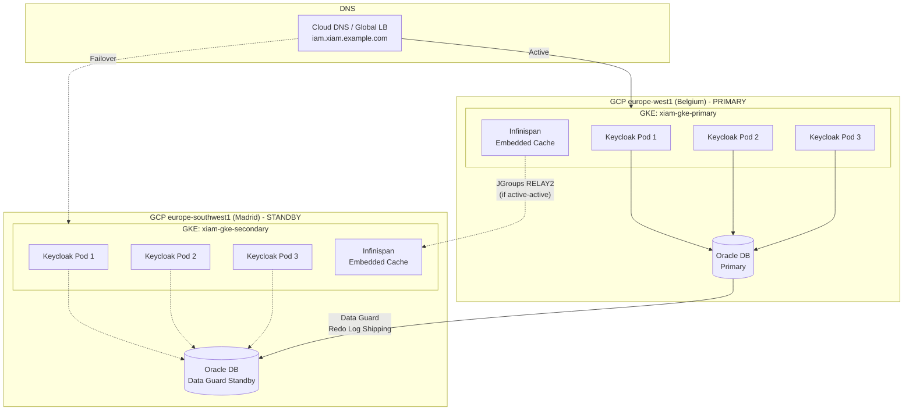
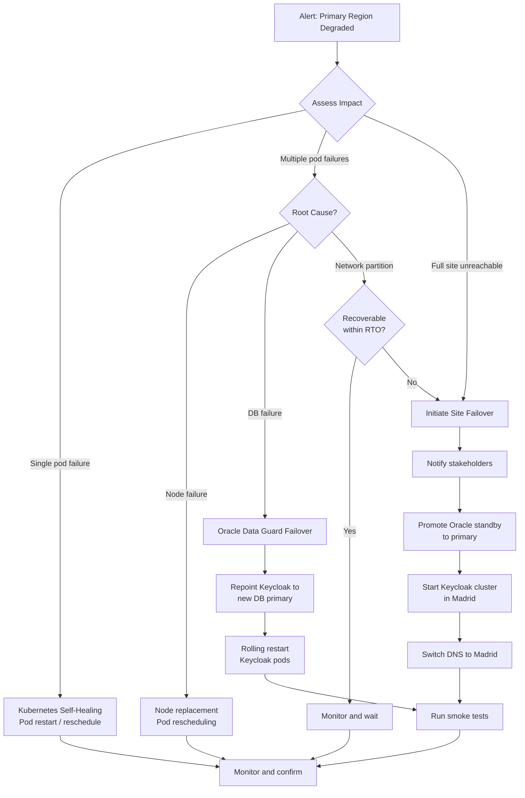

# 17 - Disaster Recovery and Backup

> **Project:** Enterprise IAM Platform based on Keycloak
> **Related documents:** [01 - Target Architecture](./01-target-architecture.md) | [05 - Infrastructure as Code](./05-infrastructure-as-code.md) | [16 - Operations Runbook](./16-operations-runbook.md) | [12 - Environment Management](./12-environment-management.md)

---

## Table of Contents

1. [DR Strategy Overview](#1-dr-strategy-overview)
2. [Backup Strategy](#2-backup-strategy)
3. [Multi-Region Architecture](#3-multi-region-architecture)
4. [Failover Procedures](#4-failover-procedures)
5. [Recovery Procedures](#5-recovery-procedures)
6. [DR Testing](#6-dr-testing)
7. [Data Protection](#7-data-protection)
8. [Runbook: Complete Site Failure](#8-runbook-complete-site-failure)
9. [Runbook: Database Corruption](#9-runbook-database-corruption)
10. [Runbook: Infinispan Cache Loss](#10-runbook-infinispan-cache-loss)
11. [Related Documents](#11-related-documents)

---

## 1. DR Strategy Overview

### 1.1 Business Impact Analysis

The IAM platform is a Tier-0 critical service. When authentication is unavailable, all downstream applications that depend on Keycloak for token issuance, session validation, or federated login are effectively offline. For an enterprise serving approximately 400 users across 2 federated Business-to-Business (B2B) organizations, the impact of IAM downtime includes:

| Impact Category | Consequence | Severity |
|---|---|---|
| Authentication failure | No user can log in to any protected application | Critical |
| Token issuance stopped | API clients cannot obtain or refresh tokens | Critical |
| Federation unavailable | B2B partner login via SAML/OIDC federation fails | High |
| Admin console inaccessible | No realm, user, or client management possible | High |
| Session invalidation | Active sessions cannot be validated; users forced to re-authenticate on recovery | Medium |
| Audit trail gap | Authentication events not recorded during outage | Medium |

### 1.2 RPO and RTO Targets

Recovery Point Objective (RPO) defines the maximum acceptable data loss. Recovery Time Objective (RTO) defines the maximum acceptable downtime.

| Component | RPO | RTO | DR Tier | Mechanism |
|---|---|---|---|---|
| Oracle DB (user data, credentials, sessions) | < 5 minutes | < 15 minutes | Tier 1 | Oracle Data Guard, RMAN incremental backups |
| Keycloak realm configuration | Near-zero | < 30 minutes | Tier 1 | Infrastructure as Code (Terraform + Helm + realm exports in Git) |
| TLS certificates and signing keys | Near-zero | < 10 minutes | Tier 1 | Sealed Secrets in Git / External Secrets Operator from HashiCorp Vault |
| Infinispan session cache | N/A (ephemeral) | < 5 minutes | Tier 2 | Cache rebuild from database on Keycloak startup |
| Observability data (Prometheus, Grafana) | < 1 hour | < 30 minutes | Tier 3 | Prometheus snapshots, Grafana dashboard-as-code |
| Custom SPI JARs and themes | Near-zero | < 15 minutes | Tier 1 | Container image registry, Git repository |

### 1.3 DR Tiers



---

## 2. Backup Strategy

### 2.1 Oracle Database Backup

The Oracle Database is the single source of truth for all IAM data: users, credentials, client registrations, role mappings, sessions, and audit events.

#### 2.1.1 Physical Backups (RMAN)

Oracle Recovery Manager (RMAN) performs block-level backups. These are the primary backup mechanism for production.

```bash
# Full database backup with RMAN (scheduled daily at 02:00 UTC)
rman target / <<EOF
RUN {
    ALLOCATE CHANNEL c1 DEVICE TYPE DISK;
    ALLOCATE CHANNEL c2 DEVICE TYPE DISK;
    BACKUP AS COMPRESSED BACKUPSET
        INCREMENTAL LEVEL 0
        DATABASE
        PLUS ARCHIVELOG DELETE INPUT
        FORMAT '/backup/oracle/rman/%d_%T_%s_%p.bkp';
    BACKUP CURRENT CONTROLFILE
        FORMAT '/backup/oracle/rman/cf_%d_%T_%s.bkp';
    BACKUP SPFILE
        FORMAT '/backup/oracle/rman/spfile_%d_%T_%s.bkp';
    CROSSCHECK BACKUP;
    DELETE NOPROMPT OBSOLETE;
}
EOF

# Incremental Level 1 backup (scheduled every 6 hours)
rman target / <<EOF
RUN {
    BACKUP AS COMPRESSED BACKUPSET
        INCREMENTAL LEVEL 1
        DATABASE
        PLUS ARCHIVELOG DELETE INPUT
        FORMAT '/backup/oracle/rman/incr_%d_%T_%s_%p.bkp';
}
EOF
```

#### 2.1.2 Logical Backups (Data Pump)

Oracle Data Pump exports provide a portable, human-inspectable backup for specific schemas.

```bash
# Export the Keycloak schema (scheduled weekly)
expdp keycloak_admin/\${DB_PASSWORD}@KEYCLOAK_PDB \
    SCHEMAS=keycloak \
    DIRECTORY=DATA_PUMP_DIR \
    DUMPFILE=keycloak_schema_%U_%T.dmp \
    LOGFILE=keycloak_export_%T.log \
    COMPRESSION=ALL \
    ENCRYPTION=ALL \
    ENCRYPTION_PASSWORD=\${ENCRYPTION_PASSWORD} \
    PARALLEL=4
```

#### 2.1.3 Archive Log Shipping

Continuous archive log shipping to Google Cloud Storage (GCS) enables point-in-time recovery (PITR).

```bash
# Archive log backup to GCS (continuous, every 15 minutes)
rman target / <<EOF
RUN {
    BACKUP ARCHIVELOG ALL
        NOT BACKED UP 1 TIMES
        FORMAT '/backup/oracle/archivelog/arch_%d_%T_%s_%p.bkp'
        DELETE INPUT;
}
EOF

# Sync to GCS
gsutil -m rsync -r /backup/oracle/ gs://xiam-oracle-backups/\$(date +%Y/%m/%d)/
```

### 2.2 Backup Schedule and Retention

| Backup Type | Frequency | Retention | Storage Location | Encryption |
|---|---|---|---|---|
| RMAN Full (Level 0) | Daily at 02:00 UTC | 30 days | GCS `xiam-oracle-backups` | AES-256 |
| RMAN Incremental (Level 1) | Every 6 hours | 14 days | GCS `xiam-oracle-backups` | AES-256 |
| Archive logs | Continuous (15 min) | 7 days | GCS `xiam-oracle-archivelog` | AES-256 |
| Data Pump export | Weekly (Sunday 04:00 UTC) | 90 days | GCS `xiam-oracle-exports` | AES-256 |
| Realm JSON export | Daily at 03:00 UTC | 90 days | Git repository + GCS | GPG encrypted |
| TLS certificates | On change | Indefinite | Sealed Secrets in Git | Sealed Secrets RSA |
| Keycloak signing keys | On change | Indefinite | External Secrets Operator | Vault transit encryption |
| Terraform state | On every apply | Versioned (all) | GCS with versioning | Google-managed encryption |

### 2.3 Realm Configuration Backup

Keycloak realm configuration is exported as JSON and stored in version control. This serves as both a backup and a deployment artifact.

```bash
# Export all realms using the Keycloak Admin CLI
# Run from within the Keycloak pod or a job with admin credentials
kubectl exec -n iam-system deploy/keycloak -- \
    /opt/keycloak/bin/kc.sh export \
    --dir /tmp/realm-export \
    --users realm_file

# Copy exports to local machine
kubectl cp iam-system/keycloak-0:/tmp/realm-export ./realm-export/

# Encrypt and push to backup bucket
for f in ./realm-export/*.json; do
    gpg --encrypt --recipient iam-backup@xiam.example.com "$f"
    gsutil cp "${f}.gpg" gs://xiam-realm-backups/$(date +%Y-%m-%d)/
done
```

### 2.4 Secret and Certificate Backup

Secrets and certificates are managed through External Secrets Operator (ESO) backed by HashiCorp Vault. The backup strategy ensures recoverability without relying on the Kubernetes cluster.

```bash
# List all sealed secrets in the iam-system namespace
kubectl get sealedsecrets -n iam-system -o yaml > sealed-secrets-backup.yaml

# Backup the Sealed Secrets controller key pair
kubectl get secret -n kube-system \
    -l sealedsecrets.bitnami.com/sealed-secrets-key=active \
    -o yaml > sealed-secrets-keypair.yaml

# Store securely (offline, encrypted)
gpg --encrypt --recipient iam-security@xiam.example.com sealed-secrets-keypair.yaml
```

---

## 3. Multi-Region Architecture

### 3.1 GKE Deployment Topology

The platform is deployed across two Google Kubernetes Engine (GKE) clusters in distinct European regions to satisfy data residency requirements and provide geographic redundancy.

| Attribute | Primary Region | Secondary Region |
|---|---|---|
| GCP Region | `europe-west1` (Belgium) | `europe-southwest1` (Madrid) |
| GKE Cluster | `xiam-gke-primary` | `xiam-gke-secondary` |
| Keycloak Replicas | 3 (active) | 3 (standby or active) |
| Oracle DB | Primary instance | Data Guard standby |
| DNS Endpoint | `iam.xiam.example.com` | Failover target |
| Role | Active (receives all traffic) | Passive (warm standby) |

### 3.2 Active-Passive vs Active-Active Analysis

| Criterion | Active-Passive | Active-Active |
|---|---|---|
| Complexity | Lower | Significantly higher |
| Cost | Lower (standby resources scaled down) | Higher (full capacity in both regions) |
| RTO | 5-15 minutes (DNS failover + promotion) | Near-zero (traffic already flowing) |
| Data consistency | Strong (single write primary) | Requires conflict resolution |
| Session affinity | Simple (single cluster) | Cross-datacenter Infinispan replication required |
| Oracle DB replication | Data Guard physical standby | Active Data Guard or GoldenGate (additional licensing) |
| Recommended for ~400 users | Yes | Over-engineered for current scale |

**Decision:** Active-Passive is the recommended configuration for the current deployment. The user base of approximately 400 users across 2 B2B organizations does not justify the complexity and cost of active-active. The architecture supports future migration to active-active if user count or availability requirements increase.

### 3.3 Multi-Region Architecture Diagram



### 3.4 Infinispan Cross-Datacenter Replication

In the active-passive model, Infinispan cross-datacenter replication is not required because the standby cluster does not serve traffic. However, the configuration is documented here for future active-active migration.

Keycloak uses Infinispan embedded mode with the following caches:

| Cache Name | Purpose | Replication Mode | Cross-DC Required |
|---|---|---|---|
| `sessions` | User SSO sessions | Distributed (2 owners) | Yes (active-active only) |
| `authenticationSessions` | In-flight authentication flows | Distributed (2 owners) | Yes (active-active only) |
| `offlineSessions` | Offline tokens | Distributed (2 owners) | Yes (active-active only) |
| `clientSessions` | Client-level sessions | Distributed (2 owners) | Yes (active-active only) |
| `actionTokens` | Password reset, email verification tokens | Replicated | Yes (active-active only) |
| `work` | Cache invalidation notifications | Replicated | Yes (active-active only) |
| `realms` | Realm metadata cache | Local (invalidation) | No |
| `users` | User metadata cache | Local (invalidation) | No |
| `authorization` | Authorization policy cache | Local (invalidation) | No |

For active-active, the Infinispan `RELAY2` protocol with JGroups would bridge sites:

```xml
<!-- infinispan.xml - Cross-datacenter configuration (active-active only) -->
<infinispan>
    <jgroups>
        <stack name="xsite" extends="kubernetes">
            <relay.RELAY2 site="belgium" max_site_masters="3"
                xmlns="urn:org:jgroups"/>
            <remote-sites default-stack="tcp">
                <remote-site name="madrid" stack="tcp"/>
            </remote-sites>
        </stack>
    </jgroups>
    <cache-container>
        <distributed-cache name="sessions" owners="2">
            <backups>
                <backup site="madrid" strategy="ASYNC"
                        failure-policy="WARN" timeout="12000"/>
            </backups>
        </distributed-cache>
    </cache-container>
</infinispan>
```

### 3.5 Database Replication Strategy

Oracle Data Guard provides the database-level DR capability.

| Parameter | Value |
|---|---|
| Protection mode | Maximum Availability |
| Redo transport | Asynchronous (ASYNC) for cross-region |
| Standby type | Physical standby |
| Apply mode | Real-time apply |
| Switchover time | < 5 minutes (planned) |
| Failover time | < 2 minutes (automatic, via Data Guard Broker) |
| Network | Private VPC peering between Belgium and Madrid |

```bash
# Verify Data Guard status
dgmgrl sys/${DB_PASSWORD}@KEYCLOAK_PRIMARY <<EOF
SHOW CONFIGURATION;
SHOW DATABASE 'keycloak_stby';
SHOW DATABASE 'keycloak_primary';
EOF

# Expected output:
# Configuration - xiam_dg_config
#   Protection Mode: MaxAvailability
#   Members:
#     keycloak_primary - Primary database
#     keycloak_stby    - Physical standby database
#   Fast-Start Failover: Enabled
#   Configuration Status: SUCCESS
```

---

## 4. Failover Procedures

### 4.1 Failover Decision Flowchart



### 4.2 Automated Failover Triggers

Automated failover is configured through Oracle Data Guard Fast-Start Failover and GKE health monitoring.

| Trigger | Condition | Automated Action | Human Approval |
|---|---|---|---|
| Oracle Data Guard observer | Primary DB unreachable for > 30 seconds | Promote standby to primary | No (pre-approved) |
| GKE node pool unhealthy | > 50% of Keycloak nodes unavailable for > 5 minutes | Scale replacement nodes | No |
| Keycloak health check failure | All pods failing readiness for > 3 minutes | Alert + pod restart | Yes (for site failover) |
| DNS health check failure | Primary endpoint returns 5xx for > 2 minutes | DNS failover to secondary endpoint | No (pre-approved) |
| Full region outage | GCP status page confirms region outage | Site failover to Madrid | Yes (on-call confirmation) |

### 4.3 Manual Failover Steps

#### Step 1: Confirm Primary Region Is Unavailable

```bash
# Check GKE cluster connectivity
gcloud container clusters get-credentials xiam-gke-primary \
    --region europe-west1 --project xiam-prod

kubectl get nodes
kubectl get pods -n iam-system -o wide

# Check Oracle primary database
sqlplus sys/${DB_PASSWORD}@KEYCLOAK_PRIMARY as sysdba <<EOF
SELECT DATABASE_ROLE, OPEN_MODE, PROTECTION_MODE FROM V\$DATABASE;
EOF
```

#### Step 2: Promote Oracle Standby Database

```bash
# Connect to Data Guard Broker on the standby site
dgmgrl sys/${DB_PASSWORD}@KEYCLOAK_STBY <<EOF
FAILOVER TO 'keycloak_stby' IMMEDIATE;
EOF

# Verify promotion
sqlplus sys/${DB_PASSWORD}@KEYCLOAK_STBY as sysdba <<EOF
SELECT DATABASE_ROLE, OPEN_MODE FROM V\$DATABASE;
-- Expected: PRIMARY, READ WRITE
EOF
```

#### Step 3: Activate Keycloak in Secondary Region

```bash
# Switch kubectl context to secondary cluster
gcloud container clusters get-credentials xiam-gke-secondary \
    --region europe-southwest1 --project xiam-prod

# Scale up Keycloak pods (if scaled down in standby mode)
kubectl scale deployment keycloak -n iam-system --replicas=3

# Verify pods are running and ready
kubectl rollout status deployment/keycloak -n iam-system --timeout=300s
kubectl get pods -n iam-system -l app.kubernetes.io/name=keycloak
```

#### Step 4: Switch DNS

```bash
# Update Cloud DNS to point to the secondary region load balancer
gcloud dns record-sets update iam.xiam.example.com \
    --zone=xiam-dns-zone \
    --type=A \
    --ttl=60 \
    --rrdatas="<MADRID_LB_IP>"

# Verify DNS propagation
dig +short iam.xiam.example.com
# Expected: <MADRID_LB_IP>
```

#### Step 5: Validate

```bash
# Run smoke test against the failover endpoint
curl -sf https://iam.xiam.example.com/health/ready
# Expected: HTTP 200

# Test token issuance
curl -sf -X POST \
    https://iam.xiam.example.com/realms/master/protocol/openid-connect/token \
    -d "client_id=admin-cli" \
    -d "username=admin" \
    -d "password=${KC_ADMIN_PASSWORD}" \
    -d "grant_type=password" | jq .access_token
# Expected: valid JWT
```

### 4.4 Load Balancer Failover

Google Cloud Global Load Balancer with health-check-based backend selection provides automatic traffic steering.

```hcl
# Terraform - Global LB with health check failover
resource "google_compute_health_check" "keycloak" {
  name               = "xiam-keycloak-health"
  check_interval_sec = 10
  timeout_sec        = 5
  healthy_threshold  = 2
  unhealthy_threshold = 3

  http_health_check {
    port         = 8080
    request_path = "/health/ready"
  }
}

resource "google_compute_backend_service" "keycloak" {
  name                  = "xiam-keycloak-backend"
  load_balancing_scheme = "EXTERNAL"
  health_checks         = [google_compute_health_check.keycloak.id]

  backend {
    group           = google_compute_region_network_endpoint_group.belgium.id
    balancing_mode  = "UTILIZATION"
    max_utilization = 0.8
    capacity_scaler = 1.0
  }

  backend {
    group           = google_compute_region_network_endpoint_group.madrid.id
    balancing_mode  = "UTILIZATION"
    max_utilization = 0.8
    capacity_scaler = 0.0  # Set to 1.0 during failover
    failover        = true
  }
}
```

---

## 5. Recovery Procedures

### 5.1 Database Restore (Oracle RMAN)

```bash
# Restore from the most recent RMAN backup
rman target / <<EOF
RUN {
    # Shut down and mount the database
    SHUTDOWN IMMEDIATE;
    STARTUP MOUNT;

    # Restore and recover
    RESTORE DATABASE;
    RECOVER DATABASE;

    # Open the database
    ALTER DATABASE OPEN RESETLOGS;
}
EOF
```

For point-in-time recovery:

```bash
# Restore to a specific point in time
rman target / <<EOF
RUN {
    SHUTDOWN IMMEDIATE;
    STARTUP MOUNT;

    SET UNTIL TIME "TO_DATE('2026-03-07 14:30:00','YYYY-MM-DD HH24:MI:SS')";
    RESTORE DATABASE;
    RECOVER DATABASE;

    ALTER DATABASE OPEN RESETLOGS;
}
EOF
```

### 5.2 Realm Import

After database recovery, verify realm integrity. If realms are missing or corrupted, import from the latest JSON export.

```bash
# Import realms from backup
kubectl exec -n iam-system deploy/keycloak -- \
    /opt/keycloak/bin/kc.sh import \
    --dir /opt/keycloak/data/import \
    --override false

# Alternatively, use the Admin REST API
ACCESS_TOKEN=$(curl -sf -X POST \
    https://iam.xiam.example.com/realms/master/protocol/openid-connect/token \
    -d "client_id=admin-cli" \
    -d "username=admin" \
    -d "password=${KC_ADMIN_PASSWORD}" \
    -d "grant_type=password" | jq -r .access_token)

curl -sf -X POST \
    https://iam.xiam.example.com/admin/realms \
    -H "Authorization: Bearer ${ACCESS_TOKEN}" \
    -H "Content-Type: application/json" \
    -d @realm-export/xiam-realm.json
```

### 5.3 Certificate Restore

TLS certificates managed by cert-manager are automatically re-issued. Keycloak signing keys stored in the database are restored with the database. For manually managed certificates:

```bash
# Restore sealed secrets from Git backup
kubectl apply -f infra/k8s/sealed-secrets/

# Verify certificate secrets exist
kubectl get secrets -n iam-system -l type=tls
kubectl get secrets -n iam-system keycloak-tls -o jsonpath='{.data.tls\.crt}' | \
    base64 -d | openssl x509 -noout -subject -dates
```

### 5.4 Keycloak Cluster Rebuild

If the GKE cluster itself must be rebuilt from scratch:

```bash
# 1. Provision GKE cluster with Terraform
cd infra/terraform/environments/prod
terraform init
terraform apply -auto-approve -target=module.kubernetes_cluster

# 2. Deploy platform components with Helm
cd infra/helm/keycloak
helm upgrade --install keycloak bitnami/keycloak \
    -n iam-system --create-namespace \
    -f values.yaml \
    -f values-prod.yaml \
    --wait --timeout 15m

# 3. Apply network policies and RBAC
kubectl apply -f infra/k8s/network-policies/
kubectl apply -f infra/k8s/rbac/

# 4. Restore secrets
kubectl apply -f infra/k8s/sealed-secrets/

# 5. Verify cluster health
kubectl get pods -n iam-system
kubectl get pods -n iam-observability
```

### 5.5 Infinispan Cache Warm-Up

After a cluster restart, Infinispan caches are empty. Keycloak populates caches lazily on first access, but a warm-up procedure reduces initial latency.

```bash
# Trigger cache warm-up by accessing key endpoints
# This forces realm and client caches to populate

# Warm up realm metadata for all configured realms
for REALM in master xiam-org1 xiam-org2; do
    curl -sf "https://iam.xiam.example.com/realms/${REALM}/.well-known/openid-configuration" \
        > /dev/null
    echo "Warmed cache for realm: ${REALM}"
done

# Warm up client caches by requesting token endpoint metadata
for REALM in master xiam-org1 xiam-org2; do
    curl -sf "https://iam.xiam.example.com/realms/${REALM}/protocol/openid-connect/certs" \
        > /dev/null
    echo "Warmed JWKS cache for realm: ${REALM}"
done

# Verify Infinispan cache statistics via Keycloak metrics
kubectl exec -n iam-system deploy/keycloak -- \
    curl -sf localhost:9000/metrics | grep 'vendor_cache'
```

### 5.6 Federation Re-establishment

After a site failover, federated identity providers (IdPs) may need endpoint updates if the Keycloak hostname has changed.

```bash
# Verify federation endpoints are accessible
for IDP_ALIAS in partner-org1-saml partner-org2-oidc; do
    curl -sf "https://iam.xiam.example.com/realms/xiam-org1/broker/${IDP_ALIAS}/endpoint" \
        -o /dev/null -w "IdP ${IDP_ALIAS}: HTTP %{http_code}\n"
done

# If federation metadata has changed, re-import
ACCESS_TOKEN=$(curl -sf -X POST \
    https://iam.xiam.example.com/realms/master/protocol/openid-connect/token \
    -d "client_id=admin-cli" \
    -d "username=admin" \
    -d "password=${KC_ADMIN_PASSWORD}" \
    -d "grant_type=password" | jq -r .access_token)

# Update federated IdP metadata URL
curl -sf -X PUT \
    "https://iam.xiam.example.com/admin/realms/xiam-org1/identity-provider/instances/partner-org1-saml" \
    -H "Authorization: Bearer ${ACCESS_TOKEN}" \
    -H "Content-Type: application/json" \
    -d '{"config": {"singleSignOnServiceUrl": "https://partner-idp.example.com/saml/sso"}}'
```

---

## 6. DR Testing

### 6.1 DR Drill Schedule

| Drill Type | Frequency | Duration | Scope | Approval Required |
|---|---|---|---|---|
| Tabletop exercise | Quarterly | 2 hours | All stakeholders review procedures | Change Advisory Board (CAB) |
| Database restore test | Monthly | 4 hours | Restore RMAN backup to test environment | IAM team lead |
| Failover simulation | Semi-annually | 8 hours (maintenance window) | Full site failover to Madrid | CAB + client approval |
| Chaos engineering | Monthly | 2 hours | Pod kill, node drain, network partition | IAM team lead |
| Backup validation | Weekly (automated) | 1 hour | Verify backup integrity and restorability | Automated |

### 6.2 Test Scenarios

| Scenario ID | Scenario | Procedure | Success Criteria |
|---|---|---|---|
| DR-001 | Single Keycloak pod failure | `kubectl delete pod keycloak-0 -n iam-system` | Pod replaced within 60 seconds; no user-visible impact |
| DR-002 | All Keycloak pods failure | Scale to 0, then back to 3 | Service restored within 5 minutes; sessions re-established |
| DR-003 | Oracle primary database failure | Simulate with Data Guard switchover | Standby promoted within 5 minutes; Keycloak reconnects automatically |
| DR-004 | Full node failure | `kubectl drain <node> --force` | Pods rescheduled to surviving nodes within 2 minutes |
| DR-005 | Complete Belgium site failure | Full failover to Madrid | Service available from Madrid within 15 minutes |
| DR-006 | Database corruption | Restore from RMAN backup to test DB | Data consistent with RPO target (< 5 minutes data loss) |
| DR-007 | Infinispan cache corruption | Rolling restart of all Keycloak pods | Caches rebuilt from database; no data loss |
| DR-008 | DNS failure | Simulate DNS unavailability | Secondary DNS resolves within TTL window |
| DR-009 | Certificate expiry | Simulate expired TLS cert | cert-manager renews; or manual restore from backup |
| DR-010 | Backup restore validation | Automated weekly restore to test environment | Restore completes; login flow succeeds on test environment |

### 6.3 DR Test Report Template

After each DR drill, complete the following report:

```
DR DRILL REPORT
===============
Drill ID:           DR-YYYY-MM-DD-NNN
Date:               YYYY-MM-DD
Duration:           HH:MM - HH:MM (UTC)
Participants:       [names and roles]
Scenario:           [scenario ID and description]

TIMELINE:
---------
HH:MM  Event triggered
HH:MM  Alert received by on-call
HH:MM  Failover initiated
HH:MM  Database promoted
HH:MM  Keycloak available in DR site
HH:MM  DNS switched
HH:MM  Smoke tests passed
HH:MM  Drill concluded

METRICS:
--------
Actual RTO:         XX minutes (target: YY minutes)
Actual RPO:         XX minutes (target: YY minutes)
Data loss:          [none / XX records]
User impact:        [none / brief description]

FINDINGS:
---------
1. [Finding description]
   Severity: [Critical/High/Medium/Low]
   Remediation: [action required]
   Owner: [person]
   Due date: [YYYY-MM-DD]

RESULT:             [PASS / FAIL / PARTIAL]
Next drill date:    YYYY-MM-DD
```

---

## 7. Data Protection

### 7.1 GDPR Considerations for Backups

The IAM platform stores personal data (names, email addresses, phone numbers) subject to the General Data Protection Regulation (GDPR). Backups containing personal data must comply with the following requirements:

| GDPR Requirement | Implementation |
|---|---|
| Right to erasure (Article 17) | Erasure requests are processed on the live database; backups are excluded per Recital 65 guidance as long as retention periods are reasonable and documented |
| Data minimization | Backups contain only IAM-relevant data; no unnecessary personal data is included |
| Storage limitation | Backup retention policies enforce deletion after defined periods (see Section 2.2) |
| Cross-border transfer | All backups stored within EU regions (Belgium and Madrid); no transfer outside EEA |
| Data processing agreement | GCS backup storage is covered under the Google Cloud Data Processing Agreement |
| Breach notification | Backup access is audited; unauthorized access triggers 72-hour notification process |

### 7.2 Encryption at Rest

| Data Store | Encryption Mechanism | Key Management |
|---|---|---|
| Oracle DB data files | Oracle Transparent Data Encryption (TDE) | Oracle Key Vault |
| RMAN backups | RMAN encryption with AES-256 | Wallet-based key stored in Vault |
| Data Pump exports | `ENCRYPTION=ALL` with password | Encryption password in Vault |
| GCS backup buckets | Google-managed encryption (AES-256-GCM) | Google Cloud KMS |
| Realm JSON exports | GPG symmetric encryption | GPG key in Vault |
| Terraform state | GCS server-side encryption | Google Cloud KMS |
| Sealed Secrets | RSA-OAEP with controller key pair | Controller key pair backup |

### 7.3 Backup Access Control

```bash
# GCS IAM policy for backup buckets - least privilege
gcloud storage buckets add-iam-policy-binding gs://xiam-oracle-backups \
    --member="serviceAccount:xiam-backup-sa@xiam-prod.iam.gserviceaccount.com" \
    --role="roles/storage.objectAdmin"

gcloud storage buckets add-iam-policy-binding gs://xiam-oracle-backups \
    --member="serviceAccount:xiam-restore-sa@xiam-prod.iam.gserviceaccount.com" \
    --role="roles/storage.objectViewer"

# Enable audit logging for backup bucket access
gcloud projects add-iam-audit-config xiam-prod \
    --service=storage.googleapis.com \
    --log-type=DATA_READ \
    --log-type=DATA_WRITE
```

### 7.4 Cross-Region Data Sovereignty

Both GCP regions (Belgium and Madrid) are within the European Economic Area (EEA). The following controls ensure data does not leave the EEA:

- GCS bucket location is set to `EU` (multi-region) or specific single regions (`europe-west1`, `europe-southwest1`).
- Organization Policy constraint `constraints/gcp.resourceLocations` restricts resource creation to EU regions only.
- VPC Service Controls perimeter prevents data exfiltration to unauthorized projects.
- Data Guard redo log transport uses private VPC peering, never traversing the public internet.

---

## 8. Runbook: Complete Site Failure

**Trigger:** The primary region (Belgium, `europe-west1`) is completely unavailable due to a regional outage, natural disaster, or catastrophic infrastructure failure.

**Estimated duration:** 15-30 minutes.

### Prerequisites

- Access to GCP console or `gcloud` CLI with project-level admin permissions.
- Oracle Data Guard Broker credentials for the standby database.
- Keycloak admin credentials stored in Vault or accessible offline.
- This runbook printed or accessible offline.

### Procedure

| Step | Action | Command / Detail | Verification |
|---|---|---|---|
| 1 | Confirm site is unreachable | `gcloud compute instances list --filter="zone:europe-west1*"` | No instances reachable; GCP status page confirms outage |
| 2 | Notify stakeholders | Send incident notification via PagerDuty / email | Acknowledgment received |
| 3 | Promote Oracle standby | `dgmgrl: FAILOVER TO 'keycloak_stby' IMMEDIATE;` | `SELECT DATABASE_ROLE FROM V$DATABASE;` returns `PRIMARY` |
| 4 | Switch kubectl context | `gcloud container clusters get-credentials xiam-gke-secondary --region europe-southwest1` | `kubectl cluster-info` returns Madrid cluster |
| 5 | Scale up Keycloak | `kubectl scale deploy keycloak -n iam-system --replicas=3` | All 3 pods in `Running` state |
| 6 | Wait for readiness | `kubectl rollout status deploy/keycloak -n iam-system --timeout=300s` | Rollout complete |
| 7 | Update DNS | `gcloud dns record-sets update iam.xiam.example.com --zone=xiam-dns-zone --type=A --ttl=60 --rrdatas=<MADRID_LB_IP>` | `dig +short iam.xiam.example.com` returns Madrid IP |
| 8 | Run smoke tests | `curl -sf https://iam.xiam.example.com/health/ready` | HTTP 200 |
| 9 | Test authentication | Request token from `/realms/master/protocol/openid-connect/token` | Valid JWT returned |
| 10 | Test federation | Login via each federated IdP | Federated login succeeds |
| 11 | Notify stakeholders | Send recovery notification | Acknowledgment received |
| 12 | Monitor | Watch dashboards for 30 minutes | No errors, latency within SLA |

### Post-Failover Actions

1. **Document the incident** -- Create incident report with timeline, root cause, and lessons learned.
2. **Plan failback** -- Once the primary region is restored, plan a maintenance window for failback.
3. **Re-establish Data Guard** -- Rebuild the original primary as a new standby: `dgmgrl: REINSTATE DATABASE 'keycloak_primary';`
4. **Update monitoring** -- Ensure alerting targets the new active region.

---

## 9. Runbook: Database Corruption

**Trigger:** Oracle database reports ORA-01578 (data block corruption), ORA-00600 (internal error), or application-level data inconsistency is detected (for example, users missing, roles misassigned, clients deleted unexpectedly).

**Estimated duration:** 30-60 minutes depending on database size and corruption extent.

### Procedure

| Step | Action | Command / Detail | Verification |
|---|---|---|---|
| 1 | Assess corruption scope | `RMAN> VALIDATE DATABASE;` | Identify corrupted blocks and data files |
| 2 | Check if corruption is limited | `RMAN> VALIDATE DATAFILE <n>;` | Determine if only specific tablespaces are affected |
| 3 | Notify stakeholders | Incident notification with estimated RTO | Acknowledgment received |
| 4 | Stop Keycloak traffic | `kubectl scale deploy keycloak -n iam-system --replicas=0` | No pods running |
| 5 | Attempt block media recovery | See command below | Corrupted blocks replaced from backup |
| 6 | If block recovery fails, perform full restore | See command below | Database restored to consistent state |
| 7 | Validate data integrity | Run integrity check queries (see below) | All counts match expected values |
| 8 | Restart Keycloak | `kubectl scale deploy keycloak -n iam-system --replicas=3` | All pods `Running` and `Ready` |
| 9 | Run smoke tests | Test login, token issuance, admin console | All pass |

### Block Media Recovery (Minimal Downtime)

```bash
# Recover only the corrupted blocks
rman target / <<EOF
RUN {
    BLOCKRECOVER DATAFILE <datafile_number>
        BLOCK <block_number>
        FROM BACKUPSET;
}
EOF
```

### Full Database Restore (When Block Recovery Is Insufficient)

```bash
rman target / <<EOF
RUN {
    SHUTDOWN IMMEDIATE;
    STARTUP MOUNT;

    # Restore to the last known good point before corruption
    SET UNTIL TIME "TO_DATE('2026-03-07 12:00:00','YYYY-MM-DD HH24:MI:SS')";
    RESTORE DATABASE;
    RECOVER DATABASE;

    ALTER DATABASE OPEN RESETLOGS;
}
EOF
```

### Data Integrity Validation Queries

```sql
-- Verify realm count matches expected
SELECT COUNT(*) AS realm_count FROM REALM;
-- Expected: matches known realm count

-- Verify user count per realm
SELECT r.NAME AS realm_name, COUNT(ue.ID) AS user_count
FROM USER_ENTITY ue
JOIN REALM r ON ue.REALM_ID = r.ID
GROUP BY r.NAME;

-- Verify client registrations
SELECT r.NAME AS realm_name, COUNT(c.ID) AS client_count
FROM CLIENT c
JOIN REALM r ON c.REALM_ID = r.ID
GROUP BY r.NAME;

-- Verify no orphaned role mappings
SELECT COUNT(*) AS orphaned_roles
FROM USER_ROLE_MAPPING urm
WHERE NOT EXISTS (SELECT 1 FROM USER_ENTITY ue WHERE ue.ID = urm.USER_ID);
-- Expected: 0

-- Verify credential integrity
SELECT COUNT(*) AS users_without_credentials
FROM USER_ENTITY ue
WHERE NOT EXISTS (SELECT 1 FROM CREDENTIAL c WHERE c.USER_ID = ue.ID)
AND ue.REALM_ID != (SELECT ID FROM REALM WHERE NAME = 'master');
-- Document any anomalies
```

---

## 10. Runbook: Infinispan Cache Loss

**Trigger:** Infinispan embedded caches are lost due to a full cluster restart, JGroups cluster split, or memory pressure causing cache evictions. Symptoms include users being forced to re-authenticate, stale realm metadata, or `ClassCastException` errors in Keycloak logs.

**Estimated duration:** 5-10 minutes. No data loss occurs because Infinispan caches are backed by the Oracle database.

### Procedure

| Step | Action | Command / Detail | Verification |
|---|---|---|---|
| 1 | Identify cache issue | Check Keycloak logs for Infinispan errors | `kubectl logs -n iam-system deploy/keycloak --tail=100 \| grep -i "infinispan\|cache\|ISPN"` |
| 2 | Verify database is healthy | `sqlplus: SELECT STATUS FROM V$INSTANCE;` | Status is `OPEN` |
| 3 | Perform rolling restart | See command below | Pods restart one at a time without downtime |
| 4 | Warm up caches | Run cache warm-up script (Section 5.5) | Realm and JWKS endpoints respond with cached data |
| 5 | Verify cache statistics | Check Infinispan metrics | Cache entries populated; hit ratio increasing |
| 6 | Monitor user impact | Check for authentication failures | Error rate returns to baseline within 5 minutes |

### Rolling Restart

```bash
# Rolling restart preserves availability (PodDisruptionBudget ensures min 2 pods)
kubectl rollout restart deployment/keycloak -n iam-system

# Monitor the rollout
kubectl rollout status deployment/keycloak -n iam-system --timeout=300s

# Verify all pods are in the same Infinispan cluster
kubectl exec -n iam-system deploy/keycloak -- \
    curl -sf localhost:9000/metrics | grep 'vendor_cache_manager_default_cluster_size'
# Expected: cluster_size = 3
```

### Verify Cache Health

```bash
# Check cache entry counts via metrics
kubectl exec -n iam-system deploy/keycloak -- \
    curl -sf localhost:9000/metrics | grep -E 'vendor_cache_(realms|users|sessions)_statistics'

# Check JGroups cluster membership
kubectl exec -n iam-system deploy/keycloak -- \
    curl -sf localhost:9000/health | jq '.checks[] | select(.name == "Infinispan")'
```

### When Cache Loss Causes Persistent Issues

If cache corruption persists after rolling restart:

```bash
# 1. Scale down completely
kubectl scale deploy keycloak -n iam-system --replicas=0
kubectl wait --for=delete pod -l app.kubernetes.io/name=keycloak -n iam-system --timeout=120s

# 2. Clear any persistent cache storage (if configured)
# Note: In embedded mode with no persistent store, this step is not needed

# 3. Scale back up
kubectl scale deploy keycloak -n iam-system --replicas=3
kubectl rollout status deploy/keycloak -n iam-system --timeout=300s

# 4. Warm caches
for REALM in master xiam-org1 xiam-org2; do
    curl -sf "https://iam.xiam.example.com/realms/${REALM}/.well-known/openid-configuration" > /dev/null
    curl -sf "https://iam.xiam.example.com/realms/${REALM}/protocol/openid-connect/certs" > /dev/null
done
```

---

## 11. Related Documents

| Document | Relevance |
|---|---|
| [01 - Target Architecture](./01-target-architecture.md) | High-level system topology, HA design, initial DR strategy summary |
| [04 - Keycloak Configuration](./04-keycloak-configuration.md) | Realm configuration, Infinispan cache settings, session policies |
| [05 - Infrastructure as Code](./05-infrastructure-as-code.md) | Terraform modules, Helm charts, Kubernetes manifests used in recovery |
| [06 - CI/CD Pipelines](./06-cicd-pipelines.md) | Automated deployment pipelines for infrastructure rebuild |
| [07 - Security by Design](./07-security-by-design.md) | Encryption standards, secret management, access control |
| [08 - Authentication and Authorization](./08-authentication-authorization.md) | Federation configuration, token exchange, SAML/OIDC flows |
| [10 - Observability](./10-observability.md) | Monitoring, alerting, and dashboards for DR detection |
| [12 - Environment Management](./12-environment-management.md) | Environment-specific configurations, promotion strategy |
| [13 - Automation and Scripts](./13-automation-scripts.md) | Operational scripts, automation runbooks |
| [16 - Operations Runbook](./16-operations-runbook.md) | Day-to-day operational procedures, incident response |

---

*This document is part of the Enterprise IAM Platform documentation set. Return to [00 - Overview](./00-overview.md) for the full table of contents.*
