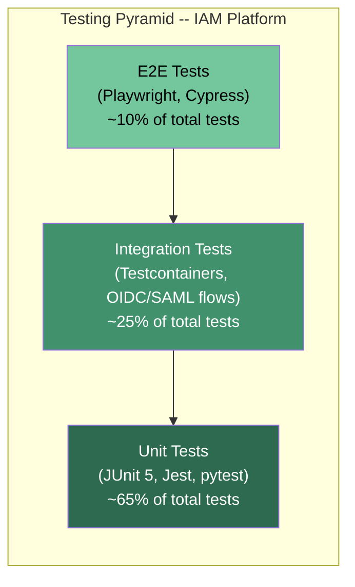
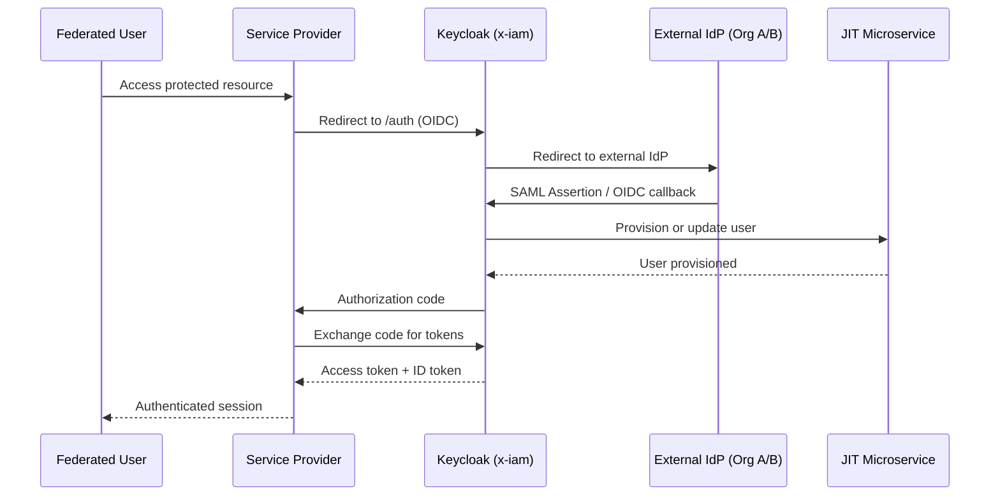
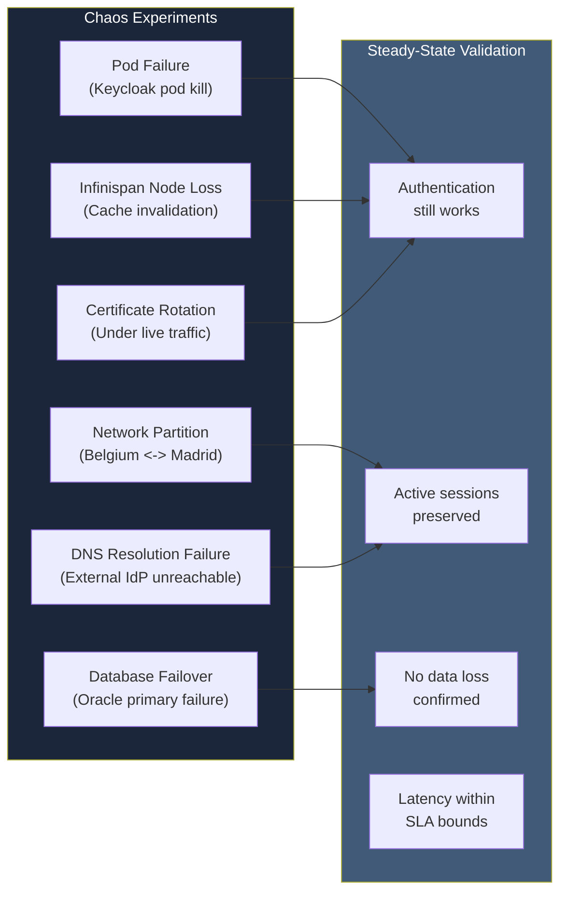
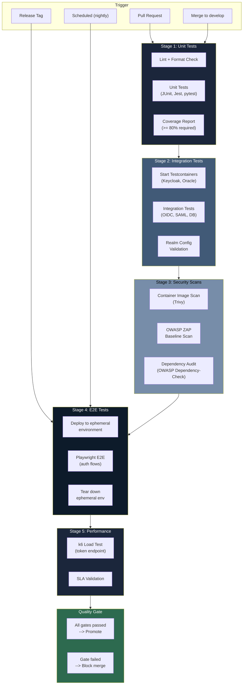

# 18 - Testing Strategy

> **Project:** Enterprise IAM Platform based on Keycloak
> **Related documents:** [03 - Transformation and Execution](./03-transformation-execution.md) | [06 - CI/CD Pipelines](./06-cicd-pipelines.md) | [07 - Security by Design](./07-security-by-design.md) | [08 - Authentication and Authorization](./08-authentication-authorization.md)

---

## Table of Contents

1. [Testing Strategy Overview](#1-testing-strategy-overview)
2. [Unit Testing](#2-unit-testing)
3. [Integration Testing](#3-integration-testing)
4. [End-to-End Testing](#4-end-to-end-testing)
5. [Performance Testing](#5-performance-testing)
6. [Security Testing](#6-security-testing)
7. [Chaos Engineering](#7-chaos-engineering)
8. [Test Environment Strategy](#8-test-environment-strategy)
9. [Test Automation in CI/CD](#9-test-automation-in-cicd)
10. [Acceptance Criteria](#10-acceptance-criteria)
11. [Related Documents](#11-related-documents)

---

## 1. Testing Strategy Overview

The testing strategy for the enterprise Identity and Access Management (IAM) platform follows a layered approach aligned with the testing pyramid. Each layer targets a specific class of defects, ensuring comprehensive coverage from individual Service Provider Interface (SPI) components through full authentication flows across federated Business-to-Business (B2B) organizations.

### 1.1 Testing Pyramid



### 1.2 Test Types

| Test Type | Scope | Tools | Frequency |
|-----------|-------|-------|-----------|
| Unit | Individual classes, functions, SPIs | JUnit 5, Mockito, Jest, pytest | Every commit |
| Integration | Keycloak realm config, OIDC/SAML flows, DB | Testcontainers, REST Assured | Every pull request |
| End-to-End | Full login/logout flows, token exchange | Playwright, Cypress | Nightly / pre-release |
| Performance | Token endpoints, concurrent sessions | Gatling, k6 | Weekly / milestone |
| Security | Vulnerability scanning, penetration testing | OWASP ZAP, Trivy, Nuclei | Weekly / pre-release |
| Chaos | Pod failure, network partition, DB failover | LitmusChaos, Chaos Mesh | Bi-weekly / pre-release |

### 1.3 Coverage Targets

| Component | Line Coverage | Branch Coverage | Mutation Coverage |
|-----------|--------------|-----------------|-------------------|
| Custom SPIs (Java) | >= 85% | >= 75% | >= 60% |
| Client applications (backend) | >= 80% | >= 70% | -- |
| Client applications (frontend) | >= 75% | >= 65% | -- |
| Infrastructure as Code (Terraform) | >= 90% (plan validation) | -- | -- |
| Realm configuration | 100% (all flows exercised) | -- | -- |

### 1.4 Testing Phases Aligned with Project Phases

Testing activities map directly to the four delivery phases defined in [03 - Transformation and Execution](./03-transformation-execution.md):

| Project Phase | Sprints | Testing Focus |
|---------------|---------|---------------|
| Phase A -- Foundation | 1--4 | Infrastructure smoke tests, Terraform plan validation, Keycloak health checks |
| Phase B -- Core Identity | 5--8 | OIDC/SAML flow integration tests, SPI unit tests, MFA validation |
| Phase C -- Operations | 9--12 | Performance benchmarks, observability validation, CI/CD pipeline tests |
| Phase D -- Hardening and Launch | 13--16 | Security scans, chaos engineering, UAT, go-live checklist |

---

## 2. Unit Testing

### 2.1 Keycloak SPI Unit Tests (Java / JUnit 5)

All custom Service Provider Interfaces (SPIs) must have comprehensive unit tests. Tests isolate SPI logic from Keycloak runtime using mocks and stubs.

#### Directory Structure

```
keycloak/custom-spi/
  src/
    main/java/com/xiam/spi/
      authenticator/
        JitProvisioningAuthenticator.java
      protocol/
        CustomTokenMapper.java
    test/java/com/xiam/spi/
      authenticator/
        JitProvisioningAuthenticatorTest.java
      protocol/
        CustomTokenMapperTest.java
```

#### Example: SPI Unit Test

```java
package com.xiam.spi.authenticator;

import org.junit.jupiter.api.BeforeEach;
import org.junit.jupiter.api.DisplayName;
import org.junit.jupiter.api.Test;
import org.junit.jupiter.api.extension.ExtendWith;
import org.keycloak.authentication.AuthenticationFlowContext;
import org.keycloak.models.KeycloakSession;
import org.keycloak.models.RealmModel;
import org.keycloak.models.UserModel;
import org.mockito.Mock;
import org.mockito.junit.jupiter.MockitoExtension;

import static org.assertj.core.api.Assertions.assertThat;
import static org.mockito.Mockito.*;

/**
 * Unit tests for {@link JitProvisioningAuthenticator}.
 *
 * <p>Validates that Just-In-Time (JIT) user provisioning behaves correctly
 * when federated users authenticate for the first time, including attribute
 * mapping and group assignment.</p>
 */
@ExtendWith(MockitoExtension.class)
class JitProvisioningAuthenticatorTest {

    @Mock
    private AuthenticationFlowContext context;

    @Mock
    private KeycloakSession session;

    @Mock
    private RealmModel realm;

    @Mock
    private UserModel user;

    private JitProvisioningAuthenticator authenticator;

    @BeforeEach
    void setUp() {
        authenticator = new JitProvisioningAuthenticator();
        when(context.getSession()).thenReturn(session);
        when(context.getRealm()).thenReturn(realm);
    }

    @Test
    @DisplayName("Should provision new federated user with correct attributes")
    void shouldProvisionNewFederatedUser() {
        // Given
        when(context.getUser()).thenReturn(null);
        when(realm.getAttribute("jit.default-group")).thenReturn("federated-users");

        // When
        authenticator.authenticate(context);

        // Then
        verify(context).success();
    }

    @Test
    @DisplayName("Should skip provisioning for existing users")
    void shouldSkipProvisioningForExistingUser() {
        // Given
        when(context.getUser()).thenReturn(user);

        // When
        authenticator.authenticate(context);

        // Then
        verify(context).success();
        verifyNoMoreInteractions(session);
    }
}
```

### 2.2 Client Application Unit Tests

Each client application in the `/examples/` directory follows its framework's idiomatic testing approach:

| Framework | Test Runner | Mock Strategy | Config |
|-----------|-------------|---------------|--------|
| Spring Boot 3.4 | JUnit 5 + Spring Test | `@MockBean`, `SecurityMockMvcRequestPostProcessors` | `src/test/resources/application-test.yml` |
| .NET 9 | xUnit + Moq | `WebApplicationFactory<T>`, mock `IHttpClientFactory` | `appsettings.Testing.json` |
| NestJS 10 | Jest | `@nestjs/testing`, mock guards and strategies | `jest.config.ts` |
| Express | Jest / Vitest | `supertest`, mock `passport` strategies | `.env.test` |
| FastAPI | pytest + httpx | `TestClient`, dependency overrides | `conftest.py` |

### 2.3 Mock Strategies for Keycloak

When unit testing client applications that depend on Keycloak for token validation, use the following approaches:

- **JWT mock generation**: Create valid JWTs signed with a test RSA key pair. Configure the application to use the test public key instead of fetching from Keycloak's JSON Web Key Set (JWKS) endpoint.
- **WireMock for OIDC discovery**: Stub the `.well-known/openid-configuration` endpoint to return a static discovery document pointing to local mock endpoints.
- **In-memory JWKS**: Serve a static JWKS document from the test harness containing the test public key.

---

## 3. Integration Testing

### 3.1 Keycloak Realm Configuration Testing

Realm configuration is tested using Keycloak Testcontainers. Each test class provisions a fresh Keycloak instance with the realm JSON imported, then validates the configuration programmatically.

```java
package com.xiam.integration;

import dasniko.testcontainers.keycloak.KeycloakContainer;
import org.junit.jupiter.api.BeforeAll;
import org.junit.jupiter.api.Test;
import org.keycloak.admin.client.Keycloak;
import org.keycloak.admin.client.KeycloakBuilder;
import org.keycloak.representations.idm.RealmRepresentation;
import org.testcontainers.junit.jupiter.Container;
import org.testcontainers.junit.jupiter.Testcontainers;

import static org.assertj.core.api.Assertions.assertThat;

/**
 * Integration tests for the x-iam realm configuration.
 *
 * <p>Uses Testcontainers to spin up a real Keycloak instance and validates
 * that the imported realm configuration matches expected settings for
 * authentication flows, client scopes, and identity providers.</p>
 */
@Testcontainers
class RealmConfigurationIT {

    @Container
    static final KeycloakContainer KEYCLOAK = new KeycloakContainer("quay.io/keycloak/keycloak:26.4.2")
            .withRealmImportFile("/realm-export.json")
            .withStartupTimeout(java.time.Duration.ofMinutes(3));

    private static Keycloak adminClient;

    @BeforeAll
    static void setUp() {
        adminClient = KeycloakBuilder.builder()
                .serverUrl(KEYCLOAK.getAuthServerUrl())
                .realm("master")
                .clientId("admin-cli")
                .username(KEYCLOAK.getAdminUsername())
                .password(KEYCLOAK.getAdminPassword())
                .build();
    }

    @Test
    void realmShouldHaveCorrectTokenLifespans() {
        RealmRepresentation realm = adminClient.realm("x-iam").toRepresentation();
        assertThat(realm.getAccessTokenLifespan()).isEqualTo(300);
        assertThat(realm.getSsoSessionMaxLifespan()).isEqualTo(36000);
    }

    @Test
    void realmShouldHaveBruteForceProtectionEnabled() {
        RealmRepresentation realm = adminClient.realm("x-iam").toRepresentation();
        assertThat(realm.isBruteForceProtected()).isTrue();
        assertThat(realm.getMaxFailureWaitSeconds()).isLessThanOrEqualTo(900);
    }

    @Test
    void realmShouldContainFederatedIdentityProviders() {
        var idps = adminClient.realm("x-iam").identityProviders().findAll();
        assertThat(idps).extracting("alias")
                .containsExactlyInAnyOrder("org-a-saml", "org-b-oidc");
    }
}
```

### 3.2 OIDC and SAML Flow Integration Tests

Integration tests validate the complete OpenID Connect (OIDC) and Security Assertion Markup Language (SAML) flows against a real Keycloak instance:

| Flow | Test Scenario | Validation |
|------|--------------|------------|
| Authorization Code + PKCE | Client redirects to Keycloak, user authenticates, callback with code, token exchange | Valid access token, refresh token, ID token claims |
| Client Credentials | Service account obtains token directly | Correct scopes, token expiry, audience |
| Token Exchange | Access token exchanged for downstream service token | Subject token preserved, audience changed |
| SAML SP-Initiated | Service Provider redirects to IdP, SAML assertion consumed | Assertion attributes mapped, session created |
| Logout (front-channel) | User logs out, backchannel notification sent to clients | Session terminated across all clients |

### 3.3 Database Integration Tests

Oracle Database integration tests validate:

- Schema migrations applied correctly via Keycloak's automatic schema update
- Custom SPI data persisted and retrieved under concurrent access
- Connection pool behavior under saturation (HikariCP max pool size reached)
- Failover behavior when primary Oracle instance becomes unavailable

### 3.4 Federation Integration Tests

Federation tests validate the two B2B organizations (Organization A via SAML, Organization B via OIDC):



---

## 4. End-to-End Testing

### 4.1 Full Authentication Flow Testing

End-to-end (E2E) tests exercise the complete authentication lifecycle through a real browser. Tests are implemented using Playwright (primary) with Cypress as an alternative.

#### Test Scenarios

| Scenario | Steps | Expected Outcome |
|----------|-------|-----------------|
| Standard login | Navigate to app, redirect to Keycloak, enter credentials, consent, callback | User authenticated, session cookie set, profile displayed |
| MFA login | Login with password, prompted for TOTP, enter code | Access granted after second factor |
| Token refresh | Login, wait for token expiry, perform API call | Silent token refresh, API call succeeds |
| Logout (single sign-out) | Login to two apps, logout from one | Both app sessions terminated |
| Session timeout | Login, remain idle beyond SSO session max | Redirect to login on next interaction |
| Account lockout | Attempt login with wrong password 5 times | Account locked, error message displayed |

#### Playwright Configuration

```typescript
// playwright.config.ts
import { defineConfig } from '@playwright/test';

export default defineConfig({
  testDir: './tests/e2e',
  timeout: 60_000,
  retries: 2,
  use: {
    baseURL: process.env.APP_BASE_URL ?? 'https://app.dev.x-iam.internal',
    screenshot: 'only-on-failure',
    trace: 'retain-on-failure',
    ignoreHTTPSErrors: true,
  },
  projects: [
    { name: 'chromium', use: { browserName: 'chromium' } },
    { name: 'firefox', use: { browserName: 'firefox' } },
  ],
  reporter: [
    ['html', { outputFolder: 'test-reports/e2e' }],
    ['junit', { outputFile: 'test-reports/e2e/results.xml' }],
  ],
});
```

### 4.2 Multi-Tenant Scenarios

Multi-tenancy tests validate that realm isolation is enforced:

- Users from Organization A cannot access Organization B resources
- Token audience restrictions prevent cross-tenant API access
- Client-specific role mappings are correctly scoped per organization
- Theme and branding customizations render for the correct tenant

### 4.3 B2B Federation E2E

Federation E2E tests require coordination with external Identity Provider (IdP) test environments:

| Federation Partner | Protocol | Test Environment | Credential Source |
|-------------------|----------|-----------------|-------------------|
| Organization A | SAML 2.0 | Mock IdP (Keycloak as IdP) | Test user accounts in mock realm |
| Organization B | OIDC | Mock IdP (Keycloak as IdP) | Test user accounts in mock realm |

For production-like testing, a second Keycloak instance is deployed as a mock external IdP, configured with the same metadata and certificate chain as the production federation partners.

---

## 5. Performance Testing

### 5.1 Load Testing with k6

k6 is the primary load testing tool for HTTP-based authentication endpoints. Gatling serves as a secondary option for Java-centric teams.

#### Token Endpoint Load Test

```javascript
// k6/token-endpoint-load.js
import http from 'k6/http';
import { check, sleep } from 'k6';
import { Rate, Trend } from 'k6/metrics';

const tokenFailureRate = new Rate('token_failures');
const tokenDuration = new Trend('token_duration_ms');

export const options = {
  stages: [
    { duration: '2m', target: 50 },   // Ramp up to 50 virtual users
    { duration: '5m', target: 50 },   // Sustain 50 virtual users
    { duration: '2m', target: 200 },  // Spike to 200 virtual users
    { duration: '5m', target: 200 },  // Sustain 200 virtual users
    { duration: '2m', target: 0 },    // Ramp down
  ],
  thresholds: {
    http_req_duration: ['p(95)<500', 'p(99)<1000'],
    token_failures: ['rate<0.01'],
  },
};

const KC_URL = __ENV.KEYCLOAK_URL || 'https://auth.dev.x-iam.internal';
const REALM = __ENV.REALM || 'x-iam';
const CLIENT_ID = __ENV.CLIENT_ID || 'load-test-client';
const CLIENT_SECRET = __ENV.CLIENT_SECRET || 'test-secret';

export default function () {
  const tokenUrl = `${KC_URL}/realms/${REALM}/protocol/openid-connect/token`;

  const res = http.post(tokenUrl, {
    grant_type: 'client_credentials',
    client_id: CLIENT_ID,
    client_secret: CLIENT_SECRET,
    scope: 'openid',
  });

  const success = check(res, {
    'status is 200': (r) => r.status === 200,
    'response has access_token': (r) => r.json('access_token') !== undefined,
  });

  tokenFailureRate.add(!success);
  tokenDuration.add(res.timings.duration);

  sleep(1);
}
```

### 5.2 Performance Benchmarks

| Metric | Target (SLA) | Measurement Method |
|--------|-------------|-------------------|
| Token issuance throughput | >= 500 tokens/second | k6 sustained load at 200 VUs |
| Authorization Code flow latency (p95) | < 500ms (server-side) | k6 with browser-like flow |
| Token introspection latency (p99) | < 100ms | k6 direct endpoint test |
| Concurrent active sessions | >= 1,000 | Gradual ramp with session persistence |
| Database query latency (p95) | < 50ms | Oracle AWR reports during load test |
| Keycloak pod memory under load | < 1.5 GiB per pod | Prometheus metrics during test |

### 5.3 Database Performance Under Load

Oracle Database performance is monitored during load tests using:

- **Oracle Automatic Workload Repository (AWR)** reports for SQL analysis
- **Active Session History (ASH)** sampling for wait event analysis
- **Connection pool metrics** from HikariCP exposed via Prometheus
- **Infinispan cache hit ratios** to validate session caching effectiveness

### 5.4 SLA Validation

Service Level Agreement (SLA) validation runs automatically at each milestone. The CI pipeline fails if any SLA threshold is breached:

| SLA Metric | Threshold | Action on Breach |
|------------|-----------|-----------------|
| Availability | >= 99.9% | Pipeline fails, incident created |
| Authentication p95 latency | < 500ms | Pipeline fails, performance review required |
| Error rate | < 0.1% | Pipeline fails, root cause analysis required |
| Recovery Time Objective (RTO) | < 5 minutes | Chaos test must pass |
| Recovery Point Objective (RPO) | < 1 minute | Database failover test must pass |

---

## 6. Security Testing

### 6.1 OWASP ZAP Scanning

OWASP Zed Attack Proxy (ZAP) automated scans run against Keycloak and all client applications:

```bash
#!/usr/bin/env bash
# scripts/security/zap-scan.sh
# Runs OWASP ZAP baseline scan against the IAM platform.

set -euo pipefail

KEYCLOAK_URL="${KEYCLOAK_URL:-https://auth.dev.x-iam.internal}"
REPORT_DIR="${REPORT_DIR:-./test-reports/security}"

mkdir -p "${REPORT_DIR}"

echo "[INFO] Starting OWASP ZAP baseline scan against ${KEYCLOAK_URL}"

docker run --rm \
  -v "$(pwd)/${REPORT_DIR}:/zap/wrk:rw" \
  ghcr.io/zaproxy/zaproxy:stable \
  zap-baseline.py \
    -t "${KEYCLOAK_URL}" \
    -r "zap-report.html" \
    -J "zap-report.json" \
    -l WARN \
    -c "zap-rules.conf" \
    --auto

echo "[INFO] ZAP scan complete. Reports saved to ${REPORT_DIR}"
```

### 6.2 Penetration Testing Scope

Penetration testing is scheduled during Phase D (Sprints 13--14) as defined in [03 - Transformation and Execution](./03-transformation-execution.md). The scope includes:

| Area | Test Cases |
|------|-----------|
| Authentication bypass | SQL injection in login forms, parameter tampering, session fixation |
| Token manipulation | JWT signature bypass, algorithm confusion (none/HS256), token replay |
| Authorization bypass | Privilege escalation via role tampering, IDOR on user endpoints |
| Federation abuse | SAML assertion replay, XML signature wrapping, IdP impersonation |
| API security | Broken object-level authorization, mass assignment, rate limiting bypass |
| Infrastructure | Container escape, Kubernetes RBAC misconfiguration, secret exposure |

### 6.3 Token Security Validation

Automated token security tests validate:

| Check | Validation | Tool |
|-------|-----------|------|
| Algorithm enforcement | Only RS256 accepted, `none` and `HS256` rejected | Custom JUnit test |
| Token expiry | Access tokens expire within configured lifespan | REST Assured assertion |
| Audience restriction | Tokens rejected when audience does not match client | Integration test |
| Scope enforcement | Endpoints reject tokens missing required scopes | Integration test |
| Refresh token rotation | Old refresh tokens invalidated after use | Integration test |
| Token binding | Tokens bound to client certificate (mTLS) where configured | Integration test |

### 6.4 CORS Testing

Cross-Origin Resource Sharing (CORS) policy tests verify:

- Only allowed origins receive `Access-Control-Allow-Origin` headers
- Preflight `OPTIONS` requests return correct `Access-Control-Allow-Methods`
- Credentials are only allowed from trusted origins
- Wildcard (`*`) origins are never permitted on authenticated endpoints

### 6.5 Brute-Force Protection Testing

Tests validate that Keycloak's brute-force detection activates correctly:

- Account locks after the configured number of failed attempts (default: 5)
- Lockout duration matches realm configuration (default: 15 minutes)
- Permanent lockout triggers after repeated offenses
- IP-based rate limiting activates for distributed brute-force attempts
- Admin notification is sent when brute-force is detected

### 6.6 Certificate Validation Testing

Transport Layer Security (TLS) certificate tests include:

- Mutual TLS (mTLS) enforcement on service-to-service calls
- Certificate chain validation (root CA, intermediate, leaf)
- Certificate revocation checking via Online Certificate Status Protocol (OCSP)
- Expired certificate rejection
- Self-signed certificate rejection in non-development environments

---

## 7. Chaos Engineering

Chaos engineering experiments validate the platform's resilience under failure conditions. Experiments are executed using LitmusChaos on the Google Kubernetes Engine (GKE) clusters.

### 7.1 Experiment Catalog



### 7.2 Experiment Details

| Experiment | Hypothesis | Blast Radius | Duration | Abort Condition |
|------------|-----------|--------------|----------|-----------------|
| Pod failure | Killing 1 of 3 Keycloak pods does not interrupt active sessions | Single pod in Belgium region | 5 minutes | Error rate > 5% |
| Network partition | Splitting Belgium and Madrid regions degrades gracefully with no data loss | Cross-region traffic | 10 minutes | Error rate > 10% |
| Database failover | Oracle Data Guard failover completes within RTO (5 min) | Primary DB instance | 15 minutes | Failover exceeds 10 minutes |
| Infinispan node loss | Losing one Infinispan node causes temporary cache miss, not auth failure | Single cache node | 5 minutes | Authentication failure rate > 1% |
| Certificate rotation | Rotating TLS certificates while traffic flows causes zero downtime | Ingress controller + Keycloak | 10 minutes | Any TLS handshake failure |
| DNS failure | External IdP DNS failure triggers graceful degradation (cached assertions) | DNS resolution for IdP endpoints | 5 minutes | Local auth fails |

### 7.3 Pre-Requisites for Chaos Experiments

- Observability stack fully operational (see [10 - Observability](./10-observability.md))
- Baseline performance metrics captured and stored
- Runbook for each experiment reviewed and approved
- Rollback procedure validated in isolation
- Blast radius limited to non-production environment for initial runs

---

## 8. Test Environment Strategy

### 8.1 Environment Topology

```mermaid
flowchart LR
    subgraph Dev["Development"]
        DEV_KC["Keycloak\n(single node)"]
        DEV_DB["H2 / PostgreSQL\n(ephemeral)"]
    end

    subgraph QA["Quality Assurance"]
        QA_KC["Keycloak\n(2-node HA)"]
        QA_DB["Oracle\n(single instance)"]
    end

    subgraph Staging["Staging"]
        STG_KC["Keycloak\n(3-node HA)"]
        STG_DB["Oracle\n(Data Guard)"]
    end

    subgraph Prod["Production"]
        PRD_KC["Keycloak\n(3-node HA, multi-region)"]
        PRD_DB["Oracle\n(Data Guard, multi-region)"]
    end

    Dev -->|"Promote"| QA -->|"Promote"| Staging -->|"Promote"| Prod

    style Dev fill:#2d6a4f,color:#fff
    style QA fill:#40916c,color:#fff
    style Staging fill:#52b788,color:#000
    style Prod fill:#95d5b2,color:#000
```



### 8.2 Test Data Management

| Concern | Strategy |
|---------|----------|
| User accounts | Seeded via realm import JSON; 50 test users per organization |
| Credentials | Generated at import time; stored in CI/CD secrets |
| Client configurations | Version-controlled realm export files |
| Federation metadata | Mock IdP certificates and metadata in `/keycloak/test-fixtures/` |
| Data isolation | Each test run uses a unique realm prefix (e.g., `test-<run-id>`) |
| Cleanup | Ephemeral realms deleted post-test; Testcontainers auto-cleanup |

### 8.3 Keycloak Testcontainers

All integration tests use the `dasniko/testcontainers-keycloak` library to provision isolated Keycloak instances:

```xml
<!-- Maven dependency for Keycloak Testcontainers -->
<dependency>
    <groupId>com.github.dasniko</groupId>
    <artifactId>testcontainers-keycloak</artifactId>
    <version>3.5.1</version>
    <scope>test</scope>
</dependency>
```

Configuration options per test class:

| Option | Purpose | Default |
|--------|---------|---------|
| `withRealmImportFile` | Import realm JSON at startup | `/realm-export.json` |
| `withProviderClassesFrom` | Load custom SPI classes into Keycloak | Project build output |
| `withStartupTimeout` | Maximum wait for Keycloak readiness | 3 minutes |
| `withContextPath` | Custom context path for Keycloak | `/` |

### 8.4 Ephemeral Test Realms

For CI/CD pipelines, ephemeral realms are created and destroyed per pipeline run:

```bash
#!/usr/bin/env bash
# scripts/test/create-ephemeral-realm.sh
# Creates a temporary realm for test isolation.

set -euo pipefail

KEYCLOAK_URL="${KEYCLOAK_URL:?KEYCLOAK_URL is required}"
ADMIN_TOKEN="${ADMIN_TOKEN:?ADMIN_TOKEN is required}"
RUN_ID="${CI_PIPELINE_ID:-$(date +%s)}"
REALM_NAME="test-${RUN_ID}"

echo "[INFO] Creating ephemeral realm: ${REALM_NAME}"

curl -sf -X POST "${KEYCLOAK_URL}/admin/realms" \
  -H "Authorization: Bearer ${ADMIN_TOKEN}" \
  -H "Content-Type: application/json" \
  -d "{
    \"realm\": \"${REALM_NAME}\",
    \"enabled\": true,
    \"accessTokenLifespan\": 300,
    \"ssoSessionMaxLifespan\": 3600,
    \"bruteForceProtected\": true
  }"

echo "[INFO] Ephemeral realm ${REALM_NAME} created successfully"
echo "REALM_NAME=${REALM_NAME}" >> "${GITHUB_ENV:-/dev/null}"
```

---

## 9. Test Automation in CI/CD

### 9.1 Test Pipeline Stages

The test pipeline integrates with the CI/CD architecture defined in [06 - CI/CD Pipelines](./06-cicd-pipelines.md):



### 9.2 Quality Gates

| Gate | Condition | Blocks |
|------|-----------|--------|
| Unit test pass rate | 100% of tests pass | PR merge |
| Code coverage | >= 80% line coverage | PR merge |
| Integration test pass rate | 100% of tests pass | Develop merge |
| Security scan | Zero critical/high CVEs | Release |
| OWASP ZAP | Zero high-risk alerts | Release |
| E2E pass rate | >= 95% of scenarios pass | Release |
| Performance SLA | All SLA thresholds met | Release |
| Dependency audit | No known exploitable vulnerabilities | Release |

### 9.3 Test Reporting

Test results are aggregated and published using the following tools:

| Report Type | Format | Storage | Retention |
|-------------|--------|---------|-----------|
| Unit test results | JUnit XML | CI artifacts | 90 days |
| Coverage report | Cobertura XML + HTML | CI artifacts + SonarQube | 90 days |
| Integration test results | JUnit XML | CI artifacts | 90 days |
| E2E test results | HTML + screenshots | CI artifacts | 30 days |
| E2E trace files | Playwright trace ZIP | CI artifacts | 7 days |
| Performance results | k6 JSON + HTML | InfluxDB + Grafana | 1 year |
| Security scan results | SARIF + HTML | CI artifacts + Defect Dojo | 1 year |

### 9.4 Coverage Thresholds in CI

Coverage enforcement is configured per project:

```yaml
# .github/workflows/test.yml (excerpt)
- name: Check coverage threshold
  run: |
    COVERAGE=$(cat coverage/coverage-summary.json | jq '.total.lines.pct')
    if (( $(echo "$COVERAGE < 80" | bc -l) )); then
      echo "::error::Coverage ${COVERAGE}% is below the 80% threshold"
      exit 1
    fi
    echo "Coverage: ${COVERAGE}% (threshold: 80%)"
```

---

## 10. Acceptance Criteria

### 10.1 Go-Live Test Checklist

The following checklist must be completed and signed off before production go-live, aligned with milestone M8 in [03 - Transformation and Execution](./03-transformation-execution.md):

| Category | Test | Status | Sign-off |
|----------|------|--------|----------|
| **Authentication** | OIDC Authorization Code + PKCE flow works | [ ] | |
| **Authentication** | SAML SP-initiated flow works with Org A | [ ] | |
| **Authentication** | OIDC federation flow works with Org B | [ ] | |
| **Authentication** | MFA (TOTP) enrollment and login works | [ ] | |
| **Authentication** | Single sign-out terminates all sessions | [ ] | |
| **Authorization** | Role-based access control enforced | [ ] | |
| **Authorization** | Token audience restrictions validated | [ ] | |
| **Authorization** | Client-specific scopes correctly mapped | [ ] | |
| **Performance** | Token endpoint handles >= 500 req/sec | [ ] | |
| **Performance** | Authentication p95 latency < 500ms | [ ] | |
| **Performance** | 1,000 concurrent sessions sustained | [ ] | |
| **Security** | OWASP ZAP scan: zero high-risk alerts | [ ] | |
| **Security** | Penetration test: all critical findings resolved | [ ] | |
| **Security** | Brute-force protection activated and tested | [ ] | |
| **Security** | TLS certificates valid and auto-renewed | [ ] | |
| **Resilience** | Pod failure: zero downtime | [ ] | |
| **Resilience** | Database failover: RTO < 5 minutes | [ ] | |
| **Resilience** | Network partition: graceful degradation | [ ] | |
| **Operations** | Alerts fire for error rate > 1% | [ ] | |
| **Operations** | Dashboards show all key metrics | [ ] | |
| **Operations** | Runbooks reviewed and accessible | [ ] | |
| **Data** | User data migration validated | [ ] | |
| **Data** | Backup and restore tested | [ ] | |

### 10.2 User Acceptance Testing (UAT) Process

UAT is conducted during Sprint 15--16 with X-IAM stakeholders:

1. **Test plan preparation** -- Ximplicity prepares UAT test plan with 30+ scenarios covering all user journeys
2. **Environment provisioning** -- Staging environment configured to mirror production (3-node HA, Oracle Data Guard)
3. **Test execution** -- X-IAM team executes test plan; Ximplicity provides L3 support
4. **Defect triage** -- Daily defect triage meetings; critical defects block go-live
5. **Regression** -- All fixed defects re-tested; full regression on critical paths
6. **Sign-off** -- X-IAM project lead (Inaki Lardero) signs UAT completion report

### 10.3 Sign-Off Template

```
==============================================================
  UAT Sign-Off -- Enterprise IAM Platform (Keycloak)
==============================================================

Project:        Enterprise IAM Platform based on Keycloak
Client:         X-IAM
Provider:       Ximplicity Software Solutions S.L.
Date:           ____________________
Sprint:         ____________________

--------------------------------------------------------------
  Test Summary
--------------------------------------------------------------

Total test cases:        ______
Passed:                  ______
Failed (resolved):       ______
Failed (deferred):       ______
Blocked:                 ______

--------------------------------------------------------------
  Deferred Defects (if any)
--------------------------------------------------------------

| Defect ID | Severity | Description | Target Fix Date |
|-----------|----------|-------------|-----------------|
|           |          |             |                 |

--------------------------------------------------------------
  Approval
--------------------------------------------------------------

[ ] All critical and high-severity defects resolved
[ ] Performance SLAs validated in staging
[ ] Security scan results reviewed and accepted
[ ] Operational runbooks reviewed
[ ] Rollback procedure tested and documented

Approved by (X-IAM):    ________________________  Date: ______
Approved by (Ximplicity): ______________________  Date: ______

==============================================================
```

---

## 11. Related Documents

| Document | Description | Relevance |
|----------|-------------|-----------|
| [03 - Transformation and Execution](./03-transformation-execution.md) | Implementation roadmap and sprint plan | Testing phases align with delivery sprints |
| [06 - CI/CD Pipelines](./06-cicd-pipelines.md) | Pipeline architecture and stages | Test automation integrated into pipeline stages |
| [07 - Security by Design](./07-security-by-design.md) | Security practices and policies | Security testing scope and requirements |
| [08 - Authentication and Authorization](./08-authentication-authorization.md) | OIDC, SAML, MFA, RBAC specifications | Test scenarios for all auth flows |
| [05 - Infrastructure as Code](./05-infrastructure-as-code.md) | Terraform and Kubernetes definitions | Test environment provisioning |
| [10 - Observability](./10-observability.md) | Monitoring, alerting, dashboards | Chaos engineering prerequisites |
| [12 - Environment Management](./12-environment-management.md) | Dev, QA, Staging, Prod environments | Test environment topology |
| [13 - Automation Scripts](./13-automation-scripts.md) | Runbooks and operational scripts | Test scripts and ephemeral realm management |
| [14 - Client Applications](./14-client-applications.md) | Integration hub for all client examples | Client application test configurations |

---

*Last updated: 2026-03-07*
