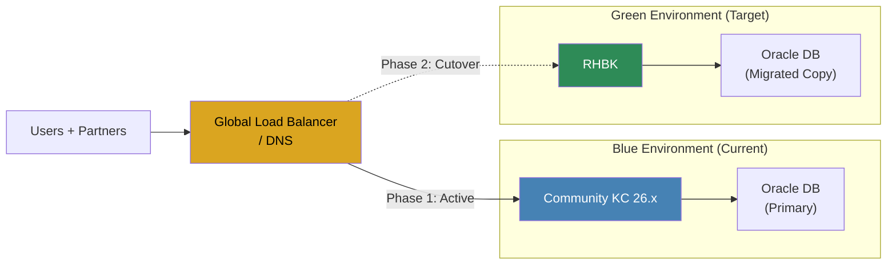
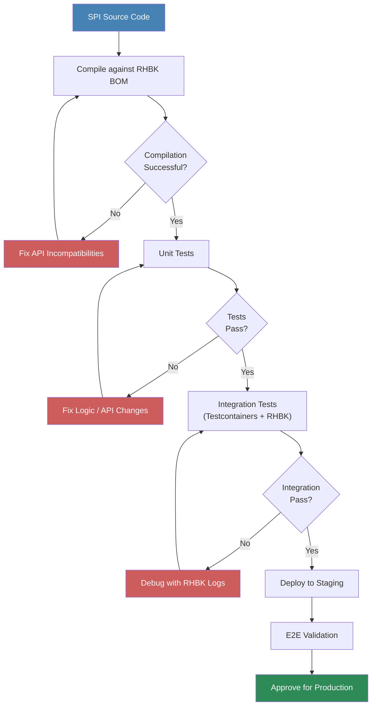
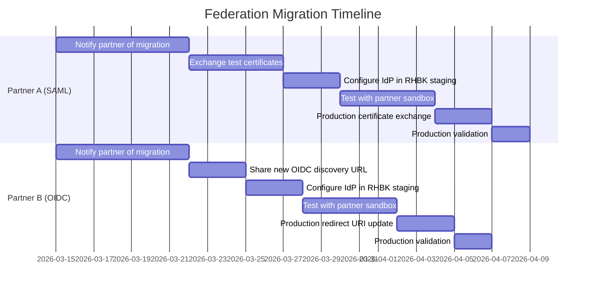
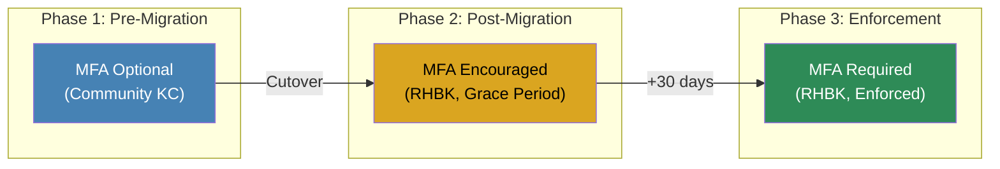

# 19 - Migration Strategy

> **Project:** Enterprise IAM Platform based on Keycloak
> **Related documents:** [03 - Transformation and Execution](./03-transformation-execution.md) | [04 - Keycloak Configuration](./04-keycloak-configuration.md) | [17 - Disaster Recovery](./17-disaster-recovery.md) | [18 - Testing Strategy](./18-testing-strategy.md)

---

## Table of Contents

- [1. Migration Overview](#1-migration-overview)
- [2. AS-IS Assessment](#2-as-is-assessment)
- [3. Migration Approach](#3-migration-approach)
- [4. Database Migration](#4-database-migration)
- [5. Custom SPI Migration](#5-custom-spi-migration)
- [6. Federation Migration](#6-federation-migration)
- [7. Theme Migration](#7-theme-migration)
- [8. Authentication Flow Migration](#8-authentication-flow-migration)
- [9. Cutover Plan](#9-cutover-plan)
- [10. Risk Mitigation](#10-risk-mitigation)
- [11. Validation and Sign-Off](#11-validation-and-sign-off)
- [12. Related Documents](#12-related-documents)

---

## 1. Migration Overview

### 1.1 Scope

This document defines the end-to-end migration strategy for transitioning the Enterprise Identity and Access Management (IAM) platform from **Community Keycloak 26.x** to **Red Hat Build of Keycloak (RHBK)** running on Google Kubernetes Engine (GKE) with Oracle Database as the persistence layer. The migration encompasses all identity artifacts, custom extensions, federated identity providers, themes, authentication flows, and supporting microservices.

### 1.2 Goals

| Goal | Description | Success Metric |
|------|-------------|----------------|
| G-1 | Zero-downtime migration for end users | No user-facing authentication failures during cutover window |
| G-2 | Full data integrity | 100% of users, roles, groups, clients, and sessions migrated without loss |
| G-3 | SPI compatibility | All custom Service Provider Interfaces (SPIs) compile and pass tests against RHBK APIs |
| G-4 | Federation continuity | Both B2B federated organizations authenticate successfully post-migration |
| G-5 | Compliance preservation | All audit logs, consent records, and security policies remain intact |
| G-6 | Rollback capability | Full rollback to Community Keycloak achievable within 30 minutes |

### 1.3 Constraints

- **Timeline:** Migration must complete within **Block A (4 months / 16 sprints)**, aligned with the execution roadmap defined in [03 - Transformation and Execution](./03-transformation-execution.md).
- **User base:** Approximately 400 active users across 2 B2B federated organizations.
- **Infrastructure:** GKE multi-region deployment (Belgium and Madrid) with Oracle Database backend.
- **Downtime tolerance:** Maximum 15-minute maintenance window for DNS cutover; all other operations must be non-disruptive.
- **Java runtime:** All custom SPIs target Java 17; RHBK must maintain compatibility.
- **Regulatory:** Audit trail continuity required; no gaps in authentication event logs.

### 1.4 Timeline Alignment

The migration aligns with the sprint-based delivery plan from [03 - Transformation and Execution](./03-transformation-execution.md):

| Sprint | Weeks | Migration Activity |
|--------|-------|--------------------|
| Sprint 1--2 | 1--4 | AS-IS assessment, environment provisioning, RHBK deployment in staging |
| Sprint 3--4 | 5--8 | Database migration dry-run, SPI recompilation, theme porting |
| Sprint 5--6 | 9--12 | Federation re-establishment, authentication flow migration, integration testing |
| Sprint 7--8 | 13--16 | Dress rehearsal cutover, UAT, production cutover, hypercare |

---

## 2. AS-IS Assessment

### 2.1 Current State Inventory

A thorough inventory of the existing Community Keycloak 26.x deployment is the prerequisite for a successful migration. The following categories must be catalogued before any migration activity begins.

#### 2.1.1 Keycloak Instance Details

| Attribute | Current Value |
|-----------|---------------|
| Keycloak version | Community 26.4.2 |
| Java runtime | OpenJDK 17 |
| Database | Oracle Database (multi-region) |
| Deployment platform | GKE (Belgium + Madrid) |
| High availability | Active-active across 2 regions |
| Infinispan cache | Embedded, cross-datacenter replication |
| TLS termination | Ingress controller (NGINX / Envoy) |

#### 2.1.2 Realm Inventory

Run the following command against the Keycloak Admin CLI to extract the full realm inventory:

```bash
# Export all realms (excluding users for initial assessment)
kcadm.sh get realms \
  --server https://keycloak.x-iam.internal \
  --realm master \
  --user admin \
  --password "${KC_ADMIN_PASSWORD}" \
  --fields id,realm,enabled,registrationAllowed,loginTheme,accountTheme,adminTheme,emailTheme \
  | jq '.' > realm-inventory.json
```

#### 2.1.3 Client Application Inventory

```bash
# List all clients per realm
for REALM in $(kcadm.sh get realms --fields realm --format csv --noquotes); do
  echo "=== Realm: ${REALM} ==="
  kcadm.sh get clients \
    -r "${REALM}" \
    --fields clientId,protocol,enabled,publicClient,serviceAccountsEnabled,directAccessGrantsEnabled \
    | jq '.'
done > client-inventory.json
```

#### 2.1.4 User and Group Statistics

| Category | Estimated Count |
|----------|----------------|
| Total users | ~400 |
| Federated users (IdP-linked) | ~350 |
| Local users (admin/service accounts) | ~50 |
| Groups | To be inventoried |
| Roles (realm-level) | To be inventoried |
| Roles (client-level) | To be inventoried |
| Required actions configured | To be inventoried |

#### 2.1.5 Custom SPI Inventory

| SPI Type | Name | Description | Source Location |
|----------|------|-------------|-----------------|
| User Storage Provider | JIT Provisioning SPI | Just-In-Time user provisioning from federated IdPs | `/keycloak/spi/jit-provisioner/` |
| Token Exchange Provider | WAS Token Exchange | Token exchange for WebSphere Application Server integration | `/keycloak/spi/token-exchange/` |
| Event Listener | Audit Event SPI | Extended audit logging to external systems | `/keycloak/spi/audit-events/` |
| Authenticator | Custom MFA Flow | Organization-specific multi-factor authentication logic | `/keycloak/spi/custom-mfa/` |

#### 2.1.6 Federation Configuration

| Federation Partner | Protocol | IdP Type | Users | Certificate Expiry |
|--------------------|----------|----------|-------|---------------------|
| Partner A | SAML 2.0 | Azure AD / Entra ID | ~200 | To be verified |
| Partner B | OIDC | Okta | ~150 | To be verified |

#### 2.1.7 Custom Themes

| Theme Type | Theme Name | Base Theme | Customizations |
|------------|-----------|------------|----------------|
| Login | x-iam-login | keycloak | Branding, CSS, FreeMarker templates |
| Account | x-iam-account | keycloak | Branding, CSS |
| Admin | x-iam-admin | keycloak | Minor branding |
| Email | x-iam-email | base | Custom email templates (HTML + text) |

#### 2.1.8 Authentication Flows

Document all custom authentication flows, including:

- Browser flow (with conditional OTP / WebAuthn)
- Direct grant flow
- First broker login flow (JIT provisioning)
- Post-broker login flow
- Registration flow (if enabled)
- Reset credentials flow

```bash
# Export authentication flows per realm
for REALM in $(kcadm.sh get realms --fields realm --format csv --noquotes); do
  kcadm.sh get authentication/flows -r "${REALM}" | jq '.' > "flows-${REALM}.json"
done
```

---

## 3. Migration Approach

### 3.1 Strategy Comparison

| Criteria | Big-Bang | Rolling | Blue-Green |
|----------|----------|---------|------------|
| Downtime | High (hours) | Low (minutes per node) | Near-zero |
| Complexity | Low | Medium | High |
| Rollback speed | Slow (restore from backup) | Medium | Fast (DNS switch) |
| Risk | High (single point of failure) | Medium | Low |
| Infrastructure cost | Low | Low | High (double infrastructure) |
| Data consistency | Simple | Complex (version skew) | Simple (single write DB) |
| Federation impact | Single outage window | Multiple brief disruptions | Transparent to partners |

### 3.2 Recommended Approach: Blue-Green Deployment

**Rationale:** Given the enterprise context, B2B federation dependencies, and the strict requirement for near-zero downtime, a **blue-green deployment** is the recommended migration strategy.



### 3.3 Blue-Green Migration Phases

**Phase 1 -- Parallel Build (Sprints 1--4):**

1. Provision the green environment on GKE (separate namespace or cluster).
2. Deploy RHBK with identical Helm chart configuration.
3. Clone the Oracle Database to the green environment.
4. Run Liquibase migrations to bring the schema to RHBK compatibility.
5. Deploy recompiled SPIs to the green environment.
6. Deploy migrated themes.

**Phase 2 -- Validation (Sprints 5--6):**

1. Run synthetic traffic against the green environment.
2. Execute the full integration test suite.
3. Validate federation with both B2B partners (using test accounts).
4. Perform load testing to confirm performance parity.

**Phase 3 -- Cutover (Sprint 7):**

1. Enable database replication from blue to green (final sync).
2. Set blue environment to read-only mode.
3. Perform final data synchronization.
4. Switch DNS / load balancer to green environment.
5. Validate all authentication flows.
6. Monitor for 24 hours (hypercare).

**Phase 4 -- Decommission (Sprint 8):**

1. Maintain blue environment in standby for 2 weeks.
2. Confirm no rollback is needed.
3. Decommission the blue environment.
4. Archive blue environment configuration and backups.

---

## 4. Database Migration

### 4.1 Oracle DB Schema Compatibility

Community Keycloak and RHBK share the same underlying Keycloak codebase, but RHBK may include backported patches or schema changes that differ from the community release cycle. The following process ensures schema compatibility.

#### 4.1.1 Schema Comparison Procedure

```bash
# Step 1: Export current schema from Community KC Oracle DB
expdp system/${DB_PASSWORD}@${ORACLE_SID} \
  schemas=KEYCLOAK \
  directory=DATA_PUMP_DIR \
  dumpfile=kc_community_schema.dmp \
  logfile=kc_community_export.log \
  content=METADATA_ONLY

# Step 2: Deploy RHBK against a clean Oracle DB to generate target schema
# (RHBK auto-creates schema on first boot)

# Step 3: Compare schemas using Oracle SQL Developer or SchemaCrawler
java -jar schemacrawler.jar \
  --server=oracle \
  --host=${DB_HOST} \
  --port=1521 \
  --database=${ORACLE_SID} \
  --schemas=KEYCLOAK \
  --user=keycloak \
  --password="${KC_DB_PASSWORD}" \
  --info-level=maximum \
  --command=schema \
  --output-format=html \
  --output-file=schema-report.html
```

### 4.2 Liquibase Changelog Analysis

Keycloak uses Liquibase for database schema management. Both Community KC and RHBK maintain changelogs that must be analyzed for divergence.

```bash
# Extract Liquibase changelog from Community KC
kubectl exec -n keycloak deploy/keycloak-community -- \
  find /opt/keycloak/lib/lib/main -name "*.changelog*.xml" \
  -exec cat {} \; > community-changelogs.xml

# Extract Liquibase changelog from RHBK
kubectl exec -n keycloak-green deploy/rhbk -- \
  find /opt/keycloak/lib/lib/main -name "*.changelog*.xml" \
  -exec cat {} \; > rhbk-changelogs.xml

# Compare changelogs
diff community-changelogs.xml rhbk-changelogs.xml > changelog-diff.txt
```

### 4.3 Data Migration Steps

| Step | Action | Validation |
|------|--------|------------|
| 1 | Create Oracle DB snapshot (RMAN backup) | Verify backup integrity with `VALIDATE BACKUPSET` |
| 2 | Restore snapshot to green environment | Confirm row counts match across all tables |
| 3 | Run RHBK Liquibase migrations | Verify `DATABASECHANGELOG` table has no failures |
| 4 | Validate foreign key integrity | Run constraint validation queries |
| 5 | Verify user credential data | Confirm password hashes are intact (test login) |
| 6 | Validate realm export/import consistency | Export realm from green, compare with blue |

### 4.4 Data Validation Scripts

```sql
-- Row count comparison across critical tables
SELECT 'USER_ENTITY' AS table_name, COUNT(*) AS row_count FROM USER_ENTITY
UNION ALL
SELECT 'REALM', COUNT(*) FROM REALM
UNION ALL
SELECT 'CLIENT', COUNT(*) FROM CLIENT
UNION ALL
SELECT 'CREDENTIAL', COUNT(*) FROM CREDENTIAL
UNION ALL
SELECT 'USER_ROLE_MAPPING', COUNT(*) FROM USER_ROLE_MAPPING
UNION ALL
SELECT 'USER_GROUP_MEMBERSHIP', COUNT(*) FROM USER_GROUP_MEMBERSHIP
UNION ALL
SELECT 'FEDERATED_IDENTITY', COUNT(*) FROM FEDERATED_IDENTITY
UNION ALL
SELECT 'IDENTITY_PROVIDER', COUNT(*) FROM IDENTITY_PROVIDER
UNION ALL
SELECT 'AUTHENTICATION_FLOW', COUNT(*) FROM AUTHENTICATION_FLOW
UNION ALL
SELECT 'AUTHENTICATION_EXECUTION', COUNT(*) FROM AUTHENTICATION_EXECUTION
UNION ALL
SELECT 'CLIENT_SCOPE', COUNT(*) FROM CLIENT_SCOPE
UNION ALL
SELECT 'PROTOCOL_MAPPER', COUNT(*) FROM PROTOCOL_MAPPER
ORDER BY table_name;
```

```sql
-- Verify no orphaned records exist after migration
SELECT 'Orphaned credentials' AS check_name, COUNT(*) AS count
FROM CREDENTIAL c
WHERE NOT EXISTS (SELECT 1 FROM USER_ENTITY u WHERE u.ID = c.USER_ID)
UNION ALL
SELECT 'Orphaned role mappings', COUNT(*)
FROM USER_ROLE_MAPPING urm
WHERE NOT EXISTS (SELECT 1 FROM USER_ENTITY u WHERE u.ID = urm.USER_ID)
UNION ALL
SELECT 'Orphaned group memberships', COUNT(*)
FROM USER_GROUP_MEMBERSHIP ugm
WHERE NOT EXISTS (SELECT 1 FROM USER_ENTITY u WHERE u.ID = ugm.USER_ID);
```

---

## 5. Custom SPI Migration

### 5.1 SPI API Compatibility

RHBK is built from the same upstream Keycloak source, but Red Hat may deprecate or modify certain SPI interfaces between releases. Every custom SPI must be validated against the RHBK API surface.

#### 5.1.1 Compatibility Checklist

| SPI | Interface | Community KC 26.x | RHBK Target | Action Required |
|-----|-----------|-------------------|-------------|-----------------|
| JIT Provisioning | `UserStorageProvider` | Supported | Supported | Recompile, verify `UserModel` API |
| Token Exchange | `TokenExchangeProvider` | Supported | Verify | Check for API changes in token exchange SPI |
| Audit Events | `EventListenerProvider` | Supported | Supported | Recompile, verify event type enums |
| Custom MFA | `Authenticator` | Supported | Supported | Recompile, verify `AuthenticationFlowContext` |

### 5.2 Recompilation Procedure

```bash
# Step 1: Update the parent POM to reference RHBK BOM (Bill of Materials)
cd /keycloak/spi/

# Step 2: Update pom.xml dependency management
cat <<'EOF' > pom-rhbk-override.xml
<dependencyManagement>
  <dependencies>
    <dependency>
      <groupId>com.redhat.keycloak</groupId>
      <artifactId>keycloak-parent</artifactId>
      <version>${rhbk.version}</version>
      <type>pom</type>
      <scope>import</scope>
    </dependency>
  </dependencies>
</dependencyManagement>
EOF

# Step 3: Compile all SPIs against RHBK dependencies
mvn clean compile -P rhbk \
  -Drhbk.version=${RHBK_VERSION} \
  -DskipTests

# Step 4: Run unit tests
mvn test -P rhbk \
  -Drhbk.version=${RHBK_VERSION}

# Step 5: Run integration tests against RHBK testcontainer
mvn verify -P rhbk,integration-tests \
  -Drhbk.version=${RHBK_VERSION} \
  -Dkeycloak.testcontainer.image=registry.redhat.io/rhbk/keycloak-rhel9:${RHBK_VERSION}
```

### 5.3 SPI Testing Strategy



### 5.4 Known API Changes to Watch

| Area | Potential Change | Mitigation |
|------|-----------------|------------|
| `UserModel` | Attribute access methods may change between versions | Use `UserModel.getFirstAttribute()` instead of deprecated variants |
| `TokenManager` | Token format or claim handling may differ | Validate JWT structure in integration tests |
| `RealmModel` | Realm settings accessors may be reorganized | Review RHBK Javadoc for breaking changes |
| `AuthenticationFlowContext` | Flow context methods may have new required parameters | Check RHBK release notes for authenticator SPI changes |
| `EventType` enum | New event types may be added; removed types cause compilation errors | Compile first, review enum diffs |

---

## 6. Federation Migration

### 6.1 Federation Re-establishment Strategy

Federated identity providers require careful coordination with external B2B partners. Certificates, metadata endpoints, and trust configurations must be re-validated in the RHBK environment.

#### 6.1.1 Partner Coordination Timeline



### 6.2 SAML Federation (Partner A)

| Configuration Item | Action Required |
|--------------------|-----------------|
| SP Metadata URL | Update partner with new RHBK SP metadata endpoint |
| SP Entity ID | Verify entity ID consistency (keep identical if possible) |
| Signing certificate | Export RHBK signing certificate, provide to partner |
| Encryption certificate | Export RHBK encryption certificate if assertion encryption is enabled |
| NameID format | Verify NameID format matches (e.g., `urn:oasis:names:tc:SAML:1.1:nameid-format:emailAddress`) |
| Attribute mapping | Validate attribute statements map correctly to Keycloak user attributes |
| Single Logout (SLO) | Test SLO flow end-to-end |

```bash
# Export RHBK SAML SP descriptor for Partner A
curl -s "https://rhbk-staging.x-iam.internal/realms/${REALM}/protocol/saml/descriptor" \
  > rhbk-sp-metadata.xml

# Validate metadata XML
xmllint --noout --schema saml-metadata-schema.xsd rhbk-sp-metadata.xml
```

### 6.3 OIDC Federation (Partner B)

| Configuration Item | Action Required |
|--------------------|-----------------|
| Discovery endpoint | Share new `/.well-known/openid-configuration` URL with partner |
| Client ID / Secret | Maintain identical client credentials or coordinate rotation |
| Redirect URIs | Update redirect URIs in partner's IdP if RHBK URL changes |
| Token endpoint auth | Verify `client_secret_post` vs `client_secret_basic` compatibility |
| Scopes | Confirm requested scopes (`openid`, `profile`, `email`) are available |
| JWKS endpoint | Verify RHBK JWKS endpoint is accessible to the partner |

```bash
# Verify OIDC discovery endpoint on RHBK
curl -s "https://rhbk-staging.x-iam.internal/realms/${REALM}/.well-known/openid-configuration" \
  | jq '{
    issuer,
    authorization_endpoint,
    token_endpoint,
    jwks_uri,
    userinfo_endpoint,
    end_session_endpoint
  }'
```

### 6.4 Federation Testing Checklist

| Test Case | Partner A (SAML) | Partner B (OIDC) |
|-----------|-----------------|-----------------|
| SP-initiated login | Pending | Pending |
| IdP-initiated login | Pending | N/A |
| Single Logout | Pending | Pending |
| Attribute mapping | Pending | Pending |
| JIT provisioning (first login) | Pending | Pending |
| Returning user login | Pending | Pending |
| Account linking | Pending | Pending |
| Session timeout handling | Pending | Pending |
| Certificate expiry simulation | Pending | N/A |
| Token refresh flow | N/A | Pending |

---

## 7. Theme Migration

### 7.1 Theme Compatibility Analysis

RHBK maintains compatibility with the Keycloak theme structure, but FreeMarker template changes between versions may break custom themes. The following analysis must be performed.

#### 7.1.1 FreeMarker Template Diff

```bash
# Extract default theme templates from Community KC
kubectl exec -n keycloak deploy/keycloak-community -- \
  tar czf - /opt/keycloak/lib/lib/main/org.keycloak.keycloak-themes-*.jar \
  | tar xzf - -C /tmp/community-themes/

# Extract default theme templates from RHBK
kubectl exec -n keycloak-green deploy/rhbk -- \
  tar czf - /opt/keycloak/lib/lib/main/org.keycloak.keycloak-themes-*.jar \
  | tar xzf - -C /tmp/rhbk-themes/

# Compare FreeMarker templates
diff -rq /tmp/community-themes/ /tmp/rhbk-themes/ \
  --include="*.ftl" > theme-template-diff.txt
```

### 7.2 Migration Steps per Theme Type

| Theme Type | Key Files | Migration Action |
|------------|-----------|-----------------|
| Login | `login.ftl`, `register.ftl`, `login-otp.ftl`, `login-webauthn.ftl` | Compare with RHBK base, merge custom blocks |
| Account | `account.ftl`, `password.ftl`, `totp.ftl` | Verify Account Console v3 compatibility |
| Admin | `index.ftl` | Minimal changes; verify admin console version |
| Email | `email-verification.ftl`, `password-reset.ftl`, `event-*.ftl` | Verify template variables unchanged |

### 7.3 CSS and Static Asset Migration

Custom CSS files and static assets (logos, icons, fonts) must be migrated to the RHBK theme directory structure.

```bash
# Copy custom theme to RHBK deployment
kubectl cp /keycloak/themes/x-iam-login/ \
  keycloak-green/rhbk-0:/opt/keycloak/themes/x-iam-login/

# Verify theme is detected
kubectl exec -n keycloak-green deploy/rhbk -- \
  /opt/keycloak/bin/kc.sh show-config | grep theme
```

### 7.4 Theme Validation

| Validation Item | Method |
|-----------------|--------|
| Login page renders correctly | Manual visual inspection + screenshot comparison |
| CSS loads without 404 errors | Browser DevTools network tab |
| FreeMarker variables resolve | Attempt login, check for template errors in logs |
| Responsive design intact | Test at 320px, 768px, 1024px, 1920px viewports |
| Dark/light theme support | Verify `prefers-color-scheme` media queries |
| Internationalization (i18n) | Verify all `messages_*.properties` files load correctly |

---

## 8. Authentication Flow Migration

### 8.1 Custom Flow Export and Import

Authentication flows are stored in the Keycloak database and can be exported as realm JSON. However, custom authenticator SPIs referenced in flows must be available in the target RHBK instance before import.

```bash
# Export realm with authentication flows
kcadm.sh get realms/${REALM} \
  --server https://keycloak.x-iam.internal \
  --realm master \
  --user admin \
  --password "${KC_ADMIN_PASSWORD}" \
  --fields 'authenticationFlows,authenticatorConfig,requiredActions' \
  | jq '.' > auth-flows-export.json

# Import to RHBK (after SPIs are deployed)
kcadm.sh update realms/${REALM} \
  --server https://rhbk-staging.x-iam.internal \
  --realm master \
  --user admin \
  --password "${RHBK_ADMIN_PASSWORD}" \
  -f auth-flows-export.json
```

### 8.2 MFA Rollout During Migration

The migration presents an opportunity to enhance Multi-Factor Authentication (MFA). The following phased approach minimizes user disruption.



### 8.3 Grace Period Strategy for 2FA Rollout

| Phase | Duration | Policy | User Experience |
|-------|----------|--------|-----------------|
| Pre-migration | Until cutover | MFA optional, OTP available | Users may optionally configure OTP |
| Grace period | 30 days post-cutover | MFA encouraged, skip allowed | Users prompted to set up MFA; can skip N times |
| Soft enforcement | Days 31--60 | MFA required for sensitive ops | MFA required for admin actions, optional for standard login |
| Full enforcement | Day 61+ | MFA required for all users | All users must authenticate with a second factor |

#### 8.3.1 Configuring the Grace Period

```bash
# Set the "Configure OTP" required action as default but not forced
kcadm.sh update realms/${REALM} \
  --server https://rhbk.x-iam.internal \
  --realm master \
  --user admin \
  --password "${RHBK_ADMIN_PASSWORD}" \
  -s 'defaultDefaultClientScopes=["openid","profile","email"]'

# Configure conditional OTP in the browser flow
kcadm.sh create authentication/flows/browser-with-mfa/executions/execution \
  -r ${REALM} \
  -s authenticator=conditional-user-configured \
  -s requirement=CONDITIONAL

# Add OTP form as conditional sub-flow
kcadm.sh create authentication/flows/browser-with-mfa/executions/execution \
  -r ${REALM} \
  -s authenticator=auth-otp-form \
  -s requirement=ALTERNATIVE
```

### 8.4 Authentication Flow Mapping

| Flow Name | Community KC Config | RHBK Config | Changes |
|-----------|--------------------|--------------| --------|
| Browser flow | Username/Password + Conditional OTP | Username/Password + Conditional OTP + WebAuthn | Add WebAuthn as alternative |
| First broker login | Review profile + JIT SPI | Review profile + JIT SPI | Verify SPI binding |
| Direct grant | Username/Password | Username/Password | No change expected |
| Reset credentials | Email link + new password | Email link + new password + OTP re-verify | Add OTP step |
| Registration | Disabled | Disabled | No change |

---

## 9. Cutover Plan

### 9.1 Cutover Timeline

```mermaid
gantt
    title Production Cutover Timeline
    dateFormat  HH:mm
    axisFormat  %H:%M

    section Pre-Cutover (T-4h)
    Final DB sync dry-run           :pc1, 18:00, 30min
    SPI deployment verification     :pc2, 18:30, 15min
    Federation endpoint check       :pc3, 18:45, 15min
    Notify stakeholders             :pc4, 19:00, 15min

    section Cutover Window (T-0)
    Enable DB read-only on blue     :co1, 20:00, 5min
    Final data synchronization      :co2, 20:05, 10min
    Validate row counts             :co3, 20:15, 5min
    Switch DNS to green             :co4, 20:20, 5min
    Verify DNS propagation          :co5, 20:25, 5min
    Smoke test authentication       :co6, 20:30, 10min
    Federation partner validation   :co7, 20:40, 10min
    Declare cutover complete        :co8, 20:50, 5min

    section Post-Cutover (T+1h)
    Monitor error rates             :po1, 21:00, 60min
    Stakeholder confirmation        :po2, 22:00, 15min
    Begin 24h hypercare             :po3, 22:15, 15min
```



### 9.2 Pre-Cutover Checklist

| Item | Owner | Status |
|------|-------|--------|
| RHBK deployed and healthy in green environment | Platform Team | Pending |
| All SPIs compiled, tested, and deployed to green | Development Team | Pending |
| Themes migrated and visually validated | Frontend Team | Pending |
| Authentication flows imported and tested | IAM Team | Pending |
| Federation tested with both B2B partners | IAM Team + Partners | Pending |
| Oracle DB snapshot taken (rollback point) | DBA Team | Pending |
| DNS TTL reduced to 60 seconds (48h before cutover) | Network Team | Pending |
| Rollback runbook reviewed and signed off | All Teams | Pending |
| Monitoring dashboards configured for green | SRE Team | Pending |
| Alerting rules active for green environment | SRE Team | Pending |
| Communication sent to all stakeholders | Project Manager | Pending |
| On-call rotation confirmed for hypercare | SRE Team | Pending |

### 9.3 Cutover Steps (Detailed)

**Step 1 -- Enable read-only on blue (T+0:00)**

```bash
# Set Community KC to maintenance mode
kubectl exec -n keycloak deploy/keycloak-community -- \
  /opt/keycloak/bin/kcadm.sh update realms/${REALM} \
  -s "loginTheme=maintenance" \
  --server https://localhost:8443 \
  --realm master \
  --user admin \
  --password "${KC_ADMIN_PASSWORD}"
```

**Step 2 -- Final data synchronization (T+0:05)**

```bash
# Oracle Data Guard switchover or RMAN incremental backup + restore
rman target / <<EOF
RUN {
  BACKUP INCREMENTAL LEVEL 1 DATABASE;
  SWITCH DATABASE TO COPY;
  RECOVER DATABASE;
}
EOF
```

**Step 3 -- Validate row counts (T+0:15)**

Execute the data validation SQL scripts from [Section 4.4](#44-data-validation-scripts).

**Step 4 -- Switch DNS (T+0:20)**

```bash
# Update Cloud DNS to point to green environment
gcloud dns record-sets update keycloak.x-iam.com \
  --rrdatas="${GREEN_LB_IP}" \
  --type=A \
  --ttl=60 \
  --zone=x-iam-zone

# Verify DNS propagation
watch -n 5 "dig +short keycloak.x-iam.com"
```

**Step 5 -- Smoke test (T+0:30)**

```bash
# Automated smoke test script
#!/usr/bin/env bash
set -euo pipefail

RHBK_URL="https://keycloak.x-iam.com"
REALM="x-iam"

# Test 1: OIDC Discovery
echo "[TEST] OIDC Discovery endpoint..."
HTTP_CODE=$(curl -s -o /dev/null -w "%{http_code}" \
  "${RHBK_URL}/realms/${REALM}/.well-known/openid-configuration")
[ "${HTTP_CODE}" = "200" ] && echo "PASS" || echo "FAIL"

# Test 2: Token endpoint (service account)
echo "[TEST] Service account token..."
TOKEN_RESPONSE=$(curl -s -X POST \
  "${RHBK_URL}/realms/${REALM}/protocol/openid-connect/token" \
  -d "grant_type=client_credentials" \
  -d "client_id=${TEST_CLIENT_ID}" \
  -d "client_secret=${TEST_CLIENT_SECRET}")
echo "${TOKEN_RESPONSE}" | jq -e '.access_token' > /dev/null && echo "PASS" || echo "FAIL"

# Test 3: Admin API
echo "[TEST] Admin API health..."
HTTP_CODE=$(curl -s -o /dev/null -w "%{http_code}" \
  "${RHBK_URL}/admin/master/console/")
[ "${HTTP_CODE}" = "200" ] && echo "PASS" || echo "FAIL"

# Test 4: SAML metadata
echo "[TEST] SAML SP metadata..."
HTTP_CODE=$(curl -s -o /dev/null -w "%{http_code}" \
  "${RHBK_URL}/realms/${REALM}/protocol/saml/descriptor")
[ "${HTTP_CODE}" = "200" ] && echo "PASS" || echo "FAIL"

echo "Smoke tests complete."
```

### 9.4 Rollback Procedure

If critical issues are detected during or after cutover, the following rollback procedure restores service on the blue (Community KC) environment.

**Rollback triggers:**

- Authentication failure rate exceeds 5% for more than 5 minutes.
- Any B2B federation partner reports complete authentication failure.
- Data corruption detected in RHBK database.
- Critical SPI failure causing user provisioning to fail.

**Rollback steps:**

| Step | Action | Duration |
|------|--------|----------|
| 1 | Declare rollback decision | 2 min |
| 2 | Switch DNS back to blue environment | 2 min |
| 3 | Disable maintenance mode on blue KC | 1 min |
| 4 | Verify DNS propagation to blue | 5 min |
| 5 | Run smoke tests against blue | 5 min |
| 6 | Notify stakeholders of rollback | 5 min |
| 7 | Post-incident review scheduled | -- |
| **Total** | | **~20 min** |

```bash
# Emergency rollback: switch DNS back to blue
gcloud dns record-sets update keycloak.x-iam.com \
  --rrdatas="${BLUE_LB_IP}" \
  --type=A \
  --ttl=60 \
  --zone=x-iam-zone

# Remove maintenance theme from blue
kubectl exec -n keycloak deploy/keycloak-community -- \
  /opt/keycloak/bin/kcadm.sh update realms/${REALM} \
  -s "loginTheme=x-iam-login" \
  --server https://localhost:8443 \
  --realm master \
  --user admin \
  --password "${KC_ADMIN_PASSWORD}"
```

---

## 10. Risk Mitigation

### 10.1 Migration-Specific Risks

| ID | Risk | Probability | Impact | Mitigation | Owner |
|----|------|-------------|--------|------------|-------|
| R-01 | SPI API incompatibility causes compilation failure | Medium | High | Early SPI recompilation in Sprint 1; maintain compatibility shim layer | Development Team |
| R-02 | Oracle DB schema divergence between Community KC and RHBK | Low | Critical | Schema comparison in Sprint 2; Liquibase changelog diff analysis | DBA Team |
| R-03 | Federation partner unable to update configuration in time | Medium | High | Begin partner coordination 6 weeks before cutover; provide test environment | IAM Team |
| R-04 | FreeMarker template breaking changes in RHBK themes | Medium | Medium | Template diff analysis; maintain fallback to default RHBK theme | Frontend Team |
| R-05 | DNS propagation delay exceeds maintenance window | Low | Medium | Reduce TTL to 60s 48 hours before cutover; use multiple DNS checks | Network Team |
| R-06 | User session loss during cutover | High | Medium | Accept session loss; users re-authenticate (transparent with SSO) | IAM Team |
| R-07 | JIT provisioning SPI fails for new federated users | Medium | High | Pre-test with synthetic federated users in staging | Development Team |
| R-08 | Token exchange service (WAS) incompatible with RHBK tokens | Medium | High | Validate JWT structure; test token exchange flow end-to-end | Development Team |
| R-09 | Performance degradation in RHBK under production load | Low | High | Load testing in Sprint 6; capacity planning review | SRE Team |
| R-10 | Rollback required but data written to green DB during cutover | Low | Critical | Keep blue DB read-only until rollback window closes (24h) | DBA Team |

### 10.2 Data Loss Prevention

| Safeguard | Description |
|-----------|-------------|
| Pre-cutover Oracle RMAN backup | Full database backup taken immediately before cutover begins |
| Blue environment preservation | Blue environment kept operational in standby for 14 days post-cutover |
| Audit log export | All authentication event logs exported from Community KC before decommission |
| Realm JSON export | Full realm export (including users) archived as JSON before cutover |
| Configuration Git history | All Keycloak configuration managed in Git; full history preserved |

### 10.3 Communication Plan

| Timing | Audience | Channel | Message |
|--------|----------|---------|---------|
| T-4 weeks | B2B federation partners | Email + meeting | Migration notification, timeline, action items |
| T-2 weeks | Internal stakeholders | Email + Slack | Migration schedule, expected impact, support contacts |
| T-1 week | All users | Email | Planned maintenance window, session re-authentication expected |
| T-4 hours | Operations team | Slack (war room) | Go/no-go decision, final checklist status |
| T+0 (cutover) | Operations team | Slack (war room) | Real-time cutover progress updates |
| T+1 hour | All stakeholders | Email | Cutover complete / rollback notification |
| T+24 hours | All stakeholders | Email | Hypercare status report |

---

## 11. Validation and Sign-Off

### 11.1 Post-Migration Validation Checklist

| Category | Validation Item | Method | Expected Result | Status |
|----------|----------------|--------|-----------------|--------|
| **Infrastructure** | RHBK pods healthy in both regions | `kubectl get pods` | All pods Running, 1/1 Ready | Pending |
| **Infrastructure** | Cross-region replication active | Infinispan metrics | Cache sync latency < 100ms | Pending |
| **Infrastructure** | Oracle DB connections stable | DB connection pool metrics | No connection timeouts | Pending |
| **Authentication** | Username/password login | Manual test | Successful login, JWT issued | Pending |
| **Authentication** | OTP/MFA flow | Manual test | OTP challenge presented and accepted | Pending |
| **Authentication** | Password reset flow | Manual test | Reset email sent, new password accepted | Pending |
| **Federation** | Partner A SAML login | Test with partner A account | SSO successful, attributes mapped | Pending |
| **Federation** | Partner B OIDC login | Test with partner B account | SSO successful, tokens exchanged | Pending |
| **Federation** | JIT provisioning | First login with new federated user | User created with correct attributes | Pending |
| **SPIs** | JIT Provisioning SPI | Federation login trigger | User provisioned via JIT microservice | Pending |
| **SPIs** | Token Exchange SPI | Token exchange API call | WAS-compatible token returned | Pending |
| **SPIs** | Audit Event SPI | Any authentication event | Event forwarded to external system | Pending |
| **Themes** | Login page rendering | Visual inspection | Corporate branding displayed correctly | Pending |
| **Themes** | Email templates | Trigger password reset | Branded email received | Pending |
| **API** | Admin REST API | API call from automation | 200 OK, expected JSON response | Pending |
| **API** | Token introspection | Introspect valid token | Active: true, correct claims | Pending |
| **Performance** | Login latency | Load test (100 concurrent) | P95 < 500ms | Pending |
| **Performance** | Token issuance rate | Load test | > 200 tokens/second sustained | Pending |
| **Observability** | Metrics flowing | Prometheus targets | All KC targets UP | Pending |
| **Observability** | Dashboards populated | Grafana | Keycloak dashboard shows data | Pending |
| **Observability** | Alerts firing correctly | Test alert trigger | Alert received in PagerDuty/Slack | Pending |

### 11.2 User Acceptance Testing (UAT)

UAT must be conducted with representatives from each stakeholder group before production cutover approval is granted.

| UAT Scenario | Tester Role | Priority | Pass Criteria |
|--------------|-------------|----------|---------------|
| Standard user login (local) | End user representative | Critical | Login succeeds, correct role assigned |
| Federated login (Partner A) | Partner A representative | Critical | SAML SSO completes, JIT provisioning works |
| Federated login (Partner B) | Partner B representative | Critical | OIDC SSO completes, token exchange works |
| Admin console access | IAM administrator | High | Full admin functionality available |
| API client authentication | Developer representative | High | Client credentials flow returns valid JWT |
| Password reset | End user representative | High | Email received, password updated successfully |
| MFA enrollment | End user representative | Medium | OTP setup completes, subsequent login requires OTP |
| Session timeout | End user representative | Medium | Session expires after configured idle time |
| Logout (single + global) | End user representative | Medium | User logged out of all applications |

### 11.3 Stakeholder Sign-Off Template

| Stakeholder | Role | Area of Responsibility | Sign-Off Date | Signature |
|-------------|------|----------------------|---------------|-----------|
| IAM Team Lead | Technical | Authentication flows, SPIs, federation | __________ | __________ |
| DBA Lead | Technical | Database migration integrity | __________ | __________ |
| SRE Lead | Technical | Infrastructure, monitoring, performance | __________ | __________ |
| Security Officer | Security | Compliance, audit trail, access controls | __________ | __________ |
| Partner A Contact | External | SAML federation functionality | __________ | __________ |
| Partner B Contact | External | OIDC federation functionality | __________ | __________ |
| Project Manager | Management | Timeline, scope, deliverables | __________ | __________ |
| X-IAM Product Owner | Business | Business requirements, user acceptance | __________ | __________ |

**Sign-Off Criteria:**

- All items in the post-migration validation checklist marked as "Pass."
- All UAT scenarios completed successfully.
- No Critical or High severity defects remain open.
- Rollback procedure tested and documented.
- Hypercare support schedule confirmed.

---

## 12. Related Documents

| Document | Description | Link |
|----------|-------------|------|
| 01 - Target Architecture | Phase 1 ideal architecture for the IAM platform | [01-target-architecture.md](./01-target-architecture.md) |
| 02 - Analysis and Design | Requirements, data models, and authentication flows | [02-analysis-and-design.md](./02-analysis-and-design.md) |
| 03 - Transformation and Execution | Implementation roadmap and sprint delivery plan | [03-transformation-execution.md](./03-transformation-execution.md) |
| 04 - Keycloak Configuration | Keycloak setup, realms, clients, and configuration | [04-keycloak-configuration.md](./04-keycloak-configuration.md) |
| 05 - Infrastructure as Code | Terraform, Kubernetes, and Docker configurations | [05-infrastructure-as-code.md](./05-infrastructure-as-code.md) |
| 07 - Security by Design | Security practices, OPA policies, and secrets management | [07-security-by-design.md](./07-security-by-design.md) |
| 08 - Authentication and Authorization | SAML, OIDC, JWT, MFA, and RBAC detailed configuration | [08-authentication-authorization.md](./08-authentication-authorization.md) |
| 10 - Observability | OpenTelemetry, Prometheus, and Grafana monitoring stack | [10-observability.md](./10-observability.md) |
| 11 - Keycloak Customization | Themes, SPIs, and email template customization | [11-keycloak-customization.md](./11-keycloak-customization.md) |
| 12 - Environment Management | Dev, QA, and Prod environment configuration | [12-environment-management.md](./12-environment-management.md) |
| 17 - Disaster Recovery | Disaster recovery procedures and RTO/RPO targets | [17-disaster-recovery.md](./17-disaster-recovery.md) |
| 18 - Testing Strategy | Testing framework, test types, and coverage requirements | [18-testing-strategy.md](./18-testing-strategy.md) |

---

> **Document version:** 1.0
> **Last updated:** 2026-03-07
> **Author:** Jorge Rodriguez, Ximplicity Software Solutions S.L.
> **Review status:** Draft -- pending stakeholder review
