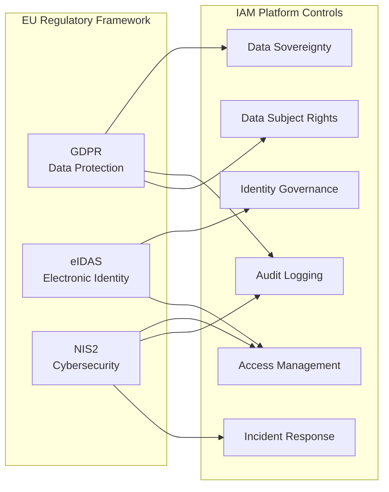
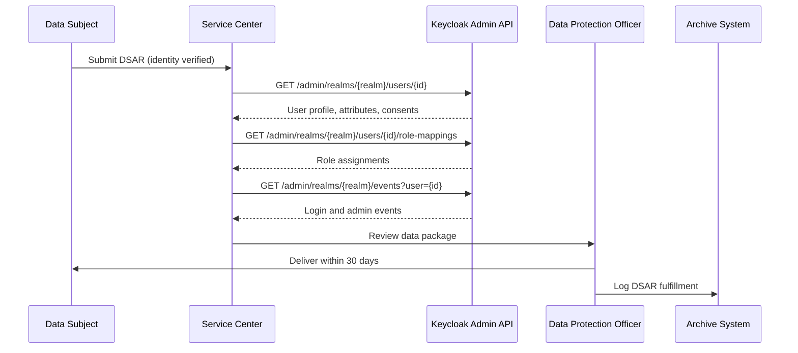
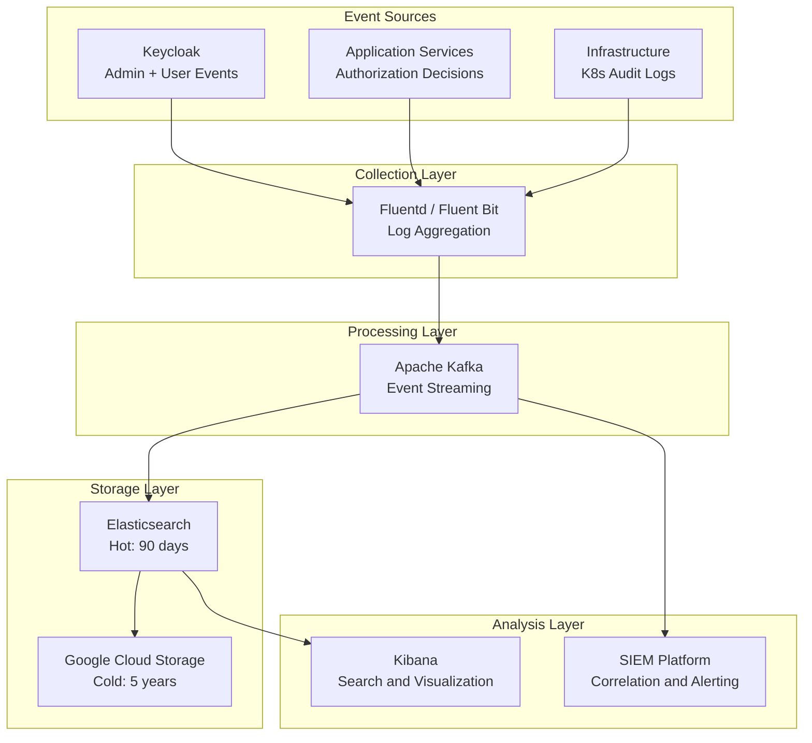
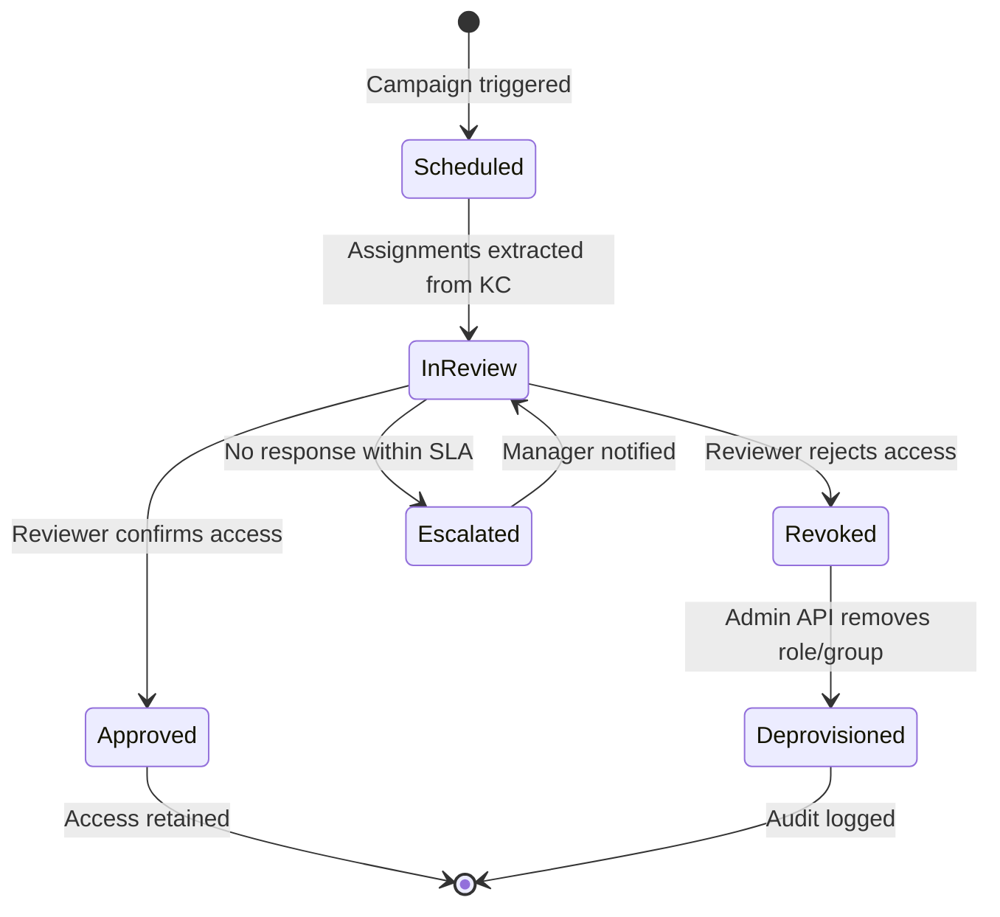
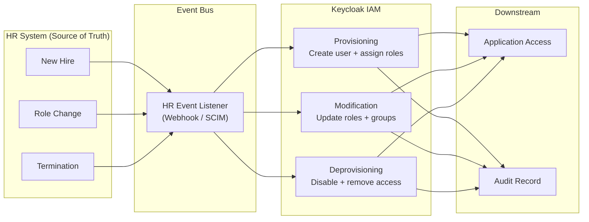
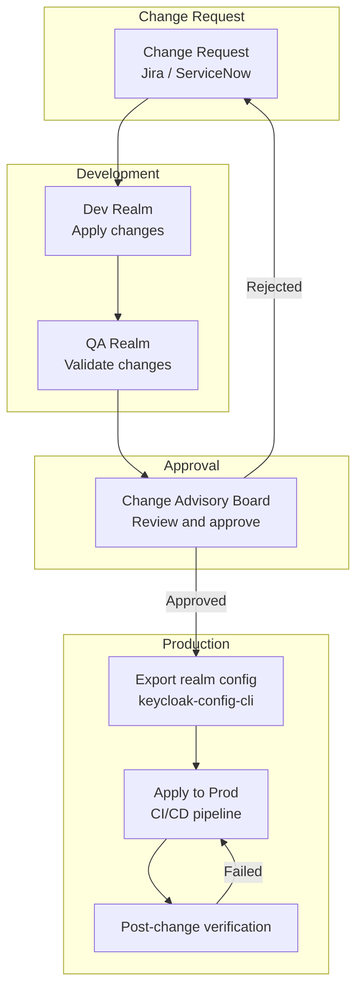
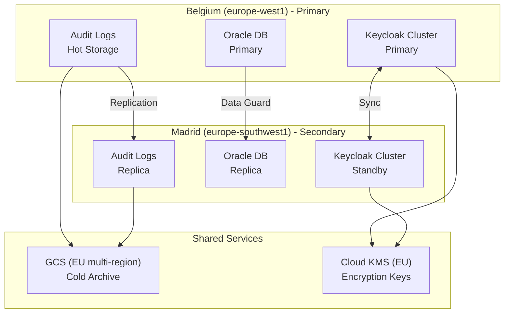
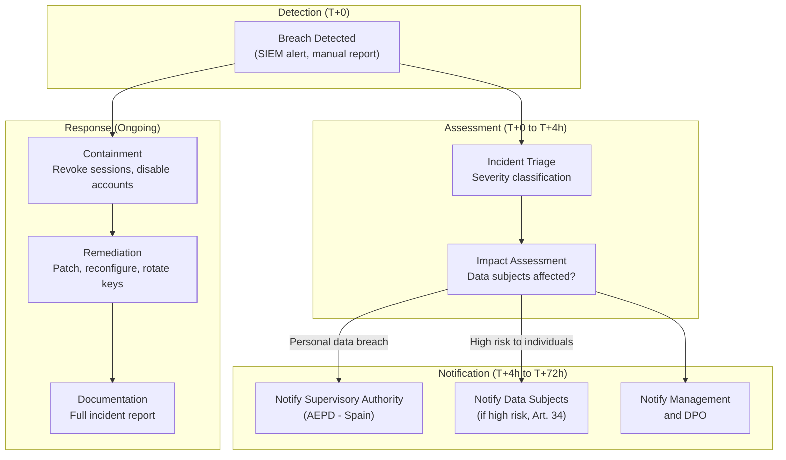

# 20 - Compliance and Governance

> **Project:** Enterprise IAM Platform based on Keycloak
> **Related documents:** [07 - Security by Design](./07-security-by-design.md) | [08 - Authentication and Authorization](./08-authentication-authorization.md) | [09 - User Lifecycle](./09-user-lifecycle.md) | [15 - Multi-Tenancy Design](./15-multi-tenancy-design.md)

---

## Table of Contents

1. [Compliance Framework Overview](#1-compliance-framework-overview)
2. [GDPR Compliance](#2-gdpr-compliance)
3. [Audit Trail and Logging](#3-audit-trail-and-logging)
4. [Access Governance](#4-access-governance)
5. [Identity Governance](#5-identity-governance)
6. [Change Management](#6-change-management)
7. [Security Certification Readiness](#7-security-certification-readiness)
8. [Data Sovereignty](#8-data-sovereignty)
9. [Incident Reporting](#9-incident-reporting)
10. [Governance Dashboard](#10-governance-dashboard)
11. [Related Documents](#11-related-documents)

---

## 1. Compliance Framework Overview

The IAM platform operates within the European Union regulatory landscape, serving an enterprise with infrastructure deployed across two GKE (Google Kubernetes Engine) regions -- Belgium (`europe-west1`) and Madrid (`europe-southwest1`). All compliance controls are designed to satisfy the requirements of the following regulatory frameworks simultaneously.

### 1.1 Applicable Regulations

| Regulation | Full Name | Scope for IAM | Key Obligations |
|------------|-----------|---------------|-----------------|
| **GDPR** | General Data Protection Regulation (EU 2016/679) | All personal data processed during authentication, authorization, and user lifecycle management | Data subject rights, consent, breach notification, DPO, DPIA |
| **eIDAS** | Electronic Identification, Authentication and Trust Services (EU 910/2014) | Electronic identification schemes, trust levels for federated identities | Assurance levels (Low, Substantial, High), cross-border recognition |
| **NIS2** | Network and Information Security Directive (EU 2022/2555) | IAM as critical infrastructure component for essential/important entities | Risk management, incident reporting, supply chain security |
| **DORA** | Digital Operational Resilience Act (EU 2022/2554) | ICT risk management for financial entities (if applicable) | ICT risk framework, incident classification, third-party risk |

### 1.2 Compliance Scope

The IAM platform processes the following categories of personal data:

- **Identity attributes**: usernames, email addresses, display names, phone numbers
- **Authentication credentials**: password hashes, OTP seeds, WebAuthn public keys
- **Session data**: login timestamps, IP addresses, user agent strings, session tokens
- **Federation data**: SAML assertions, OIDC tokens, federated identity provider mappings
- **Authorization data**: role assignments, group memberships, consent records

### 1.3 Regulatory Landscape



---

## 2. GDPR Compliance

### 2.1 Data Subject Rights Implementation

Keycloak natively supports several GDPR data subject rights through its Account Console and Admin API. The following table maps each right to its implementation mechanism.

| GDPR Right | Article | Keycloak Implementation | Automation Level |
|------------|---------|------------------------|------------------|
| Right of Access | Art. 15 | Account Console self-service + Admin REST API `/admin/realms/{realm}/users/{id}` | Fully automated |
| Right to Rectification | Art. 16 | Account Console profile editing + Admin API `PUT /users/{id}` | Fully automated |
| Right to Erasure | Art. 17 | Admin API `DELETE /users/{id}` + custom SPI for cascading deletion | Semi-automated |
| Right to Portability | Art. 20 | Custom REST endpoint exporting user data as JSON | Custom SPI |
| Right to Restrict Processing | Art. 18 | User attribute `gdpr_processing_restricted=true` + custom authenticator check | Custom SPI |
| Right to Object | Art. 21 | Consent withdrawal via Account Console | Fully automated |

### 2.2 Data Subject Access Request (DSAR) Workflow



### 2.3 Right to Erasure Implementation

The erasure process must cascade across all systems that hold personal data originating from the IAM platform. Keycloak's `DELETE /users/{id}` removes the user record, but additional cleanup is required.

```yaml
# Erasure cascade checklist
erasure_cascade:
  keycloak:
    - user_entity: "DELETE via Admin API"
    - user_sessions: "Automatically invalidated on deletion"
    - user_consents: "Cascaded by Keycloak"
    - offline_tokens: "Revoked on deletion"
    - federated_identities: "Unlinked on deletion"
  external_systems:
    - audit_logs: "Pseudonymized (user ID replaced with hash)"
    - application_databases: "Notified via event listener SPI"
    - backup_systems: "Marked for exclusion in next rotation cycle"
  retention_exceptions:
    - legal_hold: "Preserved if under legal hold order"
    - regulatory_retention: "Minimum 5 years for financial audit trails"
```

### 2.4 Consent Management

Keycloak's built-in consent mechanism is extended with custom attributes to track granular consent records:

| Attribute | Type | Purpose |
|-----------|------|---------|
| `consent_marketing` | Boolean | Marketing communications consent |
| `consent_analytics` | Boolean | Analytics and profiling consent |
| `consent_third_party` | Boolean | Third-party data sharing consent |
| `consent_timestamp` | ISO 8601 | Timestamp of last consent action |
| `consent_version` | String | Version of the privacy policy accepted |
| `consent_method` | String | How consent was obtained (web, API, federated) |

### 2.5 Data Processing Records (Article 30)

The platform maintains a Record of Processing Activities (ROPA) for all IAM-related data processing:

| Processing Activity | Legal Basis | Data Categories | Retention Period | Recipients |
|---------------------|-------------|-----------------|------------------|------------|
| User authentication | Legitimate interest (Art. 6(1)(f)) | Credentials, session data | Session duration + 90 days | Internal systems |
| User provisioning | Contract performance (Art. 6(1)(b)) | Identity attributes | Duration of employment + 1 year | HR system, downstream apps |
| Audit logging | Legal obligation (Art. 6(1)(c)) | Login events, admin events | 5 years | SIEM, compliance team |
| Federation (B2B) | Contract performance (Art. 6(1)(b)) | Federated identity assertions | Duration of partnership | Partner IdP |
| Consent records | Consent (Art. 6(1)(a)) | Consent preferences | Until withdrawal + 3 years | DPO |

### 2.6 Data Protection Officer (DPO) Coordination

The IAM platform team coordinates with the DPO through structured interfaces:

- **Quarterly DPIA reviews**: Data Protection Impact Assessment for new features or integrations
- **Breach notification channel**: Dedicated Slack/Teams channel with automated alerts from SIEM
- **DSAR tracking**: Shared ticketing queue with SLA monitoring (30-day response deadline)
- **Annual privacy audit**: Full review of IAM data processing against ROPA entries

---

## 3. Audit Trail and Logging

### 3.1 Keycloak Event Types

Keycloak generates two categories of events that form the foundation of the audit trail.

#### Admin Events

Admin events capture all administrative operations performed through the Admin Console or Admin API.

| Event Category | Examples | Retention |
|----------------|----------|-----------|
| Realm management | Create/update/delete realm, update realm settings | 5 years |
| User management | Create/update/delete user, reset credentials | 5 years |
| Client management | Register/update/delete client, update client scopes | 5 years |
| Role management | Create/update/delete role, assign/revoke role | 5 years |
| Identity provider | Add/update/delete IdP, update mappers | 5 years |
| Authentication flows | Modify flows, update bindings, configure MFA | 5 years |

#### User Events (Login Events)

| Event Type | Description | Retention |
|------------|-------------|-----------|
| `LOGIN` | Successful user authentication | 2 years |
| `LOGIN_ERROR` | Failed authentication attempt | 2 years |
| `LOGOUT` | User-initiated logout | 1 year |
| `CODE_TO_TOKEN` | Authorization code exchange | 1 year |
| `REFRESH_TOKEN` | Token refresh | 90 days |
| `REGISTER` | Self-registration | 5 years |
| `UPDATE_PROFILE` | Profile attribute change | 5 years |
| `UPDATE_PASSWORD` | Password change | 5 years |
| `GRANT_CONSENT` | Consent granted to client | 5 years |
| `REVOKE_CONSENT` | Consent revoked from client | 5 years |
| `IMPERSONATE` | Admin impersonation of user | 5 years |

### 3.2 Keycloak Event Configuration

```json
{
  "eventsEnabled": true,
  "eventsExpiration": 63072000,
  "eventsListeners": [
    "jboss-logging",
    "custom-audit-spi"
  ],
  "enabledEventTypes": [
    "LOGIN", "LOGIN_ERROR", "LOGOUT",
    "CODE_TO_TOKEN", "CODE_TO_TOKEN_ERROR",
    "REFRESH_TOKEN", "REFRESH_TOKEN_ERROR",
    "REGISTER", "UPDATE_PROFILE", "UPDATE_PASSWORD",
    "GRANT_CONSENT", "REVOKE_CONSENT",
    "IMPERSONATE", "CUSTOM_REQUIRED_ACTION",
    "SEND_VERIFY_EMAIL", "VERIFY_EMAIL"
  ],
  "adminEventsEnabled": true,
  "adminEventsDetailsEnabled": true
}
```

### 3.3 Audit Log Architecture



### 3.4 Tamper-Proof Logging

Audit logs are protected against tampering through multiple mechanisms:

| Control | Implementation | Purpose |
|---------|----------------|---------|
| Immutable storage | GCS with Object Lock (retention policy) | Prevent deletion or modification |
| Log signing | SHA-256 hash chain across log entries | Detect tampering |
| Separate credentials | Logging service account with write-only permissions | Prevent log deletion by admins |
| Network isolation | Logging pipeline in dedicated namespace with NetworkPolicy | Prevent unauthorized access |
| Access audit | Kubernetes RBAC audit for log access | Track who reads audit logs |

### 3.5 SIEM Integration

The platform forwards structured audit events to the enterprise SIEM for correlation and alerting:

```yaml
# Fluent Bit output configuration for SIEM integration
apiVersion: v1
kind: ConfigMap
metadata:
  name: fluent-bit-siem-output
  namespace: logging
data:
  output.conf: |
    [OUTPUT]
        Name              forward
        Match             keycloak.audit.*
        Host              siem-collector.internal
        Port              24224
        tls               On
        tls.verify        On
        tls.ca_file       /certs/ca.crt
        Retry_Limit       5

    [OUTPUT]
        Name              gcs
        Match             keycloak.audit.*
        Bucket            iam-audit-logs-archive
        Region            europe-west1
        Path              keycloak/audit/%Y/%m/%d/
        Object_key        %Y%m%d-%H%M%S-${tag}.log
        Compress          gzip
        Content_Type      application/json
```

---

## 4. Access Governance

### 4.1 Role Certification Campaigns

Access reviews are conducted on a regular schedule to ensure that role assignments remain appropriate and aligned with the principle of least privilege.

| Campaign Type | Frequency | Scope | Reviewer | SLA |
|---------------|-----------|-------|----------|-----|
| Privileged roles | Monthly | `realm-admin`, `manage-users`, `manage-clients` | Security Officer | 5 business days |
| Application roles | Quarterly | All client-level role mappings | Application Owner | 10 business days |
| Group memberships | Quarterly | All group assignments | Group Owner / Manager | 10 business days |
| Federated access | Semi-annually | B2B federated identity mappings | Partnership Manager | 15 business days |
| Service accounts | Quarterly | All service account credentials and roles | Platform Team Lead | 10 business days |

### 4.2 Access Review Workflow



### 4.3 Segregation of Duties (SoD)

Conflicting role combinations are identified and enforced through OPA (Open Policy Agent) policies integrated with Keycloak's authorization services. See [07 - Security by Design](./07-security-by-design.md) for OPA/Gatekeeper configuration details.

| Conflicting Role A | Conflicting Role B | Risk | Mitigation |
|--------------------|--------------------|------|------------|
| `realm-admin` | `audit-viewer` | Admin could suppress audit evidence | Separate identities required |
| `user-manager` | `role-manager` | Could create user and assign privileged roles | Dual approval workflow |
| `client-admin` | `token-exchange` | Could configure client and exchange tokens | Break-glass only with justification |
| `idp-manager` | `user-manager` | Could create federated IdP and link users | Requires Security Officer approval |

### 4.4 Privileged Access Management (PAM)

Administrative access to Keycloak is governed through a tiered privilege model:

| Tier | Scope | Access Method | Session Duration | MFA Required |
|------|-------|---------------|------------------|--------------|
| **Tier 0** | Super Admin (master realm) | Break-glass only, hardware token | 15 minutes | Hardware key (FIDO2) |
| **Tier 1** | Realm Admin | JIT (Just-in-Time) elevation via approval | 1 hour | TOTP + hardware key |
| **Tier 2** | Client/User Admin | Standard RBAC assignment | 8 hours | TOTP |
| **Tier 3** | Read-only / Audit Viewer | Permanent assignment | 8 hours | TOTP |

```yaml
# Keycloak realm configuration for Tier 0 break-glass access
breakGlassPolicy:
  realm: master
  requiredActions:
    - VERIFY_HARDWARE_KEY
    - ACKNOWLEDGE_AUDIT
  sessionMaxLifespan: 900          # 15 minutes
  sessionIdleTimeout: 300          # 5 minutes
  conditions:
    - ipWhitelist: ["10.0.0.0/8"]  # Internal network only
    - timeRestriction: "08:00-20:00 CET"
  notifications:
    - channel: security-alerts
    - recipients: ["security-officer@x-iam.eu", "ciso@x-iam.eu"]
```

---

## 5. Identity Governance

### 5.1 Joiner-Mover-Leaver (JML) Processes

The identity lifecycle is tightly integrated with HR systems to ensure that identity states in Keycloak reflect organizational reality at all times.



### 5.2 Joiner Process

| Step | Action | System | SLA |
|------|--------|--------|-----|
| 1 | HR creates employee record | HR System | Day 0 |
| 2 | Provisioning event triggered | Event Bus (SCIM / webhook) | < 5 minutes |
| 3 | Keycloak user created with base attributes | Keycloak Admin API | < 1 minute |
| 4 | Default roles assigned based on department/job code | Keycloak role mapping | < 1 minute |
| 5 | Welcome email with credential setup link | Keycloak required actions | Immediate |
| 6 | MFA enrollment enforced on first login | Keycloak authentication flow | First login |

### 5.3 Mover Process

When an employee changes department, role, or location, the following adjustments are applied:

- Previous department group membership is **removed**
- New department group membership is **added**
- Application-level roles are **reviewed** by new manager (access review triggered)
- Location-based policies are **updated** (e.g., region-specific data access)
- All changes are **logged** as admin events with the HR event correlation ID

### 5.4 Leaver Process

| Step | Action | Timing | Reversible |
|------|--------|--------|------------|
| 1 | User account **disabled** (enabled=false) | Termination date, T+0 | Yes (within 30 days) |
| 2 | All active sessions **invalidated** | T+0 | No |
| 3 | All offline tokens **revoked** | T+0 | No |
| 4 | All client consents **revoked** | T+0 | No |
| 5 | Federated identity links **removed** | T+0 | No |
| 6 | User moved to `leavers` group | T+0 | Yes |
| 7 | User data **exported** for DSAR archive | T+7 days | N/A |
| 8 | User account **deleted** | T+90 days | No |
| 9 | Audit records **pseudonymized** | T+90 days | No |

### 5.5 Orphan Account Detection

Orphan accounts -- those without a corresponding active record in the HR system -- are identified through a scheduled reconciliation job.

```yaml
# CronJob for orphan account detection
apiVersion: batch/v1
kind: CronJob
metadata:
  name: iam-orphan-detector
  namespace: iam
spec:
  schedule: "0 2 * * 0"  # Weekly, Sunday 02:00 UTC
  jobTemplate:
    spec:
      template:
        spec:
          containers:
            - name: orphan-detector
              image: registry.internal/iam-tools/orphan-detector:1.4.0
              env:
                - name: KC_BASE_URL
                  value: "https://auth.x-iam.eu"
                - name: KC_REALM
                  value: "x-iam"
                - name: HR_API_URL
                  valueFrom:
                    secretKeyRef:
                      name: hr-integration
                      key: api-url
                - name: ALERT_CHANNEL
                  value: "iam-governance"
              resources:
                limits:
                  memory: "256Mi"
                  cpu: "250m"
          restartPolicy: OnFailure
```

Detected orphan accounts are flagged with the user attribute `orphan_detected=true` and `orphan_detected_date={ISO8601}`, and an alert is sent to the governance team for review.

---

## 6. Change Management

### 6.1 Realm Configuration Change Control

All changes to Keycloak realm configuration must follow a controlled process to prevent unauthorized or untested modifications from reaching production.



### 6.2 Change Classification

| Change Type | Risk Level | Approval Required | Examples |
|-------------|------------|-------------------|----------|
| **Standard** | Low | Auto-approved (pre-authorized) | Add user, assign existing role |
| **Normal** | Medium | Team lead + security review | New client registration, new authentication flow |
| **Major** | High | CAB approval + DPO review | New federated IdP, realm policy change, MFA policy change |
| **Emergency** | Critical | Post-hoc approval (break-glass) | Security incident response, critical hotfix |

### 6.3 Configuration as Code

Realm configurations are managed as code using `keycloak-config-cli` and stored in Git. Every change produces a diff that is reviewed as part of the merge request process.

```yaml
# Example: realm configuration managed via keycloak-config-cli
realm: x-iam
displayName: "X-IAM Production"
enabled: true
sslRequired: external
registrationAllowed: false
loginWithEmailAllowed: true
duplicateEmailsAllowed: false
bruteForceProtected: true
maxFailureWaitSeconds: 900
failureFactor: 5
passwordPolicy: >-
  length(12) and
  digits(1) and
  upperCase(1) and
  lowerCase(1) and
  specialChars(1) and
  notUsername and
  passwordHistory(5)
```

### 6.4 Rollback Procedures

| Scenario | Rollback Method | RTO |
|----------|----------------|-----|
| Realm config error | Revert Git commit + re-run `keycloak-config-cli` | < 15 minutes |
| Authentication flow break | Restore previous flow binding via Admin API | < 5 minutes |
| Federated IdP misconfiguration | Disable IdP via Admin API, restore from Git | < 10 minutes |
| Database corruption | Restore from Oracle RMAN backup (point-in-time) | < 2 hours |
| Full platform failure | Failover to secondary region (Madrid/Belgium) | < 30 minutes |

---

## 7. Security Certification Readiness

### 7.1 ISO 27001 Alignment

The IAM platform maps its controls to ISO 27001:2022 Annex A controls relevant to identity and access management.

| ISO 27001 Control | Control Title | IAM Implementation | Evidence |
|-------------------|---------------|-------------------|----------|
| A.5.15 | Access control | Keycloak RBAC + OPA policies | Role mapping exports, OPA policy files |
| A.5.16 | Identity management | JML processes, SCIM provisioning | HR integration logs, provisioning audit trail |
| A.5.17 | Authentication information | Password policy, MFA enforcement | Realm configuration export |
| A.5.18 | Access rights | Quarterly access reviews | Certification campaign reports |
| A.8.2 | Privileged access rights | Tiered PAM model, JIT elevation | Break-glass logs, elevation audit trail |
| A.8.3 | Information access restriction | Client-level role mappings, scope restrictions | Authorization policy exports |
| A.8.5 | Secure authentication | OIDC/SAML federation, FIDO2, TOTP | Authentication flow configuration |
| A.8.15 | Logging | Keycloak events, K8s audit logs, SIEM | Log retention reports, SIEM dashboards |
| A.8.16 | Monitoring activities | Real-time alerting on anomalous login patterns | SIEM correlation rules, alert history |

### 7.2 SOC 2 Considerations

For clients requiring SOC 2 Type II attestation, the IAM platform provides evidence against the Trust Services Criteria (TSC):

| TSC Category | Relevant Controls | Evidence Artifacts |
|--------------|-------------------|-------------------|
| **Security** (CC6) | Authentication, authorization, encryption | Realm config, TLS certificates, OPA policies |
| **Availability** (A1) | Multi-region deployment, failover | GKE cluster config, DR runbooks, RTO/RPO metrics |
| **Processing Integrity** (PI1) | Input validation, token verification | Custom SPI code, integration test results |
| **Confidentiality** (C1) | Encryption at rest/transit, secret management | GCP KMS config, Kubernetes Secrets, Vault policies |
| **Privacy** (P1-P8) | GDPR compliance, consent, data retention | ROPA, consent records, DSAR logs |

### 7.3 Evidence Collection Automation

```yaml
# Scheduled evidence collection for audit readiness
evidence_collection:
  schedule: "0 3 1 * *"  # Monthly, 1st day at 03:00 UTC
  artifacts:
    - name: realm_configuration
      source: "keycloak-config-cli export"
      destination: "gs://iam-compliance-evidence/{year}/{month}/realm-config.json"

    - name: role_assignments
      source: "Admin API /role-mappings (all users)"
      destination: "gs://iam-compliance-evidence/{year}/{month}/role-assignments.csv"

    - name: access_review_results
      source: "Governance DB certification_campaigns table"
      destination: "gs://iam-compliance-evidence/{year}/{month}/access-reviews.pdf"

    - name: audit_log_summary
      source: "Elasticsearch aggregation query"
      destination: "gs://iam-compliance-evidence/{year}/{month}/audit-summary.json"

    - name: vulnerability_scan
      source: "Trivy container scan results"
      destination: "gs://iam-compliance-evidence/{year}/{month}/vulnerability-report.html"

    - name: password_policy
      source: "Realm passwordPolicy attribute"
      destination: "gs://iam-compliance-evidence/{year}/{month}/password-policy.txt"
```

---

## 8. Data Sovereignty

### 8.1 Multi-Region Data Residency

The platform operates across two GKE regions within the European Union, ensuring that all personal data remains within EU borders at all times.



### 8.2 Data Residency Controls

| Data Type | Storage Location | Encryption | Transfer Restrictions |
|-----------|-----------------|------------|----------------------|
| User identity data | Oracle DB (Belgium primary, Madrid replica) | AES-256 at rest, TLS 1.3 in transit | EU-only, no third-country transfers |
| Session tokens | Keycloak Infinispan cache (in-memory, per-region) | Encrypted cluster transport | Region-local, replicated within EU |
| Audit logs (hot) | Elasticsearch (per-region) | Encrypted indices | EU-only |
| Audit logs (cold) | GCS `eu` multi-region | CMEK via Cloud KMS (EU key ring) | EU-only, Object Lock enabled |
| Encryption keys | Cloud KMS (`europe-west1`, `europe-southwest1`) | HSM-backed | EU-only, never exported |
| Backups | GCS `eu` multi-region | CMEK | EU-only, retention-locked |

### 8.3 Cross-Border Data Transfer

For the two federated B2B organizations, data flows are governed by:

- **Intra-EU transfers**: No additional safeguards required (GDPR free movement within EEA)
- **SAML assertions**: Contain only the minimum attributes required for authentication (data minimization)
- **Token claims**: Scoped to the specific client application, no unnecessary personal data in JWT payloads
- **Federation metadata**: Exchanged over mTLS channels, no personal data in metadata documents

### 8.4 Data Classification

| Classification Level | Description | IAM Data Examples | Controls |
|---------------------|-------------|-------------------|----------|
| **Confidential** | Highly sensitive, business-critical | Admin credentials, master realm config, encryption keys | HSM storage, Tier 0 access only |
| **Restricted** | Personal data, access-controlled | User profiles, email addresses, authentication events | RBAC, encryption, audit logging |
| **Internal** | Business data, not publicly available | Role definitions, client configurations, group structures | RBAC, standard access controls |
| **Public** | Intentionally public information | OIDC discovery endpoints, realm public keys | No special controls |

---

## 9. Incident Reporting

### 9.1 GDPR 72-Hour Breach Notification

Under GDPR Article 33, personal data breaches must be reported to the Supervisory Authority within 72 hours of becoming aware of the breach, unless the breach is unlikely to result in a risk to individuals.



### 9.2 NIS2 Incident Reporting

Under NIS2, significant incidents must be reported to the national CSIRT (Computer Security Incident Response Team) following this timeline:

| Deadline | Report Type | Content |
|----------|-------------|---------|
| **24 hours** | Early warning | Suspected significant incident, cross-border impact assessment |
| **72 hours** | Incident notification | Severity, impact, initial assessment of cause |
| **1 month** | Final report | Root cause analysis, remediation measures, lessons learned |

### 9.3 Incident Classification for IAM

| Severity | Description | Examples | Response SLA |
|----------|-------------|----------|--------------|
| **P1 - Critical** | Complete IAM service outage or confirmed data breach | Database compromise, admin credential leak, both regions down | Immediate (< 15 min) |
| **P2 - High** | Partial service degradation or suspected breach | Single region failure, brute force attack in progress, suspicious admin activity | < 1 hour |
| **P3 - Medium** | Security concern without immediate impact | Failed access review, orphan accounts detected, certificate expiring | < 4 hours |
| **P4 - Low** | Minor issue, no security impact | Configuration drift detected, non-critical alert threshold | Next business day |

### 9.4 IAM-Specific Incident Playbooks

| Incident Type | Containment Actions | Keycloak API Calls |
|---------------|--------------------|--------------------|
| **Credential compromise** | Disable user, revoke sessions, force password reset | `PUT /users/{id}` (enabled=false), `POST /users/{id}/logout` |
| **Token theft** | Revoke all tokens for client, rotate client secret | `POST /clients/{id}/client-secret`, invalidate sessions |
| **Admin account compromise** | Disable account, revoke realm-admin role, audit all recent admin events | `DELETE /users/{id}/role-mappings/realm`, review admin events |
| **Federated IdP compromise** | Disable IdP, revoke all federated sessions | `PUT /identity-provider/instances/{alias}` (enabled=false) |
| **Mass brute force** | Enable IP blocklist, increase failure factor, enable CAPTCHA | Update realm brute force config via Admin API |

---

## 10. Governance Dashboard

### 10.1 Key Performance Indicators (KPIs)

The IAM governance dashboard tracks the following KPIs, reported on a monthly basis to the Security Officer, DPO, and CISO.

| KPI | Target | Measurement Source | Alert Threshold |
|-----|--------|-------------------|-----------------|
| DSAR response time | < 30 days | Ticketing system | > 20 days |
| Access review completion rate | > 95% | Certification campaign tool | < 90% |
| Orphan account count | 0 | Orphan detector job | > 5 |
| MFA enrollment rate | 100% | Keycloak user attributes | < 98% |
| Failed login rate | < 5% of total logins | Keycloak login events | > 10% |
| Privileged account count | < 10 | Keycloak role mappings | > 15 |
| Average session duration | < 8 hours | Keycloak session data | > 12 hours |
| Password policy compliance | 100% | Keycloak password policy | < 100% |
| Configuration drift incidents | 0 per month | Config-as-code diff | > 0 |
| Time to deprovision (leaver) | < 4 hours | JML automation logs | > 24 hours |
| Consent coverage | 100% of active users | Consent attribute query | < 95% |

### 10.2 Compliance Scorecard

The scorecard provides a summary view of compliance posture across all applicable regulations.

| Domain | GDPR | eIDAS | NIS2 | ISO 27001 | Status |
|--------|------|-------|------|-----------|--------|
| Data subject rights | Art. 15-22 | -- | -- | A.5.15 | Implemented |
| Consent management | Art. 6-7 | -- | -- | -- | Implemented |
| Audit logging | Art. 30 | -- | Art. 23 | A.8.15 | Implemented |
| Access reviews | -- | -- | Art. 21 | A.5.18 | Quarterly |
| Incident reporting | Art. 33-34 | -- | Art. 23 | A.5.24 | Procedure defined |
| Data residency | Art. 44-49 | -- | -- | A.5.10 | EU-only enforced |
| Identity assurance | -- | Art. 8 | -- | A.8.5 | Substantial level |
| Encryption | Art. 32 | Art. 19 | Art. 21 | A.8.24 | AES-256 + TLS 1.3 |
| Supply chain security | -- | -- | Art. 21(2)(d) | A.5.19-22 | Assessed annually |

### 10.3 Reporting Cadence

| Report | Audience | Frequency | Format | Distribution |
|--------|----------|-----------|--------|-------------|
| IAM Governance Summary | CISO, DPO, Security Officer | Monthly | PDF + dashboard | Email + SharePoint |
| Access Review Results | Application Owners, Managers | Quarterly | Interactive dashboard | Governance portal |
| Compliance Posture | Board / Executive Committee | Quarterly | Executive summary (2 pages) | Secure email |
| Incident Report | CSIRT, DPO, Legal | Per incident | Structured report | Secure channel |
| Annual Security Assessment | External auditors | Annually | Full evidence package | Secure file exchange |
| DSAR Fulfillment Log | DPO | Monthly | CSV export | DPO portal |

---

## 11. Related Documents

| Document | Path | Relevance |
|----------|------|-----------|
| Security by Design | [07-security-by-design.md](./07-security-by-design.md) | Security controls, OPA policies, container security |
| Authentication and Authorization | [08-authentication-authorization.md](./08-authentication-authorization.md) | OIDC/SAML flows, MFA, RBAC, token management |
| User Lifecycle | [09-user-lifecycle.md](./09-user-lifecycle.md) | Provisioning, deprovisioning, credential management |
| Observability | [10-observability.md](./10-observability.md) | Monitoring, alerting, OpenTelemetry integration |
| Keycloak Customization | [11-keycloak-customization.md](./11-keycloak-customization.md) | Custom SPIs, event listeners, theme extensions |
| Environment Management | [12-environment-management.md](./12-environment-management.md) | Dev/QA/Prod environment configuration |
| Automation Scripts | [13-automation-scripts.md](./13-automation-scripts.md) | Runbooks for operational procedures |
| Multi-Tenancy Design | [15-multi-tenancy-design.md](./15-multi-tenancy-design.md) | Realm isolation, B2B federation, tenant onboarding |
| Infrastructure as Code | [05-infrastructure-as-code.md](./05-infrastructure-as-code.md) | Terraform, Kubernetes, GKE cluster configuration |
| CI/CD Pipelines | [06-cicd-pipelines.md](./06-cicd-pipelines.md) | Deployment pipelines, configuration-as-code delivery |
